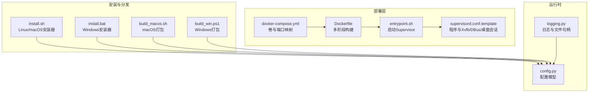
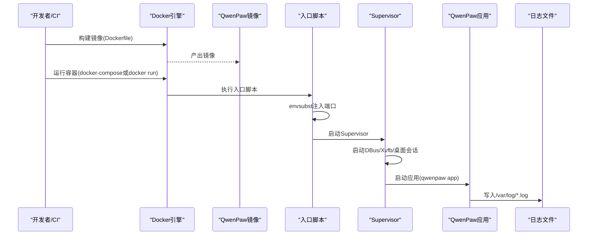
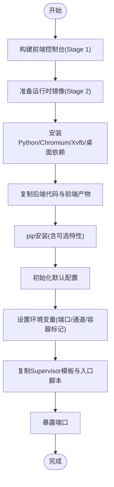
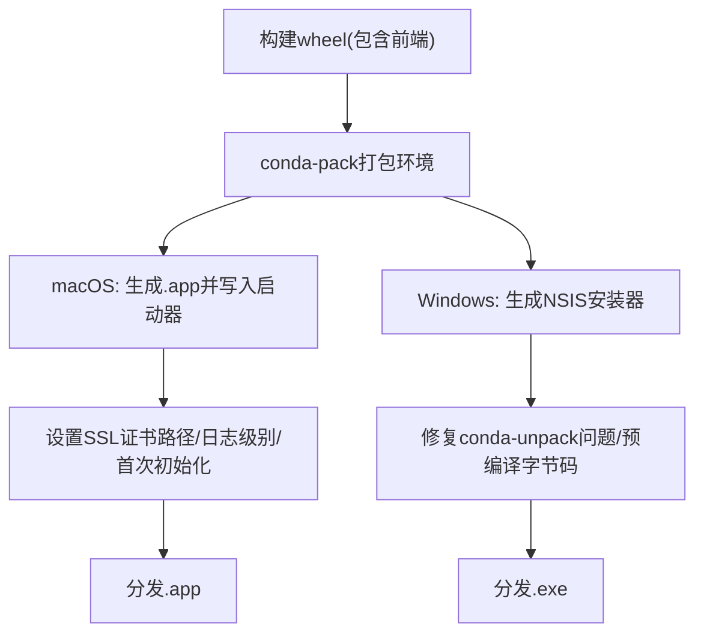
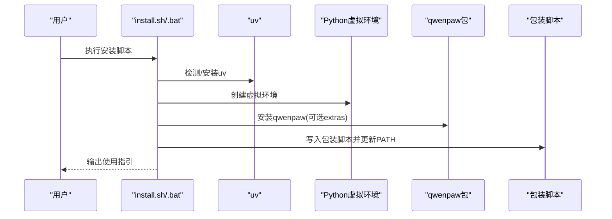
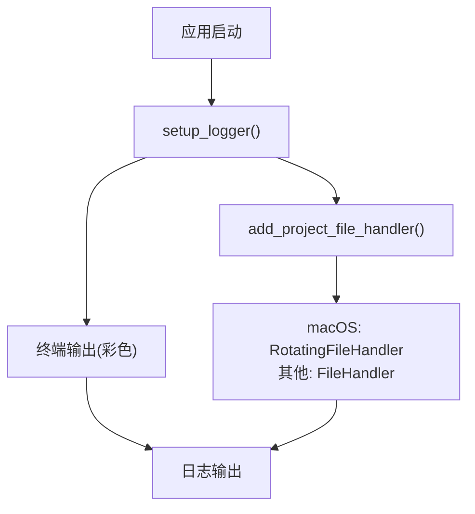
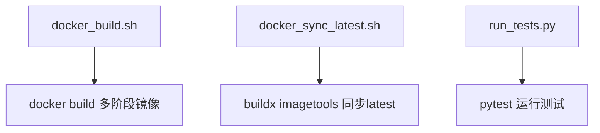
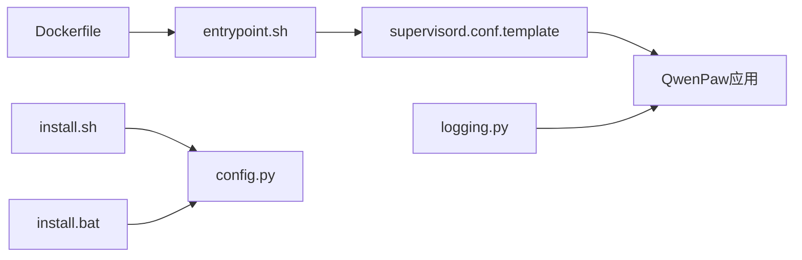

# 部署运维

<cite>
**本文引用的文件**
- [deploy/Dockerfile](file://deploy/Dockerfile)
- [deploy/entrypoint.sh](file://deploy/entrypoint.sh)
- [deploy/config/supervisord.conf.template](file://deploy/config/supervisord.conf.template)
- [docker-compose.yml](file://docker-compose.yml)
- [scripts/docker_build.sh](file://scripts/docker_build.sh)
- [scripts/docker_sync_latest.sh](file://scripts/docker_sync_latest.sh)
- [scripts/install.sh](file://scripts/install.sh)
- [scripts/install.bat](file://scripts/install.bat)
- [scripts/pack/build_macos.sh](file://scripts/pack/build_macos.sh)
- [scripts/pack/build_win.ps1](file://scripts/pack/build_win.ps1)
- [src/qwenpaw/utils/logging.py](file://src/qwenpaw/utils/logging.py)
- [src/qwenpaw/config/config.py](file://src/qwenpaw/config/config.py)
- [SECURITY.md](file://SECURITY.md)
- [scripts/run_tests.py](file://scripts/run_tests.py)
</cite>

## 目录
1. [简介](#简介)
2. [项目结构](#项目结构)
3. [核心组件](#核心组件)
4. [架构总览](#架构总览)
5. [详细组件分析](#详细组件分析)
6. [依赖分析](#依赖分析)
7. [性能考虑](#性能考虑)
8. [故障排除指南](#故障排除指南)
9. [结论](#结论)
10. [附录](#附录)

## 简介
本文件面向QwenPaw在生产环境中的部署与运维，覆盖以下主题：
- 多种部署选项：Docker容器化部署、桌面应用分发（macOS/Windows）、源码安装
- Docker镜像构建：多阶段构建、依赖管理、运行时安全配置
- 生产环境配置管理：环境变量、配置文件、密钥管理
- 监控与日志：日志配置、性能监控与错误追踪
- 运维脚本：自动化部署、备份恢复、升级流程
- 负载均衡与高可用：基于现有组件的扩展建议
- 故障排除与应急响应
- 性能调优与容量规划
- 安全加固与合规

## 项目结构
本仓库采用“后端Python包 + 前端控制台 + 部署与打包脚本”的组织方式。与部署运维直接相关的目录与文件如下：
- deploy：Docker镜像定义、入口脚本、Supervisor模板
- scripts：安装器、打包器、测试运行器、Docker构建与同步脚本
- src/qwenpaw：核心业务逻辑、配置模型、日志工具
- docker-compose.yml：本地编排示例

**图表来源**
- [deploy/Dockerfile:1-103](file://deploy/Dockerfile#L1-L103)
- [deploy/entrypoint.sh:1-10](file://deploy/entrypoint.sh#L1-L10)
- [deploy/config/supervisord.conf.template:1-40](file://deploy/config/supervisord.conf.template#L1-L40)
- [docker-compose.yml:1-23](file://docker-compose.yml#L1-L23)
- [scripts/install.sh:1-340](file://scripts/install.sh#L1-L340)
- [scripts/install.bat:1-557](file://scripts/install.bat#L1-L557)
- [scripts/pack/build_macos.sh:1-184](file://scripts/pack/build_macos.sh#L1-L184)
- [scripts/pack/build_win.ps1:1-325](file://scripts/pack/build_win.ps1#L1-L325)
- [src/qwenpaw/utils/logging.py:1-202](file://src/qwenpaw/utils/logging.py#L1-L202)
- [src/qwenpaw/config/config.py:1-800](file://src/qwenpaw/config/config.py#L1-L800)

**章节来源**
- [deploy/Dockerfile:1-103](file://deploy/Dockerfile#L1-L103)
- [deploy/entrypoint.sh:1-10](file://deploy/entrypoint.sh#L1-L10)
- [deploy/config/supervisord.conf.template:1-40](file://deploy/config/supervisord.conf.template#L1-L40)
- [docker-compose.yml:1-23](file://docker-compose.yml#L1-L23)
- [scripts/install.sh:1-340](file://scripts/install.sh#L1-L340)
- [scripts/install.bat:1-557](file://scripts/install.bat#L1-L557)
- [scripts/pack/build_macos.sh:1-184](file://scripts/pack/build_macos.sh#L1-L184)
- [scripts/pack/build_win.ps1:1-325](file://scripts/pack/build_win.ps1#L1-L325)
- [src/qwenpaw/utils/logging.py:1-202](file://src/qwenpaw/utils/logging.py#L1-L202)
- [src/qwenpaw/config/config.py:1-800](file://src/qwenpaw/config/config.py#L1-L800)

## 核心组件
- Docker镜像与运行时
  - 多阶段构建：前端控制台构建与后端Python打包分离；运行时镜像包含Chromium、Xvfb、桌面会话与Supervisor
  - 环境变量：端口、工作目录、通道白名单/黑名单、容器运行标记
  - 入口脚本：通过envsubst注入端口到Supervisor模板，再启动Supervisor
- Supervisor进程编排
  - 启动DBus、Xvfb、桌面会话与应用进程；统一输出日志至/var/log
- 安装与分发
  - Linux/macOS：install.sh通过uv管理Python环境，支持从PyPI或源码安装，自动准备控制台资源
  - Windows：install.bat通过uv安装，兼容多种路径与网络环境
  - 桌面打包：build_macos.sh与build_win.ps1生成可分发的应用包，内置SSL证书路径与启动器
- 日志与配置
  - logging.py：彩色终端输出、文件轮转、访问日志过滤
  - config.py：通道、心跳、代理、嵌入、上下文压缩、工具结果压缩等配置模型

**章节来源**
- [deploy/Dockerfile:1-103](file://deploy/Dockerfile#L1-L103)
- [deploy/entrypoint.sh:1-10](file://deploy/entrypoint.sh#L1-L10)
- [deploy/config/supervisord.conf.template:1-40](file://deploy/config/supervisord.conf.template#L1-L40)
- [scripts/install.sh:1-340](file://scripts/install.sh#L1-L340)
- [scripts/install.bat:1-557](file://scripts/install.bat#L1-L557)
- [scripts/pack/build_macos.sh:1-184](file://scripts/pack/build_macos.sh#L1-L184)
- [scripts/pack/build_win.ps1:1-325](file://scripts/pack/build_win.ps1#L1-L325)
- [src/qwenpaw/utils/logging.py:1-202](file://src/qwenpaw/utils/logging.py#L1-L202)
- [src/qwenpaw/config/config.py:1-800](file://src/qwenpaw/config/config.py#L1-L800)

## 架构总览
下图展示容器化部署的端到端流程：镜像构建、容器启动、Supervisor编排、应用进程与日志输出。

**图表来源**
- [deploy/Dockerfile:1-103](file://deploy/Dockerfile#L1-L103)
- [deploy/entrypoint.sh:1-10](file://deploy/entrypoint.sh#L1-L10)
- [deploy/config/supervisord.conf.template:1-40](file://deploy/config/supervisord.conf.template#L1-L40)
- [docker-compose.yml:1-23](file://docker-compose.yml#L1-L23)

## 详细组件分析

### Docker容器化部署
- 多阶段构建
  - 第一阶段：使用Node基础镜像构建前端控制台，产物复制到最终镜像
  - 第二阶段：安装Python、Chromium、Xvfb、桌面环境与Supervisor，复制后端代码与前端产物，pip安装包与可选特性
- 运行时依赖与安全
  - 安装Chromium并启用无沙箱模式以适配容器环境
  - 设置Playwright相关环境变量避免下载浏览器
  - 通过环境变量控制通道白名单/黑名单
- 入口与编排
  - 入口脚本读取端口环境变量，替换Supervisor模板并启动Supervisor
  - Supervisor统一管理DBus、Xvfb、桌面会话与应用进程，并重定向标准输出/错误到文件

**图表来源**
- [deploy/Dockerfile:1-103](file://deploy/Dockerfile#L1-L103)
- [deploy/entrypoint.sh:1-10](file://deploy/entrypoint.sh#L1-L10)
- [deploy/config/supervisord.conf.template:1-40](file://deploy/config/supervisord.conf.template#L1-L40)

**章节来源**
- [deploy/Dockerfile:1-103](file://deploy/Dockerfile#L1-L103)
- [deploy/entrypoint.sh:1-10](file://deploy/entrypoint.sh#L1-L10)
- [deploy/config/supervisord.conf.template:1-40](file://deploy/config/supervisord.conf.template#L1-L40)
- [docker-compose.yml:1-23](file://docker-compose.yml#L1-L23)

### 桌面应用分发（macOS/Windows）
- macOS
  - 通过build_macos.sh构建wheel、打包conda环境、生成.app并写入启动器
  - 启动器设置SSL证书路径、日志级别、首次运行初始化
- Windows
  - 通过build_win.ps1构建wheel、打包环境、修复conda-unpack问题、生成NSIS安装器
  - 提供隐藏与可见两种启动器批处理，便于调试与发布

**图表来源**
- [scripts/pack/build_macos.sh:1-184](file://scripts/pack/build_macos.sh#L1-L184)
- [scripts/pack/build_win.ps1:1-325](file://scripts/pack/build_win.ps1#L1-L325)

**章节来源**
- [scripts/pack/build_macos.sh:1-184](file://scripts/pack/build_macos.sh#L1-L184)
- [scripts/pack/build_win.ps1:1-325](file://scripts/pack/build_win.ps1#L1-L325)

### 源码安装（Linux/macOS/Windows）
- Linux/macOS
  - install.sh检测并安装uv，创建Python虚拟环境，支持从PyPI或源码安装，自动准备控制台资源
  - 创建包装脚本，更新用户shell PATH，提示后续初始化与启动步骤
- Windows
  - install.bat支持从PyPI或源码安装，自动下载uv（支持GitHub Releases回退），更新用户环境变量PATH

**图表来源**
- [scripts/install.sh:1-340](file://scripts/install.sh#L1-L340)
- [scripts/install.bat:1-557](file://scripts/install.bat#L1-L557)

**章节来源**
- [scripts/install.sh:1-340](file://scripts/install.sh#L1-L340)
- [scripts/install.bat:1-557](file://scripts/install.bat#L1-L557)

### 配置管理与密钥管理
- 配置模型
  - config.py定义了通道、心跳、嵌入、上下文压缩、工具结果压缩、运行时行为等配置模型
  - 支持按通道粒度开启/禁用、策略（开放/白名单）、媒体目录等
- 密钥与凭证
  - 通过环境变量或配置文件注入（如各通道的token、secret等）
  - 建议将敏感信息置于独立卷/密钥管理服务中，避免硬编码于镜像或配置文件

**章节来源**
- [src/qwenpaw/config/config.py:1-800](file://src/qwenpaw/config/config.py#L1-L800)

### 监控与日志
- 日志配置
  - logging.py提供彩色终端输出、文件句柄、跨平台日志轮转（macOS使用RotatingFileHandler，其他平台使用普通FileHandler）
  - 支持抑制特定访问日志（如uvicorn access日志）以降低噪声
- 运行时日志位置
  - Supervisor模板将应用、Xvfb、桌面会话与DBus的标准输出/错误重定向到/var/log目录

**图表来源**
- [src/qwenpaw/utils/logging.py:1-202](file://src/qwenpaw/utils/logging.py#L1-L202)
- [deploy/config/supervisord.conf.template:1-40](file://deploy/config/supervisord.conf.template#L1-L40)

**章节来源**
- [src/qwenpaw/utils/logging.py:1-202](file://src/qwenpaw/utils/logging.py#L1-L202)
- [deploy/config/supervisord.conf.template:1-40](file://deploy/config/supervisord.conf.template#L1-L40)

### 运维脚本使用指南
- Docker构建与同步
  - scripts/docker_build.sh：多阶段构建镜像，支持通道白名单/黑名单构建参数
  - scripts/docker_sync_latest.sh：使用buildx imagetools将pre标签同步为latest标签（阿里云镜像仓库与Docker Hub）
- 自动化测试
  - scripts/run_tests.py：统一运行单元/集成测试，支持覆盖率与并行执行

**图表来源**
- [scripts/docker_build.sh:1-32](file://scripts/docker_build.sh#L1-L32)
- [scripts/docker_sync_latest.sh:1-77](file://scripts/docker_sync_latest.sh#L1-L77)
- [scripts/run_tests.py:1-282](file://scripts/run_tests.py#L1-L282)

**章节来源**
- [scripts/docker_build.sh:1-32](file://scripts/docker_build.sh#L1-L32)
- [scripts/docker_sync_latest.sh:1-77](file://scripts/docker_sync_latest.sh#L1-L77)
- [scripts/run_tests.py:1-282](file://scripts/run_tests.py#L1-L282)

### 负载均衡与高可用
- 当前实现
  - 单实例容器运行，Supervisor管理多个子进程（DBus、Xvfb、桌面会话、应用）
- 扩展建议
  - 使用反向代理（如Nginx/HAProxy）进行请求转发与健康检查
  - 多实例部署：通过容器编排（Compose/Kubernetes）或云平台服务网格实现横向扩展
  - 数据持久化：将工作目录与密钥目录挂载为独立卷，确保滚动升级时数据不丢失
  - 健康检查：基于应用端口与内部探针（如HTTP健康接口）实现自动重启与故障转移

[本节为概念性建议，不直接分析具体文件，故无“章节来源”]

### 安全加固与合规
- 安全策略与信任模型
  - 项目提供安全政策文档，明确报告流程、范围与信任边界
  - 不推荐共享实例承载互不信任的多用户；建议按用户/主机隔离
- 运行时安全
  - Docker运行时建议非root用户、只读挂载、最小权限能力
  - 控制台与应用的敏感信息应置于独立卷或密钥管理服务
- 安装与分发安全
  - 安装器自动选择PyPI镜像并清理旧虚拟环境，减少残留风险
  - Windows安装器对输入进行安全校验，防止注入

**章节来源**
- [SECURITY.md:1-158](file://SECURITY.md#L1-L158)
- [scripts/install.sh:1-340](file://scripts/install.sh#L1-L340)
- [scripts/install.bat:1-557](file://scripts/install.bat#L1-L557)

## 依赖分析
- 组件耦合
  - Dockerfile与entrypoint.sh强耦合：端口由环境变量驱动，Supervisor模板需与入口脚本配合
  - Supervisor模板与应用进程耦合：DBus/Xvfb/桌面会话为应用提供图形环境
  - 安装器与配置模块耦合：安装后首次运行会初始化配置
- 外部依赖
  - Docker、Node/npm、NSIS（Windows打包）、uv（Python包与虚拟环境管理）

**图表来源**
- [deploy/Dockerfile:1-103](file://deploy/Dockerfile#L1-L103)
- [deploy/entrypoint.sh:1-10](file://deploy/entrypoint.sh#L1-L10)
- [deploy/config/supervisord.conf.template:1-40](file://deploy/config/supervisord.conf.template#L1-L40)
- [scripts/install.sh:1-340](file://scripts/install.sh#L1-L340)
- [scripts/install.bat:1-557](file://scripts/install.bat#L1-L557)
- [src/qwenpaw/config/config.py:1-800](file://src/qwenpaw/config/config.py#L1-L800)
- [src/qwenpaw/utils/logging.py:1-202](file://src/qwenpaw/utils/logging.py#L1-L202)

**章节来源**
- [deploy/Dockerfile:1-103](file://deploy/Dockerfile#L1-L103)
- [deploy/entrypoint.sh:1-10](file://deploy/entrypoint.sh#L1-L10)
- [deploy/config/supervisord.conf.template:1-40](file://deploy/config/supervisord.conf.template#L1-L40)
- [scripts/install.sh:1-340](file://scripts/install.sh#L1-L340)
- [scripts/install.bat:1-557](file://scripts/install.bat#L1-L557)
- [src/qwenpaw/config/config.py:1-800](file://src/qwenpaw/config/config.py#L1-L800)
- [src/qwenpaw/utils/logging.py:1-202](file://src/qwenpaw/utils/logging.py#L1-L202)

## 性能考虑
- 日志与IO
  - 文件轮转与跨平台文件句柄差异，建议在生产环境使用macOS的RotatingFileHandler以避免锁竞争
- 进程与资源
  - Supervisor统一管理DBus/Xvfb/桌面会话，避免多进程冲突；合理设置日志级别与输出路径
- 测试与验证
  - 使用scripts/run_tests.py进行覆盖率与并行测试，确保变更稳定性

[本节提供通用指导，不直接分析具体文件，故无“章节来源”]

## 故障排除指南
- 容器启动失败
  - 检查端口占用与环境变量注入（入口脚本通过envsubst替换模板）
  - 查看/var/log下的应用、Xvfb、桌面会话与DBus日志
- 图形环境问题
  - 确认Chromium与Xvfb配置；容器内无沙箱模式已启用
- 安装器问题
  - Linux/macOS：确认uv安装成功、虚拟环境创建正常、控制台资源准备完成
  - Windows：确认PATH更新、用户环境变量设置成功
- 日志定位
  - 应用日志输出到/var/log；可通过日志过滤减少噪音

**章节来源**
- [deploy/entrypoint.sh:1-10](file://deploy/entrypoint.sh#L1-L10)
- [deploy/config/supervisord.conf.template:1-40](file://deploy/config/supervisord.conf.template#L1-L40)
- [scripts/install.sh:1-340](file://scripts/install.sh#L1-L340)
- [scripts/install.bat:1-557](file://scripts/install.bat#L1-L557)
- [src/qwenpaw/utils/logging.py:1-202](file://src/qwenpaw/utils/logging.py#L1-L202)

## 结论
本文档系统梳理了QwenPaw的多部署选项与运维实践，重点覆盖容器化、桌面分发与源码安装的实现细节，以及配置、日志、监控、安全与高可用的工程化建议。结合提供的脚本与模板，可在生产环境中实现稳定、可观测且可扩展的部署与运维。

## 附录
- 快速参考
  - 容器构建：bash scripts/docker_build.sh [镜像标签] [额外参数]
  - 同步latest：bash scripts/docker_sync_latest.sh
  - 本地编排：docker-compose up -d
  - 测试运行：python scripts/run_tests.py -a -c -p

[本节为操作指引汇总，不直接分析具体文件，故无“章节来源”]