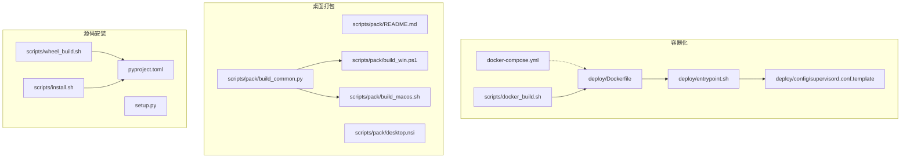
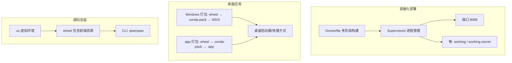
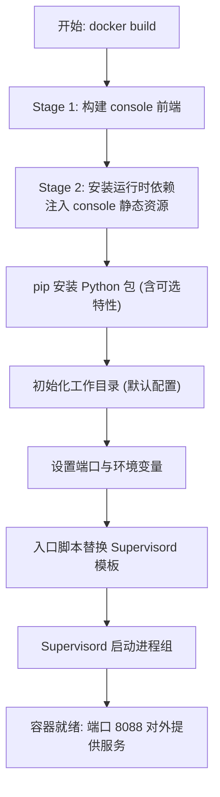
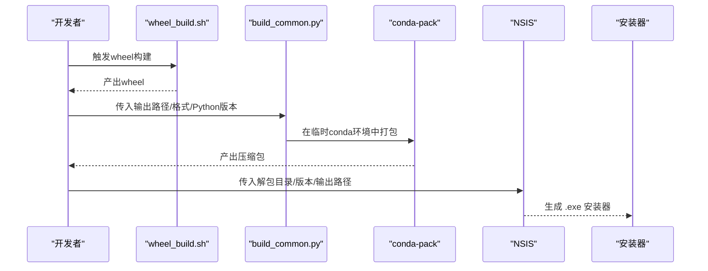
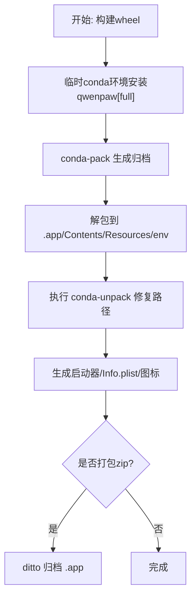
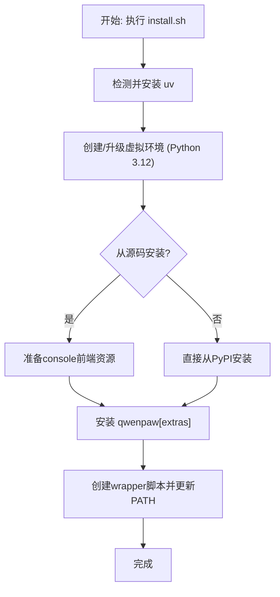
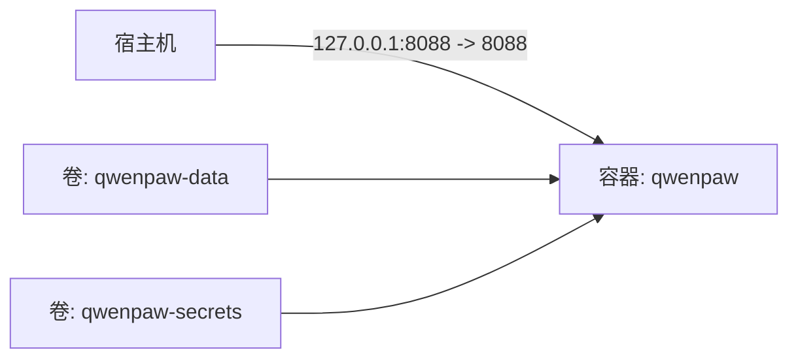
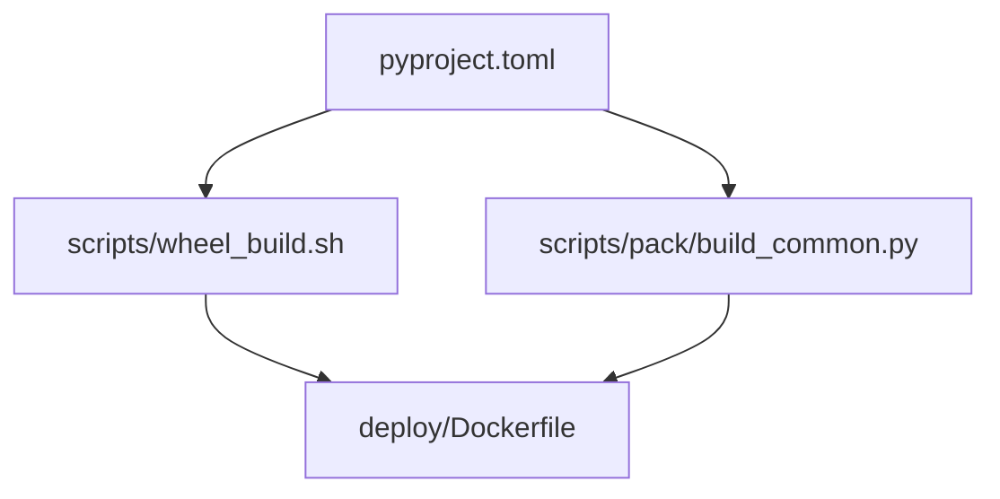

# 部署选项

<cite>
**本文引用的文件**
- [deploy/Dockerfile](file://deploy/Dockerfile)
- [scripts/docker_build.sh](file://scripts/docker_build.sh)
- [docker-compose.yml](file://docker-compose.yml)
- [deploy/entrypoint.sh](file://deploy/entrypoint.sh)
- [deploy/config/supervisord.conf.template](file://deploy/config/supervisord.conf.template)
- [scripts/pack/README.md](file://scripts/pack/README.md)
- [scripts/pack/build_win.ps1](file://scripts/pack/build_win.ps1)
- [scripts/pack/build_macos.sh](file://scripts/pack/build_macos.sh)
- [scripts/pack/desktop.nsi](file://scripts/pack/desktop.nsi)
- [scripts/pack/build_common.py](file://scripts/pack/build_common.py)
- [scripts/install.sh](file://scripts/install.sh)
- [scripts/wheel_build.sh](file://scripts/wheel_build.sh)
- [pyproject.toml](file://pyproject.toml)
- [setup.py](file://setup.py)
- [scripts/README.md](file://scripts/README.md)
</cite>

## 目录
1. [简介](#简介)
2. [项目结构](#项目结构)
3. [核心组件](#核心组件)
4. [架构总览](#架构总览)
5. [详细组件分析](#详细组件分析)
6. [依赖关系分析](#依赖关系分析)
7. [性能考量](#性能考量)
8. [故障排查指南](#故障排查指南)
9. [结论](#结论)
10. [附录](#附录)

## 简介
本文件面向QwenPaw的多种部署选项提供系统化技术文档，覆盖以下主题：
- Docker容器化部署：多阶段构建、依赖管理与镜像优化策略
- 桌面应用分发：Windows与macOS安装包制作流程
- 源码安装部署：环境准备、依赖安装与配置步骤
- docker-compose编排：服务定义、网络与卷配置
- 部署选项对比：适用场景、优缺点与性能表现
- 部署前检查清单与常见问题解决方案

## 项目结构
围绕部署相关的关键目录与文件如下：
- 容器化与编排
  - deploy/Dockerfile：多阶段构建（前端构建 + 运行时镜像）
  - deploy/entrypoint.sh：入口脚本，替换Supervisord模板并启动
  - deploy/config/supervisord.conf.template：Supervisord进程配置模板
  - docker-compose.yml：服务编排示例（端口映射、卷挂载）
  - scripts/docker_build.sh：封装docker build命令与构建参数
- 桌面应用打包
  - scripts/pack/README.md：打包说明与CI流程
  - scripts/pack/build_win.ps1：Windows打包（wheel → conda-pack → NSIS）
  - scripts/pack/build_macos.sh：macOS打包（wheel → conda-pack → .app）
  - scripts/pack/desktop.nsi：NSIS安装脚本
  - scripts/pack/build_common.py：通用打包逻辑（临时conda环境、conda-pack）
- 源码安装与打包
  - scripts/install.sh：uv驱动的跨平台安装器
  - scripts/wheel_build.sh：构建包含前端资源的wheel
  - pyproject.toml：项目元数据与可选依赖（full/ollama/llamacpp/mlx等）
  - setup.py：setuptools入口
- 脚本总览
  - scripts/README.md：常用脚本用法

**图表来源**
- [deploy/Dockerfile:1-103](file://deploy/Dockerfile#L1-L103)
- [deploy/entrypoint.sh:1-10](file://deploy/entrypoint.sh#L1-L10)
- [deploy/config/supervisord.conf.template:1-40](file://deploy/config/supervisord.conf.template#L1-L40)
- [docker-compose.yml:1-23](file://docker-compose.yml#L1-L23)
- [scripts/docker_build.sh:1-32](file://scripts/docker_build.sh#L1-L32)
- [scripts/pack/README.md:1-93](file://scripts/pack/README.md#L1-L93)
- [scripts/pack/build_win.ps1:1-325](file://scripts/pack/build_win.ps1#L1-L325)
- [scripts/pack/build_macos.sh:1-184](file://scripts/pack/build_macos.sh#L1-L184)
- [scripts/pack/desktop.nsi:1-57](file://scripts/pack/desktop.nsi#L1-L57)
- [scripts/pack/build_common.py:1-321](file://scripts/pack/build_common.py#L1-L321)
- [scripts/install.sh:1-340](file://scripts/install.sh#L1-L340)
- [scripts/wheel_build.sh:1-28](file://scripts/wheel_build.sh#L1-L28)
- [pyproject.toml:1-111](file://pyproject.toml#L1-L111)
- [setup.py:1-5](file://setup.py#L1-L5)

**章节来源**
- [scripts/README.md:1-53](file://scripts/README.md#L1-L53)

## 核心组件
- Docker多阶段构建
  - 前端构建阶段：在独立节点中构建console前端，产物复制到运行时镜像
  - 运行时阶段：安装Python、Chromium、Supervisord等运行时依赖；注入console静态资源；安装Python包（含可选特性）；初始化工作目录；通过Supervisord托管应用进程
- docker-compose编排
  - 默认暴露本地回环端口映射至容器端口；持久化工作目录与密钥目录
- 桌面应用打包
  - Windows：wheel → conda-pack → 解包 → NSIS安装器
  - macOS：wheel → conda-pack → .app → 可选zip归档
- 源码安装
  - 使用uv创建隔离虚拟环境，按需安装可选特性；支持从源码或PyPI安装；自动更新shell PATH

**章节来源**
- [deploy/Dockerfile:1-103](file://deploy/Dockerfile#L1-L103)
- [scripts/docker_build.sh:1-32](file://scripts/docker_build.sh#L1-L32)
- [docker-compose.yml:1-23](file://docker-compose.yml#L1-L23)
- [deploy/entrypoint.sh:1-10](file://deploy/entrypoint.sh#L1-L10)
- [deploy/config/supervisord.conf.template:1-40](file://deploy/config/supervisord.conf.template#L1-L40)
- [scripts/pack/README.md:1-93](file://scripts/pack/README.md#L1-L93)
- [scripts/pack/build_win.ps1:1-325](file://scripts/pack/build_win.ps1#L1-L325)
- [scripts/pack/build_macos.sh:1-184](file://scripts/pack/build_macos.sh#L1-L184)
- [scripts/pack/desktop.nsi:1-57](file://scripts/pack/desktop.nsi#L1-L57)
- [scripts/pack/build_common.py:1-321](file://scripts/pack/build_common.py#L1-L321)
- [scripts/install.sh:1-340](file://scripts/install.sh#L1-L340)
- [scripts/wheel_build.sh:1-28](file://scripts/wheel_build.sh#L1-L28)
- [pyproject.toml:1-111](file://pyproject.toml#L1-L111)
- [setup.py:1-5](file://setup.py#L1-L5)

## 架构总览
下图展示三种部署路径的总体架构与关键交互点。

**图表来源**
- [deploy/Dockerfile:1-103](file://deploy/Dockerfile#L1-L103)
- [deploy/config/supervisord.conf.template:1-40](file://deploy/config/supervisord.conf.template#L1-L40)
- [scripts/pack/build_win.ps1:1-325](file://scripts/pack/build_win.ps1#L1-L325)
- [scripts/pack/build_macos.sh:1-184](file://scripts/pack/build_macos.sh#L1-L184)
- [scripts/install.sh:1-340](file://scripts/install.sh#L1-L340)
- [scripts/wheel_build.sh:1-28](file://scripts/wheel_build.sh#L1-L28)

## 详细组件分析

### Docker容器化部署
- 多阶段构建
  - 阶段一：在专用Node镜像中构建console前端，产物复制到运行时镜像
  - 阶段二：安装Python、Chromium、Supervisord等；注入console静态资源；pip安装Python包（含可选特性）；初始化工作目录；设置默认端口
- 运行时环境
  - 通过环境变量控制通道启用/禁用（白名单/黑名单）
  - 容器内使用Supervisord管理DBus、Xvfb、XFCE与应用进程
  - 通过入口脚本动态替换Supervisord模板中的端口号
- 镜像优化策略
  - 分离前端构建与运行时层，减少重复缓存失效
  - 合理的apt清理与多阶段COPY，降低镜像体积
  - 使用Supervisord统一管理进程，避免僵尸进程与孤儿进程
- docker-compose编排
  - 默认仅映射本地回环地址，便于本地开发与演示
  - 卷挂载用于持久化工作目录与密钥目录
  - 可通过环境变量开启认证等高级功能

**图表来源**
- [deploy/Dockerfile:1-103](file://deploy/Dockerfile#L1-L103)
- [deploy/entrypoint.sh:1-10](file://deploy/entrypoint.sh#L1-L10)
- [deploy/config/supervisord.conf.template:1-40](file://deploy/config/supervisord.conf.template#L1-L40)

**章节来源**
- [deploy/Dockerfile:1-103](file://deploy/Dockerfile#L1-L103)
- [scripts/docker_build.sh:1-32](file://scripts/docker_build.sh#L1-L32)
- [docker-compose.yml:1-23](file://docker-compose.yml#L1-L23)
- [deploy/entrypoint.sh:1-10](file://deploy/entrypoint.sh#L1-L10)
- [deploy/config/supervisord.conf.template:1-40](file://deploy/config/supervisord.conf.template#L1-L40)

### 桌面应用分发（Windows）
- 流程概览
  - 构建wheel（包含最新console前端）
  - 创建临时conda环境，安装qwenpaw[full]，执行conda-pack生成压缩包
  - 解包到win-unpacked目录
  - 修复conda-unpack在Windows上的字符串转义问题（重装受影响包）
  - 预编译Python字节码以提升启动速度
  - 生成启动器（VBS隐藏窗口、BAT显示窗口）、图标
  - 使用NSIS编译安装器
- 关键要点
  - 通过build_common.py统一处理conda环境与打包
  - 修复Windows特有的conda-unpack缺陷，确保第三方库可用性
  - 生成调试与非调试两种启动器，便于问题定位

**图表来源**
- [scripts/wheel_build.sh:1-28](file://scripts/wheel_build.sh#L1-L28)
- [scripts/pack/build_common.py:1-321](file://scripts/pack/build_common.py#L1-L321)
- [scripts/pack/build_win.ps1:1-325](file://scripts/pack/build_win.ps1#L1-L325)
- [scripts/pack/desktop.nsi:1-57](file://scripts/pack/desktop.nsi#L1-L57)

**章节来源**
- [scripts/pack/README.md:1-93](file://scripts/pack/README.md#L1-L93)
- [scripts/pack/build_win.ps1:1-325](file://scripts/pack/build_win.ps1#L1-L325)
- [scripts/pack/desktop.nsi:1-57](file://scripts/pack/desktop.nsi#L1-L57)
- [scripts/pack/build_common.py:1-321](file://scripts/pack/build_common.py#L1-L321)

### 桌面应用分发（macOS）
- 流程概览
  - 构建wheel
  - 临时conda环境安装qwenpaw[full]，conda-pack生成归档
  - 解包到QwenPaw.app/Contents/Resources/env
  - 执行conda-unpack修复路径
  - 生成app启动器、Info.plist与图标
  - 可选：对.app进行zip归档
- 关键要点
  - 启动器强制使用打包环境，设置SSL证书路径
  - 首次运行会初始化配置文件
  - 提供日志文件位置以便问题诊断

**图表来源**
- [scripts/pack/build_macos.sh:1-184](file://scripts/pack/build_macos.sh#L1-L184)
- [scripts/pack/build_common.py:1-321](file://scripts/pack/build_common.py#L1-L321)

**章节来源**
- [scripts/pack/README.md:1-93](file://scripts/pack/README.md#L1-L93)
- [scripts/pack/build_macos.sh:1-184](file://scripts/pack/build_macos.sh#L1-L184)

### 源码安装部署
- 安装器能力
  - 自动选择PyPI镜像（国内/海外）
  - 使用uv创建隔离Python环境，支持指定版本与可选特性
  - 支持从源码或GitHub安装，并自动准备console前端资源
  - 生成wrapper脚本并更新shell profile
- 可选特性
  - full：包含本地模型、Ollama、Whisper与MLX（macOS）
  - llamacpp：本地模型推理后端
  - mlx：macOS上的Metal加速
  - ollama：外部Ollama服务
- 兼容性
  - 仅支持Linux与macOS（由安装器检测）

**图表来源**
- [scripts/install.sh:1-340](file://scripts/install.sh#L1-L340)
- [pyproject.toml:75-103](file://pyproject.toml#L75-L103)

**章节来源**
- [scripts/install.sh:1-340](file://scripts/install.sh#L1-L340)
- [pyproject.toml:75-103](file://pyproject.toml#L75-L103)

### docker-compose编排配置
- 服务定义
  - 服务名：qwenpaw
  - 镜像：agentscope/qwenpaw:latest
  - 重启策略：always
- 网络配置
  - 将宿主机127.0.0.1:8088映射到容器端口8088
- 卷挂载
  - 工作目录卷：/app/working
  - 密钥目录卷：/app/working.secret
- 环境变量
  - 可通过注释示例启用认证与设置用户名密码

**图表来源**
- [docker-compose.yml:1-23](file://docker-compose.yml#L1-L23)

**章节来源**
- [docker-compose.yml:1-23](file://docker-compose.yml#L1-L23)

## 依赖关系分析
- Python包与可选特性
  - 项目主依赖集中在pyproject.toml的dependencies字段
  - 可选特性通过optional-dependencies定义，如full、ollama、llamacpp、mlx、whisper
  - wheel_build.sh确保console前端资源被复制到包内，便于安装后直接使用
- 容器镜像依赖
  - 运行时镜像安装Python、Chromium、Supervisord等，满足桌面自动化与Web服务需求
  - 通过环境变量控制通道启用/禁用，减少不必要依赖
- 桌面打包依赖
  - build_common.py负责在临时conda环境中安装qwenpaw[full]并执行conda-pack
  - Windows打包额外处理conda-unpack的已知缺陷

**图表来源**
- [pyproject.toml:1-111](file://pyproject.toml#L1-L111)
- [scripts/wheel_build.sh:1-28](file://scripts/wheel_build.sh#L1-L28)
- [deploy/Dockerfile:1-103](file://deploy/Dockerfile#L1-L103)
- [scripts/pack/build_common.py:1-321](file://scripts/pack/build_common.py#L1-L321)

**章节来源**
- [pyproject.toml:1-111](file://pyproject.toml#L1-L111)
- [scripts/wheel_build.sh:1-28](file://scripts/wheel_build.sh#L1-L28)
- [deploy/Dockerfile:1-103](file://deploy/Dockerfile#L1-L103)
- [scripts/pack/build_common.py:1-321](file://scripts/pack/build_common.py#L1-L321)

## 性能考量
- 容器化部署
  - 多阶段构建减少镜像体积与构建时间
  - Supervisord统一管理进程，避免后台进程泄漏
  - Chromium沙箱关闭与Xvfb/桌面环境配置影响图形渲染性能，建议在无头模式或最小化桌面场景下使用
- 桌面应用
  - 预编译Python字节码可缩短首次启动时间
  - macOS平台可利用MLX加速（条件满足时）
- 源码安装
  - uv虚拟环境隔离，避免系统级依赖冲突
  - 可按需安装可选特性，减少不必要的依赖

[本节为通用指导，无需特定文件引用]

## 故障排查指南
- 容器化部署
  - 端口占用：确认宿主机端口未被占用；修改映射或停止冲突服务
  - 权限与卷：确认卷目录存在且具备读写权限
  - 日志查看：通过Supervisord日志定位进程异常
- 桌面应用（Windows）
  - NSIS编译失败：确认makensis在PATH中；检查UNPACKED路径与版本参数
  - 启动器无法打开：使用调试启动器查看控制台输出
  - conda-unpack缺陷：确保受影响包已重装修复
- 桌面应用（macOS）
  - Gatekeeper阻止：右键“打开”或在系统设置中允许
  - 首次运行无界面：检查~/.qwenpaw/desktop.log
- 源码安装
  - uv未找到：按安装器提示安装或手动添加到PATH
  - PATH未更新：重新加载shell配置或新开终端

**章节来源**
- [scripts/pack/README.md:61-73](file://scripts/pack/README.md#L61-L73)
- [scripts/pack/build_win.ps1:297-320](file://scripts/pack/build_win.ps1#L297-L320)
- [scripts/install.sh:120-132](file://scripts/install.sh#L120-L132)

## 结论
- Docker适合快速上线与演示，具备良好的隔离性与可移植性
- 桌面应用适合个人使用与离线场景，提供更直观的用户体验
- 源码安装适合开发者与高级用户，便于定制与调试
- 建议根据团队运维能力与用户群体选择合适的部署方式，并结合实际环境进行性能与安全调优

[本节为总结性内容，无需特定文件引用]

## 附录
- 部署前检查清单
  - 容器化：Docker可用、磁盘空间充足、端口未占用
  - 桌面应用（Windows）：Node.js、NSIS、conda可用
  - 桌面应用（macOS）：Node.js、conda可用，系统版本满足要求
  - 源码安装：uv可用，网络可访问PyPI镜像
- 常见问题速查
  - 端口冲突：调整映射或停止占用进程
  - 权限不足：修正卷目录权限或以root运行
  - 启动失败：查看对应日志文件，优先检查Supervisord与桌面日志

[本节为通用指导，无需特定文件引用]