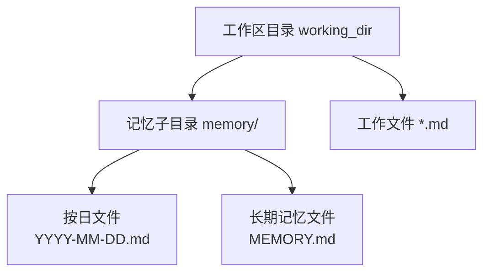
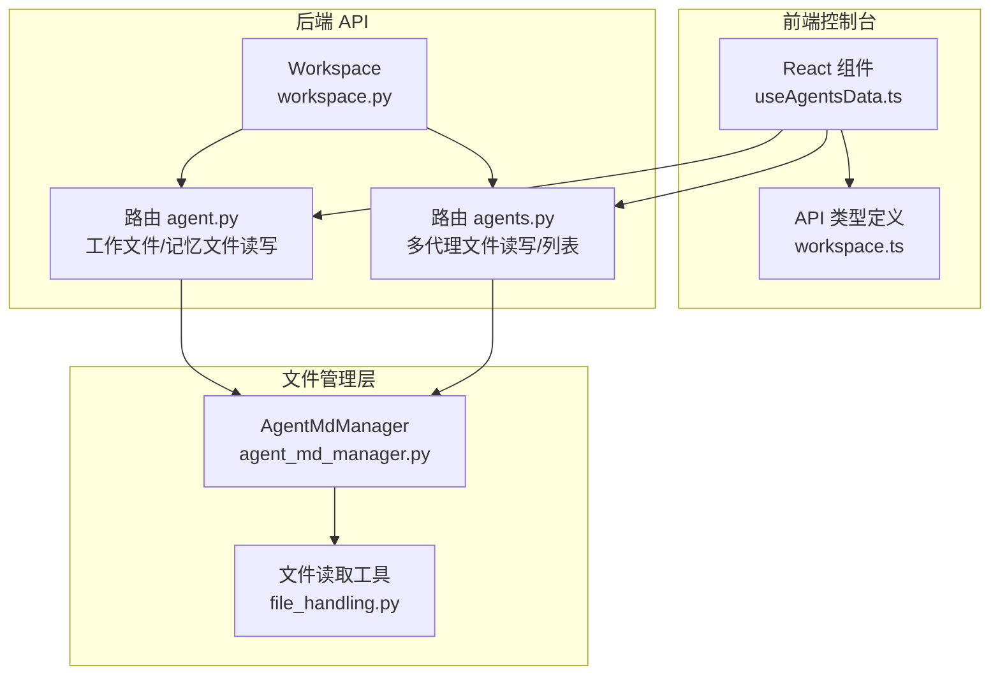
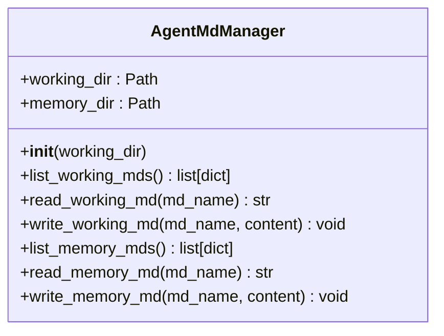
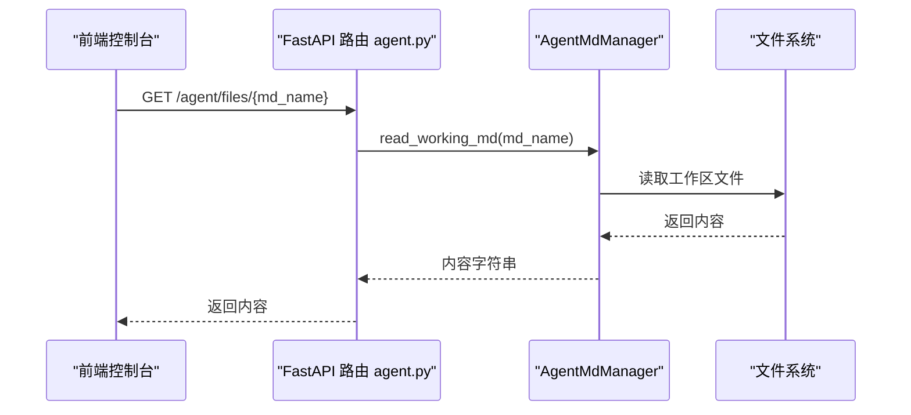
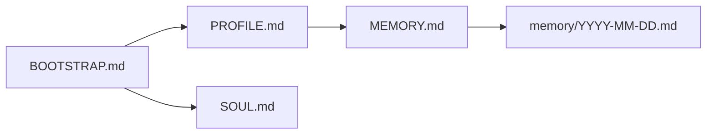
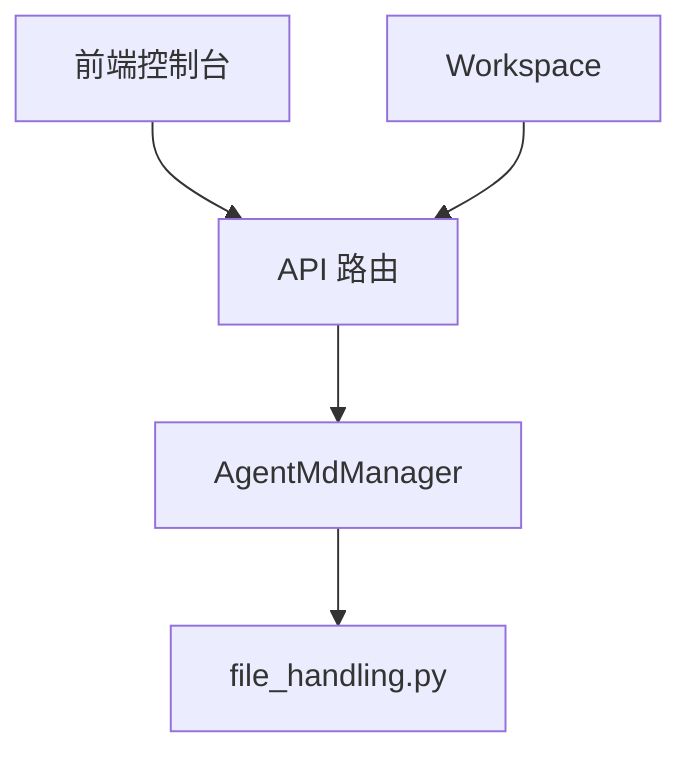

# 代理Markdown管理器

<cite>
**本文引用的文件**
- [agent_md_manager.py](file://src/qwenpaw/agents/memory/agent_md_manager.py)
- [file_handling.py](file://src/qwenpaw/agents/utils/file_handling.py)
- [agent.py](file://src/qwenpaw/app/routers/agent.py)
- [agents.py](file://src/qwenpaw/app/routers/agents.py)
- [workspace.py](file://src/qwenpaw/app/workspace/workspace.py)
- [BOOTSTRAP.md](file://src/qwenpaw/agents/md_files/zh/BOOTSTRAP.md)
- [MEMORY.md](file://src/qwenpaw/agents/md_files/zh/MEMORY.md)
- [PROFILE.md](file://src/qwenpaw/agents/md_files/zh/PROFILE.md)
- [files.py](file://src/qwenpaw/app/routers/files.py)
- [workspace.ts](file://console/src/api/types/workspace.ts)
- [useAgentsData.ts](file://console/src/pages/Agent/Workspace/components/useAgentsData.ts)
- [memory.en.md](file://website/public/docs/memory.en.md)
</cite>

## 目录
1. [简介](#简介)
2. [项目结构](#项目结构)
3. [核心组件](#核心组件)
4. [架构总览](#架构总览)
5. [详细组件分析](#详细组件分析)
6. [依赖分析](#依赖分析)
7. [性能考虑](#性能考虑)
8. [故障排查指南](#故障排查指南)
9. [结论](#结论)
10. [附录](#附录)

## 简介
本技术文档围绕 QwenPaw 的 AgentMdManager 代理 Markdown 管理器展开，系统性阐述其在工作区与记忆目录中的文件存储与管理机制、读写流程、编码兼容策略、代理特定的文件分类（工作文件与记忆文件）、以及与后端 API、前端控制台的集成方式。文档同时覆盖文件命名规范、目录结构组织、权限控制建议、版本控制与变更追踪思路、批量操作能力、搜索与过滤、备份与恢复策略，以及与外部编辑器的集成与文件同步机制。

## 项目结构
AgentMdManager 位于 Python 后端 agents 子模块中，负责在每个代理的工作区目录下维护两类 Markdown 文件：
- 工作目录（working_dir）：存放代理日常使用的 Markdown 文件，如引导文件、配置说明等。
- 记忆目录（working_dir/memory）：存放长期记忆与每日记忆文件，用于持久化关键信息与运行时上下文。

图表来源
- [agent_md_manager.py:14-19](file://src/qwenpaw/agents/memory/agent_md_manager.py#L14-L19)

章节来源
- [agent_md_manager.py:14-19](file://src/qwenpaw/agents/memory/agent_md_manager.py#L14-L19)

## 核心组件
- AgentMdManager：封装工作区与记忆目录的文件读写、列表与元数据获取；提供工作文件与记忆文件的独立操作接口。
- 文件读取工具 read_text_file_with_encoding_fallback：支持多编码回退读取，提升跨平台兼容性。
- FastAPI 路由层：提供工作文件与记忆文件的读写 API，以及代理语言切换与种子文件复制逻辑。
- 前端控制台：通过 API 类型与 Hook 获取文件列表、内容并进行编辑与保存。

章节来源
- [agent_md_manager.py:10-126](file://src/qwenpaw/agents/memory/agent_md_manager.py#L10-L126)
- [file_handling.py:31-102](file://src/qwenpaw/agents/utils/file_handling.py#L31-L102)
- [agent.py:62-177](file://src/qwenpaw/app/routers/agent.py#L62-L177)
- [agents.py:459-530](file://src/qwenpaw/app/routers/agents.py#L459-L530)
- [workspace.ts:1-21](file://console/src/api/types/workspace.ts#L1-L21)
- [useAgentsData.ts:16-28](file://console/src/pages/Agent/Workspace/components/useAgentsData.ts#L16-L28)

## 架构总览
AgentMdManager 作为后端文件管理的核心，被 API 路由调用以实现对代理工作区文件的统一访问。前端控制台通过 API 类型与 Hook 与后端交互，完成文件的浏览、编辑与保存。

图表来源
- [agent.py:62-177](file://src/qwenpaw/app/routers/agent.py#L62-L177)
- [agents.py:459-530](file://src/qwenpaw/app/routers/agents.py#L459-L530)
- [agent_md_manager.py:10-126](file://src/qwenpaw/agents/memory/agent_md_manager.py#L10-L126)
- [file_handling.py:31-102](file://src/qwenpaw/agents/utils/file_handling.py#L31-L102)
- [workspace.py:47-130](file://src/qwenpaw/app/workspace/workspace.py#L47-L130)
- [workspace.ts:1-21](file://console/src/api/types/workspace.ts#L1-L21)
- [useAgentsData.ts:16-28](file://console/src/pages/Agent/Workspace/components/useAgentsData.ts#L16-L28)

## 详细组件分析

### AgentMdManager 组件
- 职责
  - 初始化工作区与记忆目录，确保存在性。
  - 列举工作区与记忆目录中的 Markdown 文件，并返回包含文件名、路径、大小、创建与修改时间的元数据。
  - 读取与写入工作区与记忆目录中的 Markdown 文件，自动补全 .md 扩展名。
  - 使用编码回退策略读取文件，保证跨平台兼容。

图表来源
- [agent_md_manager.py:10-126](file://src/qwenpaw/agents/memory/agent_md_manager.py#L10-L126)

章节来源
- [agent_md_manager.py:14-126](file://src/qwenpaw/agents/memory/agent_md_manager.py#L14-L126)

### 文件读取工具
- 多编码回退策略：优先尝试带 BOM 的 UTF-8、UTF-8、GBK/CP936、CP1252/Latin-1，最终使用 UTF-8 错误替换兜底。
- 日志记录：对非 UTF-8 的编码读取进行调试日志记录，便于问题定位。
- 异常处理：对文件不存在与无法读取的情况抛出明确异常。

章节来源
- [file_handling.py:31-102](file://src/qwenpaw/agents/utils/file_handling.py#L31-L102)

### API 路由与文件管理
- 单代理工作文件读写
  - GET /agent/files/{md_name}：读取当前激活代理的工作区 Markdown 文件。
  - PUT /agent/files/{md_name}：创建或更新当前激活代理的工作区 Markdown 文件。
- 单代理记忆文件读写
  - GET /agent/memory：列出当前激活代理的记忆文件。
  - GET /agent/memory/{md_name}：读取当前激活代理的记忆文件。
  - PUT /agent/memory/{md_name}：创建或更新当前激活代理的记忆文件。
- 多代理工作文件读写
  - GET /agents/{agentId}/files：列出指定代理的工作区 Markdown 文件。
  - GET /agents/{agentId}/files/{filename}：读取指定代理的工作区 Markdown 文件。
  - PUT /agents/{agentId}/files/{filename}：创建或更新指定代理的工作区 Markdown 文件。
- 代理语言设置与种子文件复制
  - GET/PUT /agent/language：获取或更新代理语言设置，并在必要时复制内置 Markdown 文件至工作区。

图表来源
- [agent.py:62-106](file://src/qwenpaw/app/routers/agent.py#L62-L106)
- [agent_md_manager.py:51-72](file://src/qwenpaw/agents/memory/agent_md_manager.py#L51-L72)

章节来源
- [agent.py:62-177](file://src/qwenpaw/app/routers/agent.py#L62-L177)
- [agents.py:459-530](file://src/qwenpaw/app/routers/agents.py#L459-L530)

### 代理特定的 Markdown 文件分类
- 引导文件（BOOTSTRAP.md）：首次启动时的引导说明，帮助用户建立身份与对话框架。
- 配置与知识文件（PROFILE.md、MEMORY.md）：用于记录代理身份、用户资料与工具设置等知识。
- 记忆文件结构（MEMORY.md 与 daily logs）：长期记忆与按日记录的运行上下文，支撑语义检索与上下文加载。

图表来源
- [BOOTSTRAP.md:1-48](file://src/qwenpaw/agents/md_files/zh/BOOTSTRAP.md#L1-L48)
- [PROFILE.md:1-31](file://src/qwenpaw/agents/md_files/zh/PROFILE.md#L1-L31)
- [MEMORY.md:1-27](file://src/qwenpaw/agents/md_files/zh/MEMORY.md#L1-L27)
- [memory.en.md:37-67](file://website/public/docs/memory.en.md#L37-L67)

章节来源
- [BOOTSTRAP.md:1-48](file://src/qwenpaw/agents/md_files/zh/BOOTSTRAP.md#L1-L48)
- [PROFILE.md:1-31](file://src/qwenpaw/agents/md_files/zh/PROFILE.md#L1-L31)
- [MEMORY.md:1-27](file://src/qwenpaw/agents/md_files/zh/MEMORY.md#L1-L27)
- [memory.en.md:37-67](file://website/public/docs/memory.en.md#L37-L67)

### 文件命名规范与目录结构
- 文件命名
  - 自动补全 .md 扩展名：读写接口会自动为未带扩展名的文件名追加 .md。
  - 建议遵循语义化命名：如 PROFILE.md、MEMORY.md、HEARTBEAT.md、YYYY-MM-DD.md。
- 目录结构
  - 工作区根目录：存放工作文件。
  - 记忆目录：memory/ 下按日存放 YYYY-MM-DD.md，另可包含 MEMORY.md 作为长期记忆入口。
- 权限控制
  - 默认文件权限：由操作系统默认 umask 决定；建议在部署环境中限制写权限，仅允许运行账户写入。
  - 访问控制：通过后端路由鉴权与代理工作区隔离实现访问控制。

章节来源
- [agent_md_manager.py:57-72](file://src/qwenpaw/agents/memory/agent_md_manager.py#L57-L72)
- [agent_md_manager.py:104-126](file://src/qwenpaw/agents/memory/agent_md_manager.py#L104-L126)
- [memory.en.md:37-67](file://website/public/docs/memory.en.md#L37-L67)

### 内容解析与渲染流程
- 解析与渲染
  - 读取：使用编码回退策略读取 Markdown 文本，保持原始空白与换行。
  - 渲染：前端控制台负责 Markdown 渲染与展示；后端不执行渲染，仅传输纯文本。
- 语法高亮、链接处理与图片嵌入
  - 语法高亮与图片嵌入由前端渲染管线负责；后端仅保证文本完整性与编码正确性。
- 变更追踪
  - 当前实现未内置版本控制；可通过外部 Git 或文件监控工具实现变更追踪。

章节来源
- [file_handling.py:31-102](file://src/qwenpaw/agents/utils/file_handling.py#L31-L102)
- [useAgentsData.ts:16-28](file://console/src/pages/Agent/Workspace/components/useAgentsData.ts#L16-L28)

### 版本控制与变更追踪机制
- 当前状态
  - AgentMdManager 未内置版本控制；文件变更通过写入覆盖实现。
- 建议方案
  - Git 集成：在工作区根目录初始化 Git 仓库，定期提交工作文件与记忆文件。
  - 文件监控：结合文件系统事件（如 inotify）或第三方工具，异步触发快照与变更通知。
  - 元数据记录：在文件头部添加变更日志段落，记录最近修改者与时间戳。

章节来源
- [agent_md_manager.py:66-72](file://src/qwenpaw/agents/memory/agent_md_manager.py#L66-L72)
- [agent_md_manager.py:119-125](file://src/qwenpaw/agents/memory/agent_md_manager.py#L119-L125)

### 批量操作与迁移
- 导入/导出
  - 导出：通过 API 获取文件列表与内容，前端聚合导出为压缩包或清单。
  - 导入：通过 API 将批量内容写入工作区或记忆目录。
- 格式转换
  - 建议在前端或专用工具中进行 Markdown 与其他文档格式（如 HTML、PDF）的转换。
- 内容迁移
  - 在多代理或多工作区之间复制文件时，注意语言与模板差异，必要时进行语言适配与模板填充。

章节来源
- [agent.py:62-106](file://src/qwenpaw/app/routers/agent.py#L62-L106)
- [agents.py:459-530](file://src/qwenpaw/app/routers/agents.py#L459-L530)

### 搜索与过滤
- 全文检索
  - 后端未内置全文检索；可在前端对已加载的文件内容进行本地检索。
- 元数据查询
  - 列表接口返回文件名、路径、大小、创建与修改时间，可用于基于时间与大小的筛选。
- 记忆文件检索
  - 长期记忆与每日记忆文件可配合向量化与混合检索（BM25+向量）实现语义召回。

章节来源
- [agent.py:109-130](file://src/qwenpaw/app/routers/agent.py#L109-L130)
- [agents.py:533-560](file://src/qwenpaw/app/routers/agents.py#L533-L560)
- [memory.en.md:26-34](file://website/public/docs/memory.en.md#L26-L34)

### 备份与恢复策略
- 备份
  - 工作文件与记忆文件均为纯文本，适合整目录打包备份。
  - 建议保留多个时间点的快照，以便回滚。
- 恢复
  - 将备份目录解压至原工作区路径，覆盖同名文件即可恢复。
  - 恢复后检查文件编码与内容完整性，必要时使用编码回退读取工具进行修复。

章节来源
- [file_handling.py:31-102](file://src/qwenpaw/agents/utils/file_handling.py#L31-L102)

### 与外部编辑器的集成与同步
- 预览与下载
  - 提供文件预览接口，支持绝对路径与相对路径解析，返回文件响应。
- 同步机制
  - 建议通过外部编辑器（VS Code、Obsidian 等）与工作区目录建立双向同步，结合 Git 或云盘服务实现。
  - 注意避免并发写冲突，建议在编辑器侧增加“锁定”或“冲突检测”。

章节来源
- [files.py:9-24](file://src/qwenpaw/app/routers/files.py#L9-L24)

## 依赖分析
- 组件耦合
  - AgentMdManager 与文件读取工具弱耦合，仅依赖编码回退读取函数。
  - API 路由层与 Workspace 解耦，通过代理工作区目录传入管理器。
- 外部依赖
  - Python 标准库（pathlib、datetime、glob）。
  - 前端控制台通过 API 类型与 Hook 与后端交互。

图表来源
- [agent.py:62-177](file://src/qwenpaw/app/routers/agent.py#L62-L177)
- [agents.py:459-530](file://src/qwenpaw/app/routers/agents.py#L459-L530)
- [agent_md_manager.py:10-126](file://src/qwenpaw/agents/memory/agent_md_manager.py#L10-L126)
- [file_handling.py:31-102](file://src/qwenpaw/agents/utils/file_handling.py#L31-L102)
- [workspace.py:47-130](file://src/qwenpaw/app/workspace/workspace.py#L47-L130)

章节来源
- [agent.py:62-177](file://src/qwenpaw/app/routers/agent.py#L62-L177)
- [agents.py:459-530](file://src/qwenpaw/app/routers/agents.py#L459-L530)
- [agent_md_manager.py:10-126](file://src/qwenpaw/agents/memory/agent_md_manager.py#L10-L126)
- [file_handling.py:31-102](file://src/qwenpaw/agents/utils/file_handling.py#L31-L102)
- [workspace.py:47-130](file://src/qwenpaw/app/workspace/workspace.py#L47-L130)

## 性能考虑
- I/O 开销
  - 列表操作使用 glob 与 stat，复杂目录下可能产生较多系统调用；建议限制扫描范围或分页返回。
- 编码读取
  - 多编码尝试在大文件上可能带来额外开销；建议对已知编码的文件采用直读策略。
- 前端渲染
  - 大文件渲染应在前端进行懒加载与分块渲染，避免阻塞主线程。

## 故障排查指南
- 文件读取失败
  - 检查文件是否存在与可读权限；确认编码是否为 UTF-8/GBK/CP1252/Latin-1 等常见编码之一。
  - 查看日志中编码回退记录，定位具体编码问题。
- 文件写入失败
  - 检查工作区目录写权限与磁盘空间；确认文件名未包含非法字符。
- API 返回 404
  - 确认文件名是否带 .md 扩展；检查代理工作区路径是否正确。
- 语言切换后文件缺失
  - 检查种子文件复制逻辑是否成功执行；必要时手动复制对应语言目录下的 Markdown 文件。

章节来源
- [file_handling.py:31-102](file://src/qwenpaw/agents/utils/file_handling.py#L31-L102)
- [agent.py:62-106](file://src/qwenpaw/app/routers/agent.py#L62-L106)
- [agents.py:459-530](file://src/qwenpaw/app/routers/agents.py#L459-L530)

## 结论
AgentMdManager 以简洁的接口实现了代理工作区与记忆目录的 Markdown 文件管理，结合多编码回退读取与 API 路由层，满足跨平台与多代理场景下的文件读写需求。通过引入外部版本控制、文件监控与前端渲染增强，可进一步完善变更追踪、搜索过滤与用户体验。

## 附录
- API 类型定义
  - MdFileInfo：包含 filename、path、size、created_time、modified_time。
  - MdFileContent：包含 content 字符串。
  - MarkdownFile/DailyMemoryFile：扩展字段 updated_at、enabled/date 等。

章节来源
- [workspace.ts:1-21](file://console/src/api/types/workspace.ts#L1-L21)