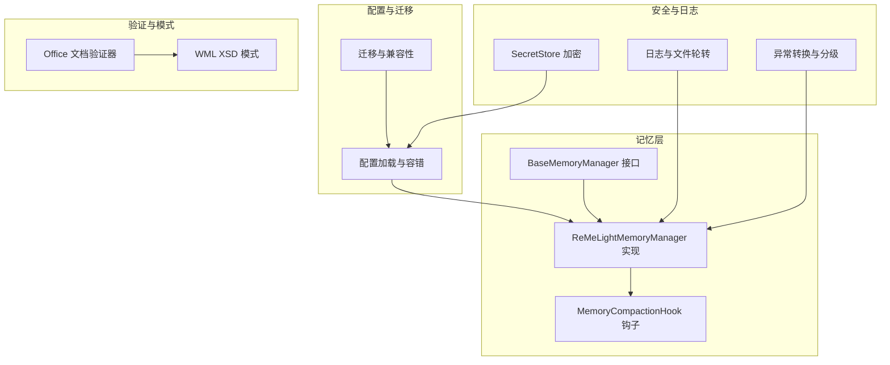
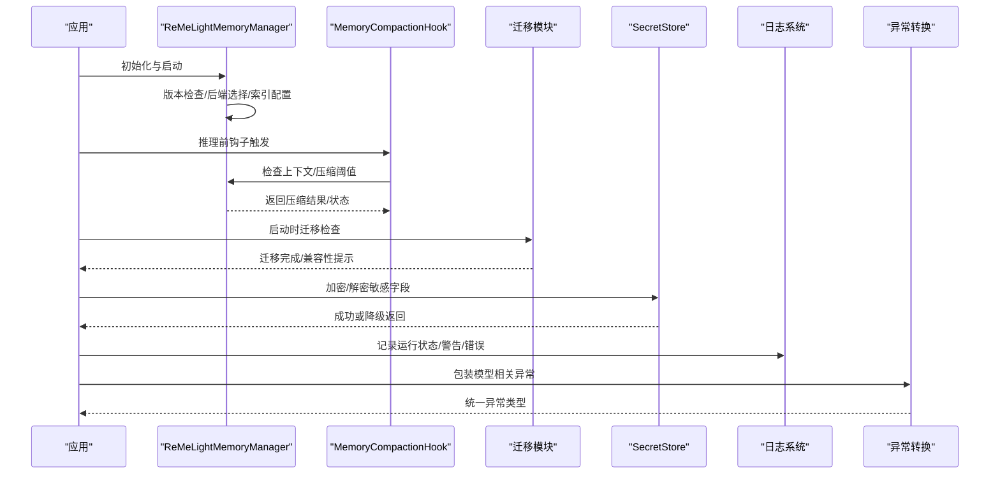
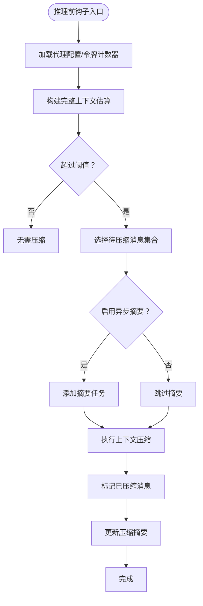
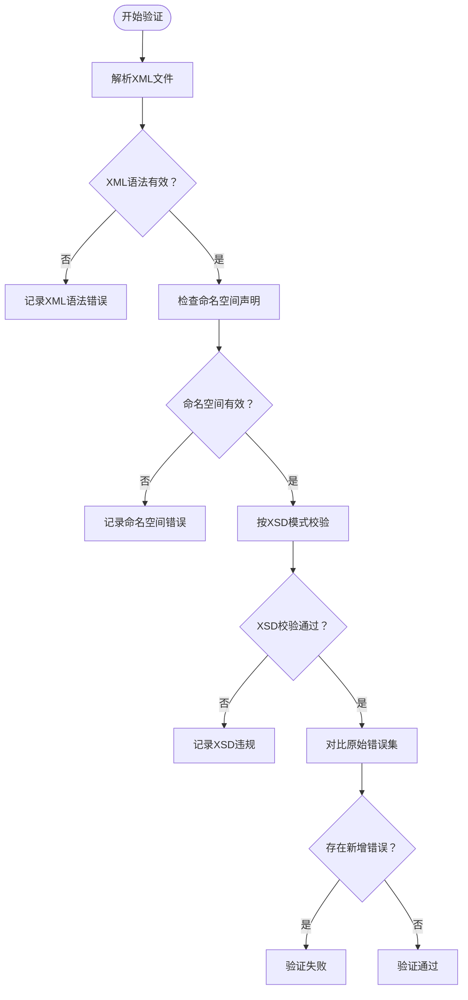
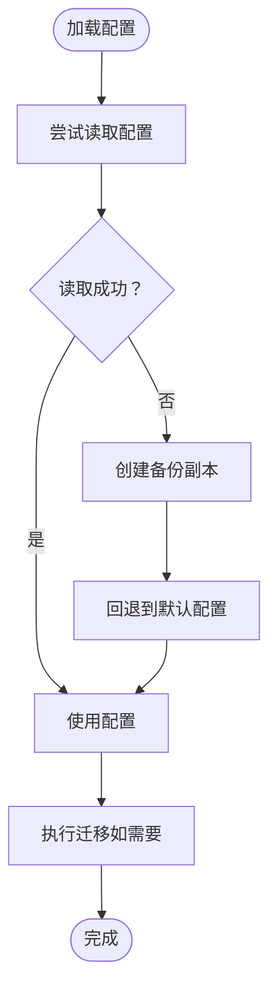
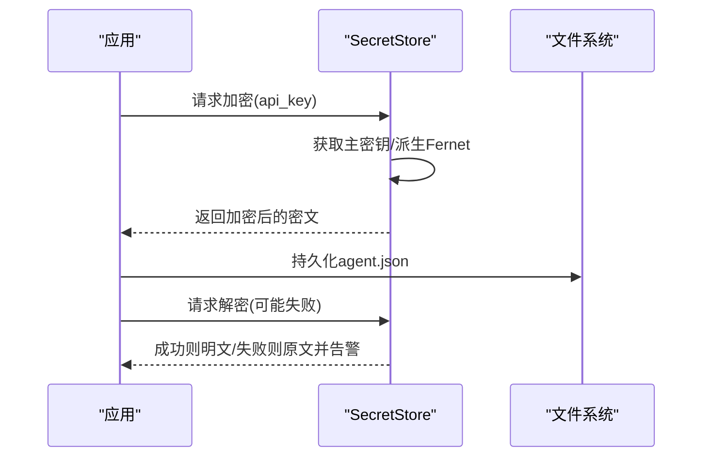
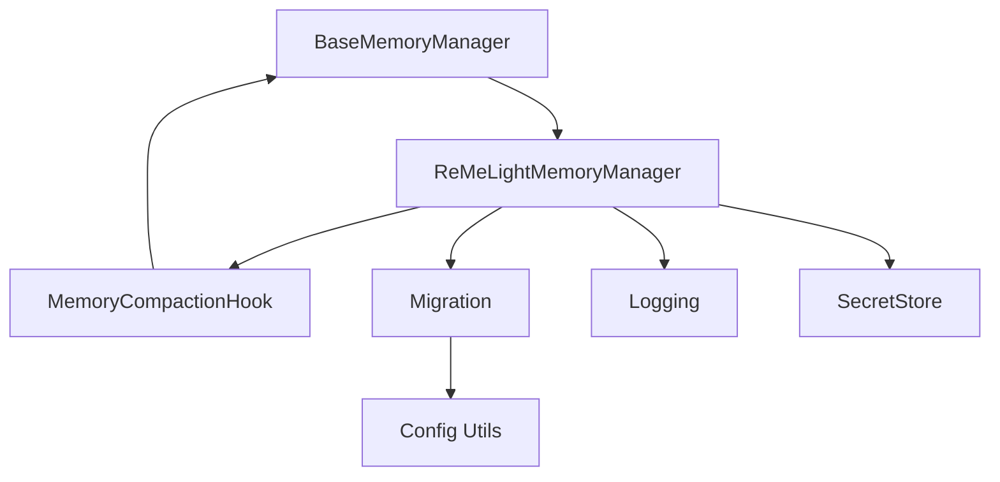

# 内存数据完整性

<cite>
**本文引用的文件**
- [src/qwenpaw/agents/memory/base_memory_manager.py](file://src/qwenpaw/agents/memory/base_memory_manager.py)
- [src/qwenpaw/agents/memory/reme_light_memory_manager.py](file://src/qwenpaw/agents/memory/reme_light_memory_manager.py)
- [src/qwenpaw/agents/hooks/memory_compaction.py](file://src/qwenpaw/agents/hooks/memory_compaction.py)
- [src/qwenpaw/app/migration.py](file://src/qwenpaw/app/migration.py)
- [src/qwenpaw/security/secret_store.py](file://src/qwenpaw/security/secret_store.py)
- [src/qwenpaw/utils/logging.py](file://src/qwenpaw/utils/logging.py)
- [src/qwenpaw/exceptions.py](file://src/qwenpaw/exceptions.py)
- [src/qwenpaw/agents/skills/docx/scripts/office/validators/base.py](file://src/qwenpaw/agents/skills/docx/scripts/office/validators/base.py)
- [src/qwenpaw/agents/skills/xlsx/scripts/office/validators/base.py](file://src/qwenpaw/agents/skills/xlsx/scripts/office/validators/base.py)
- [src/qwenpaw/agents/skills/pptx/scripts/office/validators/base.py](file://src/qwenpaw/agents/skills/pptx/scripts/office/validators/base.py)
- [src/qwenpaw/agents/skills/docx/scripts/office/schemas/ISO-IEC29500-4_2016/wml.xsd](file://src/qwenpaw/agents/skills/docx/scripts/office/schemas/ISO-IEC29500-4_2016/wml.xsd)
- [src/qwenpaw/agents/skills/xlsx/scripts/office/schemas/ISO-IEC29500-4_2016/wml.xsd](file://src/qwenpaw/agents/skills/xlsx/scripts/office/schemas/ISO-IEC29500-4_2016/wml.xsd)
- [src/qwenpaw/agents/skills/pptx/scripts/office/schemas/ISO-IEC29500-4_2016/wml.xsd](file://src/qwenpaw/agents/skills/pptx/scripts/office/schemas/ISO-IEC29500-4_2016/wml.xsd)
- [src/qwenpaw/agents/skills/xlsx/scripts/office/schemas/microsoft/wml-sdtdatahash-2020.xsd](file://src/qwenpaw/agents/skills/xlsx/scripts/office/schemas/microsoft/wml-sdtdatahash-2020.xsd)
- [src/qwenpaw/agents/skills/pptx/scripts/office/schemas/microsoft/wml-sdtdatahash-2020.xsd](file://src/qwenpaw/agents/skills/pptx/scripts/office/schemas/microsoft/wml-sdtdatahash-2020.xsd)
- [src/qwenpaw/agents/skills/docx/scripts/office/schemas/microsoft/wml-sdtdatahash-2020.xsd](file://src/qwenpaw/agents/skills/docx/scripts/office/schemas/microsoft/wml-sdtdatahash-2020.xsd)
- [console/src/api/types/heartbeat.ts](file://console/src/api/types/heartbeat.ts)
- [src/qwenpaw/config/utils.py](file://src/qwenpaw/config/utils.py)
</cite>

## 目录
1. [引言](#引言)
2. [项目结构](#项目结构)
3. [核心组件](#核心组件)
4. [架构总览](#架构总览)
5. [详细组件分析](#详细组件分析)
6. [依赖分析](#依赖分析)
7. [性能考量](#性能考量)
8. [故障排查指南](#故障排查指南)
9. [结论](#结论)
10. [附录](#附录)

## 引言
本技术文档聚焦于QwenPaw内存系统的数据完整性保障，围绕以下关键目标展开：事务与一致性、原子操作与回滚策略、数据校验与验证（含XML/XSD结构校验、哈希与密码学校验）、备份与恢复（全量/增量/灾难恢复）、损坏检测与自动修复、迁移与升级兼容性、安全存储与访问控制、监控与告警、以及与外部存储的一致性维护与问题诊断。

## 项目结构
QwenPaw在“记忆”层面采用可插拔的内存管理器接口，并通过ReMeLight实现向量化检索、全文检索与压缩摘要能力；同时提供内存压缩钩子以在推理前自动进行上下文压缩，确保上下文窗口不超限。配置与迁移逻辑负责工作区与代理配置的演进与兼容，日志与异常体系提供可观测性与降级能力，安全模块提供主密钥派生与对称加密的机密字段保护。

图示来源
- [src/qwenpaw/agents/memory/base_memory_manager.py:21-226](file://src/qwenpaw/agents/memory/base_memory_manager.py#L21-L226)
- [src/qwenpaw/agents/memory/reme_light_memory_manager.py:38-438](file://src/qwenpaw/agents/memory/reme_light_memory_manager.py#L38-L438)
- [src/qwenpaw/agents/hooks/memory_compaction.py:27-214](file://src/qwenpaw/agents/hooks/memory_compaction.py#L27-L214)
- [src/qwenpaw/app/migration.py:54-226](file://src/qwenpaw/app/migration.py#L54-L226)
- [src/qwenpaw/security/secret_store.py:196-290](file://src/qwenpaw/security/secret_store.py#L196-L290)
- [src/qwenpaw/utils/logging.py:121-202](file://src/qwenpaw/utils/logging.py#L121-L202)
- [src/qwenpaw/exceptions.py:165-254](file://src/qwenpaw/exceptions.py#L165-L254)
- [src/qwenpaw/agents/skills/docx/scripts/office/validators/base.py:143-646](file://src/qwenpaw/agents/skills/docx/scripts/office/validators/base.py#L143-L646)
- [src/qwenpaw/agents/skills/xlsx/scripts/office/validators/base.py:143-646](file://src/qwenpaw/agents/skills/xlsx/scripts/office/validators/base.py#L143-L646)
- [src/qwenpaw/agents/skills/pptx/scripts/office/validators/base.py:143-646](file://src/qwenpaw/agents/skills/pptx/scripts/office/validators/base.py#L143-L646)

章节来源
- [src/qwenpaw/agents/memory/base_memory_manager.py:21-226](file://src/qwenpaw/agents/memory/base_memory_manager.py#L21-L226)
- [src/qwenpaw/agents/memory/reme_light_memory_manager.py:38-438](file://src/qwenpaw/agents/memory/reme_light_memory_manager.py#L38-L438)
- [src/qwenpaw/agents/hooks/memory_compaction.py:27-214](file://src/qwenpaw/agents/hooks/memory_compaction.py#L27-L214)
- [src/qwenpaw/app/migration.py:54-226](file://src/qwenpaw/app/migration.py#L54-L226)
- [src/qwenpaw/security/secret_store.py:196-290](file://src/qwenpaw/security/secret_store.py#L196-L290)
- [src/qwenpaw/utils/logging.py:121-202](file://src/qwenpaw/utils/logging.py#L121-L202)
- [src/qwenpaw/exceptions.py:165-254](file://src/qwenpaw/exceptions.py#L165-L254)
- [src/qwenpaw/agents/skills/docx/scripts/office/validators/base.py:143-646](file://src/qwenpaw/agents/skills/docx/scripts/office/validators/base.py#L143-L646)
- [src/qwenpaw/agents/skills/xlsx/scripts/office/validators/base.py:143-646](file://src/qwenpaw/agents/skills/xlsx/scripts/office/validators/base.py#L143-L646)
- [src/qwenpaw/agents/skills/pptx/scripts/office/validators/base.py:143-646](file://src/qwenpaw/agents/skills/pptx/scripts/office/validators/base.py#L143-L646)

## 核心组件
- 记忆管理接口与实现：定义统一的记忆生命周期、压缩、摘要、检索与内存对象获取能力，确保不同后端（本地/Chroma）的一致行为。
- 内存压缩钩子：在推理前根据阈值与保留策略自动压缩历史消息，保留系统提示与近期消息，避免上下文溢出。
- 迁移与兼容：从单代理到多代理结构的迁移，工作区与技能布局的演进，保证配置与数据的向前/向后兼容。
- 安全与加密：基于主密钥派生的对称加密，用于敏感字段持久化，支持解密失败时的优雅降级。
- 日志与异常：统一的日志格式与文件轮转，异常类型分级与模型相关错误转换，便于定位与告警。
- 结构验证：Office文档（DOCX/XLSX/PPTX）的XML/XSD校验与错误归因，辅助结构完整性检查与自动修复。

章节来源
- [src/qwenpaw/agents/memory/base_memory_manager.py:21-226](file://src/qwenpaw/agents/memory/base_memory_manager.py#L21-L226)
- [src/qwenpaw/agents/memory/reme_light_memory_manager.py:38-438](file://src/qwenpaw/agents/memory/reme_light_memory_manager.py#L38-L438)
- [src/qwenpaw/agents/hooks/memory_compaction.py:27-214](file://src/qwenpaw/agents/hooks/memory_compaction.py#L27-L214)
- [src/qwenpaw/app/migration.py:54-226](file://src/qwenpaw/app/migration.py#L54-L226)
- [src/qwenpaw/security/secret_store.py:196-290](file://src/qwenpaw/security/secret_store.py#L196-L290)
- [src/qwenpaw/utils/logging.py:121-202](file://src/qwenpaw/utils/logging.py#L121-L202)
- [src/qwenpaw/exceptions.py:165-254](file://src/qwenpaw/exceptions.py#L165-L254)
- [src/qwenpaw/agents/skills/docx/scripts/office/validators/base.py:143-646](file://src/qwenpaw/agents/skills/docx/scripts/office/validators/base.py#L143-L646)
- [src/qwenpaw/agents/skills/xlsx/scripts/office/validators/base.py:143-646](file://src/qwenpaw/agents/skills/xlsx/scripts/office/validators/base.py#L143-L646)
- [src/qwenpaw/agents/skills/pptx/scripts/office/validators/base.py:143-646](file://src/qwenpaw/agents/skills/pptx/scripts/office/validators/base.py#L143-L646)

## 架构总览
下图展示从应用启动到记忆压缩、索引重建、配置迁移与安全存储的关键交互路径，以及日志与异常如何贯穿整个流程。

图示来源
- [src/qwenpaw/agents/memory/reme_light_memory_manager.py:267-287](file://src/qwenpaw/agents/memory/reme_light_memory_manager.py#L267-L287)
- [src/qwenpaw/agents/hooks/memory_compaction.py:62-214](file://src/qwenpaw/agents/hooks/memory_compaction.py#L62-L214)
- [src/qwenpaw/app/migration.py:54-226](file://src/qwenpaw/app/migration.py#L54-L226)
- [src/qwenpaw/security/secret_store.py:213-241](file://src/qwenpaw/security/secret_store.py#L213-L241)
- [src/qwenpaw/utils/logging.py:121-202](file://src/qwenpaw/utils/logging.py#L121-L202)
- [src/qwenpaw/exceptions.py:165-254](file://src/qwenpaw/exceptions.py#L165-L254)

## 详细组件分析

### 记忆管理器与上下文压缩
- 接口职责：统一的生命周期管理、压缩、摘要生成、检索与内存对象获取，确保不同后端一致性。
- 实现要点：ReMeLight封装了向量化与全文检索、索引重建与版本控制（哨兵文件），并在启动时根据工作区版本决定是否强制重建索引。
- 压缩钩子：在推理前评估系统提示与压缩摘要的令牌数，结合阈值与保留策略，自动压缩旧消息并更新压缩摘要，保留最近N条消息不变。

图示来源
- [src/qwenpaw/agents/hooks/memory_compaction.py:62-214](file://src/qwenpaw/agents/hooks/memory_compaction.py#L62-L214)
- [src/qwenpaw/agents/memory/reme_light_memory_manager.py:303-378](file://src/qwenpaw/agents/memory/reme_light_memory_manager.py#L303-L378)

章节来源
- [src/qwenpaw/agents/memory/base_memory_manager.py:21-226](file://src/qwenpaw/agents/memory/base_memory_manager.py#L21-L226)
- [src/qwenpaw/agents/memory/reme_light_memory_manager.py:38-438](file://src/qwenpaw/agents/memory/reme_light_memory_manager.py#L38-L438)
- [src/qwenpaw/agents/hooks/memory_compaction.py:27-214](file://src/qwenpaw/agents/hooks/memory_compaction.py#L27-L214)

### 数据校验与验证机制
- XML/XSD校验：对Office文档内部XML进行语法与命名空间校验，并与原始错误集对比，识别新增错误，支持输出详细错误位置与数量。
- 密码学与哈希：WML XSD中定义了密码保护与哈希属性组，可用于文档保护场景下的结构完整性约束；实际使用中可结合具体实现进行哈希校验。
- 错误归因与修复：验证器提供错误收集与报告，便于定位问题文件与行号，指导修复。

图示来源
- [src/qwenpaw/agents/skills/docx/scripts/office/validators/base.py:143-646](file://src/qwenpaw/agents/skills/docx/scripts/office/validators/base.py#L143-L646)
- [src/qwenpaw/agents/skills/xlsx/scripts/office/validators/base.py:143-646](file://src/qwenpaw/agents/skills/xlsx/scripts/office/validators/base.py#L143-L646)
- [src/qwenpaw/agents/skills/pptx/scripts/office/validators/base.py:143-646](file://src/qwenpaw/agents/skills/pptx/scripts/office/validators/base.py#L143-L646)
- [src/qwenpaw/agents/skills/docx/scripts/office/schemas/ISO-IEC29500-4_2016/wml.xsd:718-743](file://src/qwenpaw/agents/skills/docx/scripts/office/schemas/ISO-IEC29500-4_2016/wml.xsd#L718-L743)
- [src/qwenpaw/agents/skills/xlsx/scripts/office/schemas/ISO-IEC29500-4_2016/wml.xsd:718-743](file://src/qwenpaw/agents/skills/xlsx/scripts/office/schemas/ISO-IEC29500-4_2016/wml.xsd#L718-L743)
- [src/qwenpaw/agents/skills/pptx/scripts/office/schemas/ISO-IEC29500-4_2016/wml.xsd:718-743](file://src/qwenpaw/agents/skills/pptx/scripts/office/schemas/ISO-IEC29500-4_2016/wml.xsd#L718-L743)

章节来源
- [src/qwenpaw/agents/skills/docx/scripts/office/validators/base.py:143-646](file://src/qwenpaw/agents/skills/docx/scripts/office/validators/base.py#L143-L646)
- [src/qwenpaw/agents/skills/xlsx/scripts/office/validators/base.py:143-646](file://src/qwenpaw/agents/skills/xlsx/scripts/office/validators/base.py#L143-L646)
- [src/qwenpaw/agents/skills/pptx/scripts/office/validators/base.py:143-646](file://src/qwenpaw/agents/skills/pptx/scripts/office/validators/base.py#L143-L646)
- [src/qwenpaw/agents/skills/docx/scripts/office/schemas/ISO-IEC29500-4_2016/wml.xsd:718-743](file://src/qwenpaw/agents/skills/docx/scripts/office/schemas/ISO-IEC29500-4_2016/wml.xsd#L718-L743)
- [src/qwenpaw/agents/skills/xlsx/scripts/office/schemas/ISO-IEC29500-4_2016/wml.xsd:718-743](file://src/qwenpaw/agents/skills/xlsx/scripts/office/schemas/ISO-IEC29500-4_2016/wml.xsd#L718-L743)
- [src/qwenpaw/agents/skills/pptx/scripts/office/schemas/ISO-IEC29500-4_2016/wml.xsd:718-743](file://src/qwenpaw/agents/skills/pptx/scripts/office/schemas/ISO-IEC29500-4_2016/wml.xsd#L718-L743)

### 备份与恢复策略
- 配置备份与降级：读取配置时若出现编码或语法错误，会创建带时间戳的备份副本并回退到默认配置，确保系统可用性。
- 工作区迁移：从单代理到多代理结构的迁移，复制工作区目录与文件，保留必要元数据，避免覆盖已存在的新布局。
- 索引重建：通过“哨兵文件”机制在版本变更时触发一次性重建，确保索引与存储结构一致。

图示来源
- [src/qwenpaw/config/utils.py:436-468](file://src/qwenpaw/config/utils.py#L436-L468)
- [src/qwenpaw/app/migration.py:54-226](file://src/qwenpaw/app/migration.py#L54-L226)
- [src/qwenpaw/agents/memory/reme_light_memory_manager.py:152-189](file://src/qwenpaw/agents/memory/reme_light_memory_manager.py#L152-L189)

章节来源
- [src/qwenpaw/config/utils.py:436-468](file://src/qwenpaw/config/utils.py#L436-L468)
- [src/qwenpaw/app/migration.py:54-226](file://src/qwenpaw/app/migration.py#L54-L226)
- [src/qwenpaw/agents/memory/reme_light_memory_manager.py:152-189](file://src/qwenpaw/agents/memory/reme_light_memory_manager.py#L152-L189)

### 数据损坏检测与自动修复
- 结构完整性：通过XML/XSD校验与错误对比，识别新增违规项，避免静默破坏。
- 自动修复：验证器返回可修复建议与错误集合，便于人工或自动化流程进行修复。
- 健康监控：结合日志与异常转换，对模型相关错误进行分类与告警，辅助健康状态监控。

章节来源
- [src/qwenpaw/agents/skills/docx/scripts/office/validators/base.py:143-646](file://src/qwenpaw/agents/skills/docx/scripts/office/validators/base.py#L143-L646)
- [src/qwenpaw/agents/skills/xlsx/scripts/office/validators/base.py:143-646](file://src/qwenpaw/agents/skills/xlsx/scripts/office/validators/base.py#L143-L646)
- [src/qwenpaw/agents/skills/pptx/scripts/office/validators/base.py:143-646](file://src/qwenpaw/agents/skills/pptx/scripts/office/validators/base.py#L143-L646)
- [src/qwenpaw/utils/logging.py:121-202](file://src/qwenpaw/utils/logging.py#L121-L202)
- [src/qwenpaw/exceptions.py:165-254](file://src/qwenpaw/exceptions.py#L165-L254)

### 数据加密与安全存储
- 主密钥派生：从安全存储中获取主密钥，派生Fernet密钥，缓存以减少重复计算。
- 敏感字段保护：对提供者API密钥、认证JWT密钥等字段进行加密存储，解密失败时优雅降级返回原文。
- 字段级加解密：提供字典字段的加解密工具函数，支持批量处理。

图示来源
- [src/qwenpaw/security/secret_store.py:196-290](file://src/qwenpaw/security/secret_store.py#L196-L290)

章节来源
- [src/qwenpaw/security/secret_store.py:196-290](file://src/qwenpaw/security/secret_store.py#L196-L290)

### 数据完整性监控与告警
- 日志格式：统一着色/非着色格式，包含时间、级别、文件名与行号，便于快速定位。
- 文件轮转：在macOS上使用轮转处理器，在Windows/Linux上使用普通文件处理器，避免锁竞争。
- 异常分级：将模型相关异常映射为统一的运行时异常类型，便于前端与监控系统识别与告警。

章节来源
- [src/qwenpaw/utils/logging.py:121-202](file://src/qwenpaw/utils/logging.py#L121-L202)
- [src/qwenpaw/exceptions.py:165-254](file://src/qwenpaw/exceptions.py#L165-L254)

### 与外部存储系统的一致性维护
- ReMeLight后端选择：根据平台与依赖情况自动选择本地或Chroma后端，确保索引与检索一致性。
- 版本与索引重建：通过版本号与哨兵文件控制一次性重建，避免跨版本索引不一致。
- 配置迁移：迁移过程中保持根配置字段以兼容降级，同时写入新的代理配置，确保外部存储（文件系统）与内部结构一致。

章节来源
- [src/qwenpaw/agents/memory/reme_light_memory_manager.py:71-135](file://src/qwenpaw/agents/memory/reme_light_memory_manager.py#L71-L135)
- [src/qwenpaw/agents/memory/reme_light_memory_manager.py:152-189](file://src/qwenpaw/agents/memory/reme_light_memory_manager.py#L152-L189)
- [src/qwenpaw/app/migration.py:191-226](file://src/qwenpaw/app/migration.py#L191-L226)

### 诊断与修复指南
- 配置不可用：当配置文件损坏或编码错误时，系统会创建备份并回退默认配置，建议检查备份文件并修正原文件。
- 记忆压缩失败：若压缩返回空字符串或无效结果，系统会保存详细上下文到JSON文件以便上报与复盘。
- Office文档校验失败：根据验证器输出的错误位置与类型，逐项修复XML语法、命名空间或XSD违规。
- 模型异常：使用异常转换器将底层模型错误映射为统一类型，便于前端展示与告警。

章节来源
- [src/qwenpaw/config/utils.py:436-468](file://src/qwenpaw/config/utils.py#L436-L468)
- [src/qwenpaw/agents/memory/reme_light_memory_manager.py:348-378](file://src/qwenpaw/agents/memory/reme_light_memory_manager.py#L348-L378)
- [src/qwenpaw/exceptions.py:165-254](file://src/qwenpaw/exceptions.py#L165-L254)

## 依赖分析
- 组件耦合：记忆管理器通过接口与实现分离，降低与具体后端的耦合；压缩钩子仅依赖接口方法，便于替换实现。
- 外部依赖：ReMeLight作为外部包，版本与后端选择由环境变量与平台特性驱动；Office验证器依赖lxml与XSD模式。
- 循环依赖：当前结构未见循环导入；日志与异常模块被广泛使用但不反向依赖业务逻辑。

图示来源
- [src/qwenpaw/agents/memory/base_memory_manager.py:21-226](file://src/qwenpaw/agents/memory/base_memory_manager.py#L21-L226)
- [src/qwenpaw/agents/memory/reme_light_memory_manager.py:38-438](file://src/qwenpaw/agents/memory/reme_light_memory_manager.py#L38-L438)
- [src/qwenpaw/agents/hooks/memory_compaction.py:27-214](file://src/qwenpaw/agents/hooks/memory_compaction.py#L27-L214)
- [src/qwenpaw/app/migration.py:54-226](file://src/qwenpaw/app/migration.py#L54-L226)
- [src/qwenpaw/utils/logging.py:121-202](file://src/qwenpaw/utils/logging.py#L121-L202)
- [src/qwenpaw/security/secret_store.py:196-290](file://src/qwenpaw/security/secret_store.py#L196-L290)
- [src/qwenpaw/config/utils.py:436-468](file://src/qwenpaw/config/utils.py#L436-L468)

章节来源
- [src/qwenpaw/agents/memory/base_memory_manager.py:21-226](file://src/qwenpaw/agents/memory/base_memory_manager.py#L21-L226)
- [src/qwenpaw/agents/memory/reme_light_memory_manager.py:38-438](file://src/qwenpaw/agents/memory/reme_light_memory_manager.py#L38-L438)
- [src/qwenpaw/agents/hooks/memory_compaction.py:27-214](file://src/qwenpaw/agents/hooks/memory_compaction.py#L27-L214)
- [src/qwenpaw/app/migration.py:54-226](file://src/qwenpaw/app/migration.py#L54-L226)
- [src/qwenpaw/utils/logging.py:121-202](file://src/qwenpaw/utils/logging.py#L121-L202)
- [src/qwenpaw/security/secret_store.py:196-290](file://src/qwenpaw/security/secret_store.py#L196-L290)
- [src/qwenpaw/config/utils.py:436-468](file://src/qwenpaw/config/utils.py#L436-L468)

## 性能考量
- 上下文压缩：通过保留系统提示与近期消息、异步摘要任务与令牌计数，平衡性能与上下文质量。
- 索引后端：Chroma在满足条件时优先使用，否则回退本地SQLite，避免低版本系统SQLite导致的性能与稳定性问题。
- 日志轮转：在macOS上采用轮转处理器，减少IO争用；Windows/Linux使用普通文件处理器，避免文件锁问题。

## 故障排查指南
- 配置损坏：查看备份文件，定位错误字段；修正后重启应用。
- 记忆压缩异常：检查压缩阈值与保留策略配置；查看保存的无效结果文件以定位问题消息。
- Office文档校验失败：根据验证器输出修复XML语法、命名空间或XSD违规；必要时参考XSD模式进行结构修正。
- 模型异常：根据异常转换器输出的统一类型与状态码，调整请求参数或配额限制。

章节来源
- [src/qwenpaw/config/utils.py:436-468](file://src/qwenpaw/config/utils.py#L436-L468)
- [src/qwenpaw/agents/memory/reme_light_memory_manager.py:348-378](file://src/qwenpaw/agents/memory/reme_light_memory_manager.py#L348-L378)
- [src/qwenpaw/exceptions.py:165-254](file://src/qwenpaw/exceptions.py#L165-L254)

## 结论
QwenPaw通过接口化的记忆管理器、自动上下文压缩、严格的配置迁移与备份、结构化验证与加密存储、统一的日志与异常体系，构建了面向生产的内存数据完整性保障框架。在保证功能扩展性的同时，兼顾了性能、可靠性与可观测性，为复杂场景下的数据一致性与安全性提供了坚实基础。

## 附录
- 心跳配置类型定义（用于监控与告警集成）
  
章节来源
- [console/src/api/types/heartbeat.ts:1-11](file://console/src/api/types/heartbeat.ts#L1-L11)