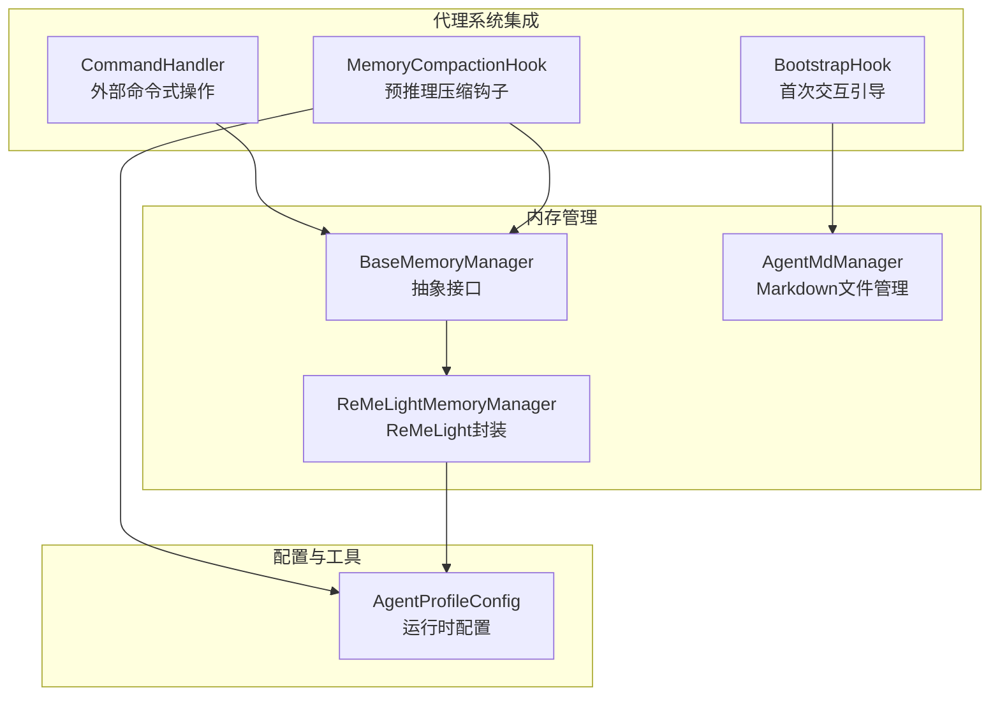
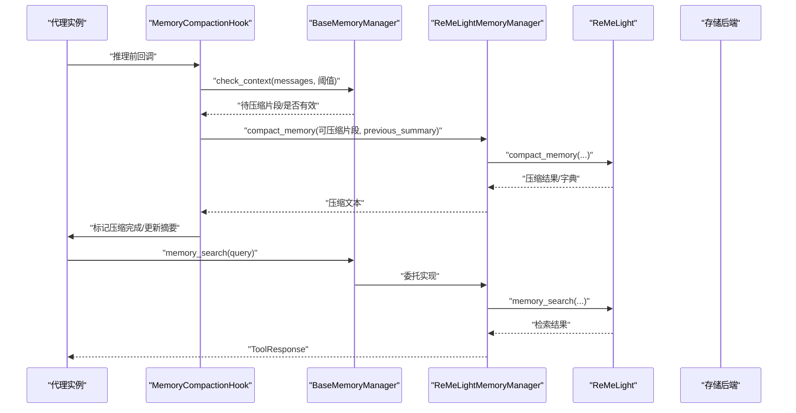
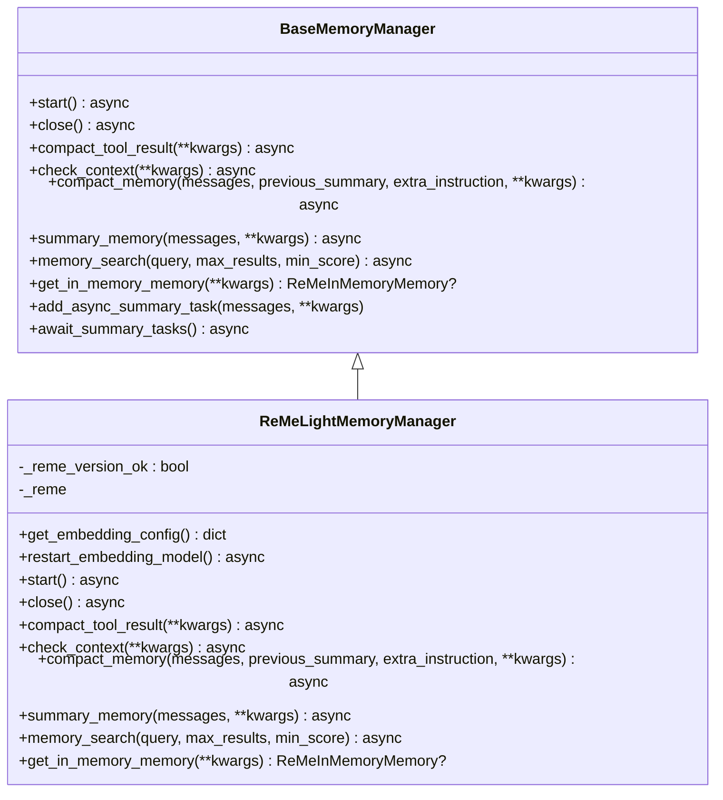
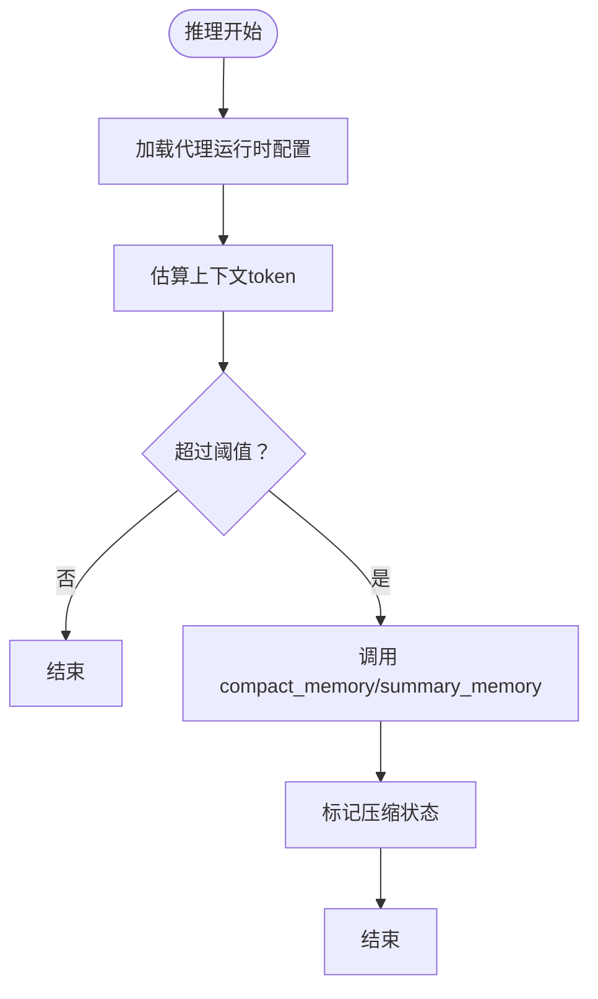
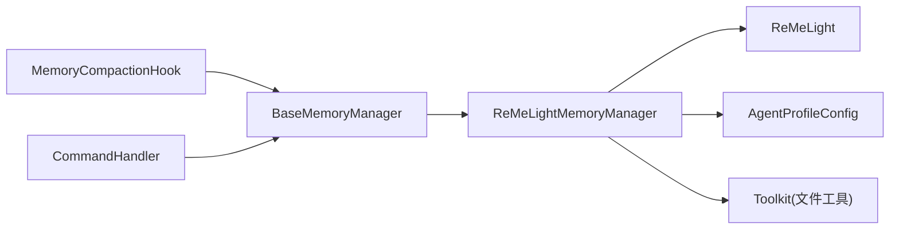
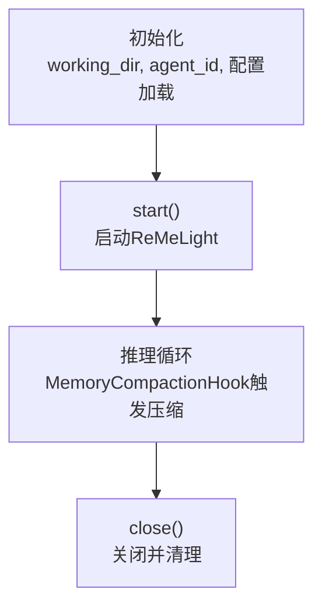

# 内存管理架构

<cite>
**本文引用的文件**
- [src/qwenpaw/agents/memory/base_memory_manager.py](file://src/qwenpaw/agents/memory/base_memory_manager.py)
- [src/qwenpaw/agents/memory/reme_light_memory_manager.py](file://src/qwenpaw/agents/memory/reme_light_memory_manager.py)
- [src/qwenpaw/agents/memory/agent_md_manager.py](file://src/qwenpaw/agents/memory/agent_md_manager.py)
- [src/qwenpaw/agents/hooks/memory_compaction.py](file://src/qwenpaw/agents/hooks/memory_compaction.py)
- [src/qwenpaw/agents/hooks/bootstrap.py](file://src/qwenpaw/agents/hooks/bootstrap.py)
- [src/qwenpaw/agents/command_handler.py](file://src/qwenpaw/agents/command_handler.py)
- [src/qwenpaw/config/config.py](file://src/qwenpaw/config/config.py)
</cite>

## 目录
1. [引言](#引言)
2. [项目结构](#项目结构)
3. [核心组件](#核心组件)
4. [架构总览](#架构总览)
5. [组件详解](#组件详解)
6. [依赖关系分析](#依赖关系分析)
7. [性能考量](#性能考量)
8. [故障排查指南](#故障排查指南)
9. [结论](#结论)
10. [附录](#附录)

## 引言
本技术文档聚焦于 QwenPaw 的内存管理架构，系统性阐述 BaseMemoryManager 抽象基类的设计理念与接口规范，解析 ReMeLightMemoryManager 的具体实现与差异化特性，并梳理 AgentMdManager 在工作区与记忆目录中的文件读写职责。文档还覆盖内存管理器的生命周期（初始化、配置加载、资源清理）、与代理系统的集成（状态同步与数据交换）、扩展开发指南、配置参数与性能调优、错误处理与异常恢复，以及在多代理场景下的并发安全保障。

## 项目结构
围绕内存管理的关键文件组织如下：
- 抽象基类：BaseMemoryManager 定义统一接口，确保不同后端可替换接入。
- 具体实现：ReMeLightMemoryManager 基于 ReMeLight 提供向量化检索、全文检索、消息压缩与摘要生成能力。
- 文件管理：AgentMdManager 负责工作区与记忆目录的 Markdown 文件读写。
- 集成钩子：MemoryCompactionHook 在推理前自动触发上下文压缩；BootstrapHook 在首次用户交互时注入引导信息。
- 命令入口：CommandHandler 通过 memory_manager 接口执行外部命令式压缩与摘要任务。
- 配置系统：AgentProfileConfig 及运行时配置提供上下文压缩阈值、嵌入模型参数、存储后端选择等关键参数来源。

图表来源
- [src/qwenpaw/agents/memory/base_memory_manager.py:21-226](file://src/qwenpaw/agents/memory/base_memory_manager.py#L21-L226)
- [src/qwenpaw/agents/memory/reme_light_memory_manager.py:38-438](file://src/qwenpaw/agents/memory/reme_light_memory_manager.py#L38-L438)
- [src/qwenpaw/agents/memory/agent_md_manager.py:10-126](file://src/qwenpaw/agents/memory/agent_md_manager.py#L10-L126)
- [src/qwenpaw/agents/hooks/memory_compaction.py:27-214](file://src/qwenpaw/agents/hooks/memory_compaction.py#L27-L214)
- [src/qwenpaw/agents/hooks/bootstrap.py:20-104](file://src/qwenpaw/agents/hooks/bootstrap.py#L20-L104)
- [src/qwenpaw/agents/command_handler.py:67-151](file://src/qwenpaw/agents/command_handler.py#L67-L151)
- [src/qwenpaw/config/config.py:1200-1439](file://src/qwenpaw/config/config.py#L1200-L1439)

章节来源
- [src/qwenpaw/agents/memory/base_memory_manager.py:21-226](file://src/qwenpaw/agents/memory/base_memory_manager.py#L21-L226)
- [src/qwenpaw/agents/memory/reme_light_memory_manager.py:38-438](file://src/qwenpaw/agents/memory/reme_light_memory_manager.py#L38-L438)
- [src/qwenpaw/agents/memory/agent_md_manager.py:10-126](file://src/qwenpaw/agents/memory/agent_md_manager.py#L10-L126)
- [src/qwenpaw/agents/hooks/memory_compaction.py:27-214](file://src/qwenpaw/agents/hooks/memory_compaction.py#L27-L214)
- [src/qwenpaw/agents/hooks/bootstrap.py:20-104](file://src/qwenpaw/agents/hooks/bootstrap.py#L20-L104)
- [src/qwenpaw/agents/command_handler.py:67-151](file://src/qwenpaw/agents/command_handler.py#L67-L151)
- [src/qwenpaw/config/config.py:1200-1439](file://src/qwenpaw/config/config.py#L1200-L1439)

## 核心组件
- BaseMemoryManager：定义内存管理器的统一接口，包括生命周期（start/close）、上下文检查与压缩（check_context/compact_memory）、摘要生成（summary_memory）、工具结果压缩（compact_tool_result）、向量/全文检索（memory_search），以及获取内存对象（get_in_memory_memory）。并提供异步摘要任务队列管理（add_async_summary_task/await_summary_tasks）。
- ReMeLightMemoryManager：基于 ReMeLight 的具体实现，负责嵌入模型配置优先级解析、存储后端选择（auto/local/chroma）、索引重建策略、版本兼容性校验、以及将代理配置映射到 ReMeLight 的 compact/summary/search 等调用。
- AgentMdManager：在工作区与记忆目录下进行 Markdown 文件的列举、读取、写入，支持时间戳与大小元数据返回，用于引导文档与记忆归档的文件化管理。
- MemoryCompactionHook：在推理前根据 token 计数与配置阈值触发压缩，保留系统提示与近期消息，对可压缩历史进行摘要与标记。
- CommandHandler：在命令式场景下直接调用 memory_manager 执行压缩与摘要，便于外部控制台或脚本驱动。
- 配置系统：AgentProfileConfig 提供运行时配置（如上下文压缩阈值、摘要开关、嵌入模型参数、存储后端等），由 ReMeLightMemoryManager 与 MemoryCompactionHook 消费。

章节来源
- [src/qwenpaw/agents/memory/base_memory_manager.py:21-226](file://src/qwenpaw/agents/memory/base_memory_manager.py#L21-L226)
- [src/qwenpaw/agents/memory/reme_light_memory_manager.py:38-438](file://src/qwenpaw/agents/memory/reme_light_memory_manager.py#L38-L438)
- [src/qwenpaw/agents/memory/agent_md_manager.py:10-126](file://src/qwenpaw/agents/memory/agent_md_manager.py#L10-L126)
- [src/qwenpaw/agents/hooks/memory_compaction.py:27-214](file://src/qwenpaw/agents/hooks/memory_compaction.py#L27-L214)
- [src/qwenpaw/agents/command_handler.py:67-151](file://src/qwenpaw/agents/command_handler.py#L67-L151)
- [src/qwenpaw/config/config.py:1200-1439](file://src/qwenpaw/config/config.py#L1200-L1439)

## 架构总览
内存管理器作为代理系统的核心基础设施，向上提供统一接口，向下对接 ReMeLight 后端与文件系统。代理在推理前通过 MemoryCompactionHook 触发上下文压缩，必要时调用 BaseMemoryManager 的 compact_memory 与 summary_memory；在需要检索时调用 memory_search；在命令式场景通过 CommandHandler 直接驱动。AgentMdManager 则支撑引导文档与记忆归档的文件化流程。

图表来源
- [src/qwenpaw/agents/hooks/memory_compaction.py:62-214](file://src/qwenpaw/agents/hooks/memory_compaction.py#L62-L214)
- [src/qwenpaw/agents/memory/base_memory_manager.py:74-226](file://src/qwenpaw/agents/memory/base_memory_manager.py#L74-L226)
- [src/qwenpaw/agents/memory/reme_light_memory_manager.py:267-427](file://src/qwenpaw/agents/memory/reme_light_memory_manager.py#L267-L427)

## 组件详解

### BaseMemoryManager 抽象基类
- 设计原则
  - 明确的生命周期接口：start/close，确保资源正确启动与释放。
  - 上下文感知的压缩：check_context 返回是否需要压缩及可压缩片段，compact_memory 将消息压缩为摘要。
  - 摘要与检索：summary_memory 生成综合摘要；memory_search 支持向量与全文检索。
  - 异步摘要任务：add_async_summary_task/await_summary_tasks 提供后台摘要任务的注册与等待，避免阻塞主流程。
  - 可插拔内存对象：get_in_memory_memory 返回具备 token 计数能力的内存实例，便于上下文评估。
- 关键属性
  - working_dir：内存存储工作目录
  - agent_id：代理唯一标识
  - chat_model/formatter：用于压缩与摘要的 LLM 与格式化器
  - summary_tasks：后台摘要任务列表

章节来源
- [src/qwenpaw/agents/memory/base_memory_manager.py:21-226](file://src/qwenpaw/agents/memory/base_memory_manager.py#L21-L226)

### ReMeLightMemoryManager 实现
- 初始化与配置加载
  - 版本兼容性检查：安装版本与期望版本不一致时发出警告。
  - 存储后端选择：auto 模式下 Windows 默认 local，其他平台优先尝试 chroma，失败回退 local 并给出 SQLite 版本建议。
  - 嵌入模型配置优先级：配置文件 > 环境变量 > 默认值；支持缓存与维度参数。
  - 索引重建策略：使用哨兵文件控制一次性重建逻辑，避免重复初始化。
- 生命周期管理
  - start/close：委托给 ReMeLight 实例，记录日志并返回结果。
- 核心能力
  - compact_memory：结合代理语言、最大输入长度、压缩比例与思维块开关，调用 ReMeLight 进行压缩；对异常返回进行保护与落盘诊断。
  - summary_memory：设置工作区与最近字节限制，调用 ReMeLight 生成摘要，支持工具集辅助文件读写。
  - memory_search：在未启动状态下返回错误提示；已启动则返回检索结果。
  - get_in_memory_memory：返回具备 token 计数能力的内存对象。
- 错误处理
  - 对压缩结果非字典的情况记录错误并保存诊断 JSON。
  - 对任务异常进行捕获与日志记录，不影响调用方继续执行。

图表来源
- [src/qwenpaw/agents/memory/base_memory_manager.py:21-226](file://src/qwenpaw/agents/memory/base_memory_manager.py#L21-L226)
- [src/qwenpaw/agents/memory/reme_light_memory_manager.py:38-438](file://src/qwenpaw/agents/memory/reme_light_memory_manager.py#L38-L438)

章节来源
- [src/qwenpaw/agents/memory/reme_light_memory_manager.py:38-438](file://src/qwenpaw/agents/memory/reme_light_memory_manager.py#L38-L438)

### AgentMdManager 文件管理
- 职责边界
  - 工作区与记忆目录的 Markdown 文件列举、读取、写入。
  - 返回文件元数据（名称、大小、创建/修改时间）。
- 使用场景
  - 引导文档（如 BOOTSTRAP.md）的读取与注入。
  - 记忆归档的文件化存储与检索。

章节来源
- [src/qwenpaw/agents/memory/agent_md_manager.py:10-126](file://src/qwenpaw/agents/memory/agent_md_manager.py#L10-L126)

### 代理系统集成与数据交换
- MemoryCompactionHook
  - 在推理前计算保留阈值与可压缩片段，按需触发 summary_memory 与 compact_memory，并标记压缩状态。
  - 对无效消息进行保护性处理，保留近期消息片段以维持稳定性。
- BootstrapHook
  - 首次用户交互时读取引导文档并注入到首条用户消息，提升初始体验。
- CommandHandler
  - 在命令式场景下直接调用 memory_manager 的压缩与摘要接口，便于外部控制台或脚本驱动。

图表来源
- [src/qwenpaw/agents/hooks/memory_compaction.py:62-214](file://src/qwenpaw/agents/hooks/memory_compaction.py#L62-L214)

章节来源
- [src/qwenpaw/agents/hooks/memory_compaction.py:27-214](file://src/qwenpaw/agents/hooks/memory_compaction.py#L27-L214)
- [src/qwenpaw/agents/hooks/bootstrap.py:20-104](file://src/qwenpaw/agents/hooks/bootstrap.py#L20-L104)
- [src/qwenpaw/agents/command_handler.py:67-151](file://src/qwenpaw/agents/command_handler.py#L67-L151)

## 依赖关系分析
- 继承关系
  - ReMeLightMemoryManager 继承 BaseMemoryManager，必须实现所有抽象方法。
- 外部依赖
  - ReMeLight：提供向量化检索、全文检索、压缩与摘要的核心能力。
  - 配置系统：AgentProfileConfig 提供运行时参数（上下文阈值、压缩比例、嵌入模型参数、存储后端等）。
  - 工具集：summary_toolkit 注册 read/write/edit 文件工具，支持摘要生成过程中的文件读写。
- 内聚与耦合
  - BaseMemoryManager 保持高内聚的接口设计，降低上层对后端实现的耦合。
  - ReMeLightMemoryManager 与 ReMeLight 的耦合通过委托模式弱化，便于替换与测试。

图表来源
- [src/qwenpaw/agents/memory/base_memory_manager.py:21-226](file://src/qwenpaw/agents/memory/base_memory_manager.py#L21-L226)
- [src/qwenpaw/agents/memory/reme_light_memory_manager.py:38-438](file://src/qwenpaw/agents/memory/reme_light_memory_manager.py#L38-L438)
- [src/qwenpaw/agents/hooks/memory_compaction.py:27-214](file://src/qwenpaw/agents/hooks/memory_compaction.py#L27-L214)
- [src/qwenpaw/agents/command_handler.py:67-151](file://src/qwenpaw/agents/command_handler.py#L67-L151)
- [src/qwenpaw/config/config.py:1200-1439](file://src/qwenpaw/config/config.py#L1200-L1439)

章节来源
- [src/qwenpaw/agents/memory/reme_light_memory_manager.py:38-438](file://src/qwenpaw/agents/memory/reme_light_memory_manager.py#L38-L438)
- [src/qwenpaw/agents/hooks/memory_compaction.py:27-214](file://src/qwenpaw/agents/hooks/memory_compaction.py#L27-L214)
- [src/qwenpaw/agents/command_handler.py:67-151](file://src/qwenpaw/agents/command_handler.py#L67-L151)
- [src/qwenpaw/config/config.py:1200-1439](file://src/qwenpaw/config/config.py#L1200-L1439)

## 性能考量
- 嵌入模型与缓存
  - 通过配置项启用/禁用缓存、设置最大缓存大小与批处理大小，减少重复嵌入开销。
  - 维度与输入长度限制有助于控制上下文规模，避免超限。
- 存储后端选择
  - auto 模式下优先 chroma，若系统 SQLite 不满足要求则回退 local，确保可用性与性能平衡。
- 异步摘要任务
  - 使用 add_async_summary_task/await_summary_tasks 在后台执行摘要，避免阻塞主线程。
- 检索性能
  - 向量检索与全文检索（FTS）可按需开启，合理设置最小分数与结果数量，平衡召回与速度。
- 压缩策略
  - 通过上下文压缩阈值与保留比例控制压缩频率与范围，保留系统提示与近期消息以维持语义连贯性。

章节来源
- [src/qwenpaw/agents/memory/reme_light_memory_manager.py:231-261](file://src/qwenpaw/agents/memory/reme_light_memory_manager.py#L231-L261)
- [src/qwenpaw/agents/hooks/memory_compaction.py:100-138](file://src/qwenpaw/agents/hooks/memory_compaction.py#L100-L138)

## 故障排查指南
- 版本不匹配
  - 当 reme-ai 安装版本与期望版本不一致时，会记录警告；请按提示安装对应版本。
- 存储后端导入失败
  - chroma 导入失败通常因系统 SQLite 版本过低；升级至 3.35+ 或切换后端为 local。
- 压缩结果异常
  - 若 compact_memory 返回字符串而非字典，记录错误并保存诊断 JSON；检查上游依赖版本与配置。
- ReMe 未启动
  - memory_search 在未启动时返回错误提示；确保先调用 start。
- 任务异常
  - await_summary_tasks 会收集任务异常并记录日志；可在应用关闭前调用以确保清理。

章节来源
- [src/qwenpaw/agents/memory/reme_light_memory_manager.py:191-218](file://src/qwenpaw/agents/memory/reme_light_memory_manager.py#L191-L218)
- [src/qwenpaw/agents/memory/reme_light_memory_manager.py:80-90](file://src/qwenpaw/agents/memory/reme_light_memory_manager.py#L80-L90)
- [src/qwenpaw/agents/memory/reme_light_memory_manager.py:348-378](file://src/qwenpaw/agents/memory/reme_light_memory_manager.py#L348-L378)
- [src/qwenpaw/agents/memory/reme_light_memory_manager.py:413-427](file://src/qwenpaw/agents/memory/reme_light_memory_manager.py#L413-L427)
- [src/qwenpaw/agents/memory/base_memory_manager.py:140-196](file://src/qwenpaw/agents/memory/base_memory_manager.py#L140-L196)

## 结论
QwenPaw 的内存管理架构以 BaseMemoryManager 为核心抽象，通过 ReMeLightMemoryManager 将代理系统与 ReMeLight 后端解耦，既保证了功能完整性（压缩、摘要、检索），又提供了良好的可扩展性与可维护性。配合 MemoryCompactionHook 与 CommandHandler，系统实现了从推理前自动压缩到命令式操作的全链路内存治理。通过合理的配置参数与性能调优策略，可在多代理环境下实现稳定高效的上下文管理。

## 附录

### 生命周期管理流程

图表来源
- [src/qwenpaw/agents/memory/reme_light_memory_manager.py:267-287](file://src/qwenpaw/agents/memory/reme_light_memory_manager.py#L267-L287)
- [src/qwenpaw/agents/hooks/memory_compaction.py:62-214](file://src/qwenpaw/agents/hooks/memory_compaction.py#L62-L214)

### 配置参数与调优要点
- 嵌入模型配置（优先级）
  - 配置文件字段：backend、api_key、base_url、model_name、dimensions、enable_cache、use_dimensions、max_cache_size、max_input_length、max_batch_size
  - 环境变量：EMBEDDING_API_KEY、EMBEDDING_BASE_URL、EMBEDDING_MODEL_NAME
- 存储后端
  - MEMORY_STORE_BACKEND：auto/local/chroma，默认 auto
- 运行时压缩与摘要
  - memory_compact_threshold、memory_compact_reserve、context_compact.memory_compact_ratio、memory_summary.memory_summary_enabled
- 检索参数
  - memory_search 的 max_results、min_score
- 文件工具
  - tool_result_compact.recent_max_bytes、recent_n、old_max_bytes、retention_days

章节来源
- [src/qwenpaw/agents/memory/reme_light_memory_manager.py:231-250](file://src/qwenpaw/agents/memory/reme_light_memory_manager.py#L231-L250)
- [src/qwenpaw/agents/hooks/memory_compaction.py:118-138](file://src/qwenpaw/agents/hooks/memory_compaction.py#L118-L138)
- [src/qwenpaw/config/config.py:1200-1439](file://src/qwenpaw/config/config.py#L1200-L1439)

### 扩展开发指南
- 自定义内存管理器实现步骤
  - 继承 BaseMemoryManager，实现所有抽象方法（start/close/compact_tool_result/check_context/compact_memory/summary_memory/memory_search/get_in_memory_memory）。
  - 在 __init__ 中完成工作目录、代理 ID 与后端初始化；必要时引入配置加载与环境变量解析。
  - 在 compact_memory/summary_memory 中结合代理语言、最大输入长度、压缩比例与 token 计数器进行上下文控制。
  - 在 memory_search 中实现检索逻辑，并在未启动时返回明确的错误提示。
  - 使用 add_async_summary_task/await_summary_tasks 管理后台摘要任务，确保优雅关闭。
- 集成要点
  - 与代理系统的钩子（MemoryCompactionHook）与命令处理器（CommandHandler）保持接口一致。
  - 在初始化阶段完成嵌入模型与格式化器的准备，避免延迟初始化带来的性能抖动。
  - 对异常与边界情况进行日志记录与降级处理，保障系统稳定性。

章节来源
- [src/qwenpaw/agents/memory/base_memory_manager.py:57-226](file://src/qwenpaw/agents/memory/base_memory_manager.py#L57-L226)
- [src/qwenpaw/agents/hooks/memory_compaction.py:35-41](file://src/qwenpaw/agents/hooks/memory_compaction.py#L35-L41)
- [src/qwenpaw/agents/command_handler.py:67-82](file://src/qwenpaw/agents/command_handler.py#L67-L82)

### 并发安全与多代理支持
- 并发安全
  - ReMeLightMemoryManager 本身不引入全局共享状态；每个代理拥有独立的 working_dir 与 agent_id，避免跨代理干扰。
  - 异步摘要任务通过 asyncio.Task 管理，await_summary_tasks 在关闭前等待并清理，降低竞态风险。
- 多代理环境
  - 通过 AgentProfileConfig 为每个代理提供独立的运行时配置，包括上下文阈值、压缩比例与嵌入参数。
  - 存储后端与索引重建策略以工作区为单位隔离，避免多代理间相互影响。

章节来源
- [src/qwenpaw/agents/memory/reme_light_memory_manager.py:50-62](file://src/qwenpaw/agents/memory/reme_light_memory_manager.py#L50-L62)
- [src/qwenpaw/agents/memory/base_memory_manager.py:116-196](file://src/qwenpaw/agents/memory/base_memory_manager.py#L116-L196)
- [src/qwenpaw/config/config.py:1200-1439](file://src/qwenpaw/config/config.py#L1200-L1439)