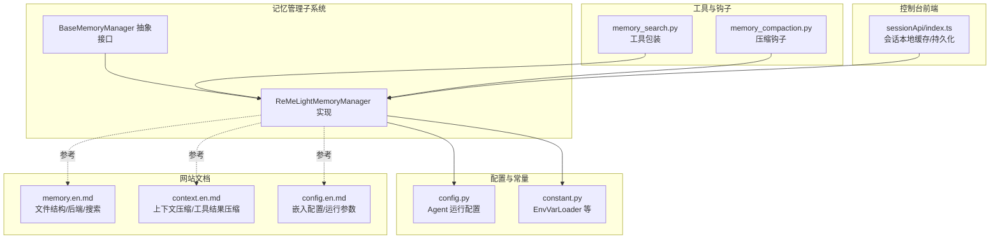
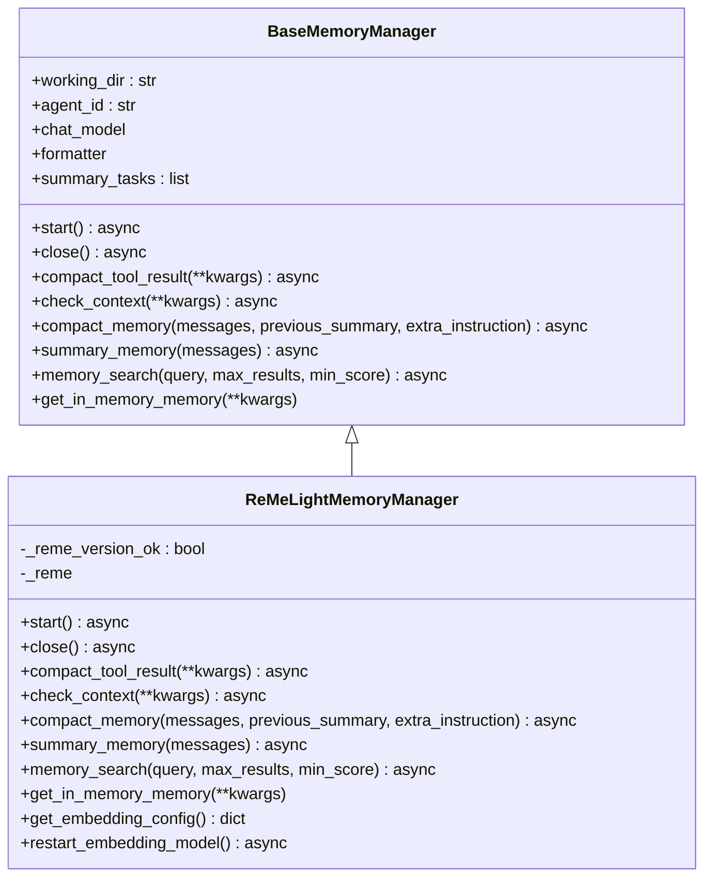
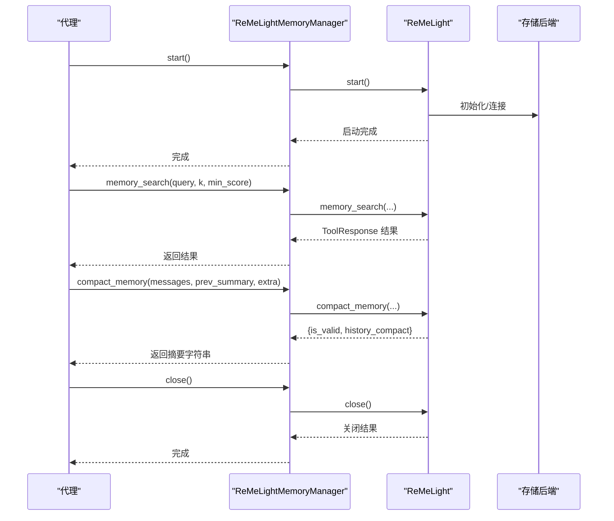
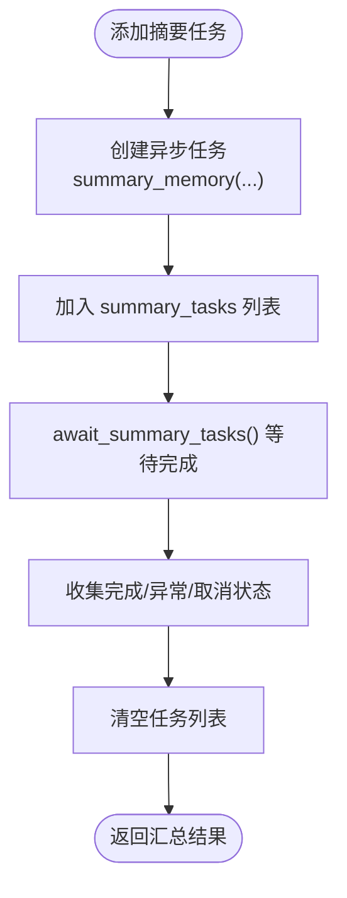
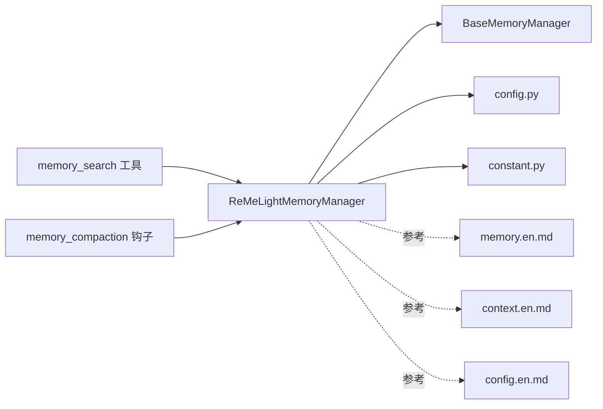

# 轻量级记忆管理器

<cite>
**本文档引用的文件**
- [reme_light_memory_manager.py](file://src/qwenpaw/agents/memory/reme_light_memory_manager.py)
- [base_memory_manager.py](file://src/qwenpaw/agents/memory/base_memory_manager.py)
- [config.py](file://src/qwenpaw/config/config.py)
- [constant.py](file://src/qwenpaw/constant.py)
- [memory.en.md](file://website/public/docs/memory.en.md)
- [context.en.md](file://website/public/docs/context.en.md)
- [config.en.md](file://website/public/docs/config.en.md)
- [memory_search.py](file://src/qwenpaw/agents/tools/memory_search.py)
- [memory_compaction.py](file://src/qwenpaw/agents/hooks/memory_compaction.py)
- [index.ts](file://console/src/pages/Chat/sessionApi/index.ts)
</cite>

## 目录
1. [简介](#简介)
2. [项目结构](#项目结构)
3. [核心组件](#核心组件)
4. [架构总览](#架构总览)
5. [详细组件分析](#详细组件分析)
6. [依赖关系分析](#依赖关系分析)
7. [性能考量](#性能考量)
8. [故障排查指南](#故障排查指南)
9. [结论](#结论)
10. [附录](#附录)

## 简介
本文件系统性阐述 QwenPaw 中 ReMeLightMemoryManager 轻量级记忆管理器的设计理念、实现细节与运维实践。该管理器以组合方式封装 ReMeLight，提供对话压缩、记忆摘要、向量与全文混合检索等能力，并通过嵌入配置、后端选择、索引重建哨兵等机制实现与持久化存储的协调。文档覆盖内存中的临时存储（会话缓存、响应缓存、中间结果）、生命周期管理（启动/关闭、自动清理、容量控制）、配置参数详解、高并发性能优化、监控指标与调优建议，以及与其他内存管理器的协作模式。

## 项目结构
ReMeLightMemoryManager 位于 agents/memory 子模块，继承自抽象基类 BaseMemoryManager，并通过配置系统与常量加载器读取运行时参数。网站文档提供了关于内存文件结构、搜索机制与后端选择的权威说明。

图表来源
- [reme_light_memory_manager.py:38-141](file://src/qwenpaw/agents/memory/reme_light_memory_manager.py#L38-L141)
- [base_memory_manager.py:21-226](file://src/qwenpaw/agents/memory/base_memory_manager.py#L21-L226)
- [config.py:1200-1263](file://src/qwenpaw/config/config.py#L1200-L1263)
- [constant.py:28-87](file://src/qwenpaw/constant.py#L28-L87)
- [memory.en.md:26-159](file://website/public/docs/memory.en.md#L26-L159)
- [context.en.md:173-319](file://website/public/docs/context.en.md#L173-L319)
- [config.en.md:390-436](file://website/public/docs/config.en.md#L390-L436)
- [memory_search.py:37-69](file://src/qwenpaw/agents/tools/memory_search.py#L37-L69)
- [memory_compaction.py:115-141](file://src/qwenpaw/agents/hooks/memory_compaction.py#L115-L141)
- [index.ts:309-333](file://console/src/pages/Chat/sessionApi/index.ts#L309-L333)

章节来源
- [reme_light_memory_manager.py:38-141](file://src/qwenpaw/agents/memory/reme_light_memory_manager.py#L38-L141)
- [base_memory_manager.py:21-226](file://src/qwenpaw/agents/memory/base_memory_manager.py#L21-L226)
- [config.py:1200-1263](file://src/qwenpaw/config/config.py#L1200-L1263)
- [constant.py:28-87](file://src/qwenpaw/constant.py#L28-L87)
- [memory.en.md:26-159](file://website/public/docs/memory.en.md#L26-L159)
- [context.en.md:173-319](file://website/public/docs/context.en.md#L173-L319)
- [config.en.md:390-436](file://website/public/docs/config.en.md#L390-L436)
- [memory_search.py:37-69](file://src/qwenpaw/agents/tools/memory_search.py#L37-L69)
- [memory_compaction.py:115-141](file://src/qwenpaw/agents/hooks/memory_compaction.py#L115-L141)
- [index.ts:309-333](file://console/src/pages/Chat/sessionApi/index.ts#L309-L333)

## 核心组件
- ReMeLightMemoryManager：面向代理的记忆管理器实现，负责启动/关闭 ReMeLight、执行对话压缩、生成记忆摘要、执行混合检索、获取内存对象等。
- BaseMemoryManager：定义统一接口，包括生命周期方法、上下文检查与压缩、记忆摘要、检索与内存对象获取等。
- 配置系统：从 agent.json 加载运行时配置，支持嵌入配置、上下文压缩与工具结果压缩等参数。
- 常量与环境变量：EnvVarLoader 提供类型安全的环境变量读取，支持回退键名兼容。
- 文档参考：网站文档对文件结构、后端选择、混合检索、上下文压缩与工具结果压缩提供权威说明。

章节来源
- [reme_light_memory_manager.py:38-141](file://src/qwenpaw/agents/memory/reme_light_memory_manager.py#L38-L141)
- [base_memory_manager.py:21-226](file://src/qwenpaw/agents/memory/base_memory_manager.py#L21-L226)
- [config.py:1200-1263](file://src/qwenpaw/config/config.py#L1200-L1263)
- [constant.py:28-87](file://src/qwenpaw/constant.py#L28-L87)
- [memory.en.md:26-159](file://website/public/docs/memory.en.md#L26-L159)
- [context.en.md:173-319](file://website/public/docs/context.en.md#L173-L319)
- [config.en.md:390-436](file://website/public/docs/config.en.md#L390-L436)

## 架构总览
ReMeLightMemoryManager 通过组合持有 ReMeLight 实例，将自身职责限定为配置解析、版本校验、后端选择、索引重建策略与工具注册，其余能力委托给 ReMeLight。对外暴露统一接口，内部通过嵌入配置与运行参数驱动 ReMeLight 的行为。

图表来源
- [base_memory_manager.py:21-226](file://src/qwenpaw/agents/memory/base_memory_manager.py#L21-L226)
- [reme_light_memory_manager.py:38-141](file://src/qwenpaw/agents/memory/reme_light_memory_manager.py#L38-L141)

## 详细组件分析

### ReMeLightMemoryManager 设计与实现
- 初始化与后端选择
  - 自动检测平台并选择存储后端：Windows 使用 local，其他平台优先尝试 chroma，失败则回退 local 并记录警告。
  - 通过环境变量 MEMORY_STORE_BACKEND 可显式指定 auto/local/chroma/sqlite。
  - 通过嵌入配置优先级（配置 > 环境变量 > 默认）决定向量化能力开关与参数。
  - 通过“哨兵文件”机制控制首次启动时的索引重建策略，避免重复重建并保证版本升级后的初始化。
- 生命周期管理
  - start/close 直接委托给 ReMeLight，负责启动与关闭底层存储。
- 记忆能力
  - compact_memory：基于 ReActAgent 将历史对话压缩为结构化摘要，支持额外指令与思考块。
  - summary_memory：结合文件工具对消息进行综合摘要，支持时区、语言与令牌计数。
  - memory_search：混合检索（向量+BM25），返回工具响应结果。
  - get_in_memory_memory：返回带令牌计数支持的内存对象。
- 配置与重启
  - get_embedding_config：聚合配置与环境变量，输出 ReMeLight 可用的嵌入配置。
  - restart_embedding_model：动态重启嵌入模型，应用最新配置。

图表来源
- [reme_light_memory_manager.py:267-438](file://src/qwenpaw/agents/memory/reme_light_memory_manager.py#L267-L438)

章节来源
- [reme_light_memory_manager.py:50-141](file://src/qwenpaw/agents/memory/reme_light_memory_manager.py#L50-L141)
- [reme_light_memory_manager.py:267-438](file://src/qwenpaw/agents/memory/reme_light_memory_manager.py#L267-L438)

### BaseMemoryManager 接口与任务管理
- 统一接口：定义了所有记忆管理器必须实现的方法，包括生命周期、上下文检查与压缩、摘要生成、检索与内存对象获取。
- 异步摘要任务：add_async_summary_task 与 await_summary_tasks 提供后台摘要任务的收集与等待，便于优雅关闭前汇总状态。

图表来源
- [base_memory_manager.py:116-196](file://src/qwenpaw/agents/memory/base_memory_manager.py#L116-L196)

章节来源
- [base_memory_manager.py:21-226](file://src/qwenpaw/agents/memory/base_memory_manager.py#L21-L226)

### 配置与环境变量
- Agent 运行配置：从 agent.json 加载 running.embedding_config、context_compact、tool_result_compact 等关键参数。
- 环境变量：通过 EnvVarLoader 安全读取布尔/整数/浮点/字符串，支持 QWENPAW_/COPAW_ 兼容回退。
- 嵌入配置优先级：配置文件 > 环境变量 > 默认值；向量化能力需同时满足 API Key、Base URL、Model Name 非空。

章节来源
- [config.py:1200-1263](file://src/qwenpaw/config/config.py#L1200-L1263)
- [constant.py:28-87](file://src/qwenpaw/constant.py#L28-L87)
- [config.en.md:390-436](file://website/public/docs/config.en.md#L390-L436)
- [config.en.md:418-645](file://website/public/docs/config.en.md#L418-L645)

### 搜索与混合检索
- 混合检索：默认采用向量语义检索与 BM25 全文检索的加权融合，先去重再按融合分数排序返回 Top-N。
- 检索工具：memory_search 工具函数对异常进行包装，返回标准 ToolResponse，便于在代理流程中使用。

章节来源
- [memory.en.md:160-257](file://website/public/docs/memory.en.md#L160-L257)
- [memory_search.py:37-69](file://src/qwenpaw/agents/tools/memory_search.py#L37-L69)

### 上下文压缩与工具结果压缩
- 上下文压缩：基于令牌计数，从尾部向前保留固定数量令牌，确保对话对齐完整性，并在必要时触发压缩。
- 工具结果压缩：按“最近 N 条”与“更早消息”分别设定字节阈值，近期消息保留更多内容并写入完整文件，更早消息激进截断并引用已有文件；超过保留天数的文件自动清理。

章节来源
- [context.en.md:173-319](file://website/public/docs/context.en.md#L173-L319)
- [memory_compaction.py:115-141](file://src/qwenpaw/agents/hooks/memory_compaction.py#L115-L141)

### 会话缓存与响应缓存（前端）
- 会话缓存：前端使用 sessionStorage 保存用户未发送的消息，页面刷新后仍可恢复，提升交互连续性。
- 响应缓存：在会话获取过程中，若本地会话尚未持久化为真实 UUID，前端会轮询等待后端解析完成后再拉取历史，确保生成过程中的消息能正确补丁到历史中。

章节来源
- [index.ts:309-333](file://console/src/pages/Chat/sessionApi/index.ts#L309-L333)
- [index.ts:562-632](file://console/src/pages/Chat/sessionApi/index.ts#L562-L632)

## 依赖关系分析
- ReMeLightMemoryManager 依赖 BaseMemoryManager 接口，确保不同后端可替换。
- 配置与常量：通过 config.py 与 constant.py 提供运行时参数与环境变量读取。
- 文档参考：memory.en.md、context.en.md、config.en.md 为设计与配置提供权威依据。
- 工具与钩子：memory_search 工具与 memory_compaction 钩子共同构成检索与压缩的闭环。

图表来源
- [reme_light_memory_manager.py:38-141](file://src/qwenpaw/agents/memory/reme_light_memory_manager.py#L38-L141)
- [base_memory_manager.py:21-226](file://src/qwenpaw/agents/memory/base_memory_manager.py#L21-L226)
- [config.py:1200-1263](file://src/qwenpaw/config/config.py#L1200-L1263)
- [constant.py:28-87](file://src/qwenpaw/constant.py#L28-L87)
- [memory.en.md:26-159](file://website/public/docs/memory.en.md#L26-L159)
- [context.en.md:173-319](file://website/public/docs/context.en.md#L173-L319)
- [config.en.md:390-436](file://website/public/docs/config.en.md#L390-L436)
- [memory_search.py:37-69](file://src/qwenpaw/agents/tools/memory_search.py#L37-L69)
- [memory_compaction.py:115-141](file://src/qwenpaw/agents/hooks/memory_compaction.py#L115-L141)

章节来源
- [reme_light_memory_manager.py:38-141](file://src/qwenpaw/agents/memory/reme_light_memory_manager.py#L38-L141)
- [base_memory_manager.py:21-226](file://src/qwenpaw/agents/memory/base_memory_manager.py#L21-L226)
- [config.py:1200-1263](file://src/qwenpaw/config/config.py#L1200-L1263)
- [constant.py:28-87](file://src/qwenpaw/constant.py#L28-L87)
- [memory.en.md:26-159](file://website/public/docs/memory.en.md#L26-L159)
- [context.en.md:173-319](file://website/public/docs/context.en.md#L173-L319)
- [config.en.md:390-436](file://website/public/docs/config.en.md#L390-L436)
- [memory_search.py:37-69](file://src/qwenpaw/agents/tools/memory_search.py#L37-L69)
- [memory_compaction.py:115-141](file://src/qwenpaw/agents/hooks/memory_compaction.py#L115-L141)

## 性能考量
- 向量化与全文检索的融合：通过权重分配与去重排序，兼顾语义召回与精确词命中，降低单一方法的盲点。
- 嵌入缓存与批处理：合理设置嵌入缓存大小与最大输入长度、批处理大小，有助于降低网络往返与计算开销。
- 平台后端选择：Windows 默认 local，其他平台优先 chroma，避免平台特定问题导致的性能波动或崩溃。
- 异步摘要任务：利用后台任务聚合摘要，避免阻塞主线程，提高吞吐。
- 工具结果压缩：对近期与更早消息采用不同阈值，减少上下文体积，提升推理效率。

[本节为通用性能指导，无需特定文件引用]

## 故障排查指南
- 版本不匹配告警：当 reme-ai 版本与期望版本不符时，管理器会记录警告并建议安装对应版本。
- ReMe 未启动：memory_search 在未启动时返回错误提示，需先调用 start 或确认启动流程。
- 压缩结果无效：compact_memory 返回非字典或 is_valid=False 时，会保存无效结果到工作目录并记录日志，便于定位问题。
- 嵌入配置缺失：仅当 API Key、Base URL、Model Name 同时存在时才启用向量化；否则回退至纯全文检索。
- 索引重建：首次启动或版本升级后，哨兵文件机制会强制一次性重建索引，后续按配置决定是否重建。

章节来源
- [reme_light_memory_manager.py:191-218](file://src/qwenpaw/agents/memory/reme_light_memory_manager.py#L191-L218)
- [reme_light_memory_manager.py:406-427](file://src/qwenpaw/agents/memory/reme_light_memory_manager.py#L406-L427)
- [reme_light_memory_manager.py:348-378](file://src/qwenpaw/agents/memory/reme_light_memory_manager.py#L348-L378)
- [config.en.md:630-645](file://website/public/docs/config.en.md#L630-L645)
- [reme_light_memory_manager.py:151-190](file://src/qwenpaw/agents/memory/reme_light_memory_manager.py#L151-L190)

## 结论
ReMeLightMemoryManager 以清晰的职责划分与稳健的配置体系，实现了轻量、高效且可扩展的记忆管理能力。通过平台感知的后端选择、混合检索与多层压缩策略，既保证了检索质量，又有效控制了上下文规模。配合异步任务与前端会话缓存，整体在可用性与性能之间取得良好平衡。建议在生产环境中关注嵌入配置、后端稳定性与索引重建策略，并结合监控指标持续优化。

[本节为总结性内容，无需特定文件引用]

## 附录

### 配置参数详解（节选）
- 嵌入配置（embedding_config）
  - 字段：backend、api_key、base_url、model_name、dimensions、enable_cache、use_dimensions、max_cache_size、max_input_length、max_batch_size
  - 优先级：配置文件 > 环境变量 > 默认值
- 上下文压缩（context_compact）
  - 字段：context_compact_enabled、memory_compact_ratio、memory_reserve_ratio、compact_with_thinking_block、token_count_model、token_count_use_mirror、token_count_estimate_divisor
- 工具结果压缩（tool_result_compact）
  - 字段：enabled、recent_n、old_max_bytes、recent_max_bytes、retention_days
- 存储后端（MEMORY_STORE_BACKEND）
  - 选项：auto、local、chroma、sqlite
  - 默认：auto（Windows 使用 local，其他平台优先 chroma）

章节来源
- [config.en.md:390-436](file://website/public/docs/config.en.md#L390-L436)
- [config.en.md:418-645](file://website/public/docs/config.en.md#L418-L645)
- [context.en.md:283-319](file://website/public/docs/context.en.md#L283-L319)
- [memory.en.md:139-157](file://website/public/docs/memory.en.md#L139-L157)