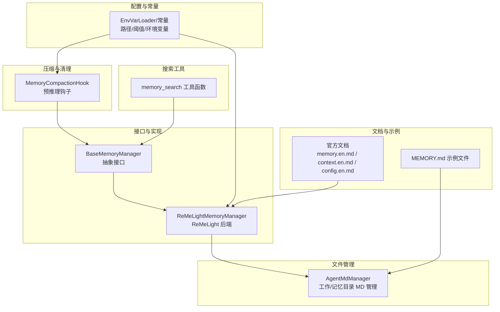
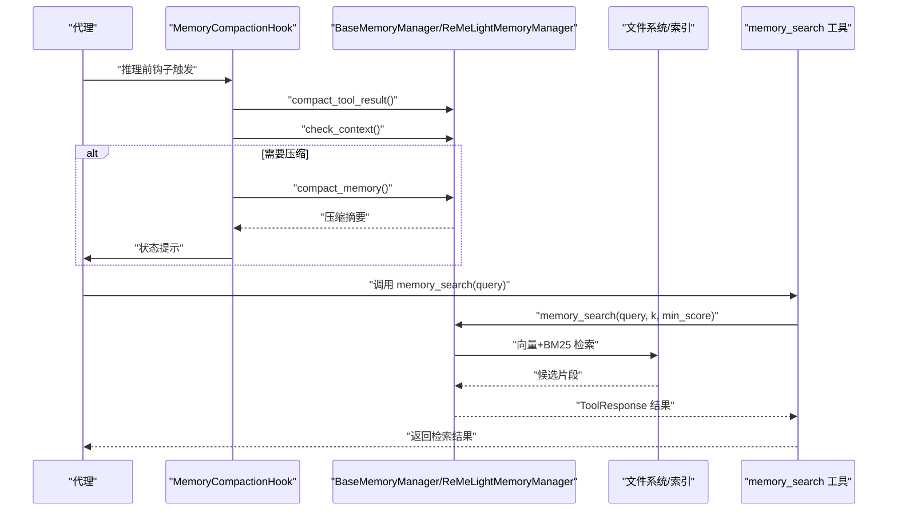
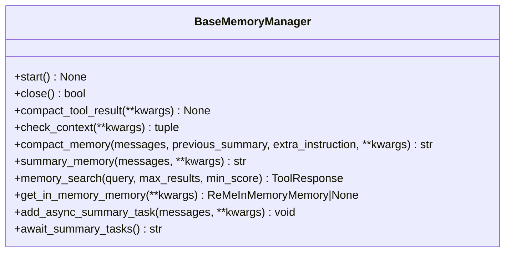
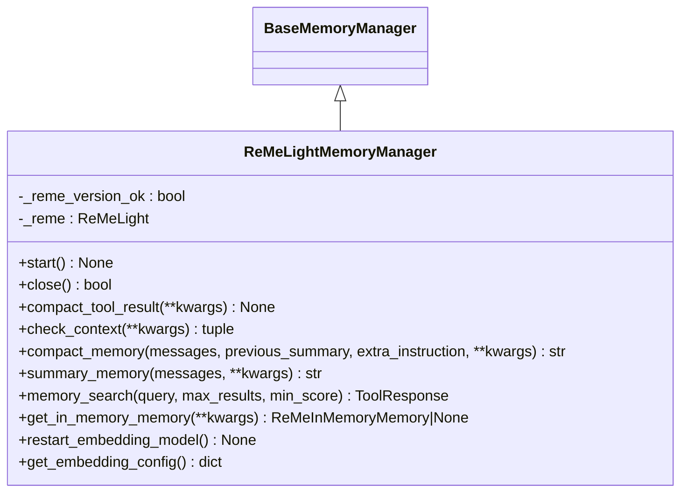
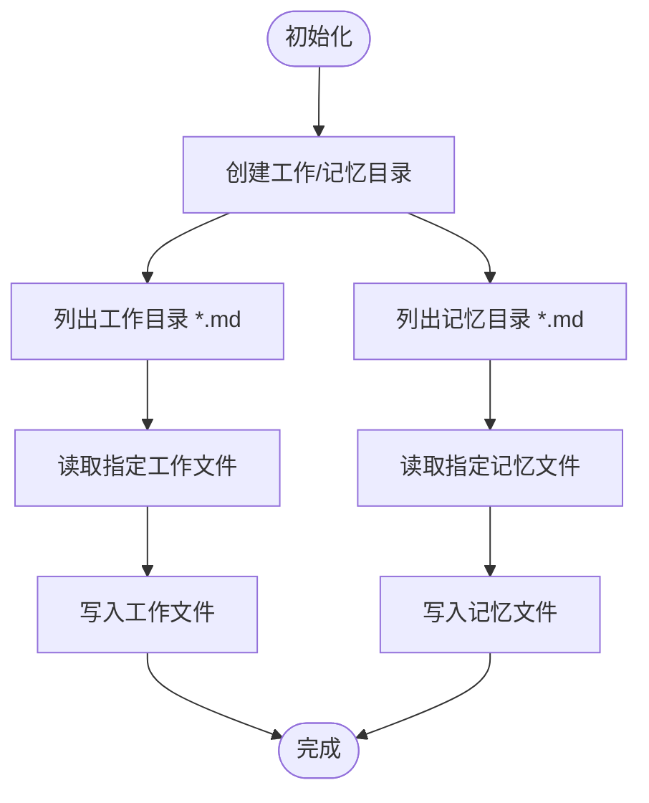
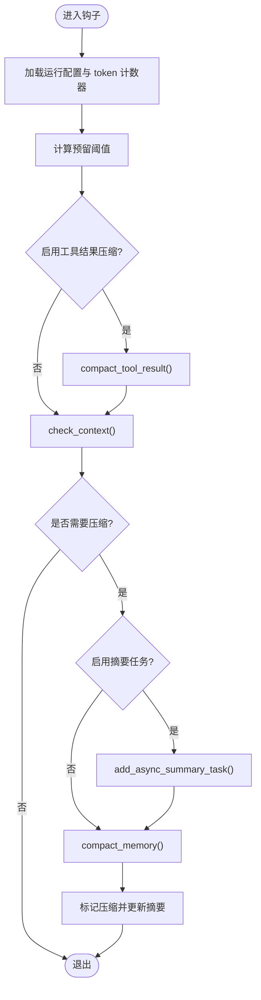
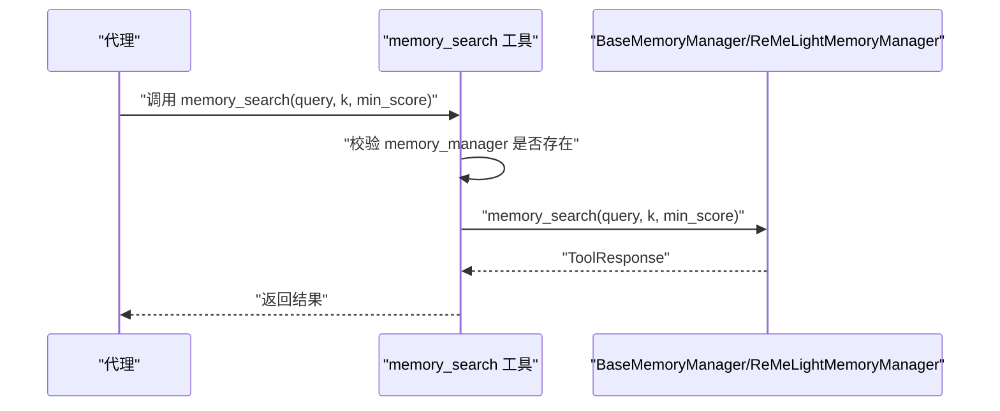
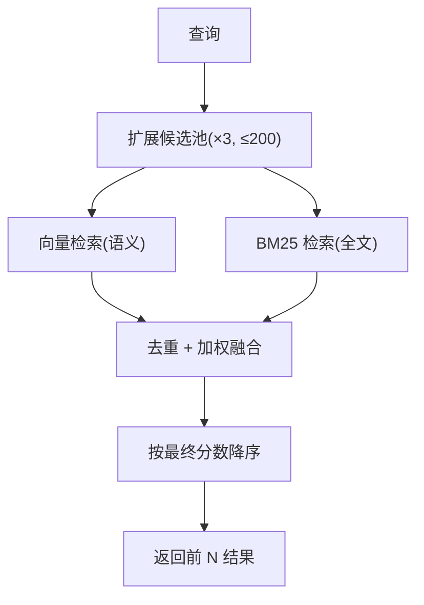
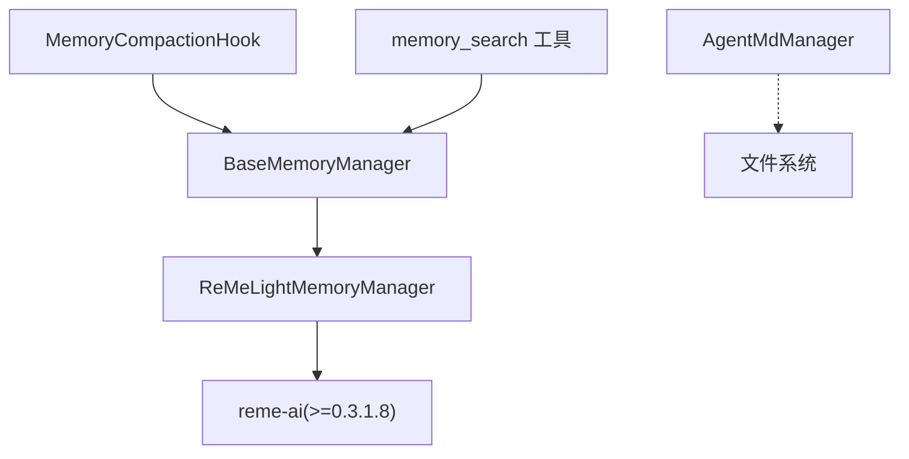

# 长短期记忆系统

<cite>
**本文引用的文件**
- [src/qwenpaw/agents/memory/base_memory_manager.py](file://src/qwenpaw/agents/memory/base_memory_manager.py)
- [src/qwenpaw/agents/memory/reme_light_memory_manager.py](file://src/qwenpaw/agents/memory/reme_light_memory_manager.py)
- [src/qwenpaw/agents/memory/agent_md_manager.py](file://src/qwenpaw/agents/memory/agent_md_manager.py)
- [src/qwenpaw/agents/hooks/memory_compaction.py](file://src/qwenpaw/agents/hooks/memory_compaction.py)
- [src/qwenpaw/agents/tools/memory_search.py](file://src/qwenpaw/agents/tools/memory_search.py)
- [src/qwenpaw/constant.py](file://src/qwenpaw/constant.py)
- [src/qwenpaw/agents/command_handler.py](file://src/qwenpaw/agents/command_handler.py)
- [website/public/docs/memory.en.md](file://website/public/docs/memory.en.md)
- [website/public/docs/context.en.md](file://website/public/docs/context.en.md)
- [website/public/docs/config.en.md](file://website/public/docs/config.en.md)
- [src/qwenpaw/agents/md_files/en/MEMORY.md](file://src/qwenpaw/agents/md_files/en/MEMORY.md)
</cite>

## 目录
1. [简介](#简介)
2. [项目结构](#项目结构)
3. [核心组件](#核心组件)
4. [架构总览](#架构总览)
5. [详细组件分析](#详细组件分析)
6. [依赖关系分析](#依赖关系分析)
7. [性能考量](#性能考量)
8. [故障排除指南](#故障排除指南)
9. [结论](#结论)
10. [附录](#附录)

## 简介
本技术文档围绕 QwenPaw 的长短期记忆系统展开，重点解释以下方面：
- 内存管理架构设计：短期记忆与长期记忆的分离存储机制
- 文件存储机制：Markdown 文件管理、索引建立与内容检索
- 搜索检索算法：全文搜索（BM25）、语义相似度计算与结果融合排序
- 记忆压缩与清理策略：冗余数据去除与存储空间优化
- 内存配置与参数调优：存储路径、索引策略与性能参数
- 记忆数据的导入导出：备份恢复与迁移工具
- 监控与维护：状态检查与健康观测
- 与代理决策过程的集成：预推理钩子与命令交互
- 故障排除与数据完整性验证

## 项目结构
QwenPaw 的记忆系统由“接口层 + 实现层 + 工具层 + 配置层”构成，核心文件分布如下：
- 接口与实现：定义统一记忆管理器接口，并以 ReMeLight 为后端的具体实现
- 文件管理：对工作目录与长期记忆目录下的 Markdown 文件进行读写与列表
- 压缩与清理：在推理前通过钩子自动压缩上下文，减少 token 使用
- 搜索工具：封装 memory_search 工具，支持向量与 BM25 混合检索
- 配置与常量：环境变量与默认路径、阈值等参数
- 文档与示例：官方文档描述了混合检索、文件结构与使用场景

图表来源
- [src/qwenpaw/agents/memory/base_memory_manager.py:21-226](file://src/qwenpaw/agents/memory/base_memory_manager.py#L21-L226)
- [src/qwenpaw/agents/memory/reme_light_memory_manager.py:38-438](file://src/qwenpaw/agents/memory/reme_light_memory_manager.py#L38-L438)
- [src/qwenpaw/agents/memory/agent_md_manager.py:10-126](file://src/qwenpaw/agents/memory/agent_md_manager.py#L10-L126)
- [src/qwenpaw/agents/hooks/memory_compaction.py:27-214](file://src/qwenpaw/agents/hooks/memory_compaction.py#L27-L214)
- [src/qwenpaw/agents/tools/memory_search.py:7-70](file://src/qwenpaw/agents/tools/memory_search.py#L7-L70)
- [src/qwenpaw/constant.py:28-307](file://src/qwenpaw/constant.py#L28-L307)
- [website/public/docs/memory.en.md:1-257](file://website/public/docs/memory.en.md#L1-L257)
- [website/public/docs/context.en.md:105-143](file://website/public/docs/context.en.md#L105-L143)
- [website/public/docs/config.en.md:630-645](file://website/public/docs/config.en.md#L630-L645)
- [src/qwenpaw/agents/md_files/en/MEMORY.md:1-27](file://src/qwenpaw/agents/md_files/en/MEMORY.md#L1-L27)

章节来源
- [src/qwenpaw/agents/memory/base_memory_manager.py:21-226](file://src/qwenpaw/agents/memory/base_memory_manager.py#L21-L226)
- [src/qwenpaw/agents/memory/reme_light_memory_manager.py:38-438](file://src/qwenpaw/agents/memory/reme_light_memory_manager.py#L38-L438)
- [src/qwenpaw/agents/memory/agent_md_manager.py:10-126](file://src/qwenpaw/agents/memory/agent_md_manager.py#L10-L126)
- [src/qwenpaw/agents/hooks/memory_compaction.py:27-214](file://src/qwenpaw/agents/hooks/memory_compaction.py#L27-L214)
- [src/qwenpaw/agents/tools/memory_search.py:7-70](file://src/qwenpaw/agents/tools/memory_search.py#L7-L70)
- [src/qwenpaw/constant.py:28-307](file://src/qwenpaw/constant.py#L28-L307)
- [website/public/docs/memory.en.md:1-257](file://website/public/docs/memory.en.md#L1-L257)
- [website/public/docs/context.en.md:105-143](file://website/public/docs/context.en.md#L105-L143)
- [website/public/docs/config.en.md:630-645](file://website/public/docs/config.en.md#L630-L645)
- [src/qwenpaw/agents/md_files/en/MEMORY.md:1-27](file://src/qwenpaw/agents/md_files/en/MEMORY.md#L1-L27)

## 核心组件
- 抽象记忆管理器接口：定义生命周期、压缩、总结、搜索与内存对象获取等能力
- ReMeLight 记忆管理器：以 ReMeLight 为后端，封装启动/关闭、工具结果压缩、上下文检查、摘要生成、混合检索与内存对象获取
- Markdown 文件管理器：对工作目录与记忆目录中的 Markdown 文件进行列表、读取、写入
- 记忆压缩钩子：在推理前根据 token 阈值与保留策略自动压缩历史消息
- 搜索工具：封装 memory_search，返回带路径、行号与内容的结果
- 配置与常量：环境变量加载器、默认工作目录、内存目录、压缩保留条数、嵌入配置优先级等

章节来源
- [src/qwenpaw/agents/memory/base_memory_manager.py:21-226](file://src/qwenpaw/agents/memory/base_memory_manager.py#L21-L226)
- [src/qwenpaw/agents/memory/reme_light_memory_manager.py:38-438](file://src/qwenpaw/agents/memory/reme_light_memory_manager.py#L38-L438)
- [src/qwenpaw/agents/memory/agent_md_manager.py:10-126](file://src/qwenpaw/agents/memory/agent_md_manager.py#L10-L126)
- [src/qwenpaw/agents/hooks/memory_compaction.py:27-214](file://src/qwenpaw/agents/hooks/memory_compaction.py#L27-L214)
- [src/qwenpaw/agents/tools/memory_search.py:7-70](file://src/qwenpaw/agents/tools/memory_search.py#L7-L70)
- [src/qwenpaw/constant.py:28-307](file://src/qwenpaw/constant.py#L28-L307)

## 架构总览
下图展示了从代理到记忆系统的整体交互：代理通过命令或推理钩子触发压缩与检索；ReMeLight 后端负责与文件系统和向量/全文索引交互。

图表来源
- [src/qwenpaw/agents/hooks/memory_compaction.py:62-214](file://src/qwenpaw/agents/hooks/memory_compaction.py#L62-L214)
- [src/qwenpaw/agents/memory/reme_light_memory_manager.py:267-427](file://src/qwenpaw/agents/memory/reme_light_memory_manager.py#L267-L427)
- [src/qwenpaw/agents/tools/memory_search.py:17-69](file://src/qwenpaw/agents/tools/memory_search.py#L17-L69)

## 详细组件分析

### 抽象接口：BaseMemoryManager
- 职责：定义统一的记忆管理器接口，确保不同后端可替换
- 关键方法：
  - 生命周期：start/close
  - 上下文压缩：compact_tool_result/check_context/compact_memory
  - 总结：summary_memory
  - 搜索：memory_search
  - 内存对象：get_in_memory_memory
  - 异步摘要任务：add_async_summary_task/await_summary_tasks

图表来源
- [src/qwenpaw/agents/memory/base_memory_manager.py:21-226](file://src/qwenpaw/agents/memory/base_memory_manager.py#L21-L226)

章节来源
- [src/qwenpaw/agents/memory/base_memory_manager.py:21-226](file://src/qwenpaw/agents/memory/base_memory_manager.py#L21-L226)

### ReMeLight 记忆管理器：ReMeLightMemoryManager
- 职责：以 ReMeLight 为后端，提供启动/关闭、工具结果压缩、上下文检查、摘要生成、混合检索与内存对象获取
- 关键特性：
  - 自动选择存储后端（auto/local/chroma/sqlite），并在 Windows 上回退到 local
  - 嵌入配置优先级：配置文件 > 环境变量 > 默认
  - 全文检索开关（FTS_ENABLED）与向量检索开关（基于 base_url/model_name 是否为空）
  - 启动时通过哨兵文件控制一次性重建索引
  - 提供重启嵌入模型的能力
  - 对 compact_memory 返回异常进行保护与落盘记录

图表来源
- [src/qwenpaw/agents/memory/reme_light_memory_manager.py:38-438](file://src/qwenpaw/agents/memory/reme_light_memory_manager.py#L38-L438)
- [src/qwenpaw/agents/memory/base_memory_manager.py:21-226](file://src/qwenpaw/agents/memory/base_memory_manager.py#L21-L226)

章节来源
- [src/qwenpaw/agents/memory/reme_light_memory_manager.py:38-438](file://src/qwenpaw/agents/memory/reme_light_memory_manager.py#L38-L438)
- [website/public/docs/memory.en.md:103-159](file://website/public/docs/memory.en.md#L103-L159)
- [website/public/docs/config.en.md:630-645](file://website/public/docs/config.en.md#L630-L645)

### Markdown 文件管理：AgentMdManager
- 职责：管理工作目录与记忆目录下的 Markdown 文件，提供列表、读取、写入能力
- 目录结构：
  - 工作目录：存放通用 Markdown 文件
  - 记忆目录：memory 子目录，按日期组织每日记忆文件

图表来源
- [src/qwenpaw/agents/memory/agent_md_manager.py:10-126](file://src/qwenpaw/agents/memory/agent_md_manager.py#L10-L126)

章节来源
- [src/qwenpaw/agents/memory/agent_md_manager.py:10-126](file://src/qwenpaw/agents/memory/agent_md_manager.py#L10-L126)
- [src/qwenpaw/agents/md_files/en/MEMORY.md:1-27](file://src/qwenpaw/agents/md_files/en/MEMORY.md#L1-L27)

### 记忆压缩与清理：MemoryCompactionHook
- 触发时机：推理前钩子
- 流程：
  - 加载代理运行配置与 token 计数器
  - 计算系统提示与压缩摘要占用的 token 预留阈值
  - 可选先压缩工具结果（按阈值）
  - 检查上下文是否超过阈值，确定需要压缩的消息范围
  - 可选异步生成摘要任务
  - 调用 compact_memory 生成摘要并更新压缩摘要
  - 标记已压缩消息并清空旧内容

图表来源
- [src/qwenpaw/agents/hooks/memory_compaction.py:62-214](file://src/qwenpaw/agents/hooks/memory_compaction.py#L62-L214)
- [website/public/docs/context.en.md:126-136](file://website/public/docs/context.en.md#L126-L136)

章节来源
- [src/qwenpaw/agents/hooks/memory_compaction.py:62-214](file://src/qwenpaw/agents/hooks/memory_compaction.py#L62-L214)
- [website/public/docs/context.en.md:105-143](file://website/public/docs/context.en.md#L105-L143)

### 搜索检索：memory_search 工具
- 功能：对 MEMORY.md 与 memory/*.md 进行语义检索，返回带路径、行号与内容的结果
- 错误处理：当未启用内存管理器或检索失败时，返回错误提示的 ToolResponse
- 与 ReMeLight 的关系：直接委托给 memory_manager.memory_search

图表来源
- [src/qwenpaw/agents/tools/memory_search.py:17-69](file://src/qwenpaw/agents/tools/memory_search.py#L17-L69)
- [src/qwenpaw/agents/memory/reme_light_memory_manager.py:406-427](file://src/qwenpaw/agents/memory/reme_light_memory_manager.py#L406-L427)

章节来源
- [src/qwenpaw/agents/tools/memory_search.py:7-70](file://src/qwenpaw/agents/tools/memory_search.py#L7-L70)
- [src/qwenpaw/agents/memory/reme_light_memory_manager.py:406-427](file://src/qwenpaw/agents/memory/reme_light_memory_manager.py#L406-L427)

### 混合检索算法与排序
- 检索类型：向量语义检索（cosine 相似度）+ BM25 全文检索
- 融合策略：加权融合（默认向量权重 0.7，BM25 权重 0.3），先扩展候选池（默认 3 倍，上限 200），去重后按最终分数降序取前 N
- BM25 特性：对精确词项命中更敏感，支持短语奖励；针对 ChromaDB 的大小写敏感行为，自动生成多种大小写变体提升召回

图表来源
- [website/public/docs/memory.en.md:171-247](file://website/public/docs/memory.en.md#L171-L247)

章节来源
- [website/public/docs/memory.en.md:171-247](file://website/public/docs/memory.en.md#L171-L247)

### 配置与参数调优
- 存储路径与目录
  - 工作目录：优先 ~/.copaw（兼容旧版本），否则 QWENPAW_WORKING_DIR 或默认 ~/.qwenpaw
  - 记忆目录：工作目录下的 memory 子目录
- 嵌入配置优先级：配置文件 > 环境变量 > 默认
  - 支持字段：backend、api_key、base_url、model_name、dimensions、enable_cache、use_dimensions、max_cache_size、max_input_length、max_batch_size
- 全文检索开关：FTS_ENABLED（默认开启）
- 存储后端：MEMORY_STORE_BACKEND（auto/local/chroma/sqlite，默认 auto）
- 压缩相关常量：QWENPAW_MEMORY_COMPACT_KEEP_RECENT、QWENPAW_MEMORY_COMPACT_RATIO
- 日志级别、容器运行标志、最大并发与 QPM 等全局参数

章节来源
- [src/qwenpaw/constant.py:89-208](file://src/qwenpaw/constant.py#L89-L208)
- [website/public/docs/config.en.md:630-645](file://website/public/docs/config.en.md#L630-L645)
- [website/public/docs/memory.en.md:103-159](file://website/public/docs/memory.en.md#L103-L159)

### 导入导出与迁移
- 文件结构
  - MEMORY.md：长期记忆（可选），存放持久化事实与偏好
  - daily 日志：memory/YYYY-MM-DD.md，按日归档
- 导入导出建议
  - 备份：直接复制工作目录（含 MEMORY.md 与 memory/ 目录）
  - 恢复：将备份文件还原至相同工作目录，首次启动会根据哨兵文件决定是否重建索引
  - 迁移：更换工作目录后，重新初始化 ReMeLight 并重建索引（可通过配置强制重建）

章节来源
- [website/public/docs/memory.en.md:37-57](file://website/public/docs/memory.en.md#L37-L57)
- [src/qwenpaw/agents/md_files/en/MEMORY.md:1-27](file://src/qwenpaw/agents/md_files/en/MEMORY.md#L1-L27)

### 与代理决策过程的集成
- 命令交互：/compact 触发压缩；/long_term_memory 查看长期记忆
- 钩子集成：MemoryCompactionHook 在推理前自动检查并压缩上下文
- 搜索工具：memory_search 作为工具注册给代理，用于检索历史信息

章节来源
- [src/qwenpaw/agents/command_handler.py:93-160](file://src/qwenpaw/agents/command_handler.py#L93-L160)
- [src/qwenpaw/agents/command_handler.py:475-497](file://src/qwenpaw/agents/command_handler.py#L475-L497)
- [src/qwenpaw/agents/hooks/memory_compaction.py:62-214](file://src/qwenpaw/agents/hooks/memory_compaction.py#L62-L214)
- [src/qwenpaw/agents/tools/memory_search.py:7-70](file://src/qwenpaw/agents/tools/memory_search.py#L7-L70)

## 依赖关系分析
- 组件耦合
  - ReMeLightMemoryManager 依赖 ReMeLight（通过 pip 安装），并与 BaseMemoryManager 形成组合关系
  - MemoryCompactionHook 依赖 BaseMemoryManager 接口，实现与具体后端解耦
  - memory_search 工具依赖 BaseMemoryManager 的 memory_search 方法
  - AgentMdManager 与 ReMeLightMemoryManager 解耦，仅操作文件系统
- 外部依赖
  - reme-ai 包版本需匹配（默认 0.3.1.8），否则发出警告
  - chromadb 可选依赖，若不可用则回退到本地存储后端

图表来源
- [src/qwenpaw/agents/memory/reme_light_memory_manager.py:38-438](file://src/qwenpaw/agents/memory/reme_light_memory_manager.py#L38-L438)
- [src/qwenpaw/agents/hooks/memory_compaction.py:27-214](file://src/qwenpaw/agents/hooks/memory_compaction.py#L27-L214)
- [src/qwenpaw/agents/tools/memory_search.py:7-70](file://src/qwenpaw/agents/tools/memory_search.py#L7-L70)
- [src/qwenpaw/agents/memory/agent_md_manager.py:10-126](file://src/qwenpaw/agents/memory/agent_md_manager.py#L10-L126)

章节来源
- [src/qwenpaw/agents/memory/reme_light_memory_manager.py:38-438](file://src/qwenpaw/agents/memory/reme_light_memory_manager.py#L38-L438)
- [src/qwenpaw/agents/hooks/memory_compaction.py:27-214](file://src/qwenpaw/agents/hooks/memory_compaction.py#L27-L214)
- [src/qwenpaw/agents/tools/memory_search.py:7-70](file://src/qwenpaw/agents/tools/memory_search.py#L7-L70)
- [src/qwenpaw/agents/memory/agent_md_manager.py:10-126](file://src/qwenpaw/agents/memory/agent_md_manager.py#L10-L126)

## 性能考量
- 向量检索与 BM25 的权衡：在语义理解与精确词命中之间取得平衡
- 候选池扩展与上限：避免过度扩大导致性能下降
- 嵌入缓存与批处理：通过嵌入配置中的缓存与批大小参数优化吞吐
- 存储后端选择：auto 模式在不同平台自动选择最稳定后端；chroma 在部分 Windows 环境可能不稳定
- 异步摘要任务：后台生成摘要，避免阻塞主线推理

## 故障排除指南
- 版本不匹配：reme-ai 版本不一致会发出警告，建议安装与期望版本一致的包
- chromadb 导入失败：系统 SQLite 版本过低可能导致 chromadb 导入失败，回退到 local 后端
- ReMe 未启动：memory_search 在未启动时返回错误提示，需确认 ReMeLight 已成功启动
- 压缩失败：compact_memory 返回空字符串或字典格式异常时，会保存无效结果到工作目录并记录日志
- 压缩阈值设置过低：系统提示与压缩摘要之和超过阈值，建议调整阈值或使用 /clear 重置上下文
- 检索失败：memory_search 工具捕获异常并返回错误提示，便于定位问题

章节来源
- [src/qwenpaw/agents/memory/reme_light_memory_manager.py:191-218](file://src/qwenpaw/agents/memory/reme_light_memory_manager.py#L191-L218)
- [src/qwenpaw/agents/memory/reme_light_memory_manager.py:80-90](file://src/qwenpaw/agents/memory/reme_light_memory_manager.py#L80-L90)
- [src/qwenpaw/agents/memory/reme_light_memory_manager.py:414-422](file://src/qwenpaw/agents/memory/reme_light_memory_manager.py#L414-L422)
- [src/qwenpaw/agents/hooks/memory_compaction.py:104-113](file://src/qwenpaw/agents/hooks/memory_compaction.py#L104-L113)
- [src/qwenpaw/agents/tools/memory_search.py:59-67](file://src/qwenpaw/agents/tools/memory_search.py#L59-L67)

## 结论
QwenPaw 的长短期记忆系统以 ReMeLight 为核心，结合文件存储与混合检索，实现了高可用、可移植且可扩展的记忆管理方案。通过预推理压缩钩子与灵活的配置参数，系统在保证上下文可控的同时，提供了强大的语义与全文检索能力。配合清晰的文件结构与备份策略，用户可以在不同环境中稳定地使用与迁移记忆数据。

## 附录
- 常用命令
  - /compact：手动触发上下文压缩
  - /long_term_memory：查看长期记忆内容
- 常见问题
  - 如何切换存储后端？通过 MEMORY_STORE_BACKEND 环境变量设置
  - 如何禁用向量检索？确保 EMBEDDING_BASE_URL 或 EMBEDDING_MODEL_NAME 为空
  - 如何强制重建索引？在代理配置中启用“启动时重建索引”，或删除工作目录下的哨兵文件后重启