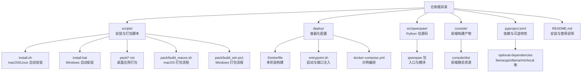
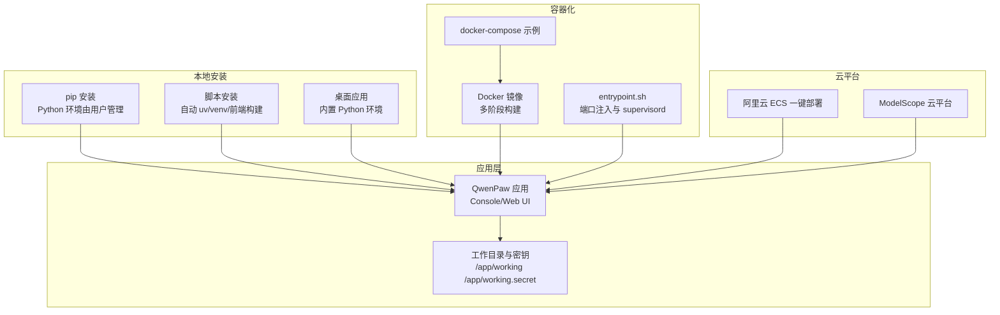
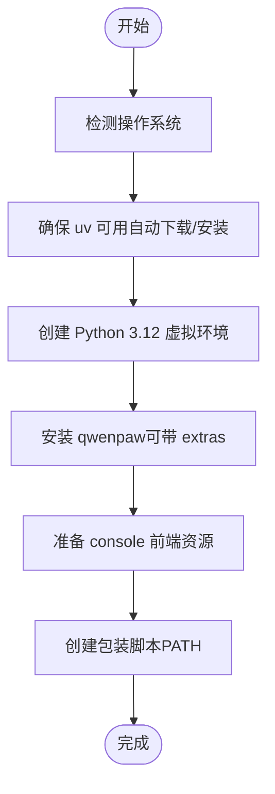
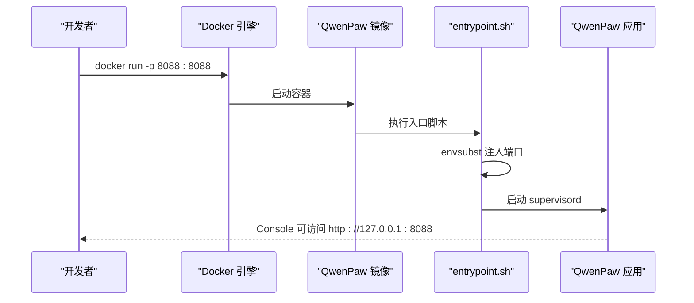
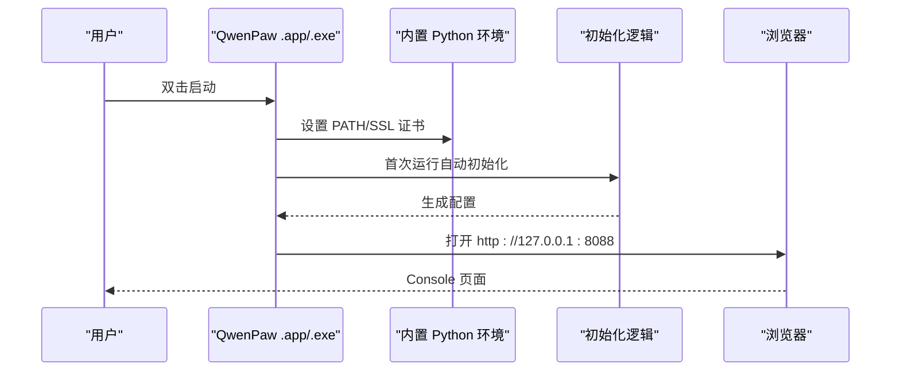
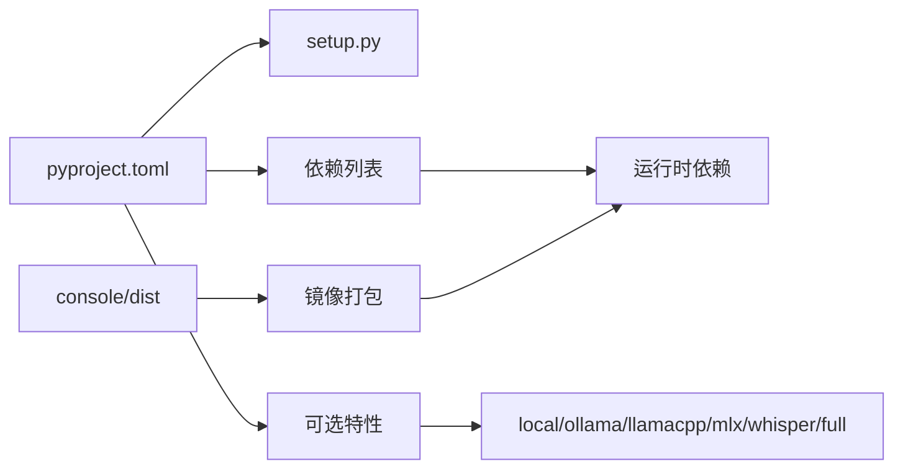

# 安装与部署选项

<cite>
**本文引用的文件**
- [README.md](file://README.md)
- [scripts/install.sh](file://scripts/install.sh)
- [scripts/install.bat](file://scripts/install.bat)
- [deploy/Dockerfile](file://deploy/Dockerfile)
- [deploy/entrypoint.sh](file://deploy/entrypoint.sh)
- [docker-compose.yml](file://docker-compose.yml)
- [scripts/docker_build.sh](file://scripts/docker_build.sh)
- [pyproject.toml](file://pyproject.toml)
- [setup.py](file://setup.py)
- [scripts/README.md](file://scripts/README.md)
- [scripts/pack/desktop.nsi](file://scripts/pack/desktop.nsi)
- [scripts/pack/build_macos.sh](file://scripts/pack/build_macos.sh)
- [scripts/pack/build_win.ps1](file://scripts/pack/build_win.ps1)
- [scripts/pack/README.md](file://scripts/pack/README.md)
</cite>

## 目录
1. [简介](#简介)
2. [项目结构](#项目结构)
3. [核心组件](#核心组件)
4. [架构总览](#架构总览)
5. [详细组件分析](#详细组件分析)
6. [依赖关系分析](#依赖关系分析)
7. [性能考虑](#性能考虑)
8. [故障排查指南](#故障排查指南)
9. [结论](#结论)
10. [附录](#附录)

## 简介
本指南面向不同技术背景与运维需求的用户，系统性介绍 QwenPaw 的六种安装与部署方式，并提供每种方式的技术原理、优缺点、适用场景、系统要求、网络与权限配置、以及高级部署选项与验证方法。目标是帮助您在本地、容器、云平台或桌面环境中快速、稳定地完成部署。

## 项目结构
围绕安装与部署的关键目录与文件如下：
- 脚本安装器：scripts/install.sh（macOS/Linux）、scripts/install.bat（Windows）
- 容器化：deploy/Dockerfile、deploy/entrypoint.sh、docker-compose.yml、scripts/docker_build.sh
- 打包与桌面应用：scripts/pack/desktop.nsi、scripts/pack/build_macos.sh、scripts/pack/build_win.ps1、scripts/pack/README.md
- 包管理与元数据：pyproject.toml、setup.py
- 文档与脚本使用说明：scripts/README.md、README.md

图表来源
- [scripts/install.sh:1-340](file://scripts/install.sh#L1-L340)
- [scripts/install.bat:1-557](file://scripts/install.bat#L1-L557)
- [deploy/Dockerfile:1-103](file://deploy/Dockerfile#L1-L103)
- [deploy/entrypoint.sh:1-10](file://deploy/entrypoint.sh#L1-L10)
- [docker-compose.yml:1-23](file://docker-compose.yml#L1-L23)
- [pyproject.toml:1-111](file://pyproject.toml#L1-L111)
- [scripts/pack/build_macos.sh:1-184](file://scripts/pack/build_macos.sh#L1-L184)
- [scripts/pack/build_win.ps1:1-325](file://scripts/pack/build_win.ps1#L1-L325)

章节来源
- [README.md:104-330](file://README.md#L104-L330)
- [scripts/README.md:1-53](file://scripts/README.md#L1-L53)

## 核心组件
- Python 包与可选特性：通过 pyproject.toml 定义主依赖与可选特性（local、ollama、llamacpp、mlx、whisper、full），用于按需启用本地模型后端与功能扩展。
- CLI 入口：qwenpaw 命令由 setuptools.scripts 指定，指向 qwenpaw.cli.main:cli。
- 容器镜像：Dockerfile 多阶段构建，先构建 console 前端，再安装 Python 运行时与应用；entrypoint.sh 注入端口变量并启动 supervisord。
- 桌面应用：基于打包脚本生成 .app（macOS）与 .exe（Windows），内置 Python 环境与证书路径处理，首次运行自动初始化配置。

章节来源
- [pyproject.toml:75-103](file://pyproject.toml#L75-L103)
- [pyproject.toml:71-74](file://pyproject.toml#L71-L74)
- [deploy/Dockerfile:12-103](file://deploy/Dockerfile#L12-L103)
- [deploy/entrypoint.sh:1-10](file://deploy/entrypoint.sh#L1-10)
- [scripts/pack/build_macos.sh:59-131](file://scripts/pack/build_macos.sh#L59-L131)
- [scripts/pack/build_win.ps1:155-254](file://scripts/pack/build_win.ps1#L155-L254)

## 架构总览
下图展示六种安装方式的总体架构与交互关系：

图表来源
- [README.md:106-330](file://README.md#L106-L330)
- [deploy/Dockerfile:12-103](file://deploy/Dockerfile#L12-L103)
- [deploy/entrypoint.sh:1-10](file://deploy/entrypoint.sh#L1-10)
- [docker-compose.yml:9-23](file://docker-compose.yml#L9-L23)

## 详细组件分析

### 方式一：pip 安装（适合有 Python 环境的用户）
- 技术原理
  - 使用 pip 安装 qwenpaw 包，依赖由 pyproject.toml 提供；可选特性通过 extras 指定（如本地模型后端）。
  - 安装后通过 qwenpaw CLI 初始化配置并启动应用。
- 优点
  - 最直接、可控性强；便于集成到现有 Python 工作流。
- 缺点
  - 需要用户自行准备 Python 环境与虚拟空间。
- 适用场景
  - 开发者、运维工程师、已有 Python 环境的用户。
- 系统要求与网络
  - Python 版本范围：>=3.10,<3.14；网络可达 PyPI 或镜像源。
- 权限配置
  - 以用户权限写入工作目录（默认 ~/.qwenpaw）。
- 高级选项
  - 通过 extras 安装本地模型支持（见 pyproject.toml 可选特性）。
- 验证步骤
  - 运行 qwenpaw init --defaults 后访问 http://127.0.0.1:8088/。
- 故障排查
  - 若命令不可用，确认 Python 虚拟环境激活与 PATH 设置正确。

章节来源
- [README.md:106-117](file://README.md#L106-L117)
- [pyproject.toml:6, 75-103](file://pyproject.toml#L6-L6, L75-L103)

### 方式二：脚本安装（自动环境配置）
- 技术原理
  - 自动检测/安装 uv（Python 包与虚拟环境管理工具），创建 Python 3.12 虚拟环境，安装 qwenpaw 与可选 extras；同时尝试构建或复制 console 前端资源。
  - 支持从源码安装与指定版本安装。
- 优点
  - 无需手动准备 Python；跨平台（macOS/Linux/Windows）。
- 缺点
  - 受网络环境影响（uv 下载、PyPI 访问）；Windows 企业受限语言模式可能影响 PATH 更新。
- 适用场景
  - 不想手动配置 Python 的用户；快速试用与演示。
- 系统要求与网络
  - macOS/Linux：支持；Windows：支持，但受限语言模式需手动配置 PATH。
- 权限配置
  - 默认安装到用户目录 ~/.qwenpaw；自动更新 PATH（若未成功，按提示手动添加）。
- 高级选项
  - --extras 指定 llamacpp、mlx、ollama 等；--version 指定版本；--from-source 从本地或 GitHub 源码安装。
- 验证步骤
  - 新终端执行 qwenpaw init 与 qwenpaw app，访问 http://127.0.0.1:8088/。
- 故障排查
  - uv 安装失败：参考脚本内提示，手动安装 uv 并重试；Windows 企业版受限语言模式请按说明手动配置 PATH。

图表来源
- [scripts/install.sh:104-134](file://scripts/install.sh#L104-L134)
- [scripts/install.sh:136-147](file://scripts/install.sh#L136-L147)
- [scripts/install.sh:216-245](file://scripts/install.sh#L216-L245)
- [scripts/install.sh:256-277](file://scripts/install.sh#L256-L277)

章节来源
- [README.md:122-187](file://README.md#L122-L187)
- [scripts/install.sh:1-340](file://scripts/install.sh#L1-L340)
- [scripts/install.bat:162-225](file://scripts/install.bat#L162-L225)
- [scripts/install.bat:301-330](file://scripts/install.bat#L301-L330)

### 方式三：Docker 部署（容器化方案）
- 技术原理
  - 多阶段 Dockerfile：先在 Node 基础镜像中构建 console 前端，再在 Python 基础镜像中安装应用与依赖；entrypoint.sh 注入端口变量并启动 supervisord。
  - docker-compose.yml 提供示例卷与端口映射。
- 优点
  - 一次构建，跨平台运行；隔离性强；易于横向扩展。
- 缺点
  - 需要 Docker 环境；网络访问外部服务（如 Ollama/LM Studio）需正确路由。
- 适用场景
  - 生产环境、CI/CD、需要隔离与可移植性的场景。
- 系统要求与网络
  - 容器主机具备 Docker；若容器内访问宿主机服务，使用 host.docker.internal 或 host 网络。
- 权限配置
  - 数据持久化通过命名卷（qwenpaw-data、qwenpaw-secrets）实现。
- 高级选项
  - 自定义镜像：使用 scripts/docker_build.sh 构建，支持通道过滤与端口覆盖。
  - 企业环境：通过 --network=host 绕过端口冲突；或使用 host.docker.internal 映射宿主机服务。
- 验证步骤
  - docker run 映射 8088 端口，访问 http://127.0.0.1:8088/；查看卷内容确认配置持久化。
- 故障排查
  - 端口占用：修改 -p 映射或设置 QWENPAW_PORT；容器无法访问宿主机服务：使用 host.docker.internal 或 --network=host。

图表来源
- [deploy/Dockerfile:82-103](file://deploy/Dockerfile#L82-L103)
- [deploy/entrypoint.sh:1-10](file://deploy/entrypoint.sh#L1-L10)
- [docker-compose.yml:9-23](file://docker-compose.yml#L9-L23)

章节来源
- [README.md:230-272](file://README.md#L230-L272)
- [deploy/Dockerfile:1-103](file://deploy/Dockerfile#L1-L103)
- [deploy/entrypoint.sh:1-10](file://deploy/entrypoint.sh#L1-L10)
- [docker-compose.yml:1-23](file://docker-compose.yml#L1-L23)
- [scripts/docker_build.sh:1-32](file://scripts/docker_build.sh#L1-L32)

### 方式四：阿里云 ECS 一键部署（云平台方案）
- 技术原理
  - 通过阿里云 ComputeNest 服务提供的一键部署链接，引导用户在 ECS 上完成 QwenPaw 的安装与配置。
- 优点
  - 无需本地操作，直接在云上完成部署。
- 缺点
  - 仅适用于阿里云生态。
- 适用场景
  - 阿里云用户快速上线。
- 系统要求与网络
  - 具备阿里云账号与 ECS 实例；网络可达阿里云服务。
- 权限配置
  - 由平台向导完成。
- 高级选项
  - 在平台界面选择实例规格、镜像与网络配置。
- 验证步骤
  - 按平台指引完成部署后，通过控制台或平台提供的访问地址进行验证。
- 故障排查
  - 参考平台文档与日志定位问题。

章节来源
- [README.md:275-278](file://README.md#L275-L278)

### 方式五：ModelScope 云平台（免本地安装）
- 技术原理
  - 在 ModelScope Studio 中一键克隆并部署 QwenPaw，无需本地安装 Python 或容器。
- 优点
  - 零本地安装成本；在线即可使用。
- 缺点
  - 依赖 ModelScope 网络与权限策略。
- 适用场景
  - 快速试用、在线开发与演示。
- 系统要求与网络
  - 可访问 ModelScope Studio；Studio 设为非公开以保护隐私。
- 权限配置
  - Studio 内部权限与密钥管理。
- 高级选项
  - 选择工作区与环境配置。
- 验证步骤
  - 在 Studio 中打开应用，按提示配置模型与密钥。
- 故障排查
  - Studio 网络异常或权限不足时，切换网络或调整 Studio 设置。

章节来源
- [README.md:281-284](file://README.md#L281-L284)

### 方式六：桌面应用（零配置体验）
- 技术原理
  - 通过打包脚本生成 .app（macOS）或 .exe（Windows），内置 Python 环境与证书路径；首次运行自动初始化配置。
- 优点
  - 双击即用；无需命令行；跨平台。
- 缺点
  - Beta 阶段可能存在兼容性与性能问题。
- 适用场景
  - 普通用户、非技术用户。
- 系统要求与网络
  - Windows 10+；macOS 14+；Apple Silicon 推荐（MLX 支持）。
- 权限配置
  - 首次运行自动创建配置；macOS 可能弹窗请求“桌面/文件夹”访问。
- 高级选项
  - 日志级别可通过环境变量 QWENPAW_LOG_LEVEL 控制；双击无响应时查看 ~/.qwenpaw/desktop.log。
- 验证步骤
  - 双击应用，等待初始化完成，浏览器自动打开 Console。
- 故障排查
  - macOS “无法验证开发者”：右键打开或在系统设置中允许；Windows 右键以管理员身份运行或查看安装日志。

图表来源
- [scripts/pack/build_macos.sh:59-131](file://scripts/pack/build_macos.sh#L59-L131)
- [scripts/pack/build_win.ps1:155-254](file://scripts/pack/build_win.ps1#L155-L254)
- [scripts/pack/desktop.nsi:36-48](file://scripts/pack/desktop.nsi#L36-L48)

章节来源
- [README.md:287-330](file://README.md#L287-L330)
- [scripts/pack/README.md:11-22](file://scripts/pack/README.md#L11-L22)
- [scripts/pack/build_macos.sh:1-184](file://scripts/pack/build_macos.sh#L1-L184)
- [scripts/pack/build_win.ps1:1-325](file://scripts/pack/build_win.ps1#L1-L325)
- [scripts/pack/desktop.nsi:1-57](file://scripts/pack/desktop.nsi#L1-L57)

## 依赖关系分析
- 包管理与入口
  - setup.py 委托 setuptools 动态读取 pyproject.toml；pyproject.toml 定义主依赖与可选特性。
- 可选特性与后端
  - local/ollama/llamacpp/mlx/whisper/full 等通过 optional-dependencies 提供，按需安装。
- 前端资源
  - Dockerfile 将 console/dist 注入到包内，保证容器内可直接提供 Web UI。

图表来源
- [pyproject.toml:1-111](file://pyproject.toml#L1-L111)
- [setup.py:1-5](file://setup.py#L1-L5)
- [deploy/Dockerfile:87-89](file://deploy/Dockerfile#L87-L89)

章节来源
- [pyproject.toml:1-111](file://pyproject.toml#L1-L111)
- [setup.py:1-5](file://setup.py#L1-L5)
- [deploy/Dockerfile:87-89](file://deploy/Dockerfile#L87-L89)

## 性能考虑
- 容器内浏览器与渲染
  - 使用系统 Chromium 并禁用沙箱标志，避免在容器中出现渲染问题；Playwright 通过环境变量指定可执行路径并跳过下载。
- 启动与日志
  - 桌面应用在无 TTY 时将日志重定向至用户目录日志文件，便于排障；可通过环境变量调整日志级别。
- 端口与并发
  - 默认端口 8088；容器可通过环境变量覆盖；supervisord 管理进程生命周期。

章节来源
- [deploy/Dockerfile:74-78](file://deploy/Dockerfile#L74-L78)
- [scripts/pack/build_macos.sh:86-125](file://scripts/pack/build_macos.sh#L86-L125)
- [deploy/entrypoint.sh:5](file://deploy/entrypoint.sh#L5)

## 故障排查指南
- 安装器类问题
  - uv 未找到或安装失败：按脚本提示手动安装 uv；Windows 企业受限语言模式需手动更新 PATH。
  - 前端构建失败：安装 Node.js 后重新运行安装器；或手动构建 console 并复制到 src/qwenpaw/console。
- 容器类问题
  - 端口冲突：修改 -p 映射或设置 QWENPAW_PORT；容器无法访问宿主机服务：使用 host.docker.internal 或 --network=host。
  - 卷权限：确认数据卷与密钥卷挂载路径正确且具有读写权限。
- 桌面应用类问题
  - macOS “无法验证开发者”：右键打开或在系统设置中允许；首次运行可能弹出“桌面/文件夹”访问请求。
  - 启动无响应：查看 ~/.qwenpaw/desktop.log 获取错误堆栈。
- 通用验证
  - 访问 http://127.0.0.1:8088/ 确认 Console 正常；检查工作目录与密钥卷内容。

章节来源
- [scripts/install.sh:120-132](file://scripts/install.sh#L120-L132)
- [scripts/install.bat:194-207](file://scripts/install.bat#L194-L207)
- [README.md:246-270](file://README.md#L246-L270)
- [scripts/pack/README.md:61-73](file://scripts/pack/README.md#L61-L73)

## 结论
QwenPaw 提供了从本地到云端、从命令行到桌面应用的多样化安装与部署路径。根据团队技术栈与运维偏好选择合适的方式：追求极致可控与集成的用户可选 pip；希望快速上手的用户可选脚本安装；需要隔离与可移植性的场景可选 Docker；云原生用户可选阿里云 ECS 或 ModelScope；普通用户可选桌面应用。结合本文的系统要求、网络与权限配置、高级选项与验证方法，可在不同环境中高效落地。

## 附录
- 自定义 Docker 镜像构建
  - 使用 scripts/docker_build.sh 指定镜像标签与构建参数，支持通道白名单/黑名单与额外构建选项。
- 企业环境部署注意事项
  - 端口与网络策略：使用 --network=host 或 host.docker.internal；严格防火墙下建议使用企业镜像源。
  - 安全与认证：可启用 Web 登录保护（环境变量开关），并限制通道白名单。
- 性能优化配置
  - 容器内渲染：使用系统 Chromium；桌面应用预编译字节码提升启动速度；合理设置日志级别。
- 部署后验证清单
  - Console 可访问；工作目录与密钥卷存在；API 密钥与 Provider 正确配置；必要时进行通道连通性测试。

章节来源
- [scripts/docker_build.sh:1-32](file://scripts/docker_build.sh#L1-L32)
- [README.md:382-392](file://README.md#L382-L392)
- [scripts/pack/build_win.ps1:128-153](file://scripts/pack/build_win.ps1#L128-L153)