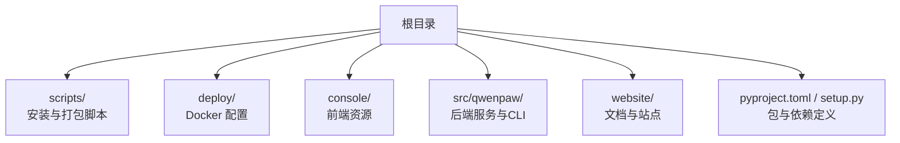
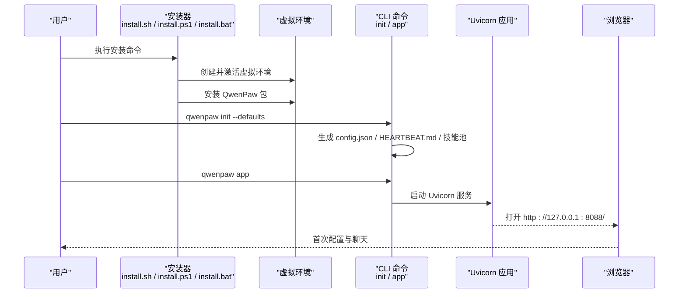
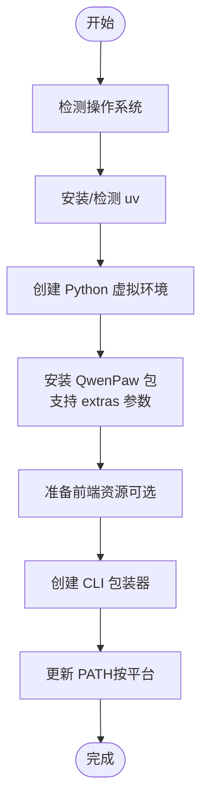
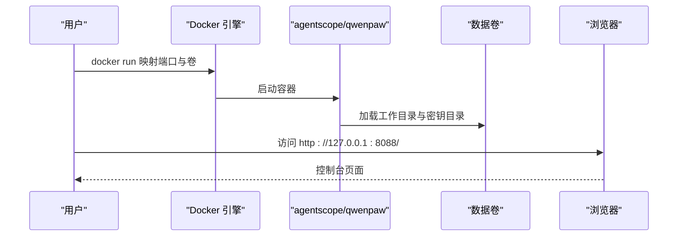
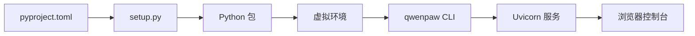

# 快速开始指南

<cite>
**本文引用的文件**
- [README.md](file://README.md)
- [install.sh](file://scripts/install.sh)
- [install.ps1](file://scripts/install.ps1)
- [install.bat](file://scripts/install.bat)
- [Dockerfile](file://deploy/Dockerfile)
- [docker_build.sh](file://scripts/docker_build.sh)
- [pyproject.toml](file://pyproject.toml)
- [setup.py](file://setup.py)
- [init_cmd.py](file://src/qwenpaw/cli/init_cmd.py)
- [app_cmd.py](file://src/qwenpaw/cli/app_cmd.py)
- [config.py](file://src/qwenpaw/config/config.py)
- [manager.py](file://src/qwenpaw/local_models/manager.py)
- [desktop.nsi](file://scripts/pack/desktop.nsi)
- [build_macos.sh](file://scripts/pack/build_macos.sh)
- [build_win.ps1](file://scripts/pack/build_win.ps1)
</cite>

## 目录
1. [简介](#简介)
2. [项目结构](#项目结构)
3. [核心组件](#核心组件)
4. [架构总览](#架构总览)
5. [详细组件分析](#详细组件分析)
6. [依赖关系分析](#依赖关系分析)
7. [性能考虑](#性能考虑)
8. [故障排除指南](#故障排除指南)
9. [结论](#结论)
10. [附录](#附录)

## 简介
本指南面向首次接触 QwenPaw 的用户，帮助你在最短时间内完成安装与首次运行，并进行基础的聊天交互。文档覆盖以下六种安装方式：
- pip 安装
- 脚本安装（macOS/Linux / Windows）
- Docker 部署
- 阿里云 ECS 一键部署
- ModelScope 云平台
- 桌面应用（Beta）

同时，文档提供 API 密钥配置、本地模型设置、首次运行验证等关键步骤，并给出常见问题的解决方案。

## 项目结构
QwenPaw 提供了多种安装入口与运行方式，核心目录与文件如下：
- 根目录包含安装脚本、Docker 配置、打包脚本与项目元数据
- console 目录提供前端界面资源
- src/qwenpaw 目录包含后端服务、CLI、配置与本地模型管理等模块
- deploy 目录包含 Dockerfile 与入口脚本
- scripts 目录包含安装、构建与打包脚本
- website 目录包含官方文档与站点资源

**图表来源**
- [pyproject.toml:1-111](file://pyproject.toml#L1-L111)
- [setup.py:1-5](file://setup.py#L1-L5)
- [Dockerfile:1-103](file://deploy/Dockerfile#L1-L103)

**章节来源**
- [README.md:104-120](file://README.md#L104-L120)
- [pyproject.toml:1-111](file://pyproject.toml#L1-L111)
- [setup.py:1-5](file://setup.py#L1-L5)

## 核心组件
- CLI 初始化与启动
  - 初始化命令负责生成工作目录、配置文件、心跳查询与技能池等
  - 启动命令负责运行内置的 Uvicorn 服务，提供 Web 控制台与 API
- 配置系统
  - 通过 config.json 管理通道、代理、运行时行为、路由与语言等
- 本地模型管理
  - 封装 llama.cpp 与模型下载、服务器启停与状态查询
- 安装与打包
  - 多平台安装脚本与桌面应用打包脚本

**章节来源**
- [init_cmd.py:119-523](file://src/qwenpaw/cli/init_cmd.py#L119-L523)
- [app_cmd.py:15-112](file://src/qwenpaw/cli/app_cmd.py#L15-L112)
- [config.py:1-800](file://src/qwenpaw/config/config.py#L1-L800)
- [manager.py:1-229](file://src/qwenpaw/local_models/manager.py#L1-L229)

## 架构总览
下图展示了从安装到首次运行的关键流程：安装器创建虚拟环境并安装包；初始化命令生成配置与技能；启动命令运行服务并在浏览器打开控制台。

**图表来源**
- [install.sh:104-245](file://scripts/install.sh#L104-L245)
- [install.ps1:193-325](file://scripts/install.ps1#L193-L325)
- [install.bat:306-459](file://scripts/install.bat#L306-L459)
- [init_cmd.py:138-523](file://src/qwenpaw/cli/init_cmd.py#L138-L523)
- [app_cmd.py:55-112](file://src/qwenpaw/cli/app_cmd.py#L55-L112)

## 详细组件分析

### 方式一：pip 安装
- 适用场景
  - 已有 Python 环境且希望最小化依赖
- 前置条件
  - Python 3.10–3.14
- 步骤
  - 安装包：pip install qwenpaw
  - 初始化：qwenpaw init --defaults
  - 启动：qwenpaw app
  - 在浏览器打开 http://127.0.0.1:8088/ 进行模型配置
- 首次运行验证
  - 浏览器显示控制台页面，提示配置模型或技能
- 常见问题
  - 端口占用：修改 --port 或停止占用进程
  - 权限不足：在容器或受限环境中以非 root 用户运行

**章节来源**
- [README.md:106-118](file://README.md#L106-L118)
- [pyproject.toml:1-111](file://pyproject.toml#L1-L111)

### 方式二：脚本安装（macOS/Linux / Windows）
- 适用场景
  - 不想手动管理 Python 环境，自动处理 uv、虚拟环境与依赖
- 前置条件
  - macOS/Linux：可访问外部网络
  - Windows：允许执行脚本（必要时调整执行策略）
- 步骤
  - macOS/Linux：curl -fsSL https://qwenpaw.agentscope.io/install.sh | bash
  - Windows（CMD）：curl -fsSL https://qwenpaw.agentscope.io/install.bat -o install.bat && install.bat
  - Windows（PowerShell）：irm https://qwenpaw.agentscope.io/install.ps1 | iex
  - 可选 extras：--extras ollama 或 --extras ollama,local
  - 安装完成后：qwenpaw init --defaults；qwenpaw app
- 首次运行验证
  - 新终端中执行 qwenpaw app，浏览器打开 http://127.0.0.1:8088/
- 常见问题
  - Windows 企业版受限：Constrained Language Mode 可能导致环境变量无法自动更新，需手动添加 PATH
  - 网络受限：脚本会自动选择镜像源，如仍失败请参考脚本内提示

**图表来源**
- [install.sh:104-340](file://scripts/install.sh#L104-L340)
- [install.ps1:85-477](file://scripts/install.ps1#L85-L477)
- [install.bat:162-557](file://scripts/install.bat#L162-L557)

**章节来源**
- [README.md:122-187](file://README.md#L122-L187)
- [install.sh:104-340](file://scripts/install.sh#L104-L340)
- [install.ps1:85-477](file://scripts/install.ps1#L85-L477)
- [install.bat:162-557](file://scripts/install.bat#L162-L557)

### 方式三：Docker 部署
- 适用场景
  - 希望快速获得隔离环境，便于迁移与备份
- 前置条件
  - 已安装 Docker
- 步骤
  - 拉取镜像：docker pull agentscope/qwenpaw:latest
  - 运行容器：映射端口与持久化卷（工作目录与密钥目录）
  - 访问地址：http://127.0.0.1:8088/
  - 如需连接宿主机服务（如 Ollama/LM Studio），使用 host.docker.internal 或 host 网络模式
- 首次运行验证
  - 浏览器打开控制台，配置模型与 API 密钥
- 常见问题
  - 容器内 localhost 指向容器自身：使用 host.docker.internal 或 host 网络
  - 端口冲突：修改映射端口

**图表来源**
- [Dockerfile:29-103](file://deploy/Dockerfile#L29-L103)
- [README.md:230-272](file://README.md#L230-L272)

**章节来源**
- [README.md:230-272](file://README.md#L230-L272)
- [Dockerfile:1-103](file://deploy/Dockerfile#L1-L103)
- [docker_build.sh:1-32](file://scripts/docker_build.sh#L1-L32)

### 方式四：阿里云 ECS 一键部署
- 适用场景
  - 在阿里云上快速部署，适合国内用户
- 步骤
  - 访问 ECS 一键部署链接，按向导完成实例创建与初始化
- 首次运行验证
  - 通过控制台或浏览器访问默认端口，完成模型配置

**章节来源**
- [README.md:275-279](file://README.md#L275-L279)

### 方式五：ModelScope 云平台
- 适用场景
  - 无需本地环境，直接在 ModelScope 上一键创建实例
- 步骤
  - 访问 Studio，选择 Fork 目标仓库，创建公开或非公开实例
- 首次运行验证
  - 在 Studio 中打开应用，配置模型与 API 密钥

**章节来源**
- [README.md:281-285](file://README.md#L281-L285)

### 方式六：桌面应用（Beta）
- 适用场景
  - 不熟悉命令行或希望零配置体验
- 步骤
  - 下载对应平台安装包，双击安装
  - 首次启动可能耗时 10–60 秒，等待浏览器自动打开
  - macOS 可能出现“未验证开发者”提示，按提示允许或右键打开
- 首次运行验证
  - 自动打开浏览器窗口，进入控制台进行配置
- 常见问题
  - macOS 安全限制：按提示允许应用或移除 quarantine 属性
  - 启动缓慢：首次解压与依赖加载所致，后续启动更快

**章节来源**
- [README.md:287-330](file://README.md#L287-L330)
- [desktop.nsi:1-57](file://scripts/pack/desktop.nsi#L1-L57)
- [build_macos.sh:59-131](file://scripts/pack/build_macos.sh#L59-L131)
- [build_win.ps1:155-255](file://scripts/pack/build_win.ps1#L155-L255)

## 依赖关系分析
- 包与脚本
  - pyproject.toml 定义主包与可选依赖（如本地模型、Ollama、Whisper 等）
  - setup.py 作为打包入口
  - 安装脚本通过 uv 创建虚拟环境并安装包
- 运行时依赖
  - Uvicorn 提供异步 HTTP 服务
  - 前端资源由安装脚本复制至包内或在 Docker 构建阶段注入

**图表来源**
- [pyproject.toml:1-111](file://pyproject.toml#L1-L111)
- [setup.py:1-5](file://setup.py#L1-L5)
- [install.sh:216-245](file://scripts/install.sh#L216-L245)
- [Dockerfile:82-93](file://deploy/Dockerfile#L82-L93)

**章节来源**
- [pyproject.toml:1-111](file://pyproject.toml#L1-L111)
- [setup.py:1-5](file://setup.py#L1-L5)
- [install.sh:216-245](file://scripts/install.sh#L216-L245)
- [Dockerfile:82-93](file://deploy/Dockerfile#L82-L93)

## 性能考虑
- 本地模型
  - 使用 llama.cpp 时，可通过最大上下文长度参数平衡性能与精度
  - 建议根据硬件能力选择合适模型大小
- 服务并发
  - 当前版本固定单进程以保证稳定性
- 日志级别
  - 通过 --log-level 调整日志详细程度，生产环境建议使用 info 或更高

**章节来源**
- [manager.py:23-32](file://src/qwenpaw/local_models/manager.py#L23-L32)
- [app_cmd.py:48-54](file://src/qwenpaw/cli/app_cmd.py#L48-L54)

## 故障排除指南
- 安装阶段
  - Windows 执行策略限制：调整执行策略或使用推荐的安装方式
  - 网络受限：脚本自动切换镜像源；仍失败时参考脚本提示手动安装 uv
  - PATH 未更新：Windows 可能因策略限制无法自动更新，需手动添加
- 运行阶段
  - 端口占用：修改 --port 或释放占用端口
  - Docker 容器内 localhost 指向容器自身：使用 host.docker.internal 或 host 网络
  - 桌面应用启动慢：首次解压与依赖加载所致，耐心等待
- 配置阶段
  - API 密钥缺失：在控制台或 init 时配置提供商与密钥
  - 本地模型未就绪：先下载二进制与模型，再启动服务器

**章节来源**
- [README.md:158-180](file://README.md#L158-L180)
- [install.ps1:420-450](file://scripts/install.ps1#L420-L450)
- [app_cmd.py:78-111](file://src/qwenpaw/cli/app_cmd.py#L78-L111)
- [Dockerfile:246-267](file://deploy/Dockerfile#L246-L267)

## 结论
通过以上六种安装方式，你可以快速在本地或云端部署 QwenPaw，并完成首次配置与聊天验证。建议优先尝试脚本安装或 Docker 部署，以减少环境差异带来的问题；如需离线或本地完全私有化，可选择本地模型与桌面应用。

## 附录

### API 密钥配置
- 控制台配置：启动后访问 http://127.0.0.1:8088/，在 Settings → Models 中设置提供商与密钥
- 初始化配置：qwenpaw init 交互式引导或 --defaults 静默配置
- 环境变量：可在 shell 或工作目录 .env 文件中设置

**章节来源**
- [README.md:332-344](file://README.md#L332-L344)
- [init_cmd.py:335-360](file://src/qwenpaw/cli/init_cmd.py#L335-L360)

### 本地模型设置
- 支持后端
  - llama.cpp：跨平台，无需额外安装，Web UI 可一键下载
  - Ollama：需提前启动 Ollama 服务
  - LM Studio：需提前启动 LM Studio 服务
- 管理流程
  - 下载二进制与模型
  - 设置最大上下文长度
  - 启动服务器并接入

**章节来源**
- [README.md:346-356](file://README.md#L346-L356)
- [manager.py:111-229](file://src/qwenpaw/local_models/manager.py#L111-L229)

### 首次运行验证清单
- 安装方式完成
- 执行 qwenpaw init --defaults（或交互式配置）
- 执行 qwenpaw app
- 浏览器打开 http://127.0.0.1:8088/
- 在控制台中配置模型与 API 密钥（如需）
- 发送一条测试消息，确认回复正常

**章节来源**
- [README.md:106-118](file://README.md#L106-L118)
- [init_cmd.py:138-523](file://src/qwenpaw/cli/init_cmd.py#L138-L523)
- [app_cmd.py:55-112](file://src/qwenpaw/cli/app_cmd.py#L55-L112)