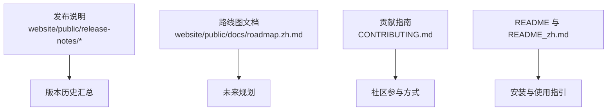
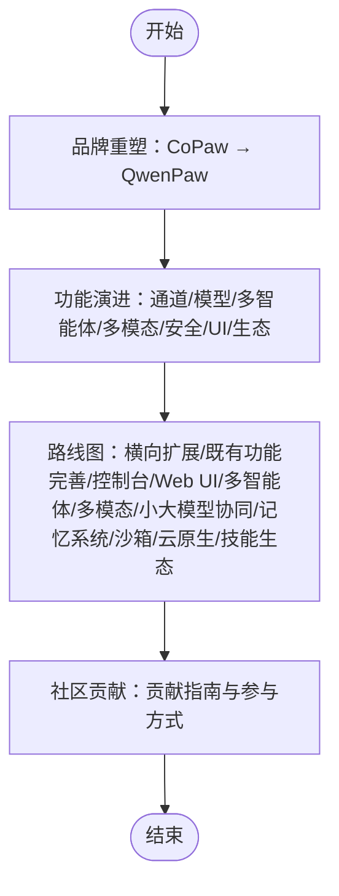
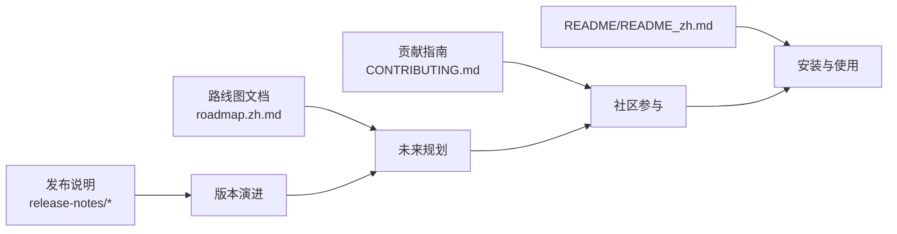

# 版本历史与路线图

<cite>
**本文引用的文件**
- [v0.0.4.md](file://website/public/release-notes/v0.0.4.md)
- [v0.0.5.md](file://website/public/release-notes/v0.0.5.md)
- [v0.0.6.md](file://website/public/release-notes/v0.0.6.md)
- [v0.0.7.md](file://website/public/release-notes/v0.0.7.md)
- [v0.1.0.md](file://website/public/release-notes/v0.1.0.md)
- [v0.2.0.md](file://website/public/release-notes/v0.2.0.md)
- [v1.0.0.md](file://website/public/release-notes/v1.0.0.md)
- [v1.0.1.md](file://website/public/release-notes/v1.0.1.md)
- [v1.0.2.md](file://website/public/release-notes/v1.0.2.md)
- [v1.1.0.md](file://website/public/release-notes/v1.1.0.md)
- [roadmap.zh.md](file://website/public/docs/roadmap.zh.md)
- [CONTRIBUTING.md](file://CONTRIBUTING.md)
- [README.md](file://README.md)
- [README_zh.md](file://README_zh.md)
</cite>

## 目录
1. [引言](#引言)
2. [项目结构](#项目结构)
3. [核心组件](#核心组件)
4. [架构总览](#架构总览)
5. [详细组件分析](#详细组件分析)
6. [依赖关系分析](#依赖关系分析)
7. [性能考量](#性能考量)
8. [故障排查指南](#故障排查指南)
9. [结论](#结论)
10. [附录](#附录)

## 引言
本文件系统梳理 QwenPaw（原 CoPaw）自 0.0.4 至 1.1.0 的版本演进历程，总结各版本新增功能、修复与性能改进，并重点阐述品牌重塑（CoPaw → QwenPaw）的意义与影响。随后给出版本升级指南、兼容性说明与迁移建议，最后汇总当前路线图与社区贡献机会，帮助用户与开发者在不同阶段做出合适的选择。

## 项目结构
- 本仓库包含后端 Python 包、控制台前端、网站文档与发布说明、脚本与部署模板等模块。版本历史与路线图信息主要来源于网站中的发布说明与路线图文档，以及根目录的贡献指南与 README。
- 发布说明位于 website/public/release-notes，覆盖从 0.0.4 到 1.1.0 的全部版本；路线图位于 website/public/docs/roadmap.zh.md；贡献指南与安装说明位于根目录文档。

**图表来源**
- [v0.0.4.md:1-46](file://website/public/release-notes/v0.0.4.md#L1-L46)
- [roadmap.zh.md:1-33](file://website/public/docs/roadmap.zh.md#L1-L33)
- [CONTRIBUTING.md:1-236](file://CONTRIBUTING.md#L1-L236)
- [README.md:1-522](file://README.md#L1-L522)
- [README_zh.md:1-585](file://README_zh.md#L1-L585)

**章节来源**
- [v0.0.4.md:1-46](file://website/public/release-notes/v0.0.4.md#L1-L46)
- [roadmap.zh.md:1-33](file://website/public/docs/roadmap.zh.md#L1-L33)
- [CONTRIBUTING.md:1-236](file://CONTRIBUTING.md#L1-L236)
- [README.md:1-522](file://README.md#L1-L522)
- [README_zh.md:1-585](file://README_zh.md#L1-L585)

## 核心组件
- 版本发布说明：涵盖新增功能、变更与修复，是理解版本差异与升级影响的关键依据。
- 路线图文档：明确未来发展方向与优先级，便于规划长期使用与贡献。
- 贡献指南：规范提交流程、代码质量要求与社区协作方式。
- README 与安装文档：提供安装、部署与使用的权威说明。

**章节来源**
- [v0.0.4.md:1-46](file://website/public/release-notes/v0.0.4.md#L1-L46)
- [roadmap.zh.md:1-33](file://website/public/docs/roadmap.zh.md#L1-L33)
- [CONTRIBUTING.md:1-236](file://CONTRIBUTING.md#L1-L236)
- [README.md:1-522](file://README.md#L1-L522)
- [README_zh.md:1-585](file://README_zh.md#L1-L585)

## 架构总览
- 品牌重塑：0.0.4 → 1.1.0 期间，项目从 CoPaw 正式更名为 QwenPaw，强调与 Qwen 生态的深度融合与模型层聚焦，同时保持“个人助手”的使命。
- 功能演进：从基础通道与模型支持，逐步扩展到多智能体、多模态、安全体系、控制台 UI、技能生态与云原生集成等方向。
- 社区驱动：通过贡献指南与路线图，鼓励社区在通道、模型、技能、MCP 等方向参与共建。

**图表来源**
- [v1.1.0.md:1-20](file://website/public/release-notes/v1.1.0.md#L1-L20)
- [roadmap.zh.md:1-33](file://website/public/docs/roadmap.zh.md#L1-L33)
- [CONTRIBUTING.md:1-236](file://CONTRIBUTING.md#L1-L236)

**章节来源**
- [v1.1.0.md:1-20](file://website/public/release-notes/v1.1.0.md#L1-L20)
- [roadmap.zh.md:1-33](file://website/public/docs/roadmap.zh.md#L1-L33)
- [CONTRIBUTING.md:1-236](file://CONTRIBUTING.md#L1-L236)

## 详细组件分析

### 版本历史与重大变更（0.0.4 → 1.1.0）

- 0.0.4：引入 Telegram 通道、OpenAI/Azure OpenAI 提供商、Ollama SDK、编码计划提供商、模型连接测试、心跳监控面板、CORS 配置、音频文件支持等；重构内存压缩、文件块处理、嵌入配置、工具选择行为；修复 Windows 路径、空工具调用、控制台 UI、Ollama 连接、MCP 传输、浏览器资源泄漏、静态资源 MIME 类型、API 请求头、Playwright Docker、心跳文件解析、媒体消息队列等问题。
- 0.0.5：新增通道管理、消息过滤、Twilio 语音通道、Telegram CLI 配置、DingTalk 增强（富文本图片、消息去重、访问控制）、iMessage 附件；支持 DeepSeek Reasoner、模型提供商发现、自定义模型请求头；加入版本更新通知、守护进程模式、中断 API、/message 命令、MCP 客户端自动恢复；迁移内存系统至 reme-ai 0.3.0.3、vLLM 嵌入、延迟加载可选通道、ModelScope MLX 优化；修复 Docker 配置持久化、Ollama base_url、DingTalk webhook、Feishu cron 任务、QQ URL 过滤、Telegram 输入指示器、OpenAI 兼容多轮失败、流式工具调用分片崩溃、AgentScope 兼容性等。
- 0.0.6：推出原生桌面应用（Windows/macOS）、俄语与日语国际化、Telegram 访问控制与 Markdown 渲染、QQ Markdown 与富媒体、统一允许列表控制、媒体过滤增强、DingTalk/Feishu 表格渲染与富文本消息、Discord 媒体支持、Docker 默认启用通道、MQTT 通道；新增 Gemini 思维模型支持、MLX 后端消息归一化、本地/云 LLM 智能路由；控制台环境变量安全遮罩、批量删除、内置工具管理、自定义系统提示排序；ReMeLight 迁移、可配置内存压缩、智能工具输出截断。
- 0.0.7：引入工具守卫（预执行安全扫描）、Mattermost 与 Matrix 通道、@提及过滤、Telegram Markdown 渲染、Feishu 表情反应与富文本媒体解析、QQ 图片消息；新增模型重试（指数退避）、LM Studio 提供商、令牌用量跟踪、高级提供程序配置、生成参数编辑器；控制台拖拽排序、聊天模型选择、代理语言选择、工具批量开关、聊天 URL 路由、上下文管理 UI、保留聊天状态；AI 技能优化、技能卡片描述、自动 PyPI 镜像、Docker 秘密目录。
- 0.1.0：多代理/多工作区架构、上下文管理（令牌计数、历史导入导出、可配置历史长度、内存压缩进度）、Web 认证、WeCom 与 XiaoYi 通道、LobeHub 与 ModelScope 技能导入、版本感知内置技能同步、内置工具（glob/grep 搜索）、MCP 头部环境变量、控制台多模态聊天、图像查看工具、非多模态 LLM 媒体回退、语音转录、Gemini/DeepSeek/MiniMax/Kimi 提供商、copaw update/shutdown 命令、Docker Compose、控制台深色主题与流式聊天、时区配置与系统提示中的 OS 信息。
- 0.2.0：智能体间通信（agents/message 命令）、内置 QA 智能体、可配置 LLM 自动重试、摘要改进、配置自动修复、文件访问守卫、工具守卫增强、Feishu/Lark SDK 迁移、XiaoYi 文件/图片支持、控制台音频/视频/语音输入、流式重连、Web 账户管理、模型提供商搜索、聊天滚动条。
- 1.0.0：后台任务支持与任务跟踪、智能体启停切换、统一优先队列与 /stop 命令、CoPaw 本地模型（llama.cpp）、作用域化活动模型选择、全局 LLM 速率限制（滑动窗口、并发信号量、抖动防雪崩）、系统重启/服务保护规则、中文提示注入检测、下载页面、多模态预览、聊天会话标签、命令建议、WeChat iLink Bot、自定义通道 HTTP 路由、Discord 机器人消息过滤、DingTalk 宽屏卡片、WeCom 媒体上传。
- 1.0.1：Zhipu 模型提供商、视频分析（多模态模型）、模型特定生成参数、CoPaw 本地提供程序自动更新、宽松工具调用解析器。
- 1.0.2：插件系统、copaw task 一次性任务、/model 魔法命令、SiliconFlow 提供商、CoPaw 本地模型增强（图像/视频、控制台设置、Windows 下载与能力检测）、加密保存的密钥、聊天输入历史、聊天搜索、会话置顶、每代理聊天、图标与提供商徽标。
- 1.1.0：CoPaw 正式更名 QwenPaw，强调与 Qwen 生态融合与模型层聚焦，同时延续“个人助手”使命。

**章节来源**
- [v0.0.4.md:1-46](file://website/public/release-notes/v0.0.4.md#L1-L46)
- [v0.0.5.md:1-129](file://website/public/release-notes/v0.0.5.md#L1-L129)
- [v0.0.6.md:1-93](file://website/public/release-notes/v0.0.6.md#L1-L93)
- [v0.0.7.md:1-99](file://website/public/release-notes/v0.0.7.md#L1-L99)
- [v0.1.0.md:1-120](file://website/public/release-notes/v0.1.0.md#L1-L120)
- [v0.2.0.md:1-99](file://website/public/release-notes/v0.2.0.md#L1-L99)
- [v1.0.0.md:1-102](file://website/public/release-notes/v1.0.0.md#L1-L102)
- [v1.0.1.md:1-85](file://website/public/release-notes/v1.0.1.md#L1-L85)
- [v1.0.2.md:1-60](file://website/public/release-notes/v1.0.2.md#L1-L60)
- [v1.1.0.md:1-20](file://website/public/release-notes/v1.1.0.md#L1-L20)

### 品牌重塑：CoPaw 到 QwenPaw 的意义
- 名称含义：Qwen 代表与 Qwen 开源生态的深度融合与对模型层的聚焦（本地模型、大小模型协同）；Paw 代表最初的使命——成为用户真正可信赖的个人助手。
- 影响范围：本次更名不改变愿景与目标，仍致力于构建更实用、更安全、更个性化的个人 AI 助手，并坚持开源协作与社区共建。

**章节来源**
- [v1.1.0.md:1-20](file://website/public/release-notes/v1.1.0.md#L1-L20)

### 版本升级指南与兼容性说明

- 通用建议
  - 在升级前备份工作目录与秘密目录（如使用 Docker，确保卷挂载正确）。
  - 首次升级后重建前端、重新安装 Python 包、重启服务并清理浏览器缓存。
  - 关注各版本“变更”与“修复”部分，确认对现有配置与工作流的影响。

- 0.0.4 → 0.0.5
  - 关键变更：内存系统迁移至 reme-ai 0.3.0.3、vLLM 嵌入；提供程序统一流程；Ollama 超时可配置；Docker 配置持久化修复。
  - 升级要点：检查 providers.json/envs.json 是否迁移到 SECRET_DIR；确认 Ollama base_url 与 host 参数支持；修复 Docker 环境下配置丢失问题。

- 0.0.5 → 0.0.6
  - 关键变更：桌面应用、俄语/日语国际化、Telegram 访问控制与 Markdown 渲染、QQ 富媒体、统一允许列表、Feishu 表格渲染与富文本消息、Discord 媒体支持、MQTT 通道、Gemini 思维模型、MLX 后端、本地/云 LLM 路由、控制台环境变量安全遮罩、内置工具管理、ReMeLight 迁移与智能截断。
  - 升级要点：确认桌面应用安装与启动；检查媒体路径与 MIME 类型；验证 MLX 与 Gemini 的消息归一化；更新内存配置与工具输出截断策略。

- 0.0.6 → 0.0.7
  - 关键变更：工具守卫、Mattermost/Matrix 通道、@提及过滤、Feishu 表情反应与富文本媒体解析、QQ 图片消息、模型重试（指数退避）、LM Studio 提供商、令牌用量跟踪、高级提供程序配置、生成参数编辑器、控制台拖拽排序、聊天模型选择、上下文管理 UI、AI 技能优化、技能卡片描述。
  - 升级要点：启用工具守卫规则；检查 cron 任务时区与 UTC 上下文；更新技能描述与触发关键词；调整生成参数与模型能力标签。

- 0.0.7 → 0.1.0
  - 关键变更：多代理/多工作区架构、上下文管理（令牌计数、历史导入导出、可配置历史长度、内存压缩进度）、Web 认证、WeCom/XiaoYi 通道、LobeHub/ModelScope 技能导入、版本感知内置技能同步、内置工具（glob/grep 搜索）、MCP 头部环境变量、控制台多模态聊天、图像查看工具、非多模态 LLM 媒体回退、语音转录、Gemini/DeepSeek/MiniMax/Kimi 提供商、copaw update/shutdown 命令、Docker Compose、控制台深色主题与流式聊天、时区配置与系统提示中的 OS 信息。
  - 升级要点：启用多代理工作区；配置 Web 认证；更新技能池与版本同步；检查 Docker Compose 与端口映射；调整时区与系统提示。

- 0.1.0 → 0.2.0
  - 关键变更：智能体间通信（agents/message 命令）、内置 QA 智能体、可配置 LLM 自动重试、摘要改进、配置自动修复、文件访问守卫、工具守卫增强、Feishu/Lark SDK 迁移、XiaoYi 文件/图片支持、控制台音频/视频/语音输入、流式重连、Web 账户管理、模型提供商搜索、聊天滚动条。
  - 升级要点：启用智能体间通信；配置文件访问守卫；更新 Feishu/Lark SDK；检查 XiaoYi 通道；优化音频/视频输入与流式重连。

- 1.0.0 → 1.0.1
  - 关键变更：Zhipu 模型提供商、视频分析（多模态模型）、模型特定生成参数、CoPaw 本地提供程序自动更新、宽松工具调用解析器、Agent 拖拽排序、聊天会话状态指示、首选会话优先、系统深色模式、自动切换默认代理、批量技能操作、停止服务在代理禁用时、技能要求列表格式、OneBot v11 通道、DingTalk AI 卡支持、WeCom 服务器端二维码、WeChat 文件上传与打字指示。
  - 升级要点：启用 Zhipu 与视频分析；配置模型特定参数；更新本地提供程序；优化技能批量操作；检查 OneBot 通道与二维码生成。

- 1.0.1 → 1.0.2
  - 关键变更：插件系统、copaw task 一次性任务、/model 魔法命令、SiliconFlow 提供商、CoPaw 本地模型增强（图像/视频、控制台设置、Windows 下载与能力检测）、加密保存的密钥、聊天输入历史、聊天搜索、会话置顶、每代理聊天、图标与提供商徽标。
  - 升级要点：启用插件系统；使用 copaw task 运行一次性任务；配置 SiliconFlow；优化本地模型下载与能力检测；启用加密密钥存储。

- 1.0.2 → 1.1.0
  - 关键变更：品牌重塑为 QwenPaw，强调与 Qwen 生态融合与模型层聚焦，延续“个人助手”使命。
  - 升级要点：更新品牌认知与文档链接；保持原有功能与配置不变。

**章节来源**
- [v0.0.4.md:1-46](file://website/public/release-notes/v0.0.4.md#L1-L46)
- [v0.0.5.md:1-129](file://website/public/release-notes/v0.0.5.md#L1-L129)
- [v0.0.6.md:1-93](file://website/public/release-notes/v0.0.6.md#L1-L93)
- [v0.0.7.md:1-99](file://website/public/release-notes/v0.0.7.md#L1-L99)
- [v0.1.0.md:1-120](file://website/public/release-notes/v0.1.0.md#L1-L120)
- [v0.2.0.md:1-99](file://website/public/release-notes/v0.2.0.md#L1-L99)
- [v1.0.0.md:1-102](file://website/public/release-notes/v1.0.0.md#L1-L102)
- [v1.0.1.md:1-85](file://website/public/release-notes/v1.0.1.md#L1-L85)
- [v1.0.2.md:1-60](file://website/public/release-notes/v1.0.2.md#L1-L60)
- [v1.1.0.md:1-20](file://website/public/release-notes/v1.1.0.md#L1-L20)

### 当前路线图与未来规划
- 横向扩展：更多通道、模型、技能、MCP 等，欢迎社区贡献。
- 既有功能扩展与完善：展示优化、下载提示、Windows 路径兼容等，欢迎社区贡献。
- 控制台 Web UI：在控制台中透出更多信息与配置。
- 多智能体：Agentic Ralph Loop。
- 多模态：语音/视频通话与实时交互。
- 小大模型协同：多模型路由，不同任务使用不同模型。
- 记忆系统：经验沉淀与技能提炼、记忆机制切换、多模态记忆融合、场景感知主动推送。
- 沙箱：与 AgentScope Runtime 沙箱深度集成。
- 云原生：与 AgentScope Runtime 深度集成；利用云端算力、存储、工具与技能。
- 技能生态：丰富 AgentScope Skills 仓库，提升优质技能的发现与使用。

**章节来源**
- [roadmap.zh.md:1-33](file://website/public/docs/roadmap.zh.md#L1-L33)

### 社区贡献机会与参与方式
- 贡献类型：新增模型/模型提供商、新增通道、基础技能、平台支持（Windows/Linux/macOS）、MCP（模型上下文协议）、文档与示例工作流等。
- 贡献流程：检查现有计划与议题、遵循约定式提交与 PR 标题格式、满足本地门禁（pre-commit、pytest）、更新相关文档与 README。
- 参与渠道：GitHub Issues（Open Tasks）、GitHub Discussions、社区群组与社交平台。

**章节来源**
- [CONTRIBUTING.md:1-236](file://CONTRIBUTING.md#L1-L236)
- [README.md:458-466](file://README.md#L458-L466)
- [README_zh.md:522-530](file://README_zh.md#L522-L530)

## 依赖关系分析
- 版本发布说明与路线图文档共同构成版本演进与未来规划的双重依据，贡献指南提供社区协作的规范与流程。
- README 与安装文档为用户提供安装、部署与使用的权威指引，贯穿版本升级过程中的配置与迁移。

**图表来源**
- [v0.0.4.md:1-46](file://website/public/release-notes/v0.0.4.md#L1-L46)
- [roadmap.zh.md:1-33](file://website/public/docs/roadmap.zh.md#L1-L33)
- [CONTRIBUTING.md:1-236](file://CONTRIBUTING.md#L1-L236)
- [README.md:1-522](file://README.md#L1-L522)
- [README_zh.md:1-585](file://README_zh.md#L1-L585)

**章节来源**
- [v0.0.4.md:1-46](file://website/public/release-notes/v0.0.4.md#L1-L46)
- [roadmap.zh.md:1-33](file://website/public/docs/roadmap.zh.md#L1-L33)
- [CONTRIBUTING.md:1-236](file://CONTRIBUTING.md#L1-L236)
- [README.md:1-522](file://README.md#L1-L522)
- [README_zh.md:1-585](file://README_zh.md#L1-L585)

## 性能考量
- 内存与性能优化：多版本引入内存压缩策略、智能截断、异步操作（工作区打包/解包、会话加载）、懒加载可选通道、动态令牌计数等，显著改善启动时间与运行效率。
- 平台兼容性：针对 Windows 的路径处理、编码解码、进程树清理、桌面应用 SSL 加载与导航修复等，提升跨平台稳定性。
- 通道与模型：提供程序连接测试、超时管理、重试机制（指数退避）、速率限制（滑动窗口、并发信号量、抖动防雪崩）等，保障高并发与网络波动下的可靠性。

**章节来源**
- [v0.0.5.md:34-62](file://website/public/release-notes/v0.0.5.md#L34-L62)
- [v0.0.6.md:46-54](file://website/public/release-notes/v0.0.6.md#L46-L54)
- [v0.0.7.md:43-56](file://website/public/release-notes/v0.0.7.md#L43-L56)
- [v0.1.0.md:60-73](file://website/public/release-notes/v0.1.0.md#L60-L73)
- [v1.0.0.md:47-63](file://website/public/release-notes/v1.0.0.md#L47-L63)
- [v1.0.1.md:48-65](file://website/public/release-notes/v1.0.1.md#L48-L65)
- [v1.0.2.md:37-44](file://website/public/release-notes/v1.0.2.md#L37-L44)

## 故障排查指南
- 配置持久化与迁移：Docker 环境下配置丢失问题已在 0.0.5 中修复，确保 providers.json/envs.json 迁移到 SECRET_DIR 并进行安全加固。
- 通道与消息处理：修复 DingTalk/Feishu/QQ/Discord 等通道的消息去重、富媒体解析、WebSocket 重连与心跳、消息拆分与 Markdown 代码块保护等。
- 模型与提供程序：修正 Ollama base_url 解析、连接测试返回描述性错误、模型发现按需触发、Anthropic overloaded 响应自动重试等。
- 控制台与 UI：修复版本徽章样式、URL 验证器、版本通知过滤、聊天会话持久化、静态资源加载失败、Swagger 文档路由覆盖、Mermaid 图表滚动跳转等问题。
- 安全与工具：工具守卫增强、文件访问守卫、技能安全扫描、令牌用量记录锁、任务跟踪初始化等，减少并发与异常场景下的阻塞与崩溃。

**章节来源**
- [v0.0.5.md:64-101](file://website/public/release-notes/v0.0.5.md#L64-L101)
- [v0.0.6.md:60-77](file://website/public/release-notes/v0.0.6.md#L60-L77)
- [v0.0.7.md:68-91](file://website/public/release-notes/v0.0.7.md#L68-L91)
- [v0.1.0.md:82-108](file://website/public/release-notes/v0.1.0.md#L82-L108)
- [v1.0.0.md:65-88](file://website/public/release-notes/v1.0.0.md#L65-L88)
- [v1.0.1.md:48-71](file://website/public/release-notes/v1.0.1.md#L48-L71)
- [v1.0.2.md:46-59](file://website/public/release-notes/v1.0.2.md#L46-L59)

## 结论
QwenPaw 在 0.0.4 至 1.1.0 期间完成了从基础通道与模型支持到多智能体、多模态、安全体系、控制台 UI、技能生态与云原生集成的系统性演进，并以 CoPaw 到 QwenPaw 的品牌重塑明确了与 Qwen 生态的深度融合方向。版本升级过程中，建议关注内存与性能优化、平台兼容性、通道与模型稳定性、安全与工具防护等关键领域。未来路线图清晰地指向横向扩展、既有功能完善、控制台 Web UI、多智能体、多模态、小大模型协同、记忆系统、沙箱与云原生等方向，社区贡献将在此框架下持续推动项目发展。

## 附录
- 安装与使用：参考 README 与 README_zh.md 中的快速开始、API Key、本地模型、Docker、桌面应用等章节，结合各版本发布说明中的安装脚本与 Docker 镜像说明。
- 贡献指南：遵循约定式提交与 PR 标题格式、满足本地门禁、更新文档与 README、在 GitHub Issues 与 Discussions 中沟通与认领任务。

**章节来源**
- [README.md:104-522](file://README.md#L104-L522)
- [README_zh.md:104-585](file://README_zh.md#L104-L585)
- [CONTRIBUTING.md:1-236](file://CONTRIBUTING.md#L1-L236)