# 项目介绍与核心价值

<cite>
**本文引用的文件**
- [README.md](file://README.md)
- [__init__.py](file://src/qwenpaw/__init__.py)
- [constant.py](file://src/qwenpaw/constant.py)
- [react_agent.py](file://src/qwenpaw/agents/react_agent.py)
- [skills_hub.py](file://src/qwenpaw/agents/skills_hub.py)
- [base_memory_manager.py](file://src/qwenpaw/agents/memory/base_memory_manager.py)
- [multi_agent_manager.py](file://src/qwenpaw/app/multi_agent_manager.py)
- [engine.py](file://src/qwenpaw/security/tool_guard/engine.py)
- [manager.py](file://src/qwenpaw/app/channels/manager.py)
- [App.tsx](file://console/src/App.tsx)
- [architecture.py](file://src/qwenpaw/plugins/architecture.py)
- [provider_manager.py](file://src/qwenpaw/providers/provider_manager.py)
- [skills_manager.py](file://src/qwenpaw/agents/skills_manager.py)
- [manager.py](file://src/qwenpaw/token_usage/manager.py)
</cite>

## 目录
1. [引言](#引言)
2. [项目结构](#项目结构)
3. [核心组件](#核心组件)
4. [架构总览](#架构总览)
5. [详细组件分析](#详细组件分析)
6. [依赖关系分析](#依赖关系分析)
7. [性能考量](#性能考量)
8. [故障排查指南](#故障排查指南)
9. [结论](#结论)
10. [附录](#附录)

## 引言
QwenPaw 是 AgentScope 生态系统中的个人智能助手核心组件，定位于“你的个人 AI 助手”。它以“可本地部署、可跨渠道连接、可安全扩展”的理念，提供从模型路由、技能扩展到多代理协作与全渠道接入的一体化能力。其核心价值在于：
- 在数据主权与隐私安全上，用户拥有完全控制权（本地或云端均可部署，不强制上传数据）
- 在能力边界上，通过内置技能与技能池生态实现“按需扩展”，避免厂商锁定
- 在运行形态上，支持单代理与多代理协作，满足复杂任务编排
- 在安全层面，提供工具守卫、文件访问控制、技能安全扫描等多层防护
- 在接入层面，覆盖企业与社交主流渠道，统一入口、统一配置

以上定位与能力，使 QwenPaw 成为“既好用又可控”的个人智能助手平台。

## 项目结构
QwenPaw 采用前后端分离与模块化分层设计：
- 后端（Python）：核心应用、通道管理、多代理管理、模型与提供商管理、安全与权限、技能与插件、内存与会话、计费统计等
- 前端（React）：控制台 Web 界面，提供登录鉴权、多语言、主题切换、路由与页面布局
- 部署与打包：Docker、桌面应用、脚本安装、本地模型支持

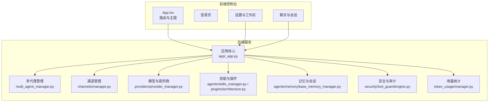

图示来源
- [App.tsx:110-184](file://console/src/App.tsx#L110-L184)
- [multi_agent_manager.py:31-90](file://src/qwenpaw/app/multi_agent_manager.py#L31-L90)
- [manager.py:68-113](file://src/qwenpaw/app/channels/manager.py#L68-L113)
- [provider_manager.py:670-751](file://src/qwenpaw/providers/provider_manager.py#L670-L751)
- [skills_manager.py:132-148](file://src/qwenpaw/agents/skills_manager.py#L132-L148)
- [base_memory_manager.py:21-56](file://src/qwenpaw/agents/memory/base_memory_manager.py#L21-L56)
- [engine.py:53-102](file://src/qwenpaw/security/tool_guard/engine.py#L53-L102)
- [manager.py:62-109](file://src/qwenpaw/token_usage/manager.py#L62-L109)

章节来源
- [README.md:29-55](file://README.md#L29-L55)
- [__init__.py:11-32](file://src/qwenpaw/__init__.py#L11-L32)
- [constant.py:89-120](file://src/qwenpaw/constant.py#L89-L120)

## 核心组件
- ReAct 智能体与多模态能力：基于 ReAct 框架，结合工具与技能动态加载、系统提示构建、多模态感知与媒体块过滤
- 技能扩展系统：内置技能池、技能仓库拉取、冲突检测与安全扫描
- 多代理协作：零停机热重载、任务追踪、共享服务复用
- 多层安全防护：工具守卫、文件路径限制、规则与策略引擎、技能扫描
- 全渠道连接：统一队列与优先级调度、命令注册与去抖、多通道适配
- 记忆与会话：抽象记忆管理器、摘要与压缩、异步摘要任务
- 模型与提供商：统一提供商管理、模型发现与连接检查、并发与速率限制
- 用量统计：按日期/提供商/模型聚合统计、持久化记录

章节来源
- [react_agent.py:69-182](file://src/qwenpaw/agents/react_agent.py#L69-L182)
- [skills_hub.py:53-188](file://src/qwenpaw/agents/skills_hub.py#L53-L188)
- [multi_agent_manager.py:21-90](file://src/qwenpaw/app/multi_agent_manager.py#L21-L90)
- [engine.py:53-164](file://src/qwenpaw/security/tool_guard/engine.py#L53-L164)
- [manager.py:68-113](file://src/qwenpaw/app/channels/manager.py#L68-L113)
- [base_memory_manager.py:21-114](file://src/qwenpaw/agents/memory/base_memory_manager.py#L21-L114)
- [provider_manager.py:670-751](file://src/qwenpaw/providers/provider_manager.py#L670-L751)
- [manager.py:62-109](file://src/qwenpaw/token_usage/manager.py#L62-L109)

## 架构总览
下图展示 QwenPaw 的端到端架构：前端控制台通过 HTTP 与后端交互；后端以应用核心为枢纽，串联多代理、通道、提供商、技能、安全与记忆模块；通道层负责多渠道消息入队与消费；安全层在工具调用前进行拦截与审批；记忆层提供长短期记忆与摘要；用量统计模块提供成本与使用洞察。

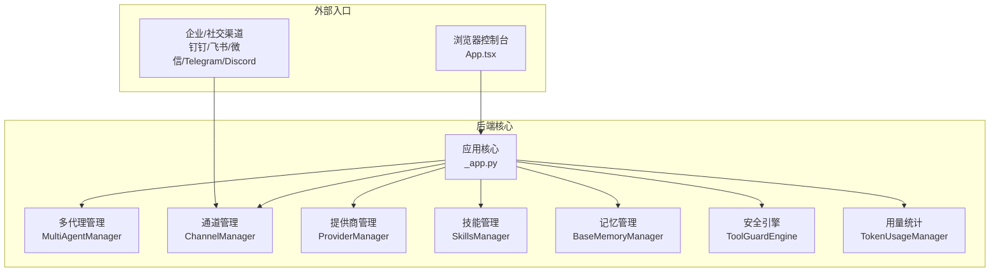

图示来源
- [App.tsx:151-183](file://console/src/App.tsx#L151-L183)
- [manager.py:68-113](file://src/qwenpaw/app/channels/manager.py#L68-L113)
- [multi_agent_manager.py:31-90](file://src/qwenpaw/app/multi_agent_manager.py#L31-L90)
- [provider_manager.py:670-751](file://src/qwenpaw/providers/provider_manager.py#L670-L751)
- [skills_manager.py:132-148](file://src/qwenpaw/agents/skills_manager.py#L132-L148)
- [base_memory_manager.py:21-56](file://src/qwenpaw/agents/memory/base_memory_manager.py#L21-L56)
- [engine.py:53-102](file://src/qwenpaw/security/tool_guard/engine.py#L53-L102)
- [manager.py:62-109](file://src/qwenpaw/token_usage/manager.py#L62-L109)

## 详细组件分析

### 组件一：ReAct 智能体与多模态能力
- 设计要点
  - 基于 ReActAgent 扩展，集成工具箱、技能动态加载、系统提示构建、内存管理与引导钩子
  - 支持多模态提示注入与媒体块主动/被动过滤，保障模型兼容性
  - 工具守卫混入确保危险命令拦截
- 关键流程
  - 初始化：创建模型与格式化器、注册工具与技能、构建系统提示、初始化内存与钩子
  - 推理与总结：在推理与总结阶段对多模态媒体块进行预处理与回退处理
  - MCP 客户端注册：支持状态式客户端的恢复与重建

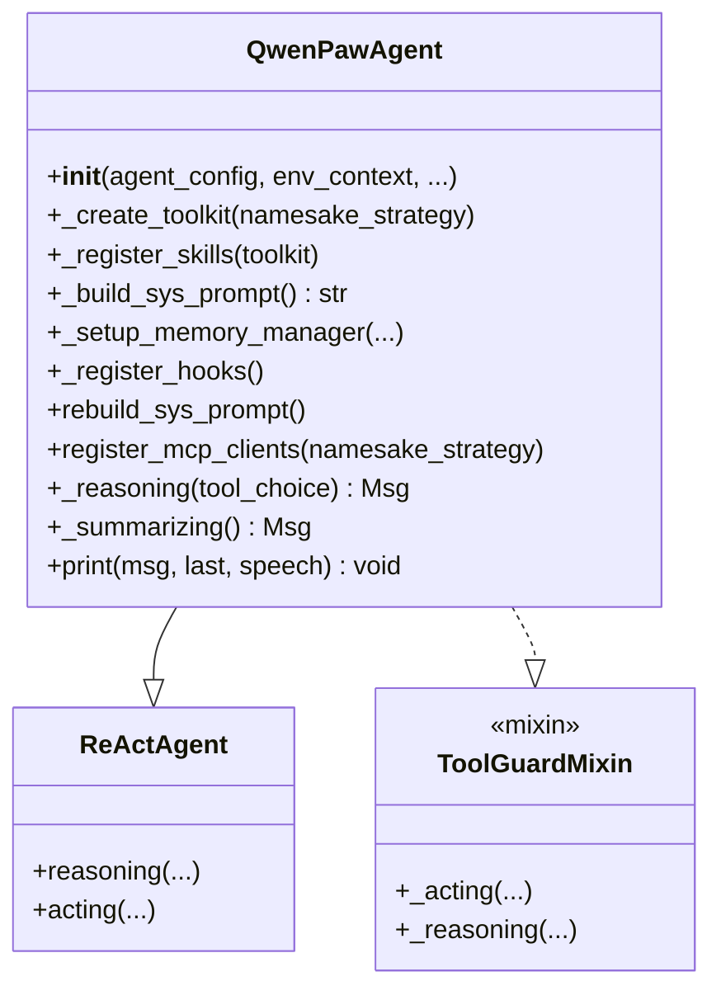

图示来源
- [react_agent.py:69-182](file://src/qwenpaw/agents/react_agent.py#L69-L182)
- [react_agent.py:183-304](file://src/qwenpaw/agents/react_agent.py#L183-L304)
- [react_agent.py:306-388](file://src/qwenpaw/agents/react_agent.py#L306-L388)
- [react_agent.py:390-454](file://src/qwenpaw/agents/react_agent.py#L390-L454)
- [react_agent.py:478-542](file://src/qwenpaw/agents/react_agent.py#L478-L542)

章节来源
- [react_agent.py:69-182](file://src/qwenpaw/agents/react_agent.py#L69-L182)
- [react_agent.py:390-454](file://src/qwenpaw/agents/react_agent.py#L390-L454)

### 组件二：技能扩展系统（技能池与仓库）
- 设计要点
  - 技能目录结构标准化，支持内置技能与工作区技能
  - 技能仓库（ClawHub）拉取、版本解析、文件树归一化、冲突建议命名
  - 技能导入过程具备超时、重试、回退与取消检查机制
  - 安全扫描贯穿技能安装生命周期
- 关键流程
  - 技能拉取：构建请求、认证头、响应读取、大小限制与错误处理
  - 包装与归一：从元数据提取内容、名称、脚本与引用树
  - 冲突检测：基于已存在技能生成建议名，避免覆盖
  - 安装执行：写入磁盘、更新清单、触发钩子与重启

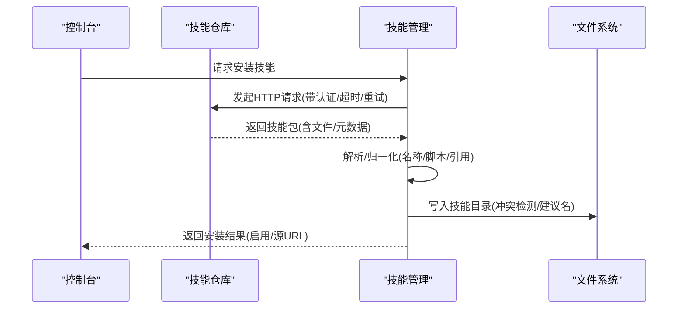

图示来源
- [skills_hub.py:291-403](file://src/qwenpaw/agents/skills_hub.py#L291-L403)
- [skills_hub.py:406-442](file://src/qwenpaw/agents/skills_hub.py#L406-L442)
- [skills_hub.py:557-702](file://src/qwenpaw/agents/skills_hub.py#L557-L702)
- [skills_manager.py:132-148](file://src/qwenpaw/agents/skills_manager.py#L132-L148)

章节来源
- [skills_hub.py:53-188](file://src/qwenpaw/agents/skills_hub.py#L53-L188)
- [skills_hub.py:291-403](file://src/qwenpaw/agents/skills_hub.py#L291-L403)
- [skills_manager.py:132-148](file://src/qwenpaw/agents/skills_manager.py#L132-L148)

### 组件三：多代理协作与零停机热重载
- 设计要点
  - 多代理管理器按需懒加载、线程安全锁、原子替换与延迟清理
  - 零停机热重载：新实例启动后原子替换旧实例，后台等待旧实例任务完成再停止
  - 可复用组件：从旧实例迁移服务，减少重启开销
- 关键流程
  - 获取代理：不存在则从配置加载并启动
  - 重载代理：创建新实例、设置复用组件、原子替换、延迟清理旧实例
  - 停止所有：取消待清理任务、逐个停止代理

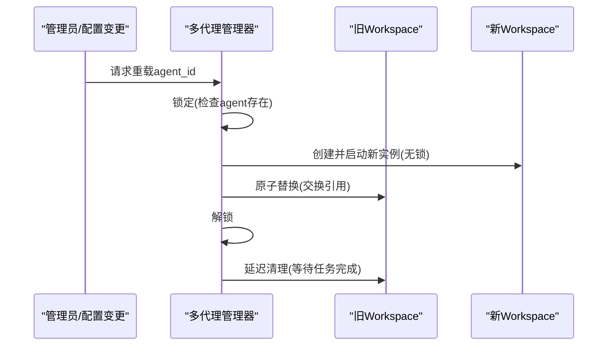

图示来源
- [multi_agent_manager.py:208-319](file://src/qwenpaw/app/multi_agent_manager.py#L208-L319)
- [multi_agent_manager.py:319-344](file://src/qwenpaw/app/multi_agent_manager.py#L319-L344)
- [multi_agent_manager.py:346-370](file://src/qwenpaw/app/multi_agent_manager.py#L346-L370)

章节来源
- [multi_agent_manager.py:21-90](file://src/qwenpaw/app/multi_agent_manager.py#L21-L90)
- [multi_agent_manager.py:208-319](file://src/qwenpaw/app/multi_agent_manager.py#L208-L319)

### 组件四：多层安全防护（工具守卫与技能扫描）
- 设计要点
  - 工具守卫引擎：默认规则与文件路径守卫，支持动态注册与重载
  - 技能扫描：安装前扫描风险（命令注入、硬编码密钥、数据外泄等）
  - 策略开关：环境变量与配置项控制启用/禁用
- 关键流程
  - 工具调用前拦截：参数校验、违规标记、审批流程
  - 技能安装前扫描：解析元数据、匹配规则、生成报告与建议

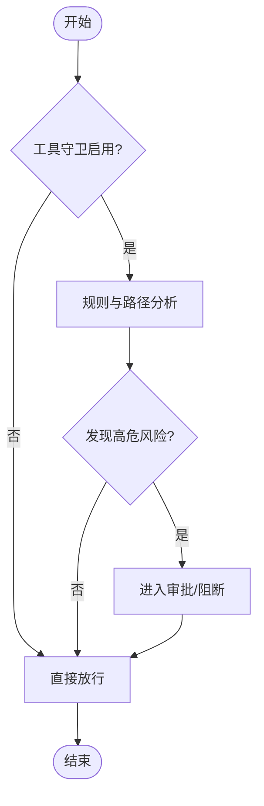

图示来源
- [engine.py:53-164](file://src/qwenpaw/security/tool_guard/engine.py#L53-L164)
- [engine.py:169-226](file://src/qwenpaw/security/tool_guard/engine.py#L169-L226)

章节来源
- [engine.py:53-164](file://src/qwenpaw/security/tool_guard/engine.py#L53-L164)

### 组件五：全渠道连接与统一队列
- 设计要点
  - 通道管理器：统一入队、合并批量消息、优先级与命令注册、会话去抖
  - 统一队列管理：按通道/会话/优先级组织队列，消费者循环批处理
  - 多通道适配：从环境或配置加载可用通道，按需初始化
- 关键流程
  - 入队：提取查询文本与会话ID，分类优先级，超时保护
  - 消费：同键合并批量消息，调用通道消费逻辑
  - 替换通道：新通道启动后原子替换旧通道，必要时停止旧通道

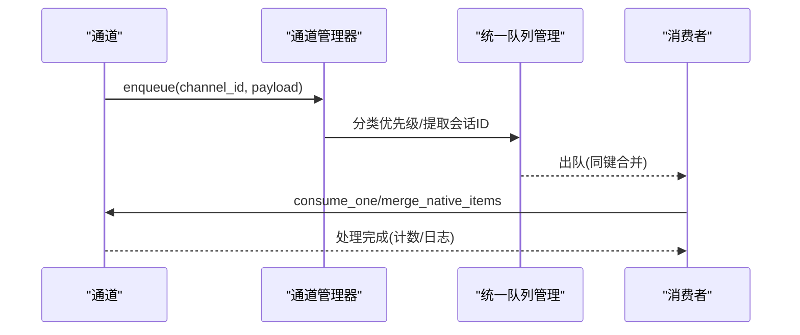

图示来源
- [manager.py:39-66](file://src/qwenpaw/app/channels/manager.py#L39-L66)
- [manager.py:255-301](file://src/qwenpaw/app/channels/manager.py#L255-L301)
- [manager.py:362-446](file://src/qwenpaw/app/channels/manager.py#L362-L446)

章节来源
- [manager.py:68-113](file://src/qwenpaw/app/channels/manager.py#L68-L113)
- [manager.py:255-301](file://src/qwenpaw/app/channels/manager.py#L255-L301)

### 组件六：记忆与会话（抽象管理器）
- 设计要点
  - 抽象接口：启动/关闭、压缩工具结果、上下文检查、摘要生成、搜索
  - 异步摘要：后台任务列表、等待完成、异常收集
  - 内存对象：返回内存实例供智能体使用
- 关键流程
  - 启动：初始化模型与格式化器、准备摘要任务列表
  - 压缩与摘要：根据阈值判断是否需要压缩/摘要
  - 搜索：语义检索与评分过滤

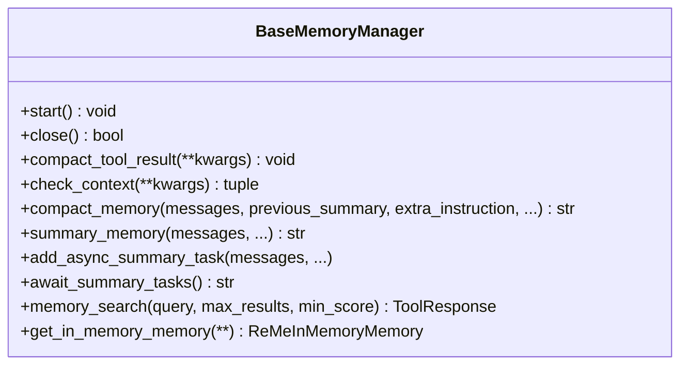

图示来源
- [base_memory_manager.py:21-114](file://src/qwenpaw/agents/memory/base_memory_manager.py#L21-L114)
- [base_memory_manager.py:116-196](file://src/qwenpaw/agents/memory/base_memory_manager.py#L116-L196)

章节来源
- [base_memory_manager.py:21-114](file://src/qwenpaw/agents/memory/base_memory_manager.py#L21-L114)

### 组件七：模型与提供商管理
- 设计要点
  - 内置提供商：DashScope、OpenAI、Azure OpenAI、Gemini、Ollama、LM Studio 等
  - 统一接口：列出提供商、获取信息、获取活跃模型、更新配置
  - 安全存储：提供商密钥加密存储与解密
- 关键流程
  - 初始化：注册内置提供商、迁移历史、从磁盘加载
  - 查询：按 ID 获取提供商实例，返回 ProviderInfo
  - 更新：持久化配置变更

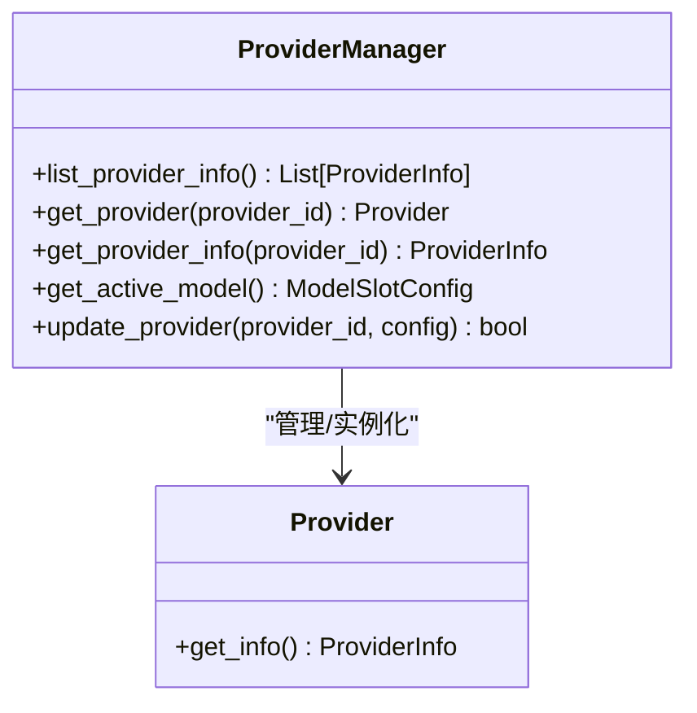

图示来源
- [provider_manager.py:670-751](file://src/qwenpaw/providers/provider_manager.py#L670-L751)
- [provider_manager.py:770-786](file://src/qwenpaw/providers/provider_manager.py#L770-L786)

章节来源
- [provider_manager.py:670-751](file://src/qwenpaw/providers/provider_manager.py#L670-L751)

### 组件八：前端控制台与国际化
- 设计要点
  - 路由与布局：BrowserRouter、主布局、登录守卫
  - 国际化：Ant Design 语言包与 dayjs 本地化切换
  - 主题：暗/亮主题切换，全局样式
- 关键流程
  - 登录守卫：根据后端鉴权状态决定跳转
  - 语言偏好：本地存储与后端同步

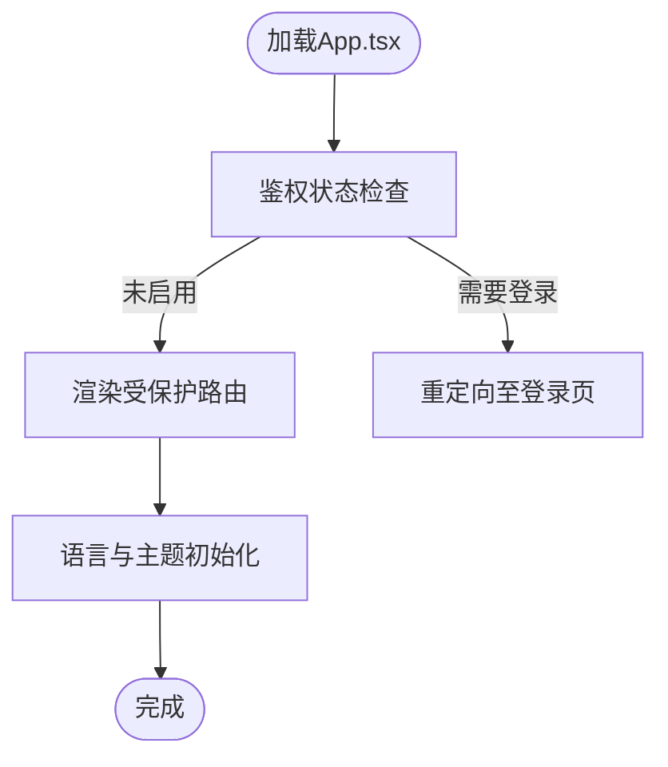

图示来源
- [App.tsx:49-104](file://console/src/App.tsx#L49-L104)
- [App.tsx:110-184](file://console/src/App.tsx#L110-L184)

章节来源
- [App.tsx:110-184](file://console/src/App.tsx#L110-L184)

### 组件九：插件架构与清单
- 设计要点
  - 插件清单：包含标识、名称、版本、描述、作者、入口点、依赖、最小版本与元数据
  - 插件记录：记录已加载插件的清单、来源路径、启用状态、实例与诊断信息
- 关键流程
  - 清单解析：从字典创建清单对象
  - 加载记录：维护插件实例与诊断信息

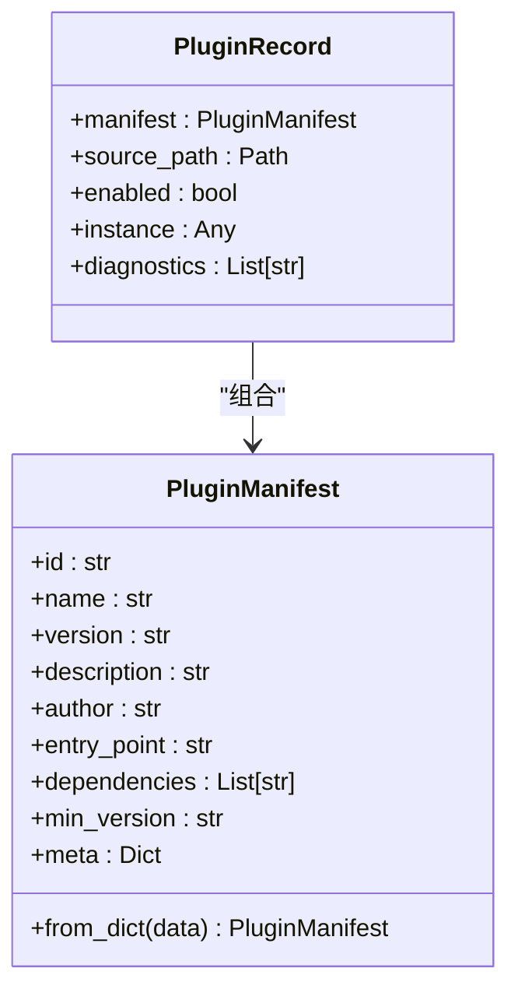

图示来源
- [architecture.py:9-55](file://src/qwenpaw/plugins/architecture.py#L9-L55)

章节来源
- [architecture.py:9-55](file://src/qwenpaw/plugins/architecture.py#L9-L55)

### 组件十：用量统计与成本洞察
- 设计要点
  - 单例管理器：线程安全文件锁、异步读写
  - 数据模型：按日期/提供商/模型聚合统计
  - 查询与汇总：支持范围查询与多维聚合
- 关键流程
  - 记录：按日期与复合键累加令牌与调用次数
  - 汇总：计算总计与按模型/提供商/日期的明细

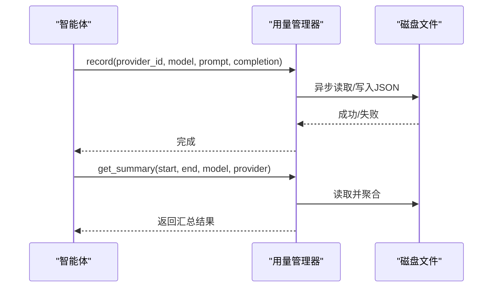

图示来源
- [manager.py:110-156](file://src/qwenpaw/token_usage/manager.py#L110-L156)
- [manager.py:198-294](file://src/qwenpaw/token_usage/manager.py#L198-L294)

章节来源
- [manager.py:62-109](file://src/qwenpaw/token_usage/manager.py#L62-L109)

## 依赖关系分析
- 组件耦合
  - 应用核心依赖多代理、通道、提供商、技能、安全与记忆模块
  - 通道管理器依赖统一队列与命令注册，面向多通道实现
  - 安全引擎独立于业务逻辑，通过工具守卫混入参与推理
- 外部依赖
  - 模型提供商 SDK（OpenAI、Anthropic、Gemini 等）
  - 前端 Ant Design 与 React Router
  - 文件系统与进程间通信（MCP）

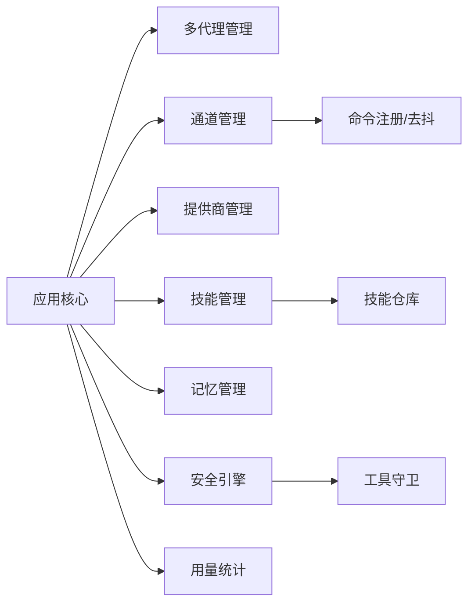

图示来源
- [multi_agent_manager.py:31-90](file://src/qwenpaw/app/multi_agent_manager.py#L31-L90)
- [manager.py:68-113](file://src/qwenpaw/app/channels/manager.py#L68-L113)
- [provider_manager.py:670-751](file://src/qwenpaw/providers/provider_manager.py#L670-L751)
- [skills_hub.py:53-188](file://src/qwenpaw/agents/skills_hub.py#L53-L188)
- [engine.py:53-102](file://src/qwenpaw/security/tool_guard/engine.py#L53-L102)
- [manager.py:62-109](file://src/qwenpaw/token_usage/manager.py#L62-L109)

章节来源
- [provider_manager.py:670-751](file://src/qwenpaw/providers/provider_manager.py#L670-L751)

## 性能考量
- 并发与限流
  - 提供商调用并发上限、每分钟请求数限制、指数退避与抖动，避免 429
- 内存与上下文
  - 记忆压缩与摘要异步化，降低上下文长度
  - 多模态媒体块预过滤，减少无效请求
- I/O 与持久化
  - 用量统计采用异步文件访问与文件锁，保证一致性
- 队列与批处理
  - 统一队列按会话键合并快速消息，提升吞吐

## 故障排查指南
- 安全相关
  - 工具守卫拦截：查看告警严重级别与违规原因，必要时调整规则或审批
  - 技能扫描失败：检查仓库网络、GITHUB_TOKEN、ZIP 大小限制
- 通道与队列
  - 消息积压：检查队列最大长度、消费者循环是否正常
  - 通道替换失败：确认新通道启动成功后再原子替换
- 记忆与会话
  - 摘要任务异常：查看后台任务列表与异常日志
- 模型与提供商
  - 连接失败：检查 Base URL、API Key、网络连通性与速率限制
- 前端登录
  - 鉴权失败：确认后端鉴权开关、Token 是否有效

章节来源
- [engine.py:169-226](file://src/qwenpaw/security/tool_guard/engine.py#L169-L226)
- [skills_hub.py:291-403](file://src/qwenpaw/agents/skills_hub.py#L291-L403)
- [manager.py:362-446](file://src/qwenpaw/app/channels/manager.py#L362-L446)
- [base_memory_manager.py:116-196](file://src/qwenpaw/agents/memory/base_memory_manager.py#L116-L196)
- [provider_manager.py:670-751](file://src/qwenpaw/providers/provider_manager.py#L670-L751)
- [App.tsx:49-104](file://console/src/App.tsx#L49-L104)

## 结论
QwenPaw 以 AgentScope 生态为基础，围绕“本地可控、能力可扩展、协作可编排、安全可治理、接入可贯通”的目标，构建了从模型、技能、通道到安全与记忆的完整能力闭环。其 ReAct 智能体、技能仓库、多代理协作、全渠道统一接入与多层安全体系，共同构成了面向个人用户的高可用、可演进的智能助手平台。相比其他方案，QwenPaw 更强调“用户主权”与“生态开放”，适合追求隐私与自由度的用户与团队。

## 附录
- 使用场景与价值主张
  - 社交与内容：热点摘要、视频总结、邮件推送
  - 生产力：日程与联系人整理、文档检索与生成
  - 创作与工程：从创意到原型的全流程自动化
  - 学习与研究：技术追踪、知识库检索与复用
- 与 AgentScope Runtime、AgentScope Skills 的协同
  - Runtime 提供运行时基础设施与沙箱能力
  - Skills 仓库提供技能生态与发现机制
  - QwenPaw 作为工作站，整合上述能力并提供统一控制台与多渠道接入

章节来源
- [README.md:47-55](file://README.md#L47-L55)
- [README.md:31-42](file://README.md#L31-L42)