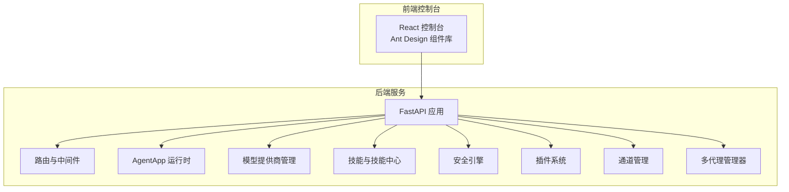
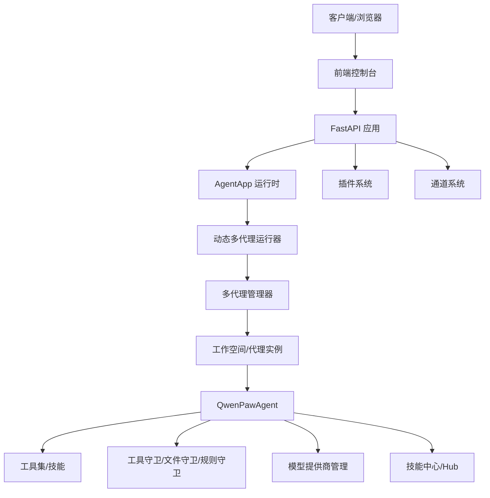
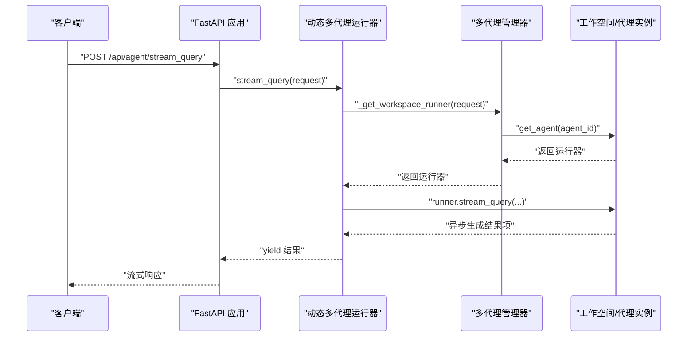
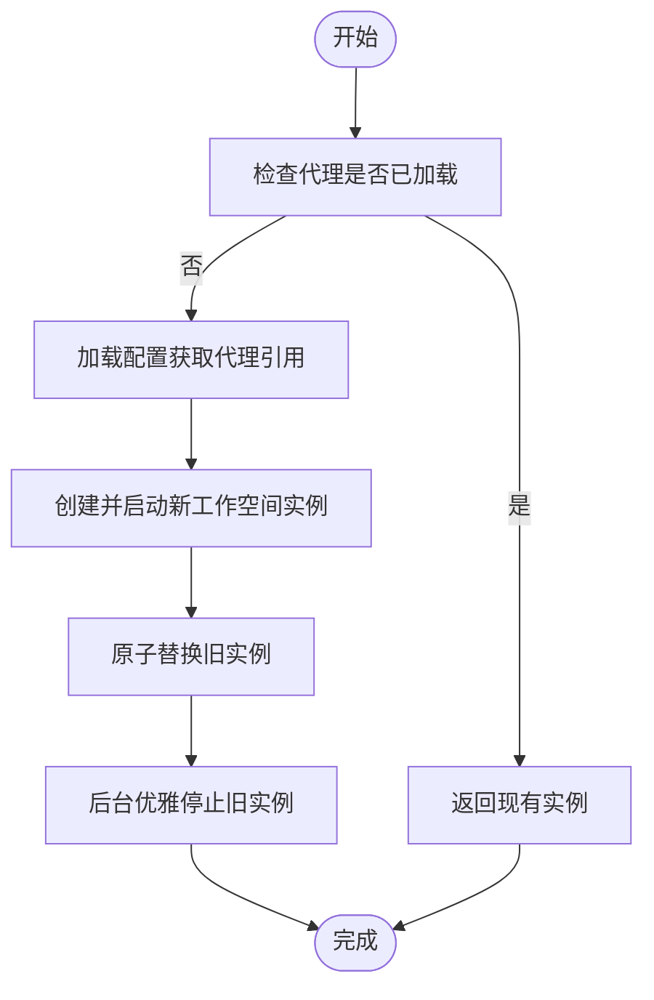
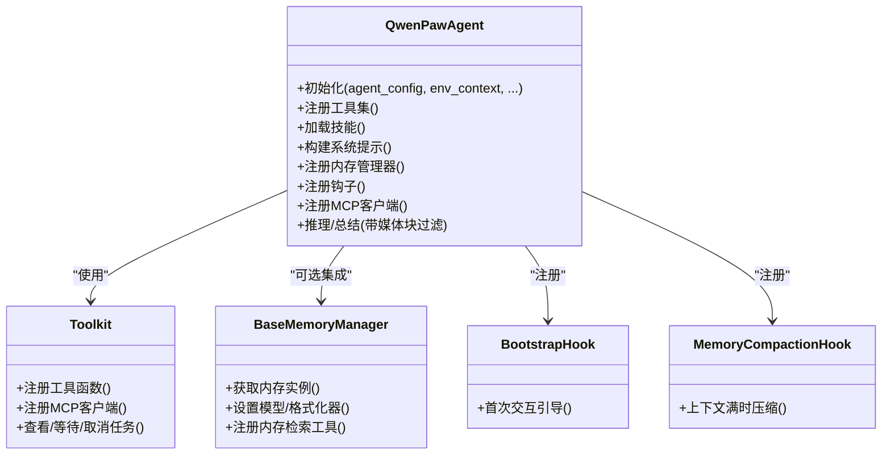
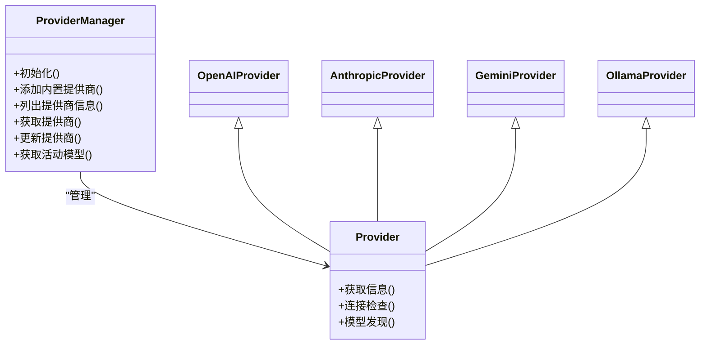
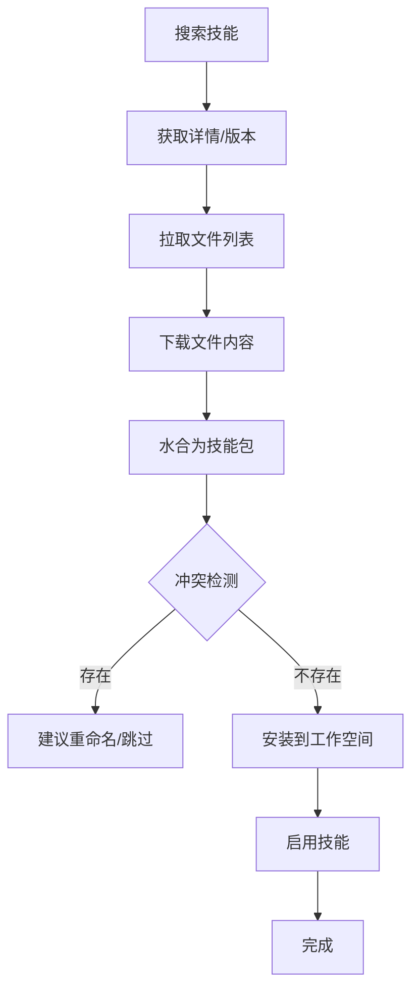
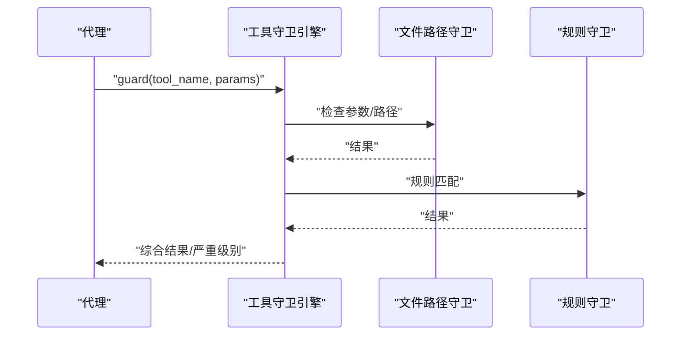
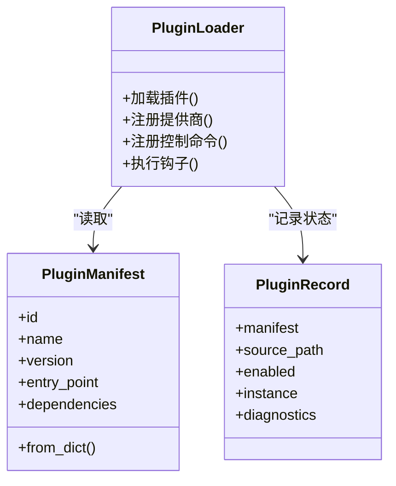
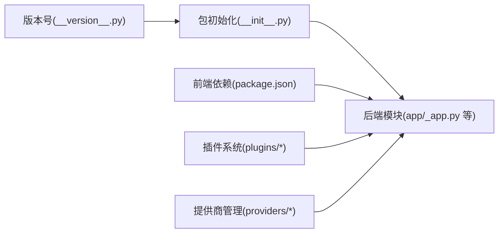

# 项目概述

<cite>
**本文档引用的文件**
- [README.md](file://README.md)
- [src/qwenpaw/__init__.py](file://src/qwenpaw/__init__.py)
- [src/qwenpaw/__version__.py](file://src/qwenpaw/__version__.py)
- [console/package.json](file://console/package.json)
- [setup.py](file://setup.py)
- [src/qwenpaw/app/_app.py](file://src/qwenpaw/app/_app.py)
- [src/qwenpaw/agents/react_agent.py](file://src/qwenpaw/agents/react_agent.py)
- [src/qwenpaw/providers/provider_manager.py](file://src/qwenpaw/providers/provider_manager.py)
- [src/qwenpaw/agents/skills_hub.py](file://src/qwenpaw/agents/skills_hub.py)
- [src/qwenpaw/app/multi_agent_manager.py](file://src/qwenpaw/app/multi_agent_manager.py)
- [src/qwenpaw/security/tool_guard/engine.py](file://src/qwenpaw/security/tool_guard/engine.py)
- [src/qwenpaw/plugins/architecture.py](file://src/qwenpaw/plugins/architecture.py)
</cite>

## 目录
1. [引言](#引言)
2. [项目结构](#项目结构)
3. [核心组件](#核心组件)
4. [架构总览](#架构总览)
5. [详细组件分析](#详细组件分析)
6. [依赖关系分析](#依赖关系分析)
7. [性能考量](#性能考量)
8. [故障排查指南](#故障排查指南)
9. [结论](#结论)
10. [附录](#附录)

## 引言
QwenPaw 是一个面向个人用户的智能助手平台，强调“在你身边、与你共成长”的理念。其核心价值主张包括：
- 在你的掌控之下：记忆与个性化完全由用户控制；可本地部署（数据留在本地机器）或云端部署（自选服务器），避免第三方托管与数据上传。
- 技能扩展：内置调度、PDF/Office处理、新闻摘要等能力；支持自定义技能自动加载，避免厂商锁定。
- 多代理协作：可创建多个独立代理，每个代理拥有自己的角色；启用协作技能后，代理间可进行通信以协同完成复杂任务。
- 多层安全：工具守卫、文件访问控制、技能安全扫描，确保运行安全。
- 全渠道连接：支持钉钉、飞书、微信、Discord、Telegram 等多渠道接入。

QwenPaw 的设计目标是成为用户数字生活的直观伙伴，既温暖又可靠。它基于 AgentScope 生态系统构建，并与之保持紧密关系，共同推动个人智能助手的开放、实用与安全。

章节来源
- [README.md:29-56](file://README.md#L29-L56)
- [README.md:471-472](file://README.md#L471-L472)

## 项目结构
QwenPaw 采用前后端分离与模块化组织方式：
- 后端服务（Python）：FastAPI 应用，提供统一 API、多代理管理、通道路由、模型与技能管理、安全与插件系统等。
- 前端控制台（React/Vite）：Ant Design 风格的 Web 控制台，用于配置模型、代理、技能、频道等。
- 插件体系：支持插件注册、控制命令、启动/关闭钩子，实现能力扩展与生态集成。
- 安全体系：工具守卫、文件路径守卫、规则守卫、技能扫描等多层防护。
- 通道系统：统一的通道抽象，支持多种即时通讯与语音通道。
- 技能中心：提供技能搜索、安装、版本管理与安全校验。

图表来源
- [src/qwenpaw/app/_app.py:424-569](file://src/qwenpaw/app/_app.py#L424-L569)
- [console/package.json:18-42](file://console/package.json#L18-L42)

章节来源
- [src/qwenpaw/app/_app.py:424-569](file://src/qwenpaw/app/_app.py#L424-L569)
- [console/package.json:18-42](file://console/package.json#L18-L42)

## 核心组件
- 应用入口与生命周期管理
  - FastAPI 应用负责启动、中间件装配（认证、CORS）、静态资源与 SPA 路由、以及 AgentApp 集成。
  - 生命周期钩子支持插件启动/关闭钩子、本地模型服务停止、多代理管理器停止等。
- 多代理管理器
  - 支持按需懒加载、零停机热重载、后台清理旧实例、并发启动已启用代理。
- 主代理类（QwenPawAgent）
  - 基于 ReActAgent，集成工具集、动态技能加载、内存管理、引导钩子与压缩钩子、MCP 客户端注册与恢复。
- 模型提供商管理
  - 内置多家云模型提供商与本地模型后端，统一接口、模型发现、连接检查与密钥存储。
- 技能中心
  - 提供技能搜索、版本解析、远程下载、内容提取、冲突检测与安装流程。
- 安全引擎
  - 工具调用前拦截，结合文件路径守卫与规则守卫，支持拒绝名单与受保护工具集合。
- 插件架构
  - 插件清单、记录、加载器、运行时助手、控制命令注册与优先级管理。

章节来源
- [src/qwenpaw/app/_app.py:166-422](file://src/qwenpaw/app/_app.py#L166-L422)
- [src/qwenpaw/app/multi_agent_manager.py:21-470](file://src/qwenpaw/app/multi_agent_manager.py#L21-L470)
- [src/qwenpaw/agents/react_agent.py:69-800](file://src/qwenpaw/agents/react_agent.py#L69-L800)
- [src/qwenpaw/providers/provider_manager.py:670-800](file://src/qwenpaw/providers/provider_manager.py#L670-L800)
- [src/qwenpaw/agents/skills_hub.py:53-800](file://src/qwenpaw/agents/skills_hub.py#L53-L800)
- [src/qwenpaw/security/tool_guard/engine.py:53-238](file://src/qwenpaw/security/tool_guard/engine.py#L53-L238)
- [src/qwenpaw/plugins/architecture.py:9-55](file://src/qwenpaw/plugins/architecture.py#L9-L55)

## 架构总览
QwenPaw 的整体架构围绕“应用服务 + 多代理 + 通道 + 技能 + 安全 + 插件”展开，形成可扩展、可协作、可治理的个人智能助手平台。

图表来源
- [src/qwenpaw/app/_app.py:63-163](file://src/qwenpaw/app/_app.py#L63-L163)
- [src/qwenpaw/app/multi_agent_manager.py:31-90](file://src/qwenpaw/app/multi_agent_manager.py#L31-L90)
- [src/qwenpaw/agents/react_agent.py:89-182](file://src/qwenpaw/agents/react_agent.py#L89-L182)
- [src/qwenpaw/security/tool_guard/engine.py:53-164](file://src/qwenpaw/security/tool_guard/engine.py#L53-L164)
- [src/qwenpaw/providers/provider_manager.py:670-791](file://src/qwenpaw/providers/provider_manager.py#L670-L791)
- [src/qwenpaw/agents/skills_hub.py:556-703](file://src/qwenpaw/agents/skills_hub.py#L556-L703)
- [src/qwenpaw/plugins/architecture.py:9-55](file://src/qwenpaw/plugins/architecture.py#L9-L55)

## 详细组件分析

### 动态多代理运行器与 AgentApp 集成
- 动态多代理运行器根据请求中的代理标识选择对应的工作空间运行器，实现按代理隔离与路由。
- AgentApp 通过统一的任务流接口与运行器交互，支持流式任务与超时控制。

图表来源
- [src/qwenpaw/app/_app.py:63-163](file://src/qwenpaw/app/_app.py#L63-L163)
- [src/qwenpaw/app/multi_agent_manager.py:38-90](file://src/qwenpaw/app/multi_agent_manager.py#L38-L90)

章节来源
- [src/qwenpaw/app/_app.py:63-163](file://src/qwenpaw/app/_app.py#L63-L163)
- [src/qwenpaw/app/multi_agent_manager.py:38-90](file://src/qwenpaw/app/multi_agent_manager.py#L38-L90)

### 多代理管理器与零停机热重载
- 按需懒加载：首次请求某个代理时才创建并启动。
- 零停机热重载：先启动新实例，原子替换旧实例，再在后台优雅停止旧实例，保证服务连续性。
- 并发启动：启动所有已启用代理，失败不影响其他代理。

图表来源
- [src/qwenpaw/app/multi_agent_manager.py:21-320](file://src/qwenpaw/app/multi_agent_manager.py#L21-L320)

章节来源
- [src/qwenpaw/app/multi_agent_manager.py:21-320](file://src/qwenpaw/app/multi_agent_manager.py#L21-L320)

### 主代理类（QwenPawAgent）与工具/技能/内存
- 工具集：内置文件读写、终端执行、浏览器操作、截图、媒体查看、任务管理等工具，支持异步执行与名称冲突策略。
- 技能加载：从工作目录解析有效技能，按通道过滤，动态注册到工具包。
- 内存管理：可选启用内存管理器，注册内存检索工具，支持自动压缩与钩子注入。
- 系统提示构建：从工作目录文件构建系统提示，注入多模态能力提示与环境上下文。
- MCP 客户端：支持 HTTP/STDIO 类型的有状态 MCP 客户端注册与恢复。

图表来源
- [src/qwenpaw/agents/react_agent.py:69-182](file://src/qwenpaw/agents/react_agent.py#L69-L182)
- [src/qwenpaw/agents/react_agent.py:306-454](file://src/qwenpaw/agents/react_agent.py#L306-L454)
- [src/qwenpaw/agents/react_agent.py:455-542](file://src/qwenpaw/agents/react_agent.py#L455-L542)

章节来源
- [src/qwenpaw/agents/react_agent.py:69-182](file://src/qwenpaw/agents/react_agent.py#L69-L182)
- [src/qwenpaw/agents/react_agent.py:306-454](file://src/qwenpaw/agents/react_agent.py#L306-L454)
- [src/qwenpaw/agents/react_agent.py:455-542](file://src/qwenpaw/agents/react_agent.py#L455-L542)

### 模型提供商管理（ProviderManager）
- 内置多家云模型提供商与本地模型后端，统一接口、模型发现、连接检查与密钥存储。
- 支持插件注册的提供商，动态注入到全局管理器中。

图表来源
- [src/qwenpaw/providers/provider_manager.py:670-800](file://src/qwenpaw/providers/provider_manager.py#L670-L800)

章节来源
- [src/qwenpaw/providers/provider_manager.py:670-800](file://src/qwenpaw/providers/provider_manager.py#L670-L800)

### 技能中心与安装流程
- 支持从技能中心搜索、版本解析、远程下载、内容提取与冲突检测。
- 提供统一的安装结果与错误处理，支持取消检查与重试退避策略。

图表来源
- [src/qwenpaw/agents/skills_hub.py:556-703](file://src/qwenpaw/agents/skills_hub.py#L556-L703)
- [src/qwenpaw/agents/skills_hub.py:290-404](file://src/qwenpaw/agents/skills_hub.py#L290-L404)

章节来源
- [src/qwenpaw/agents/skills_hub.py:556-703](file://src/qwenpaw/agents/skills_hub.py#L556-L703)
- [src/qwenpaw/agents/skills_hub.py:290-404](file://src/qwenpaw/agents/skills_hub.py#L290-L404)

### 安全引擎（工具守卫）
- 工具调用前拦截，支持文件路径守卫与规则守卫，支持拒绝名单与受保护工具集合。
- 可动态重载规则，支持仅对特定工具执行守卫。

图表来源
- [src/qwenpaw/security/tool_guard/engine.py:169-227](file://src/qwenpaw/security/tool_guard/engine.py#L169-L227)

章节来源
- [src/qwenpaw/security/tool_guard/engine.py:169-227](file://src/qwenpaw/security/tool_guard/engine.py#L169-L227)

### 插件系统架构
- 插件清单（manifest）定义插件元数据、入口点与依赖。
- 插件记录（record）跟踪源路径、启用状态、实例与诊断信息。
- 加载器负责加载插件配置、注册提供商、控制命令与钩子。

图表来源
- [src/qwenpaw/plugins/architecture.py:9-55](file://src/qwenpaw/plugins/architecture.py#L9-L55)

章节来源
- [src/qwenpaw/plugins/architecture.py:9-55](file://src/qwenpaw/plugins/architecture.py#L9-L55)

## 依赖关系分析
- 包版本与初始化
  - 版本号定义于独立模块，包初始化时设置日志级别并尝试加载持久化环境变量。
  - 前端依赖使用 Ant Design、Antd Design 图标、Markdown 渲染、国际化等生态组件。
- 后端依赖
  - FastAPI 提供 Web 服务与路由；AgentScope Runtime 提供 AgentApp 运行时；各模块按职责解耦。
- 插件与提供商
  - 插件系统通过加载器与运行时助手集成；提供商管理器集中管理内置与插件提供商。

图表来源
- [src/qwenpaw/__version__.py:2](file://src/qwenpaw/__version__.py#L2)
- [src/qwenpaw/__init__.py:11-32](file://src/qwenpaw/__init__.py#L11-L32)
- [console/package.json:18-42](file://console/package.json#L18-L42)
- [src/qwenpaw/app/_app.py:34-44](file://src/qwenpaw/app/_app.py#L34-L44)

章节来源
- [src/qwenpaw/__version__.py:2](file://src/qwenpaw/__version__.py#L2)
- [src/qwenpaw/__init__.py:11-32](file://src/qwenpaw/__init__.py#L11-L32)
- [console/package.json:18-42](file://console/package.json#L18-L42)
- [src/qwenpaw/app/_app.py:34-44](file://src/qwenpaw/app/_app.py#L34-L44)

## 性能考量
- 多代理懒加载与零停机热重载：减少冷启动时间，提升可用性与运维效率。
- 流式任务与超时控制：优化长任务体验，避免阻塞。
- 工具异步执行：支持后台任务管理工具，降低阻塞风险。
- 模型能力感知与媒体块过滤：在不支持多模态时主动剥离媒体块，减少失败重试成本。
- 插件与钩子的异步执行：支持同步与异步回调，避免阻塞主流程。

章节来源
- [src/qwenpaw/app/multi_agent_manager.py:208-320](file://src/qwenpaw/app/multi_agent_manager.py#L208-L320)
- [src/qwenpaw/app/_app.py:156-163](file://src/qwenpaw/app/_app.py#L156-L163)
- [src/qwenpaw/agents/react_agent.py:282-303](file://src/qwenpaw/agents/react_agent.py#L282-L303)
- [src/qwenpaw/agents/react_agent.py:675-785](file://src/qwenpaw/agents/react_agent.py#L675-L785)

## 故障排查指南
- 启动阶段
  - 日志初始化失败：包初始化会记录警告，确认环境变量与持久化环境加载是否成功。
  - 插件启动/关闭钩子异常：日志会记录失败原因，但不会中断主流程。
- 多代理管理
  - 代理未找到：检查配置文件中的代理 ID 是否正确。
  - 热重载失败：新实例启动失败会回滚，旧实例继续服务；检查新实例启动日志。
- 工具守卫
  - 守护未生效：检查环境变量与配置项；确认受保护工具集合与拒绝名单。
  - 规则重载失败：守护引擎会记录失败并继续使用旧规则。
- 技能安装
  - 下载超时/限流：检查网络与 GITHUB_TOKEN 设置；使用重试与退避策略。
  - 内容过大/ZIP 解压限制：调整相关阈值或清理缓存。
- 模型提供商
  - 连接检查失败：检查 Base URL、API Key 与网络连通性；必要时开启模型发现。

章节来源
- [src/qwenpaw/__init__.py:18-28](file://src/qwenpaw/__init__.py#L18-L28)
- [src/qwenpaw/app/_app.py:320-398](file://src/qwenpaw/app/_app.py#L320-L398)
- [src/qwenpaw/app/multi_agent_manager.py:282-297](file://src/qwenpaw/app/multi_agent_manager.py#L282-L297)
- [src/qwenpaw/security/tool_guard/engine.py:194-227](file://src/qwenpaw/security/tool_guard/engine.py#L194-L227)
- [src/qwenpaw/agents/skills_hub.py:290-404](file://src/qwenpaw/agents/skills_hub.py#L290-L404)
- [src/qwenpaw/providers/provider_manager.py:788-800](file://src/qwenpaw/providers/provider_manager.py#L788-L800)

## 结论
QwenPaw 以 AgentScope 生态为基础，构建了具备本地可控、技能扩展、多代理协作、全渠道连接与多层安全的个人智能助手平台。其模块化设计与插件化扩展能力，使其既能满足初学者快速上手，也能为高级用户提供深度定制与高性能保障。随着生态持续发展，QwenPaw 将在多模态、小大模型协同、记忆系统与云原生集成等方面不断演进。

章节来源
- [README.md:471-472](file://README.md#L471-L472)
- [README.md:412-432](file://README.md#L412-L432)

## 附录
- 版本信息与包初始化
  - 版本号：见版本模块。
  - 初始化日志与环境变量加载：见包初始化模块。
- 安装与开发
  - 前端构建：在 console 目录下执行依赖安装与构建，然后复制到后端包内。
  - 后端安装：使用 Python 安装脚本或直接安装 Python 包。

章节来源
- [src/qwenpaw/__version__.py:2](file://src/qwenpaw/__version__.py#L2)
- [src/qwenpaw/__init__.py:11-32](file://src/qwenpaw/__init__.py#L11-L32)
- [console/package.json:6-16](file://console/package.json#L6-L16)
- [setup.py:2](file://setup.py#L2)