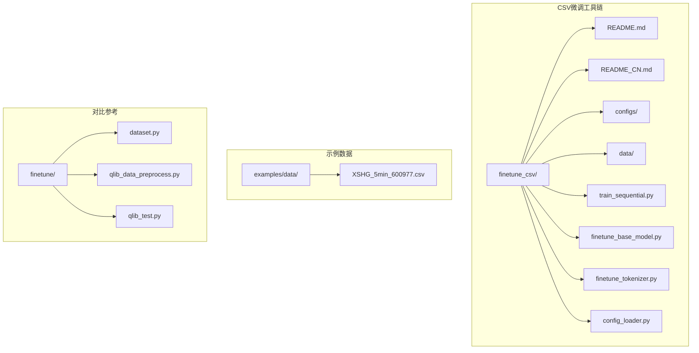
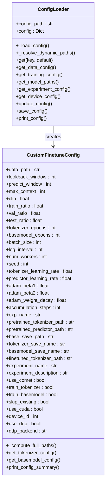
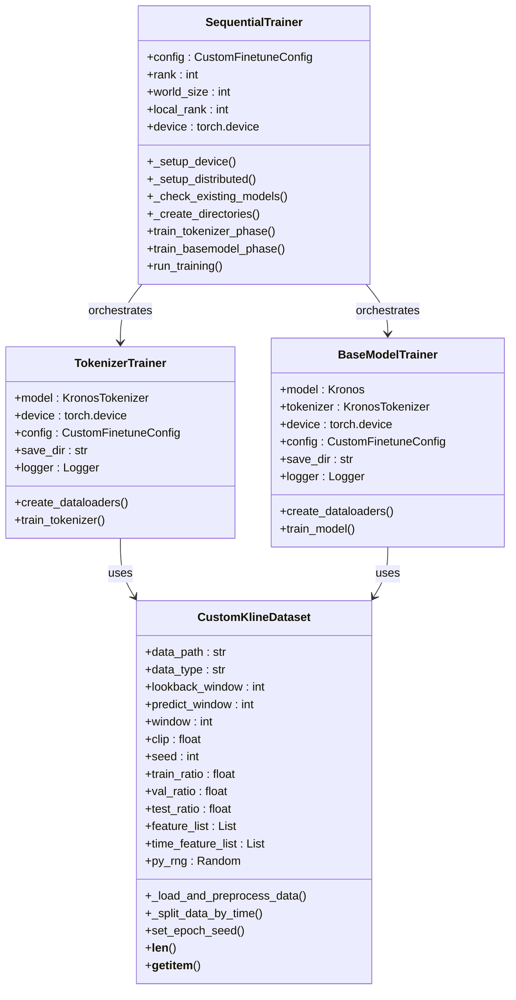
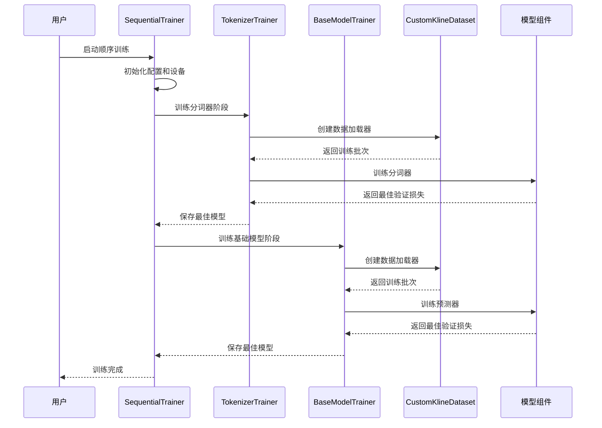
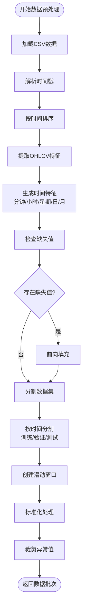
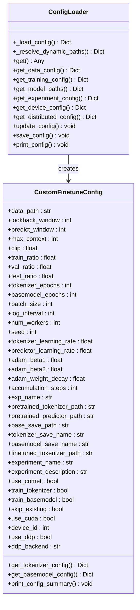
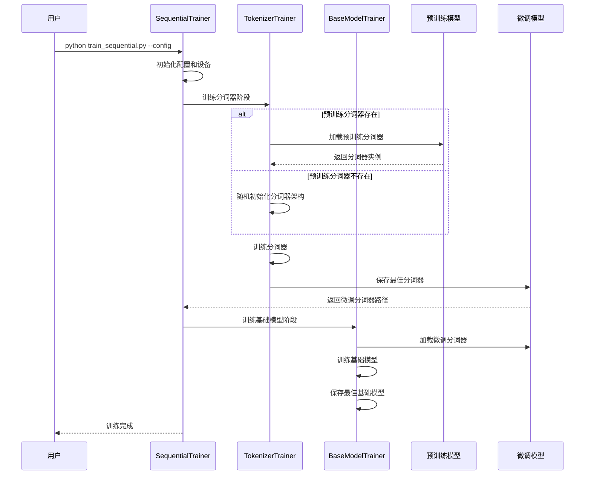
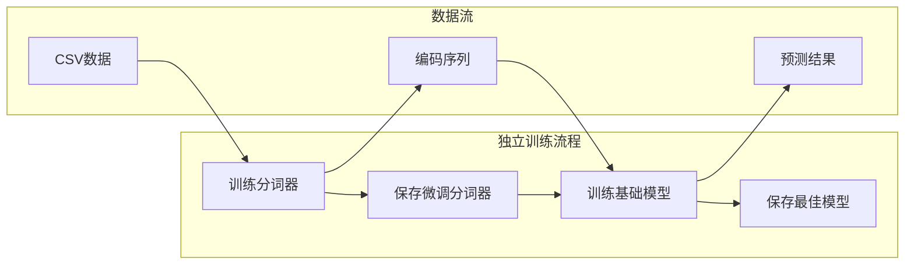
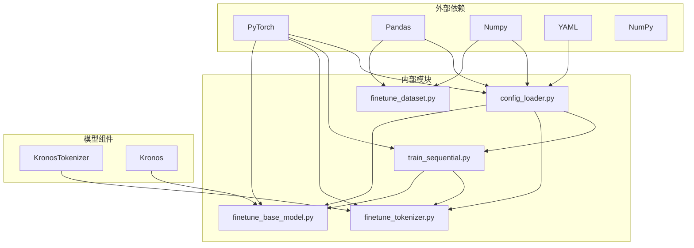

# CSV格式微调工具链

<cite>
**本文档引用的文件**
- [README_CN.md](file://finetune_csv/README_CN.md)
- [README.md](file://finetune_csv/README.md)
- [config_ali09988_candle-5min.yaml](file://finetune_csv/configs/config_ali09988_candle-5min.yaml)
- [config_loader.py](file://finetune_csv/config_loader.py)
- [train_sequential.py](file://finetune_csv/train_sequential.py)
- [finetune_base_model.py](file://finetune_csv/finetune_base_model.py)
- [finetune_tokenizer.py](file://finetune_csv/finetune_tokenizer.py)
- [HK_ali_09988_kline_5min_all.csv](file://finetune_csv/data/HK_ali_09988_kline_5min_all.csv)
- [XSHG_5min_600977.csv](file://examples/data/XSHG_5min_600977.csv)
- [dataset.py](file://finetune/dataset.py)
- [qlib_data_preprocess.py](file://finetune/qlib_data_preprocess.py)
- [qlib_test.py](file://finetune/qlib_test.py)
</cite>

## 目录
1. [简介](#简介)
2. [项目结构](#项目结构)
3. [核心组件](#核心组件)
4. [架构概览](#架构概览)
5. [详细组件分析](#详细组件分析)
6. [依赖关系分析](#依赖关系分析)
7. [性能考虑](#性能考虑)
8. [故障排除指南](#故障排除指南)
9. [结论](#结论)
10. [附录](#附录)

## 简介

Kronos CSV格式微调工具链是一个专为CSV格式金融数据设计的完整微调解决方案。该工具链提供了两种训练策略：顺序训练（先训练tokenizer再训练predictor）和独立组件训练，同时支持分布式训练以提升性能。

该工具链的核心优势在于其专门针对CSV格式数据优化的预处理流程，能够高效处理时间序列金融数据，包括开盘价、最高价、最低价、收盘价、成交量等特征，并自动提取时间特征（分钟、小时、星期、日、月）。

## 项目结构



**图表来源**
- [README.md:1-121](file://finetune_csv/README.md#L1-L121)
- [README_CN.md:1-119](file://finetune_csv/README_CN.md#L1-L119)

**章节来源**
- [README.md:1-121](file://finetune_csv/README.md#L1-L121)
- [README_CN.md:1-119](file://finetune_csv/README_CN.md#L1-L119)

## 核心组件

### 数据配置系统

数据配置系统通过统一的配置加载器管理所有训练参数，支持动态路径解析和参数验证。



**图表来源**
- [config_loader.py:6-268](file://finetune_csv/config_loader.py#L6-L268)

### 训练管道组件

训练管道由三个核心组件组成：顺序训练器、基础模型训练器和分词器训练器。



**图表来源**
- [train_sequential.py:18-362](file://finetune_csv/train_sequential.py#L18-L362)
- [finetune_base_model.py:25-469](file://finetune_csv/finetune_base_model.py#L25-L469)
- [finetune_tokenizer.py:151-360](file://finetune_csv/finetune_tokenizer.py#L151-L360)

**章节来源**
- [config_loader.py:109-268](file://finetune_csv/config_loader.py#L109-L268)
- [train_sequential.py:18-362](file://finetune_csv/train_sequential.py#L18-L362)
- [finetune_base_model.py:25-469](file://finetune_csv/finetune_base_model.py#L25-L469)
- [finetune_tokenizer.py:151-360](file://finetune_csv/finetune_tokenizer.py#L151-L360)

## 架构概览



**图表来源**
- [train_sequential.py:264-317](file://finetune_csv/train_sequential.py#L264-L317)
- [finetune_base_model.py:239-365](file://finetune_csv/finetune_base_model.py#L239-L365)
- [finetune_tokenizer.py:151-279](file://finetune_csv/finetune_tokenizer.py#L151-L279)

## 详细组件分析

### 数据预处理组件

CustomKlineDataset是CSV数据预处理的核心组件，负责数据加载、特征工程和时间序列窗口生成。



**图表来源**
- [finetune_base_model.py:52-132](file://finetune_csv/finetune_base_model.py#L52-L132)

#### 数据格式要求

CSV数据必须包含以下必需列：
- `timestamps`: 每个数据点的时间戳
- `open`: 开盘价
- `high`: 最高价  
- `low`: 最低价
- `close`: 收盘价
- `volume`: 交易量
- `amount`: 交易金额

可选特征：volume和amount可以为0，表示数据中不包含这些信息。

**章节来源**
- [README.md:8-29](file://finetune_csv/README.md#L8-L29)
- [README_CN.md:8-29](file://finetune_csv/README_CN.md#L8-L29)
- [finetune_base_model.py:40-66](file://finetune_csv/finetune_base_model.py#L40-L66)

### 训练配置系统

配置系统采用分层设计，支持灵活的参数管理和动态路径解析。



**图表来源**
- [config_loader.py:13-268](file://finetune_csv/config_loader.py#L13-L268)

#### 配置参数详解

**数据配置 (data)**
- `data_path`: CSV数据文件路径
- `lookback_window`: 使用的历史数据点数量
- `predict_window`: 要预测的未来点数
- `max_context`: 最大上下文长度
- `clip`: 标准化裁剪值
- `train_ratio/val_ratio/test_ratio`: 数据集分割比例

**训练配置 (training)**
- `tokenizer_epochs/basemodel_epochs`: 分词器和基础模型的训练轮数
- `batch_size`: 批次大小
- `log_interval`: 日志记录间隔
- `num_workers`: 数据加载器工作进程数
- `seed`: 随机种子
- `tokenizer_learning_rate/predictor_learning_rate`: 学习率
- `adam_beta1/2`: Adam优化器参数
- `adam_weight_decay`: 权重衰减
- `accumulation_steps`: 梯度累积步数

**模型路径配置 (model_paths)**
- `pretrained_tokenizer/pretrained_predictor`: 预训练模型路径
- `exp_name`: 实验名称
- `base_path`: 基础保存路径
- `base_save_path/finetuned_tokenizer`: 动态路径模板

**实验配置 (experiment)**
- `name/description`: 实验名称和描述
- `use_comet`: 是否使用Comet ML
- `train_tokenizer/train_basemodel`: 是否训练对应组件
- `skip_existing`: 是否跳过现有模型

**设备配置 (device)**
- `use_cuda`: 是否使用CUDA
- `device_id`: 设备ID

**章节来源**
- [config_ali09988_candle-5min.yaml:4-73](file://finetune_csv/configs/config_ali09988_candle-5min.yaml#L4-L73)
- [config_loader.py:119-268](file://finetune_csv/config_loader.py#L119-L268)

### 顺序训练策略

顺序训练策略是CSV微调工具链的核心创新，它将分词器训练和基础模型训练有机结合，确保两个组件的协同优化。



**图表来源**
- [train_sequential.py:66-262](file://finetune_csv/train_sequential.py#L66-L262)

#### 顺序训练的优势

1. **参数共享**: 分词器和基础模型共享特征表示，提高整体性能
2. **渐进式优化**: 先学习数据表示，再学习预测任务，避免灾难性遗忘
3. **计算效率**: 减少重复的特征提取计算
4. **稳定性**: 顺序训练通常比并行训练更稳定

#### 与标准微调流程的区别

| 特性 | 顺序训练 | 标准微调 |
|------|----------|----------|
| 训练顺序 | 分词器 → 基础模型 | 并行或独立训练 |
| 参数共享 | 强 | 弱 |
| 计算效率 | 高 | 中等 |
| 训练稳定性 | 高 | 中等 |
| 内存占用 | 低 | 中等 |

**章节来源**
- [train_sequential.py:66-262](file://finetune_csv/train_sequential.py#L66-L262)
- [README.md:52-68](file://finetune_csv/README.md#L52-L68)

### 独立组件训练

独立组件训练允许用户分别训练分词器和基础模型，提供更大的灵活性。



**图表来源**
- [finetune_tokenizer.py:281-360](file://finetune_csv/finetune_tokenizer.py#L281-L360)
- [finetune_base_model.py:367-469](file://finetune_csv/finetune_base_model.py#L367-L469)

**章节来源**
- [finetune_tokenizer.py:281-360](file://finetune_csv/finetune_tokenizer.py#L281-L360)
- [finetune_base_model.py:367-469](file://finetune_csv/finetune_base_model.py#L367-L469)

## 依赖关系分析



**图表来源**
- [config_loader.py:1-10](file://finetune_csv/config_loader.py#L1-L10)
- [train_sequential.py:1-16](file://finetune_csv/train_sequential.py#L1-L16)

### 关键依赖关系

1. **配置系统依赖**: 所有训练脚本都依赖ConfigLoader进行参数管理
2. **模型依赖**: 训练脚本依赖KronosTokenizer和Kronos模型组件
3. **数据依赖**: CustomKlineDataset依赖Pandas和NumPy进行数据处理
4. **分布式依赖**: 支持torch.distributed进行多GPU训练

**章节来源**
- [config_loader.py:1-10](file://finetune_csv/config_loader.py#L1-L10)
- [train_sequential.py:1-16](file://finetune_csv/train_sequential.py#L1-L16)

## 性能考虑

### 训练性能优化

1. **批处理优化**: 通过合理的batch_size和accumulation_steps平衡内存使用和训练速度
2. **数据加载优化**: 使用多进程数据加载器(num_workers)和pin_memory减少I/O等待
3. **梯度累积**: 在显存有限的情况下通过梯度累积实现更大有效batch_size
4. **分布式训练**: 支持DDP进行多GPU并行训练

### 内存管理

1. **数据预处理**: 在数据加载时进行标准化和裁剪，减少运行时内存占用
2. **模型参数**: 提供随机初始化选项，避免不必要的预训练模型加载
3. **检查点保存**: 定期保存最佳模型，防止训练中断导致的损失

### 训练稳定性

1. **学习率调度**: 使用OneCycleLR策略，在训练初期快速收敛
2. **梯度裁剪**: 防止梯度爆炸，提高训练稳定性
3. **验证监控**: 基于验证损失保存最佳模型，避免过拟合

## 故障排除指南

### 常见问题及解决方案

**数据格式错误**
- 症状: 数据加载失败或索引错误
- 解决方案: 确保CSV文件包含必需列，检查时间戳格式一致性

**内存不足**
- 症状: CUDA out of memory错误
- 解决方案: 减小batch_size，增加accumulation_steps，或使用更小的模型

**训练不收敛**
- 症状: 验证损失不下降或震荡
- 解决方案: 调整学习率，检查数据预处理，验证超参数设置

**分布式训练问题**
- 症状: 进程同步错误或通信失败
- 解决方案: 检查环境变量设置，确认网络连接，验证后端兼容性

### 调试技巧

1. **日志分析**: 查看训练日志中的损失曲线和学习率变化
2. **中间结果检查**: 验证数据预处理步骤的正确性
3. **参数敏感性**: 逐步调整超参数，观察对性能的影响

**章节来源**
- [finetune_base_model.py:239-365](file://finetune_csv/finetune_base_model.py#L239-L365)
- [finetune_tokenizer.py:151-279](file://finetune_csv/finetune_tokenizer.py#L151-L279)

## 结论

Kronos CSV格式微调工具链提供了一个完整、高效的金融时间序列微调解决方案。其核心优势包括：

1. **专门的CSV优化**: 针对CSV格式数据的完整预处理和特征工程
2. **顺序训练策略**: 通过分词器和基础模型的协同训练提升整体性能
3. **灵活的配置系统**: 支持动态参数管理和路径解析
4. **分布式训练支持**: 提供多GPU并行训练能力
5. **完整的工具链**: 从数据准备到模型保存的全流程支持

该工具链特别适用于需要处理大量CSV格式金融数据的场景，为研究人员和开发者提供了一个可靠的微调平台。

## 附录

### 配置文件模板

完整的配置文件模板可以在以下位置找到：
- [config_ali09988_candle-5min.yaml](file://finetune_csv/configs/config_ali09988_candle-5min.yaml)

### 示例数据

示例CSV数据文件：
- [HK_ali_09988_kline_5min_all.csv](file://finetune_csv/data/HK_ali_09988_kline_5min_all.csv)
- [XSHG_5min_600977.csv](file://examples/data/XSHG_5min_600977.csv)

### 训练命令示例

**顺序训练（推荐）**:
```bash
python train_sequential.py --config configs/config_ali09988_candle-5min.yaml
```

**跳过现有模型**:
```bash
python train_sequential.py --config configs/config_ali09988_candle-5min.yaml --skip-existing
```

**只训练分词器**:
```bash
python train_sequential.py --config configs/config_ali09988_candle-5min.yaml --skip-basemodel
```

**只训练基础模型**:
```bash
python train_sequential.py --config configs/config_ali09988_candle-5min.yaml --skip-tokenizer
```

**分布式训练**:
```bash
DIST_BACKEND=nccl \
torchrun --standalone --nproc_per_node=8 train_sequential.py --config configs/config_ali09988_candle-5min.yaml
```

**章节来源**
- [README.md:52-90](file://finetune_csv/README.md#L52-L90)
- [README_CN.md:50-88](file://finetune_csv/README_CN.md#L50-L88)