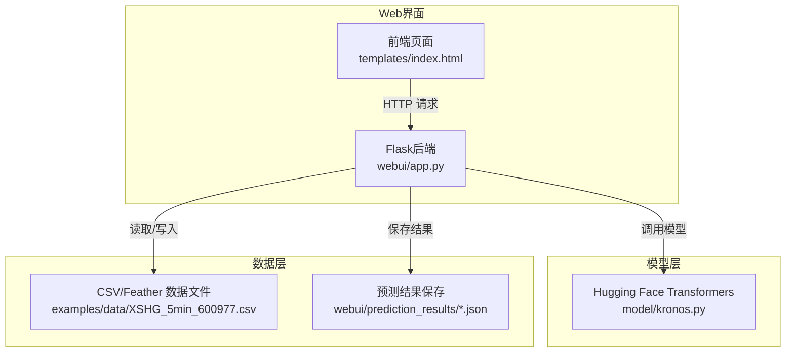
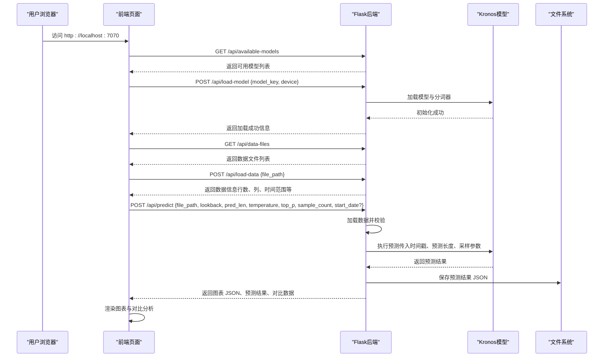
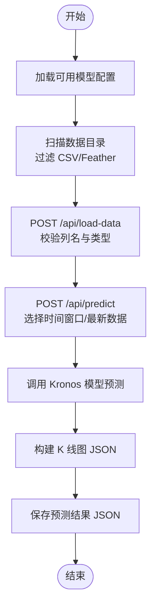
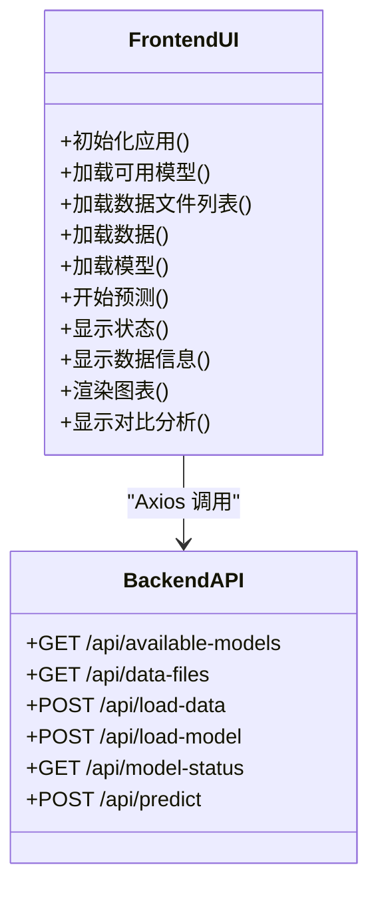
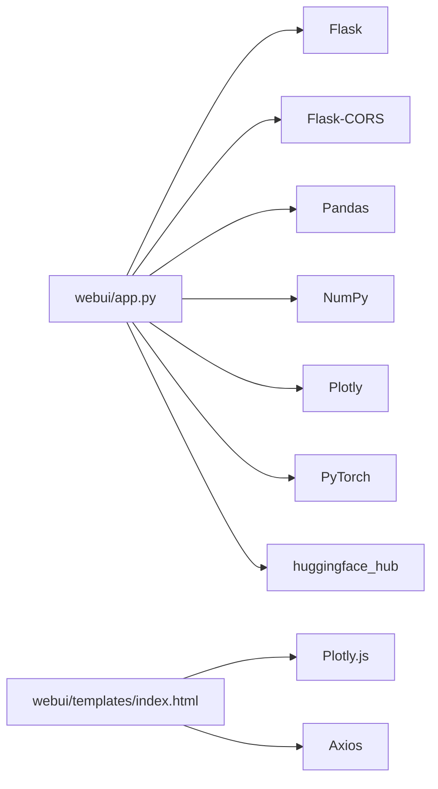

# Web界面使用

<cite>
**本文档引用的文件**
- [webui/app.py](file://webui/app.py)
- [webui/run.py](file://webui/run.py)
- [webui/start.sh](file://webui/start.sh)
- [webui/templates/index.html](file://webui/templates/index.html)
- [webui/requirements.txt](file://webui/requirements.txt)
- [webui/README.md](file://webui/README.md)
- [model/kronos.py](file://model/kronos.py)
- [examples/data/XSHG_5min_600977.csv](file://examples/data/XSHG_5min_600977.csv)
- [webui/prediction_results/prediction_20250826_163800.json](file://webui/prediction_results/prediction_20250826_163800.json)
</cite>

## 目录
1. [简介](#简介)
2. [项目结构](#项目结构)
3. [核心组件](#核心组件)
4. [架构总览](#架构总览)
5. [详细组件分析](#详细组件分析)
6. [依赖关系分析](#依赖关系分析)
7. [性能考虑](#性能考虑)
8. [故障排除指南](#故障排除指南)
9. [结论](#结论)
10. [附录](#附录)

## 简介
本指南面向使用 Kronos Web 界面进行金融 K 线数据预测的用户与运维人员。内容涵盖基于 Flask 的 Web 应用架构、前端界面设计、后端 API 集成、启动与配置、界面功能详解（数据上传、参数设置、预测执行、结果展示）、Web 界面与核心预测 API 的交互机制（请求处理、响应格式、错误处理）、部署指南（Docker 容器化、生产环境配置、性能优化）以及常见问题排查。

## 项目结构
Web 界面位于 webui 目录，采用前后端分离的设计：
- 后端：Flask 应用，提供 RESTful API 接口，负责数据加载、模型加载、预测执行、图表生成与结果保存。
- 前端：单页 HTML 页面，使用 Plotly.js 渲染 K 线图，Axios 进行前后端通信。
- 模型：通过 Hugging Face Transformers 加载 Kronos 模型，支持多尺寸模型与多设备（CPU/CUDA/MPS）。

**图表来源**
- [webui/app.py:1-709](file://webui/app.py#L1-L709)
- [webui/templates/index.html:1-1239](file://webui/templates/index.html#L1-L1239)
- [model/kronos.py:1-200](file://model/kronos.py#L1-L200)
- [examples/data/XSHG_5min_600977.csv:1-200](file://examples/data/XSHG_5min_600977.csv#L1-L200)

**章节来源**
- [webui/app.py:1-709](file://webui/app.py#L1-L709)
- [webui/templates/index.html:1-1239](file://webui/templates/index.html#L1-L1239)
- [webui/README.md:1-136](file://webui/README.md#L1-L136)

## 核心组件
- Flask 应用与路由
  - 首页渲染：GET /
  - 数据文件列表：GET /api/data-files
  - 加载数据：POST /api/load-data
  - 加载模型：POST /api/load-model
  - 获取可用模型：GET /api/available-models
  - 模型状态查询：GET /api/model-status
  - 执行预测：POST /api/predict
- 前端页面与交互
  - 模型选择、设备选择、数据文件选择、时间窗口滑块、预测质量参数（温度、核采样、样本数）
  - 图表渲染（Plotly）、对比分析表格与统计指标
- 数据处理与保存
  - 数据文件扫描与加载（CSV/Feather），列校验与类型转换
  - 预测结果保存为 JSON 文件，包含输入摘要、预测结果、实际数据与分析

**章节来源**
- [webui/app.py:330-709](file://webui/app.py#L330-L709)
- [webui/templates/index.html:636-1239](file://webui/templates/index.html#L636-L1239)

## 架构总览
Web 界面采用前后端分离架构：
- 前端通过 Axios 调用后端 API，后端通过 Hugging Face Transformers 加载 Kronos 模型，完成预测任务，并返回图表与结果数据。
- 后端对数据进行预处理与校验，确保时间序列连续性与必要的价格列存在。
- 预测完成后，后端将结果以 JSON 形式保存到 webui/prediction_results 目录，便于后续查看与分析。

**图表来源**
- [webui/app.py:404-624](file://webui/app.py#L404-L624)
- [webui/templates/index.html:636-1239](file://webui/templates/index.html#L636-L1239)

**章节来源**
- [webui/app.py:404-624](file://webui/app.py#L404-L624)
- [webui/templates/index.html:636-1239](file://webui/templates/index.html#L636-L1239)

## 详细组件分析

### 后端 Flask 应用（webui/app.py）
- 全局状态管理
  - tokenizer、model、predictor 全局变量用于缓存已加载的模型实例。
- 可用模型配置
  - 提供 kronos-mini、kronos-small、kronos-base 三种模型配置，包含模型 ID、分词器 ID、上下文长度与参数规模描述。
- 数据文件扫描与加载
  - 支持 CSV 与 Feather 格式；自动检测时间列（timestamps/timestamp/date），并进行数值列清洗与缺失值剔除。
- 预测执行流程
  - 支持自定义时间窗口与最新数据两种模式；根据 lookback 与 pred_len 截取历史与预测区间；生成未来时间戳；调用模型进行预测；可选保存实际数据用于对比分析。
- 图表生成
  - 使用 Plotly 创建 K 线图，区分历史数据、预测数据与实际数据，保证时间轴连续性。
- 结果保存
  - 将预测结果、输入摘要、参数与分析指标保存为 JSON 文件，便于回溯与二次分析。

**图表来源**
- [webui/app.py:60-208](file://webui/app.py#L60-L208)
- [webui/app.py:404-624](file://webui/app.py#L404-L624)

**章节来源**
- [webui/app.py:33-58](file://webui/app.py#L33-L58)
- [webui/app.py:60-208](file://webui/app.py#L60-L208)
- [webui/app.py:404-624](file://webui/app.py#L404-L624)

### 前端页面（webui/templates/index.html）
- 控制面板
  - 模型选择下拉框、设备选择（CPU/CUDA/MPS）、数据文件选择、时间窗口滑块、预测质量参数（温度、核采样、样本数）。
- 结果展示
  - 图表区域（Plotly 渲染）、对比分析区域（误差统计与详细对比表格）。
- 交互逻辑
  - 通过 Axios 调用后端 API，动态更新状态、数据信息与图表。

**图表来源**
- [webui/templates/index.html:636-1239](file://webui/templates/index.html#L636-L1239)
- [webui/app.py:335-699](file://webui/app.py#L335-L699)

**章节来源**
- [webui/templates/index.html:448-634](file://webui/templates/index.html#L448-L634)

### 数据格式与示例
- 支持的数据列
  - 必需：open、high、low、close
  - 可选：volume、amount、timestamps/timestamp/date
- 示例数据文件
  - examples/data/XSHG_5min_600977.csv 展示了标准的 K 线数据格式，包含时间戳与 OHLCV 列。

**章节来源**
- [webui/app.py:78-124](file://webui/app.py#L78-L124)
- [examples/data/XSHG_5min_600977.csv:1-200](file://examples/data/XSHG_5min_600977.csv#L1-L200)

### 预测结果保存与分析
- 保存字段
  - 时间戳、文件路径、预测类型、预测参数、输入数据摘要、预测结果、实际数据、分析指标。
- 分析指标
  - 对比分析包含首尾点连续性、绝对误差、均方根误差、平均绝对百分比误差等。

**章节来源**
- [webui/app.py:125-208](file://webui/app.py#L125-L208)
- [webui/prediction_results/prediction_20250826_163800.json:1-200](file://webui/prediction_results/prediction_20250826_163800.json#L1-L200)

## 依赖关系分析
- 后端依赖
  - Flask、Flask-CORS、Pandas、NumPy、Plotly、PyTorch、huggingface_hub
- 前端依赖
  - Plotly.js、Axios（CDN 引入）
- 模型依赖
  - Hugging Face Transformers 提供的 Kronos 模型与分词器

**图表来源**
- [webui/requirements.txt:1-8](file://webui/requirements.txt#L1-L8)
- [webui/app.py:1-12](file://webui/app.py#L1-L12)
- [webui/templates/index.html:7-8](file://webui/templates/index.html#L7-L8)

**章节来源**
- [webui/requirements.txt:1-8](file://webui/requirements.txt#L1-L8)

## 性能考虑
- 模型加载
  - 首次加载可能需要从 Hugging Face 下载权重，请确保网络稳定与磁盘空间充足。
- 设备选择
  - 在支持的设备上运行（CPU/CUDA/MPS）可显著提升推理速度；GPU 加速推荐用于大规模预测。
- 数据大小
  - lookback 与 pred_len 固定为 400 与 120，确保数据文件包含足够的历史数据以满足预测窗口。
- 前端渲染
  - 大量数据点时，图表渲染可能较慢；建议在生产环境中启用缓存与分页策略。

[本节为通用性能建议，无需特定文件引用]

## 故障排除指南
- 端口占用
  - 默认端口 7070，若被占用请修改 webui/app.py 中的端口配置或释放端口。
- 缺少依赖
  - 使用 requirements.txt 安装依赖；run.py 与 start.sh 提供自动安装提示。
- 模型加载失败
  - 检查网络连接与模型 ID；确认设备驱动（如 CUDA/MPS）可用。
- 数据格式错误
  - 确保数据文件包含 open、high、low、close 列；时间列可为 timestamps、timestamp 或 date。
- 预测失败
  - 检查数据长度是否满足 lookback + pred_len；确认模型已加载且设备可用。

**章节来源**
- [webui/README.md:111-136](file://webui/README.md#L111-L136)
- [webui/run.py:12-36](file://webui/run.py#L12-L36)
- [webui/start.sh:20-32](file://webui/start.sh#L20-L32)

## 结论
Kronos Web 界面提供了直观易用的金融预测平台，结合 Flask 后端与前端可视化组件，实现了从数据加载、模型选择、参数设置到预测执行与结果展示的完整工作流。通过合理的部署与优化，可在本地或生产环境中高效运行。

[本节为总结性内容，无需特定文件引用]

## 附录

### 启动与访问
- 方法一：使用 run.py 启动（自动检查与安装依赖）
  - cd webui && python run.py
- 方法二：使用 shell 脚本启动
  - cd webui && chmod +x start.sh && ./start.sh
- 方法三：直接启动 Flask 应用
  - cd webui && python app.py
- 访问地址
  - http://localhost:7070

**章节来源**
- [webui/README.md:15-36](file://webui/README.md#L15-L36)
- [webui/run.py:38-90](file://webui/run.py#L38-L90)
- [webui/start.sh:34-41](file://webui/start.sh#L34-L41)

### 配置与参数
- 模型选择
  - kronos-mini：轻量快速；kronos-small：平衡性能与速度；kronos-base：高质量预测。
- 设备选择
  - CPU：兼容性最佳；CUDA：NVIDIA GPU 加速；MPS：Apple Silicon 加速。
- 预测质量参数
  - 温度（T）：控制随机性；核采样（top_p）：控制多样性；样本数：生成多个样本以提高质量。

**章节来源**
- [webui/README.md:47-88](file://webui/README.md#L47-L88)
- [webui/app.py:33-58](file://webui/app.py#L33-L58)

### API 接口定义
- GET /api/available-models
  - 返回可用模型列表与模型库可用状态
- POST /api/load-model
  - 请求体：{model_key, device}
  - 成功返回：{success, message, model_info}
- GET /api/model-status
  - 返回模型加载状态与当前设备
- GET /api/data-files
  - 返回数据文件列表（名称、路径、大小）
- POST /api/load-data
  - 请求体：{file_path}
  - 成功返回：{success, data_info, message}
  - data_info 字段：rows、columns、start_date、end_date、price_range、prediction_columns、timeframe
- POST /api/predict
  - 请求体：{file_path, lookback, pred_len, temperature, top_p, sample_count, start_date?}
  - 成功返回：{success, prediction_type, chart, prediction_results, actual_data, has_comparison, message}

**章节来源**
- [webui/app.py:335-699](file://webui/app.py#L335-L699)

### Docker 容器化部署（建议）
- 基础镜像
  - 使用官方 Python 基础镜像（如 python:3.x-slim）
- 安装依赖
  - 复制 requirements.txt 并执行 pip install -r requirements.txt
- 暴露端口
  - EXPOSE 7070
- 启动命令
  - CMD ["python", "app.py"]
- 注意事项
  - 如需 GPU 加速，使用 nvidia/cuda 基础镜像并正确挂载驱动
  - 将数据目录与 prediction_results 目录映射为持久卷

[本节为部署建议，不涉及具体代码实现]