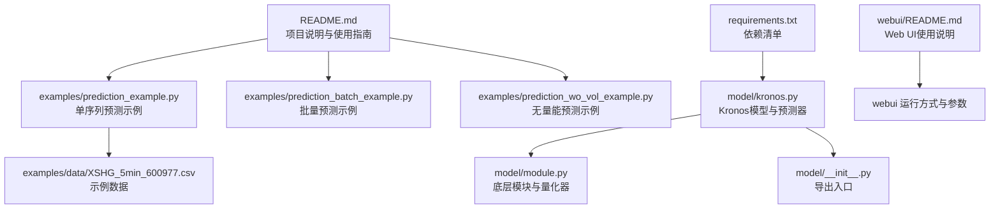
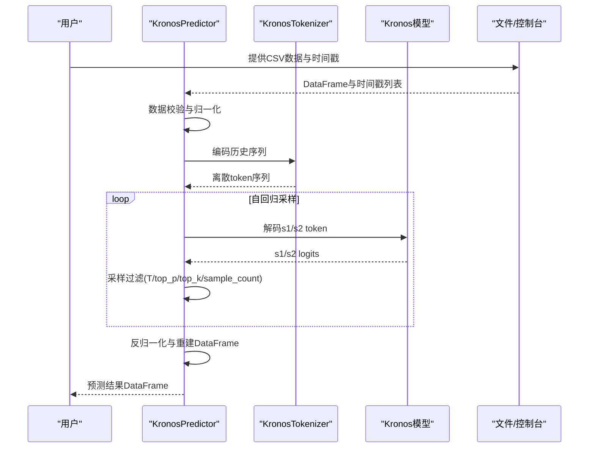
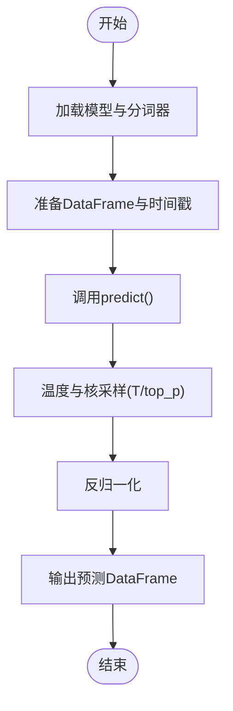
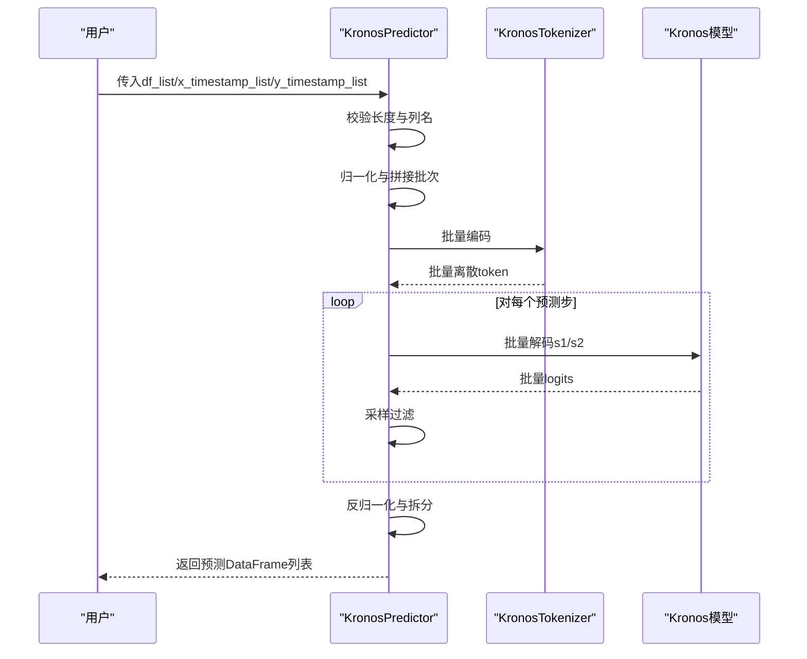
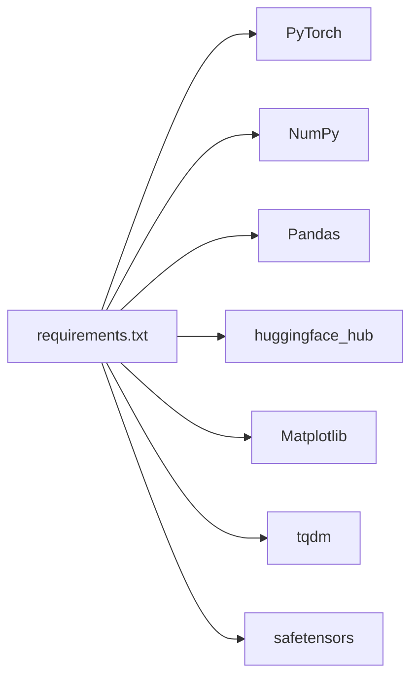

# 快速开始

<cite>
**本文引用的文件**
- [README.md](file://README.md)
- [requirements.txt](file://requirements.txt)
- [model/kronos.py](file://model/kronos.py)
- [model/module.py](file://model/module.py)
- [model/__init__.py](file://model/__init__.py)
- [examples/prediction_example.py](file://examples/prediction_example.py)
- [examples/prediction_batch_example.py](file://examples/prediction_batch_example.py)
- [examples/prediction_wo_vol_example.py](file://examples/prediction_wo_vol_example.py)
- [examples/data/XSHG_5min_600977.csv](file://examples/data/XSHG_5min_600977.csv)
- [webui/README.md](file://webui/README.md)
</cite>

## 目录
1. [简介](#简介)
2. [项目结构](#项目结构)
3. [核心组件](#核心组件)
4. [架构总览](#架构总览)
5. [详细组件分析](#详细组件分析)
6. [依赖分析](#依赖分析)
7. [性能考虑](#性能考虑)
8. [故障排查指南](#故障排查指南)
9. [结论](#结论)
10. [附录](#附录)

## 简介
本指南面向首次接触Kronos的用户，帮助你在30分钟内完成从安装到首次预测的全流程。你将学会：
- 安装Python与依赖
- 准备数据与模型
- 使用KronosPredictor进行单序列与批量预测
- 解释预测结果并可视化
- 常见问题与性能优化建议

## 项目结构
仓库采用模块化组织，核心预测逻辑集中在model目录，示例脚本位于examples目录，Web UI在webui目录中。下图展示了与“快速开始”直接相关的关键文件与职责：

图表来源
- [README.md](file://README.md)
- [requirements.txt](file://requirements.txt)
- [model/kronos.py](file://model/kronos.py)
- [model/module.py](file://model/module.py)
- [model/__init__.py](file://model/__init__.py)
- [examples/prediction_example.py](file://examples/prediction_example.py)
- [examples/prediction_batch_example.py](file://examples/prediction_batch_example.py)
- [examples/prediction_wo_vol_example.py](file://examples/prediction_wo_vol_example.py)
- [examples/data/XSHG_5min_600977.csv](file://examples/data/XSHG_5min_600977.csv)
- [webui/README.md](file://webui/README.md)

章节来源
- [README.md](file://README.md)
- [requirements.txt](file://requirements.txt)

## 核心组件
- 模型与分词器：Kronos与KronosTokenizer，负责将OHLCV等多维K线序列量化为离散token，并进行自回归解码。
- 预测器：KronosPredictor，封装数据预处理、归一化、采样推理与反归一化，提供predict与predict_batch接口。
- 示例脚本：演示从CSV读取数据到生成预测结果的完整流程。

章节来源
- [model/kronos.py](file://model/kronos.py)
- [model/module.py](file://model/module.py)
- [model/__init__.py](file://model/__init__.py)

## 架构总览
下图展示了从输入数据到预测输出的整体流程，以及模型内部的两阶段处理（分词器量化与模型解码）：

图表来源
- [model/kronos.py](file://model/kronos.py)

## 详细组件分析

### 1) 安装与环境准备
- Python版本要求：3.10及以上
- 安装依赖：执行仓库根目录下的依赖安装命令
- 依赖清单参考requirements.txt

章节来源
- [README.md](file://README.md)
- [requirements.txt](file://requirements.txt)

### 2) 数据准备
- 输入格式：pandas DataFrame，至少包含['open','high','low','close']列；可选['volume','amount']
- 时间戳：x_timestamp与y_timestamp分别对应历史与未来预测的时间索引
- 示例数据：examples/data/XSHG_5min_600977.csv

章节来源
- [examples/data/XSHG_5min_600977.csv](file://examples/data/XSHG_5min_600977.csv)
- [README.md](file://README.md)

### 3) 加载模型与分词器
- 从Hugging Face Hub加载预训练模型与分词器
- 支持设备自动检测（优先CUDA/MPS，否则CPU）

章节来源
- [README.md](file://README.md)
- [model/kronos.py](file://model/kronos.py)

### 4) 单序列预测（predict）
- 关键步骤
  - 实例化KronosPredictor
  - 准备x_df/x_timestamp/y_timestamp
  - 调用predict，设置采样参数T、top_p、sample_count
  - 获取预测结果DataFrame并按y_timestamp索引
- 结果解释：返回['open','high','low','close','volume','amount']，索引为y_timestamp

图表来源
- [model/kronos.py](file://model/kronos.py)
- [examples/prediction_example.py](file://examples/prediction_example.py)

章节来源
- [model/kronos.py](file://model/kronos.py)
- [examples/prediction_example.py](file://examples/prediction_example.py)

### 5) 批量预测（predict_batch）
- 适用场景：同时对多个时序进行预测，提升吞吐
- 参数要求：所有序列的历史长度与预测长度一致
- 输出：按输入顺序返回多个预测DataFrame

图表来源
- [model/kronos.py](file://model/kronos.py)
- [examples/prediction_batch_example.py](file://examples/prediction_batch_example.py)

章节来源
- [model/kronos.py](file://model/kronos.py)
- [examples/prediction_batch_example.py](file://examples/prediction_batch_example.py)

### 6) 无量能预测（仅OHLC）
- 当不需要volume/amount时，可仅提供['open','high','low','close']
- 内部会自动填充缺失列为0

章节来源
- [examples/prediction_wo_vol_example.py](file://examples/prediction_wo_vol_example.py)

### 7) 可视化与结果解读
- 示例脚本包含绘图函数，展示close与volume的对比
- 预测结果以DataFrame形式返回，便于进一步分析或保存

章节来源
- [examples/prediction_example.py](file://examples/prediction_example.py)
- [examples/prediction_batch_example.py](file://examples/prediction_batch_example.py)

## 依赖分析
- Python 3.10+
- PyTorch 2.0+
- 其他依赖详见requirements.txt
- Web UI依赖独立于核心预测逻辑，可通过webui/README.md了解启动方式

图表来源
- [requirements.txt](file://requirements.txt)

章节来源
- [requirements.txt](file://requirements.txt)

## 性能考虑
- 设备选择：优先使用GPU（CUDA/MPS），若无GPU则使用CPU
- 采样参数：T影响随机性，top_p控制多样性，sample_count越大越稳定但耗时更长
- 上下文长度：Kronos-small/base的max_context为512，建议历史窗口不超过此值
- 批量预测：对多资产或多时间段预测时使用predict_batch以提升吞吐

章节来源
- [README.md](file://README.md)
- [model/kronos.py](file://model/kronos.py)

## 故障排查指南
- 依赖未安装：确认requirements.txt中的包已安装
- 模型加载失败：检查网络连接与Hugging Face模型ID是否正确
- 数据格式错误：确保DataFrame包含必要列且无NaN
- 设备不支持：确认CUDA/MPS可用，否则回退至CPU
- Web UI端口占用：修改webui/app.py中的端口配置

章节来源
- [webui/README.md](file://webui/README.md)
- [README.md](file://README.md)

## 结论
通过本指南，你已经完成了从环境准备、数据准备、模型加载到单序列与批量预测的全流程。建议在实际应用中结合业务需求调整采样参数，并利用批量预测提升效率。

## 附录

### A. 完整可运行脚本路径
- 单序列预测示例：[examples/prediction_example.py](file://examples/prediction_example.py)
- 批量预测示例：[examples/prediction_batch_example.py](file://examples/prediction_batch_example.py)
- 无量能预测示例：[examples/prediction_wo_vol_example.py](file://examples/prediction_wo_vol_example.py)

### B. 示例数据路径
- 示例CSV数据：[examples/data/XSHG_5min_600977.csv](file://examples/data/XSHG_5min_600977.csv)

### C. Web UI快速启动
- 启动方式参考：[webui/README.md](file://webui/README.md)