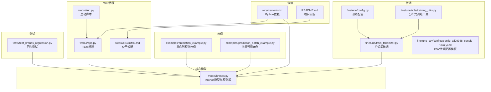
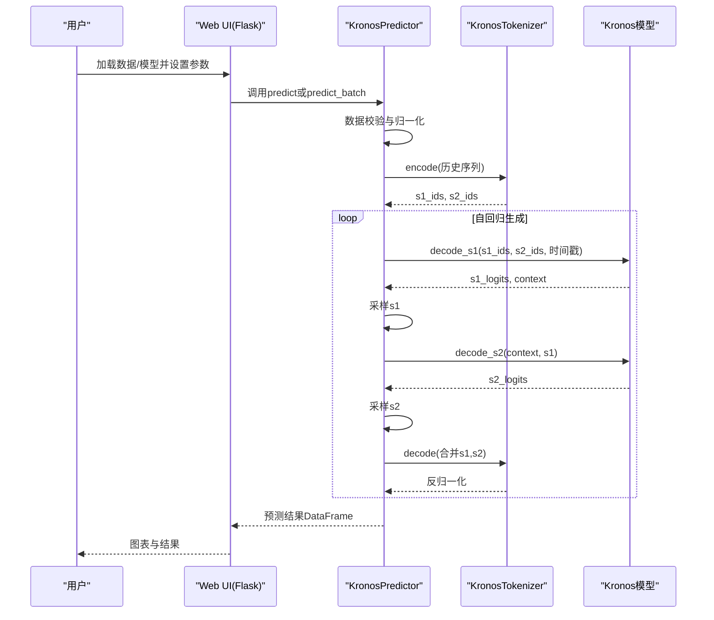
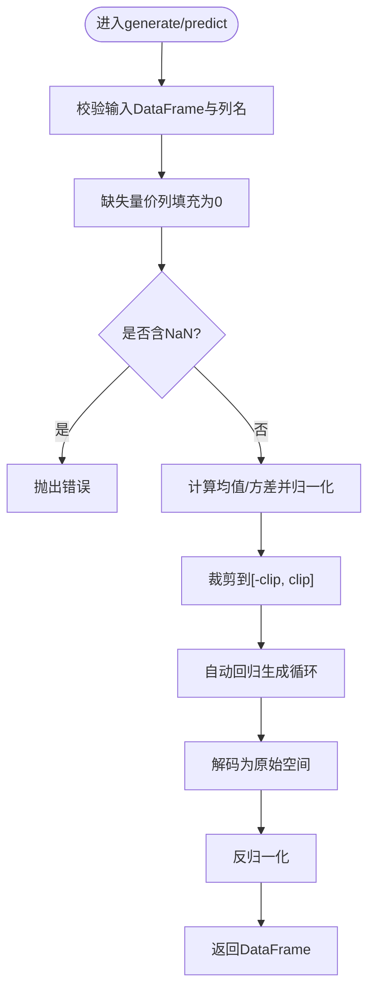
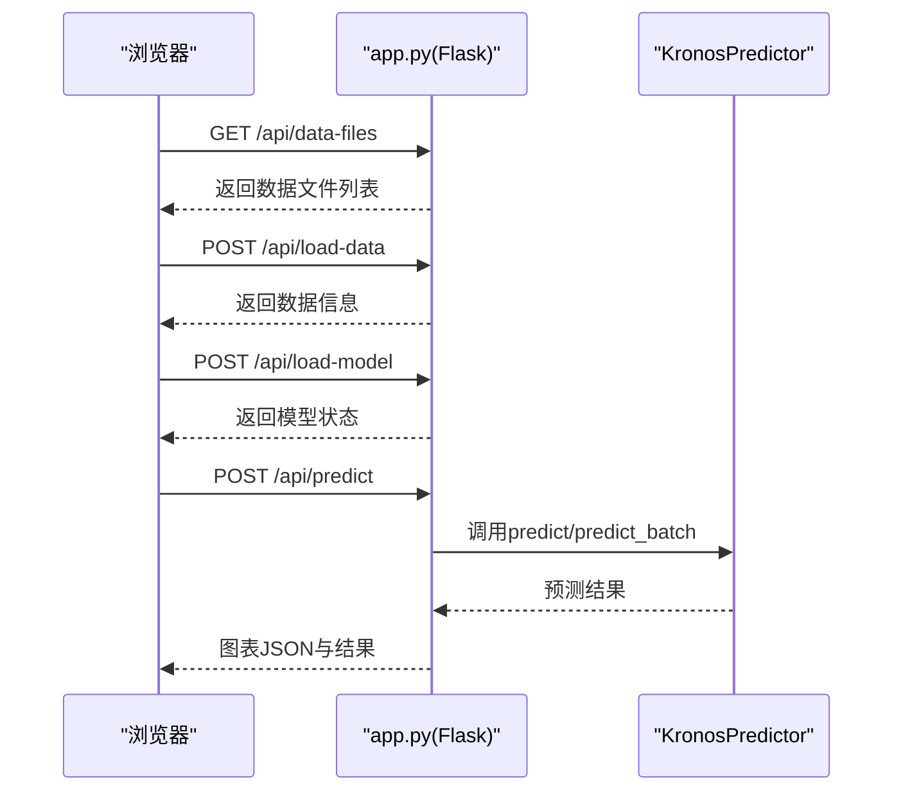
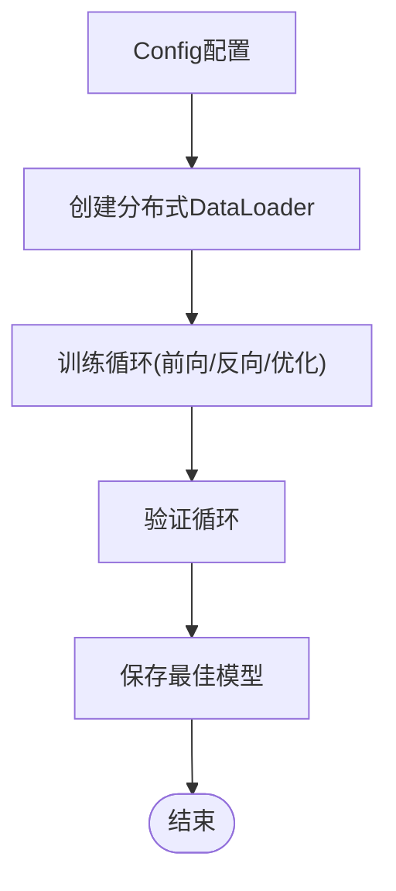
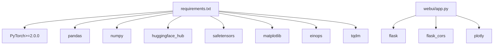

# 故障排除和常见问题

<cite>
**本文档引用的文件**
- [README.md](file://README.md)
- [requirements.txt](file://requirements.txt)
- [model/kronos.py](file://model/kronos.py)
- [webui/app.py](file://webui/app.py)
- [webui/README.md](file://webui/README.md)
- [webui/run.py](file://webui/run.py)
- [examples/prediction_example.py](file://examples/prediction_example.py)
- [examples/prediction_batch_example.py](file://examples/prediction_batch_example.py)
- [finetune/config.py](file://finetune/config.py)
- [finetune/train_tokenizer.py](file://finetune/train_tokenizer.py)
- [finetune/utils/training_utils.py](file://finetune/utils/training_utils.py)
- [finetune_csv/configs/config_ali09988_candle-5min.yaml](file://finetune_csv/configs/config_ali09988_candle-5min.yaml)
- [tests/test_kronos_regression.py](file://tests/test_kronos_regression.py)
</cite>

## 目录
1. [简介](#简介)
2. [项目结构](#项目结构)
3. [核心组件](#核心组件)
4. [架构总览](#架构总览)
5. [详细组件分析](#详细组件分析)
6. [依赖关系分析](#依赖关系分析)
7. [性能考虑](#性能考虑)
8. [故障排除指南](#故障排除指南)
9. [结论](#结论)
10. [附录](#附录)

## 简介
本故障排除和常见问题解答文档面向Kronos金融预测模型的使用者与维护者，覆盖安装、配置、使用过程中的典型问题与解决方案。内容按问题类型分类：环境配置问题、数据格式问题、模型加载问题、预测结果异常、性能优化与调试方法，并提供系统性的诊断流程与社区支持渠道。

## 项目结构
Kronos项目采用模块化组织，主要目录与职责如下：
- model：核心模型实现（Kronos、KronosTokenizer、KronosPredictor）
- examples：示例脚本（单序列与批量预测）
- webui：Web界面（Flask后端、前端模板、图表展示）
- finetune：基于Qlib的微调流水线（配置、数据集、训练器、工具）
- finetune_csv：CSV数据微调配置模板
- tests：回归测试与基准验证
- requirements.txt：运行依赖清单

**图表来源**
- [model/kronos.py:180-663](file://model/kronos.py#L180-L663)
- [webui/app.py:1-709](file://webui/app.py#L1-L709)
- [webui/run.py:1-90](file://webui/run.py#L1-L90)
- [examples/prediction_example.py:1-81](file://examples/prediction_example.py#L1-L81)
- [examples/prediction_batch_example.py:1-73](file://examples/prediction_batch_example.py#L1-L73)
- [finetune/config.py:1-132](file://finetune/config.py#L1-L132)
- [finetune/train_tokenizer.py:1-282](file://finetune/train_tokenizer.py#L1-L282)
- [finetune/utils/training_utils.py:1-119](file://finetune/utils/training_utils.py#L1-L119)
- [finetune_csv/configs/config_ali09988_candle-5min.yaml:1-73](file://finetune_csv/configs/config_ali09988_candle-5min.yaml#L1-L73)
- [tests/test_kronos_regression.py:1-141](file://tests/test_kronos_regression.py#L1-L141)
- [requirements.txt:1-11](file://requirements.txt#L1-L11)
- [README.md:1-338](file://README.md#L1-L338)

**章节来源**
- [README.md:1-338](file://README.md#L1-L338)
- [requirements.txt:1-11](file://requirements.txt#L1-L11)

## 核心组件
- 模型与分词器：Kronos与KronosTokenizer实现两阶段量化与自回归预测
- 预测器：KronosPredictor封装数据预处理、归一化、采样与反归一化
- Web UI：Flask后端提供模型加载、数据读取、预测执行与可视化
- 微调流水线：配置驱动的数据准备、分词器与预测器的多GPU训练
- 示例脚本：演示单序列与批量预测的完整流程

**章节来源**
- [model/kronos.py:180-663](file://model/kronos.py#L180-L663)
- [webui/app.py:1-709](file://webui/app.py#L1-L709)
- [finetune/config.py:1-132](file://finetune/config.py#L1-L132)
- [finetune/train_tokenizer.py:1-282](file://finetune/train_tokenizer.py#L1-L282)

## 架构总览
Kronos的预测流程从数据输入开始，经过时间特征提取、归一化、自动回归生成，最终输出反归一化的预测值。Web UI通过HTTP接口与后端交互，支持多模型与多设备选择。

**图表来源**
- [model/kronos.py:389-470](file://model/kronos.py#L389-L470)
- [model/kronos.py:482-663](file://model/kronos.py#L482-L663)
- [webui/app.py:404-625](file://webui/app.py#L404-L625)

## 详细组件分析

### 组件A：KronosPredictor与自动回归推理
- 功能要点
  - 输入校验：价格列必须存在，缺失量价列自动填充为0；NaN检测直接报错
  - 归一化：按样本均值与标准差进行标准化，裁剪到[-clip, clip]
  - 自动回归：滑动窗口、上下文长度限制、温度与top-p采样
  - 反归一化：将预测值还原到原始尺度
  - 批量预测：要求所有序列的历史长度与预测长度一致，内部自动归一化与平均

**图表来源**
- [model/kronos.py:519-559](file://model/kronos.py#L519-L559)
- [model/kronos.py:562-661](file://model/kronos.py#L562-L661)
- [model/kronos.py:389-470](file://model/kronos.py#L389-L470)

**章节来源**
- [model/kronos.py:482-663](file://model/kronos.py#L482-L663)

### 组件B：Web UI后端与数据加载
- 功能要点
  - 支持CSV/Feather数据加载，自动识别时间戳列
  - 提供可用模型列表与状态查询
  - 模型加载失败时降级为模拟数据
  - 保存预测结果与对比分析

**图表来源**
- [webui/app.py:335-625](file://webui/app.py#L335-L625)

**章节来源**
- [webui/app.py:1-709](file://webui/app.py#L1-L709)
- [webui/README.md:1-136](file://webui/README.md#L1-L136)

### 组件C：微调流水线与分布式训练
- 功能要点
  - 配置类集中管理路径、超参、时间窗与保存路径
  - 分词器训练：多GPU DDP、梯度累积、学习率调度
  - 训练工具：DDP初始化、随机种子、模型规模统计、时间格式化

**图表来源**
- [finetune/config.py:1-132](file://finetune/config.py#L1-L132)
- [finetune/train_tokenizer.py:32-216](file://finetune/train_tokenizer.py#L32-L216)
- [finetune/utils/training_utils.py:9-119](file://finetune/utils/training_utils.py#L9-L119)

**章节来源**
- [finetune/config.py:1-132](file://finetune/config.py#L1-L132)
- [finetune/train_tokenizer.py:1-282](file://finetune/train_tokenizer.py#L1-L282)
- [finetune/utils/training_utils.py:1-119](file://finetune/utils/training_utils.py#L1-L119)

## 依赖关系分析
- 运行时依赖：PyTorch、pandas、numpy、huggingface_hub、safetensors、matplotlib、einops、tqdm、flask、flask_cors、plotly
- 版本约束：PyTorch≥2.0.0，safetensors、einops、matplotlib等版本固定
- Web UI额外依赖：plotly、flask_cors

**图表来源**
- [requirements.txt:1-11](file://requirements.txt#L1-L11)
- [webui/app.py:1-25](file://webui/app.py#L1-L25)

**章节来源**
- [requirements.txt:1-11](file://requirements.txt#L1-L11)
- [webui/app.py:1-25](file://webui/app.py#L1-L25)

## 性能考虑
- 上下文长度与批大小
  - 小/基础模型最大上下文为512，过长会触发截断；建议根据显存调整批大小
  - 批量预测可显著提升吞吐，但需保证各序列长度一致
- 设备选择
  - CUDA优先，MPS适用于Apple Silicon，CPU兼容性最好
- 采样策略
  - 温度T影响随机性，top_p控制多样性，sample_count增加样本数以提高稳定性
- 微调训练
  - 多GPU DDP、梯度累积、学习率调度可提升收敛效率与稳定性

**章节来源**
- [README.md:89-202](file://README.md#L89-L202)
- [webui/README.md:47-94](file://webui/README.md#L47-L94)
- [finetune/train_tokenizer.py:98-154](file://finetune/train_tokenizer.py#L98-L154)

## 故障排除指南

### 环境配置问题
- 依赖未安装或版本不匹配
  - 症状：ImportError、版本冲突
  - 排查：确认requirements.txt中依赖已安装且版本满足要求
  - 解决：重新安装依赖，确保Python 3.10+与PyTorch≥2.0.0
- 端口占用
  - 症状：Web UI启动失败，提示端口被占用
  - 排查：检查本地7070端口占用情况
  - 解决：修改webui/app.py中的端口或释放占用进程
- 模型下载失败
  - 症状：首次加载模型时网络超时或认证失败
  - 排查：检查网络连接与代理设置
  - 解决：配置离线缓存或使用镜像源；确保Hugging Face凭据正确

**章节来源**
- [requirements.txt:1-11](file://requirements.txt#L1-L11)
- [webui/README.md:111-121](file://webui/README.md#L111-L121)
- [webui/run.py:84-87](file://webui/run.py#L84-L87)

### 数据格式问题
- 缺少必要列
  - 症状：predict报错“缺少价格列”
  - 排查：确认DataFrame包含open、high、low、close列
  - 解决：补齐缺失列或使用示例脚本中的数据准备逻辑
- 时间戳列命名不一致
  - 症状：时间戳解析失败或图表显示异常
  - 排查：支持timestamps、timestamp、date等命名
  - 解决：统一列名或在加载时重命名为统一格式
- 数据类型异常
  - 症状：数值列无法转换为数值类型
  - 排查：检查列是否包含非数值字符
  - 解决：使用pd.to_numeric并设置errors='coerce'，随后删除NaN行
- 数据长度不足
  - 症状：预测时报错“数据长度不足”
  - 排查：确保历史窗口+预测长度满足要求
  - 解决：选择更长的历史区间或减少预测长度

**章节来源**
- [model/kronos.py:519-559](file://model/kronos.py#L519-L559)
- [webui/app.py:78-124](file://webui/app.py#L78-L124)

### 模型加载问题
- 模型库不可用
  - 症状：Web UI提示模型库不可用，使用模拟数据
  - 排查：检查model模块导入是否成功
  - 解决：安装相关依赖或手动指定模型路径
- 模型ID错误
  - 症状：加载模型失败
  - 排查：确认模型ID与版本是否存在
  - 解决：使用README中提供的官方模型ID
- 设备不兼容
  - 症状：CUDA/MPS初始化失败
  - 排查：确认设备驱动与框架版本匹配
  - 解决：切换到CPU或正确的GPU设备

**章节来源**
- [webui/app.py:17-22](file://webui/app.py#L17-L22)
- [webui/app.py:626-663](file://webui/app.py#L626-L663)

### 预测结果异常
- 结果全为0或NaN
  - 症状：预测结果异常
  - 排查：检查输入数据是否全部为NaN或极端值
  - 解决：清理异常值、调整clip阈值或更换数据源
- 结果与实际严重偏离
  - 症状：预测与真实走势差异大
  - 排查：检查时间戳连续性、采样参数、上下文长度
  - 解决：确保时间戳等距、适当降低温度、增大上下文或增加样本数
- 批量预测报错
  - 症状：不同序列长度不一致导致维度错误
  - 排查：确认所有序列的历史长度与预测长度一致
  - 解决：对齐序列长度或拆分为多个批次

**章节来源**
- [model/kronos.py:562-661](file://model/kronos.py#L562-L661)

### 性能与优化建议
- 内存使用优化
  - 使用较小的上下文长度与批大小，避免显存溢出
  - 在CPU上运行时减少sample_count与top_p范围
- GPU利用率提升
  - 启用CUDA并使用合适的批大小与学习率
  - 对于微调，使用多GPU DDP与梯度累积
- 批处理大小调整
  - 基于显存上限动态调整batch_size与sample_count
  - 批量预测时确保序列长度一致以最大化并行度

**章节来源**
- [README.md:89-202](file://README.md#L89-L202)
- [webui/README.md:47-94](file://webui/README.md#L47-L94)
- [finetune/train_tokenizer.py:98-154](file://finetune/train_tokenizer.py#L98-L154)

### 日志分析与调试方法
- 控制台日志
  - Web UI启动与模型状态会在控制台打印，便于快速定位问题
- 错误堆栈
  - 捕获并记录异常信息，结合具体报错定位到相应函数
- 回归测试
  - 使用tests/test_kronos_regression.py验证预测一致性，辅助定位模型行为异常

**章节来源**
- [webui/app.py:673-699](file://webui/app.py#L673-L699)
- [tests/test_kronos_regression.py:1-141](file://tests/test_kronos_regression.py#L1-L141)

### 社区支持与问题反馈
- 官方文档与示例
  - 参考README与examples中的使用步骤
- GitHub Issues
  - 在项目仓库提交Issue，附带最小可复现步骤与环境信息
- Web UI支持入口
  - 查看webui/README.md中的支持与联系方式

**章节来源**
- [README.md:1-338](file://README.md#L1-L338)
- [webui/README.md:130-136](file://webui/README.md#L130-L136)

## 结论
本指南提供了从环境配置到模型使用、从数据准备到性能优化的系统性故障排除方案。建议在部署与生产环境中遵循以下原则：
- 明确数据格式与时间戳规范
- 合理设置上下文长度与采样参数
- 使用批量预测提升吞吐并保持序列长度一致
- 利用回归测试与日志定位问题
- 通过社区渠道及时反馈与获取支持

## 附录
- 快速检查清单
  - 依赖安装完成且版本匹配
  - 数据列齐全、类型正确、无NaN
  - 上下文长度不超过模型限制
  - 设备可用且驱动正常
  - Web UI端口未被占用
  - 模型ID与版本正确