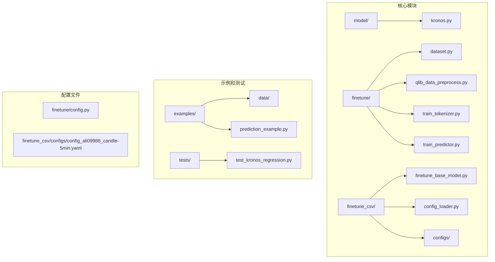
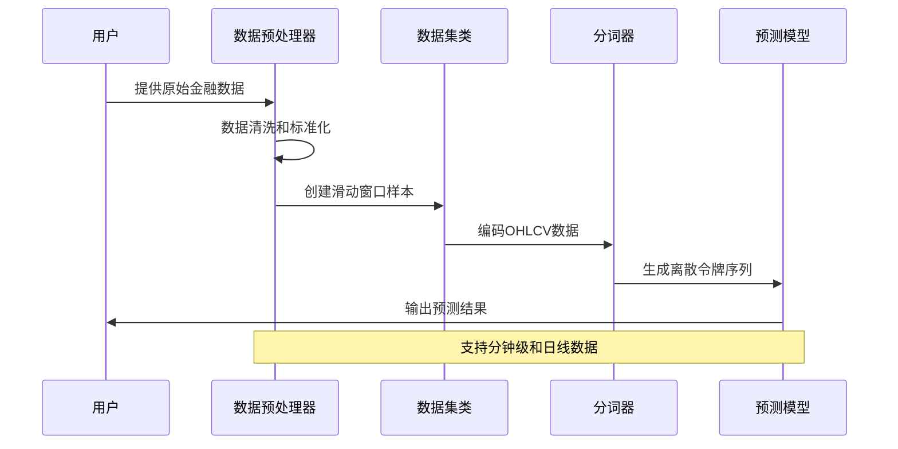
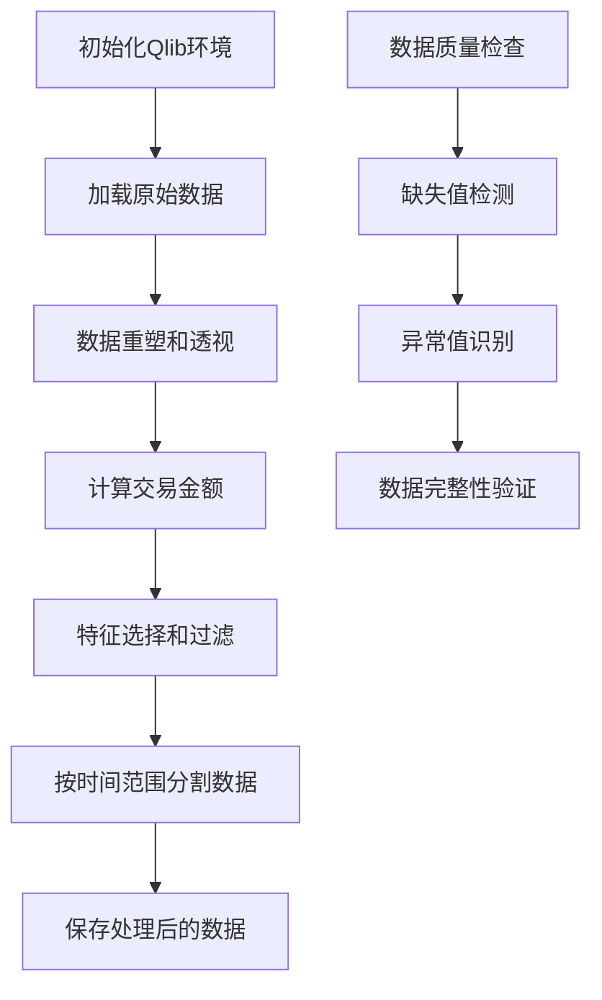
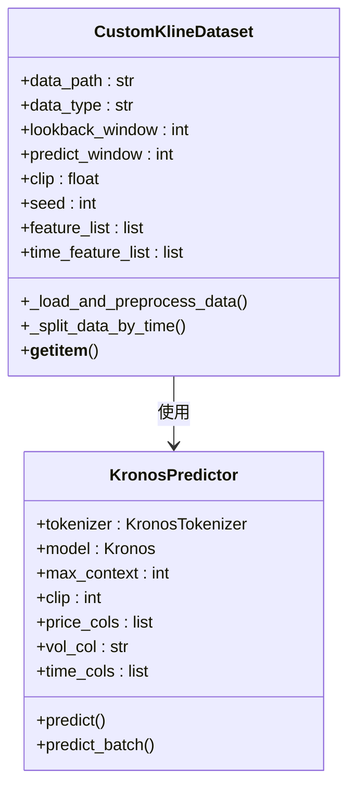
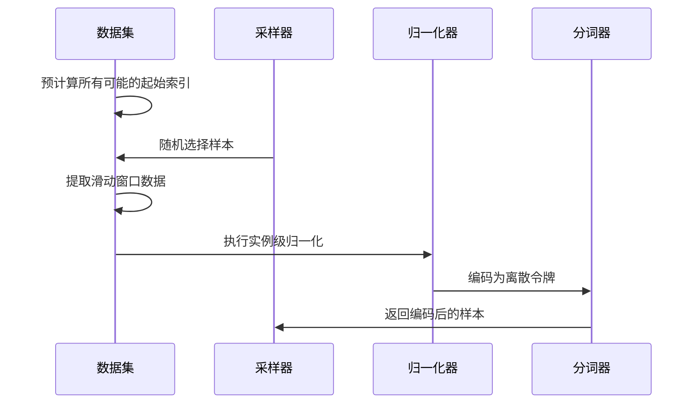
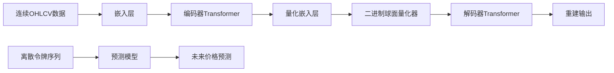
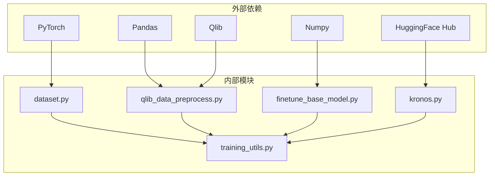

# 数据处理和预处理

<cite>
**本文档引用的文件**
- [finetune/dataset.py](file://finetune/dataset.py)
- [finetune/qlib_data_preprocess.py](file://finetune/qlib_data_preprocess.py)
- [finetune_csv/finetune_base_model.py](file://finetune_csv/finetune_base_model.py)
- [model/kronos.py](file://model/kronos.py)
- [examples/data/XSHG_5min_600977.csv](file://examples/data/XSHG_5min_600977.csv)
- [finetune/config.py](file://finetune/config.py)
- [finetune_csv/config_loader.py](file://finetune_csv/config_loader.py)
- [finetune/train_predictor.py](file://finetune/train_predictor.py)
- [finetune/train_tokenizer.py](file://finetune/train_tokenizer.py)
- [finetune/utils/training_utils.py](file://finetune/utils/training_utils.py)
- [examples/prediction_example.py](file://examples/prediction_example.py)
- [finetune_csv/configs/config_ali09988_candle-5min.yaml](file://finetune_csv/configs/config_ali09988_candle-5min.yaml)
</cite>

## 目录
1. [简介](#简介)
2. [项目结构](#项目结构)
3. [核心组件](#核心组件)
4. [架构概览](#架构概览)
5. [详细组件分析](#详细组件分析)
6. [依赖关系分析](#依赖关系分析)
7. [性能考虑](#性能考虑)
8. [故障排除指南](#故障排除指南)
9. [结论](#结论)

## 简介

Kronos是一个专为金融K线数据设计的基础模型，采用两阶段框架：首先通过专门的量化器将连续的多维K线数据（OHLCV）量化为分层离散令牌，然后在这些令牌上进行预训练，以实现统一的预测任务建模。本文档深入分析Kronos的数据处理和预处理流程，涵盖金融时间序列数据的特点和挑战，包括高频数据的噪声特性、缺失值处理和异常值检测。

## 项目结构

Kronos项目采用模块化设计，主要包含以下核心目录：

**图表来源**
- [finetune/dataset.py:1-146](file://finetune/dataset.py#L1-L146)
- [model/kronos.py:1-663](file://model/kronos.py#L1-L663)

**章节来源**
- [finetune/dataset.py:1-146](file://finetune/dataset.py#L1-L146)
- [model/kronos.py:1-663](file://model/kronos.py#L1-L663)

## 核心组件

### 数据预处理管道

Kronos提供了两种主要的数据预处理路径：

1. **Qlib数据预处理**：适用于从Qlib数据库加载的标准化金融数据
2. **CSV数据预处理**：适用于自定义CSV格式的金融数据

### 时间序列数据特点

金融时间序列数据具有以下显著特征：
- **高频噪声**：分钟级和日线数据存在大量随机波动
- **非平稳性**：统计特性随时间变化
- **跳跃性**：重大事件导致价格跳跃
- **厚尾分布**：收益率分布具有尖峰厚尾特征
- **异方差性**：波动率随时间变化

**章节来源**
- [finetune/qlib_data_preprocess.py:1-131](file://finetune/qlib_data_preprocess.py#L1-L131)
- [finetune_csv/finetune_base_model.py:1-469](file://finetune_csv/finetune_base_model.py#L1-L469)

## 架构概览

**图表来源**
- [finetune/qlib_data_preprocess.py:85-121](file://finetune/qlib_data_preprocess.py#L85-L121)
- [model/kronos.py:13-178](file://model/kronos.py#L13-L178)

## 详细组件分析

### Qlib数据预处理器

Qlib数据预处理器负责从Qlib数据库中加载和处理金融数据：

**图表来源**
- [finetune/qlib_data_preprocess.py:30-84](file://finetune/qlib_data_preprocess.py#L30-L84)

#### 关键功能特性

1. **时间窗口调整**：自动扩展时间范围以包含回看窗口和预测窗口
2. **数据完整性检查**：过滤掉数据不足的股票
3. **特征工程**：计算交易金额等衍生特征
4. **数据分割**：支持训练、验证和测试集的自动划分

**章节来源**
- [finetune/qlib_data_preprocess.py:14-131](file://finetune/qlib_data_preprocess.py#L14-L131)

### CSV数据预处理器

CSV数据预处理器专门处理自定义格式的金融数据：

**图表来源**
- [finetune_csv/finetune_base_model.py:25-132](file://finetune_csv/finetune_base_model.py#L25-L132)
- [model/kronos.py:482-662](file://model/kronos.py#L482-L662)

#### 数据预处理流程

1. **时间戳处理**：将字符串时间戳转换为datetime对象并排序
2. **时间特征提取**：生成分钟、小时、星期几、日期、月份等特征
3. **缺失值处理**：使用前向填充处理缺失数据
4. **数据分割**：按时间顺序分割训练、验证和测试集

**章节来源**
- [finetune_csv/finetune_base_model.py:52-98](file://finetune_csv/finetune_base_model.py#L52-L98)

### 数据集类实现

数据集类实现了高效的滑动窗口采样机制：

**图表来源**
- [finetune/dataset.py:50-130](file://finetune/dataset.py#L50-L130)

#### 滑动窗口机制

1. **索引预计算**：预先计算所有可能的样本起始位置
2. **随机采样**：每批次从所有可用样本中随机采样
3. **动态窗口大小**：根据配置的回看窗口和预测窗口确定窗口长度
4. **内存优化**：只保留必要的列以节省内存空间

**章节来源**
- [finetune/dataset.py:9-146](file://finetune/dataset.py#L9-L146)

### 分词器和模型集成

Kronos的分词器采用混合量化方法，将连续的OHLCV数据量化为离散令牌：

**图表来源**
- [model/kronos.py:74-113](file://model/kronos.py#L74-L113)

#### 量化策略

1. **分层量化**：使用两个不同的位数级别进行量化
2. **混合精度**：结合高精度和低精度量化以平衡性能
3. **自适应量化**：根据数据分布动态调整量化参数

**章节来源**
- [model/kronos.py:13-178](file://model/kronos.py#L13-L178)

## 依赖关系分析

**图表来源**
- [finetune/dataset.py:1-8](file://finetune/dataset.py#L1-L8)
- [model/kronos.py:1-10](file://model/kronos.py#L1-L10)

**章节来源**
- [finetune/utils/training_utils.py:1-119](file://finetune/utils/training_utils.py#L1-L119)

## 性能考虑

### 内存管理策略

1. **增量处理**：使用滑动窗口避免一次性加载整个数据集
2. **特征选择**：只保留必要的特征列以减少内存占用
3. **数据类型优化**：使用float32减少内存使用
4. **批量处理**：通过批处理提高内存利用率

### 训练效率优化

1. **分布式训练**：支持多GPU并行训练
2. **梯度累积**：模拟更大的批次大小
3. **学习率调度**：使用OneCycleLR优化学习率
4. **梯度裁剪**：防止梯度爆炸问题

### 数据处理优化

1. **预计算索引**：避免运行时重复计算
2. **缓存机制**：缓存常用的中间结果
3. **并行处理**：利用多核CPU进行数据处理
4. **内存映射**：对于超大数据集使用内存映射文件

## 故障排除指南

### 常见问题及解决方案

#### 数据加载问题

1. **Qlib连接失败**
   - 检查`qlib_data_path`配置是否正确
   - 确认Qlib数据目录存在且可访问
   - 验证网络连接和权限设置

2. **CSV文件格式错误**
   - 确保CSV文件包含必需的列：timestamps, open, high, low, close, volume, amount
   - 检查时间戳格式是否为标准格式
   - 验证数值列是否包含有效数字

#### 训练过程问题

1. **内存不足**
   - 减少`batch_size`或`lookback_window`
   - 使用更小的模型变体
   - 启用梯度累积

2. **训练不收敛**
   - 调整学习率参数
   - 检查数据预处理是否正确
   - 验证损失函数设置

#### 预测结果问题

1. **预测质量差**
   - 检查输入数据的时间范围是否合理
   - 调整采样参数（temperature, top_p）
   - 验证模型权重是否正确加载

**章节来源**
- [finetune/config.py:1-132](file://finetune/config.py#L1-L132)
- [finetune_csv/config_loader.py:1-268](file://finetune_csv/config_loader.py#L1-L268)

## 结论

Kronos的数据处理和预处理系统为金融时间序列预测提供了完整的解决方案。通过两阶段的量化框架，系统能够有效处理金融数据的高噪声特性和复杂的统计特性。关键优势包括：

1. **灵活的数据源支持**：同时支持Qlib和CSV格式的数据
2. **高效的内存管理**：通过滑动窗口和增量处理优化内存使用
3. **强大的预处理能力**：自动处理缺失值、异常值和数据标准化
4. **可扩展的架构**：支持分布式训练和推理
5. **完善的配置管理**：提供详细的参数配置和实验管理

该系统为金融时间序列预测任务提供了坚实的技术基础，能够适应不同频率和规模的金融数据处理需求。