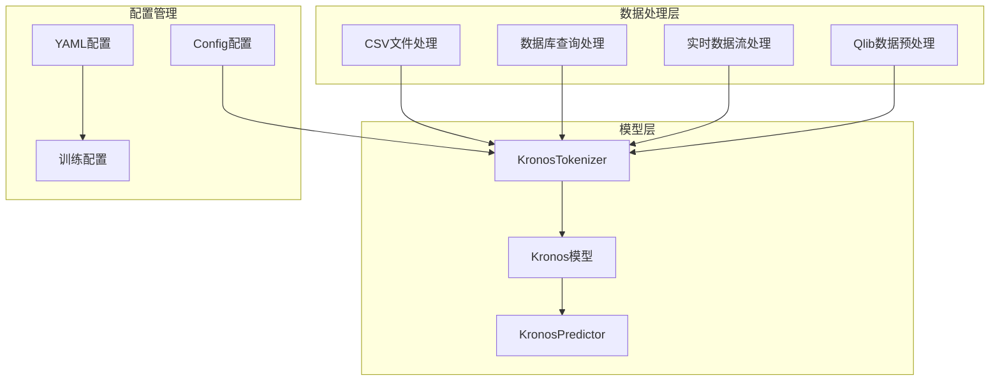
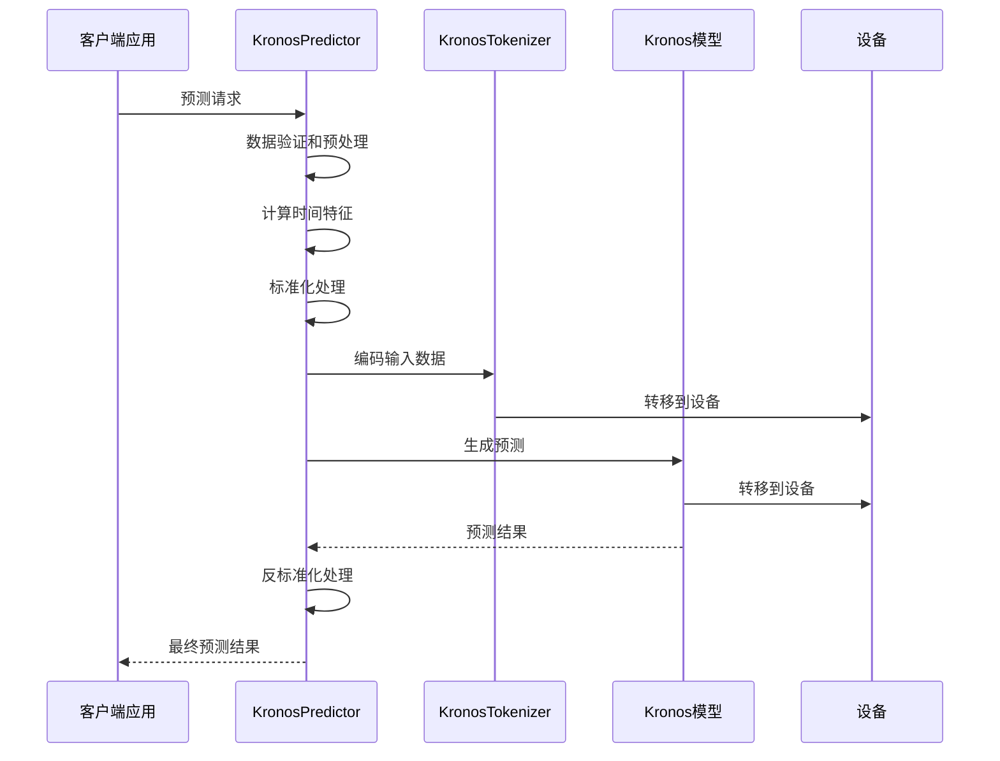
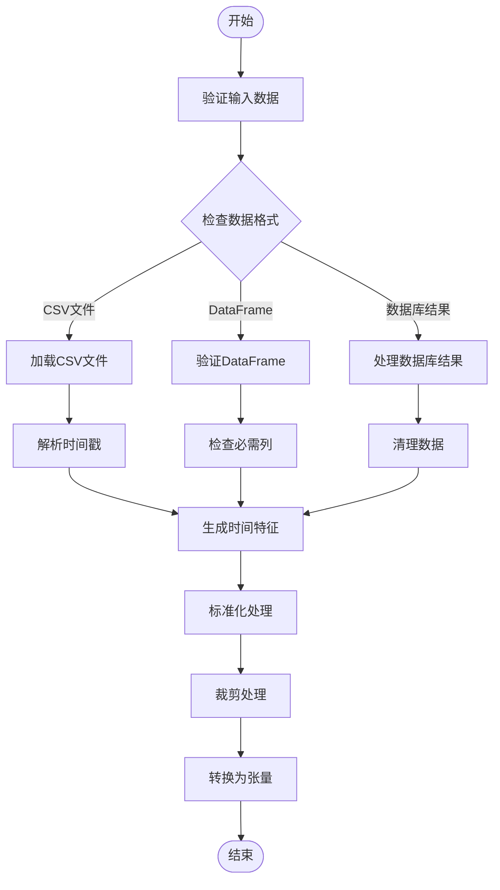
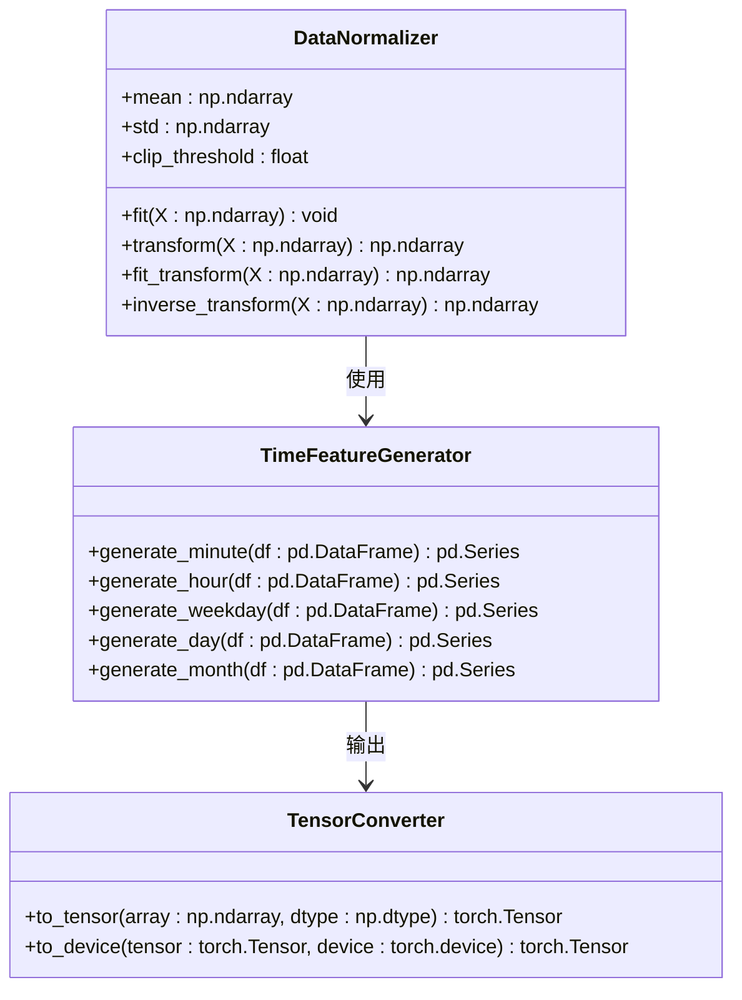
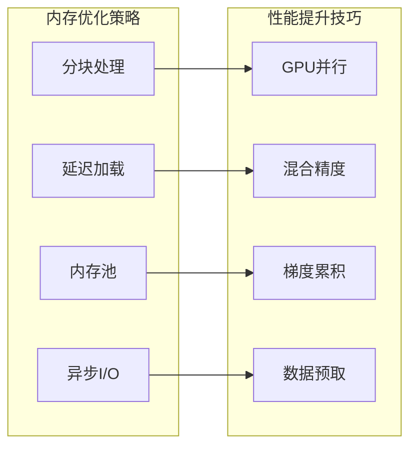
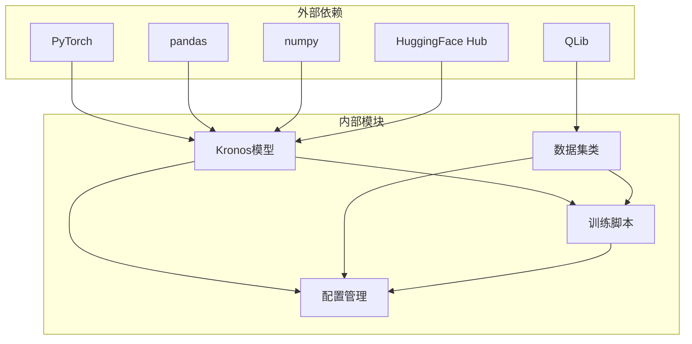

# 数据格式转换和标准化

<cite>
**本文档引用的文件**
- [kronos.py](file://model/kronos.py)
- [dataset.py](file://finetune/dataset.py)
- [qlib_data_preprocess.py](file://finetune/qlib_data_preprocess.py)
- [config.py](file://finetune/config.py)
- [prediction_example.py](file://examples/prediction_example.py)
- [XSHG_5min_600977.csv](file://examples/data/XSHG_5min_600977.csv)
- [finetune_base_model.py](file://finetune_csv/finetune_base_model.py)
- [config_ali09988_candle-5min.yaml](file://finetune_csv/configs/config_ali09988_candle-5min.yaml)
- [train_sequential.py](file://finetune_csv/train_sequential.py)
- [test_kronos_regression.py](file://tests/test_kronos_regression.py)
</cite>

## 目录
1. [引言](#引言)
2. [项目结构](#项目结构)
3. [核心组件](#核心组件)
4. [架构概览](#架构概览)
5. [详细组件分析](#详细组件分析)
6. [依赖关系分析](#依赖关系分析)
7. [性能考虑](#性能考虑)
8. [故障排除指南](#故障排除指南)
9. [结论](#结论)
10. [附录](#附录)

## 引言

Kronos 是一个专为金融K线序列设计的基础模型，采用独特的两阶段框架：首先通过专门的分词器将连续的多维K线数据量化为层次化的离散标记，然后在这些标记上进行预训练，使其能够服务于多样化的量化任务。

本技术文档专注于Kronos的数据格式转换和标准化机制，详细解释从输入数据到PyTorch张量的转换流程，深入分析数据标准化的实现机制，以及不同数据源的适配方法。

## 项目结构

项目采用模块化设计，主要包含以下核心模块：



**图表来源**
- [kronos.py:13-662](file://model/kronos.py#L13-L662)
- [dataset.py:9-146](file://finetune/dataset.py#L9-L146)
- [config.py:3-132](file://finetune/config.py#L3-L132)

**章节来源**
- [README.md:1-338](file://README.md#L1-L338)
- [kronos.py:1-663](file://model/kronos.py#L1-L663)
- [dataset.py:1-146](file://finetune/dataset.py#L1-L146)

## 核心组件

### 数据标准化机制

Kronos实现了多层次的数据标准化机制：

1. **实例级标准化**：对每个样本的特征进行均值方差标准化
2. **时间特征生成**：从时间戳中提取分钟、小时、星期、日期、月份等特征
3. **裁剪处理**：防止异常值影响模型训练
4. **张量转换**：将NumPy数组转换为PyTorch张量

### 输入数据格式要求

系统支持多种输入格式：

- **CSV文件**：标准的K线数据格式，包含时间戳和OHLCV列
- **数据库查询结果**：支持pandas DataFrame格式
- **实时数据流**：支持动态数据更新

**章节来源**
- [kronos.py:519-661](file://model/kronos.py#L519-L661)
- [dataset.py:117-130](file://finetune/dataset.py#L117-L130)
- [finetune_base_model.py:107-132](file://finetune_csv/finetune_base_model.py#L107-L132)

## 架构概览



**图表来源**
- [kronos.py:482-560](file://model/kronos.py#L482-L560)
- [kronos.py:389-470](file://model/kronos.py#L389-L470)

## 详细组件分析

### 数据预处理管道



**图表来源**
- [kronos.py:519-559](file://model/kronos.py#L519-L559)
- [finetune_base_model.py:52-74](file://finetune_csv/finetune_base_model.py#L52-L74)

#### CSV文件处理流程

CSV文件处理是Kronos最常用的数据输入方式：

1. **数据加载**：使用pandas读取CSV文件
2. **时间戳解析**：将字符串格式的时间戳转换为datetime对象
3. **特征生成**：从时间戳中提取分钟、小时、星期等特征
4. **数据验证**：检查必需的OHLC列是否存在

**章节来源**
- [prediction_example.py:49-79](file://examples/prediction_example.py#L49-L79)
- [XSHG_5min_600977.csv:1-800](file://examples/data/XSHG_5min_600977.csv#L1-L800)

#### 数据库查询结果处理

对于数据库查询结果，系统提供了灵活的处理机制：

1. **DataFrame格式**：直接接受pandas DataFrame作为输入
2. **列映射**：自动识别和映射必需的列名
3. **缺失值处理**：对缺失的成交量和成交额进行填充

**章节来源**
- [kronos.py:519-536](file://model/kronos.py#L519-L536)

#### 实时数据流适配

实时数据流处理需要考虑以下因素：

1. **增量更新**：支持新数据的增量添加
2. **缓冲区管理**：维护固定长度的历史窗口
3. **实时标准化**：基于历史统计信息进行实时标准化

### 标准化算法实现



**图表来源**
- [kronos.py:544-547](file://model/kronos.py#L544-L547)
- [dataset.py:121-124](file://finetune/dataset.py#L121-L124)

#### 均值方差标准化

Kronos采用实例级标准化，即对每个样本计算其特征的均值和标准差：

```python
# 计算均值和标准差
x_mean, x_std = np.mean(x, axis=0), np.std(x, axis=0)

# 标准化处理
x = (x - x_mean) / (x_std + 1e-5)

# 裁剪处理
x = np.clip(x, -self.clip, self.clip)
```

这种标准化方式的优势在于：
- 消除不同特征间的量纲差异
- 提高模型训练的稳定性
- 防止异常值的影响

**章节来源**
- [kronos.py:544-547](file://model/kronos.py#L544-L547)
- [dataset.py:121-124](file://finetune/dataset.py#L121-L124)

#### 时间特征工程

系统从时间戳中提取多个时间相关的特征：

| 特征类型 | 特征名称 | 说明 |
|---------|---------|------|
| 时间粒度 | minute | 分钟数（0-59） |
| 时间粒度 | hour | 小时数（0-23） |
| 时间周期 | weekday | 星期几（0-6） |
| 日期特征 | day | 日期（1-31） |
| 月份特征 | month | 月份（1-12） |

这些特征帮助模型捕捉市场的日间、周内和季节性模式。

**章节来源**
- [kronos.py:472-479](file://model/kronos.py#L472-L479)
- [finetune_base_model.py:60-64](file://finetune_csv/finetune_base_model.py#L60-L64)

### 批量数据处理优化



**图表来源**
- [finetune_base_model.py:213-231](file://finetune_csv/finetune_base_model.py#L213-L231)
- [train_sequential.py:30-50](file://finetune_csv/train_sequential.py#L30-L50)

#### 内存优化策略

1. **分块处理**：将大数据集分割成小块进行处理
2. **延迟加载**：只在需要时加载数据到内存
3. **内存池**：重用内存分配减少开销
4. **异步I/O**：使用异步操作提高数据加载效率

#### 性能提升技巧

1. **GPU并行**：利用GPU的并行计算能力
2. **混合精度**：使用半精度浮点数减少内存占用
3. **梯度累积**：模拟更大的批次大小
4. **数据预取**：提前加载下一批次的数据

**章节来源**
- [finetune_base_model.py:213-231](file://finetune_csv/finetune_base_model.py#L213-L231)
- [train_sequential.py:30-50](file://finetune_csv/train_sequential.py#L30-L50)

## 依赖关系分析



**图表来源**
- [kronos.py:1-10](file://model/kronos.py#L1-L10)
- [dataset.py:1-6](file://finetune/dataset.py#L1-L6)
- [config.py:1-3](file://finetune/config.py#L1-L3)

### 外部依赖管理

系统对外部依赖的管理遵循以下原则：

1. **版本兼容性**：确保所有依赖版本的兼容性
2. **最小依赖集**：只引入必要的依赖包
3. **安全更新**：定期更新依赖以修复安全漏洞

### 内部模块耦合

内部模块之间通过清晰的接口进行通信，降低耦合度：

1. **配置驱动**：所有参数通过配置文件管理
2. **接口抽象**：定义清晰的接口规范
3. **错误隔离**：每个模块独立处理自己的错误

**章节来源**
- [kronos.py:1-10](file://model/kronos.py#L1-L10)
- [dataset.py:1-6](file://finetune/dataset.py#L1-L6)
- [config.py:1-3](file://finetune/config.py#L1-L3)

## 性能考虑

### 训练性能优化

1. **分布式训练**：支持多GPU和多节点训练
2. **混合精度训练**：减少显存占用和提高训练速度
3. **梯度累积**：在有限显存下模拟大批次训练

### 推理性能优化

1. **批处理推理**：支持多序列并行推理
2. **缓存机制**：缓存中间结果减少重复计算
3. **模型压缩**：提供轻量级模型选项

### 内存管理

1. **动态内存分配**：根据数据大小动态调整内存
2. **垃圾回收优化**：及时释放不需要的内存
3. **内存映射**：对大文件使用内存映射技术

## 故障排除指南

### 常见问题及解决方案

#### 数据格式错误

**问题**：输入数据格式不正确
**解决方案**：
1. 确保CSV文件包含正确的列名
2. 检查时间戳格式是否正确
3. 验证数值数据的格式

#### 内存不足

**问题**：训练过程中出现内存不足
**解决方案**：
1. 减少批次大小
2. 启用梯度累积
3. 使用混合精度训练
4. 优化数据加载逻辑

#### 模型收敛问题

**问题**：模型训练不收敛或收敛缓慢
**解决方案**：
1. 调整学习率
2. 检查数据标准化是否正确
3. 验证损失函数设置
4. 增加训练轮数

**章节来源**
- [test_kronos_regression.py:45-89](file://tests/test_kronos_regression.py#L45-L89)
- [test_kronos_regression.py:90-141](file://tests/test_kronos_regression.py#L90-L141)

### 调试工具

系统提供了多种调试工具：

1. **日志记录**：详细的训练和推理日志
2. **性能监控**：实时监控训练进度和性能指标
3. **可视化工具**：预测结果的可视化展示
4. **回归测试**：确保模型输出的稳定性

**章节来源**
- [finetune_base_model.py:137-178](file://finetune_csv/finetune_base_model.py#L137-L178)
- [test_kronos_regression.py:1-141](file://tests/test_kronos_regression.py#L1-L141)

## 结论

Kronos的数据格式转换和标准化系统提供了完整的解决方案，涵盖了从原始数据到模型输入的整个流程。系统的主要优势包括：

1. **灵活性**：支持多种数据源和格式
2. **标准化**：提供一致的数据处理流程
3. **性能**：优化的内存管理和计算效率
4. **可扩展性**：模块化的架构设计

通过深入理解这些机制，用户可以更好地适配Kronos到不同的应用场景，并充分利用系统的优化特性。

## 附录

### 配置参数说明

| 参数名称 | 类型 | 默认值 | 说明 |
|---------|------|--------|------|
| clip | float | 5.0 | 裁剪阈值，防止异常值 |
| lookback_window | int | 90 | 历史窗口大小 |
| predict_window | int | 10 | 预测窗口大小 |
| max_context | int | 512 | 最大上下文长度 |
| batch_size | int | 50 | 批次大小 |
| seed | int | 100 | 随机种子 |

### 支持的数据格式

1. **CSV文件**：标准K线数据格式
2. **pandas DataFrame**：结构化数据格式
3. **数据库查询结果**：SQL查询返回的数据
4. **实时数据流**：动态更新的数据流

### 性能基准

系统在不同硬件配置下的性能表现：

- **单GPU训练**：支持大规模数据集训练
- **多GPU分布式**：加速训练过程
- **CPU推理**：支持离线推理场景
- **移动端部署**：提供轻量级模型选项