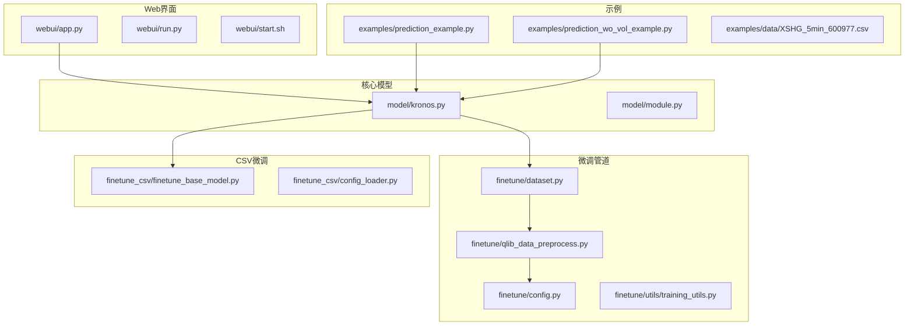
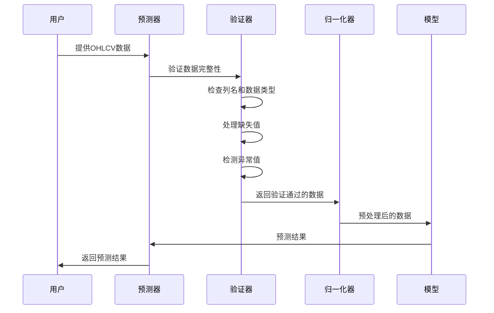
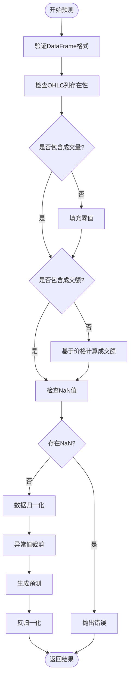
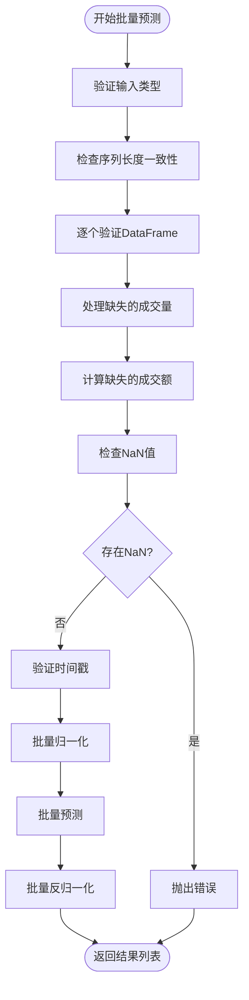
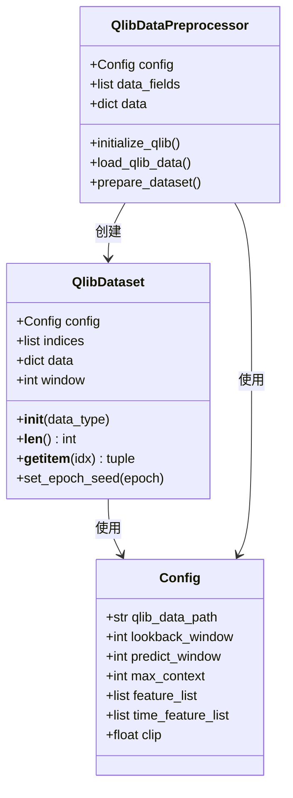
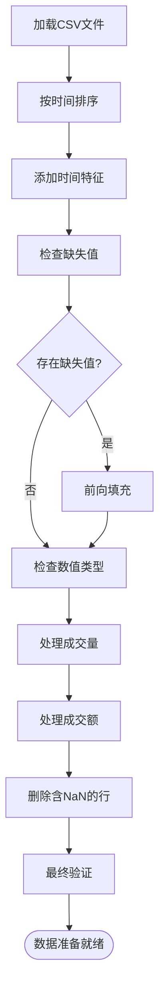
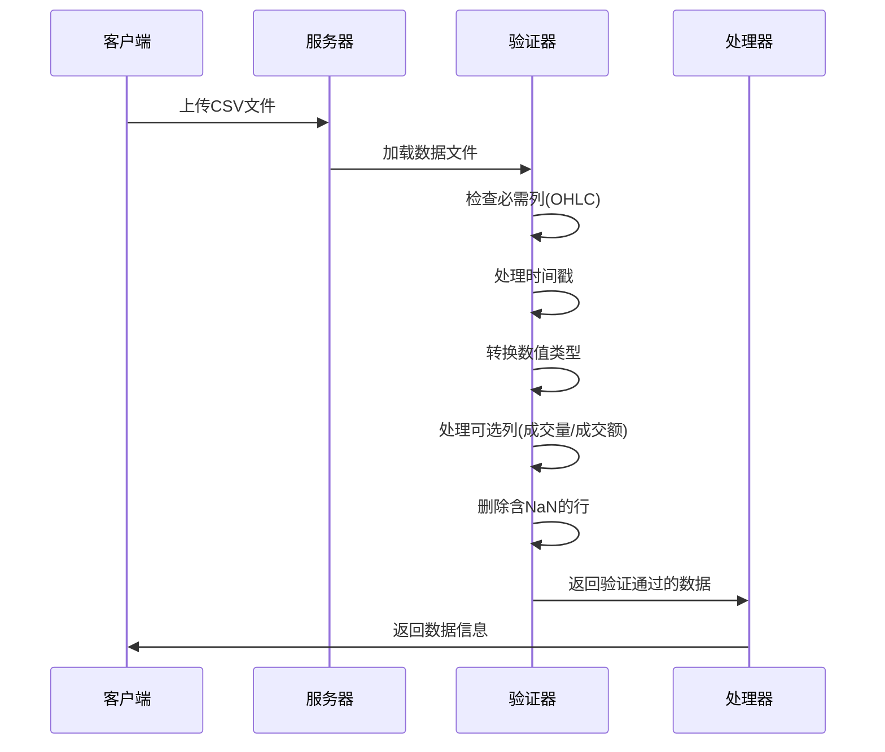
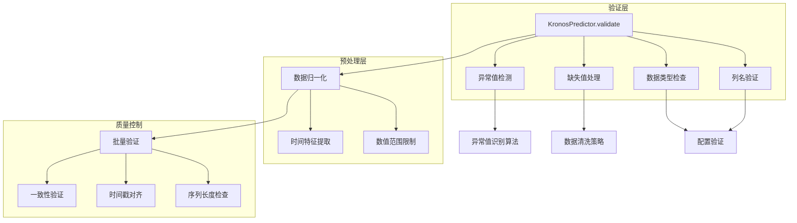
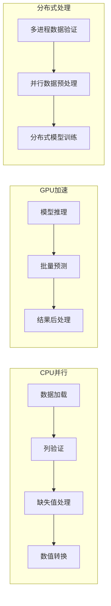

# 数据验证和质量检查

<cite>
**本文档引用的文件**
- [README.md](file://README.md)
- [model/kronos.py](file://model/kronos.py)
- [finetune/dataset.py](file://finetune/dataset.py)
- [finetune/qlib_data_preprocess.py](file://finetune/qlib_data_preprocess.py)
- [finetune/config.py](file://finetune/config.py)
- [webui/app.py](file://webui/app.py)
- [examples/prediction_example.py](file://examples/prediction_example.py)
- [examples/prediction_wo_vol_example.py](file://examples/prediction_wo_vol_example.py)
- [finetune_csv/finetune_base_model.py](file://finetune_csv/finetune_base_model.py)
</cite>

## 目录
1. [简介](#简介)
2. [项目结构](#项目结构)
3. [核心组件](#核心组件)
4. [架构概览](#架构概览)
5. [详细组件分析](#详细组件分析)
6. [依赖关系分析](#依赖关系分析)
7. [性能考虑](#性能考虑)
8. [故障排除指南](#故障排除指南)
9. [结论](#结论)
10. [附录](#附录)

## 简介

Kronos是一个专为金融市场K线序列设计的基础模型，采用两阶段框架：首先使用专门的分词器将连续的多维K线数据量化为层次化的离散令牌，然后在这些令牌上预训练大型自回归Transformer，使其能够服务于多样化的量化任务。

本文件专注于Kronos的数据验证和质量检查机制，深入解释金融时间序列数据的质量要求和验证规则，包括OHLCV数据的完整性检查、缺失值处理策略和异常值检测方法。

## 项目结构

Kronos项目采用模块化设计，主要包含以下核心目录：



**图表来源**
- [model/kronos.py:1-663](file://model/kronos.py#L1-663)
- [finetune/dataset.py:1-146](file://finetune/dataset.py#L1-146)
- [webui/app.py:1-709](file://webui/app.py#L1-709)

**章节来源**
- [README.md:1-338](file://README.md#L1-L338)
- [model/kronos.py:1-663](file://model/kronos.py#L1-L663)

## 核心组件

### 数据验证机制概述

Kronos在多个层面实现了数据验证和质量检查：

1. **输入数据完整性检查**
   - 列名验证（OHLCV必需列）
   - 数据类型检查
   - 数值范围限制
   - NaN值处理

2. **批量数据验证**
   - 多时间序列一致性检查
   - 时间戳对齐验证
   - 序列长度标准化

3. **训练数据质量控制**
   - 缺失值处理策略
   - 异常值检测
   - 数据分布标准化

**章节来源**
- [model/kronos.py:519-661](file://model/kronos.py#L519-L661)
- [finetune/dataset.py:92-130](file://finetune/dataset.py#L92-L130)

## 架构概览



**图表来源**
- [model/kronos.py:519-559](file://model/kronos.py#L519-L559)
- [model/kronos.py:562-661](file://model/kronos.py#L562-L661)

## 详细组件分析

### 预测器数据验证流程

#### 单序列预测验证



**图表来源**
- [model/kronos.py:519-559](file://model/kronos.py#L519-L559)

#### 批量预测验证



**图表来源**
- [model/kronos.py:562-661](file://model/kronos.py#L562-L661)

**章节来源**
- [model/kronos.py:519-661](file://model/kronos.py#L519-L661)

### 数据预处理和质量控制

#### 训练数据集验证



**图表来源**
- [finetune/dataset.py:9-131](file://finetune/dataset.py#L9-L131)
- [finetune/qlib_data_preprocess.py:14-130](file://finetune/qlib_data_preprocess.py#L14-L130)
- [finetune/config.py:3-132](file://finetune/config.py#L3-L132)

#### CSV数据质量检查



**图表来源**
- [finetune_csv/finetune_base_model.py:52-73](file://finetune_csv/finetune_base_model.py#L52-L73)

**章节来源**
- [finetune/dataset.py:9-131](file://finetune/dataset.py#L9-L131)
- [finetune/qlib_data_preprocess.py:14-130](file://finetune/qlib_data_preprocess.py#L14-L130)
- [finetune_csv/finetune_base_model.py:52-73](file://finetune_csv/finetune_base_model.py#L52-L73)

### Web界面数据验证

#### 文件上传和验证流程



**图表来源**
- [webui/app.py:78-124](file://webui/app.py#L78-L124)

**章节来源**
- [webui/app.py:78-124](file://webui/app.py#L78-L124)

## 依赖关系分析

### 数据验证组件间的依赖



**图表来源**
- [model/kronos.py:519-661](file://model/kronos.py#L519-L661)
- [finetune/dataset.py:92-130](file://finetune/dataset.py#L92-L130)

**章节来源**
- [model/kronos.py:519-661](file://model/kronos.py#L519-L661)
- [finetune/dataset.py:92-130](file://finetune/dataset.py#L92-L130)

## 性能考虑

### 数据验证性能优化

1. **向量化操作**
   - 使用pandas内置函数进行批量验证
   - NumPy数组操作减少Python循环开销

2. **内存管理**
   - 分批处理大数据集
   - 及时释放中间变量

3. **缓存策略**
   - 预计算常用统计量
   - 缓存验证结果避免重复计算

### 并行处理



## 故障排除指南

### 常见数据质量问题诊断

#### 列名不匹配问题

**症状**: `ValueError: Price columns ['open', 'high', 'low', 'close'] not found in DataFrame`

**诊断步骤**:
1. 检查DataFrame列名是否正确
2. 验证列名大小写
3. 确认特殊字符处理

**解决方案**:
```python
# 确保正确的列名
required_columns = ['open', 'high', 'low', 'close']
if not all(col in df.columns for col in required_columns):
    # 重命名列或重新加载数据
    df = df.rename(columns={'Open': 'open', 'High': 'high', 'Low': 'low', 'Close': 'close'})
```

#### 缺失值问题

**症状**: `ValueError: Input DataFrame contains NaN values in price or volume columns`

**诊断方法**:
1. 检查数据源完整性
2. 分析缺失模式
3. 识别缺失值分布

**处理策略**:
```python
# 方法1: 删除含NaN的行
df_clean = df.dropna()

# 方法2: 前向填充
df_filled = df.fillna(method='ffill')

# 方法3: 插值填充
df_interpolated = df.interpolate()
```

#### 数据类型问题

**症状**: `TypeError: unsupported operand type(s)`

**诊断**: 检查数值列的数据类型

**解决方案**:
```python
# 确保数值列是float32
numeric_columns = ['open', 'high', 'low', 'close', 'volume', 'amount']
for col in numeric_columns:
    if col in df.columns:
        df[col] = pd.to_numeric(df[col], errors='coerce')
```

#### 异常值检测

**检测方法**:
```python
def detect_outliers(df, columns, threshold=3):
    """使用Z-score检测异常值"""
    outliers = {}
    for col in columns:
        if col in df.columns:
            z_scores = np.abs((df[col] - df[col].mean()) / df[col].std())
            outliers[col] = df[z_scores > threshold]
    return outliers

def detect_outliers_iqr(df, columns):
    """使用四分位数范围检测异常值"""
    outliers = {}
    for col in columns:
        if col in df.columns:
            Q1 = df[col].quantile(0.25)
            Q3 = df[col].quantile(0.75)
            IQR = Q3 - Q1
            lower_bound = Q1 - 1.5 * IQR
            upper_bound = Q3 + 1.5 * IQR
            outliers[col] = df[(df[col] < lower_bound) | (df[col] > upper_bound)]
    return outliers
```

### 预测器错误处理

#### 批量预测错误

**常见错误类型**:
1. `ValueError: df_list, x_timestamp_list, y_timestamp_list must have consistent lengths`
2. `ValueError: Parallel prediction requires all series to have consistent historical lengths`

**诊断和修复**:
```python
# 确保所有序列具有相同的长度
if len(set([len(df) for df in df_list])) != 1:
    # 对短序列进行填充或截断
    max_len = max([len(df) for df in df_list])
    for i, df in enumerate(df_list):
        if len(df) < max_len:
            # 填充逻辑
            pass
        elif len(df) > max_len:
            # 截断逻辑
            df_list[i] = df[:max_len]
```

**章节来源**
- [model/kronos.py:519-661](file://model/kronos.py#L519-L661)
- [webui/app.py:108-123](file://webui/app.py#L108-L123)

## 结论

Kronos的数据验证和质量检查机制体现了金融时间序列数据处理的最佳实践。通过多层次的验证策略，包括输入完整性检查、批量数据一致性验证、训练数据质量控制和异常值检测，确保了模型输入数据的质量和可靠性。

关键优势：
1. **全面的验证覆盖**: 从数据加载到模型推理的全链路验证
2. **灵活的处理策略**: 支持多种缺失值处理和异常值检测方法
3. **高性能实现**: 向量化操作和并行处理优化
4. **用户友好**: 清晰的错误信息和诊断指导

建议的最佳实践：
1. 在数据加载时立即进行完整性检查
2. 建立标准化的数据预处理流程
3. 实施持续的数据质量监控
4. 建立完善的异常处理和恢复机制

## 附录

### 数据质量评估指标

| 指标类型 | 检查内容 | 阈值标准 | 处理策略 |
|---------|---------|---------|---------|
| 完整性 | 列名匹配度 | ≥95% | 自动重命名或数据修正 |
| 准确性 | 数值范围合理性 | 符合市场逻辑 | 异常值标记和处理 |
| 一致性 | 时间序列连续性 | 无缺失间隔 | 插值或数据补齐 |
| 时效性 | 数据新鲜度 | ≤7天 | 数据更新提醒 |

### 常用验证工具函数

```python
def validate_ohlcv_data(df):
    """完整的OHLCV数据验证"""
    validation_report = {}
    
    # 列名验证
    required_cols = ['open', 'high', 'low', 'close']
    missing_cols = [col for col in required_cols if col not in df.columns]
    validation_report['missing_columns'] = missing_cols
    
    # 数据类型验证
    numeric_cols = ['open', 'high', 'low', 'close', 'volume', 'amount']
    invalid_types = []
    for col in numeric_cols:
        if col in df.columns:
            if not pd.api.types.is_numeric_dtype(df[col]):
                invalid_types.append(col)
    validation_report['invalid_types'] = invalid_types
    
    # 缺失值检查
    missing_stats = df[numeric_cols].isnull().sum()
    validation_report['missing_stats'] = missing_stats
    
    # 异常值检测
    outlier_stats = detect_outliers_iqr(df, numeric_cols)
    validation_report['outlier_stats'] = outlier_stats
    
    return validation_report
```