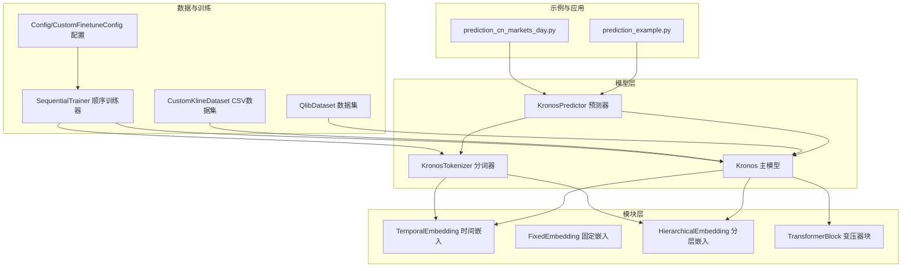
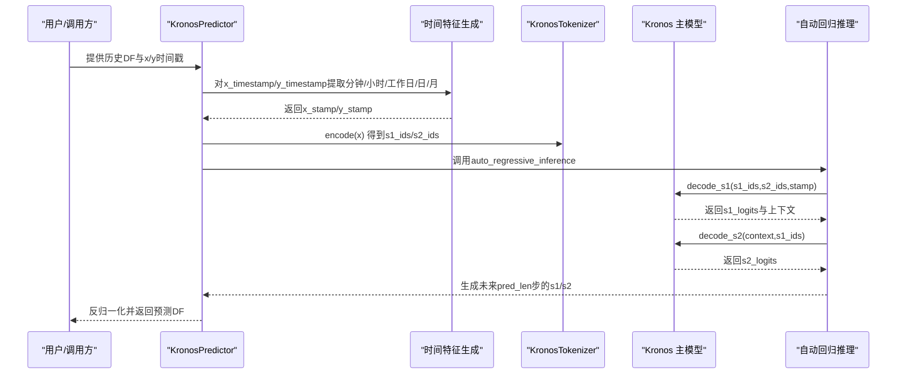
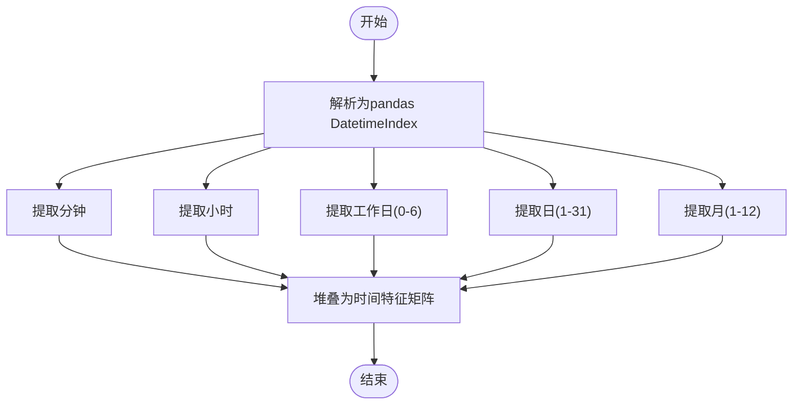
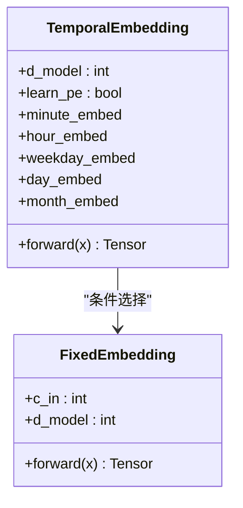
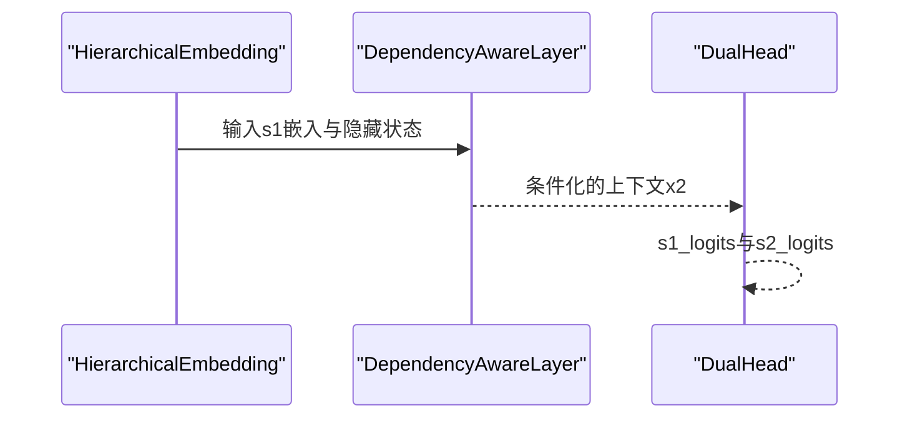
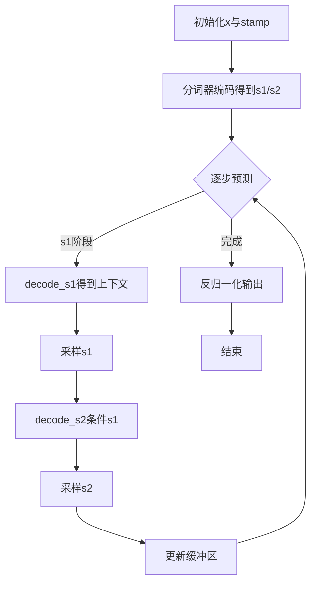
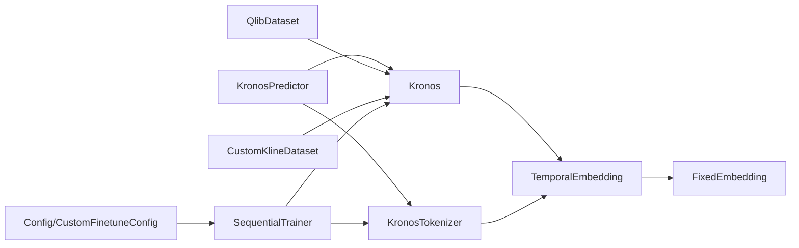

# 时间戳处理和时序特征

<cite>
**本文引用的文件列表**
- [model/kronos.py](file://model/kronos.py)
- [model/module.py](file://model/module.py)
- [finetune/dataset.py](file://finetune/dataset.py)
- [finetune_csv/finetune_base_model.py](file://finetune_csv/finetune_base_model.py)
- [finetune/config.py](file://finetune/config.py)
- [finetune_csv/config_loader.py](file://finetune_csv/config_loader.py)
- [finetune_csv/train_sequential.py](file://finetune_csv/train_sequential.py)
- [examples/prediction_example.py](file://examples/prediction_example.py)
- [examples/prediction_cn_markets_day.py](file://examples/prediction_cn_markets_day.py)
</cite>

## 目录
1. [引言](#引言)
2. [项目结构](#项目结构)
3. [核心组件](#核心组件)
4. [架构总览](#架构总览)
5. [详细组件分析](#详细组件分析)
6. [依赖关系分析](#依赖关系分析)
7. [性能考量](#性能考量)
8. [故障排查指南](#故障排查指南)
9. [结论](#结论)
10. [附录](#附录)

## 引言
本技术文档聚焦于Kronos在时间戳处理与金融时序特征方面的实现与应用，系统阐述分钟、小时、工作日、日期与月份等时间维度的编码策略；深入解析TemporalEmbedding的可学习时间嵌入与固定时间嵌入差异及其适用场景；总结不同市场周期（如分钟级、日线）的时序特征构建方法，并给出交易日历、节假日处理与市场开盘收盘时间的考虑建议；最后提供时序数据对齐、填充与重采样的技术方案，帮助读者在实际金融预测任务中高效落地。

## 项目结构
Kronos项目围绕“量化时间特征 + 分层嵌入 + 自回归解码”的整体思路组织代码：
- 模型层：Kronos主模型、KronosTokenizer分词器、KronosPredictor预测器
- 模块层：TemporalEmbedding、FixedEmbedding、HierarchicalEmbedding、TransformerBlock等
- 训练与数据：Qlib数据集、CSV数据集、训练脚本与配置加载器
- 示例与WebUI：示例推理脚本、批量预测与可视化

图表来源
- [model/kronos.py:180-330](file://model/kronos.py#L180-L330)
- [model/module.py:536-563](file://model/module.py#L536-L563)
- [finetune/dataset.py:9-146](file://finetune/dataset.py#L9-L146)
- [finetune_csv/finetune_base_model.py:25-133](file://finetune_csv/finetune_base_model.py#L25-L133)
- [finetune/config.py:1-132](file://finetune/config.py#L1-L132)
- [finetune_csv/config_loader.py:109-268](file://finetune_csv/config_loader.py#L109-L268)
- [finetune_csv/train_sequential.py:18-362](file://finetune_csv/train_sequential.py#L18-L362)
- [examples/prediction_example.py:1-81](file://examples/prediction_example.py#L1-L81)
- [examples/prediction_cn_markets_day.py:1-209](file://examples/prediction_cn_markets_day.py#L1-L209)

章节来源
- [model/kronos.py:1-663](file://model/kronos.py#L1-L663)
- [model/module.py:1-571](file://model/module.py#L1-L571)
- [finetune/dataset.py:1-146](file://finetune/dataset.py#L1-L146)
- [finetune_csv/finetune_base_model.py:1-469](file://finetune_csv/finetune_base_model.py#L1-L469)
- [finetune/config.py:1-132](file://finetune/config.py#L1-L132)
- [finetune_csv/config_loader.py:1-268](file://finetune_csv/config_loader.py#L1-L268)
- [finetune_csv/train_sequential.py:1-362](file://finetune_csv/train_sequential.py#L1-L362)
- [examples/prediction_example.py:1-81](file://examples/prediction_example.py#L1-L81)
- [examples/prediction_cn_markets_day.py:1-209](file://examples/prediction_cn_markets_day.py#L1-L209)

## 核心组件
- 时间戳特征生成：通过pandas对DatetimeIndex进行分钟、小时、工作日、日、月的提取，形成时间特征矩阵
- TemporalEmbedding：将时间特征映射为可学习或固定的嵌入向量，支持分钟、小时、工作日、日、月五维
- HierarchicalEmbedding：对s1/s2分层token进行嵌入融合，用于上下文建模
- TransformerBlock：自注意力+前馈网络，结合RMSNorm与RoPE位置编码
- KronosPredictor：统一的预测入口，负责数据归一化、时间特征构造、自动回归推理与结果反归一化

章节来源
- [model/kronos.py:472-561](file://model/kronos.py#L472-L561)
- [model/module.py:536-563](file://model/module.py#L536-L563)
- [model/module.py:400-444](file://model/module.py#L400-L444)
- [model/module.py:465-484](file://model/module.py#L465-L484)

## 架构总览
Kronos的时序特征处理与模型推理流程如下：

图表来源
- [model/kronos.py:482-561](file://model/kronos.py#L482-L561)
- [model/kronos.py:389-470](file://model/kronos.py#L389-L470)
- [model/kronos.py:239-329](file://model/kronos.py#L239-L329)

## 详细组件分析

### 时间戳与时间特征提取
- 功能：从pandas DatetimeIndex中提取分钟、小时、工作日、日、月五个维度，作为TemporalEmbedding的输入
- 实现要点：
  - 使用pandas的dt属性快速提取各维度
  - 将时间特征与价格/成交量等特征拼接，形成模型输入
  - 支持单序列与批量序列两种模式
- 应用场景：分钟级高频数据、日线数据均可复用同一套特征工程

图表来源
- [model/kronos.py:472-479](file://model/kronos.py#L472-L479)
- [finetune/dataset.py:59-66](file://finetune/dataset.py#L59-L66)
- [finetune_csv/finetune_base_model.py:60-66](file://finetune_csv/finetune_base_model.py#L60-L66)

章节来源
- [model/kronos.py:472-479](file://model/kronos.py#L472-L479)
- [finetune/dataset.py:59-66](file://finetune/dataset.py#L59-L66)
- [finetune_csv/finetune_base_model.py:60-66](file://finetune_csv/finetune_base_model.py#L60-L66)

### TemporalEmbedding：可学习时间嵌入 vs 固定时间嵌入
- 设计思想：将时间维度离散化后映射到d_model空间，支持两种策略
  - 可学习嵌入：使用nn.Embedding，参数随训练优化
  - 固定嵌入：使用FixedEmbedding，基于正弦/余弦函数构造，不更新参数
- 维度与组合：分钟(60)、小时(24)、工作日(7)、日(32)、月(13)，逐维相加得到最终时间嵌入
- 选择建议：
  - 可学习嵌入：适用于时间模式复杂、跨市场迁移较弱的任务
  - 固定嵌入：适用于时间规律稳定、追求计算效率与可解释性的场景

图表来源
- [model/module.py:536-563](file://model/module.py#L536-L563)
- [model/module.py:516-534](file://model/module.py#L516-L534)

章节来源
- [model/module.py:536-563](file://model/module.py#L536-L563)
- [model/module.py:516-534](file://model/module.py#L516-L534)

### 分层嵌入与依赖感知解码
- 分层嵌入：s1/s2位宽分别对应不同粒度的量化表示，通过嵌入后拼接再投影融合
- 依赖感知层：以s1嵌入为查询，对隐藏状态做交叉注意力，增强s2解码对s1的条件性
- 解码流程：先s1解码，再以s1为条件解码s2，实现分层自回归

图表来源
- [model/module.py:400-444](file://model/module.py#L400-L444)
- [model/module.py:446-463](file://model/module.py#L446-L463)
- [model/module.py:486-514](file://model/module.py#L486-L514)

章节来源
- [model/module.py:400-444](file://model/module.py#L400-L444)
- [model/module.py:446-463](file://model/module.py#L446-L463)
- [model/module.py:486-514](file://model/module.py#L486-L514)

### 自动回归推理与上下文窗口
- 上下文缓冲：维护最大长度max_context的滑动窗口，新步预测后滚动更新
- 采样策略：温度控制与top-k/top-p过滤，支持多样本平均
- 归一化与反归一化：训练时按实例统计均值/标准差，推理时一致化处理

图表来源
- [model/kronos.py:389-470](file://model/kronos.py#L389-L470)
- [model/kronos.py:239-329](file://model/kronos.py#L239-L329)

章节来源
- [model/kronos.py:389-470](file://model/kronos.py#L389-L470)
- [model/kronos.py:239-329](file://model/kronos.py#L239-L329)

### 不同市场周期的时序特征构建
- 分钟级（5分钟K线示例）：时间特征直接从timestamps提取，适合高频交易与日内策略
- 日线（A股日线示例）：使用pd.bdate_range生成交易日预测时间轴，避免节假日与非交易时段
- 特征一致性：无论分钟级还是日线，时间特征维度保持一致（分钟、小时、工作日、日、月）

章节来源
- [examples/prediction_example.py:48-79](file://examples/prediction_example.py#L48-L79)
- [examples/prediction_cn_markets_day.py:112-117](file://examples/prediction_cn_markets_day.py#L112-L117)
- [finetune_csv/finetune_base_model.py:60-66](file://finetune_csv/finetune_base_model.py#L60-L66)

### 交易日历、节假日与开盘收盘时间的考虑
- 交易日历：日线预测采用工作日范围（bdate_range），避免周末与节假日
- 开盘收盘：分钟级数据通常覆盖交易时段，时间特征可直接使用；若需显式约束，可在外部加入开盘/收盘掩码
- 建议：在数据准备阶段明确交易时段边界，必要时对时间戳进行过滤或重采样

章节来源
- [examples/prediction_cn_markets_day.py:112-117](file://examples/prediction_cn_markets_day.py#L112-L117)

### 时序数据对齐、填充与重采样
- 对齐：确保历史序列与预测序列的时间戳长度一致，且y_timestamp长度等于pred_len
- 填充：缺失值采用前向填充策略，避免NaN影响训练/推理
- 重采样：根据原始时间间隔生成未来时间戳，保证预测频率与输入一致

章节来源
- [finetune_csv/finetune_base_model.py:68-74](file://finetune_csv/finetune_base_model.py#L68-L74)
- [finetune_csv/finetune_base_model.py:107-132](file://finetune_csv/finetune_base_model.py#L107-L132)
- [webui/app.py:559-587](file://webui/app.py#L559-L587)

## 依赖关系分析
- 模块耦合：
  - KronosPredictor依赖KronosTokenizer与Kronos，负责端到端推理
  - TemporalEmbedding与FixedEmbedding被Kronos与KronosTokenizer共同使用
  - 数据集类（QlibDataset/CustomKlineDataset）与训练脚本通过配置类解耦
- 外部依赖：
  - pandas用于时间特征提取与交易日历
  - torch用于深度学习计算与分布式训练
  - HuggingFace Hub用于模型保存与加载

图表来源
- [model/kronos.py:482-561](file://model/kronos.py#L482-L561)
- [model/module.py:536-563](file://model/module.py#L536-L563)
- [finetune/dataset.py:9-146](file://finetune/dataset.py#L9-L146)
- [finetune_csv/finetune_base_model.py:25-133](file://finetune_csv/finetune_base_model.py#L25-L133)
- [finetune/config.py:1-132](file://finetune/config.py#L1-L132)
- [finetune_csv/config_loader.py:109-268](file://finetune_csv/config_loader.py#L109-L268)
- [finetune_csv/train_sequential.py:18-362](file://finetune_csv/train_sequential.py#L18-L362)

章节来源
- [model/kronos.py:482-561](file://model/kronos.py#L482-L561)
- [model/module.py:536-563](file://model/module.py#L536-L563)
- [finetune/dataset.py:9-146](file://finetune/dataset.py#L9-L146)
- [finetune_csv/finetune_base_model.py:25-133](file://finetune_csv/finetune_base_model.py#L25-L133)
- [finetune/config.py:1-132](file://finetune/config.py#L1-L132)
- [finetune_csv/config_loader.py:109-268](file://finetune_csv/config_loader.py#L109-L268)
- [finetune_csv/train_sequential.py:18-362](file://finetune_csv/train_sequential.py#L18-L362)

## 性能考量
- 时间嵌入策略选择：固定嵌入计算开销更低，可学习嵌入表达能力更强
- 上下文窗口：max_context越大，内存与计算成本越高；需权衡长程依赖与资源限制
- 采样策略：top-k/top-p可减少冗余输出，提高推理效率
- 分布式训练：使用DDP与分布式采样提升吞吐

## 故障排查指南
- 输入校验错误：检查DataFrame列名是否包含open/high/low/close/volume/amount，缺失或含NaN会报错
- 时间戳长度不一致：y_timestamp长度必须等于pred_len，否则抛出异常
- 批量预测长度不一致：所有序列的历史长度与预测长度需一致，否则拒绝执行
- 归一化异常：若数据极值过大，clip阈值过小可能导致数值不稳定，适当调整clip

章节来源
- [model/kronos.py:524-536](file://model/kronos.py#L524-L536)
- [model/kronos.py:611-627](file://model/kronos.py#L611-L627)
- [finetune_csv/finetune_base_model.py:107-132](file://finetune_csv/finetune_base_model.py#L107-L132)

## 结论
Kronos在时间戳处理与金融时序特征方面提供了清晰、可扩展的实现路径：统一的时间特征提取、灵活的时间嵌入策略、稳定的分层解码框架以及完善的训练与推理管线。通过合理选择时间嵌入方式、构建一致的时序特征、结合交易日历与开盘收盘约束，并采用对齐/填充/重采样策略，可在分钟级与日线等多周期场景中取得稳健的预测效果。

## 附录
- 示例脚本展示了分钟级与日线预测的完整流程，可作为二次开发的参考模板
- 训练配置类支持灵活的超参数与路径管理，便于在不同数据源与任务上快速适配

章节来源
- [examples/prediction_example.py:1-81](file://examples/prediction_example.py#L1-L81)
- [examples/prediction_cn_markets_day.py:1-209](file://examples/prediction_cn_markets_day.py#L1-L209)
- [finetune/config.py:1-132](file://finetune/config.py#L1-L132)
- [finetune_csv/config_loader.py:109-268](file://finetune_csv/config_loader.py#L109-L268)
- [finetune_csv/train_sequential.py:18-362](file://finetune_csv/train_sequential.py#L18-L362)