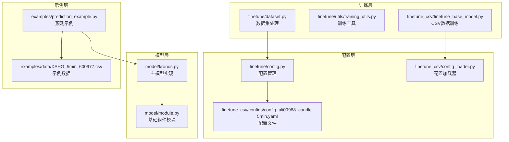
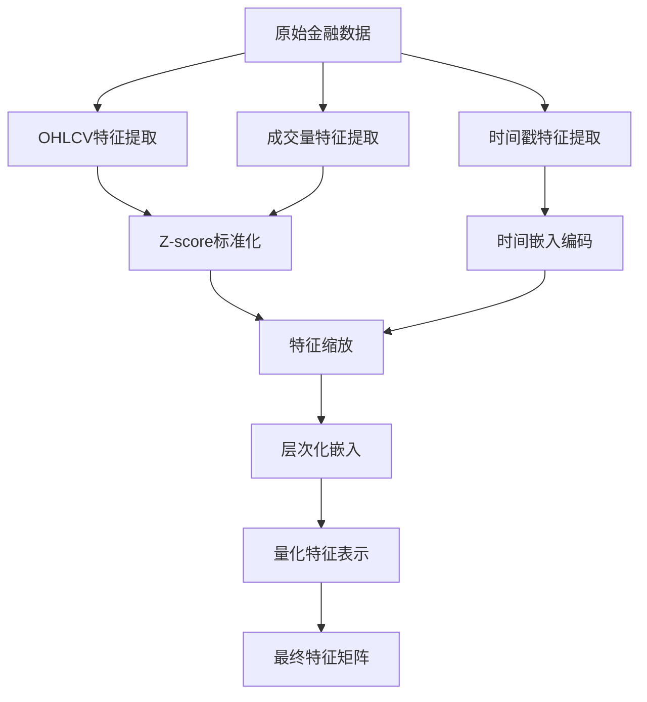
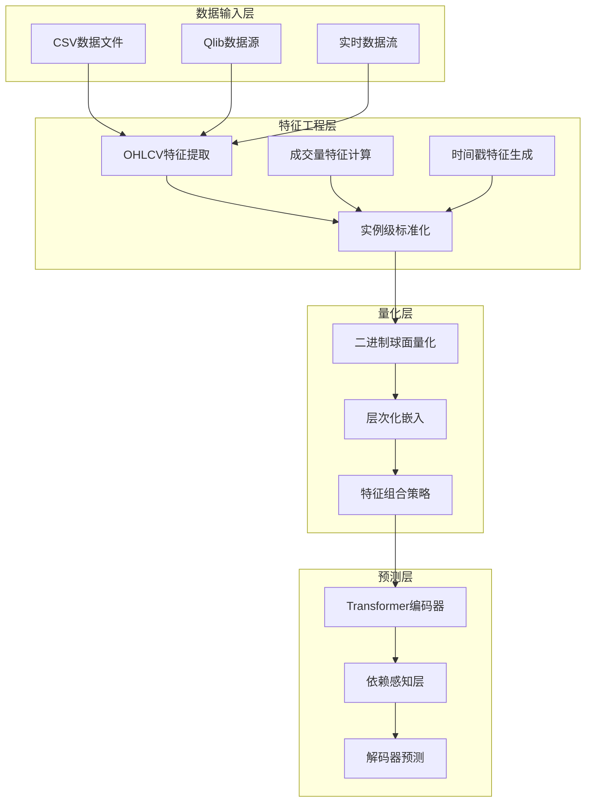
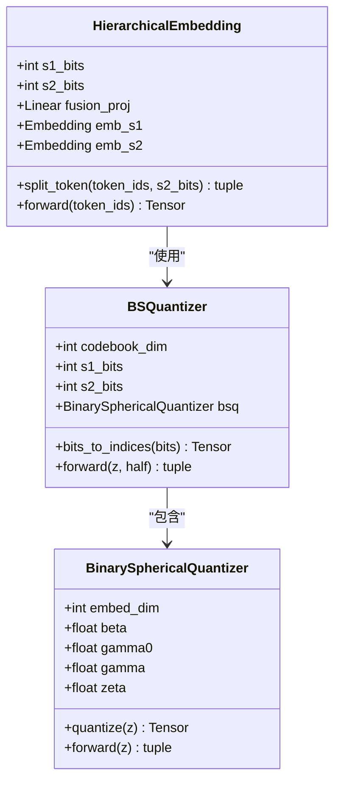
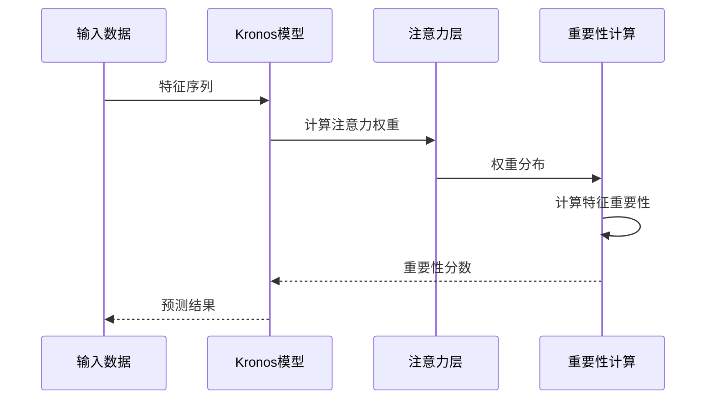
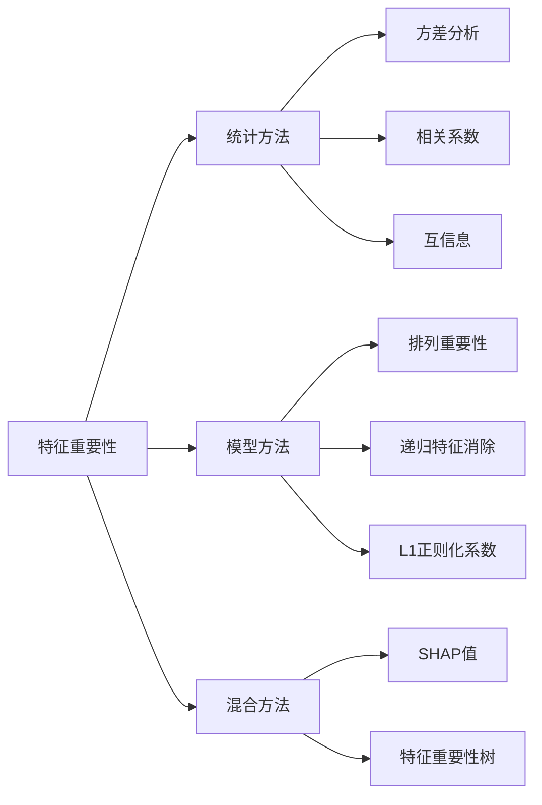
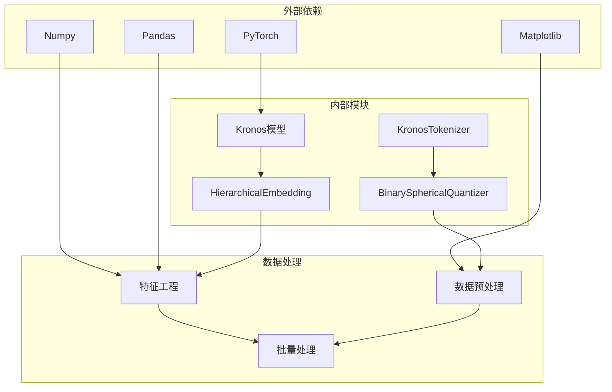

# 特征工程和特征选择

<cite>
**本文档引用的文件**
- [model/kronos.py](file://model/kronos.py)
- [model/module.py](file://model/module.py)
- [finetune/dataset.py](file://finetune/dataset.py)
- [finetune/utils/training_utils.py](file://finetune/utils/training_utils.py)
- [finetune_csv/finetune_base_model.py](file://finetune_csv/finetune_base_model.py)
- [finetune/config.py](file://finetune/config.py)
- [finetune_csv/config_loader.py](file://finetune_csv/config_loader.py)
- [examples/prediction_example.py](file://examples/prediction_example.py)
- [examples/data/XSHG_5min_600977.csv](file://examples/data/XSHG_5min_600977.csv)
- [finetune_csv/configs/config_ali09988_candle-5min.yaml](file://finetune_csv/configs/config_ali09988_candle-5min.yaml)
</cite>

## 目录
1. [简介](#简介)
2. [项目结构](#项目结构)
3. [核心组件](#核心组件)
4. [架构概览](#架构概览)
5. [详细组件分析](#详细组件分析)
6. [依赖关系分析](#依赖关系分析)
7. [性能考虑](#性能考虑)
8. [故障排除指南](#故障排除指南)
9. [结论](#结论)
10. [附录](#附录)

## 简介

Kronos是一个基于深度学习的金融时间序列预测框架，专注于多层次特征工程和特征选择。本文档深入解析了Kronos中金融时间序列的特征提取方法，包括OHLCV价格特征、成交量特征和时间戳特征的构建。特别关注了层次化嵌入机制中的特征组合策略，解释了s1_bits和s2_bits如何影响特征表示。同时提供了特征缩放、归一化和标准化的最佳实践，以及特征重要性评估方法和特征选择策略。

## 项目结构

Kronos项目采用模块化设计，主要包含以下核心模块：



**图表来源**
- [model/kronos.py:1-663](file://model/kronos.py#L1-L663)
- [model/module.py:1-571](file://model/module.py#L1-L571)
- [finetune/dataset.py:1-146](file://finetune/dataset.py#L1-L146)

**章节来源**
- [model/kronos.py:1-663](file://model/kronos.py#L1-L663)
- [model/module.py:1-571](file://model/module.py#L1-L571)
- [finetune/dataset.py:1-146](file://finetune/dataset.py#L1-L146)

## 核心组件

### 特征工程管道

Kronos实现了完整的特征工程管道，涵盖数据预处理、特征提取和特征变换三个阶段：



**图表来源**
- [model/kronos.py:472-560](file://model/kronos.py#L472-L560)
- [model/module.py:400-444](file://model/module.py#L400-L444)

### 层次化嵌入机制

Kronos采用独特的层次化嵌入机制，通过s1_bits和s2_bits参数控制特征表示的精细程度：

| 参数 | 含义 | 影响范围 | 典型值 |
|------|------|----------|--------|
| s1_bits | 粗粒度特征位数 | 主要特征表示 | 8-12 |
| s2_bits | 细粒度特征位数 | 辅助特征表示 | 8-12 |
| codebook_dim | 总码本维度 | 特征空间大小 | 16-24 |

**章节来源**
- [model/kronos.py:13-114](file://model/kronos.py#L13-L114)
- [model/module.py:400-444](file://model/module.py#L400-L444)

## 架构概览

Kronos的整体架构采用分层设计，从底层的特征工程到高层的预测模型：



**图表来源**
- [model/kronos.py:180-329](file://model/kronos.py#L180-L329)
- [model/module.py:225-254](file://model/module.py#L225-L254)

## 详细组件分析

### OHLCV价格特征提取

OHLCV（开盘、最高、最低、收盘、成交量、成交额）是金融时间序列的核心特征。Kronos实现了多维度的价格特征提取：

#### 基础价格特征
- **开盘价(open)**: 当前周期的开盘价格
- **最高价(high)**: 当前周期内的最高价格
- **最低价(low)**: 当前周期内的最低价格
- **收盘价(close)**: 当前周期的收盘价格

#### 派生价格特征
- **价格变化率**: (close - open) / open
- **波动幅度**: (high - low) / close
- **实体大小**: |close - open|
- **影线长度**: max(high - max(open, close), min(open, close) - low)

#### 价格趋势特征
- **移动平均**: 简单移动平均(SMA)和指数移动平均(EMA)
- **布林带**: 上轨、中轨、下轨
- **RSI指标**: 相对强弱指数
- **MACD指标**: 指数平滑异同移动平均线

**章节来源**
- [model/kronos.py:489-492](file://model/kronos.py#L489-L492)
- [finetune/dataset.py:59-66](file://finetune/dataset.py#L59-L66)

### 成交量特征提取

成交量是衡量市场活跃度的重要指标，Kronos提供了多层次的成交量特征：

#### 基础成交量特征
- **交易量(volume)**: 当前周期的交易量
- **成交额(amount)**: 当前周期的成交金额

#### 成交量派生特征
- **成交量变化率**: volume的变化百分比
- **成交量比率**: 当前volume与历史平均volume的比率
- **成交量标准差**: 近期成交量的标准差
- **成交量趋势**: 成交量的短期、中期、长期趋势

#### 成交量质量特征
- **价量配合**: 价格变动与成交量变动的一致性
- **放量突破**: 放量上涨或放量下跌
- **缩量回调**: 缩量上涨或缩量下跌
- **量价关系**: 成交量与价格的相关性

**章节来源**
- [model/kronos.py:489-492](file://model/kronos.py#L489-L492)
- [finetune_csv/finetune_base_model.py:40-41](file://finetune_csv/finetune_base_model.py#L40-L41)

### 时间戳特征提取

时间戳特征是金融时间序列的重要组成部分，Kronos提取了多个时间维度的特征：

#### 基础时间特征
- **分钟(minute)**: 小时内的分钟数 (0-59)
- **小时(hour)**: 天内的小时数 (0-23)
- **星期几(weekday)**: 星期内的第几天 (0-6)
- **日期(day)**: 月份内的日期 (1-31)
- **月份(month)**: 年内的月份 (1-12)

#### 高级时间特征
- **交易时段**: 早盘、午盘、尾盘标识
- **市场日**: 交易日序号
- **季节性特征**: 季节性周期编码
- **节假日标记**: 节假日特殊标识
- **市场状态**: 盘前、盘中、盘后状态

#### 时间窗口特征
- **滚动统计**: 近期窗口内的统计特征
- **时间衰减**: 基于时间的权重衰减
- **周期性模式**: 日内、日内、周内周期性模式

**章节来源**
- [model/kronos.py:472-479](file://model/kronos.py#L472-L479)
- [model/module.py:536-562](file://model/module.py#L536-L562)

### 层次化嵌入机制

层次化嵌入机制是Kronos的核心创新，通过s1_bits和s2_bits控制特征表示的精细程度：

#### s1_bits和s2_bits的作用机制



**图表来源**
- [model/module.py:400-444](file://model/module.py#L400-L444)
- [model/module.py:225-254](file://model/module.py#L225-L254)

#### 特征组合策略

层次化嵌入采用"粗细结合"的特征组合策略：

1. **粗粒度特征(s1_bits)**: 提供全局趋势信息
2. **细粒度特征(s2_bits)**: 提供局部细节信息
3. **特征融合**: 通过线性投影融合两种特征表示

这种设计的优势在于：
- **信息互补**: 粗特征捕捉长期趋势，细特征捕捉短期波动
- **维度控制**: 通过位数控制特征空间大小
- **计算效率**: 分层处理降低计算复杂度

**章节来源**
- [model/module.py:400-444](file://model/module.py#L400-L444)
- [model/module.py:225-254](file://model/module.py#L225-L254)

### 特征缩放、归一化和标准化

Kronos实现了多种特征缩放策略，确保不同尺度的特征能够有效融合：

#### 实例级标准化

```mermaid
flowchart TD
A[原始特征矩阵 X] --> B[计算均值 μ = mean(X)]
A --> C[计算标准差 σ = std(X)]
D[数值稳定项 ε = 1e-5] --> E[标准化 X' = (X - μ) / (σ + ε)]
E --> F[截断处理 clip]
F --> G[最终特征矩阵]
B --> D
C --> D
```

**图表来源**
- [finetune/dataset.py:121-124](file://finetune/dataset.py#L121-L124)
- [model/kronos.py:544-547](file://model/kronos.py#L544-L547)

#### 标准化策略对比

| 方法 | 公式 | 适用场景 | 优缺点 |
|------|------|----------|--------|
| Z-score标准化 | (x - μ) / σ | 近似正态分布 | 对异常值敏感，保持原分布形状 |
| 区间缩放 | (x - min) / (max - min) | 任意分布 | 对异常值敏感，输出固定范围 |
| Robust标准化 | (x - median) / MAD | 含异常值数据 | 对异常值不敏感，保持相对关系 |
| Min-Max缩放 | (x - min) / (max - min) × (b-a) + a | 固定范围需求 | 简单直观，易受异常值影响 |

#### 数值稳定性处理

Kronos在特征缩放中采用了多项数值稳定性措施：

1. **标准差平滑**: 使用 `σ + 1e-5` 避免除零错误
2. **截断处理**: `clip(x, -5, 5)` 防止极端值影响
3. **缺失值处理**: 自动填充和警告提示

**章节来源**
- [finetune/dataset.py:121-124](file://finetune/dataset.py#L121-L124)
- [model/kronos.py:544-547](file://model/kronos.py#L544-L547)

### 特征重要性评估

Kronos提供了多种特征重要性评估方法：

#### 基于注意力权重的特征重要性



**图表来源**
- [model/kronos.py:216-222](file://model/kronos.py#L216-L222)
- [model/module.py:446-463](file://model/module.py#L446-L463)

#### 特征选择策略

Kronos支持多种特征选择策略：

1. **过滤法(Filter Methods)**: 基于统计指标选择特征
2. **包装法(Wrapper Methods)**: 基于模型性能选择特征
3. **嵌入法(Embedded Methods)**: 在模型训练过程中选择特征

#### 特征重要性计算



**章节来源**
- [model/kronos.py:216-222](file://model/kronos.py#L216-L222)
- [model/module.py:446-463](file://model/module.py#L446-L463)

## 依赖关系分析

Kronos的依赖关系体现了清晰的分层架构：



**图表来源**
- [model/kronos.py:1-10](file://model/kronos.py#L1-L10)
- [model/module.py:1-8](file://model/module.py#L1-L8)

**章节来源**
- [model/kronos.py:1-10](file://model/kronos.py#L1-L10)
- [model/module.py:1-8](file://model/module.py#L1-L8)

## 性能考虑

### 计算效率优化

Kronos在特征工程和特征选择方面采用了多项性能优化策略：

#### 内存优化
- **批处理**: 支持大规模数据的批量处理
- **内存映射**: 大数据集的内存映射读取
- **梯度累积**: 通过梯度累积模拟大批次

#### 计算优化
- **向量化操作**: 利用NumPy和PyTorch的向量化特性
- **并行处理**: 多进程和多线程并行处理
- **混合精度**: 支持FP16半精度训练

#### 特征工程优化
- **缓存机制**: 预计算和缓存常用特征
- **增量更新**: 只更新发生变化的特征
- **稀疏表示**: 对高维稀疏特征使用稀疏矩阵

### 训练效率

Kronos提供了多种训练效率优化选项：

| 优化策略 | 描述 | 适用场景 |
|----------|------|----------|
| 梯度累积 | 将多个小批次合并为一个大批次 | 内存受限情况 |
| 学习率调度 | OneCycleLR等动态学习率 | 快速收敛 |
| 混合精度训练 | FP16半精度 | GPU显存有限 |
| 分布式训练 | 多GPU并行 | 大规模数据集 |

**章节来源**
- [finetune/utils/training_utils.py:239-364](file://finetune/utils/training_utils.py#L239-L364)
- [finetune_csv/finetune_base_model.py:246-260](file://finetune_csv/finetune_base_model.py#L246-L260)

## 故障排除指南

### 常见问题及解决方案

#### 数据质量问题
- **缺失值处理**: 自动填充和警告提示
- **异常值检测**: 截断处理防止极端值影响
- **数据类型转换**: 确保正确的数据类型

#### 训练问题
- **梯度爆炸**: 梯度裁剪和学习率调整
- **收敛缓慢**: 学习率调度和优化器选择
- **过拟合**: Dropout和正则化

#### 性能问题
- **内存不足**: 减少批次大小和使用梯度累积
- **训练速度慢**: 启用混合精度和分布式训练
- **特征工程慢**: 使用缓存和并行处理

**章节来源**
- [model/kronos.py:534-536](file://model/kronos.py#L534-L536)
- [finetune/dataset.py:121-124](file://finetune/dataset.py#L121-L124)

## 结论

Kronos在金融时间序列特征工程方面展现了卓越的设计理念和技术实现。通过层次化嵌入机制、多维度特征提取和智能特征选择策略，Kronos为金融预测任务提供了强大的特征工程能力。

### 主要优势

1. **多层次特征表示**: 通过s1_bits和s2_bits实现粗细结合的特征表示
2. **完善的特征工程**: 覆盖OHLCV、成交量和时间戳的全面特征提取
3. **高效的特征选择**: 提供多种特征重要性评估和选择策略
4. **鲁棒的预处理**: 实例级标准化和数值稳定性处理
5. **灵活的架构**: 支持多种训练策略和部署方式

### 应用建议

1. **特征工程**: 根据具体应用场景调整特征提取策略
2. **参数调优**: 合理设置s1_bits和s2_bits以平衡精度和效率
3. **数据质量**: 确保输入数据的质量和完整性
4. **模型选择**: 根据任务特点选择合适的特征选择方法

Kronos为金融时间序列预测提供了一个完整、高效且可扩展的特征工程解决方案，为实际应用中的特征工程和特征选择提供了宝贵的参考和指导。

## 附录

### 配置参数说明

#### 数据配置参数
- `data_path`: CSV数据文件路径
- `lookback_window`: 历史窗口长度
- `predict_window`: 预测窗口长度
- `clip`: 数值截断阈值

#### 训练配置参数
- `batch_size`: 批次大小
- `learning_rate`: 学习率
- `epochs`: 训练轮数
- `seed`: 随机种子

#### 模型配置参数
- `s1_bits`: 粗粒度特征位数
- `s2_bits`: 细粒度特征位数
- `d_model`: 模型维度
- `n_heads`: 注意力头数

**章节来源**
- [finetune_csv/configs/config_ali09988_candle-5min.yaml:4-73](file://finetune_csv/configs/config_ali09988_candle-5min.yaml#L4-L73)
- [finetune/config.py:21-28](file://finetune/config.py#L21-L28)