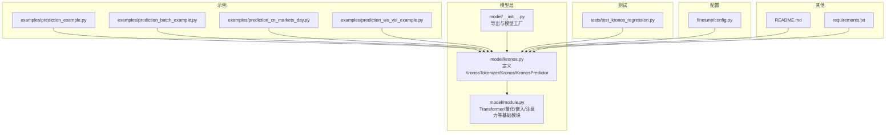
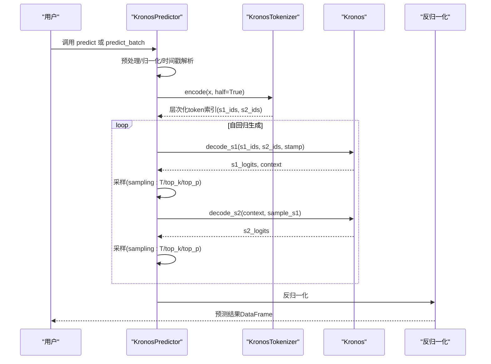
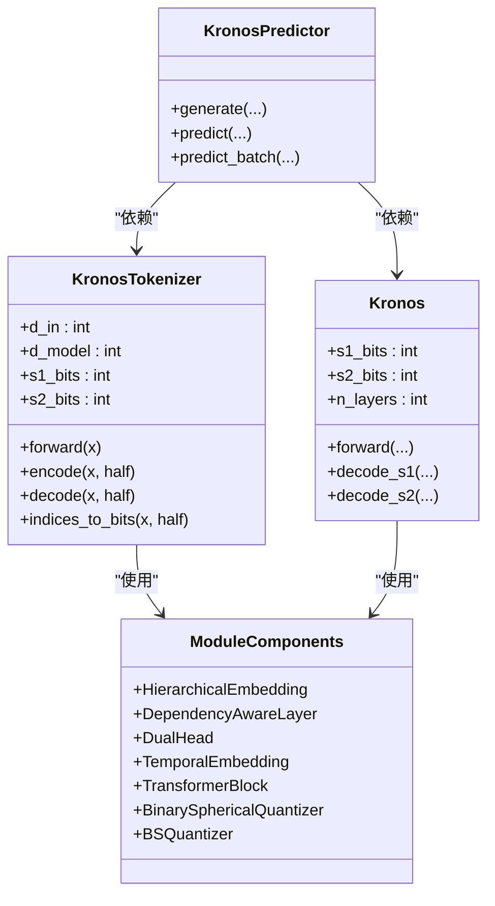

# 核心API参考

<cite>
**本文引用的文件列表**
- [model/kronos.py](file://model/kronos.py)
- [model/module.py](file://model/module.py)
- [model/__init__.py](file://model/__init__.py)
- [examples/prediction_example.py](file://examples/prediction_example.py)
- [examples/prediction_batch_example.py](file://examples/prediction_batch_example.py)
- [examples/prediction_cn_markets_day.py](file://examples/prediction_cn_markets_day.py)
- [examples/prediction_wo_vol_example.py](file://examples/prediction_wo_vol_example.py)
- [tests/test_kronos_regression.py](file://tests/test_kronos_regression.py)
- [README.md](file://README.md)
- [requirements.txt](file://requirements.txt)
- [finetune/config.py](file://finetune/config.py)
</cite>

## 目录
1. [简介](#简介)
2. [项目结构](#项目结构)
3. [核心组件](#核心组件)
4. [架构总览](#架构总览)
5. [详细组件分析](#详细组件分析)
6. [依赖关系分析](#依赖关系分析)
7. [性能考量](#性能考量)
8. [故障排查指南](#故障排查指南)
9. [结论](#结论)
10. [附录](#附录)

## 简介
本参考文档聚焦Kronos核心API，系统性阐述以下三类核心组件：
- KronosTokenizer：基于混合量化（二进制球面量化）的分词器，将连续多维K线（OHLCV）离散化为层次化token。
- Kronos：解码器型预训练模型，以层次化token为输入，进行自回归预测。
- KronosPredictor：高层封装，负责数据预处理、归一化、采样与反归一化，提供predict与predict_batch两个易用接口。

文档覆盖各组件的构造参数、公共方法、属性与返回值；详解predict与predict_batch的参数、数据格式、采样策略与性能要点；并提供丰富的使用示例路径与最佳实践建议。

## 项目结构
Kronos采用模块化设计，核心逻辑集中在model目录，示例脚本位于examples，微调流程在finetune与finetune_csv目录中，测试用例位于tests。

图表来源
- [model/kronos.py:13-663](file://model/kronos.py#L13-L663)
- [model/module.py:1-571](file://model/module.py#L1-L571)
- [model/__init__.py:1-18](file://model/__init__.py#L1-L18)
- [examples/prediction_example.py:1-81](file://examples/prediction_example.py#L1-L81)
- [examples/prediction_batch_example.py:1-73](file://examples/prediction_batch_example.py#L1-L73)
- [examples/prediction_cn_markets_day.py:1-209](file://examples/prediction_cn_markets_day.py#L1-L209)
- [examples/prediction_wo_vol_example.py:1-69](file://examples/prediction_wo_vol_example.py#L1-L69)
- [tests/test_kronos_regression.py:1-141](file://tests/test_kronos_regression.py#L1-L141)
- [finetune/config.py:1-132](file://finetune/config.py#L1-L132)
- [README.md:1-338](file://README.md#L1-L338)
- [requirements.txt:1-11](file://requirements.txt#L1-L11)

章节来源
- [README.md:1-338](file://README.md#L1-L338)
- [requirements.txt:1-11](file://requirements.txt#L1-L11)

## 核心组件
本节概述三大核心类的设计理念、职责边界与交互关系。

- 设计理念
  - 分层建模：先用KronosTokenizer将OHLCV映射到离散层次化token，再由Kronos在token空间上进行自回归预测，形成“语言化”的金融序列表示。
  - 量化驱动：采用二进制球面量化（BSQuantizer），在保证信息保留的同时显著降低token维度，提升训练与推理效率。
  - 时间感知：通过TemporalEmbedding引入分钟、小时、星期、日、月等时间特征，增强模型对周期性的建模能力。
  - 解耦封装：KronosPredictor将数据预处理、归一化、采样与反归一化整合，屏蔽底层细节，便于快速部署。

- 组件职责
  - KronosTokenizer：编码输入序列至层次化token索引，支持半量化的前半段与后半段分离；提供解码将token还原为原始空间。
  - Kronos：接受层次化token与时间戳，执行Transformer前向，输出s1/s2两阶段logits，并提供仅解码s1或仅解码s2的便捷接口。
  - KronosPredictor：统一数据管线，负责时间戳解析、特征校验、归一化、采样策略、批量处理与结果反归一化。

章节来源
- [model/kronos.py:13-663](file://model/kronos.py#L13-L663)
- [model/module.py:1-571](file://model/module.py#L1-L571)

## 架构总览
Kronos整体架构由“分词器-模型-预测器”三层构成，数据流从原始OHLCV经分词器量化为层次化token，再由Kronos进行自回归预测，最终由KronosPredictor完成端到端的预测闭环。

图表来源
- [model/kronos.py:389-469](file://model/kronos.py#L389-L469)
- [model/kronos.py:278-328](file://model/kronos.py#L278-L328)
- [model/kronos.py:519-559](file://model/kronos.py#L519-L559)
- [model/kronos.py:562-661](file://model/kronos.py#L562-L661)

## 详细组件分析

### 类：KronosTokenizer
- 角色定位
  - 将连续OHLCV序列映射为层次化离散token，支持半量化（前半段s1与后半段s2分别量化）。
  - 提供encode/decode接口，以及将索引转比特的工具函数，用于构建token嵌入。

- 关键构造参数
  - 输入维度与模型维度：d_in, d_model
  - 注意力与前馈：n_heads, ff_dim
  - 编码器/解码器层数：n_enc_layers, n_dec_layers
  - 各种dropout：ffn_dropout_p, attn_dropout_p, resid_dropout_p
  - 量化参数：s1_bits, s2_bits, beta, gamma0, gamma, zeta, group_size

- 公共方法与行为
  - forward(x)
    - 输入：x形状(B, T, d_in)
    - 输出：(z_pre, z), bsq_loss, quantized, z_indices
    - z_pre/z分别为仅s1部分与全码本的重建输出
  - encode(x, half=False)
    - 返回量化后的层次化token索引
  - decode(x, half=False)
    - 将层次化token索引解码回原始空间
  - indices_to_bits(x, half=False)
    - 将索引转换为比特表示并缩放

- 数据结构与复杂度
  - 量化维度：codebook_dim = s1_bits + s2_bits
  - 嵌入与投影：Linear(d_in->d_model), Linear(d_model->d_in)
  - 编码器/解码器：ModuleList内含若干TransformerBlock
  - 复杂度：forward主路径为O(B*T*(d_model + codebook_dim))级

- 错误处理与边界条件
  - half参数影响索引切片与比特提取
  - 若half=True，indices_to_bits期望输入为元组(x1, x2)

章节来源
- [model/kronos.py:13-178](file://model/kronos.py#L13-L178)
- [model/module.py:225-254](file://model/module.py#L225-L254)
- [model/module.py:400-444](file://model/module.py#L400-L444)

### 类：Kronos
- 角色定位
  - 解码器型预训练模型，接收层次化token与时间戳，输出s1/s2两阶段logits。
  - 支持teacher-forcing与依赖感知层，实现s1->s2的条件解码。

- 关键构造参数
  - s1_bits, s2_bits：两阶段位宽
  - n_layers, d_model, n_heads, ff_dim
  - 各类dropout：ffn_dropout_p, attn_dropout_p, resid_dropout_p, token_dropout_p
  - learn_te：是否使用可学习时间嵌入

- 公共方法与行为
  - forward(s1_ids, s2_ids, stamp, padding_mask, use_teacher_forcing, s1_targets)
    - 输入：层次化token与可选stamp/padding_mask
    - 输出：s1_logits, s2_logits
  - decode_s1(s1_ids, s2_ids, stamp, padding_mask)
    - 仅解码s1，返回s1_logits与上下文表示
  - decode_s2(context, s1_ids, padding_mask)
    - 在给定上下文与s1条件下解码s2

- 内部机制
  - HierarchicalEmbedding：将复合token拆分为s1/s2并融合嵌入
  - DependencyAwareLayer：交叉注意力，将sibling嵌入与隐藏状态融合
  - DualHead：双头投影，分别输出s1/s2 logits
  - TemporalEmbedding：固定或可学习的时间嵌入

- 错误处理与边界条件
  - 使用teacher-forcing时需提供s1_targets
  - decode_s1返回上下文，供decode_s2复用

章节来源
- [model/kronos.py:180-329](file://model/kronos.py#L180-L329)
- [model/module.py:400-514](file://model/module.py#L400-L514)
- [model/module.py:536-562](file://model/module.py#L536-L562)

### 类：KronosPredictor
- 角色定位
  - 高层封装，负责数据预处理、归一化、采样策略与反归一化，提供predict与predict_batch两个入口。

- 关键构造参数
  - model, tokenizer：已加载的Kronos与KronosTokenizer实例
  - device：设备选择（自动检测）
  - max_context：最大上下文长度（默认512）
  - clip：归一化裁剪阈值

- 公共方法与行为
  - generate(x, x_stamp, y_stamp, pred_len, T, top_k, top_p, sample_count, verbose)
    - 内部自回归推理主循环，返回预测结果
  - predict(df, x_timestamp, y_timestamp, pred_len, T, top_k, top_p, sample_count, verbose)
    - 输入：DataFrame与时间戳，输出预测DataFrame
    - 数据要求：必须包含['open','high','low','close']；可选'volume','amount'
    - 归一化：按历史均值与标准差归一化，预测后反归一化
  - predict_batch(df_list, x_timestamp_list, y_timestamp_list, pred_len, T, top_k, top_p, sample_count, verbose)
    - 批量预测：要求所有序列的历史长度与预测长度一致
    - 自动堆叠为(B, T, F)张量，内部并行处理

- 采样策略
  - 温度T：对logits进行除法缩放
  - top_k：仅保留概率最高的k个token
  - top_p（核采样）：累积概率达到p即截断
  - sample_count：每条序列的并行采样数，内部取平均

- 性能与并发
  - predict_batch通过GPU并行处理多个序列
  - generate内部对输入重复扩展并reshape，随后平均

- 错误处理与边界条件
  - predict：缺失列、NaN、设备不可用等会抛出异常
  - predict_batch：类型检查、长度一致性检查、NaN检查

章节来源
- [model/kronos.py:482-661](file://model/kronos.py#L482-L661)
- [model/kronos.py:331-386](file://model/kronos.py#L331-L386)
- [model/kronos.py:389-469](file://model/kronos.py#L389-L469)

## 依赖关系分析
Kronos核心API的依赖关系如下：

图表来源
- [model/kronos.py:13-178](file://model/kronos.py#L13-L178)
- [model/kronos.py:180-329](file://model/kronos.py#L180-L329)
- [model/kronos.py:482-661](file://model/kronos.py#L482-L661)
- [model/module.py:400-571](file://model/module.py#L400-L571)

章节来源
- [model/kronos.py:13-663](file://model/kronos.py#L13-L663)
- [model/module.py:1-571](file://model/module.py#L1-L571)

## 性能考量
- 上下文长度限制
  - README明确指出Kronos-small/base的max_context为512，建议历史窗口不超过此值。
- 量化与内存
  - 层次化token显著降低维度，提升吞吐；但s1_bits+s2_bits越大，计算与显存开销越高。
- 批量推理
  - predict_batch在GPU上并行处理多个序列，适合多资产或多时间窗口场景。
- 采样策略
  - 较低温度与top_k/top_p组合可提高确定性；sample_count越大，结果更稳定但耗时增加。
- 归一化与裁剪
  - clip参数用于抑制极端值，避免异常波动影响模型稳定性。

章节来源
- [README.md:99-100](file://README.md#L99-L100)
- [model/kronos.py:519-559](file://model/kronos.py#L519-L559)
- [model/kronos.py:562-661](file://model/kronos.py#L562-L661)

## 故障排查指南
- 常见错误与解决
  - 输入非DataFrame或列缺失：确保包含['open','high','low','close']，可选'volume','amount'
  - NaN值：预测前会检查并报错，需先清洗
  - 设备不可用：未指定device时自动检测CUDA/MPS/CPU，若均不可用则报错
  - 批量长度不一致：predict_batch要求所有序列的历史长度与预测长度一致
  - 时间戳长度不匹配：y_timestamp长度必须等于pred_len
- 调试建议
  - 使用verbose=True查看自回归进度
  - 逐步缩小问题范围：先验证单序列predict，再迁移至predict_batch
  - 固定随机种子以复现实验结果（测试脚本展示了如何设置）

章节来源
- [model/kronos.py:519-559](file://model/kronos.py#L519-L559)
- [model/kronos.py:562-661](file://model/kronos.py#L562-L661)
- [tests/test_kronos_regression.py:36-43](file://tests/test_kronos_regression.py#L36-L43)

## 结论
Kronos通过“量化分词器+层次化token+自回归模型”的组合，实现了对金融K线序列的高效建模与预测。KronosPredictor进一步简化了端到端流程，使用户能够专注于业务场景。合理配置采样策略与上下文长度，可在准确性与效率之间取得良好平衡。

## 附录

### API参数与返回值速查

- KronosTokenizer
  - forward(x)
    - 参数：x形状(B, T, d_in)
    - 返回：(z_pre, z), bsq_loss, quantized, z_indices
  - encode(x, half=False)
    - 返回：层次化token索引
  - decode(x, half=False)
    - 返回：重构后的原始空间张量
  - indices_to_bits(x, half=False)
    - 返回：比特表示张量

- Kronos
  - forward(s1_ids, s2_ids, stamp=None, padding_mask=None, use_teacher_forcing=False, s1_targets=None)
    - 返回：s1_logits, s2_logits
  - decode_s1(s1_ids, s2_ids, stamp=None, padding_mask=None)
    - 返回：s1_logits, context
  - decode_s2(context, s1_ids, padding_mask=None)
    - 返回：s2_logits

- KronosPredictor
  - predict(df, x_timestamp, y_timestamp, pred_len, T=1.0, top_k=0, top_p=0.9, sample_count=1, verbose=True)
    - 返回：DataFrame，列包含['open','high','low','close','volume','amount']，索引为y_timestamp
  - predict_batch(df_list, x_timestamp_list, y_timestamp_list, pred_len, T=1.0, top_k=0, top_p=0.9, sample_count=1, verbose=True)
    - 返回：预测结果DataFrame列表，顺序与输入一致

章节来源
- [model/kronos.py:74-113](file://model/kronos.py#L74-L113)
- [model/kronos.py:142-177](file://model/kronos.py#L142-L177)
- [model/kronos.py:239-276](file://model/kronos.py#L239-L276)
- [model/kronos.py:278-308](file://model/kronos.py#L278-L308)
- [model/kronos.py:310-328](file://model/kronos.py#L310-L328)
- [model/kronos.py:519-559](file://model/kronos.py#L519-L559)
- [model/kronos.py:562-661](file://model/kronos.py#L562-L661)

### 使用示例与最佳实践

- 单序列预测
  - 示例脚本：[examples/prediction_example.py:60-69](file://examples/prediction_example.py#L60-L69)
  - 关键点：准备OHLCV与时间戳，调用predict，传入T/top_p/sample_count控制采样

- 批量预测
  - 示例脚本：[examples/prediction_batch_example.py:67-72](file://examples/prediction_batch_example.py#L67-L72)
  - 关键点：确保所有序列的历史长度与预测长度一致；使用GPU加速

- 不包含成交量/成交额的预测
  - 示例脚本：[examples/prediction_wo_vol_example.py:48-57](file://examples/prediction_wo_vol_example.py#L48-L57)
  - 关键点：KronosPredictor会自动填充缺失列并按均值估算amount

- 中文A股日线预测
  - 示例脚本：[examples/prediction_cn_markets_day.py:170-178](file://examples/prediction_cn_markets_day.py#L170-L178)
  - 关键点：结合akshare获取数据，应用价格涨跌限制

- 微调配置参考
  - 配置文件：[finetune/config.py:20-28](file://finetune/config.py#L20-L28)
  - 关键点：lookback_window/predict_window/max_context等超参设置

- 测试与回归
  - 测试脚本：[tests/test_kronos_regression.py:46-88](file://tests/test_kronos_regression.py#L46-L88)
  - 关键点：固定随机种子，对比输出与预期CSV，验证数值稳定性

章节来源
- [examples/prediction_example.py:1-81](file://examples/prediction_example.py#L1-L81)
- [examples/prediction_batch_example.py:1-73](file://examples/prediction_batch_example.py#L1-L73)
- [examples/prediction_cn_markets_day.py:1-209](file://examples/prediction_cn_markets_day.py#L1-L209)
- [examples/prediction_wo_vol_example.py:1-69](file://examples/prediction_wo_vol_example.py#L1-L69)
- [finetune/config.py:20-28](file://finetune/config.py#L20-L28)
- [tests/test_kronos_regression.py:46-88](file://tests/test_kronos_regression.py#L46-L88)

### 采样策略与参数说明

- 温度T
  - 对logits进行除法缩放，T越小分布越尖锐，采样越确定；T越大越平滑，多样性更高
- top_k
  - 仅保留概率最高的k个token，k越大保留越多候选
- top_p（核采样）
  - 累积概率达到p即截断，p越接近1保留越多候选
- sample_count
  - 每条序列的并行采样数，内部对多次采样的结果取平均，提高稳定性

章节来源
- [model/kronos.py:331-386](file://model/kronos.py#L331-L386)
- [model/kronos.py:389-469](file://model/kronos.py#L389-L469)
- [finetune/config.py:115-118](file://finetune/config.py#L115-L118)