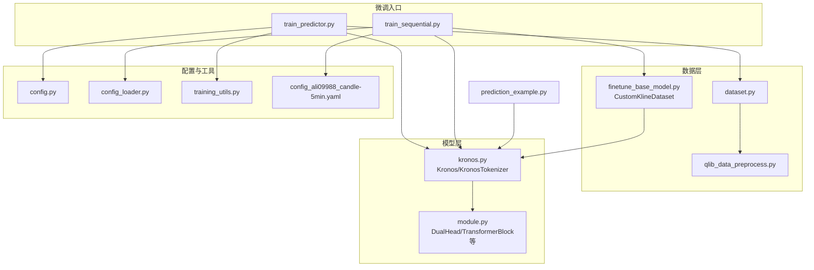
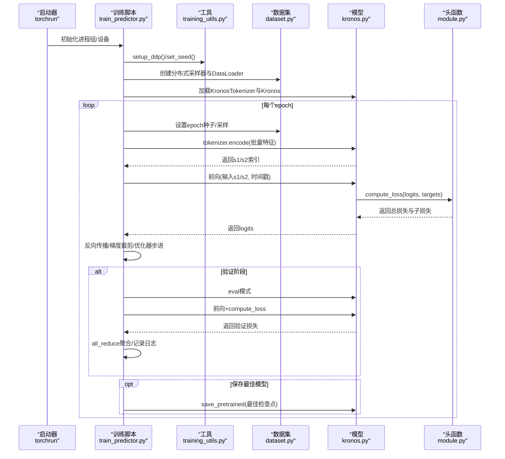
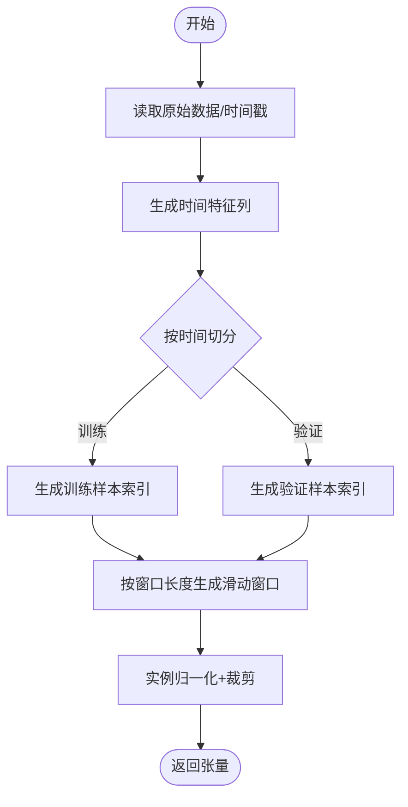
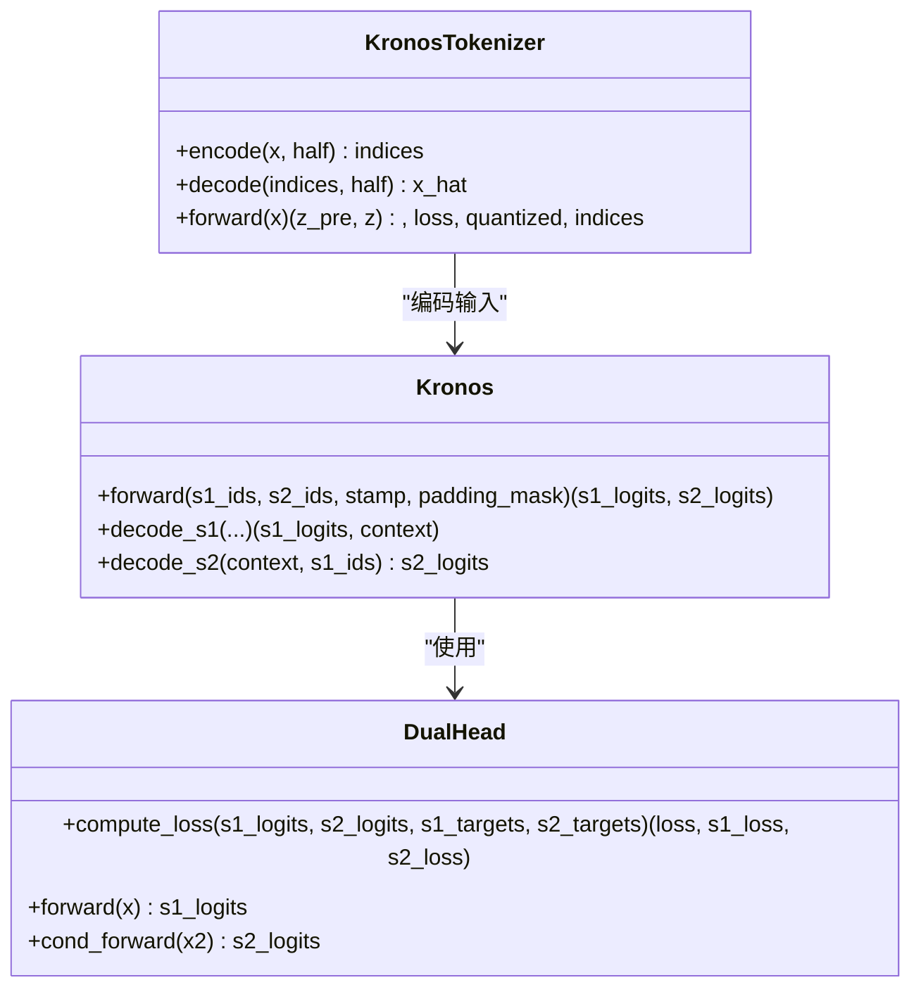
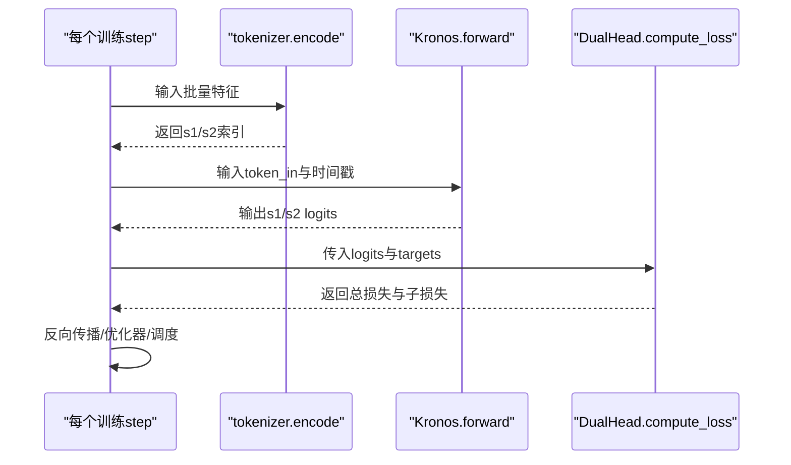
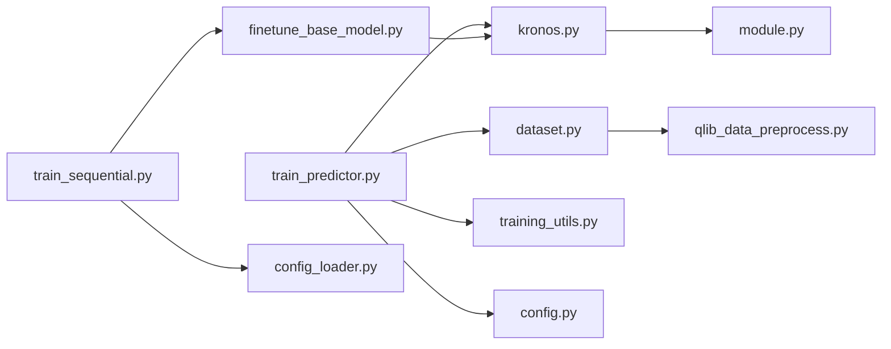

# 主模型微调

<cite>
**本文引用的文件列表**
- [train_predictor.py](file://finetune/train_predictor.py)
- [dataset.py](file://finetune/dataset.py)
- [training_utils.py](file://finetune/utils/training_utils.py)
- [config.py](file://finetune/config.py)
- [kronos.py](file://model/kronos.py)
- [module.py](file://model/module.py)
- [qlib_data_preprocess.py](file://finetune/qlib_data_preprocess.py)
- [finetune_base_model.py](file://finetune_csv/finetune_base_model.py)
- [train_sequential.py](file://finetune_csv/train_sequential.py)
- [config_loader.py](file://finetune_csv/config_loader.py)
- [config_ali09988_candle-5min.yaml](file://finetune_csv/configs/config_ali09988_candle-5min.yaml)
- [prediction_example.py](file://examples/prediction_example.py)
</cite>

## 目录
1. [简介](#简介)
2. [项目结构](#项目结构)
3. [核心组件](#核心组件)
4. [架构总览](#架构总览)
5. [详细组件分析](#详细组件分析)
6. [依赖关系分析](#依赖关系分析)
7. [性能考虑](#性能考虑)
8. [故障排查指南](#故障排查指南)
9. [结论](#结论)
10. [附录](#附录)

## 简介
本文件面向Kronos主模型（Predictor）微调场景，系统性阐述从数据准备到训练执行的完整流程，重点覆盖：
- 数据集构建与滑动窗口策略
- 模型加载与训练循环实现
- 批次生成与损失计算
- 分布式训练配置、学习率调度与检查点管理
- 完整训练脚本与性能优化建议

目标读者既包括需要快速上手的工程师，也包括希望深入理解内部机制的研究者。

## 项目结构
Kronos项目采用模块化组织，主模型微调相关的核心目录与文件如下：
- finetune：基于QLib数据的微调流水线（训练脚本、数据集、工具）
- finetune_csv：基于CSV数据的微调流水线（训练脚本、配置加载、顺序训练）
- model：Kronos核心模型与模块（Kronos、KronosTokenizer、DualHead等）
- examples：推理示例与可视化
- webui：Web界面（与主模型微调关系较弱）

图表来源
- [train_predictor.py:1-245](file://finetune/train_predictor.py#L1-L245)
- [dataset.py:1-146](file://finetune/dataset.py#L1-L146)
- [qlib_data_preprocess.py:1-131](file://finetune/qlib_data_preprocess.py#L1-L131)
- [finetune_base_model.py:1-469](file://finetune_csv/finetune_base_model.py#L1-L469)
- [kronos.py:1-663](file://model/kronos.py#L1-L663)
- [module.py:1-571](file://model/module.py#L1-L571)
- [config.py:1-132](file://finetune/config.py#L1-L132)
- [config_loader.py:1-268](file://finetune_csv/config_loader.py#L1-L268)
- [config_ali09988_candle-5min.yaml:1-73](file://finetune_csv/configs/config_ali09988_candle-5min.yaml#L1-L73)
- [prediction_example.py:1-81](file://examples/prediction_example.py#L1-L81)

章节来源
- [train_predictor.py:1-245](file://finetune/train_predictor.py#L1-L245)
- [finetune_base_model.py:1-469](file://finetune_csv/finetune_base_model.py#L1-L469)
- [kronos.py:1-663](file://model/kronos.py#L1-L663)

## 核心组件
- 训练入口与分布式控制：train_predictor.py负责DDP初始化、数据加载、训练循环与检查点保存。
- 数据集与滑动窗口：dataset.py实现基于QLib的滑动窗口采样；finetune_base_model.py提供基于CSV的CustomKlineDataset。
- 模型与头函数：kronos.py中的Kronos为主模型，DualHead.compute_loss用于双子空间（s1/s2）的联合交叉熵损失。
- 工具与配置：training_utils.py提供DDP设置、随机种子、模型大小统计；config.py与config_loader.py分别提供默认配置与YAML配置解析。
- 预处理：qlib_data_preprocess.py将QLib数据按时间切分并保存为pickle格式供训练使用。

章节来源
- [train_predictor.py:18-245](file://finetune/train_predictor.py#L18-L245)
- [dataset.py:9-146](file://finetune/dataset.py#L9-L146)
- [finetune_base_model.py:25-133](file://finetune_csv/finetune_base_model.py#L25-L133)
- [kronos.py:486-514](file://model/kronos.py#L486-L514)
- [training_utils.py:9-119](file://finetune/utils/training_utils.py#L9-L119)
- [config.py:3-132](file://finetune/config.py#L3-L132)
- [config_loader.py:109-268](file://finetune_csv/config_loader.py#L109-L268)
- [qlib_data_preprocess.py:14-131](file://finetune/qlib_data_preprocess.py#L14-L131)

## 架构总览
下图展示主模型微调的关键交互：训练脚本加载配置与模型，构建分布式数据加载器，进行前向与反向传播，并在验证阶段聚合指标与保存最佳模型。

图表来源
- [train_predictor.py:29-179](file://finetune/train_predictor.py#L29-L179)
- [training_utils.py:9-32](file://finetune/utils/training_utils.py#L9-L32)
- [dataset.py:23-90](file://finetune/dataset.py#L23-L90)
- [kronos.py:180-277](file://model/kronos.py#L180-L277)
- [module.py:486-514](file://model/module.py#L486-L514)

## 详细组件分析

### 数据集与滑动窗口构建
- QlibDataset（QLib路径）：
  - 预计算所有可能的起始索引，按需随机采样，避免全表扫描。
  - 在构造时生成时间特征列，仅保留必要列以节省内存。
  - 使用Config中的lookback_window与predict_window确定窗口长度。
  - 支持每epoch重设随机种子，保证分布式一致性。
- CustomKlineDataset（CSV路径）：
  - 按时间切分为训练/验证集合，支持固定比例或绝对长度。
  - 同样通过窗口长度生成滑动窗口样本，进行实例归一化与裁剪。

图表来源
- [dataset.py:50-130](file://finetune/dataset.py#L50-L130)
- [finetune_base_model.py:75-132](file://finetune_csv/finetune_base_model.py#L75-L132)

章节来源
- [dataset.py:23-130](file://finetune/dataset.py#L23-L130)
- [finetune_base_model.py:75-132](file://finetune_csv/finetune_base_model.py#L75-L132)

### 批次生成与分布式采样
- 使用DistributedSampler确保各进程采样不重复且可复现。
- DataLoader配置pin_memory与drop_last，提升吞吐与稳定性。
- 训练/验证阶段分别设置shuffle与drop_last策略。

章节来源
- [train_predictor.py:29-57](file://finetune/train_predictor.py#L29-L57)
- [finetune_base_model.py:181-236](file://finetune_csv/finetune_base_model.py#L181-L236)

### 模型加载与推理/训练接口
- 加载预训练的KronosTokenizer与Kronos。
- tokenizer.encode将连续特征编码为s1/s2索引；Kronos.forward输出双子空间logits。
- DualHead.compute_loss计算s1与s2的交叉熵损失并平均。

图表来源
- [kronos.py:13-178](file://model/kronos.py#L13-L178)
- [kronos.py:180-277](file://model/kronos.py#L180-L277)
- [module.py:486-514](file://model/module.py#L486-L514)

章节来源
- [train_predictor.py:213-218](file://finetune/train_predictor.py#L213-L218)
- [kronos.py:13-178](file://model/kronos.py#L13-L178)
- [module.py:486-514](file://model/module.py#L486-L514)

### 训练循环与损失计算
- 训练阶段：
  - tokenizer.encode在前向之前完成，得到s1/s2索引。
  - 构造输入token_in与目标token_out（左移一位），作为s1/s2的监督信号。
  - 前向得到logits后，DualHead.compute_loss计算总损失与子损失。
  - 反向传播、梯度裁剪、优化器步进与学习率调度。
- 验证阶段：
  - 模型eval模式，仅计算损失并聚合（分布式all_reduce）。
  - 保存最佳验证损失对应的检查点。

图表来源
- [train_predictor.py:95-116](file://finetune/train_predictor.py#L95-L116)
- [module.py:494-507](file://model/module.py#L494-L507)

章节来源
- [train_predictor.py:60-179](file://finetune/train_predictor.py#L60-L179)
- [module.py:494-507](file://model/module.py#L494-L507)

### 分布式训练配置
- 初始化：通过环境变量由torchrun注入，调用setup_ddp建立进程组并设置本地GPU。
- 采样与同步：DistributedSampler确保数据均匀分布；验证阶段使用all_reduce聚合损失。
- 清理：训练结束调用cleanup_ddp销毁进程组。

章节来源
- [training_utils.py:9-32](file://finetune/utils/training_utils.py#L9-L32)
- [train_predictor.py:182-235](file://finetune/train_predictor.py#L182-L235)

### 学习率调度与优化器
- 优化器：AdamW，支持beta1/beta2与权重衰减。
- 调度器：OneCycleLR，按steps_per_epoch与epochs动态调整学习率。
- 梯度裁剪：防止梯度爆炸，提升训练稳定性。

章节来源
- [train_predictor.py:71-81](file://finetune/train_predictor.py#L71-L81)
- [finetune_base_model.py:246-260](file://finetune_csv/finetune_base_model.py#L246-L260)

### 检查点管理
- 最佳模型保存：当验证损失下降时，保存当前模型至“checkpoints/best_model”。
- 总结文件：主进程汇总训练摘要并写入summary.json。
- 日志：可选Comet ML记录指标，便于实验追踪。

章节来源
- [train_predictor.py:170-175](file://finetune/train_predictor.py#L170-L175)
- [train_predictor.py:228-233](file://finetune/train_predictor.py#L228-L233)

### 配置与顺序训练（CSV路径）
- YAML配置：通过config_loader解析，支持动态路径模板与实验参数。
- 顺序训练：train_sequential.py先训练tokenizer，再训练basemodel，支持跳过已存在模型。
- CSV数据：CustomKlineDataset直接从CSV读取并按时间切分。

章节来源
- [config_loader.py:109-268](file://finetune_csv/config_loader.py#L109-L268)
- [train_sequential.py:18-317](file://finetune_csv/train_sequential.py#L18-L317)
- [finetune_base_model.py:25-133](file://finetune_csv/finetune_base_model.py#L25-L133)

## 依赖关系分析
- 训练脚本依赖：
  - 数据集：QLibDataset或CustomKlineDataset
  - 模型：Kronos与KronosTokenizer
  - 工具：DDP设置、随机种子、模型大小统计
  - 配置：Config或CustomFinetuneConfig
- 模块依赖：
  - DualHead依赖交叉熵计算；TransformerBlock依赖注意力与FFN；HierarchicalEmbedding连接s1/s2子空间。

图表来源
- [train_predictor.py:14-26](file://finetune/train_predictor.py#L14-L26)
- [finetune_base_model.py:20-22](file://finetune_csv/finetune_base_model.py#L20-L22)
- [kronos.py:9-10](file://model/kronos.py#L9-L10)
- [module.py:1-8](file://model/module.py#L1-L8)

章节来源
- [train_predictor.py:14-26](file://finetune/train_predictor.py#L14-L26)
- [finetune_base_model.py:20-22](file://finetune_csv/finetune_base_model.py#L20-L22)
- [kronos.py:9-10](file://model/kronos.py#L9-L10)

## 性能考虑
- 数据加载
  - 使用pin_memory与合适的num_workers提升IO效率。
  - drop_last在训练阶段减少尾部批次不一致带来的开销。
- 计算与内存
  - 实例归一化与裁剪降低异常值影响，稳定训练。
  - 滑动窗口长度与最大上下文（max_context）平衡信息量与显存占用。
- 分布式
  - DistributedSampler确保数据均匀分布，避免数据倾斜。
  - all_reduce聚合验证指标，减少通信开销。
- 训练稳定性
  - OneCycleLR动态学习率有助于收敛。
  - 梯度裁剪防止梯度爆炸。
- 推理与回测
  - 自回归解码时维护缓冲区，限制上下文长度以控制显存。
  - 多样本平均可提升预测稳定性。

[本节为通用指导，无需特定文件引用]

## 故障排查指南
- 分布式启动失败
  - 确保使用torchrun启动，且环境变量WORLD_SIZE正确设置。
  - 检查NCCL后端可用性与GPU可见性。
- 数据路径错误
  - QLif数据预处理：确认QLib数据路径与instrument配置正确。
  - CSV数据：检查data_path与时间范围配置。
- 内存不足
  - 降低batch_size或max_context；检查是否启用pin_memory。
- 验证指标异常
  - 检查DistributedSampler的shuffle与drop_last设置。
  - 确认all_reduce聚合逻辑与世界规模一致。
- 检查点未保存
  - 确认主进程rank为0且保存目录存在。
  - 检查最佳损失阈值更新逻辑。

章节来源
- [train_predictor.py:238-245](file://finetune/train_predictor.py#L238-L245)
- [training_utils.py:9-32](file://finetune/utils/training_utils.py#L9-L32)
- [qlib_data_preprocess.py:25-28](file://finetune/qlib_data_preprocess.py#L25-L28)
- [finetune_base_model.py:181-236](file://finetune_csv/finetune_base_model.py#L181-L236)

## 结论
本文档系统梳理了Kronos主模型微调的全流程：从数据集构建（滑动窗口与分布式采样）、模型加载与训练循环（前向/反向/损失/调度/裁剪），到分布式配置与检查点管理。结合两种数据路径（QLib与CSV）与顺序训练策略，用户可灵活适配不同场景。建议在实际部署中关注数据质量、显存与通信开销，并利用配置系统与日志体系进行实验追踪与问题定位。

[本节为总结，无需特定文件引用]

## 附录
- 训练脚本参考
  - QLif路径：python -m torch.distributed.run --standalone --nproc_per_node=NUM_GPUS finetune/train_predictor.py
  - CSV路径：python finetune_csv/train_sequential.py --config finetune_csv/configs/config_ali09988_candle-5min.yaml
- 推理示例参考
  - examples/prediction_example.py展示了如何加载模型并进行预测与可视化。

章节来源
- [train_predictor.py:238-245](file://finetune/train_predictor.py#L238-L245)
- [train_sequential.py:319-362](file://finetune_csv/train_sequential.py#L319-L362)
- [prediction_example.py:41-81](file://examples/prediction_example.py#L41-L81)