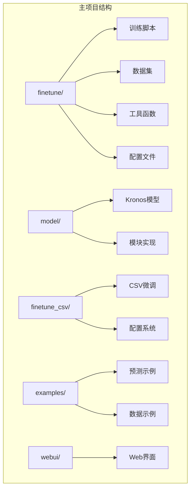
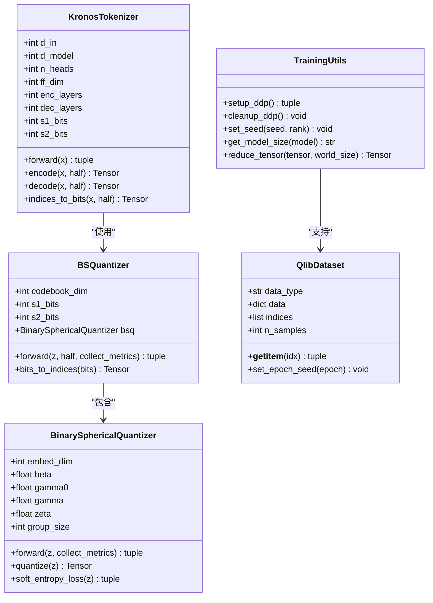
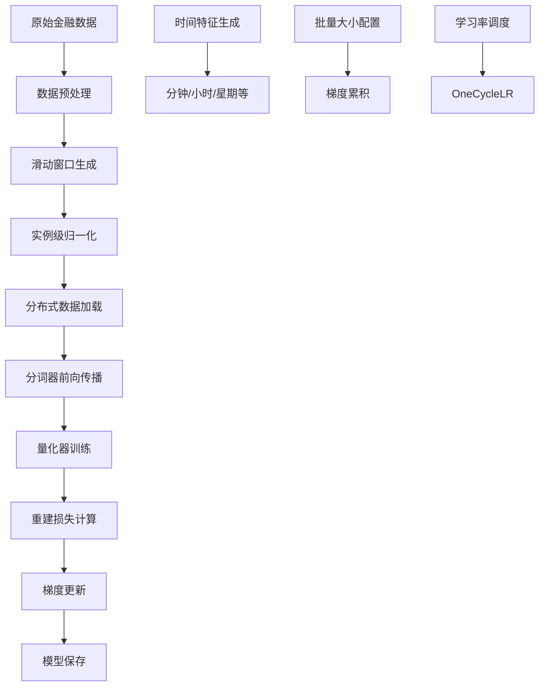
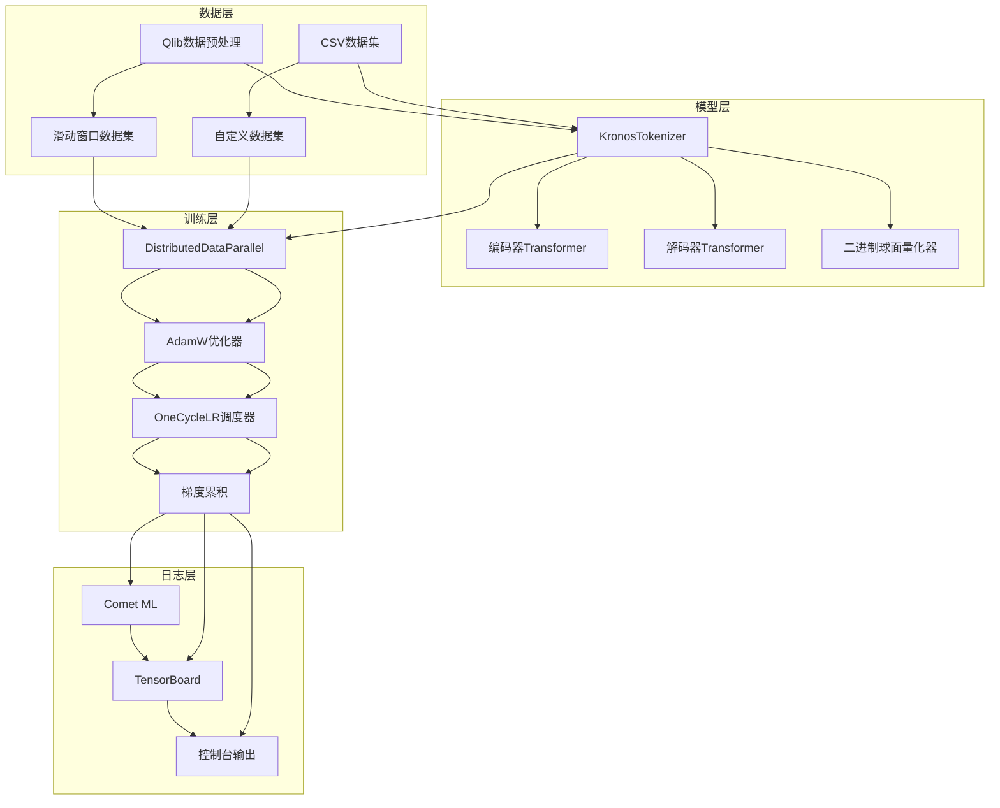
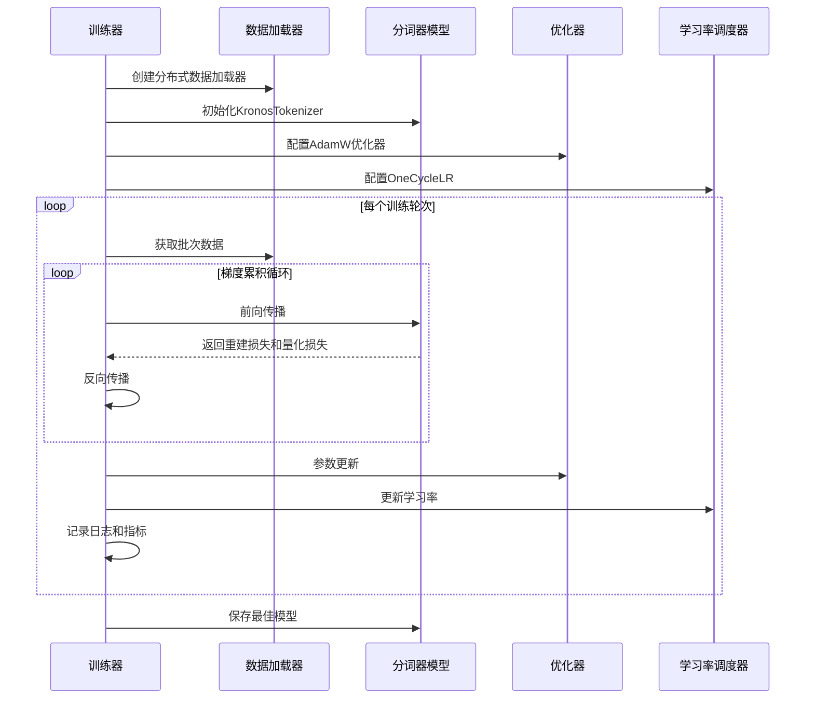
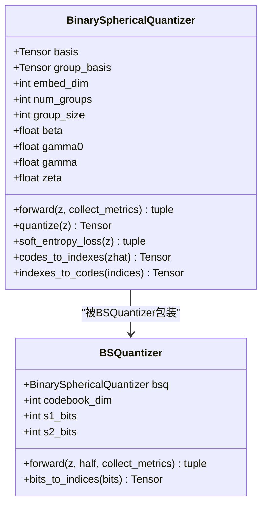
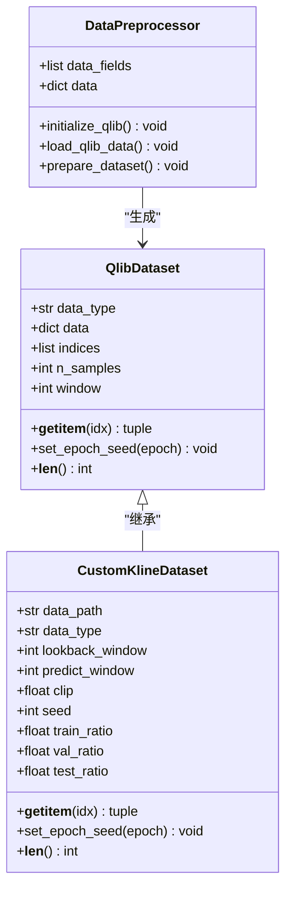
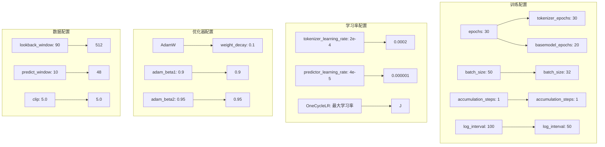
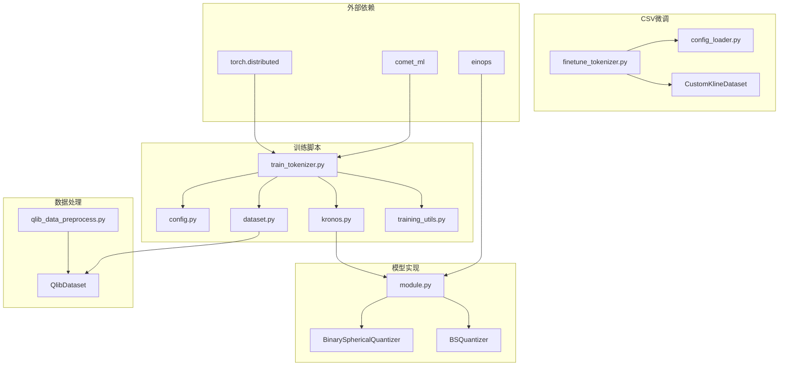
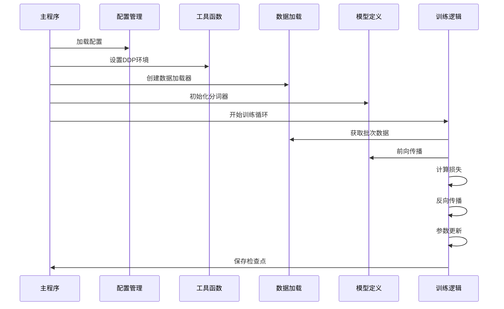

# 分词器微调

<cite>
**本文档引用的文件**
- [finetune/train_tokenizer.py](file://finetune/train_tokenizer.py)
- [finetune/dataset.py](file://finetune/dataset.py)
- [finetune/utils/training_utils.py](file://finetune/utils/training_utils.py)
- [finetune/config.py](file://finetune/config.py)
- [model/kronos.py](file://model/kronos.py)
- [model/module.py](file://model/module.py)
- [finetune/qlib_data_preprocess.py](file://finetune/qlib_data_preprocess.py)
- [finetune_csv/finetune_tokenizer.py](file://finetune_csv/finetune_tokenizer.py)
- [finetune_csv/config_loader.py](file://finetune_csv/config_loader.py)
- [finetune_csv/README.md](file://finetune_csv/README.md)
- [finetune_csv/configs/config_ali09988_candle-5min.yaml](file://finetune_csv/configs/config_ali09988_candle-5min.yaml)
- [README.md](file://README.md)
</cite>

## 目录
1. [简介](#简介)
2. [项目结构](#项目结构)
3. [核心组件](#核心组件)
4. [架构概览](#架构概览)
5. [详细组件分析](#详细组件分析)
6. [依赖关系分析](#依赖关系分析)
7. [性能考虑](#性能考虑)
8. [故障排除指南](#故障排除指南)
9. [结论](#结论)
10. [附录](#附录)

## 简介
本文档提供了Kronos分词器微调的完整指南。Kronos是一个专为金融K线序列设计的基础模型，采用两阶段框架：首先使用专门的分词器将连续的多维K线数据（OHLCV）量化为层次化的离散标记，然后在这些标记上进行预训练，从而能够统一处理多样化的量化任务。

分词器微调是Kronos微调流程中的关键步骤，它使模型能够适应特定领域的数据分布特征。本文档将详细解释分词器训练流程，包括数据加载、量化器训练和模型保存，并深入分析BinarySphericalQuantizer的工作原理和训练过程。

## 项目结构
项目采用模块化设计，主要包含以下核心目录：



**图表来源**
- [README.md:217-338](file://README.md#L217-L338)

**章节来源**
- [README.md:217-338](file://README.md#L217-L338)

## 核心组件
Kronos分词器微调系统由多个核心组件构成，每个组件都有明确的职责和相互关系。

### 主要组件架构



**图表来源**
- [model/kronos.py:13-178](file://model/kronos.py#L13-L178)
- [model/module.py:39-254](file://model/module.py#L39-L254)
- [finetune/dataset.py:9-131](file://finetune/dataset.py#L9-L131)
- [finetune/utils/training_utils.py:9-119](file://finetune/utils/training_utils.py#L9-L119)

### 数据流处理



**图表来源**
- [finetune/dataset.py:50-130](file://finetune/dataset.py#L50-L130)
- [finetune/train_tokenizer.py:126-155](file://finetune/train_tokenizer.py#L126-L155)

**章节来源**
- [model/kronos.py:13-178](file://model/kronos.py#L13-L178)
- [model/module.py:39-254](file://model/module.py#L39-L254)
- [finetune/dataset.py:9-131](file://finetune/dataset.py#L9-L131)
- [finetune/utils/training_utils.py:9-119](file://finetune/utils/training_utils.py#L9-L119)

## 架构概览
Kronos分词器微调系统采用分布式训练架构，支持多GPU并行训练和梯度累积机制。

### 整体训练架构



**图表来源**
- [finetune/train_tokenizer.py:218-282](file://finetune/train_tokenizer.py#L218-L282)
- [finetune_csv/finetune_tokenizer.py:151-278](file://finetune_csv/finetune_tokenizer.py#L151-L278)

### 训练流程时序图



**图表来源**
- [finetune/train_tokenizer.py:74-215](file://finetune/train_tokenizer.py#L74-L215)

**章节来源**
- [finetune/train_tokenizer.py:218-282](file://finetune/train_tokenizer.py#L218-L282)
- [finetune_csv/finetune_tokenizer.py:151-278](file://finetune_csv/finetune_tokenizer.py#L151-L278)

## 详细组件分析

### BinarySphericalQuantizer工作原理
BinarySphericalQuantizer是Kronos分词器的核心量化组件，实现了二进制球面量化算法。

#### 量化器内部结构



**图表来源**
- [model/module.py:39-254](file://model/module.py#L39-L254)

#### 量化过程详解

```mermaid
flowchart TD
A[连续特征表示 z] --> B[归一化处理]
B --> C[符号量化]
C --> D[zhat = sign(z)]
D --> E[可区分量化]
E --> F[zq = z + (zhat - z).detach()]
F --> G[缩放因子应用]
G --> H[计算索引]
H --> I[熵损失计算]
I --> J[承诺损失计算]
J --> K[总损失组合]
K --> L[反向传播]
M[软熵计算] --> N[group-wise距离]
N --> O[概率分布]
O --> P[样本熵]
P --> Q[代码本熵]
Q --> R[熵惩罚项]
S[硬熵计算] --> T[基于计数的熵]
T --> U[直方图统计]
U --> V[硬性熵值]
V --> W[熵惩罚项]
```

**图表来源**
- [model/module.py:90-129](file://model/module.py#L90-L129)
- [model/module.py:131-155](file://model/module.py#L131-L155)

#### 关键参数说明

| 参数名称 | 类型 | 默认值 | 作用描述 |
|---------|------|--------|----------|
| `embed_dim` | int | 代码维度 | 量化器的输入特征维度 |
| `beta` | float | 0.25 | 承诺损失权重，控制重建质量 |
| `gamma0` | float | 1.0 | 样本熵权重，鼓励均匀分布 |
| `gamma` | float | 1.1 | 代码本熵权重，控制覆盖范围 |
| `zeta` | float | 0.05 | 总熵惩罚权重，平衡压缩与信息保留 |
| `group_size` | int | 9 | 组大小，影响计算复杂度 |
| `l2_norm` | bool | True | 是否使用L2归一化 |

**章节来源**
- [model/module.py:39-254](file://model/module.py#L39-L254)

### 数据加载与预处理
数据加载系统支持两种数据源：Qlib金融数据库和自定义CSV格式。

#### 数据集类设计



**图表来源**
- [finetune/dataset.py:9-131](file://finetune/dataset.py#L9-L131)
- [finetune_csv/finetune_tokenizer.py:93-148](file://finetune_csv/finetune_tokenizer.py#L93-L148)
- [finetune/qlib_data_preprocess.py:14-122](file://finetune/qlib_data_preprocess.py#L14-L122)

#### 数据预处理流程

```mermaid
flowchart TD
A[原始金融数据] --> B[Qlib数据加载]
A --> C[CSV数据读取]
B --> D[数据字段提取]
C --> D
D --> E[缺失值处理]
E --> F[OHLCV特征计算]
F --> G[交易量和金额计算]
G --> H[时间戳处理]
H --> I[滑动窗口生成]
I --> J[实例级归一化]
J --> K[数据分割]
K --> L[训练集 (90%)]
K --> M[验证集 (10%)]
K --> N[测试集 (0%)]
L --> O[Pickle文件保存]
M --> O
N --> O
```

**图表来源**
- [finetune/qlib_data_preprocess.py:30-122](file://finetune/qlib_data_preprocess.py#L30-L122)
- [finetune/dataset.py:50-130](file://finetune/dataset.py#L50-L130)

**章节来源**
- [finetune/dataset.py:9-131](file://finetune/dataset.py#L9-L131)
- [finetune/qlib_data_preprocess.py:14-122](file://finetune/qlib_data_preprocess.py#L14-L122)

### 训练配置与超参数
训练系统提供了灵活的配置选项，支持多种训练场景。

#### 配置参数体系



**图表来源**
- [finetune/config.py:48-107](file://finetune/config.py#L48-L107)
- [finetune_csv/configs/config_ali09988_candle-5min.yaml:15-32](file://finetune_csv/configs/config_ali09988_candle-5min.yaml#L15-L32)

#### 超参数调优建议

| 参数类别 | 推荐范围 | 调优策略 | 影响说明 |
|---------|----------|----------|----------|
| `batch_size` | 16-128 | 从较小值开始，按GPU内存调整 | 影响收敛稳定性和训练速度 |
| `learning_rate` | 1e-5-1e-3 | 使用学习率范围测试 | 太高导致不稳定，太低收敛慢 |
| `accumulation_steps` | 1-8 | 根据有效batch_size调整 | 平衡内存使用和梯度稳定性 |
| `beta` | 0.01-0.5 | 从0.25开始，根据重建质量调整 | 控制重建损失权重 |
| `gamma0/gamma/zeta` | 0.1-2.0 | 协同调整，保持平衡 | 控制熵损失的三个组成部分 |

**章节来源**
- [finetune/config.py:48-107](file://finetune/config.py#L48-L107)
- [finetune_csv/configs/config_ali09988_candle-5min.yaml:15-32](file://finetune_csv/configs/config_ali09988_candle-5min.yaml#L15-L32)

## 依赖关系分析

### 模块间依赖关系



**图表来源**
- [finetune/train_tokenizer.py:17-29](file://finetune/train_tokenizer.py#L17-L29)
- [model/kronos.py:9-10](file://model/kronos.py#L9-L10)
- [model/module.py:3-7](file://model/module.py#L3-L7)

### 训练脚本依赖链



**图表来源**
- [finetune/train_tokenizer.py:218-282](file://finetune/train_tokenizer.py#L218-L282)

**章节来源**
- [finetune/train_tokenizer.py:17-29](file://finetune/train_tokenizer.py#L17-L29)
- [model/kronos.py:9-10](file://model/kronos.py#L9-L10)
- [model/module.py:3-7](file://model/module.py#L3-L7)

## 性能考虑

### 内存优化策略
1. **梯度累积**: 通过增加`accumulation_steps`在有限GPU内存下增大有效batch size
2. **混合精度训练**: 建议启用AMP以减少内存占用
3. **数据预取**: 使用`pin_memory=True`和合适的`num_workers`加速数据传输
4. **分布式训练**: 利用多GPU并行减少单卡内存压力

### 训练效率优化
1. **学习率调度**: OneCycleLR提供动态学习率调整，提高收敛速度
2. **梯度裁剪**: 使用`clip_grad_norm_=2.0`防止梯度爆炸
3. **早期停止**: 基于验证损失监控过拟合
4. **检查点保存**: 定期保存最佳模型避免训练中断损失

### 硬件要求建议
- **单GPU**: 至少16GB显存，适合小规模数据集
- **多GPU**: 8GB以上显存即可，推荐使用NVIDIA RTX 4090或A100
- **CPU**: 32GB+内存，32核以上CPU
- **存储**: SSD至少500GB剩余空间

## 故障排除指南

### 常见问题及解决方案

#### 1. 分布式训练问题
**问题**: `torch.distributed`初始化失败
**解决方案**:
- 确保使用`torchrun`启动训练脚本
- 检查网络连接和端口可用性
- 验证NCCL后端配置

**章节来源**
- [finetune/train_tokenizer.py:277-278](file://finetune/train_tokenizer.py#L277-L278)

#### 2. 内存不足问题
**问题**: CUDA out of memory错误
**解决方案**:
- 减小`batch_size`或增加`accumulation_steps`
- 降低`lookback_window`或`predict_window`
- 启用梯度检查点（需要修改模型代码）

#### 3. 数据加载问题
**问题**: 数据集为空或索引错误
**解决方案**:
- 验证数据路径和文件格式
- 检查时间范围配置是否正确
- 确认数据预处理脚本已成功执行

#### 4. 模型保存问题
**问题**: 检查点保存失败
**解决方案**:
- 确保保存目录具有写权限
- 检查磁盘空间是否充足
- 验证路径配置正确性

#### 5. 训练不收敛问题
**问题**: 验证损失不下降或发散
**解决方案**:
- 降低学习率或调整权重衰减
- 检查数据预处理是否正确
- 验证梯度累积设置是否合理

**章节来源**
- [finetune/train_tokenizer.py:156-170](file://finetune/train_tokenizer.py#L156-L170)
- [finetune/utils/training_utils.py:83-102](file://finetune/utils/training_utils.py#L83-L102)

## 结论
Kronos分词器微调系统提供了完整的金融时间序列建模解决方案。通过精心设计的两阶段框架和先进的二进制球面量化技术，该系统能够有效地将连续的多维金融数据转换为层次化的离散标记表示。

关键优势包括：
1. **强大的量化能力**: BinarySphericalQuantizer实现高效的无损压缩
2. **灵活的训练架构**: 支持分布式训练和梯度累积
3. **完善的配置系统**: 提供全面的超参数调优选项
4. **丰富的数据支持**: 兼容Qlib和自定义CSV格式

建议在实际部署中重点关注数据质量、硬件资源配置和超参数调优，以获得最佳的训练效果和推理性能。

## 附录

### 训练脚本使用指南

#### 基础训练命令
```bash
# 单GPU训练
python finetune/train_tokenizer.py

# 多GPU分布式训练
torchrun --standalone --nproc_per_node=4 finetune/train_tokenizer.py
```

#### CSV数据微调
```bash
# 完整训练流程
python finetune_csv/train_sequential.py --config configs/config_ali09988_candle-5min.yaml

# 仅训练分词器
python finetune_csv/finetune_tokenizer.py --config configs/config_ali09988_candle-5min.yaml
```

#### 配置文件示例
参考文件路径：`finetune_csv/configs/config_ali09988_candle-5min.yaml`

### 模型保存格式
训练完成后，模型检查点保存在以下结构中：
```
{save_path}/{experiment_name}/tokenizer/best_model/
├── config.json          # 模型配置
├── pytorch_model.bin    # 模型权重
└── tokenizer_config.json # 分词器配置
```

### 性能基准
- **训练速度**: 单GPU约2-5分钟/epoch（取决于数据规模）
- **内存占用**: 16GB显存可处理batch_size=32的数据集
- **收敛性**: 通常在10-30个epoch内达到稳定性能