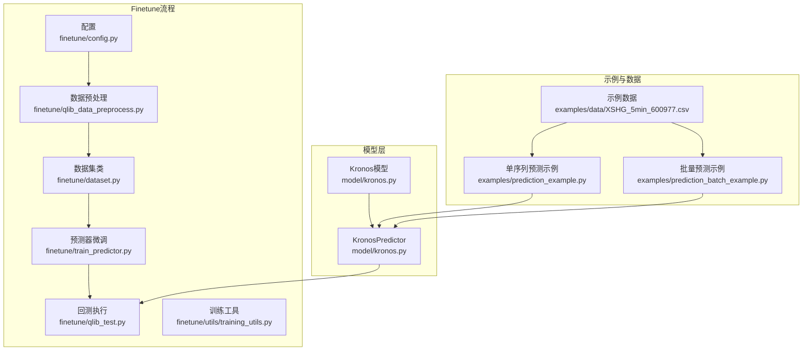
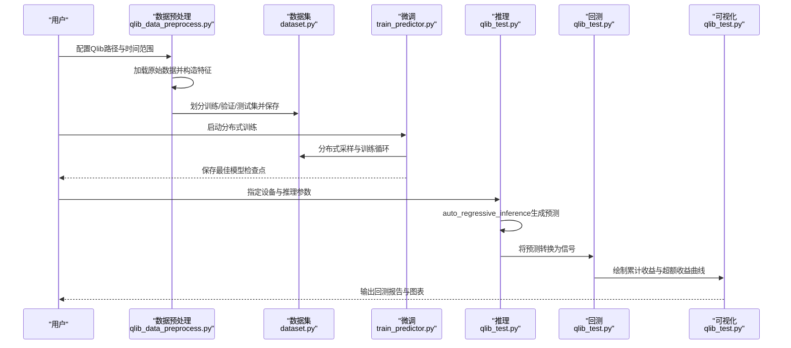
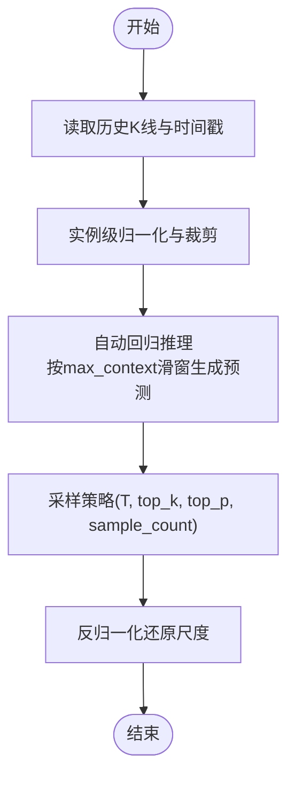
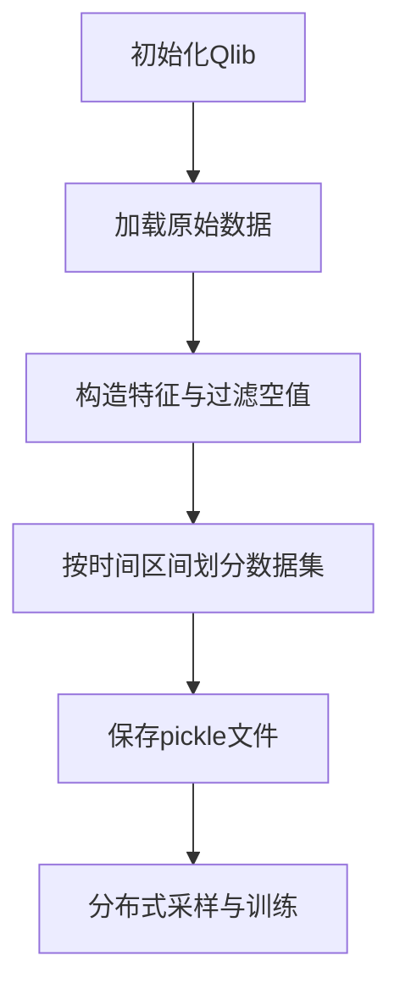
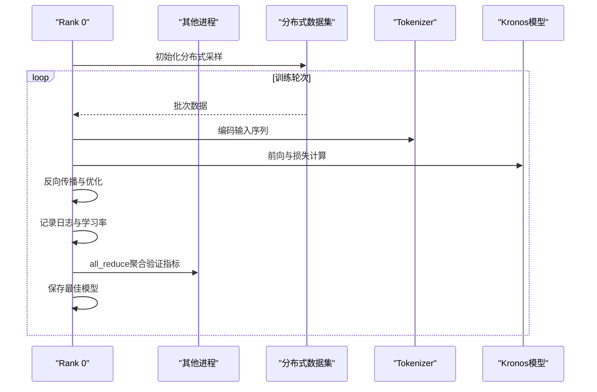
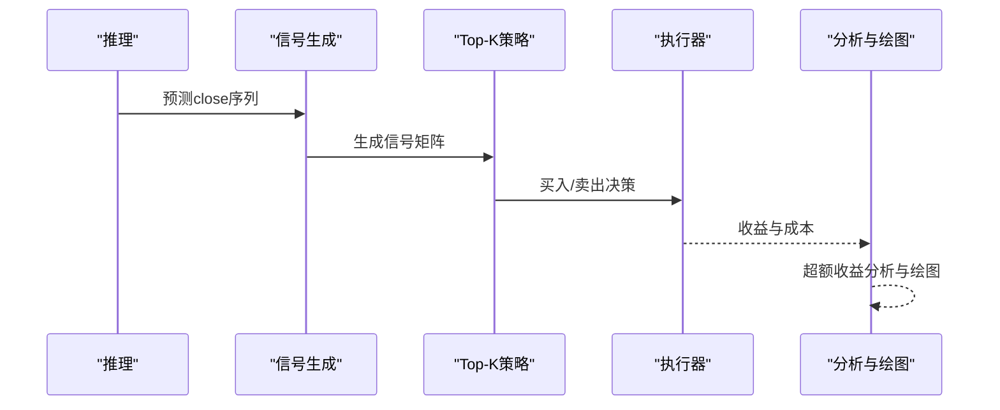
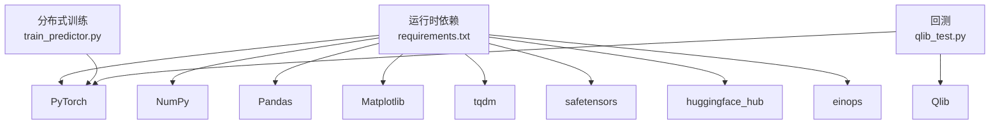

# 回测和评估

<cite>
**本文引用的文件列表**
- [README.md](file://README.md)
- [requirements.txt](file://requirements.txt)
- [model/kronos.py](file://model/kronos.py)
- [examples/prediction_example.py](file://examples/prediction_example.py)
- [examples/prediction_batch_example.py](file://examples/prediction_batch_example.py)
- [finetune/config.py](file://finetune/config.py)
- [finetune/dataset.py](file://finetune/dataset.py)
- [finetune/qlib_data_preprocess.py](file://finetune/qlib_data_preprocess.py)
- [finetune/qlib_test.py](file://finetune/qlib_test.py)
- [finetune/train_predictor.py](file://finetune/train_predictor.py)
- [finetune/utils/training_utils.py](file://finetune/utils/training_utils.py)
- [examples/data/XSHG_5min_600977.csv](file://examples/data/XSHG_5min_600977.csv)
</cite>

## 目录
1. [简介](#简介)
2. [项目结构](#项目结构)
3. [核心组件](#核心组件)
4. [架构总览](#架构总览)
5. [详细组件分析](#详细组件分析)
6. [依赖关系分析](#依赖关系分析)
7. [性能考量](#性能考量)
8. [故障排查指南](#故障排查指南)
9. [结论](#结论)
10. [附录](#附录)

## 简介
本指南围绕Kronos模型在金融市场的回测与评估展开，系统阐述从预测到回测的完整流程：包括数据准备、模型推理、交易信号生成、投资组合构建、收益计算与风险评估、基准对比以及结果可视化。文档基于仓库中的Finetune与示例脚本，提供可操作的参数配置、样本选择策略与性能分析报告生成方法，帮助读者快速搭建生产级回测流水线。

## 项目结构
Kronos项目采用模块化组织，核心预测逻辑位于model目录，Finetune流程位于finetune目录，示例脚本位于examples目录，数据样例位于examples/data目录。整体结构如下：
- model/kronos.py：Kronos模型、分词器、预测器与推理函数
- finetune/config.py：训练与回测配置（时间窗口、特征、路径等）
- finetune/dataset.py：Qlib数据集加载与滑窗采样
- finetune/qlib_data_preprocess.py：Qlib数据预处理与划分
- finetune/qlib_test.py：回测主流程（信号生成、Top-K策略、基准对比、绘图）
- finetune/train_predictor.py：预测器微调（DDP分布式训练）
- finetune/utils/training_utils.py：分布式训练工具（DDP、随机种子、模型大小统计）
- examples/prediction_example.py / prediction_batch_example.py：单序列与批量预测示例
- examples/data/XSHG_5min_600977.csv：示例K线数据

图表来源
- [model/kronos.py:180-663](file://model/kronos.py#L180-L663)
- [finetune/config.py:1-132](file://finetune/config.py#L1-L132)
- [finetune/dataset.py:1-146](file://finetune/dataset.py#L1-L146)
- [finetune/qlib_data_preprocess.py:1-131](file://finetune/qlib_data_preprocess.py#L1-L131)
- [finetune/qlib_test.py:1-363](file://finetune/qlib_test.py#L1-L363)
- [finetune/train_predictor.py:1-245](file://finetune/train_predictor.py#L1-L245)
- [finetune/utils/training_utils.py:1-119](file://finetune/utils/training_utils.py#L1-L119)
- [examples/prediction_example.py:1-81](file://examples/prediction_example.py#L1-L81)
- [examples/prediction_batch_example.py:1-73](file://examples/prediction_batch_example.py#L1-L73)
- [examples/data/XSHG_5min_600977.csv:1-800](file://examples/data/XSHG_5min_600977.csv#L1-L800)

章节来源
- [README.md:1-338](file://README.md#L1-L338)
- [requirements.txt:1-11](file://requirements.txt#L1-L11)

## 核心组件
- 预测器KronosPredictor：封装数据归一化、时间戳特征提取、自动回归推理与反归一化，支持单序列与批量预测
- 自动回归推理auto_regressive_inference：按最大上下文长度滑窗生成未来多步预测，支持温度与top-k/top-p采样
- QlibBacktest：基于Qlib的回测框架，Top-K策略、交易成本建模、基准对比与累计收益曲线绘制
- QlibDataset/QlibDataPreprocessor：滑窗采样、实例级归一化、训练/验证/测试集划分与保存
- 训练工具training_utils：DDP初始化、随机种子设置、模型参数量统计、张量规约

章节来源
- [model/kronos.py:482-663](file://model/kronos.py#L482-L663)
- [model/kronos.py:389-470](file://model/kronos.py#L389-L470)
- [finetune/qlib_test.py:96-201](file://finetune/qlib_test.py#L96-L201)
- [finetune/dataset.py:9-146](file://finetune/dataset.py#L9-L146)
- [finetune/qlib_data_preprocess.py:14-131](file://finetune/qlib_data_preprocess.py#L14-L131)
- [finetune/utils/training_utils.py:9-119](file://finetune/utils/training_utils.py#L9-L119)

## 架构总览
下图展示从数据到回测的端到端流程：数据预处理→模型微调→推理→信号生成→回测→可视化。

图表来源
- [finetune/qlib_data_preprocess.py:14-131](file://finetune/qlib_data_preprocess.py#L14-L131)
- [finetune/dataset.py:23-131](file://finetune/dataset.py#L23-L131)
- [finetune/train_predictor.py:60-179](file://finetune/train_predictor.py#L60-L179)
- [finetune/qlib_test.py:207-361](file://finetune/qlib_test.py#L207-L361)

## 详细组件分析

### 预测器与自动回归推理
- 数据预处理：价格列['open','high','low','close']与可选['volume','amount']；缺失volume/amount时以0填充或按均价估算；时间戳转为分钟、小时、星期、日、月五维特征
- 归一化：按序列均值与标准差进行实例级归一化，并裁剪至[-clip,clip]
- 自动回归推理：按max_context滑窗，逐步生成未来pred_len步预测，支持温度T、top_k、top_p采样与sample_count平均
- 反归一化：将预测结果还原到原始尺度

图表来源
- [model/kronos.py:482-560](file://model/kronos.py#L482-L560)
- [model/kronos.py:389-470](file://model/kronos.py#L389-L470)

章节来源
- [model/kronos.py:482-560](file://model/kronos.py#L482-L560)
- [model/kronos.py:389-470](file://model/kronos.py#L389-L470)

### 数据集与预处理
- QlibDataPreprocessor：加载指定instrument与时间范围的数据，构造特征（vol、amt），过滤空值，按配置的时间区间划分训练/验证/测试集并pickle保存
- QlibDataset：预计算所有可能的滑窗起始索引，按epoch随机采样，返回实例级归一化的特征与时间特征

图表来源
- [finetune/qlib_data_preprocess.py:25-121](file://finetune/qlib_data_preprocess.py#L25-L121)
- [finetune/dataset.py:23-131](file://finetune/dataset.py#L23-L131)

章节来源
- [finetune/qlib_data_preprocess.py:14-131](file://finetune/qlib_data_preprocess.py#L14-L131)
- [finetune/dataset.py:9-146](file://finetune/dataset.py#L9-L146)

### 微调与分布式训练
- 训练流程：分布式数据加载、tokenizer在线编码、语言模型前向、损失计算与优化、验证集聚合与最佳模型保存
- 优化器与调度器：AdamW、OneCycleLR
- 日志与检查点：Comet ML可选记录，最终汇总JSON保存

图表来源
- [finetune/train_predictor.py:29-179](file://finetune/train_predictor.py#L29-L179)
- [finetune/utils/training_utils.py:9-32](file://finetune/utils/training_utils.py#L9-L32)

章节来源
- [finetune/train_predictor.py:60-179](file://finetune/train_predictor.py#L60-L179)
- [finetune/utils/training_utils.py:9-119](file://finetune/utils/training_utils.py#L9-L119)

### 回测与信号生成
- 信号生成：使用预测close与历史close构造信号（last、mean、max、min等），形成多资产多时点的信号矩阵
- Top-K策略：按信号排序选择持有股票数量与丢弃数量，设置最小持有期
- 交易成本与基准：模拟器执行器建模买卖手续费、滑点与最小费用，基准为配置的指数
- 结果分析：累计基准收益、累计策略收益与累计超额收益（含/不含成本）

图表来源
- [finetune/qlib_test.py:96-201](file://finetune/qlib_test.py#L96-L201)
- [finetune/qlib_test.py:239-361](file://finetune/qlib_test.py#L239-L361)

章节来源
- [finetune/qlib_test.py:96-201](file://finetune/qlib_test.py#L96-L201)
- [finetune/qlib_test.py:239-361](file://finetune/qlib_test.py#L239-L361)

## 依赖关系分析
- 运行时依赖：PyTorch≥2.0、NumPy、Pandas、Matplotlib、tqdm、safetensors、huggingface_hub、einops
- 分布式训练：NCCL后端、torch.distributed
- 数据与回测：Qlib（数据加载）、QLib回测框架（策略、执行器、分析）

图表来源
- [requirements.txt:1-11](file://requirements.txt#L1-L11)
- [finetune/train_predictor.py:1-245](file://finetune/train_predictor.py#L1-L245)
- [finetune/qlib_test.py:1-363](file://finetune/qlib_test.py#L1-L363)

章节来源
- [requirements.txt:1-11](file://requirements.txt#L1-L11)
- [finetune/train_predictor.py:1-245](file://finetune/train_predictor.py#L1-L245)
- [finetune/qlib_test.py:1-363](file://finetune/qlib_test.py#L1-L363)

## 性能考量
- 上下文长度与批大小：max_context与batch_size影响显存占用与吞吐；建议根据GPU显存调整
- 采样策略：T、top_k、top_p与sample_count控制预测多样性与稳定性
- 分布式训练：DDP多卡训练提升吞吐，注意同步与梯度规约
- 归一化与裁剪：clip防止异常值影响训练稳定性
- 推理效率：auto_regressive_inference采用滑窗与缓冲区滚动，避免重复计算

章节来源
- [model/kronos.py:389-470](file://model/kronos.py#L389-L470)
- [finetune/train_predictor.py:60-179](file://finetune/train_predictor.py#L60-L179)
- [finetune/utils/training_utils.py:9-32](file://finetune/utils/training_utils.py#L9-L32)

## 故障排查指南
- 设备与CUDA：若未指定设备，自动检测CUDA/MPS/CPU；确保驱动与CUDA版本兼容
- 数据完整性：预测前检查DataFrame列名与NaN；缺失volume/amount会自动填充
- 分布式环境：torchrun启动失败或环境变量缺失会导致DDP初始化报错
- Qlib数据路径：需正确配置qlib_data_path与instrument，否则无法加载数据
- 回测时间范围：backtest_time_range需覆盖test_data中时间范围，避免空集

章节来源
- [model/kronos.py:482-560](file://model/kronos.py#L482-L560)
- [finetune/qlib_test.py:302-361](file://finetune/qlib_test.py#L302-L361)
- [finetune/config.py:12-38](file://finetune/config.py#L12-L38)
- [finetune/utils/training_utils.py:9-32](file://finetune/utils/training_utils.py#L9-L32)

## 结论
Kronos提供了从数据预处理、模型微调到回测评估的完整链路。通过配置化参数与模块化组件，用户可在A-share市场等场景下快速落地量化策略回测。建议在生产环境中进一步引入组合优化、风险因子中性化、交易成本与冲击模型精细化，以获得更稳健的实盘表现。

## 附录

### 回测参数配置清单
- 数据与特征
  - qlib_data_path：本地Qlib数据目录
  - instrument：标的指数（如csi300）
  - dataset_begin_time/dataset_end_time：数据加载时间范围
  - feature_list/time_feature_list：特征列与时间特征
- 窗口与上下文
  - lookback_window：历史窗口长度
  - predict_window：预测窗口长度
  - max_context：模型最大上下文长度
- 训练超参
  - clip：归一化裁剪阈值
  - batch_size/epochs/log_interval：批次大小、轮数、日志间隔
  - tokenizer_learning_rate/predictor_learning_rate：学习率
  - adam_beta1/adam_beta2/adam_weight_decay：优化器参数
- 回测与推理
  - backtest_time_range：回测时间范围
  - backtest_n_symbol_hold/backtest_n_symbol_drop/backtest_hold_thresh：Top-K策略参数
  - inference_T/inference_top_p/inference_top_k/inference_sample_count：推理采样参数
  - backtest_benchmark：基准指数代码

章节来源
- [finetune/config.py:12-132](file://finetune/config.py#L12-L132)

### 样本选择策略
- 时间切分：训练/验证/测试按时间顺序切分，避免数据泄漏
- 滑窗采样：按lookback_window+predict_window+1生成样本，支持随机采样与epoch种子
- 多资产：按symbol维度独立处理，仅保留有效序列

章节来源
- [finetune/qlib_data_preprocess.py:85-121](file://finetune/qlib_data_preprocess.py#L85-L121)
- [finetune/dataset.py:77-131](file://finetune/dataset.py#L77-L131)

### 结果可视化方法
- 累计收益曲线：策略累计收益与基准收益叠加对比
- 累计超额收益：考虑交易成本的超额收益曲线
- 图表保存：默认保存至figures目录

章节来源
- [finetune/qlib_test.py:164-201](file://finetune/qlib_test.py#L164-L201)

### 完整回测脚本示例
- 单序列预测示例：examples/prediction_example.py
- 批量预测示例：examples/prediction_batch_example.py
- 回测执行：finetune/qlib_test.py（命令行参数--device指定GPU）

章节来源
- [examples/prediction_example.py:1-81](file://examples/prediction_example.py#L1-L81)
- [examples/prediction_batch_example.py:1-73](file://examples/prediction_batch_example.py#L1-L73)
- [finetune/qlib_test.py:302-361](file://finetune/qlib_test.py#L302-L361)