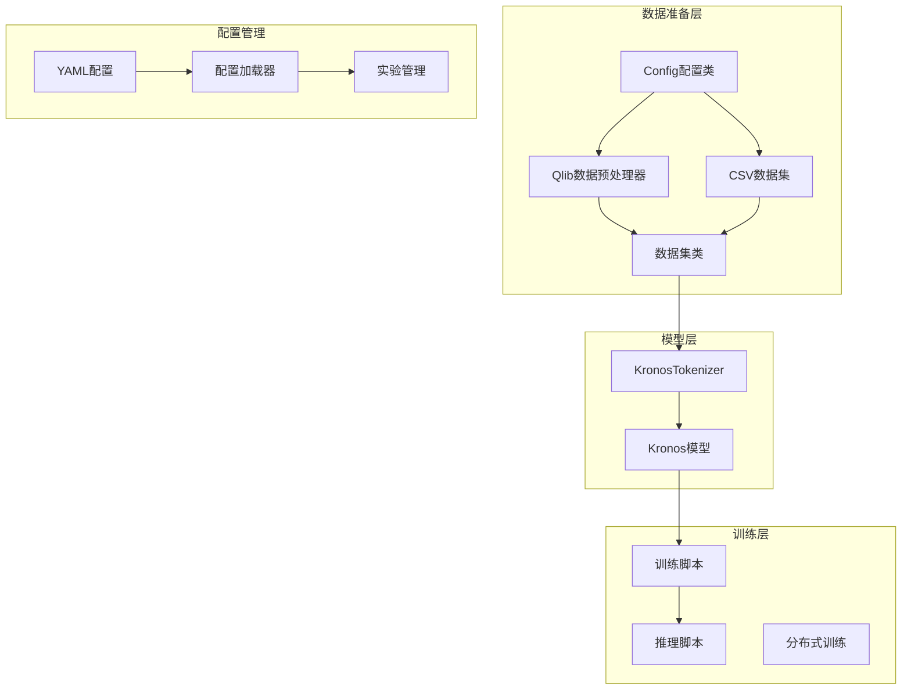
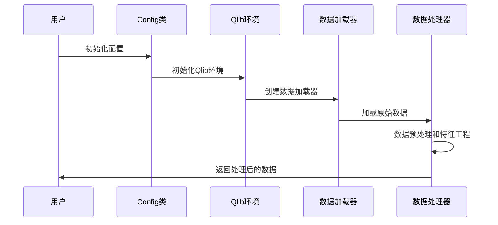
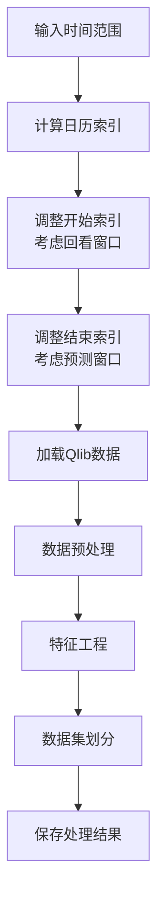
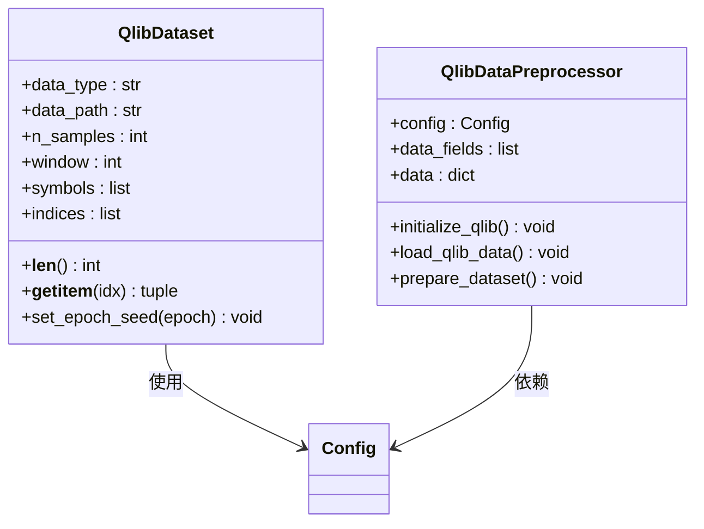
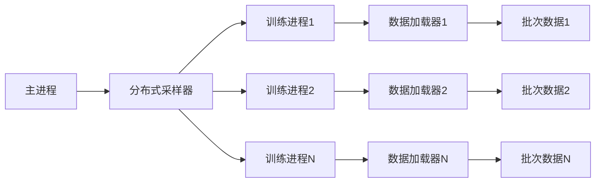
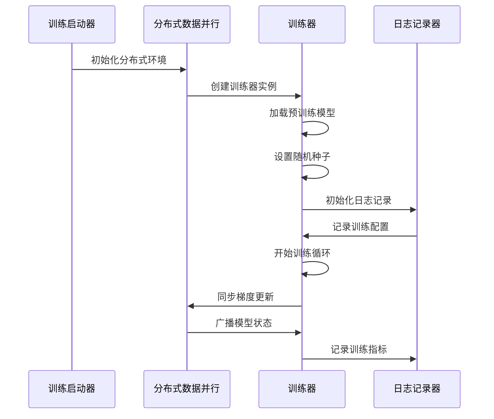
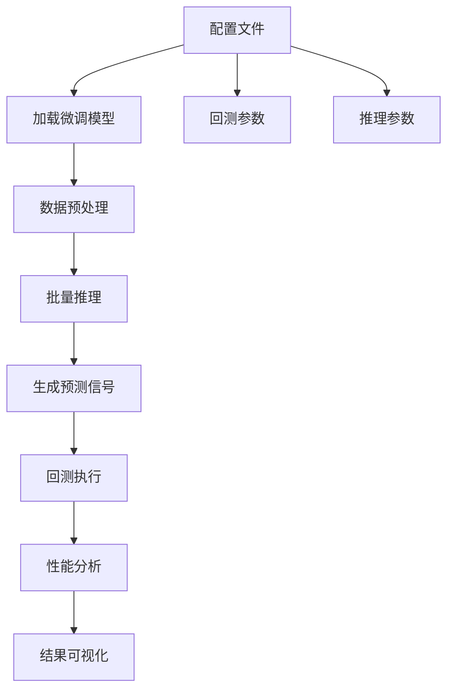

# 数据准备和配置

<cite>
**本文档引用的文件**
- [finetune/config.py](file://finetune/config.py)
- [finetune/qlib_data_preprocess.py](file://finetune/qlib_data_preprocess.py)
- [finetune/dataset.py](file://finetune/dataset.py)
- [finetune/train_predictor.py](file://finetune/train_predictor.py)
- [finetune/train_tokenizer.py](file://finetune/train_tokenizer.py)
- [finetune/qlib_test.py](file://finetune/qlib_test.py)
- [finetune/utils/training_utils.py](file://finetune/utils/training_utils.py)
- [finetune_csv/config_loader.py](file://finetune_csv/config_loader.py)
- [finetune_csv/configs/config_ali09988_candle-5min.yaml](file://finetune_csv/configs/config_ali09988_candle-5min.yaml)
- [finetune_csv/finetune_base_model.py](file://finetune_csv/finetune_base_model.py)
- [finetune_csv/finetune_tokenizer.py](file://finetune_csv/finetune_tokenizer.py)
- [model/kronos.py](file://model/kronos.py)
- [examples/data/XSHG_5min_600977.csv](file://examples/data/XSHG_5min_600977.csv)
</cite>

## 目录
1. [简介](#简介)
2. [项目结构](#项目结构)
3. [核心配置类详解](#核心配置类详解)
4. [Qlib数据集成方案](#qlib数据集成方案)
5. [数据准备流程](#数据准备流程)
6. [训练配置与最佳实践](#训练配置与最佳实践)
7. [配置示例与模板](#配置示例与模板)
8. [故障排除指南](#故障排除指南)
9. [总结](#总结)

## 简介

Kronos模型微调项目提供了完整的金融时间序列数据准备和配置解决方案。该项目支持两种数据源：Qlib金融数据库和自定义CSV格式数据，为深度学习模型训练提供了灵活的数据处理管道。

本项目的核心目标是为Kronos模型提供高质量的训练数据，包括数据预处理、特征工程、数据集划分和分布式训练支持。通过统一的配置管理系统，用户可以轻松地调整训练参数、数据路径和模型架构。

## 项目结构

项目采用模块化设计，主要包含以下核心组件：



**图表来源**
- [finetune/config.py:1-132](file://finetune/config.py#L1-132)
- [finetune/qlib_data_preprocess.py:1-131](file://finetune/qlib_data_preprocess.py#L1-131)
- [finetune_csv/config_loader.py:1-268](file://finetune_csv/config_loader.py#L1-268)

**章节来源**
- [finetune/config.py:1-132](file://finetune/config.py#L1-132)
- [finetune/qlib_data_preprocess.py:1-131](file://finetune/qlib_data_preprocess.py#L1-131)
- [finetune_csv/config_loader.py:1-268](file://finetune_csv/config_loader.py#L1-268)

## 核心配置类详解

### Config类配置参数体系

Config类是整个项目的配置中心，提供了全面的参数管理功能：

#### 数据与特征参数
- **qlib_data_path**: Qlib数据目录路径，默认指向`~/.qlib/qlib_data/cn_data`
- **instrument**: 金融市场指数标识符，默认`csi300`
- **feature_list**: 主要特征列表，包含`['open', 'high', 'low', 'close', 'vol', 'amt']`
- **time_feature_list**: 时间特征列表，包含`['minute', 'hour', 'weekday', 'day', 'month']`

#### 时间窗口参数
- **lookback_window**: 回看窗口大小，默认90（过去90个时间步）
- **predict_window**: 预测窗口大小，默认10（未来10个时间步）
- **max_context**: 模型最大上下文长度，默认512

#### 数据集划分策略
- **train_time_range**: 训练集时间范围`["2011-01-01", "2022-12-31"]`
- **val_time_range**: 验证集时间范围`["2022-09-01", "2024-06-30"]`
- **test_time_range**: 测试集时间范围`["2024-04-01", "2025-06-05"]`
- **backtest_time_range**: 回测时间范围`["2024-07-01", "2025-06-05"]`

#### 训练超参数
- **clip**: 数据标准化截断值，默认5.0
- **epochs**: 训练轮数，默认30
- **batch_size**: 批次大小，默认50
- **accumulation_steps**: 梯度累积步数，默认1

#### 优化器参数
- **tokenizer_learning_rate**: Tokenizer学习率，默认2e-4
- **predictor_learning_rate**: Predictor学习率，默认4e-5
- **adam_beta1**: Adam优化器β1参数，默认0.9
- **adam_beta2**: Adam优化器β2参数，默认0.95
- **adam_weight_decay**: 权重衰减，默认0.1

#### 实验日志与保存
- **use_comet**: 是否使用Comet ML日志，默认True
- **save_path**: 模型保存基础路径，默认`"./outputs/models"`
- **dataset_path**: 处理后数据集保存路径，默认`"./data/processed_datasets"`

**章节来源**
- [finetune/config.py:8-132](file://finetune/config.py#L8-132)

### 自定义CSV配置系统

对于自定义CSV数据，项目提供了更加灵活的配置管理系统：

#### YAML配置结构
- **data**: 数据源配置
  - `data_path`: CSV文件路径
  - `lookback_window`: 回看窗口
  - `predict_window`: 预测窗口
  - `max_context`: 上下文长度
  - `clip`: 截断值
  - `train_ratio`, `val_ratio`, `test_ratio`: 数据集划分比例

- **training**: 训练配置
  - `tokenizer_epochs`: Tokenizer训练轮数
  - `basemodel_epochs`: 基础模型训练轮数
  - `batch_size`: 批次大小
  - `learning_rate`: 学习率配置

- **model_paths**: 模型路径配置
  - `pretrained_tokenizer`: 预训练Tokenizer路径
  - `pretrained_predictor`: 预训练Predictor路径
  - `exp_name`: 实验名称
  - `base_path`: 基础保存路径

**章节来源**
- [finetune_csv/configs/config_ali09988_candle-5min.yaml:1-73](file://finetune_csv/configs/config_ali09988_candle-5min.yaml#L1-73)
- [finetune_csv/config_loader.py:109-268](file://finetune_csv/config_loader.py#L109-268)

## Qlib数据集成方案

### Qlib初始化与配置

Qlib数据集成提供了专业的金融数据处理能力：



**图表来源**
- [finetune/qlib_data_preprocess.py:25-129](file://finetune/qlib_data_preprocess.py#L25-129)

### 数据加载流程

Qlib数据预处理器的工作流程如下：

1. **环境初始化**: 使用`qlib.init()`初始化Qlib环境，指定数据提供者URI和区域设置
2. **数据加载**: 通过`QlibDataLoader`加载原始金融数据
3. **数据转换**: 将数据从宽格式转换为长格式，便于后续处理
4. **特征工程**: 计算衍生特征，如交易金额等
5. **数据过滤**: 移除数据不足的股票符号
6. **时间范围调整**: 根据回看窗口和预测窗口调整实际加载的时间范围

### 时间窗口处理机制



**图表来源**
- [finetune/qlib_data_preprocess.py:35-84](file://finetune/qlib_data_preprocess.py#L35-84)

**章节来源**
- [finetune/qlib_data_preprocess.py:14-131](file://finetune/qlib_data_preprocess.py#L14-131)

## 数据准备流程

### 数据集类实现

数据集类提供了高效的数据采样和批处理机制：



**图表来源**
- [finetune/dataset.py:9-146](file://finetune/dataset.py#L9-146)
- [finetune/qlib_data_preprocess.py:14-131](file://finetune/qlib_data_preprocess.py#L14-131)

### 数据预处理步骤

1. **数据加载**: 从Qlib数据库加载原始金融数据
2. **数据重塑**: 将数据转换为适合机器学习的格式
3. **特征计算**: 计算衍生特征，如交易金额
4. **数据清洗**: 过滤缺失值和异常值
5. **时间特征生成**: 从时间戳中提取分钟、小时、星期等特征
6. **数据集划分**: 按时间顺序划分训练、验证和测试集

### 分布式数据加载



**图表来源**
- [finetune/train_predictor.py:29-57](file://finetune/train_predictor.py#L29-57)
- [finetune/train_tokenizer.py:32-71](file://finetune/train_tokenizer.py#L32-71)

**章节来源**
- [finetune/dataset.py:9-146](file://finetune/dataset.py#L9-146)
- [finetune/train_predictor.py:29-57](file://finetune/train_predictor.py#L29-57)
- [finetune/train_tokenizer.py:32-71](file://finetune/train_tokenizer.py#L32-71)

## 训练配置与最佳实践

### 分布式训练配置

项目支持多GPU分布式训练，提供了完整的训练基础设施：

#### 训练脚本架构



**图表来源**
- [finetune/train_predictor.py:182-245](file://finetune/train_predictor.py#L182-245)
- [finetune/train_tokenizer.py:281-360](file://finetune/train_tokenizer.py#L281-360)

### 训练超参数调优

#### 学习率调度
- **OneCycleLR**: 采用动态学习率调度策略
- **预热阶段**: 前3%的训练周期内线性增加学习率
- **峰值学习率**: 对应于配置文件中的学习率设置

#### 梯度累积
- **accumulation_steps**: 支持梯度累积以模拟更大的批次大小
- **内存优化**: 在显存有限的情况下提高训练效率

#### 数据标准化
- **实例级标准化**: 对每个样本进行独立的特征标准化
- **截断处理**: 使用clip参数防止异常值影响训练稳定性

**章节来源**
- [finetune/train_predictor.py:71-82](file://finetune/train_predictor.py#L71-82)
- [finetune/train_tokenizer.py:159-172](file://finetune/train_tokenizer.py#L159-172)
- [finetune/dataset.py:121-128](file://finetune/dataset.py#L121-128)

### 推理和回测配置

推理和回测流程提供了完整的模型评估能力：



**图表来源**
- [finetune/qlib_test.py:207-363](file://finetune/qlib_test.py#L207-363)

**章节来源**
- [finetune/qlib_test.py:96-363](file://finetune/qlib_test.py#L96-363)

## 配置示例与模板

### Qlib数据配置模板

```yaml
# Qlib数据配置示例
data:
  data_path: "/path/to/your/qlib/data"
  lookback_window: 90
  predict_window: 10
  max_context: 512
  clip: 5.0

training:
  epochs: 30
  batch_size: 50
  log_interval: 100
  seed: 100
  
  tokenizer_learning_rate: 0.0002
  predictor_learning_rate: 0.00004
  
  adam_beta1: 0.9
  adam_beta2: 0.95
  adam_weight_decay: 0.1

model_paths:
  pretrained_tokenizer: "path/to/your/Kronos-Tokenizer-base"
  pretrained_predictor: "path/to/your/Kronos-small"
  exp_name: "qliib_finetune_experiment"
  base_path: "./finetuned/"

experiment:
  name: "kronos_qlib_finetune"
  use_comet: true
  train_tokenizer: true
  train_basemodel: true
```

### CSV数据配置模板

```yaml
# CSV数据配置示例
data:
  data_path: "/path/to/your/data.csv"
  lookback_window: 512
  predict_window: 48
  max_context: 512
  clip: 5.0
  train_ratio: 0.9
  val_ratio: 0.1
  test_ratio: 0.0

training:
  tokenizer_epochs: 30
  basemodel_epochs: 20
  batch_size: 32
  log_interval: 50
  num_workers: 6
  seed: 42
  
  tokenizer_learning_rate: 0.0002
  predictor_learning_rate: 0.000001
  
  adam_beta1: 0.9
  adam_beta2: 0.95
  adam_weight_decay: 0.1
  accumulation_steps: 1

model_paths:
  pretrained_tokenizer: "/path/to/pretrained/tokenizer"
  pretrained_predictor: "/path/to/pretrained/predictor"
  exp_name: "custom_csv_experiment"
  base_path: "/path/to/save/results"

experiment:
  name: "kronos_custom_finetune"
  description: "Custom finetune for CSV data"
  use_comet: false
  train_tokenizer: true
  train_basemodel: true
  skip_existing: false

device:
  use_cuda: true
  device_id: 0
```

**章节来源**
- [finetune_csv/configs/config_ali09988_candle-5min.yaml:1-73](file://finetune_csv/configs/config_ali09988_candle-5min.yaml#L1-73)

## 故障排除指南

### 常见问题诊断

#### 数据加载问题
- **Qlib连接失败**: 检查`qlib_data_path`配置是否正确，确认Qlib数据库已正确安装
- **数据为空**: 验证时间范围设置，确保`dataset_begin_time`和`dataset_end_time`覆盖有效数据
- **特征缺失**: 检查`feature_list`配置，确认所需特征在数据源中存在

#### 内存和性能问题
- **显存不足**: 减少`batch_size`或`max_context`参数
- **训练速度慢**: 调整`num_workers`参数，优化数据加载性能
- **梯度爆炸**: 检查`clip`参数设置，适当降低学习率

#### 分布式训练问题
- **进程同步失败**: 检查网络连接和CUDA环境配置
- **模型不同步**: 确认所有进程使用相同的随机种子
- **数据分布不均**: 验证分布式采样器的配置

#### 推理和回测问题
- **预测结果异常**: 检查时间窗口参数设置，确保`lookback_window`和`predict_window`合理
- **回测结果偏差**: 验证基准指数设置，确认`instrument`配置正确
- **性能指标异常**: 检查交易成本参数和滑点设置

**章节来源**
- [finetune/utils/training_utils.py:9-119](file://finetune/utils/training_utils.py#L9-119)
- [finetune/qlib_test.py:96-163](file://finetune/qlib_test.py#L96-163)

### 性能优化建议

#### 数据预处理优化
- **缓存机制**: 利用pickle缓存处理后的数据集，避免重复计算
- **并行处理**: 使用多进程并行处理不同股票的特征工程
- **内存管理**: 及时释放不需要的数据，监控内存使用情况

#### 训练优化
- **学习率调度**: 根据数据集大小调整学习率，使用Warmup策略
- **梯度累积**: 在显存限制下使用梯度累积技术
- **混合精度**: 考虑启用混合精度训练以提高效率

#### 推理优化
- **批量大小**: 根据GPU内存调整推理批量大小
- **时间特征**: 预计算时间特征，减少推理时的计算开销
- **模型压缩**: 考虑模型量化和剪枝技术

## 总结

Kronos模型微调项目提供了完整的数据准备和配置解决方案，具有以下特点：

### 核心优势
1. **双数据源支持**: 同时支持Qlib金融数据库和自定义CSV格式数据
2. **灵活配置管理**: 提供统一的配置系统，支持YAML配置文件和Python类配置
3. **分布式训练**: 完整的分布式训练基础设施，支持多GPU并行训练
4. **完整的训练流水线**: 从数据准备到模型训练再到推理回测的全流程支持

### 最佳实践建议
1. **数据质量优先**: 确保训练数据的质量和完整性，合理设置时间窗口参数
2. **渐进式训练**: 先训练Tokenizer，再训练Predictor，逐步提升模型性能
3. **监控和日志**: 充分利用Comet ML等工具进行训练过程监控
4. **版本控制**: 使用实验名称和配置文件进行实验版本管理

### 扩展性考虑
项目设计具有良好的扩展性，可以根据具体需求进行定制：
- 支持不同的金融数据源和格式
- 可扩展的特征工程管道
- 灵活的模型架构配置
- 可插拔的训练和评估组件

通过遵循本文档的配置指南和最佳实践，用户可以快速搭建高效的Kronos模型微调环境，获得稳定可靠的训练效果。