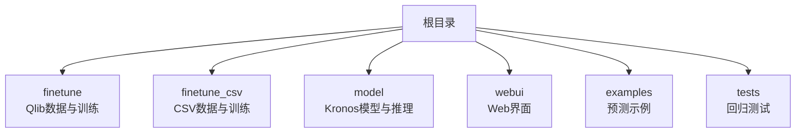
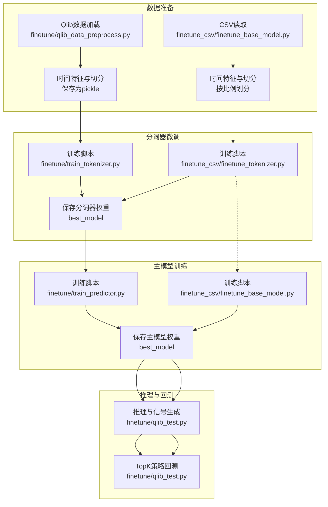
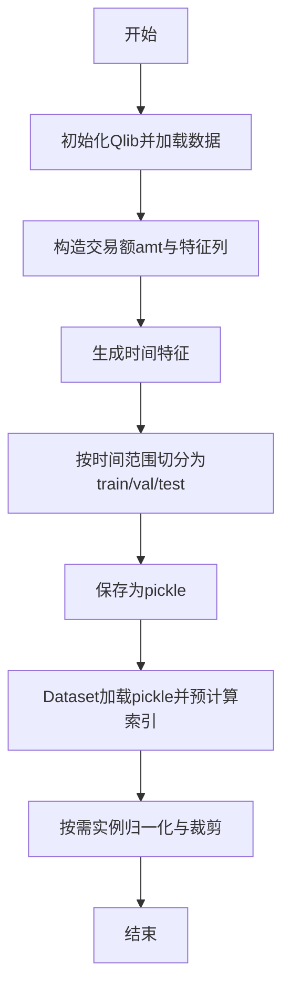
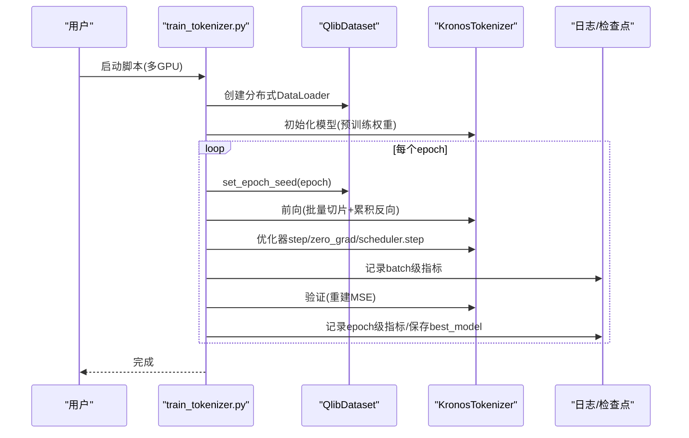
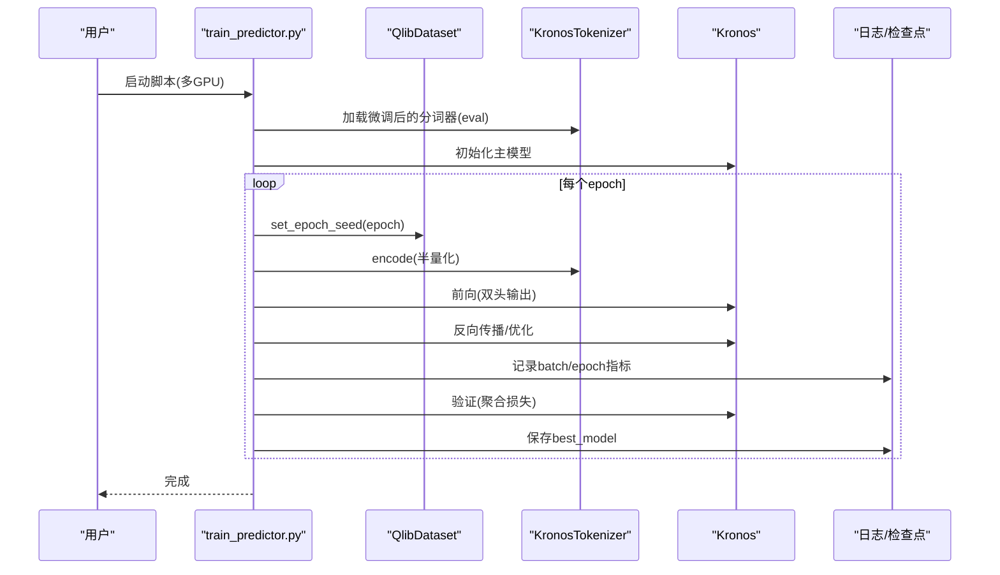
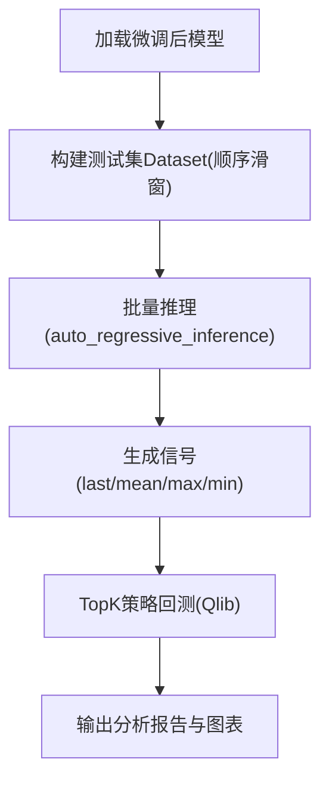

# 模型微调

<cite>
**本文引用的文件**   
- [README.md](file://README.md)
- [requirements.txt](file://requirements.txt)
- [finetune/config.py](file://finetune/config.py)
- [finetune/qlib_data_preprocess.py](file://finetune/qlib_data_preprocess.py)
- [finetune/dataset.py](file://finetune/dataset.py)
- [finetune/train_tokenizer.py](file://finetune/train_tokenizer.py)
- [finetune/train_predictor.py](file://finetune/train_predictor.py)
- [finetune/qlib_test.py](file://finetune/qlib_test.py)
- [finetune/utils/training_utils.py](file://finetune/utils/training_utils.py)
- [model/kronos.py](file://model/kronos.py)
- [finetune_csv/config_loader.py](file://finetune_csv/config_loader.py)
- [finetune_csv/configs/config_ali09988_candle-5min.yaml](file://finetune_csv/configs/config_ali09988_candle-5min.yaml)
- [finetune_csv/finetune_tokenizer.py](file://finetune_csv/finetune_tokenizer.py)
- [finetune_csv/finetune_base_model.py](file://finetune_csv/finetune_base_model.py)
- [finetune_csv/train_sequential.py](file://finetune_csv/train_sequential.py)
</cite>

## 目录
1. [简介](#简介)
2. [项目结构](#项目结构)
3. [核心组件](#核心组件)
4. [架构总览](#架构总览)
5. [详细组件分析](#详细组件分析)
6. [依赖分析](#依赖分析)
7. [性能考虑](#性能考虑)
8. [故障排查指南](#故障排查指南)
9. [结论](#结论)
10. [附录](#附录)

## 简介
本指南面向希望在自有金融时序数据（如A股日线、分钟线或CSV格式K线）上对Kronos进行端到端微调的用户。内容覆盖：配置与路径设置、数据准备（Qlib与CSV两种方案）、分词器微调、主模型训练、多GPU与分布式策略、超参数与优化器选择、回测评估与指标分析，并提供可直接参考的代码片段路径与最佳实践。

## 项目结构
仓库采用按功能域划分的组织方式：
- finetune：基于Qlib的数据与训练脚本，适合使用Qlib数据源的用户
- finetune_csv：基于本地CSV数据的训练流水线，适合自有数据源
- model：Kronos模型定义与推理工具
- webui：Web预测界面（非本次微调重点）
- examples：预测示例脚本
- tests：回归测试

章节来源
- [README.md:217-300](file://README.md#L217-L300)

## 核心组件
- 配置系统
  - finetune/config.py：集中式配置，包含数据路径、时间窗、训练超参、保存路径、基准市场等
  - finetune_csv/config_loader.py + YAML：支持从YAML加载配置，动态解析保存路径，支持分布式与设备配置
- 数据准备
  - finetune/qlib_data_preprocess.py：从Qlib加载、清洗、构造时间特征、按时间切分并保存为pickle
  - finetune/dataset.py：PyTorch Dataset，滑动窗口采样、实例归一化、分布式采样
  - finetune_csv/finetune_base_model.py：CSV数据读取、时间切分、滑动窗口采样
- 分词器微调
  - finetune/train_tokenizer.py：DDP训练、梯度累积、OneCycleLR、日志与检查点
  - finetune_csv/finetune_tokenizer.py：独立训练脚本，支持单卡/多卡
- 主模型训练
  - finetune/train_predictor.py：冻结分词器，仅训练主模型；自动编码输入，DualHead损失
  - finetune_csv/finetune_base_model.py：统一训练流程，支持单卡/多卡
- 推理与回测
  - finetune/qlib_test.py：测试集滑窗、信号生成、TopK策略回测、收益曲线绘制
  - model/kronos.py：KronosTokenizer/Kronos、auto_regressive_inference、采样策略
- 工具
  - finetune/utils/training_utils.py：DDP初始化/清理、随机种子、模型大小统计、张量归约

章节来源
- [finetune/config.py:1-132](file://finetune/config.py#L1-L132)
- [finetune/qlib_data_preprocess.py:1-131](file://finetune/qlib_data_preprocess.py#L1-L131)
- [finetune/dataset.py:1-146](file://finetune/dataset.py#L1-L146)
- [finetune/train_tokenizer.py:1-282](file://finetune/train_tokenizer.py#L1-L282)
- [finetune/train_predictor.py:1-245](file://finetune/train_predictor.py#L1-L245)
- [finetune/qlib_test.py:1-363](file://finetune/qlib_test.py#L1-L363)
- [finetune/utils/training_utils.py:1-119](file://finetune/utils/training_utils.py#L1-L119)
- [model/kronos.py:1-663](file://model/kronos.py#L1-L663)
- [finetune_csv/config_loader.py:1-268](file://finetune_csv/config_loader.py#L1-L268)
- [finetune_csv/configs/config_ali09988_candle-5min.yaml:1-73](file://finetune_csv/configs/config_ali09988_candle-5min.yaml#L1-L73)
- [finetune_csv/finetune_tokenizer.py:1-360](file://finetune_csv/finetune_tokenizer.py#L1-L360)
- [finetune_csv/finetune_base_model.py:1-469](file://finetune_csv/finetune_base_model.py#L1-L469)
- [finetune_csv/train_sequential.py:1-362](file://finetune_csv/train_sequential.py#L1-L362)

## 架构总览
下图展示从数据到微调再到回测的整体流程，以及两个数据管线（Qlib与CSV）的差异。

图表来源
- [finetune/qlib_data_preprocess.py:1-131](file://finetune/qlib_data_preprocess.py#L1-L131)
- [finetune/train_tokenizer.py:1-282](file://finetune/train_tokenizer.py#L1-L282)
- [finetune/train_predictor.py:1-245](file://finetune/train_predictor.py#L1-L245)
- [finetune/qlib_test.py:1-363](file://finetune/qlib_test.py#L1-L363)
- [finetune_csv/finetune_tokenizer.py:1-360](file://finetune_csv/finetune_tokenizer.py#L1-L360)
- [finetune_csv/finetune_base_model.py:1-469](file://finetune_csv/finetune_base_model.py#L1-L469)

## 详细组件分析

### 配置系统
- finetune/config.py
  - 关键字段：数据路径、时间窗、特征列表、训练/验证/测试时间范围、保存路径、学习率、AdamW超参、日志与Comet配置、回测参数
  - 建议：根据实际环境修改qlib_data_path、dataset_path、save_path、pretrained_*路径
- finetune_csv/config_loader.py + YAML
  - 支持从YAML加载data/training/model_paths/experiment/device/distributed配置
  - 动态路径解析：支持以{exp_name}占位符生成保存路径
  - 提供统一访问接口与打印摘要

章节来源
- [finetune/config.py:1-132](file://finetune/config.py#L1-L132)
- [finetune_csv/config_loader.py:1-268](file://finetune_csv/config_loader.py#L1-L268)
- [finetune_csv/configs/config_ali09988_candle-5min.yaml:1-73](file://finetune_csv/configs/config_ali09988_candle-5min.yaml#L1-L73)

### 数据准备（Qlib方案）
- 数据加载与清洗
  - 初始化Qlib，按instrument与时间范围加载OHLCV，构造交易额amt，过滤缺失与长度不足样本
- 时间特征与切分
  - 计算分钟/小时/weekday/day/month等时间特征，按配置的时间范围切分为train/val/test
  - 保存为pickle文件，供后续Dataset加载
- 数据集类
  - QlibDataset：预计算所有可能起始索引，按epoch重设随机种子，实例归一化与裁剪

图表来源
- [finetune/qlib_data_preprocess.py:30-121](file://finetune/qlib_data_preprocess.py#L30-L121)
- [finetune/dataset.py:50-75](file://finetune/dataset.py#L50-L75)

章节来源
- [finetune/qlib_data_preprocess.py:1-131](file://finetune/qlib_data_preprocess.py#L1-L131)
- [finetune/dataset.py:1-146](file://finetune/dataset.py#L1-L146)

### 数据准备（CSV方案）
- CSV读取与清洗
  - 读取CSV，排序时间戳，填充缺失值
- 划分策略
  - 按train_ratio/val_ratio/test_ratio按时间顺序切分
- Dataset
  - 滑动窗口采样，实例归一化，时间特征构造

章节来源
- [finetune_csv/finetune_base_model.py:25-133](file://finetune_csv/finetune_base_model.py#L25-L133)

### 分词器微调（Tokenizer）
- 训练流程
  - DDP初始化与分布式采样，AdamW优化器，OneCycleLR调度
  - 梯度累积（accumulation_steps），梯度裁剪，日志记录
  - 损失由重建误差与VQ损失加权组成
- 推理与保存
  - 验证集平均损失作为早停/保存依据，保存best_model

图表来源
- [finetune/train_tokenizer.py:74-215](file://finetune/train_tokenizer.py#L74-L215)
- [finetune/dataset.py:77-90](file://finetune/dataset.py#L77-L90)
- [finetune/utils/training_utils.py:9-32](file://finetune/utils/training_utils.py#L9-L32)

章节来源
- [finetune/train_tokenizer.py:1-282](file://finetune/train_tokenizer.py#L1-L282)
- [finetune/utils/training_utils.py:1-119](file://finetune/utils/training_utils.py#L1-L119)

### 主模型训练（Predictor）
- 训练流程
  - 冻结分词器，仅训练Kronos主模型
  - on-the-fly编码输入，DualHead输出与损失计算
  - OneCycleLR，梯度裁剪，分布式聚合验证指标
- 保存与日志
  - 最佳验证损失触发保存

图表来源
- [finetune/train_predictor.py:60-179](file://finetune/train_predictor.py#L60-L179)
- [model/kronos.py:389-470](file://model/kronos.py#L389-L470)

章节来源
- [finetune/train_predictor.py:1-245](file://finetune/train_predictor.py#L1-L245)
- [model/kronos.py:180-330](file://model/kronos.py#L180-L330)

### 推理与回测
- 测试集Dataset
  - 顺序滑窗遍历，生成时间戳元信息，实例归一化
- 推理
  - auto_regressive_inference：半量化token滚动解码，温度与top-p/top-k采样，多样本平均
- 回测
  - TopKDropoutStrategy，SimulatorExecutor，基准对比，累计收益曲线与分析报告

图表来源
- [finetune/qlib_test.py:32-90](file://finetune/qlib_test.py#L32-L90)
- [model/kronos.py:389-470](file://model/kronos.py#L389-L470)
- [finetune/qlib_test.py:110-162](file://finetune/qlib_test.py#L110-L162)

章节来源
- [finetune/qlib_test.py:1-363](file://finetune/qlib_test.py#L1-L363)
- [model/kronos.py:389-470](file://model/kronos.py#L389-L470)

### 多GPU与分布式训练策略
- DDP初始化与清理
  - NCCL后端，rank/world_size/local_rank，CUDA设备设置
- 数据并行
  - DistributedSampler按epoch打乱，避免数据重复
- 指标聚合
  - 使用dist.all_reduce对验证损失与样本数求和，再计算全局均值
- 单机多卡启动
  - finetune使用torchrun --standalone --nproc_per_node=NUM_GPUS
  - finetune_csv支持通过环境变量控制分布式与后端

章节来源
- [finetune/utils/training_utils.py:9-32](file://finetune/utils/training_utils.py#L9-L32)
- [finetune/train_tokenizer.py:222-272](file://finetune/train_tokenizer.py#L222-L272)
- [finetune/train_predictor.py:184-235](file://finetune/train_predictor.py#L184-L235)
- [finetune_csv/train_sequential.py:40-50](file://finetune_csv/train_sequential.py#L40-L50)

### 超参数与优化器选择
- 学习率与调度
  - 分词器：tokenizer_learning_rate + OneCycleLR
  - 主模型：predictor_learning_rate + OneCycleLR
- 优化器
  - AdamW：betas、weight_decay
- 正则与稳定性
  - 梯度裁剪、实例归一化、clip裁剪、梯度累积
- 采样与生成
  - T、top_k、top_p、sample_count影响生成多样性与稳定性

章节来源
- [finetune/config.py:58-67](file://finetune/config.py#L58-L67)
- [finetune/train_tokenizer.py:98-111](file://finetune/train_tokenizer.py#L98-L111)
- [finetune/train_predictor.py:71-81](file://finetune/train_predictor.py#L71-L81)
- [model/kronos.py:331-386](file://model/kronos.py#L331-L386)

### 回测评估与性能指标
- 信号生成
  - last/mean/max/min三种信号（预测收盘价相对最后已知收盘价的差额）
- 策略
  - TopK持有、丢弃数量、最小持有期、延迟执行、仿真执行器
- 指标
  - 基准收益、超额收益（含/不含手续费）、累计曲线
- 结果可视化
  - 保存图像与交互式绘图

章节来源
- [finetune/qlib_test.py:110-162](file://finetune/qlib_test.py#L110-L162)
- [finetune/qlib_test.py:164-201](file://finetune/qlib_test.py#L164-L201)

## 依赖分析
- 运行时依赖
  - Python 3.10+，PyTorch>=2.0，NumPy/Pandas，Matplotlib，einops/safetensors，huggingface_hub
- 训练依赖
  - torch.distributed（NCCL），tqdm，pickle，pandas/numpy
- 推理依赖
  - Qlib（回测阶段），HuggingFace Hub（模型加载）

章节来源
- [requirements.txt:1-11](file://requirements.txt#L1-L11)
- [README.md:87-93](file://README.md#L87-L93)

## 性能考虑
- 数据加载
  - DataLoader使用pin_memory与合理num_workers；分布式场景优先使用DistributedSampler
- 训练稳定性
  - 梯度累积模拟更大batch；梯度裁剪防止爆炸；实例归一化与clip限制异常波动
- 推理效率
  - 半量化token滚动缓冲，避免全序列重算；多样本采样平均降低方差
- 分布式
  - all_reduce聚合验证指标；确保世界规模一致；NCCL后端在NVIDIA GPU上性能更优

## 故障排查指南
- 分布式初始化失败
  - 确认torchrun正确启动，环境变量WORLD_SIZE/RANK/LOCAL_RANK存在
- 验证指标不收敛
  - 检查学习率是否过高/过低；确认OneCycleLR步数与epoch匹配；核对clip与归一化
- 内存不足
  - 降低batch_size或使用梯度累积；减少max_context；确保使用半量化token
- 回测报错
  - 确认Qlib初始化与provider_uri正确；检查信号MultiIndex与时间范围；核对基准市场映射

章节来源
- [finetune/utils/training_utils.py:9-32](file://finetune/utils/training_utils.py#L9-L32)
- [finetune/train_tokenizer.py:98-111](file://finetune/train_tokenizer.py#L98-L111)
- [finetune/qlib_test.py:105-109](file://finetune/qlib_test.py#L105-L109)

## 结论
通过本指南，您可以在自有数据上完成Kronos的端到端微调：先用Qlib或CSV准备数据，再分别微调分词器与主模型，最后进行回测评估。建议从较小batch与较短上下文开始，逐步扩大规模并调整采样参数，结合分布式加速训练。

## 附录
- 快速开始（Qlib）
  - 修改配置路径与预训练模型路径 → 准备数据 → 多GPU微调分词器 → 多GPU微调主模型 → 回测评估
- 快速开始（CSV）
  - 准备YAML配置 → 准备CSV数据 → 微调分词器 → 微调主模型 → 推理与回测
- 代码片段路径参考
  - 配置：[finetune/config.py:1-132](file://finetune/config.py#L1-L132)，[finetune_csv/configs/config_ali09988_candle-5min.yaml:1-73](file://finetune_csv/configs/config_ali09988_candle-5min.yaml#L1-L73)
  - 数据准备：[finetune/qlib_data_preprocess.py:1-131](file://finetune/qlib_data_preprocess.py#L1-L131)，[finetune_csv/finetune_base_model.py:1-469](file://finetune_csv/finetune_base_model.py#L1-L469)
  - 分词器训练：[finetune/train_tokenizer.py:1-282](file://finetune/train_tokenizer.py#L1-L282)，[finetune_csv/finetune_tokenizer.py:1-360](file://finetune_csv/finetune_tokenizer.py#L1-L360)
  - 主模型训练：[finetune/train_predictor.py:1-245](file://finetune/train_predictor.py#L1-L245)，[finetune_csv/finetune_base_model.py:1-469](file://finetune_csv/finetune_base_model.py#L1-L469)
  - 推理与回测：[finetune/qlib_test.py:1-363](file://finetune/qlib_test.py#L1-L363)，[model/kronos.py:1-663](file://model/kronos.py#L1-L663)
  - 工具：[finetune/utils/training_utils.py:1-119](file://finetune/utils/training_utils.py#L1-L119)