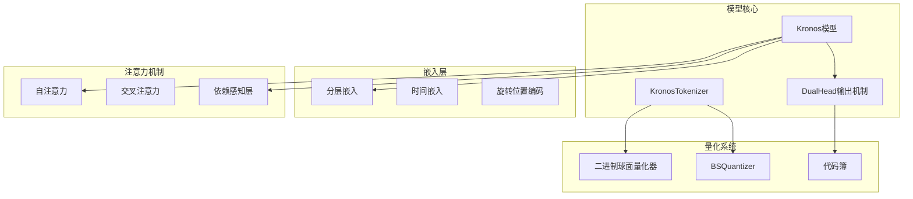
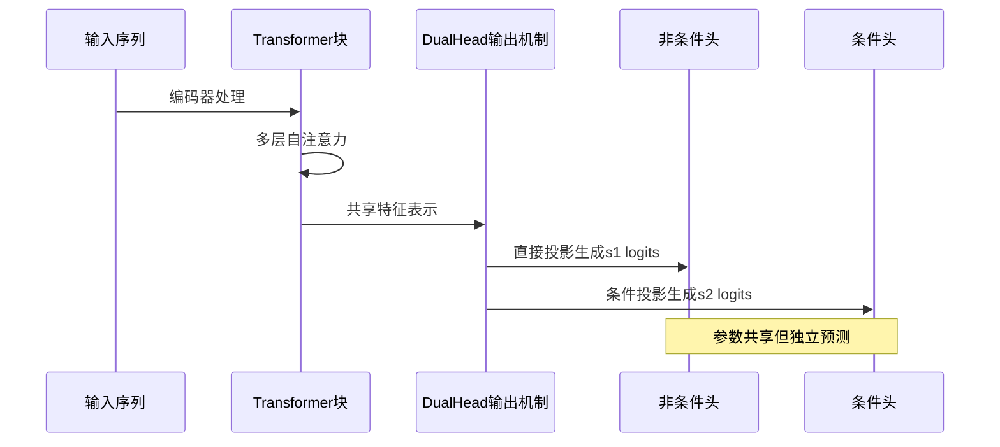
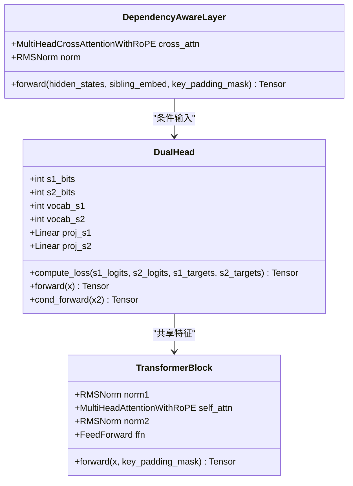
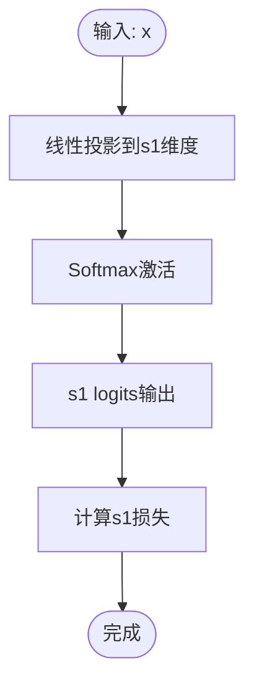
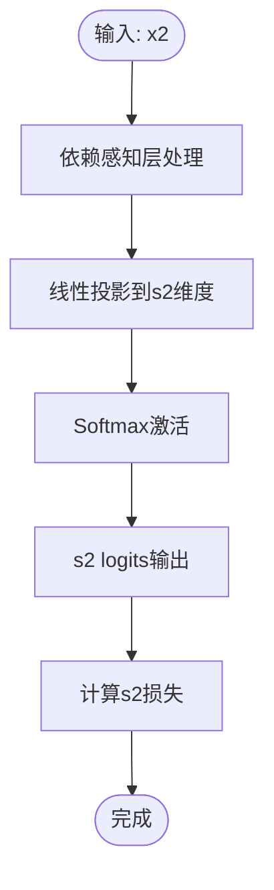
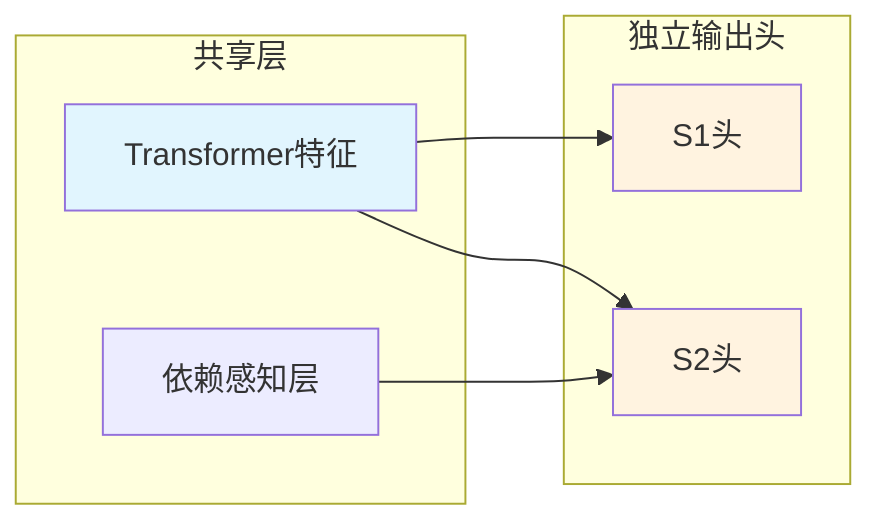
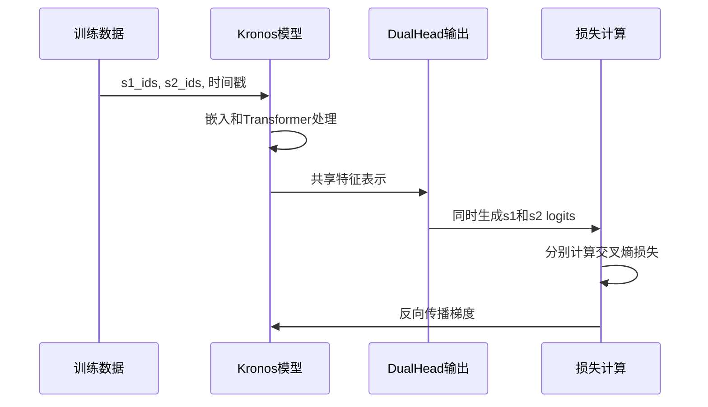
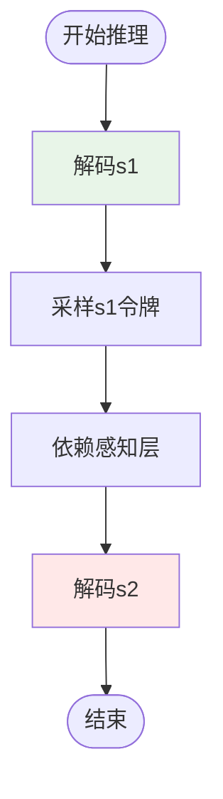
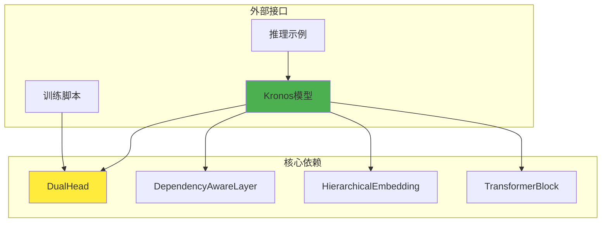

# DualHead输出机制

<cite>
**本文档引用的文件**
- [model/kronos.py](file://model/kronos.py)
- [model/module.py](file://model/module.py)
- [finetune/train_predictor.py](file://finetune/train_predictor.py)
- [finetune/dataset.py](file://finetune/dataset.py)
- [finetune/config.py](file://finetune/config.py)
- [examples/prediction_example.py](file://examples/prediction_example.py)
- [finetune_csv/train_sequential.py](file://finetune_csv/train_sequential.py)
</cite>

## 目录
1. [简介](#简介)
2. [项目结构](#项目结构)
3. [核心组件](#核心组件)
4. [架构概览](#架构概览)
5. [详细组件分析](#详细组件分析)
6. [依赖关系分析](#依赖关系分析)
7. [性能考虑](#性能考虑)
8. [故障排除指南](#故障排除指南)
9. [结论](#结论)

## 简介

DualHead输出机制是Kronos模型中一个关键的设计创新，它实现了s1和s2 logits的并行生成。这种机制基于二进制球面量化（Binary Spherical Quantization）的混合量化方法，将输入数据分解为预令牌（s1）和后令牌（s2）两个部分，分别进行独立的预测。

该机制的核心设计理念是通过参数共享策略实现两个输出头的独立性设计，同时保持计算效率。非条件头直接从Transformer输出预测s1令牌分布，而条件头则接收依赖感知层的处理结果，实现对s1条件下的s2预测。

## 项目结构

Kronos项目的整体架构采用模块化设计，主要包含以下核心模块：

**图表来源**
- [model/kronos.py:180-330](file://model/kronos.py#L180-L330)
- [model/module.py:400-516](file://model/module.py#L400-L516)

**章节来源**
- [model/kronos.py:1-663](file://model/kronos.py#L1-L663)
- [model/module.py:1-571](file://model/module.py#L1-L571)

## 核心组件

### DualHead输出机制概述

DualHead输出机制是Kronos模型的核心创新，它实现了以下关键功能：

1. **并行生成能力**：同时生成s1和s2 logits
2. **参数共享策略**：两个输出头共享底层Transformer特征
3. **独立性设计**：每个输出头有独立的线性投影层
4. **条件预测**：支持基于s1条件的s2预测

### 输出头维度设置

DualHead输出机制的维度设置遵循以下关系：

- **s1词汇表大小**：`vocab_s1 = 2^s1_bits`
- **s2词汇表大小**：`vocab_s2 = 2^s2_bits`
- **总代码簿维度**：`codebook_dim = s1_bits + s2_bits`

这种设计确保了：
- 每个位数对应一个二进制维度
- s1和s2的独立性保证
- 量化过程的可逆性

**章节来源**
- [model/module.py:486-516](file://model/module.py#L486-L516)
- [model/kronos.py:212-222](file://model/kronos.py#L212-L222)

## 架构概览

DualHead输出机制的整体架构可以分为三个主要阶段：

**图表来源**
- [model/kronos.py:239-276](file://model/kronos.py#L239-L276)
- [model/module.py:486-516](file://model/module.py#L486-L516)

## 详细组件分析

### DualHead类实现

DualHead类是输出机制的核心实现，具有以下特点：

#### 类结构设计

**图表来源**
- [model/module.py:486-516](file://model/module.py#L486-L516)
- [model/module.py:446-463](file://model/module.py#L446-L463)
- [model/module.py:465-484](file://model/module.py#L465-L484)

#### 非条件头（s1预测）

非条件头直接从Transformer的共享特征表示中生成s1 logits：

**图表来源**
- [model/module.py:509-510](file://model/module.py#L509-L510)

#### 条件头（s2预测）

条件头接收依赖感知层的处理结果，实现对s1条件下的s2预测：

**图表来源**
- [model/module.py:512-513](file://model/module.py#L512-L513)
- [model/module.py:446-463](file://model/module.py#L446-L463)

**章节来源**
- [model/module.py:486-516](file://model/module.py#L486-L516)

### 参数共享策略

DualHead输出机制采用了巧妙的参数共享策略：

#### 共享特征表示

**图表来源**
- [model/kronos.py:265-275](file://model/kronos.py#L265-L275)

#### 独立性设计

虽然两个输出头共享底层特征，但它们具有独立的参数：

- **共享权重**：来自Transformer的特征表示
- **独立权重**：各自的线性投影层
- **独立损失**：分别计算s1和s2的交叉熵损失

**章节来源**
- [model/module.py:489-492](file://model/module.py#L489-L492)
- [model/module.py:494-507](file://model/module.py#L494-L507)

### 训练阶段行为模式

在训练阶段，DualHead输出机制表现出以下特点：

#### 数据流处理

**图表来源**
- [model/kronos.py:239-276](file://model/kronos.py#L239-L276)
- [finetune/train_predictor.py:108-116](file://finetune/train_predictor.py#L108-L116)

#### 损失函数实现

DualHead类提供了专门的损失计算函数：

- **联合损失**：`(ce_s1 + ce_s2) / 2`
- **独立损失**：分别返回s1和s2的交叉熵
- **掩码支持**：支持padding mask的处理

**章节来源**
- [model/module.py:494-507](file://model/module.py#L494-L507)
- [finetune/train_predictor.py:108-116](file://finetune/train_predictor.py#L108-L116)

### 推理阶段行为模式

在推理阶段，DualHead输出机制提供了灵活的预测模式：

#### 单步预测流程

**图表来源**
- [model/kronos.py:278-328](file://model/kronos.py#L278-L328)

#### 教师强制机制

模型支持教师强制（teacher forcing）模式：

- **启用条件**：`use_teacher_forcing=True`
- **目标输入**：使用`s1_targets`而不是采样的s1
- **应用场景**：训练稳定性提升

**章节来源**
- [model/kronos.py:267-275](file://model/kronos.py#L267-L275)

## 依赖关系分析

DualHead输出机制与系统其他组件的依赖关系如下：

**图表来源**
- [model/kronos.py:180-330](file://model/kronos.py#L180-L330)
- [model/module.py:446-516](file://model/module.py#L446-L516)

### 组件耦合度分析

DualHead输出机制展现了良好的模块化设计：

- **低耦合**：与具体任务无关
- **高内聚**：专注于输出头功能
- **接口清晰**：提供明确的forward和cond_forward方法

**章节来源**
- [model/module.py:486-516](file://model/module.py#L486-L516)
- [model/kronos.py:221-222](file://model/kronos.py#L221-L222)

## 性能考虑

### 计算复杂度分析

DualHead输出机制的性能特点：

- **内存占用**：两个独立的线性投影层
- **计算开销**：O(n × d_model × vocab)的矩阵乘法
- **并行性**：s1和s2 logits的并行计算

### 优化策略

1. **参数共享**：减少重复的Transformer特征计算
2. **批量处理**：利用PyTorch的高效张量操作
3. **内存管理**：合理使用`.detach()`避免梯度计算

## 故障排除指南

### 常见问题及解决方案

#### 维度不匹配错误

**症状**：`RuntimeError: shape '[batch, seq, vocab]' is invalid`

**原因**：
- s1_bits和s2_bits设置不正确
- 量化维度与嵌入维度不一致

**解决方案**：
- 检查配置文件中的s1_bits和s2_bits
- 验证HierarchicalEmbedding的维度设置

#### 内存不足问题

**症状**：CUDA out of memory错误

**原因**：
- 词汇表过大导致内存消耗增加
- 批次大小设置过高

**解决方案**：
- 减少s1_bits或s2_bits
- 降低批次大小
- 使用梯度累积

**章节来源**
- [model/module.py:400-444](file://model/module.py#L400-L444)
- [finetune/config.py:46-68](file://finetune/config.py#L46-L68)

## 结论

DualHead输出机制代表了Kronos模型在多令牌预测领域的技术创新。通过参数共享策略和独立性设计，该机制实现了高效的并行生成能力，同时保持了模型的灵活性和可扩展性。

### 主要优势

1. **并行计算**：s1和s2 logits的并行生成显著提升了推理效率
2. **参数共享**：减少了模型参数数量，降低了内存占用
3. **条件建模**：通过依赖感知层实现了更精确的条件预测
4. **模块化设计**：清晰的接口设计便于维护和扩展

### 应用前景

DualHead输出机制不仅适用于金融时间序列预测，还可以扩展到其他需要多阶段序列建模的任务，如自然语言处理、语音识别等领域。

该机制为大规模序列预测任务提供了一个高效、灵活且易于实现的解决方案，是Kronos模型架构设计的重要组成部分。