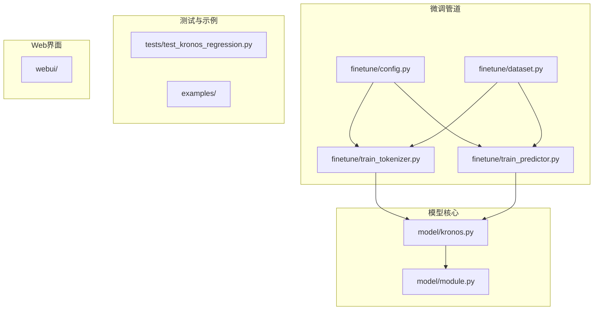
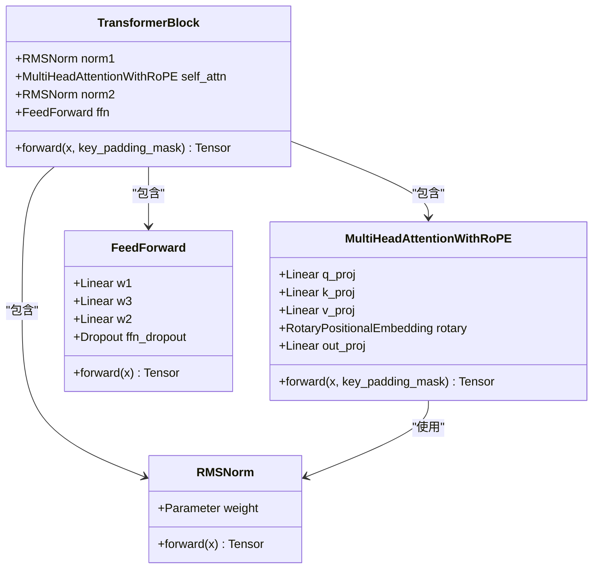
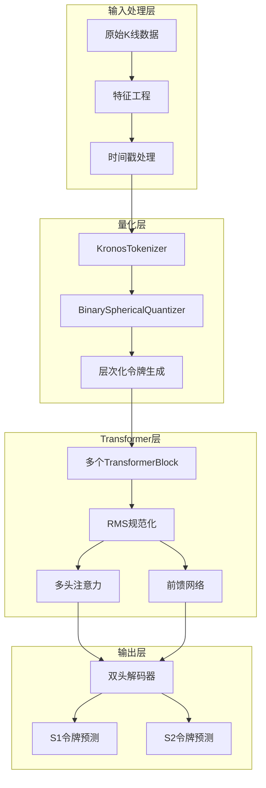
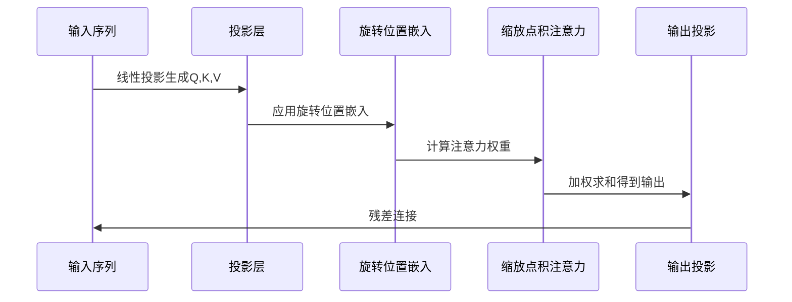
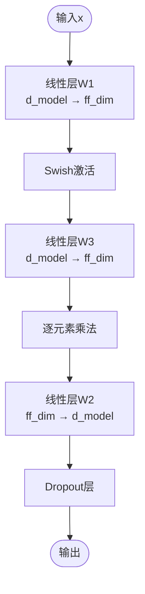
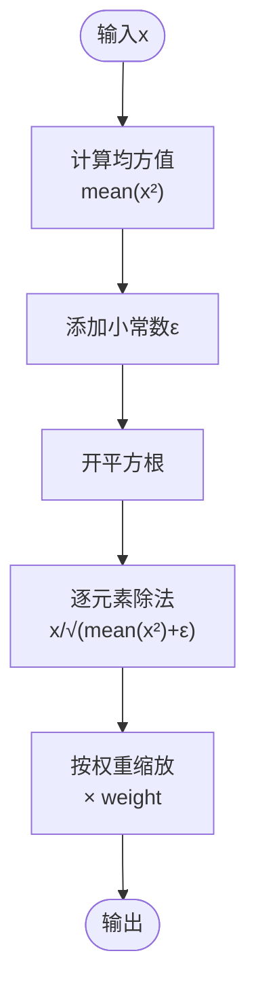
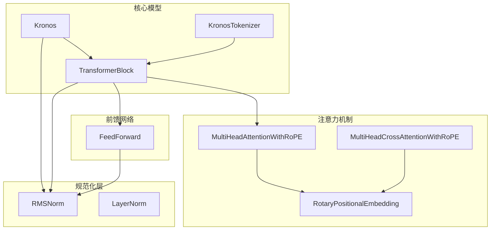
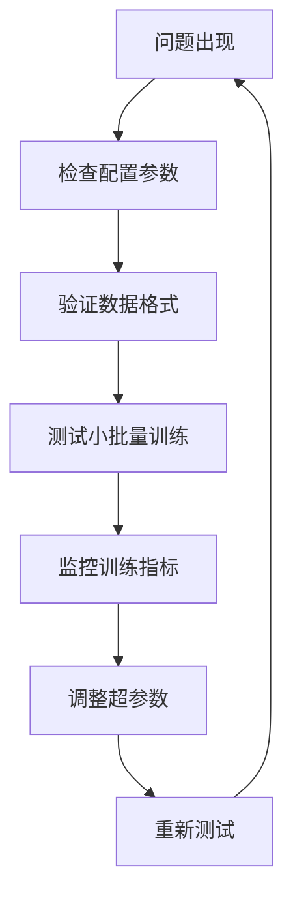

# Transformer块实现

<cite>
**本文档引用的文件**
- [model/kronos.py](file://model/kronos.py)
- [model/module.py](file://model/module.py)
- [finetune/train_predictor.py](file://finetune/train_predictor.py)
- [finetune/train_tokenizer.py](file://finetune/train_tokenizer.py)
- [finetune/config.py](file://finetune/config.py)
- [finetune/dataset.py](file://finetune/dataset.py)
- [tests/test_kronos_regression.py](file://tests/test_kronos_regression.py)
- [README.md](file://README.md)
</cite>

## 目录
1. [简介](#简介)
2. [项目结构](#项目结构)
3. [核心组件](#核心组件)
4. [架构概览](#架构概览)
5. [详细组件分析](#详细组件分析)
6. [依赖分析](#依赖分析)
7. [性能考虑](#性能考虑)
8. [故障排除指南](#故障排除指南)
9. [结论](#结论)

## 简介

Kronos是一个专为金融K线序列设计的开源基础模型，采用两阶段框架：首先通过专门的分词器将连续的多维K线数据量化为层次化的离散令牌，然后在这些令牌上预训练一个大型自回归Transformer，使其能够服务于各种量化任务。本文档深入分析Transformer块的实现细节，重点关注多头注意力机制、前馈网络和规范化层的设计。

## 项目结构

该项目采用模块化设计，主要包含以下核心目录：



**图表来源**
- [model/kronos.py:1-663](file://model/kronos.py#L1-L663)
- [model/module.py:1-571](file://model/module.py#L1-L571)

**章节来源**
- [README.md:1-338](file://README.md#L1-L338)

## 核心组件

### Transformer块架构

Kronos实现了标准的Transformer编码器块变体，采用RMS规范化替代传统的LayerNorm，这在金融时间序列建模中提供了更好的数值稳定性。



**图表来源**
- [model/module.py:465-484](file://model/module.py#L465-L484)
- [model/module.py:315-354](file://model/module.py#L315-L354)
- [model/module.py:271-282](file://model/module.py#L271-L282)
- [model/module.py:257-269](file://model/module.py#L257-L269)

### 多头注意力机制

多头注意力是Transformer的核心组件，负责捕获序列中的复杂依赖关系。Kronos实现了带有旋转位置嵌入(RoPE)的多头注意力机制。

**章节来源**
- [model/module.py:315-354](file://model/module.py#L315-L354)

## 架构概览

Kronos的整体架构采用分层设计，从底层的量化模块到顶层的预测模块：



**图表来源**
- [model/kronos.py:13-178](file://model/kronos.py#L13-L178)
- [model/module.py:465-484](file://model/module.py#L465-L484)

## 详细组件分析

### 多头注意力机制详解

#### 数学原理

多头注意力的核心计算公式为：

```
Attention(Q, K, V) = softmax((QK^T)/√d_h) × V
```

其中：
- Q = XW^Q（查询矩阵）
- K = XW^K（键矩阵）  
- V = XW^V（值矩阵）
- d_h = d_model/n_heads（头维度）

#### 实现细节

Kronos的MultiHeadAttentionWithRoPE实现具有以下特点：

1. **头数配置**：通过`n_heads`参数控制注意力头的数量
2. **头维度计算**：`head_dim = d_model // n_heads`
3. **投影层**：独立的线性投影用于生成Q、K、V
4. **旋转位置嵌入**：应用RoPE增强位置感知能力
5. **因果掩码**：在训练时启用因果注意力掩码



**图表来源**
- [model/module.py:330-353](file://model/module.py#L330-L353)

**章节来源**
- [model/module.py:315-354](file://model/module.py#L315-L354)

### 前馈网络(FFN)设计

#### 结构设计

Kronos采用两层前馈网络，使用Swish激活函数而非传统的ReLU/GELU：

```
FFN(x) = Dropout(W2 × (Swish(W1 × x) ⊙ W3 × x))
```

其中⊙表示逐元素乘法。

#### 参数配置

- **第一层**：`w1`和`w3`都是线性层，维度为`d_model → ff_dim`
- **第二层**：`w2`线性层，维度为`ff_dim → d_model`
- **激活函数**：使用Swish函数替代GELU
- **Dropout**：在输出层应用，防止过拟合



**图表来源**
- [model/module.py:280-281](file://model/module.py#L280-L281)

**章节来源**
- [model/module.py:271-282](file://model/module.py#L271-L282)

### RMS规范化 vs LayerNorm

#### RMSNorm实现



**图表来源**
- [model/module.py:263-268](file://model/module.py#L263-L268)

#### 与LayerNorm的区别

| 特性 | RMSNorm | LayerNorm |
|------|---------|-----------|
| 归一化方式 | 按均方根 | 按均值和方差 |
| 参数数量 | 仅weight | weight + bias |
| 数值稳定性 | 更好 | 一般 |
| 计算复杂度 | O(1) | O(1) |
| 对金融数据适应性 | 更佳 | 一般 |

**章节来源**
- [model/module.py:257-269](file://model/module.py#L257-L269)

### Dropout应用策略

Kronos在多个模块中应用Dropout以提高模型泛化能力：

1. **注意力模块**：`resid_dropout_p`控制残差连接的dropout概率
2. **前馈网络**：`ffn_dropout_p`控制FFN输出的dropout概率
3. **令牌嵌入**：`token_dropout_p`控制令牌嵌入的dropout概率

**章节来源**
- [model/kronos.py:213](file://model/kronos.py#L213)
- [model/module.py:278](file://model/module.py#L278)

## 依赖分析

### 组件间关系



**图表来源**
- [model/kronos.py:180-329](file://model/kronos.py#L180-L329)
- [model/module.py:465-484](file://model/module.py#L465-L484)

### 训练流程依赖

```mermaid
sequenceDiagram
participant Data as 数据加载器
participant Tokenizer as 分词器
participant Model as 预测模型
participant Loss as 损失计算
participant Opt as 优化器
Data->>Tokenizer : 编码输入序列
Tokenizer-->>Data : 返回令牌序列
Data->>Model : 前向传播
Model->>Loss : 计算交叉熵损失
Loss->>Opt : 反向传播
Opt->>Model : 更新参数
```

**图表来源**
- [finetune/train_predictor.py:95-116](file://finetune/train_predictor.py#L95-L116)

**章节来源**
- [finetune/train_predictor.py:60-179](file://finetune/train_predictor.py#L60-L179)

## 性能考虑

### 模型规模影响分析

根据README文档，Kronos系列模型的参数量和上下文长度如下：

| 模型 | 上下文长度 | 参数量 | 推荐用途 |
|------|------------|--------|----------|
| Kronos-mini | 2048 | 4.1M | 小规模部署 |
| Kronos-small | 512 | 24.7M | 生产环境 |
| Kronos-base | 512 | 102.3M | 大规模应用 |
| Kronos-large | 512 | 499.2M | 研究用途 |

### 关键超参数影响

1. **注意力头数(n_heads)**：影响模型的并行处理能力和表达能力
2. **隐藏维度(d_model)**：决定模型容量和计算复杂度
3. **前馈网络维度(ff_dim)**：影响非线性变换能力
4. **dropout率**：平衡过拟合和欠拟合的关键参数

### 训练优化策略

- **梯度裁剪**：使用`clip_grad_norm_`防止梯度爆炸
- **学习率调度**：OneCycleLR提供动态学习率调整
- **混合精度训练**：可选的AMP支持
- **分布式训练**：DDP实现多GPU并行

**章节来源**
- [finetune/train_predictor.py:112-116](file://finetune/train_predictor.py#L112-L116)
- [finetune/train_tokenizer.py:151](file://finetune/train_tokenizer.py#L151)

## 故障排除指南

### 常见问题诊断

1. **内存不足**：检查`max_context`设置，确保不超过模型限制
2. **数值不稳定**：验证RMSNorm的epsilon值设置
3. **训练不收敛**：调整学习率和dropout参数
4. **过拟合**：增加dropout或减少模型复杂度

### 调试工具



**章节来源**
- [tests/test_kronos_regression.py:45-89](file://tests/test_kronos_regression.py#L45-L89)

## 结论

Kronos的Transformer块实现展现了现代语言模型在金融时间序列领域的创新应用。通过采用RMS规范化、旋转位置嵌入和层次化令牌量化等技术，该实现不仅保持了良好的数值稳定性，还特别适配了金融市场的特性。

关键优势包括：
- **数值稳定性**：RMSNorm相比LayerNorm提供更好的稳定性
- **位置感知**：RoPE增强了长序列的位置建模能力
- **金融适配**：层次化令牌设计专门针对K线数据特点
- **模块化设计**：清晰的组件分离便于维护和扩展

未来改进方向可能包括：
- 探索更高效的注意力机制
- 优化量化策略以提高压缩比
- 扩展到多变量时间序列建模
- 支持更灵活的上下文长度