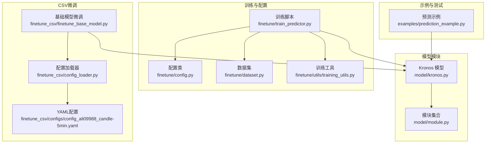
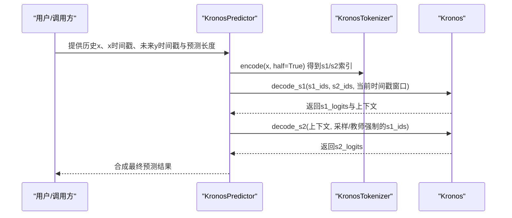
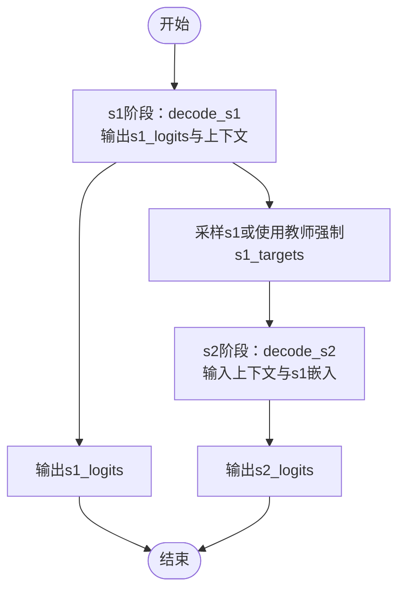
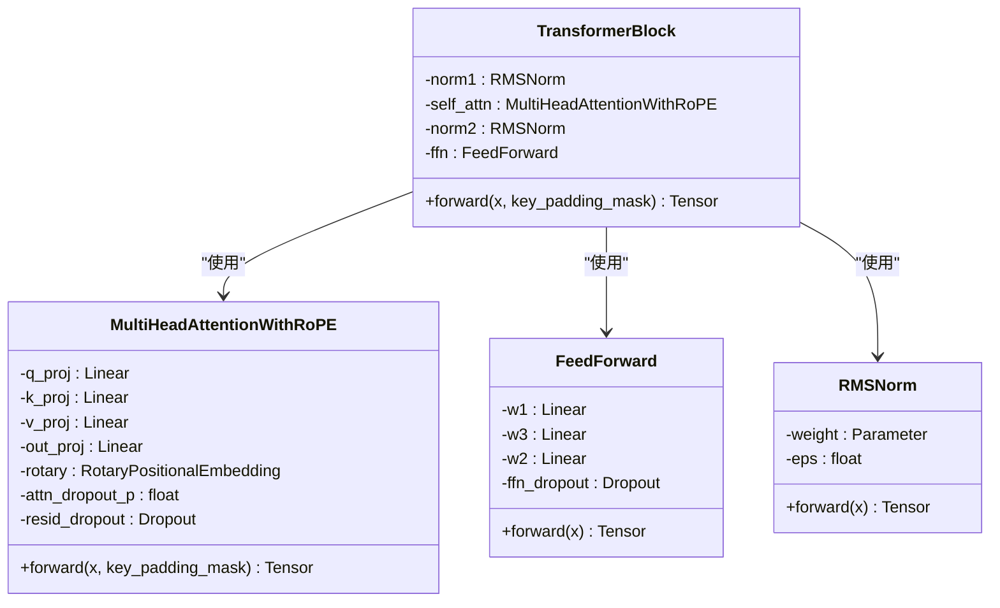
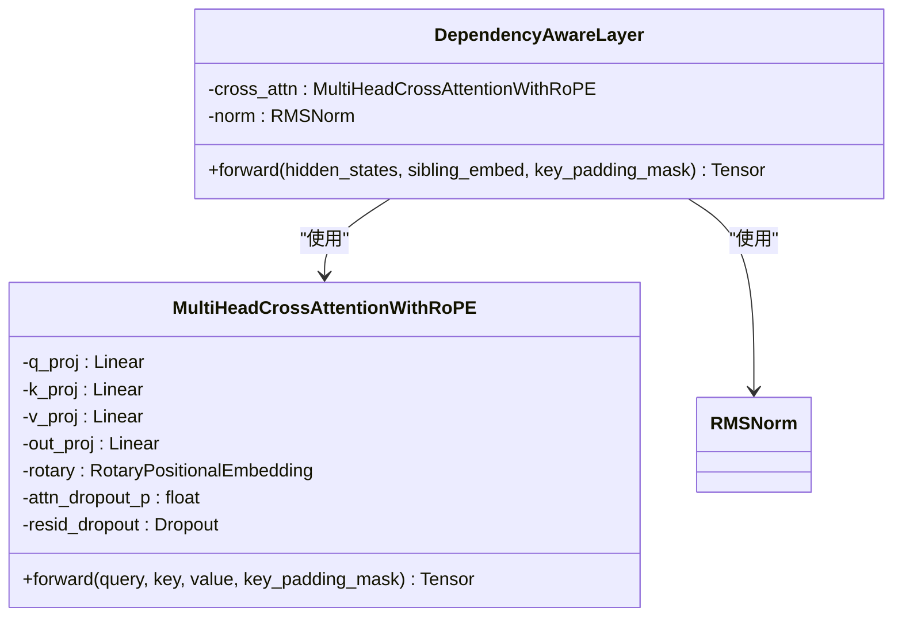
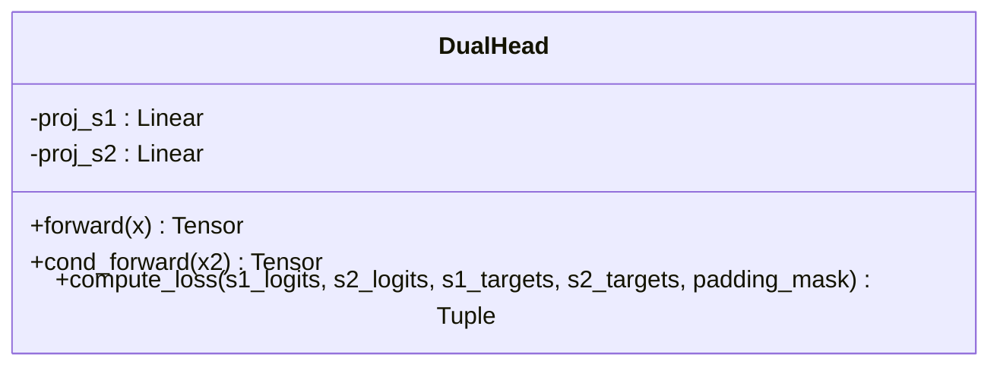
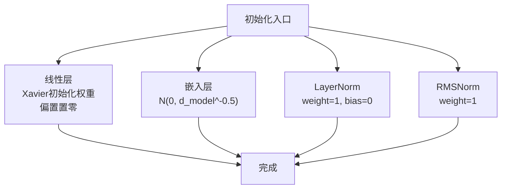
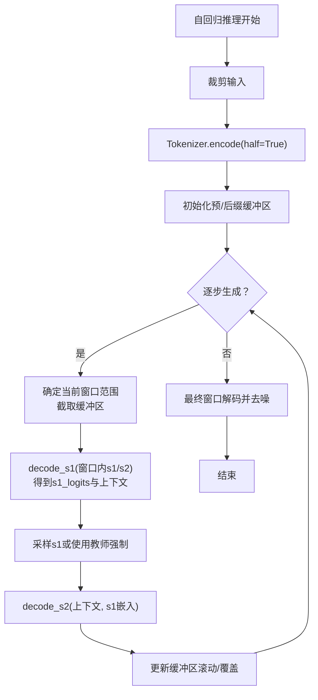
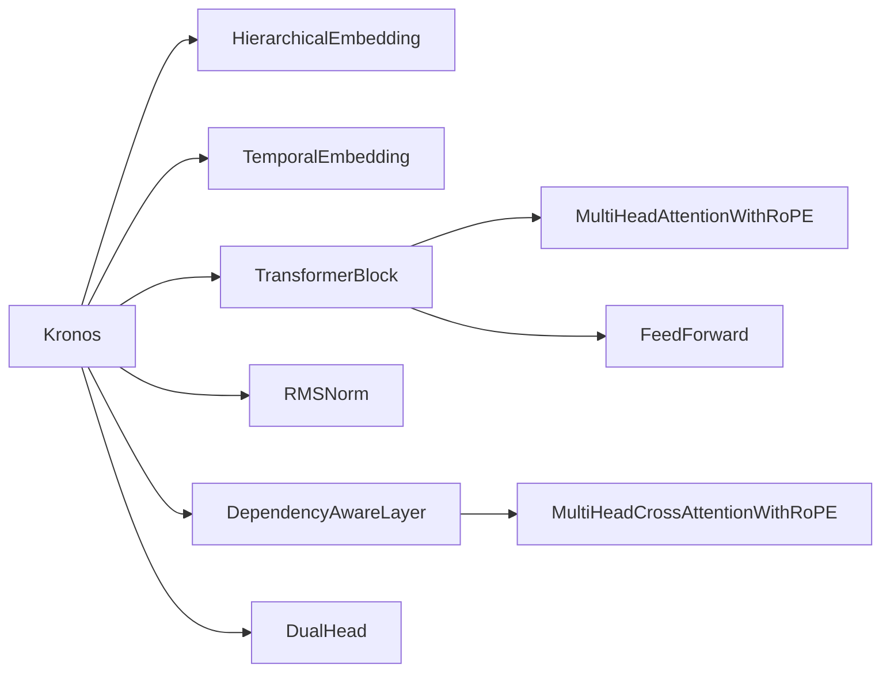

# 主模型架构

<cite>
**本文引用的文件列表**
- [model/kronos.py](file://model/kronos.py)
- [model/module.py](file://model/module.py)
- [finetune/config.py](file://finetune/config.py)
- [finetune/train_predictor.py](file://finetune/train_predictor.py)
- [finetune/dataset.py](file://finetune/dataset.py)
- [finetune/utils/training_utils.py](file://finetune/utils/training_utils.py)
- [finetune_csv/finetune_base_model.py](file://finetune_csv/finetune_base_model.py)
- [finetune_csv/configs/config_ali09988_candle-5min.yaml](file://finetune_csv/configs/config_ali09988_candle-5min.yaml)
- [finetune_csv/config_loader.py](file://finetune_csv/config_loader.py)
- [examples/prediction_example.py](file://examples/prediction_example.py)
</cite>

## 目录
1. [引言](#引言)
2. [项目结构](#项目结构)
3. [核心组件](#核心组件)
4. [架构总览](#架构总览)
5. [详细组件分析](#详细组件分析)
6. [依赖关系分析](#依赖关系分析)
7. [性能考量](#性能考量)
8. [故障排查指南](#故障排查指南)
9. [结论](#结论)
10. [附录](#附录)

## 引言
本文件面向Kronos主模型架构，系统性阐述两阶段自回归预测机制（s1阶段独立预测与s2阶段条件预测）、Transformer块实现细节（多头注意力、前馈网络、残差连接）、依赖感知层（DependencyAwareLayer）如何建模s1与s2之间的条件关系、DualHead输出机制（并行生成s1与s2 logits）、RMS归一化与权重初始化策略、教师强制（teacher forcing）机制以及上下文缓冲区管理。同时给出参数配置、内存优化与推理加速建议，帮助读者在不同场景下高效使用与扩展该架构。

## 项目结构
仓库采用模块化组织，核心模型位于model目录，训练与推理示例位于finetune与finetune_csv目录，WebUI示例位于webui目录，测试用例位于tests目录。本文聚焦于主模型与训练流程的关键文件。

**图表来源**
- [model/kronos.py:180-330](file://model/kronos.py#L180-L330)
- [model/module.py:446-514](file://model/module.py#L446-L514)
- [finetune/train_predictor.py:1-245](file://finetune/train_predictor.py#L1-L245)
- [finetune/dataset.py:1-146](file://finetune/dataset.py#L1-L146)
- [finetune/config.py:1-132](file://finetune/config.py#L1-L132)
- [finetune/utils/training_utils.py:1-119](file://finetune/utils/training_utils.py#L1-L119)
- [finetune_csv/finetune_base_model.py:1-469](file://finetune_csv/finetune_base_model.py#L1-L469)
- [finetune_csv/config_loader.py:1-268](file://finetune_csv/config_loader.py#L1-L268)
- [finetune_csv/configs/config_ali09988_candle-5min.yaml:1-73](file://finetune_csv/configs/config_ali09988_candle-5min.yaml#L1-L73)
- [examples/prediction_example.py:1-81](file://examples/prediction_example.py#L1-L81)

**章节来源**
- [model/kronos.py:1-663](file://model/kronos.py#L1-L663)
- [model/module.py:1-571](file://model/module.py#L1-L571)
- [finetune/config.py:1-132](file://finetune/config.py#L1-L132)
- [finetune/train_predictor.py:1-245](file://finetune/train_predictor.py#L1-L245)
- [finetune/dataset.py:1-146](file://finetune/dataset.py#L1-L146)
- [finetune/utils/training_utils.py:1-119](file://finetune/utils/training_utils.py#L1-L119)
- [finetune_csv/finetune_base_model.py:1-469](file://finetune_csv/finetune_base_model.py#L1-L469)
- [finetune_csv/config_loader.py:1-268](file://finetune_csv/config_loader.py#L1-L268)
- [finetune_csv/configs/config_ali09988_candle-5min.yaml:1-73](file://finetune_csv/configs/config_ali09988_candle-5min.yaml#L1-L73)
- [examples/prediction_example.py:1-81](file://examples/prediction_example.py#L1-L81)

## 核心组件
- 主模型Kronos：实现两阶段自回归预测，支持s1独立预测与s2条件预测，并提供解码接口以支持离线/在线推理。
- Transformer块：基于RMS归一化与RoPE位置编码的多头注意力与前馈网络组合，支持key_padding_mask。
- 依赖感知层DependencyAwareLayer：通过交叉注意力将s1嵌入作为查询，对隐藏状态进行条件增强。
- DualHead输出：并行生成s1与s2 logits，支持条件模式cond_forward。
- RMSNorm与初始化策略：线性层采用Xavier初始化，嵌入层与LayerNorm按标准分布初始化，RMSNorm参数初始化为1。
- 教师强制与上下文缓冲：训练时可选择使用目标s1或采样的s1；推理时维护固定长度的上下文缓冲，滚动更新以控制计算复杂度。

**章节来源**
- [model/kronos.py:180-330](file://model/kronos.py#L180-L330)
- [model/module.py:446-514](file://model/module.py#L446-L514)
- [model/module.py:257-282](file://model/module.py#L257-L282)
- [model/module.py:486-514](file://model/module.py#L486-L514)

## 架构总览
Kronos主模型由以下关键路径构成：
- 输入嵌入：HierarchicalEmbedding将复合s1/s2令牌映射到d_model空间。
- 时间嵌入：TemporalEmbedding将时间戳转换为可加性嵌入。
- 变换器堆叠：若干TransformerBlock对序列进行自注意力与前馈处理。
- 归一化：RMSNorm稳定训练。
- 输出头：DualHead并行输出s1与s2 logits；条件模式下依赖DependencyAwareLayer。
- 解码接口：decode_s1返回s1 logits与上下文；decode_s2基于上下文与s1输入生成s2 logits。

**图表来源**
- [model/kronos.py:389-470](file://model/kronos.py#L389-L470)
- [model/kronos.py:278-328](file://model/kronos.py#L278-L328)
- [model/kronos.py:142-177](file://model/kronos.py#L142-L177)

## 详细组件分析

### 两阶段自回归预测机制
- s1阶段（独立预测）：仅使用当前上下文，不依赖s2信息，直接从DualHead输出s1 logits，随后采样得到s1令牌。
- s2阶段（条件预测）：将s1嵌入作为查询，经DependencyAwareLayer与上下文进行交叉注意力，再通过DualHead的cond_forward生成s2 logits。
- 教师强制：训练时可选择使用真实s1_targets替代采样结果，提升稳定性与收敛速度。

**图表来源**
- [model/kronos.py:239-276](file://model/kronos.py#L239-L276)
- [model/kronos.py:278-328](file://model/kronos.py#L278-L328)

**章节来源**
- [model/kronos.py:239-276](file://model/kronos.py#L239-L276)
- [model/kronos.py:278-328](file://model/kronos.py#L278-L328)

### Transformer块实现（多头注意力、前馈网络、残差连接）
- 结构组成：RMSNorm -> MultiHeadAttentionWithRoPE -> 残差 -> RMSNorm -> FeedForward -> 残差。
- 注意力：Q/K/V分别投影后进行RoPE旋转，支持因果掩码与key_padding_mask。
- 前馈：双路门控式SiLU混合投影，最后dropout。
- 残差：每步残差连接，保证梯度稳定。

**图表来源**
- [model/module.py:465-484](file://model/module.py#L465-L484)
- [model/module.py:315-354](file://model/module.py#L315-L354)
- [model/module.py:271-282](file://model/module.py#L271-L282)
- [model/module.py:257-269](file://model/module.py#L257-L269)

**章节来源**
- [model/module.py:465-484](file://model/module.py#L465-L484)
- [model/module.py:315-354](file://model/module.py#L315-L354)
- [model/module.py:271-282](file://model/module.py#L271-L282)
- [model/module.py:257-269](file://model/module.py#L257-L269)

### 依赖感知层（DependencyAwareLayer）
- 功能：以s1嵌入为查询，上下文为键/值，执行交叉注意力，再经RMSNorm与残差连接，增强上下文对s2预测的条件约束。
- 关键点：支持key_padding_mask，确保无效位置不参与注意力计算。

**图表来源**
- [model/module.py:446-463](file://model/module.py#L446-L463)
- [model/module.py:356-398](file://model/module.py#L356-L398)
- [model/module.py:284-313](file://model/module.py#L284-L313)

**章节来源**
- [model/module.py:446-463](file://model/module.py#L446-L463)
- [model/module.py:356-398](file://model/module.py#L356-L398)

### DualHead输出机制
- 并行生成：forward返回s1 logits；cond_forward返回s2 logits。
- 条件损失：compute_loss支持对s1与s2分别计算交叉熵，并可按padding_mask屏蔽无效位置。

**图表来源**
- [model/module.py:486-514](file://model/module.py#L486-L514)

**章节来源**
- [model/module.py:486-514](file://model/module.py#L486-L514)

### RMS归一化与权重初始化策略
- RMSNorm：对最后一维做归一化，乘以可学习缩放参数，数值稳定且轻量。
- 初始化：
  - 线性层：Xavier正态初始化权重，偏置置零；
  - 嵌入层：均值0、标准差与维度相关的高斯初始化；
  - LayerNorm：权重设为1，偏置设为0；
  - RMSNorm：权重设为1。

**图表来源**
- [model/kronos.py:225-238](file://model/kronos.py#L225-L238)

**章节来源**
- [model/kronos.py:225-238](file://model/kronos.py#L225-L238)

### 教师强制机制与上下文缓冲区管理
- 教师强制：训练时可启用use_teacher_forcing，使用s1_targets替代采样结果；否则基于s1_logits采样得到s1_ids。
- 上下文缓冲：推理时维护固定长度max_context的预/后缀缓冲区，按需滑动窗口截取当前时间戳窗口，避免全序列重复计算。

**图表来源**
- [model/kronos.py:389-470](file://model/kronos.py#L389-L470)

**章节来源**
- [model/kronos.py:389-470](file://model/kronos.py#L389-L470)

### 训练与推理配置要点
- 训练超参：学习率、批次大小、梯度裁剪、OneCycleLR调度等。
- 数据集：滑窗构造样本，实例级归一化，时间特征工程。
- 分布式：DDP初始化、分布式采样、日志与模型保存。

**章节来源**
- [finetune/config.py:1-132](file://finetune/config.py#L1-L132)
- [finetune/train_predictor.py:1-245](file://finetune/train_predictor.py#L1-L245)
- [finetune/dataset.py:1-146](file://finetune/dataset.py#L1-L146)
- [finetune/utils/training_utils.py:1-119](file://finetune/utils/training_utils.py#L1-L119)

## 依赖关系分析
- 模块间耦合：
  - Kronos依赖HierarchicalEmbedding、TemporalEmbedding、TransformerBlock、RMSNorm、DependencyAwareLayer、DualHead。
  - DualHead与Loss计算解耦，便于灵活替换。
  - DependencyAwareLayer与MultiHeadCrossAttentionWithRoPE耦合紧密，共同实现条件建模。
- 外部依赖：
  - PyTorch、einops、tqdm、huggingface_hub。
  - 训练阶段引入torch.distributed、comet_ml（可选）。

**图表来源**
- [model/kronos.py:198-223](file://model/kronos.py#L198-L223)
- [model/module.py:400-444](file://model/module.py#L400-L444)
- [model/module.py:446-463](file://model/module.py#L446-L463)
- [model/module.py:465-484](file://model/module.py#L465-L484)
- [model/module.py:315-354](file://model/module.py#L315-L354)
- [model/module.py:271-282](file://model/module.py#L271-L282)

**章节来源**
- [model/kronos.py:198-223](file://model/kronos.py#L198-L223)
- [model/module.py:400-444](file://model/module.py#L400-L444)
- [model/module.py:446-463](file://model/module.py#L446-L463)
- [model/module.py:465-484](file://model/module.py#L465-L484)

## 性能考量
- 内存优化
  - 固定上下文缓冲：通过max_context限制窗口长度，减少注意力矩阵规模与显存占用。
  - 滚动缓冲：使用torch.roll实现O(1)窗口滑动，降低拷贝成本。
  - 实例归一化：训练时按样本统计归一化，避免全局统计带来的额外开销。
- 推理加速
  - 使用scaled_dot_product_attention（PyTorch原生实现），自动选择高效内核。
  - 采样策略：top-k与top-p过滤减少无效候选，提高采样效率。
  - 批量采样：sample_count控制并行采样，内部平均聚合，提升稳定性。
- 训练稳定性
  - RMSNorm与Xavier初始化减少梯度爆炸/消失风险。
  - OneCycleLR与梯度裁剪提升收敛速度与鲁棒性。
  - 分布式训练：DDP并行，分布式采样，日志统一记录。

**章节来源**
- [model/kronos.py:389-470](file://model/kronos.py#L389-L470)
- [finetune/train_predictor.py:60-179](file://finetune/train_predictor.py#L60-L179)
- [finetune/dataset.py:108-130](file://finetune/dataset.py#L108-L130)

## 故障排查指南
- 形状不匹配
  - 确认s1/s2位宽与嵌入维度一致，HierarchicalEmbedding的d_model与模型配置匹配。
  - 检查key_padding_mask形状与注意力mask广播规则。
- 数值异常
  - 归一化裁剪：训练/推理均使用clip防止极端值影响稳定性。
  - 梯度裁剪：训练中使用clip_grad_norm_避免梯度爆炸。
- 分布式问题
  - 确保torchrun正确初始化，NCCL后端可用，设备ID与本地GPU对应。
  - 日志与检查点路径权限，避免写入失败。
- 配置错误
  - YAML配置中的路径与实验名占位符需正确解析。
  - 训练/验证集划分与时间戳长度一致性校验。

**章节来源**
- [finetune/utils/training_utils.py:9-32](file://finetune/utils/training_utils.py#L9-L32)
- [finetune_csv/config_loader.py:25-49](file://finetune_csv/config_loader.py#L25-L49)
- [finetune/dataset.py:108-130](file://finetune/dataset.py#L108-L130)

## 结论
Kronos主模型通过两阶段自回归预测与依赖感知建模，实现了s1与s2令牌的协同生成。其核心在于：
- Transformer块的高效实现与RMS归一化；
- DependencyAwareLayer将s1嵌入作为条件注入上下文；
- DualHead并行输出与条件模式；
- 教师强制与上下文缓冲的训练/推理策略。

这些设计在保证预测质量的同时，兼顾了内存与计算效率，适合金融时间序列等长序列预测任务。

## 附录
- 示例运行：参考examples/prediction_example.py，加载预训练模型与分词器，进行单/批量预测。
- 训练流程：参考finetune/train_predictor.py与finetune/dataset.py，结合finetune/config.py进行超参配置。
- CSV微调：参考finetune_csv/finetune_base_model.py与config_loader.py，配合YAML配置进行自定义数据训练。

**章节来源**
- [examples/prediction_example.py:1-81](file://examples/prediction_example.py#L1-L81)
- [finetune/train_predictor.py:1-245](file://finetune/train_predictor.py#L1-L245)
- [finetune/dataset.py:1-146](file://finetune/dataset.py#L1-L146)
- [finetune/config.py:1-132](file://finetune/config.py#L1-L132)
- [finetune_csv/finetune_base_model.py:1-469](file://finetune_csv/finetune_base_model.py#L1-L469)
- [finetune_csv/config_loader.py:1-268](file://finetune_csv/config_loader.py#L1-L268)
- [finetune_csv/configs/config_ali09988_candle-5min.yaml:1-73](file://finetune_csv/configs/config_ali09988_candle-5min.yaml#L1-L73)