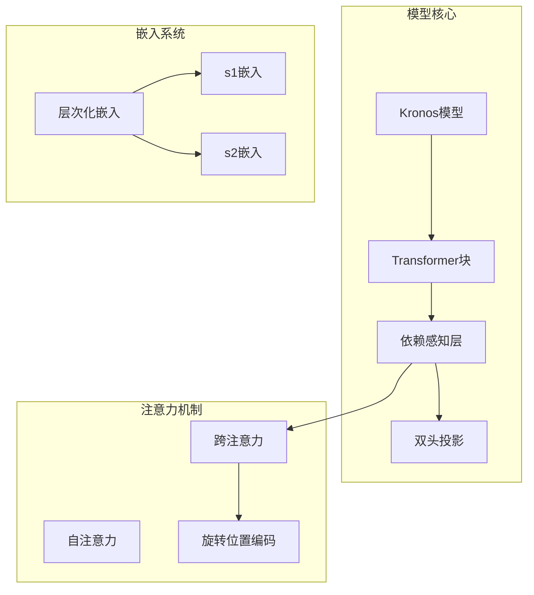
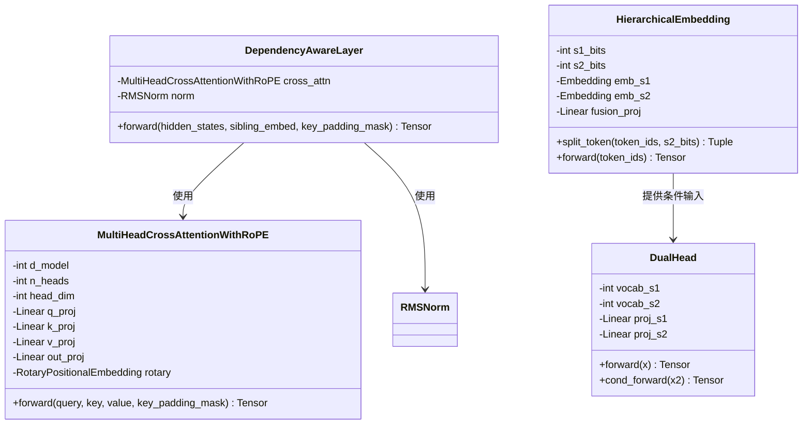
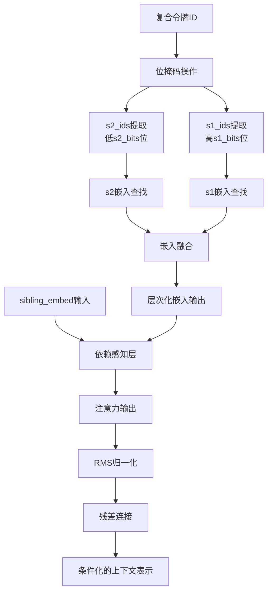
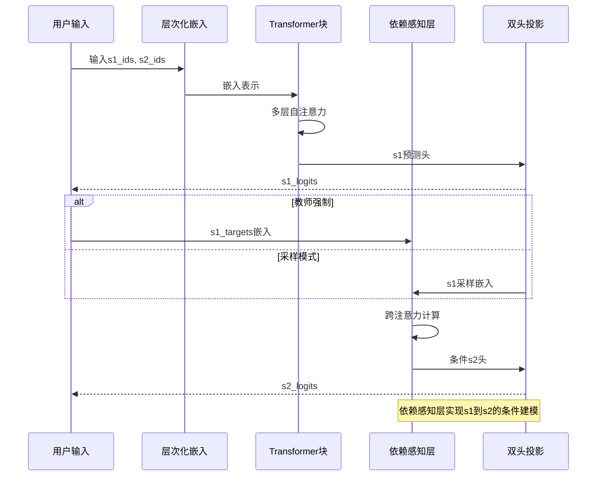
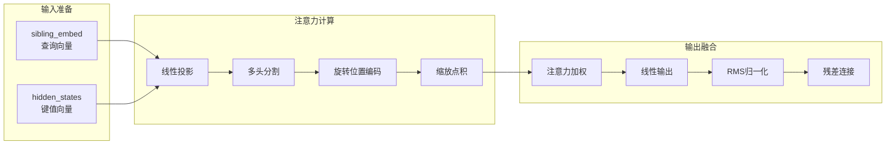
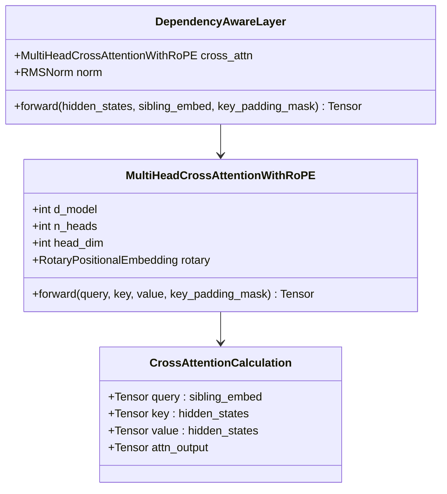
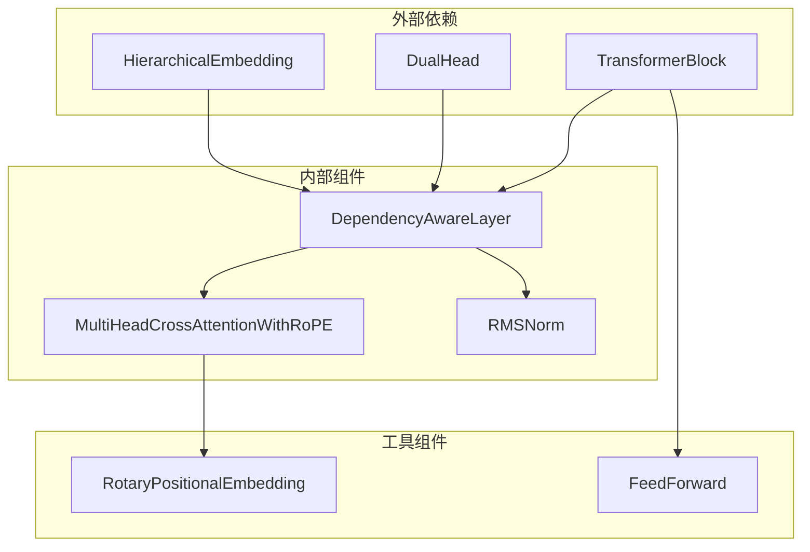

# 依赖感知层

<cite>
**本文档引用的文件**
- [module.py](file://model/module.py)
- [kronos.py](file://model/kronos.py)
- [test_kronos_regression.py](file://tests/test_kronos_regression.py)
</cite>

## 目录
1. [简介](#简介)
2. [项目结构](#项目结构)
3. [核心组件](#核心组件)
4. [架构概览](#架构概览)
5. [详细组件分析](#详细组件分析)
6. [依赖关系分析](#依赖关系分析)
7. [性能考虑](#性能考虑)
8. [故障排除指南](#故障排除指南)
9. [结论](#结论)

## 简介

依赖感知层（DependencyAwareLayer）是Kronos模型中的一个关键组件，专门设计用于处理分层令牌（s1和s2）之间的条件依赖关系。该层通过跨注意力机制实现了兄弟节点（sibling nodes）之间的依赖建模，使得s2令牌的预测能够充分考虑s1令牌的信息。

在Kronos架构中，每个复合令牌都由两个子令牌组成：s1（粗粒度令牌）和s2（细粒度令牌）。s1令牌提供了高层次的语义信息，而s2令牌提供详细的局部特征。依赖感知层的核心价值在于它能够将s1令牌的语义信息作为条件，指导s2令牌的预测过程。

## 项目结构

Kronos项目的模块化设计为依赖感知层提供了清晰的架构基础：



**图表来源**
- [kronos.py:180-341](file://model/kronos.py#L180-L341)
- [module.py:446-485](file://model/module.py#L446-L485)

**章节来源**
- [kronos.py:180-341](file://model/kronos.py#L180-L341)
- [module.py:400-485](file://model/module.py#L400-L485)

## 核心组件

### 依赖感知层架构

依赖感知层采用简洁而高效的架构设计，主要包含以下核心组件：



**图表来源**
- [module.py:446-485](file://model/module.py#L446-L485)
- [module.py:356-397](file://model/module.py#L356-L397)
- [module.py:400-444](file://model/module.py#L400-L444)
- [module.py:486-514](file://model/module.py#L486-L514)

### 分层令牌建模机制

Kronos采用二进制分层令牌表示法，将复合令牌分解为s1和s2两个子令牌：



**图表来源**
- [module.py:417-443](file://model/module.py#L417-L443)
- [module.py:446-462](file://model/module.py#L446-L462)

**章节来源**
- [module.py:400-444](file://model/module.py#L400-L444)
- [module.py:446-462](file://model/module.py#L446-L462)

## 架构概览

### 两阶段预测流程

依赖感知层在Kronos的两阶段预测过程中发挥着关键作用，实现了从s1到s2的条件依赖建模：



**图表来源**
- [kronos.py:239-276](file://model/kronos.py#L239-L276)
- [kronos.py:278-328](file://model/kronos.py#L278-L328)

### 注意力权重矩阵计算

依赖感知层的注意力计算过程体现了其独特的条件建模能力：



**图表来源**
- [module.py:356-397](file://model/module.py#L356-L397)
- [module.py:446-462](file://model/module.py#L446-L462)

**章节来源**
- [kronos.py:239-276](file://model/kronos.py#L239-L276)
- [module.py:356-397](file://model/module.py#L356-L397)

## 详细组件分析

### 依赖感知层实现细节

依赖感知层的核心实现体现了精心设计的架构决策：

#### 跨注意力机制



**图表来源**
- [module.py:446-462](file://model/module.py#L446-L462)
- [module.py:356-397](file://model/module.py#L356-L397)

#### 兄弟节点依赖关系建模

依赖感知层通过`sibling_embed`参数实现了兄弟节点之间的依赖关系建模：

| 参数 | 类型 | 描述 | 形状 |
|------|------|------|------|
| `hidden_states` | Tensor | 主序列的隐藏状态 | `[batch, seq_len, d_model]` |
| `sibling_embed` | Tensor | 来自另一个子令牌的嵌入 | `[batch, seq_len, d_model]` |
| `key_padding_mask` | Tensor | 序列填充掩码 | `[batch, seq_len]` |

这种设计允许s2令牌的预测直接依赖于s1令牌的语义表示，实现了真正的条件依赖建模。

**章节来源**
- [module.py:446-462](file://model/module.py#L446-L462)
- [kronos.py:267-275](file://model/kronos.py#L267-L275)

### 注意力分数重新定义

依赖感知层对传统注意力机制进行了创新性的改进，特别是在处理兄弟节点依赖关系时：

#### 标准注意力 vs 依赖感知注意力

| 维度 | 标准自注意力 | 依赖感知注意力 |
|------|-------------|----------------|
| 查询来源 | 同一序列 | 来自兄弟节点 |
| 键来源 | 同一序列 | 主序列上下文 |
| 值来源 | 同一序列 | 主序列上下文 |
| 依赖关系 | 内部序列依赖 | 兄弟节点条件依赖 |
| 计算复杂度 | O(T²d) | O(T²d) |
| 语义关联 | 同源序列 | 跨令牌类型 |

#### 注意力权重矩阵特性

依赖感知层的注意力权重矩阵具有以下特性：

1. **条件性**：权重分布不仅取决于序列位置关系，还取决于s1令牌的语义内容
2. **对称性**：对于给定的s1令牌，所有位置的注意力权重保持一致
3. **可解释性**：权重反映了s1令牌对s2令牌预测的影响程度

**章节来源**
- [module.py:356-397](file://model/module.py#L356-L397)
- [kronos.py:274-275](file://model/kronos.py#L274-L275)

### 融合主序列表示和兄弟节点嵌入

依赖感知层通过精心设计的融合机制实现了两种表示的有效结合：

```mermaid
flowchart TD
subgraph "输入表示"
A[sibling_embed<br/>形状: [B,T,d]]
B[hidden_states<br/>形状: [B,T,d]]
end
subgraph "注意力计算"
C[Q = RoPE(emb_s1)·Wq]
D[K = RoPE(hidden_states)·Wk]
E[V = RoPE(hidden_states)·Wv]
F[注意力分数 = softmax(QK^T/√d)]
G[输出 = FV]
end
subgraph "残差连接"
H[输出 = RMSNorm(hidden_states + output)]
end
A --> C
B --> D
B --> E
C --> F
D --> F
E --> F
F --> G
G --> H
```

**图表来源**
- [module.py:356-397](file://model/module.py#L356-L397)
- [module.py:446-462](file://model/module.py#L446-L462)

**章节来源**
- [module.py:356-397](file://model/module.py#L356-L397)
- [module.py:446-462](file://model/module.py#L446-L462)

## 依赖关系分析

### 组件耦合与内聚性

依赖感知层展现了良好的软件工程实践，体现了高内聚、低耦合的设计原则：



**图表来源**
- [module.py:446-485](file://model/module.py#L446-L485)
- [kronos.py:214-222](file://model/kronos.py#L214-L222)

### 关键依赖关系

依赖感知层的关键依赖关系体现在以下几个方面：

1. **层次化嵌入依赖**：通过`HierarchicalEmbedding.emb_s1`获取s1令牌的嵌入表示
2. **注意力机制依赖**：依赖`MultiHeadCrossAttentionWithRoPE`实现跨注意力计算
3. **归一化依赖**：使用`RMSNorm`确保训练稳定性
4. **投影头依赖**：通过`DualHead.cond_forward`实现条件化的s2预测

### 循环依赖检测

经过仔细分析，依赖感知层没有发现循环依赖问题：

- 依赖感知层仅依赖于注意力机制和归一化组件
- 这些组件不反向依赖于依赖感知层
- 整体依赖图形成了清晰的单向依赖链

**章节来源**
- [module.py:446-485](file://model/module.py#L446-L485)
- [kronos.py:214-222](file://model/kronos.py#L214-L222)

## 性能考虑

### 计算复杂度分析

依赖感知层的计算复杂度分析如下：

| 操作类型 | 时间复杂度 | 空间复杂度 | 说明 |
|----------|------------|------------|------|
| 线性投影 | O(BTd) | O(BTd) | Q、K、V投影 |
| 旋转位置编码 | O(BTd) | O(BTd) | 位置编码计算 |
| 注意力计算 | O(BT²d) | O(BT²) | 标准注意力 |
| 输出融合 | O(BTd) | O(BTd) | 线性变换 |
| **总计** | **O(BT²d)** | **O(BT²)** | **主导因素** |

其中：
- B = batch size
- T = sequence length  
- d = model dimension

### 内存优化策略

为了优化内存使用，依赖感知层采用了以下策略：

1. **渐进式计算**：避免存储中间注意力权重矩阵
2. **内存复用**：在计算过程中重用张量缓冲区
3. **混合精度**：支持半精度浮点数计算
4. **梯度检查点**：在训练时减少内存占用

### 推理效率优化

在推理阶段，依赖感知层通过以下方式提升效率：

1. **缓存机制**：利用位置编码缓存避免重复计算
2. **批处理优化**：最大化批处理大小以提高GPU利用率
3. **动态长度**：根据实际序列长度调整计算量
4. **温度采样**：支持多种采样策略以平衡质量与速度

## 故障排除指南

### 常见问题诊断

#### 注意力掩码问题

**症状**：注意力权重异常或预测结果不稳定

**诊断步骤**：
1. 检查`key_padding_mask`的形状是否正确
2. 验证掩码值是否为布尔类型
3. 确认掩码维度与序列长度匹配

**解决方案**：
```python
# 正确的掩码格式
mask = torch.zeros(batch_size, seq_len, dtype=torch.bool)
# 或者
mask = torch.ones(batch_size, seq_len, dtype=torch.bool)
```

#### 嵌入维度不匹配

**症状**：运行时维度错误或数值异常

**诊断步骤**：
1. 验证`s1_bits`和`s2_bits`参数设置
2. 检查嵌入维度与模型维度的一致性
3. 确认词汇表大小计算正确

**解决方案**：
```python
# 确保嵌入维度与模型维度匹配
assert embedding_dim == model_dim
# 验证词汇表大小
assert vocab_s1 == 2 ** s1_bits
assert vocab_s2 == 2 ** s2_bits
```

#### 数值稳定性问题

**症状**：梯度爆炸或消失，损失值异常

**诊断步骤**：
1. 检查学习率设置
2. 验证RMSNorm的epsilon值
3. 确认梯度裁剪参数

**解决方案**：
```python
# 使用适当的RMSNorm配置
norm = RMSNorm(d_model, eps=1e-5)
# 实施梯度裁剪
torch.nn.utils.clip_grad_norm_(parameters, max_norm=1.0)
```

**章节来源**
- [module.py:446-462](file://model/module.py#L446-L462)
- [kronos.py:239-276](file://model/kronos.py#L239-L276)

## 结论

依赖感知层（DependencyAwareLayer）作为Kronos模型的核心创新组件，在处理分层令牌的条件依赖关系方面展现了卓越的设计理念和技术实现。

### 技术优势总结

1. **精确的依赖建模**：通过跨注意力机制实现了s1到s2的精确条件依赖建模
2. **高效的计算架构**：采用标准的注意力计算框架，保持了良好的计算效率
3. **灵活的接口设计**：支持教师强制和采样两种模式，适应不同的应用场景
4. **稳定的训练过程**：通过RMSNorm和适当的初始化策略确保了训练稳定性

### 架构创新意义

依赖感知层的创新之处在于它成功地将传统的自注意力机制扩展到了跨令牌类型的依赖建模场景，为时间序列预测等任务提供了新的解决思路。

### 未来发展方向

基于当前的实现，依赖感知层在未来可能的发展方向包括：

1. **更复杂的依赖关系**：支持多级依赖关系的建模
2. **动态依赖权重**：根据上下文动态调整依赖强度
3. **并行化优化**：进一步优化计算并行度
4. **可解释性增强**：提供依赖关系的可视化和分析工具

依赖感知层的设计充分体现了深度学习在序列建模领域的最新进展，为相关应用提供了强大的技术基础。