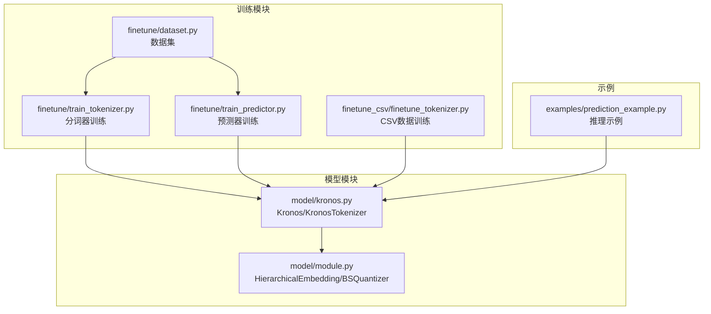
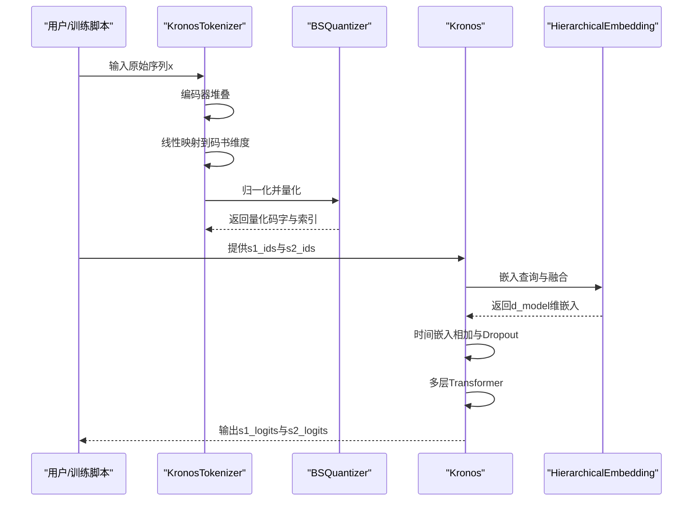
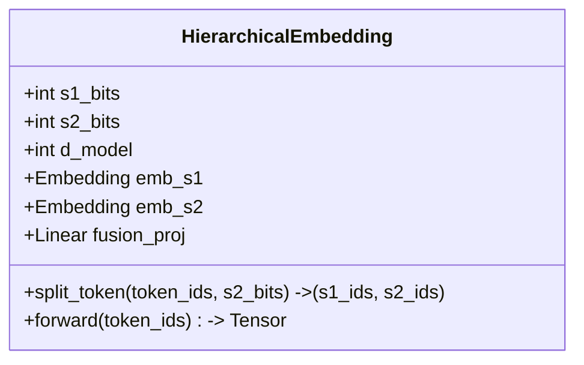
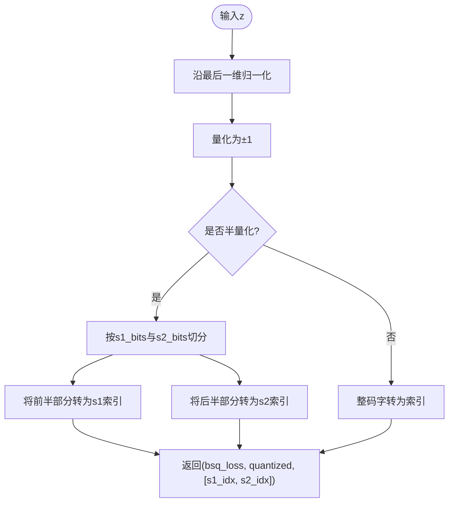
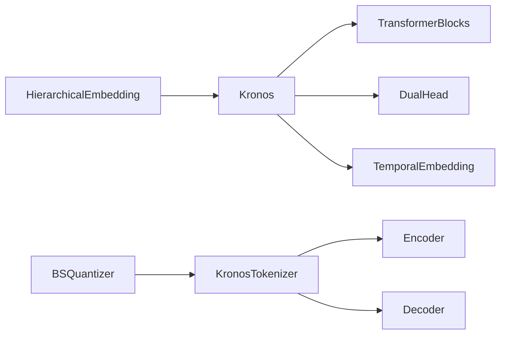

# 层次化嵌入机制

<cite>
**本文档引用的文件**
- [model/kronos.py](file://model/kronos.py)
- [model/module.py](file://model/module.py)
- [finetune/train_tokenizer.py](file://finetune/train_tokenizer.py)
- [finetune/train_predictor.py](file://finetune/train_predictor.py)
- [finetune/dataset.py](file://finetune/dataset.py)
- [finetune_csv/finetune_tokenizer.py](file://finetune_csv/finetune_tokenizer.py)
- [examples/prediction_example.py](file://examples/prediction_example.py)
</cite>

## 目录
1. [简介](#简介)
2. [项目结构](#项目结构)
3. [核心组件](#核心组件)
4. [架构总览](#架构总览)
5. [详细组件分析](#详细组件分析)
6. [依赖关系分析](#依赖关系分析)
7. [性能考虑](#性能考虑)
8. [故障排除指南](#故障排除指南)
9. [结论](#结论)

## 简介
本文件深入解析Kronos项目中的层次化嵌入机制，重点阐述s1位与s2位级别的离散表示如何映射到连续向量空间，以及HierarchicalEmbedding类的实现原理。层次化设计的核心思想是：s1位提供基础信息（粗粒度、语义稳定），s2位提供细化信息（细粒度、局部扰动）。通过两个独立的嵌入表分别学习s1和s2的表征，并在融合层进行组合，形成最终的d_model维连续向量表示。该机制在保持模型容量可控的同时，提升了对多尺度特征的建模能力，并与模型其他组件（如Transformer、注意力机制、时间嵌入等）保持良好兼容性。

## 项目结构
该项目采用模块化组织，核心逻辑集中在model目录下的Kronos与KronosTokenizer，训练流程分布在finetune与finetune_csv目录中，示例脚本位于examples目录。层次化嵌入机制主要体现在model/module.py中的HierarchicalEmbedding类，以及model/kronos.py中Kronos模型对它的使用。

**图表来源**
- [model/kronos.py:180-330](file://model/kronos.py#L180-L330)
- [model/module.py:400-444](file://model/module.py#L400-L444)
- [finetune/train_tokenizer.py:218-282](file://finetune/train_tokenizer.py#L218-L282)
- [finetune/train_predictor.py:182-245](file://finetune/train_predictor.py#L182-L245)
- [finetune/dataset.py:9-146](file://finetune/dataset.py#L9-L146)
- [finetune_csv/finetune_tokenizer.py:281-360](file://finetune_csv/finetune_tokenizer.py#L281-L360)
- [examples/prediction_example.py:1-81](file://examples/prediction_example.py#L1-L81)

**章节来源**
- [model/kronos.py:1-663](file://model/kronos.py#L1-L663)
- [model/module.py:1-571](file://model/module.py#L1-L571)
- [finetune/train_tokenizer.py:1-282](file://finetune/train_tokenizer.py#L1-L282)
- [finetune/train_predictor.py:1-245](file://finetune/train_predictor.py#L1-L245)
- [finetune/dataset.py:1-146](file://finetune/dataset.py#L1-L146)
- [finetune_csv/finetune_tokenizer.py:1-360](file://finetune_csv/finetune_tokenizer.py#L1-L360)
- [examples/prediction_example.py:1-81](file://examples/prediction_example.py#L1-L81)

## 核心组件
- 层次化嵌入（HierarchicalEmbedding）
  - 作用：将s1位与s2位的离散索引映射为d_model维连续向量，并通过线性融合得到最终嵌入。
  - 关键点：
    - 独立嵌入表：emb_s1（2^s1_bits维）与emb_s2（2^s2_bits维）。
    - 融合策略：拼接后经Linear投影至d_model维。
    - 初始化：嵌入权重按标准正态分布初始化，标准差为d_model^{-0.5}。
- 二进制球面量化（BinarySphericalQuantizer/BSQuantizer）
  - 作用：将连续向量压缩为s1+s2位的二进制码字，支持半量化的s1位与完整码字的组合。
  - 关键点：
    - 归一化输入，量化为±1，再按维度缩放。
    - 支持软熵损失与提交损失，平衡重建误差与码本熵。
- 模型集成
  - Kronos模型通过HierarchicalEmbedding接收s1_ids与s2_ids，结合时间嵌入与Transformer堆栈，输出双头分类结果（s1_logits与s2_logits）。

**章节来源**
- [model/module.py:400-444](file://model/module.py#L400-L444)
- [model/module.py:225-254](file://model/module.py#L225-L254)
- [model/kronos.py:180-330](file://model/kronos.py#L180-L330)

## 架构总览
层次化嵌入机制在Kronos中的整体流程如下：

**图表来源**
- [model/kronos.py:74-113](file://model/kronos.py#L74-L113)
- [model/module.py:225-254](file://model/module.py#L225-L254)
- [model/kronos.py:239-276](file://model/kronos.py#L239-L276)

## 详细组件分析

### HierarchicalEmbedding类详解
- 设计目标
  - 将s1位（基础信息）与s2位（细化信息）解耦，分别学习其表征，再融合以获得更丰富的上下文表示。
- 数据结构与复杂度
  - 嵌入表大小：vocab_s1=2^{s1_bits}，vocab_s2=2^{s2_bits}。
  - 嵌入维度：d_model。
  - 融合复杂度：线性投影O(d_model*(2*d_model))≈O(d_model^2)，通常远小于嵌入表参数规模。
- 实现要点
  - split_token：从复合token中提取低s2_bits位作为s2_ids，高部分作为s1_ids。
  - forward：分别查表并缩放，拼接后线性融合，得到最终嵌入。
  - 初始化：嵌入权重按N(0, (d_model)^{-0.5})初始化，确保初始范数稳定。
- 组合策略
  - 独立嵌入表保证s1与s2的表征独立学习；融合层强制共享上下文表示的一致性。

**图表来源**
- [model/module.py:400-444](file://model/module.py#L400-L444)

**章节来源**
- [model/module.py:400-444](file://model/module.py#L400-L444)

### 二进制球面量化与半量化
- 目标
  - 将编码器输出映射到s1+s2位的二进制空间，支持半量化的s1位与完整码字的组合，便于层次化解码。
- 关键流程
  - 归一化：沿最后一维归一化，确保量化输入在合理范围。
  - 量化：将实值映射为±1，保留梯度的可区分性。
  - 半量化：当half=True时，将前s1_bits位视为s1，后s2_bits位视为s2，分别转换为索引。
- 损失函数
  - 提交损失：鼓励量化结果接近原始特征。
  - 熵惩罚：通过软熵或硬熵估计，避免码本退化，提升表示多样性。

**图表来源**
- [model/module.py:225-254](file://model/module.py#L225-L254)

**章节来源**
- [model/module.py:225-254](file://model/module.py#L225-L254)

### s1与s2位映射到连续向量空间
- 离散到连续的映射
  - s1位与s2位分别通过独立的嵌入表映射到d_model维向量空间，随后在融合层进行组合。
- 维度选择原则
  - s1_bits与s2_bits共同决定码书维度（s1+s2），影响量化精度与模型容量。
  - d_model需足够大以承载两路嵌入的融合信息，同时避免过大的参数量。
- 兼容性
  - 与Transformer块、注意力机制、RMSNorm、时间嵌入等组件无缝衔接。
  - 与DualHead的双任务输出（s1与s2）天然匹配。

**章节来源**
- [model/module.py:400-444](file://model/module.py#L400-L444)
- [model/kronos.py:212-223](file://model/kronos.py#L212-L223)

### 嵌入初始化策略与正则化
- 初始化
  - 嵌入权重按N(0, (d_model)^{-0.5})初始化，确保初始范数稳定，有利于训练初期的梯度流动。
- 正则化
  - Token Dropout：在嵌入后加入Dropout，缓解过拟合并提升泛化。
  - RMSNorm：在Transformer内部使用，稳定激活分布，提升训练稳定性。
  - 可选的时间嵌入固定化（FixedEmbedding）：减少额外参数，降低过拟合风险。

**章节来源**
- [model/kronos.py:225-236](file://model/kronos.py#L225-L236)
- [model/module.py:257-269](file://model/module.py#L257-L269)
- [model/module.py:516-534](file://model/module.py#L516-L534)

### 嵌入表大小对模型容量与计算效率的影响
- 容量影响
  - s1_bits与s2_bits越大，嵌入表规模越大，模型表达能力越强，但参数量与内存占用随之增加。
  - 合理设置s1_bits与s2_bits可在容量与效率间取得平衡。
- 计算效率
  - 嵌入查询为O(1)查找，融合层线性投影为O(d_model^2)，通常远小于嵌入表参数规模。
  - 在推理阶段，可优先使用s1位进行快速解码，再用s2位细化。

**章节来源**
- [model/module.py:406-415](file://model/module.py#L406-L415)
- [model/kronos.py:212-214](file://model/kronos.py#L212-L214)

## 依赖关系分析
- 模块耦合
  - HierarchicalEmbedding与Kronos紧密耦合：前者负责s1/s2嵌入与融合，后者在前向中直接调用。
  - BSQuantizer与KronosTokenizer耦合：前者负责将连续向量量化为二进制码字，后者在前向中使用。
- 外部依赖
  - 训练脚本依赖数据集（QlibDataset/CustomKlineDataset）与优化器配置，确保端到端训练流程。
  - 示例脚本演示了从预训练模型加载到推理预测的完整流程。

**图表来源**
- [model/module.py:400-444](file://model/module.py#L400-L444)
- [model/kronos.py:180-330](file://model/kronos.py#L180-L330)

**章节来源**
- [model/module.py:400-444](file://model/module.py#L400-L444)
- [model/kronos.py:180-330](file://model/kronos.py#L180-L330)

## 性能考虑
- 训练稳定性
  - 使用RMSNorm与合适的初始化策略，有助于稳定训练过程。
  - Token Dropout与注意力Dropout可缓解过拟合。
- 推理效率
  - 分步解码：先解码s1位，再基于s1条件解码s2位，减少一次采样的搜索空间。
  - 半量化的s1位可加速重建与解码过程。
- 内存占用
  - 嵌入表规模受2^{s1+s2}控制，应根据硬件资源合理选择s1与s2的位宽。

[本节为通用性能讨论，不直接分析具体文件]

## 故障排除指南
- 嵌入维度不匹配
  - 症状：forward报错提示维度不一致。
  - 排查：确认s1_bits与s2_bits与模型初始化一致，且输入token_ids范围正确。
- 量化异常
  - 症状：量化后出现NaN或极值。
  - 排查：检查输入是否已归一化，确认group_size能被码书维度整除。
- 训练不稳定
  - 症状：Loss震荡或发散。
  - 排查：调整学习率、梯度裁剪阈值，检查Dropout与Norm配置。

**章节来源**
- [model/module.py:225-254](file://model/module.py#L225-L254)
- [model/kronos.py:225-236](file://model/kronos.py#L225-L236)

## 结论
层次化嵌入机制通过s1位与s2位的分离与融合，在保持模型容量可控的前提下，显著增强了对多尺度特征的建模能力。s1位提供稳定的语义基础，s2位捕捉局部细节与扰动，二者在融合层协同工作，最终进入Transformer进行高级抽象与预测。该机制与二进制球面量化、时间嵌入、注意力机制等组件高度兼容，既保证了训练稳定性，又兼顾了推理效率。在实际应用中，应根据任务需求与硬件资源合理选择s1_bits、s2_bits与d_model，以达到最佳的性能与效率平衡。