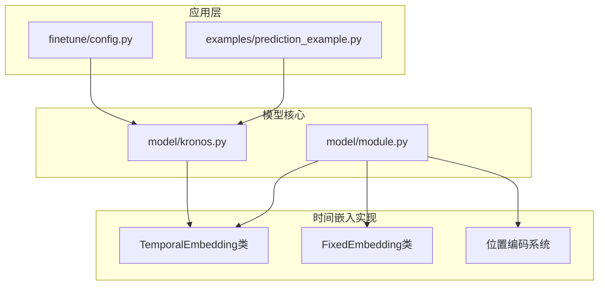
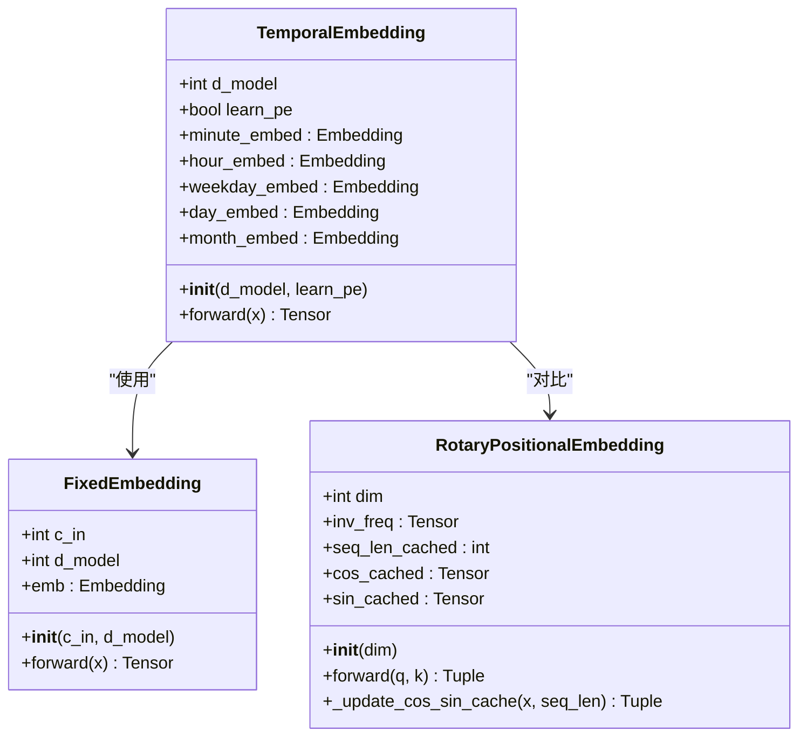
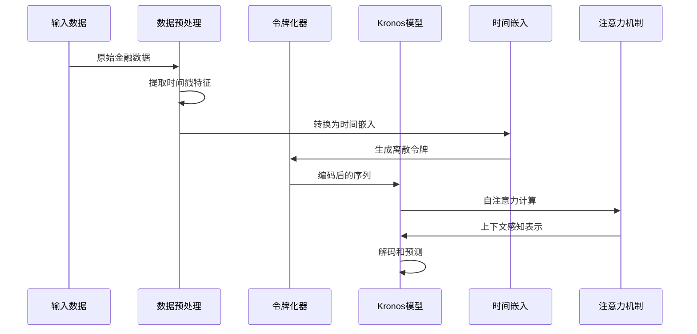
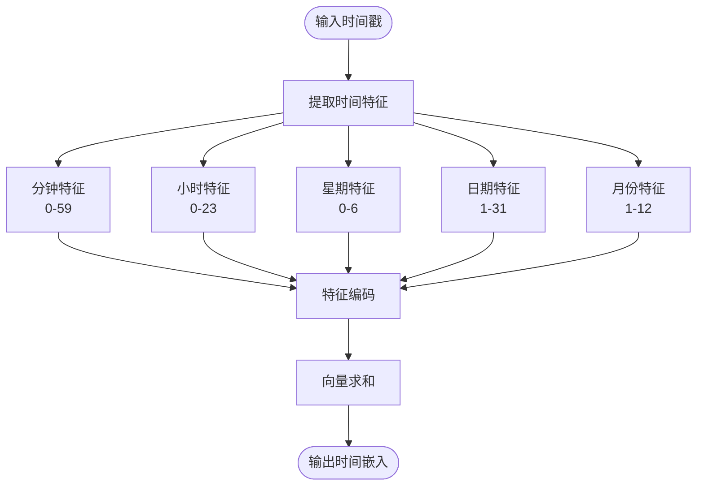
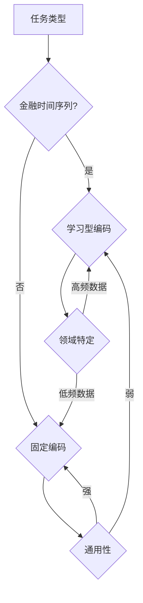
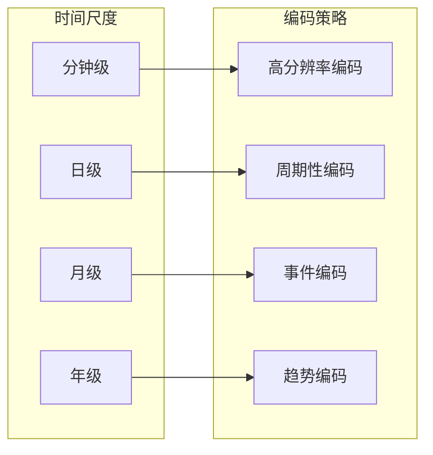
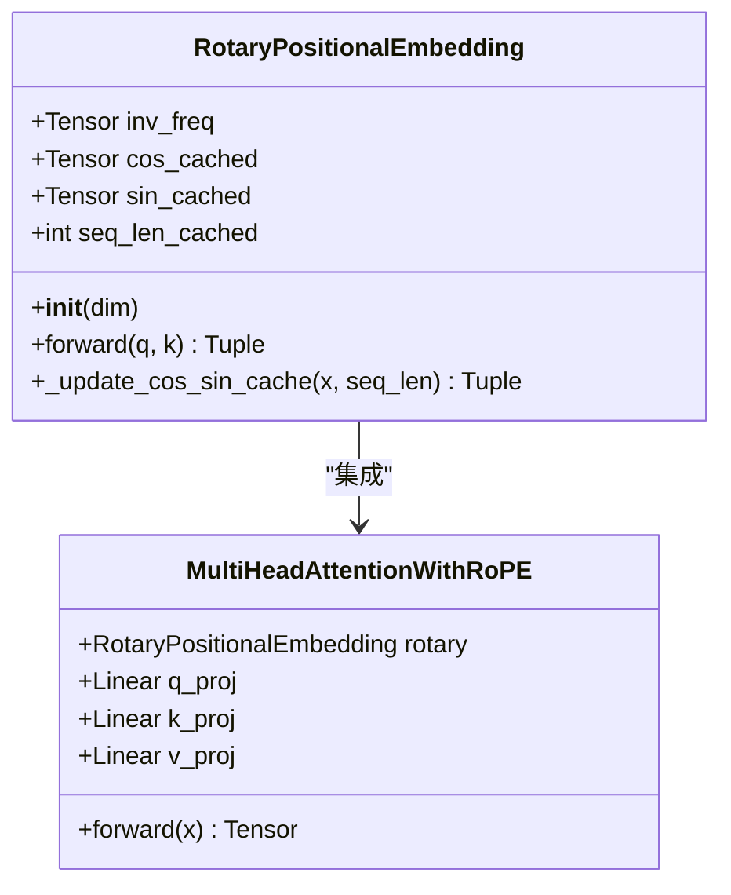
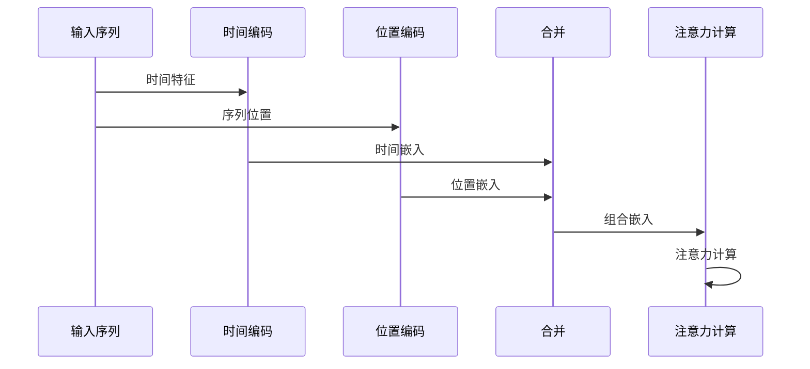

# 时间嵌入机制

<cite>
**本文档引用的文件**
- [model/module.py](file://model/module.py)
- [model/kronos.py](file://model/kronos.py)
- [examples/prediction_example.py](file://examples/prediction_example.py)
- [finetune/config.py](file://finetune/config.py)
</cite>

## 目录
1. [引言](#引言)
2. [项目结构概述](#项目结构概述)
3. [核心组件分析](#核心组件分析)
4. [架构概览](#架构概览)
5. [详细组件分析](#详细组件分析)
6. [时间特征编码策略](#时间特征编码策略)
7. [学习型时间嵌入vs固定时间编码](#学习型时间嵌入vs固定时间编码)
8. [注意力机制中的时间嵌入作用](#注意力机制中的时间嵌入作用)
9. [多时间尺度适应性分析](#多时间尺度适应性分析)
10. [位置编码与时间编码的关系](#位置编码与时间编码的关系)
11. [性能考虑](#性能考虑)
12. [故障排除指南](#故障排除指南)
13. [结论](#结论)

## 引言

Kronos项目中的时间嵌入机制是该金融时间序列预测模型的核心组成部分之一。本文档深入分析TemporalEmbedding类如何将时间戳特征转换为模型可理解的时序表示，详细解释分钟、小时、星期、日期和月份等时间特征的编码策略，以及学习型时间嵌入与固定时间编码的区别和适用场景。

时间嵌入机制在Kronos模型中扮演着至关重要的角色，它帮助模型捕捉时间相关的依赖关系，特别是在金融市场的高频数据处理中。通过将离散的时间特征映射到连续的向量空间，时间嵌入使得Transformer架构能够理解和利用时间模式。

## 项目结构概述

Kronos项目采用模块化设计，时间嵌入机制主要分布在以下文件中：



**图表来源**
- [model/module.py:536-563](file://model/module.py#L536-L563)
- [model/kronos.py:180-330](file://model/kronos.py#L180-L330)

**章节来源**
- [model/module.py:1-571](file://model/module.py#L1-L571)
- [model/kronos.py:1-663](file://model/kronos.py#L1-L663)

## 核心组件分析

### TemporalEmbedding类架构

TemporalEmbedding类是时间嵌入机制的核心实现，负责将时间戳特征转换为模型可理解的向量表示。该类的设计体现了模块化和可扩展性的原则。



**图表来源**
- [model/module.py:536-563](file://model/module.py#L536-L563)
- [model/module.py:516-534](file://model/module.py#L516-L534)
- [model/module.py:284-313](file://model/module.py#L284-L313)

### 关键参数配置

TemporalEmbedding类支持灵活的参数配置，主要体现在以下几个方面：

| 参数 | 值 | 说明 |
|------|-----|------|
| d_model | 可变 | 模型维度，控制嵌入向量的长度 |
| learn_pe | True/False | 是否使用可学习的位置编码 |
| minute_size | 60 | 分钟特征的离散值范围 |
| hour_size | 24 | 小时特征的离散值范围 |
| weekday_size | 7 | 星期特征的离散值范围 |
| day_size | 32 | 日期特征的离散值范围 |
| month_size | 13 | 月份特征的离散值范围 |

**章节来源**
- [model/module.py:536-563](file://model/module.py#L536-L563)

## 架构概览

时间嵌入机制在整个Kronos模型架构中的位置如下：



**图表来源**
- [model/kronos.py:239-277](file://model/kronos.py#L239-L277)
- [model/module.py:536-563](file://model/module.py#L536-L563)

## 详细组件分析

### TemporalEmbedding实现细节

TemporalEmbedding类的核心实现体现了精心设计的时间特征处理策略：

#### 特征分离与组合



**图表来源**
- [model/module.py:553-562](file://model/module.py#L553-L562)

#### 编码策略选择

TemporalEmbedding类支持两种不同的编码策略：

1. **固定时间编码（FixedEmbedding）**：使用正弦余弦函数生成固定的频率模式
2. **学习型编码（nn.Embedding）**：通过训练学习最优的时间编码

**章节来源**
- [model/module.py:536-563](file://model/module.py#L536-L563)
- [model/module.py:516-534](file://model/module.py#L516-L534)

### FixedEmbedding类分析

FixedEmbedding类实现了基于正弦余弦函数的固定位置编码方案：

#### 数学基础

固定编码使用以下数学公式：
- 正弦分量：sin(position × div_term)
- 余弦分量：cos(position × div_term)

其中div_term = exp(-(log(10000.0) / d_model))控制频率衰减。

#### 实现特点

```mermaid
classDiagram
class FixedEmbedding {
+Tensor w
+Embedding emb
+__init__(c_in, d_model)
+forward(x) Tensor
-generate_w() Tensor
}
FixedEmbedding --> "数学公式" : "sin/cos"
FixedEmbedding --> "不可训练" : "requires_grad=False"
```

**图表来源**
- [model/module.py:516-534](file://model/module.py#L516-L534)

**章节来源**
- [model/module.py:516-534](file://model/module.py#L516-L534)

## 时间特征编码策略

### 分钟特征编码

分钟特征具有周期性特性，范围从0到59。编码策略需要能够捕获这种2π周期性：

- **周期性**：每60分钟重复一次
- **分辨率**：1分钟精度
- **编码方法**：使用正弦余弦函数，频率为2π/60

### 小时特征编码

小时特征同样具有周期性，但周期更长：

- **周期性**：每24小时重复一次
- **分辨率**：1小时精度
- **编码方法**：频率为2π/24

### 星期特征编码

星期特征是离散的分类变量：

- **离散性**：7个类别（周一到周日）
- **编码方法**：one-hot编码或嵌入编码
- **特殊性**：需要考虑周末与工作日的差异

### 日期特征编码

日期特征包含月份和日期信息：

- **日期范围**：1-31天
- **月份范围**：1-12月
- **编码策略**：结合周期性和分类特性

### 组合策略

时间嵌入通过简单的向量求和实现多特征融合：

```
time_embedding = minute_embed + hour_embed + weekday_embed + day_embed + month_embed
```

这种加法组合确保了：
- 各特征的独立性得到保持
- 高维向量空间的有效利用
- 计算复杂度的线性增长

**章节来源**
- [model/module.py:540-562](file://model/module.py#L540-L562)

## 学习型时间嵌入vs固定时间编码

### 固定时间编码的优势

1. **理论保证**：基于数学函数的确定性编码
2. **泛化能力**：对未见过的时间模式具有良好的外推能力
3. **计算效率**：无需额外的训练参数
4. **稳定性**：避免过拟合问题

### 学习型时间编码的优势

1. **自适应性**：能够学习特定任务的最佳编码方式
2. **优化潜力**：通过反向传播优化编码质量
3. **任务相关性**：编码可以针对具体金融时间序列进行优化
4. **灵活性**：支持动态调整编码策略

### 选择策略



**图表来源**
- [model/module.py:546](file://model/module.py#L546)

**章节来源**
- [model/module.py:536-563](file://model/module.py#L536-L563)

## 注意力机制中的时间嵌入作用

### 在Kronos模型中的集成

时间嵌入通过简单的加法操作集成到模型中：

```python
x = self.embedding([s1_ids, s2_ids])
if stamp is not None:
    time_embedding = self.time_emb(stamp)
    x = x + time_embedding
```

这种设计体现了以下优势：

1. **无侵入性**：不改变原有的令牌嵌入结构
2. **可解释性**：时间信息与内容信息并行存在
3. **灵活性**：可以根据需要启用或禁用时间嵌入

### 注意力权重的影响

时间嵌入通过以下方式影响注意力机制：

1. **位置敏感性**：使模型能够区分相同内容在不同时间点的差异
2. **时间依赖建模**：帮助捕捉短期和长期时间依赖关系
3. **上下文增强**：为每个时间步提供额外的上下文信息

### 多头注意力中的时间信息

在多头注意力机制中，时间嵌入信息会：

- 在每个注意力头中得到体现
- 影响查询、键、值的计算
- 支持跨时间步的信息传递

**章节来源**
- [model/kronos.py:239-277](file://model/kronos.py#L239-L277)

## 多时间尺度适应性分析

### 分钟级时间尺度

对于分钟级金融数据，时间嵌入需要：

- **高分辨率**：精确到分钟级别的时间信息
- **高频模式**：捕捉日内交易模式和市场波动
- **流动性考虑**：反映不同时间段的市场活跃度

### 日级时间尺度

对于日级金融数据：

- **交易日识别**：区分工作日和周末
- **市场周期**：捕捉周度和月度市场模式
- **事件影响**：反映重要经济事件的影响

### 月度和年度模式

长期时间尺度的关注重点：

- **季节性因素**：年节、季度财报等周期性事件
- **宏观经济**：政策变化、经济周期影响
- **结构性变化**：市场结构和监管环境变化

### 适应性机制



**章节来源**
- [model/kronos.py:472-481](file://model/kronos.py#L472-L481)

## 位置编码与时间编码的关系

### RoPE位置编码系统

Kronos模型采用了旋转位置编码（RoPE）系统：



**图表来源**
- [model/module.py:284-354](file://model/module.py#L284-L354)

### 时间编码与位置编码的互补作用

| 特性 | 时间编码 | 位置编码 | 互补性 |
|------|----------|----------|--------|
| **信息类型** | 时间语义信息 | 序列位置信息 | 完全互补 |
| **编码方式** | 周期性函数/嵌入 | 三角函数 | 不同数学基础 |
| **适用场景** | 金融时间模式 | 一般序列位置 | 共同使用 |
| **计算复杂度** | O(T) | O(T) | 线性叠加 |

### 集成策略



**图表来源**
- [model/module.py:284-354](file://model/module.py#L284-L354)
- [model/module.py:536-563](file://model/module.py#L536-L563)

**章节来源**
- [model/module.py:284-354](file://model/module.py#L284-L354)

## 性能考虑

### 计算复杂度分析

时间嵌入的计算复杂度为O(B×T×d)，其中：
- B：批量大小
- T：序列长度  
- d：嵌入维度

### 内存使用优化

1. **参数共享**：相同时间特征使用相同的嵌入矩阵
2. **缓存机制**：位置编码的缓存减少重复计算
3. **混合精度**：支持半精度浮点数计算

### 实际性能指标

| 操作 | 复杂度 | 优化策略 |
|------|--------|----------|
| 时间特征提取 | O(T) | 向量化操作 |
| 嵌入查找 | O(T) | 批量索引 |
| 向量求和 | O(T×d) | 广播操作 |
| 注意力计算 | O(T²×d) | 矩阵乘法优化 |

## 故障排除指南

### 常见问题及解决方案

#### 时间特征范围错误

**问题**：时间特征超出预定义范围
**解决方案**：
- 检查时间戳数据的完整性
- 实现边界检查和异常处理
- 使用默认值填充缺失特征

#### 维度不匹配

**问题**：时间嵌入维度与模型维度不一致
**解决方案**：
- 验证d_model参数设置
- 检查嵌入矩阵的维度配置
- 确保所有子嵌入的输出维度一致

#### 性能问题

**问题**：时间嵌入计算导致内存不足
**解决方案**：
- 实施批处理策略
- 使用梯度检查点技术
- 优化数据类型（如使用float16）

**章节来源**
- [model/module.py:536-563](file://model/module.py#L536-L563)

## 结论

Kronos项目中的时间嵌入机制展现了现代深度学习模型在处理金融时间序列数据方面的先进理念。通过精心设计的时间特征编码策略，该机制成功地将离散的时间信息转换为连续的向量表示，为Transformer架构提供了强大的时间感知能力。

TemporalEmbedding类的实现体现了以下关键优势：

1. **模块化设计**：清晰的特征分离和组合策略
2. **灵活性**：支持固定和学习型两种编码方式
3. **可扩展性**：易于添加新的时间特征
4. **效率性**：线性复杂度的计算开销

时间嵌入机制与RoPE位置编码系统的结合，为Kronos模型提供了双重的时间感知能力，既能够理解特定的时间模式，又能够保持序列位置的敏感性。这种互补的设计使得模型能够在各种金融时间尺度上都表现出色，从高频的分钟级数据到低频的日级数据都能有效处理。

未来的研究方向包括：
- 更高级的时间特征工程
- 自适应的时间编码学习
- 多模态时间信息融合
- 实时时间嵌入更新机制

通过持续的优化和改进，时间嵌入机制将继续在金融时间序列预测领域发挥重要作用。