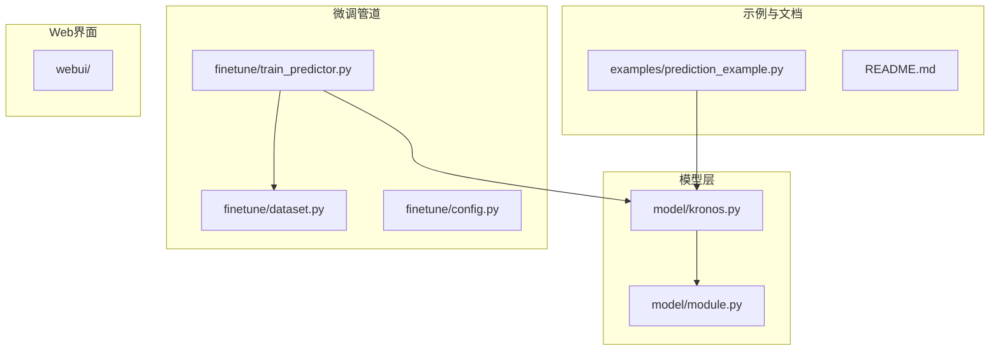
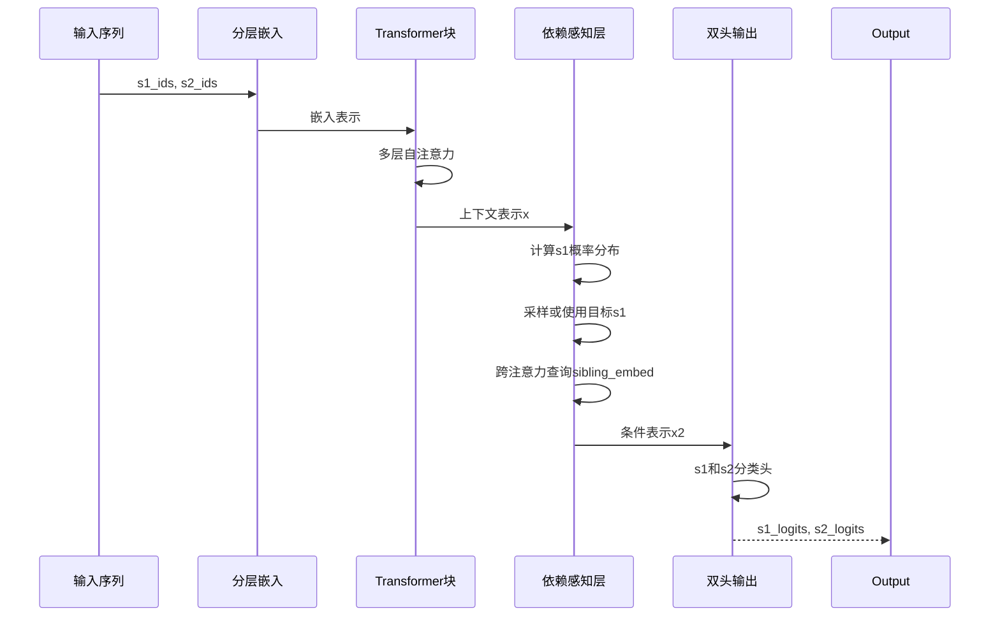
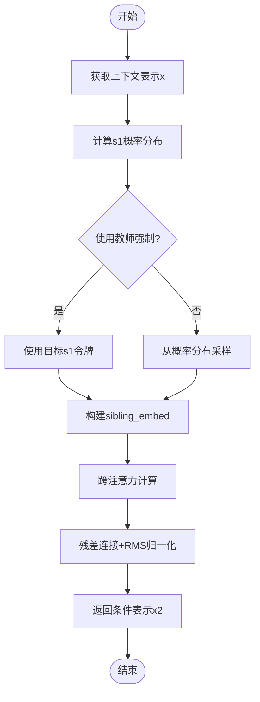
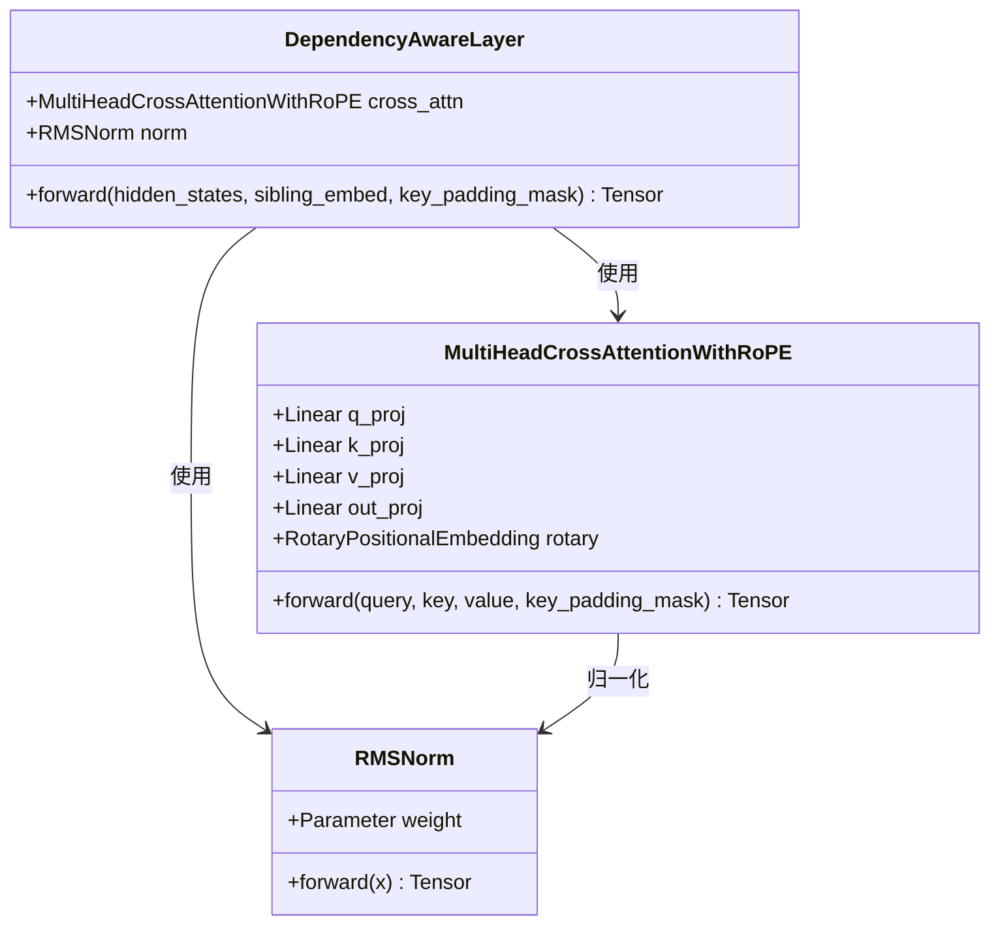
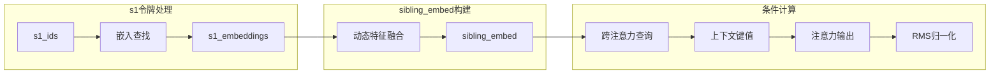
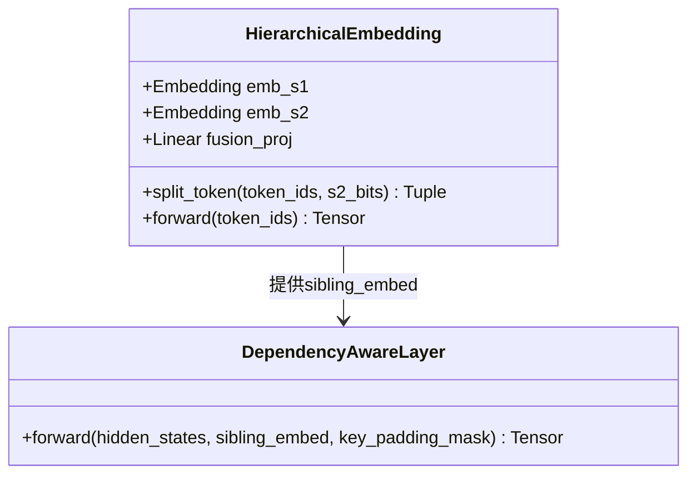
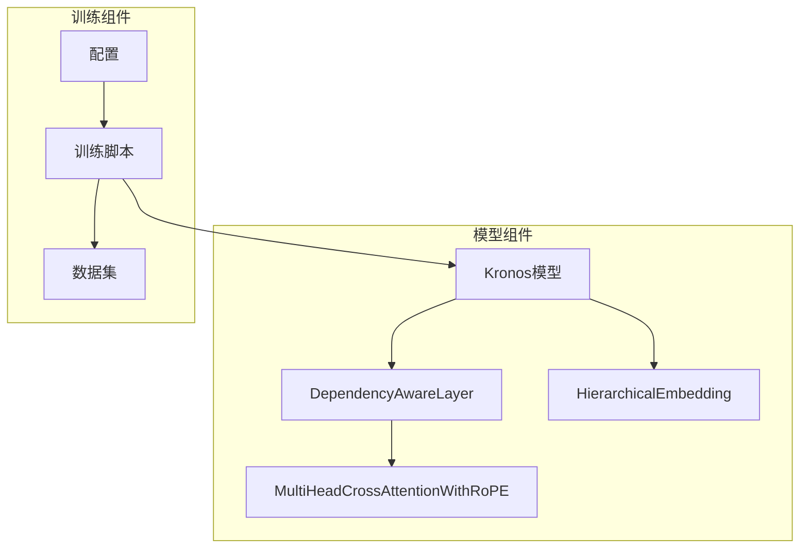
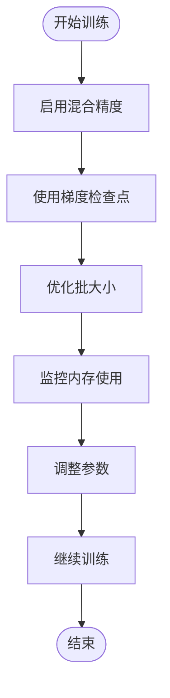

# 依赖感知层

<cite>
**本文档引用的文件**
- [model/kronos.py](file://model/kronos.py)
- [model/module.py](file://model/module.py)
- [finetune/train_predictor.py](file://finetune/train_predictor.py)
- [finetune/dataset.py](file://finetune/dataset.py)
- [README.md](file://README.md)
- [examples/prediction_example.py](file://examples/prediction_example.py)
</cite>

## 目录
1. [简介](#简介)
2. [项目结构](#项目结构)
3. [核心组件](#核心组件)
4. [架构概览](#架构概览)
5. [详细组件分析](#详细组件分析)
6. [依赖关系分析](#依赖关系分析)
7. [性能考虑](#性能考虑)
8. [故障排除指南](#故障排除指南)
9. [结论](#结论)
10. [附录](#附录)

## 简介

依赖感知层是Kronos金融市场基础模型中的一个关键组件，它实现了s1和s2令牌之间的条件依赖关系建模。该层通过跨注意力机制实现s1令牌对s2令牌预测的条件约束，从而提高了多维金融时间序列预测的准确性。

Kronos采用两阶段框架：首先使用二进制球面量化器将连续的多维K线数据（OHLCV）量化为分层离散令牌，然后使用大型自回归Transformer在这些令牌上进行预训练。依赖感知层位于主Transformer之后，专门处理s1和s2令牌之间的条件关系。

## 项目结构

该项目采用模块化设计，主要包含以下核心目录：



**图表来源**
- [model/kronos.py:1-663](file://model/kronos.py#L1-L663)
- [model/module.py:1-571](file://model/module.py#L1-L571)

**章节来源**
- [README.md:1-338](file://README.md#L1-L338)

## 核心组件

依赖感知层的核心功能包括：

### 主要特性
- **条件依赖建模**：通过跨注意力机制实现s1令牌对s2令牌预测的条件约束
- **层次化令牌处理**：支持s1（粗粒度）和s2（细粒度）令牌的联合建模
- **动态上下文融合**：根据s1令牌动态调整s2令牌的表示学习
- **内存高效设计**：采用RMS归一化和轻量级注意力机制

### 关键参数
- `d_model`：模型维度，控制嵌入空间大小
- `n_heads`：注意力头数量，默认4个
- `attn_dropout_p`：注意力dropout概率
- `resid_dropout`：残差连接dropout

**章节来源**
- [model/module.py:446-463](file://model/module.py#L446-L463)
- [model/kronos.py:219-222](file://model/kronos.py#L219-L222)

## 架构概览

依赖感知层在整个Kronos模型中的位置和作用：



**图表来源**
- [model/kronos.py:239-276](file://model/kronos.py#L239-L276)
- [model/module.py:446-463](file://model/module.py#L446-L463)

## 详细组件分析

### 依赖感知层实现

依赖感知层通过以下机制实现条件依赖关系：

#### 核心算法流程



**图表来源**
- [model/kronos.py:267-275](file://model/kronos.py#L267-L275)
- [model/module.py:452-462](file://model/module.py#L452-L462)

#### 层内注意力机制

依赖感知层使用多头交叉注意力机制：



**图表来源**
- [model/module.py:446-463](file://model/module.py#L446-L463)
- [model/module.py:356-398](file://model/module.py#L356-L398)
- [model/module.py:257-269](file://model/module.py#L257-L269)

**章节来源**
- [model/module.py:446-463](file://model/module.py#L446-L463)
- [model/module.py:356-398](file://model/module.py#L356-L398)

### 特征融合策略

依赖感知层采用动态特征融合策略：

#### sibling_embed生成机制



**图表来源**
- [model/kronos.py:267-272](file://model/kronos.py#L267-L272)
- [model/module.py:400-444](file://model/module.py#L400-L444)

#### 条件计算过程

依赖感知层的条件计算遵循以下步骤：

1. **概率分布计算**：基于当前上下文计算s1令牌的概率分布
2. **令牌选择策略**：
   - 教师强制模式：直接使用目标s1令牌
   - 采样模式：从概率分布中随机采样
3. **嵌入构建**：将选定的s1令牌转换为对应的嵌入向量
4. **跨注意力计算**：使用sibling_embed作为查询，上下文表示作为键值
5. **特征融合**：通过残差连接和RMS归一化融合条件信息

**章节来源**
- [model/kronos.py:267-275](file://model/kronos.py#L267-L275)
- [model/module.py:446-463](file://model/module.py#L446-L463)

### sibling_embed的生成和使用

#### 生成方式

sibling_embed的生成依赖于HierarchicalEmbedding模块：



**图表来源**
- [model/module.py:400-444](file://model/module.py#L400-L444)
- [model/module.py:446-463](file://model/module.py#L446-L463)

#### 对s2阶段预测的影响

sibling_embed通过以下方式影响s2阶段的预测：

1. **条件约束**：s1嵌入为s2令牌的预测提供语义约束
2. **上下文增强**：结合全局上下文和局部条件信息
3. **特征重加权**：通过注意力机制动态调整特征重要性
4. **时序一致性**：确保s1和s2令牌在时序上的逻辑一致性

**章节来源**
- [model/module.py:400-444](file://model/module.py#L400-L444)
- [model/kronos.py:326-328](file://model/kronos.py#L326-L328)

### 不同上下文长度下的行为特征

#### 短上下文长度（< 128）
- **优势**：计算效率高，内存占用低
- **特点**：依赖感知层能够快速捕捉短期依赖关系
- **适用场景**：实时预测和快速响应

#### 中等上下文长度（128-512）
- **优势**：平衡计算效率和预测准确性
- **特点**：能够建模中长期依赖关系
- **适用场景**：标准金融预测任务

#### 长上下文长度（> 512）
- **挑战**：计算复杂度和内存需求显著增加
- **优化策略**：使用窗口化处理和梯度检查点
- **适用场景**：需要长期历史信息的任务

**章节来源**
- [README.md:99-100](file://README.md#L99-L100)
- [finetune/config.py:21-23](file://finetune/config.py#L21-L23)

## 依赖关系分析

### 组件耦合关系



**图表来源**
- [model/kronos.py:180-330](file://model/kronos.py#L180-L330)
- [model/module.py:400-463](file://model/module.py#L400-L463)
- [finetune/train_predictor.py:60-179](file://finetune/train_predictor.py#L60-L179)

### 数据流依赖

依赖感知层的数据流遵循严格的时序依赖关系：

1. **输入依赖**：s1令牌必须先于s2令牌被处理
2. **状态传递**：上下文表示在Transformer层间传递
3. **条件约束**：sibling_embed提供条件信息
4. **输出解码**：s2令牌基于条件信息进行预测

**章节来源**
- [model/kronos.py:239-276](file://model/kronos.py#L239-L276)
- [model/module.py:446-463](file://model/module.py#L446-L463)

## 性能考虑

### 计算复杂度分析

依赖感知层的时间复杂度为O(T²·d)，其中T为序列长度，d为模型维度。空间复杂度为O(T·d)。

#### 优化策略

1. **注意力优化**：
   - 使用RoPE位置编码减少注意力计算
   - 实施稀疏注意力机制
   - 应用梯度检查点减少内存占用

2. **并行化策略**：
   - 批量处理多个序列
   - 利用GPU并行计算
   - 实施流水线并行

3. **内存优化**：
   - 动态上下文长度调整
   - 混合精度训练
   - 缓存机制优化

### 内存使用优化

#### 训练时内存优化



**图表来源**
- [finetune/train_predictor.py:112-116](file://finetune/train_predictor.py#L112-L116)

#### 推理时内存优化

推理阶段采用以下优化策略：
- 固定上下文长度
- 使用缓存机制
- 实施增量解码

**章节来源**
- [finetune/train_predictor.py:112-116](file://finetune/train_predictor.py#L112-L116)
- [model/kronos.py:389-469](file://model/kronos.py#L389-L469)

## 故障排除指南

### 常见问题及解决方案

#### 1. 内存不足问题
**症状**：训练过程中出现CUDA Out of Memory错误
**解决方案**：
- 减少批大小
- 启用梯度检查点
- 降低上下文长度
- 使用混合精度训练

#### 2. 收敛缓慢问题
**症状**：损失函数收敛速度慢或停滞
**解决方案**：
- 调整学习率
- 检查数据质量
- 增加正则化
- 调整注意力头数

#### 3. 预测质量下降
**症状**：s2令牌预测准确性降低
**解决方案**：
- 检查s1令牌质量
- 调整条件权重
- 增加训练数据
- 优化超参数

### 调试技巧

#### 1. 模型检查点
```python
# 在训练过程中定期保存检查点
if batch_idx_global % log_interval == 0:
    torch.save(model.state_dict(), f"checkpoint_{epoch}_{batch}.pth")
```

#### 2. 梯度监控
```python
# 监控梯度范数防止梯度爆炸
torch.nn.utils.clip_grad_norm_(model.parameters(), max_norm=3.0)
```

#### 3. 学习率调度
```python
# 使用OneCycleLR策略
scheduler = torch.optim.lr_scheduler.OneCycleLR(
    optimizer, max_lr=learning_rate,
    steps_per_epoch=len(train_loader), epochs=epochs,
    pct_start=0.03, div_factor=10
)
```

**章节来源**
- [finetune/train_predictor.py:83-179](file://finetune/train_predictor.py#L83-L179)

## 结论

依赖感知层通过创新的条件依赖建模机制，显著提升了Kronos模型在金融时间序列预测中的性能。其核心优势包括：

1. **精确的条件建模**：通过sibling_embed实现s1对s2的精确条件约束
2. **高效的注意力机制**：采用跨注意力和RoPE位置编码的组合
3. **灵活的上下文处理**：支持不同长度的上下文输入
4. **良好的可扩展性**：模块化设计便于性能优化和功能扩展

未来的研究方向包括：
- 更高效的注意力机制设计
- 自适应上下文长度调整
- 多尺度依赖关系建模
- 实时推理优化

## 附录

### 使用示例

#### 基本预测流程
```python
# 加载预训练模型
tokenizer = KronosTokenizer.from_pretrained("NeoQuasar/Kronos-Tokenizer-base")
model = Kronos.from_pretrained("NeoQuasar/Kronos-small")

# 创建预测器
predictor = KronosPredictor(model, tokenizer, max_context=512)

# 执行预测
pred_df = predictor.predict(
    df=x_df,
    x_timestamp=x_timestamp,
    y_timestamp=y_timestamp,
    pred_len=pred_len,
    T=1.0,
    top_p=0.9,
    sample_count=1
)
```

**章节来源**
- [examples/prediction_example.py:41-79](file://examples/prediction_example.py#L41-L79)
- [README.md:107-166](file://README.md#L107-L166)

### 配置参数说明

#### 关键超参数
- `s1_bits`：s1令牌的位数，控制粗粒度表示能力
- `s2_bits`：s2令牌的位数，控制细粒度表示能力
- `n_layers`：Transformer层数，影响模型深度
- `d_model`：模型维度，平衡表达能力和计算复杂度
- `n_heads`：注意力头数，影响并行处理能力

#### 训练配置
- `batch_size`：每GPU批大小
- `learning_rate`：学习率
- `epochs`：训练轮数
- `max_context`：最大上下文长度

**章节来源**
- [finetune/config.py:48-68](file://finetune/config.py#L48-L68)
- [finetune/config.py:99-107](file://finetune/config.py#L99-L107)