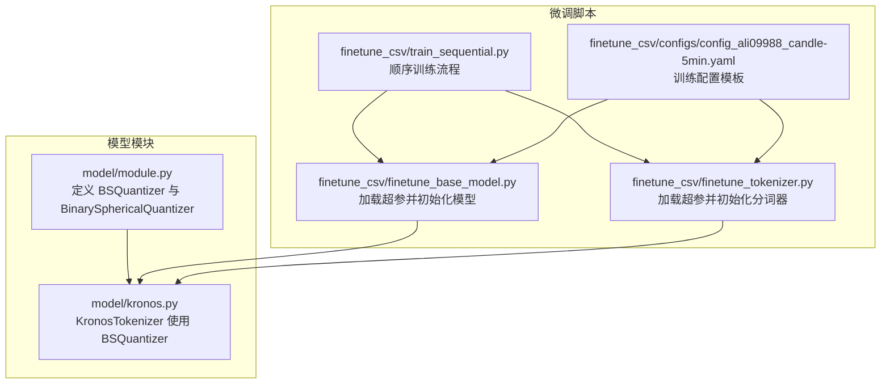
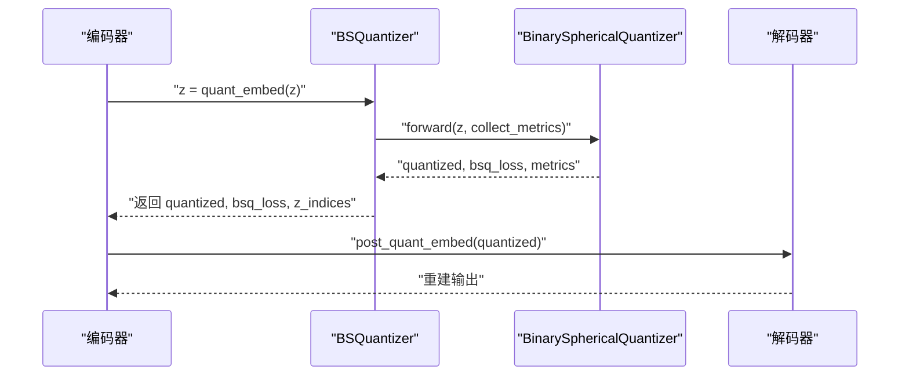
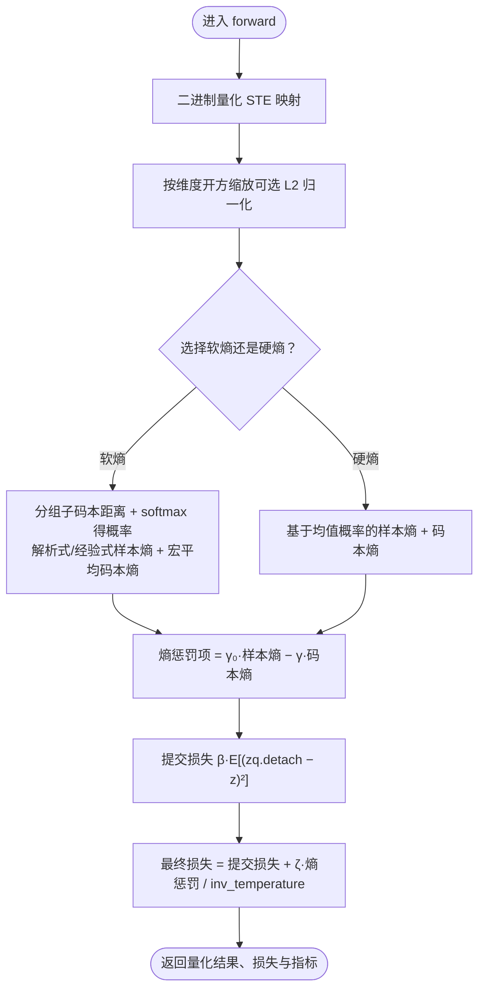
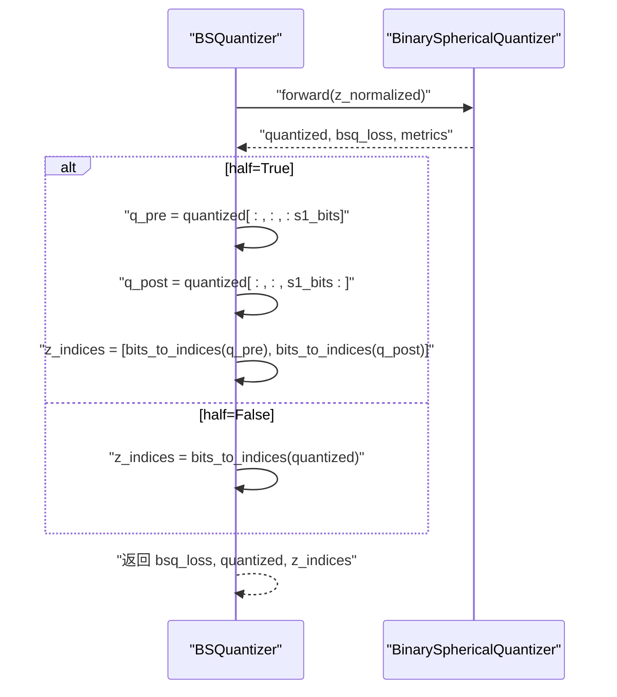
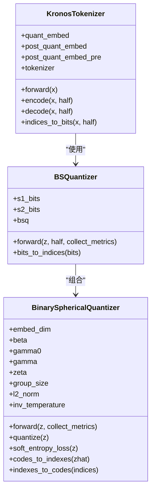

# 二进制球面量化器

<cite>
**本文档引用的文件**
- [model/module.py](file://model/module.py)
- [model/kronos.py](file://model/kronos.py)
- [finetune_csv/finetune_base_model.py](file://finetune_csv/finetune_base_model.py)
- [finetune_csv/finetune_tokenizer.py](file://finetune_csv/finetune_tokenizer.py)
- [finetune_csv/train_sequential.py](file://finetune_csv/train_sequential.py)
- [finetune_csv/configs/config_ali09988_candle-5min.yaml](file://finetune_csv/configs/config_ali09988_candle-5min.yaml)
</cite>

## 目录
1. [简介](#简介)
2. [项目结构](#项目结构)
3. [核心组件](#核心组件)
4. [架构总览](#架构总览)
5. [详细组件分析](#详细组件分析)
6. [依赖关系分析](#依赖关系分析)
7. [性能考量](#性能考量)
8. [故障排查指南](#故障排查指南)
9. [结论](#结论)
10. [附录](#附录)

## 简介
本文件面向二进制球面量化器（Binary Spherical Quantizer, BSQuantizer）的技术文档，系统阐述其工作原理、数学公式与算法实现，详解参数配置（β、γ₀、γ、ζ、group_size 等）的作用与调优策略，解析量化压缩比的计算方法（理论与实际），说明量化损失函数的设计思路（重构误差与正则化项的平衡），并提供精度分析、性能优化策略以及不同量化参数对模型性能的影响评估。

## 项目结构
该仓库围绕金融时间序列建模构建，其中二进制球面量化器位于模型模块中，作为分层离散化（Hierarchical Discrete Tokens）的关键组件，服务于 K 线序列的连续特征到离散符号的映射。训练流程通过独立的微调脚本加载配置并驱动模型训练。

图表来源
- [model/module.py:225-254](file://model/module.py#L225-L254)
- [model/kronos.py:72-96](file://model/kronos.py#L72-L96)
- [finetune_csv/finetune_base_model.py:409-415](file://finetune_csv/finetune_base_model.py#L409-L415)
- [finetune_csv/finetune_tokenizer.py:324-330](file://finetune_csv/finetune_tokenizer.py#L324-L330)
- [finetune_csv/train_sequential.py:105-109](file://finetune_csv/train_sequential.py#L105-L109)
- [finetune_csv/configs/config_ali09988_candle-5min.yaml:1-73](file://finetune_csv/configs/config_ali09988_candle-5min.yaml#L1-L73)

章节来源
- [model/module.py:225-254](file://model/module.py#L225-L254)
- [model/kronos.py:72-96](file://model/kronos.py#L72-L96)
- [finetune_csv/finetune_base_model.py:409-415](file://finetune_csv/finetune_base_model.py#L409-L415)
- [finetune_csv/finetune_tokenizer.py:324-330](file://finetune_csv/finetune_tokenizer.py#L324-L330)
- [finetune_csv/train_sequential.py:105-109](file://finetune_csv/train_sequential.py#L105-L109)
- [finetune_csv/configs/config_ali09988_candle-5min.yaml:1-73](file://finetune_csv/configs/config_ali09988_candle-5min.yaml#L1-L73)

## 核心组件
- BinarySphericalQuantizer：二进制球面量化器的核心实现，负责将连续嵌入映射到二进制码字空间，并施加提交损失与熵正则化。
- BSQuantizer：封装 BinarySphericalQuantizer 的高层接口，支持半分量化（half=True）与整量化两种模式，输出量化后的二进制表示及索引。

章节来源
- [model/module.py:39-223](file://model/module.py#L39-L223)
- [model/module.py:225-254](file://model/module.py#L225-L254)

## 架构总览
BSQuantizer 在 KronosTokenizer 中被用作编码器前端的离散化模块，将线性投影后的特征映射为二进制码字，随后分别解码回模型维度进行重建与预测。

图表来源
- [model/kronos.py:94-113](file://model/kronos.py#L94-L113)
- [model/module.py:245-254](file://model/module.py#L245-L254)
- [model/module.py:90-129](file://model/module.py#L90-L129)

章节来源
- [model/kronos.py:94-113](file://model/kronos.py#L94-L113)
- [model/module.py:245-254](file://model/module.py#L245-L254)
- [model/module.py:90-129](file://model/module.py#L90-L129)

## 详细组件分析

### BinarySphericalQuantizer 数学与算法
- 量化映射：将输入 z 按维度阈值映射到二进制符号空间，采用直通估计（STE）保留梯度。
- 归一化缩放：可选 L2 归一化，按嵌入维度开方进行缩放，确保码字能量分布稳定。
- 软熵损失（soft_entropy=True）：
  - 将嵌入按 group_size 分组，计算每组到子码本的距离并归一化得到概率；
  - 支持解析式近似或经验式计算样本熵；
  - 宏平均各组概率得到码本熵，整体熵近似为各组熵之和。
- 硬熵损失（soft_entropy=False）：
  - 基于样本维度上的均值概率直接计算样本熵与码本熵。
- 提交损失（commit loss）：衡量量化结果与原始嵌入的重构误差，控制量化偏向。

图表来源
- [model/module.py:90-129](file://model/module.py#L90-L129)
- [model/module.py:131-155](file://model/module.py#L131-L155)
- [model/module.py:157-161](file://model/module.py#L157-L161)

章节来源
- [model/module.py:82-88](file://model/module.py#L82-L88)
- [model/module.py:90-129](file://model/module.py#L90-L129)
- [model/module.py:131-155](file://model/module.py#L131-L155)
- [model/module.py:157-161](file://model/module.py#L157-L161)

### BSQuantizer 接口与索引转换
- 输入 z 经 L2 归一化后送入 BinarySphericalQuantizer；
- half=True 时将量化结果分为前半部分与后半部分，分别转为整型索引；
- half=False 时将整个量化结果按位权重求和得到单一索引；
- 返回 bsq_loss、量化后的二进制表示与对应的离散索引。

图表来源
- [model/module.py:245-254](file://model/module.py#L245-L254)
- [model/module.py:234-243](file://model/module.py#L234-L243)

章节来源
- [model/module.py:245-254](file://model/module.py#L245-L254)
- [model/module.py:234-243](file://model/module.py#L234-L243)

### 参数配置与调优策略
- s1_bits、s2_bits：分层离散化中高位与低位子码的比特数，决定码本容量与表达能力；
- beta：提交损失权重，控制量化偏向与重构误差的平衡；
- gamma0：样本熵权重，鼓励均匀分布的样本熵；
- gamma：码本熵权重，鼓励覆盖更广的码本区域；
- zeta：整体熵惩罚权重，控制正则化强度；
- group_size：分组大小，影响软熵近似的粒度与计算复杂度；
- inv_temperature：温度系数，影响概率分布的锐利程度；
- l2_norm：是否启用 L2 归一化缩放；
- persample_entropy_compute：样本熵计算方式（group 或 analytical）；
- cb_entropy_compute：码本熵计算方式（group 或 nce）。

调优建议
- 初期训练：降低 beta 与 zeta，增大 gamma0 以促进探索；
- 过拟合迹象：提高 gamma 与 zeta，减小 gamma0；
- 计算效率：适当增大 group_size 以减少软熵近似误差；
- 稳定性：若出现数值不稳定，可降低 inv_temperature 或启用 L2 归一化。

章节来源
- [model/module.py:40-66](file://model/module.py#L40-L66)
- [model/module.py:227-232](file://model/module.py#L227-L232)
- [finetune_csv/finetune_base_model.py:409-415](file://finetune_csv/finetune_base_model.py#L409-L415)
- [finetune_csv/finetune_tokenizer.py:324-330](file://finetune_csv/finetune_tokenizer.py#L324-L330)
- [finetune_csv/train_sequential.py:105-109](file://finetune_csv/train_sequential.py#L105-L109)

### 量化压缩比计算
- 理论压缩比：输入维度 d_model × 序列长度 T 与离散索引存储所需 bits 的比值。对于 s1_bits + s2_bits 总比特数，理论压缩比约为 d_model × T / (s1_bits + s2_bits)。
- 实际压缩比：需考虑索引打包、字典表大小、以及解码器线性层的参数量。实际存储通常小于理论值，因为索引以整型存储且可共享码本。
- 注意：BSQuantizer 输出的是二进制表示与索引，而非直接的压缩字节流；在实际部署中需结合具体编码格式与打包策略进一步评估。

章节来源
- [model/kronos.py:55](file://model/kronos.py#L55)
- [model/module.py:229](file://model/module.py#L229)

### 量化损失函数设计
- 重构误差：由提交损失承担，鼓励量化结果接近原始嵌入；
- 正则化：由熵惩罚项承担，平衡样本熵与码本熵，避免退化到少数码字；
- 温度调节：inv_temperature 控制概率分布的平滑程度，影响熵估计的稳定性；
- 指标收集：在非训练阶段统计已使用码字数量，辅助监控覆盖范围。

章节来源
- [model/module.py:118-129](file://model/module.py#L118-L129)
- [model/module.py:196-202](file://model/module.py#L196-L202)

### 精度分析与性能优化
- 精度：软熵近似与 L2 归一化有助于提升覆盖与稳定性；合理设置 group_size 可在近似误差与计算成本间取得平衡；
- 性能：group_size 增大可减少软熵近似误差但增加计算；half=True 可降低单次索引规模；inv_temperature 与 L2 归一化可改善收敛稳定性；
- 参数影响：gamma0 与 gamma 决定熵正则化强度；beta 控制重构与正则化的权衡；zeta 控制整体正则化幅度。

章节来源
- [model/module.py:58-66](file://model/module.py#L58-L66)
- [model/module.py:131-155](file://model/module.py#L131-L155)
- [model/module.py:118-129](file://model/module.py#L118-L129)

## 依赖关系分析
- BSQuantizer 依赖 BinarySphericalQuantizer；
- KronosTokenizer 在编码阶段使用 BSQuantizer，在解码阶段将索引还原为嵌入；
- 训练脚本通过配置文件传递超参，初始化模型与分词器。

图表来源
- [model/module.py:39-223](file://model/module.py#L39-L223)
- [model/module.py:225-254](file://model/module.py#L225-L254)
- [model/kronos.py:69-113](file://model/kronos.py#L69-L113)

章节来源
- [model/module.py:39-223](file://model/module.py#L39-L223)
- [model/module.py:225-254](file://model/module.py#L225-L254)
- [model/kronos.py:69-113](file://model/kronos.py#L69-L113)

## 性能考量
- 计算复杂度：软熵近似涉及分组与子码本距离计算，group_size 越大，计算越重；half=True 可将计算拆分为两部分；
- 内存占用：索引以整型存储，远小于浮点嵌入；码本规模为 2^(s1_bits+s2_bits)，需谨慎设置；
- 收敛稳定性：合理设置 inv_temperature 与 L2 归一化，有助于稳定概率分布与梯度流动；
- 部署优化：在推理阶段可缓存 group_codebook 与 basis，减少重复计算。

章节来源
- [model/module.py:76-78](file://model/module.py#L76-L78)
- [model/module.py:68-69](file://model/module.py#L68-L69)
- [model/module.py:131-155](file://model/module.py#L131-L155)

## 故障排查指南
- 维度不匹配：确保输入 z 的最后一维等于 embed_dim（即 s1_bits + s2_bits）；
- group_size 不整除：group_size 必须能整除 embed_dim；
- 训练不稳定：尝试降低 inv_temperature、启用 L2 归一化、调整 beta/gamma0/gamma/zeta；
- 索引异常：检查 half 参数与分段切分逻辑，确保前半与后半部分的比特数正确；
- 覆盖不足：若 used_codes 较少，增大 gamma 与 zeta，或减小 group_size 以提升探索。

章节来源
- [model/module.py:82-88](file://model/module.py#L82-L88)
- [model/module.py:58](file://model/module.py#L58)
- [model/module.py:104-107](file://model/module.py#L104-L107)

## 结论
二进制球面量化器通过将连续嵌入映射至二进制码字空间，结合软熵近似与提交损失，实现了高效且稳定的离散化。合理的参数配置（β、γ₀、γ、ζ、group_size）与训练策略能够显著提升模型的表达能力与泛化性能。在工程实践中，应根据任务需求与资源约束，动态调整这些参数以达到最佳的精度-效率平衡。

## 附录
- 训练配置模板展示了常用超参设置，便于快速复现实验与微调流程。

章节来源
- [finetune_csv/configs/config_ali09988_candle-5min.yaml:1-73](file://finetune_csv/configs/config_ali09988_candle-5min.yaml#L1-L73)