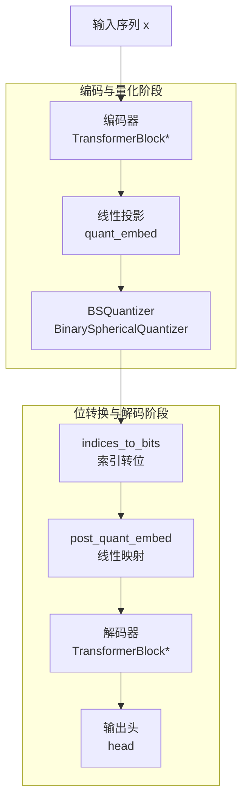
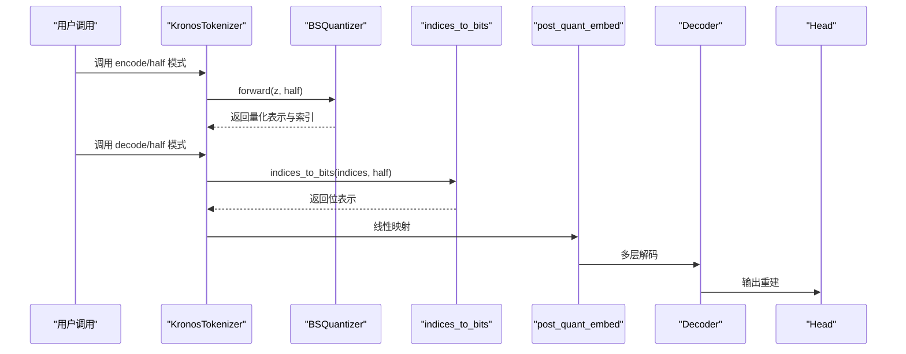
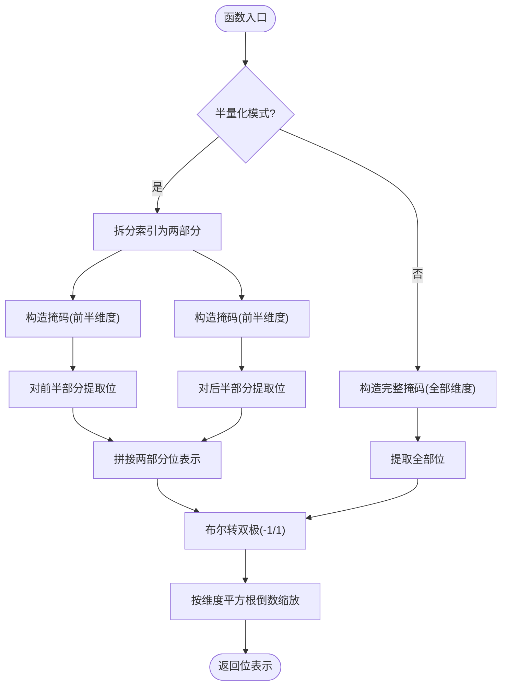
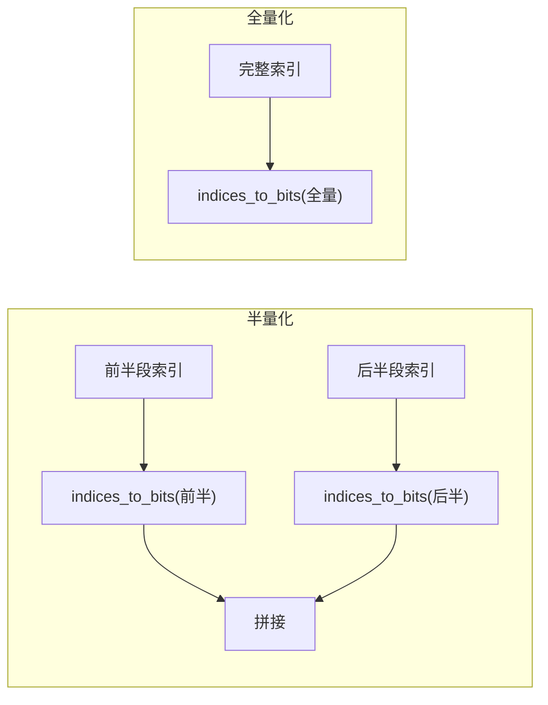
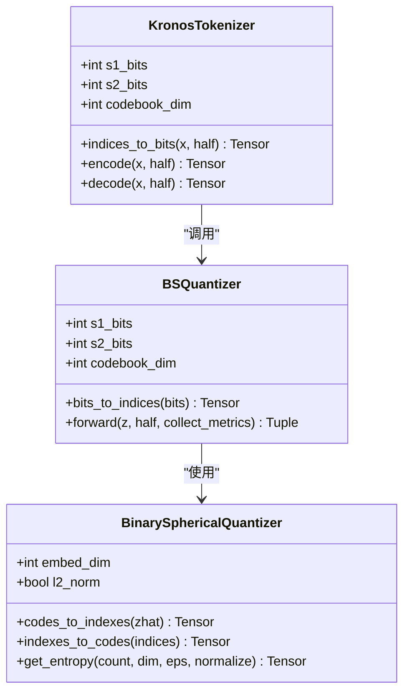
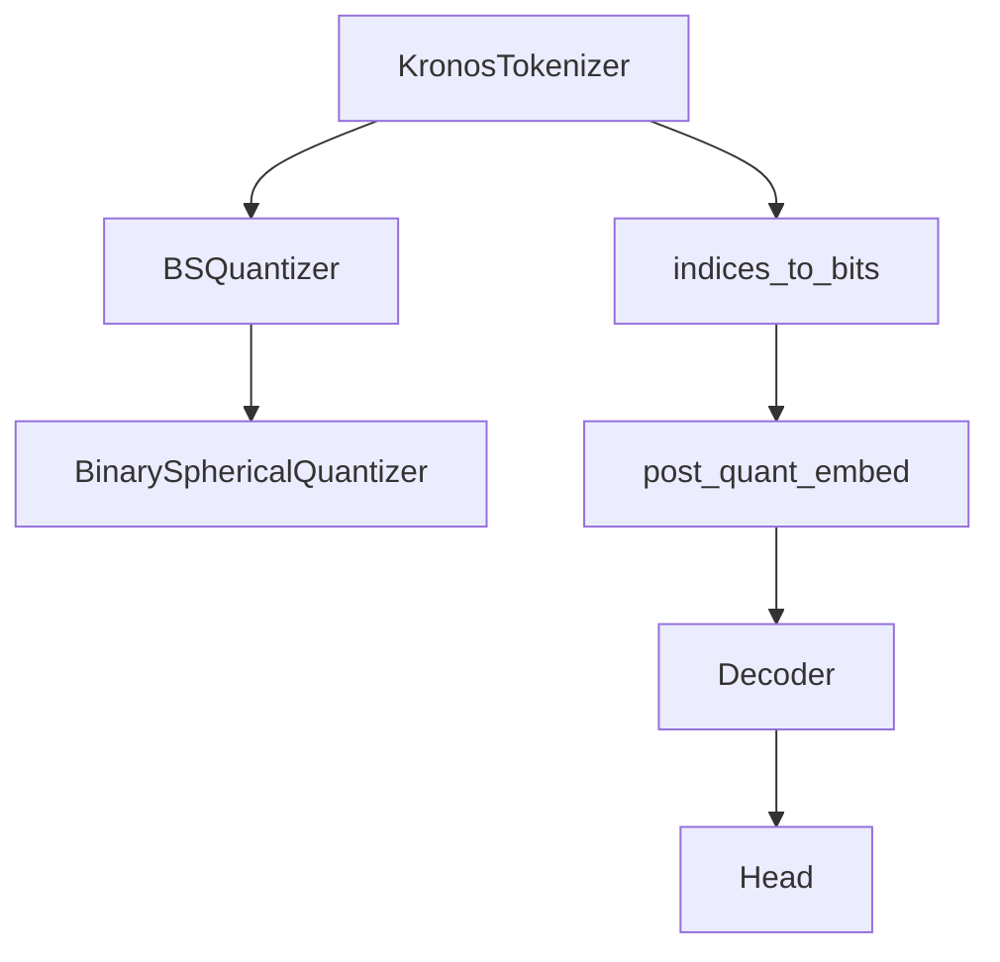

# 位转换方法

<cite>
**本文档引用的文件**
- [model/kronos.py](file://model/kronos.py)
- [model/module.py](file://model/module.py)
- [finetune/train_tokenizer.py](file://finetune/train_tokenizer.py)
- [finetune_csv/finetune_base_model.py](file://finetune_csv/finetune_base_model.py)
- [tests/test_kronos_regression.py](file://tests/test_kronos_regression.py)
</cite>

## 目录
1. [简介](#简介)
2. [项目结构](#项目结构)
3. [核心组件](#核心组件)
4. [架构总览](#架构总览)
5. [详细组件分析](#详细组件分析)
6. [依赖分析](#依赖分析)
7. [性能考量](#性能考量)
8. [故障排除指南](#故障排除指南)
9. [结论](#结论)

## 简介
本文件聚焦于位转换方法的技术细节，特别是 indices_to_bits 方法的实现与工作机制。该方法负责将量化后的索引（indices）转换为二进制位表示，并进行缩放以适配后续神经网络层。文档将深入解析：
- 索引到二进制位的映射过程与位掩码操作
- 半量化（half）模式与全量化模式的区别及转换策略
- 位转换的数学原理：二进制表示、位移操作与缩放因子计算
- 位转换在量化过程中的作用：离散化与连续值之间的桥梁
- 性能优化、数值精度与边界条件处理

## 项目结构
本项目围绕“分层量化”与“自回归解码”的整体架构展开，位转换方法位于编码器-量化器-解码器链路中，作为连接离散索引与连续表示的关键环节。

**图表来源**
- [model/kronos.py:74-113](file://model/kronos.py#L74-L113)
- [model/kronos.py:115-140](file://model/kronos.py#L115-L140)
- [model/module.py:225-254](file://model/module.py#L225-L254)

**章节来源**
- [model/kronos.py:74-113](file://model/kronos.py#L74-L113)
- [model/module.py:225-254](file://model/module.py#L225-L254)

## 核心组件
- indices_to_bits：将量化索引转换为二进制位表示并进行缩放，支持半量化模式与全量化模式。
- BSQuantizer：基于球面二元量化的量化器，提供索引与位之间的双向转换。
- BinarySphericalQuantizer：执行实际的二元球面量化与熵正则化，生成量化表示并返回损失与指标。
- 解码链路：通过 post_quant_embed 将位表示映射回模型维度，再经多层解码器重建输入。

**章节来源**
- [model/kronos.py:115-140](file://model/kronos.py#L115-L140)
- [model/module.py:225-254](file://model/module.py#L225-L254)
- [model/module.py:39-129](file://model/module.py#L39-L129)

## 架构总览
位转换方法在整体流程中的位置如下：

**图表来源**
- [model/kronos.py:142-177](file://model/kronos.py#L142-L177)
- [model/kronos.py:115-140](file://model/kronos.py#L115-L140)
- [model/module.py:245-254](file://model/module.py#L245-L254)

## 详细组件分析

### indices_to_bits 方法详解
该方法负责将量化得到的索引转换为二进制位表示，并进行缩放以适配后续层的输入尺度。

- 输入参数
  - x：量化索引张量；在半量化模式下可接受一个包含两部分索引的元组。
  - half：布尔标志，控制是否采用半量化模式。
- 处理流程
  - 半量化模式：将索引拆分为前半部分与后半部分，分别生成对应的二进制位表示，然后拼接。
  - 全量化模式：对整个索引张量生成二进制位表示。
  - 位掩码操作：通过按位与运算提取每一位，得到布尔矩阵。
  - 极性转换：将布尔值映射为 bipolar（-1, 1），便于与后续线性层兼容。
  - 缩放：按维度的平方根倒数进行缩放，保证统计特性稳定。
- 输出
  - 位表示张量，形状与量化表示一致，但元素范围为 [-1, 1]，并已按维度缩放。

**图表来源**
- [model/kronos.py:115-140](file://model/kronos.py#L115-L140)

**章节来源**
- [model/kronos.py:115-140](file://model/kronos.py#L115-L140)

### 半量化模式与全量化模式对比
- 半量化模式（half=True）
  - 将量化表示划分为两段，分别由不同的索引集合表示，随后分别转换为位表示并拼接。
  - 优点：降低单次转换的维度，减少计算与内存开销。
  - 适用：训练或推理时仅使用部分维度的场景。
- 全量化模式（half=False）
  - 对完整维度的量化表示进行一次性位转换。
  - 优点：保持更高分辨率的表示能力。
  - 适用：需要完整语义表征的场景。

**图表来源**
- [model/kronos.py:115-140](file://model/kronos.py#L115-L140)

**章节来源**
- [model/kronos.py:115-140](file://model/kronos.py#L115-L140)

### 位转换的数学原理
- 二进制表示
  - 通过位掩码 2^i 逐位提取索引的二进制位，得到布尔矩阵。
  - 将布尔值映射为双极（-1, 1），形成等价的二元向量空间表示。
- 位移操作
  - 在索引到位的逆向转换中，使用位移与按位与实现高效提取。
- 缩放因子
  - 使用 1/sqrt(codebook_dim) 进行归一化缩放，确保不同维度规模下的统计一致性与数值稳定性。

**图表来源**
- [model/module.py:225-254](file://model/module.py#L225-L254)
- [model/module.py:39-129](file://model/module.py#L39-L129)
- [model/kronos.py:115-140](file://model/kronos.py#L115-L140)

**章节来源**
- [model/module.py:234-243](file://model/module.py#L234-L243)
- [model/module.py:163-186](file://model/module.py#L163-L186)
- [model/kronos.py:115-140](file://model/kronos.py#L115-L140)

### 位转换在量化过程中的作用
- 离散化到连续的桥梁
  - 索引代表离散码字，位表示将其映射到连续的双极空间，便于与神经网络层（如线性层、注意力）融合。
- 维度与分辨率
  - s1_bits 与 s2_bits 决定分层表示的分辨率，半量化模式通过分块降低计算复杂度。
- 训练与推理
  - 训练阶段由 BSQuantizer 生成量化表示与索引；推理阶段通过 indices_to_bits 将索引还原为位表示，再经解码链路重建。

**章节来源**
- [model/module.py:245-254](file://model/module.py#L245-L254)
- [model/kronos.py:142-177](file://model/kronos.py#L142-L177)

## 依赖分析
- 模块间耦合
  - KronosTokenizer 依赖 BSQuantizer 完成量化与索引生成；解码路径依赖 indices_to_bits 将索引转位。
  - BSQuantizer 内部封装 BinarySphericalQuantizer，负责二元球面量化与熵正则化。
- 关键依赖链
  - 输入 x → 编码器 → quant_embed → BSQuantizer → indices_to_bits → post_quant_embed → 解码器 → 输出头

**图表来源**
- [model/kronos.py:74-113](file://model/kronos.py#L74-L113)
- [model/kronos.py:115-140](file://model/kronos.py#L115-L140)
- [model/module.py:225-254](file://model/module.py#L225-L254)

**章节来源**
- [model/kronos.py:74-113](file://model/kronos.py#L74-L113)
- [model/module.py:225-254](file://model/module.py#L225-L254)

## 性能考量
- 计算复杂度
  - 位掩码提取为 O(T × D) 的逐元素操作，其中 T 为序列长度，D 为维度；半量化将 D 分割为两部分，近似减半计算量。
- 内存占用
  - 位表示与原始量化表示等维存储；半量化在中间阶段拼接两个位张量，注意缓冲区管理。
- 数值稳定性
  - 缩放因子 1/sqrt(D) 有助于控制激活范数，避免梯度爆炸；L2 归一化选项进一步稳定嵌入分布。
- 实践建议
  - 在半量化模式下优先使用分块处理，减少一次性张量尺寸。
  - 合理设置 group_size 与 l2_norm，平衡表示能力与稳定性。

## 故障排除指南
- 索引越界或形状不匹配
  - 确保输入索引的维度与 s1_bits + s2_bits 一致；半量化模式下应传入包含两部分索引的元组。
- 设备与类型问题
  - 掩码与索引需在同一设备上；确保 dtype 与设备一致，避免跨设备错误。
- 半量化模式误用
  - 若 half=True，必须传入元组形式的索引；否则将导致拆分失败。
- 训练/推理一致性
  - 训练时使用 full 量化，推理时根据 encode/decode 的 half 参数保持一致，避免维度不匹配。

**章节来源**
- [model/kronos.py:115-140](file://model/kronos.py#L115-L140)
- [model/module.py:245-254](file://model/module.py#L245-L254)

## 结论
indices_to_bits 方法通过位掩码与双极映射，将量化索引高效转换为连续位表示，并以 1/sqrt(D) 缩放确保数值稳定性。半量化模式在保持表示能力的同时显著降低计算与内存开销，适用于大规模序列建模与实时推理。结合 BSQuantizer 的熵正则化与 BinarySphericalQuantizer 的球面约束，位转换在离散化与连续值之间建立了稳健的桥梁，为分层量化与自回归解码提供了关键支撑。