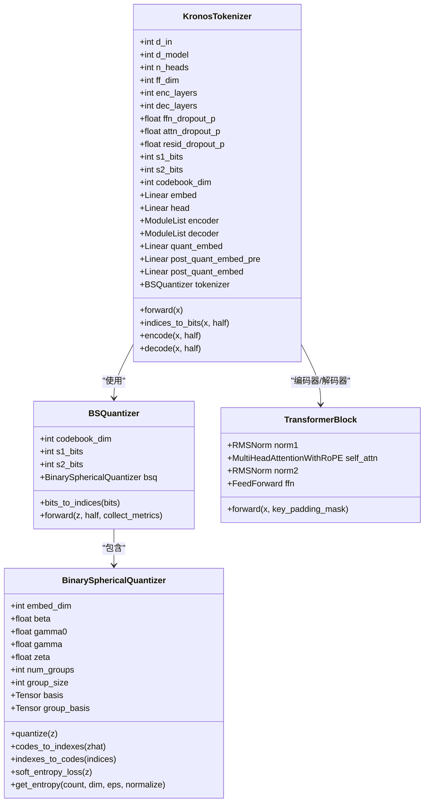
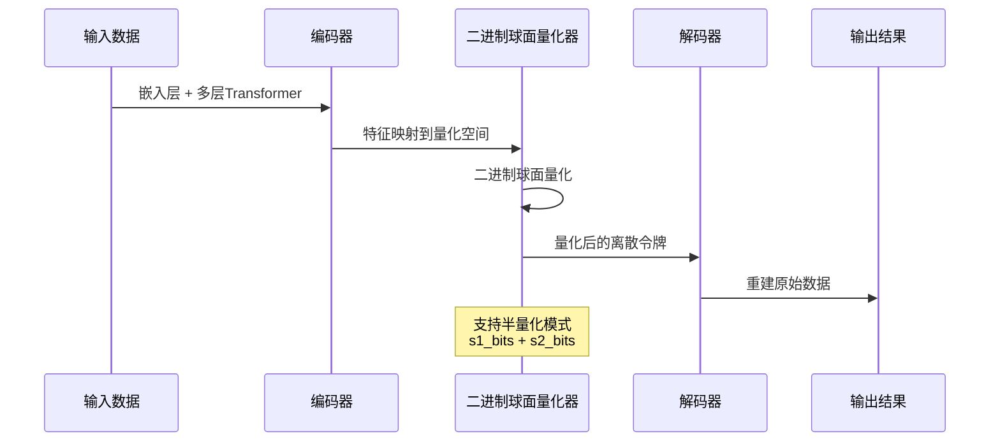
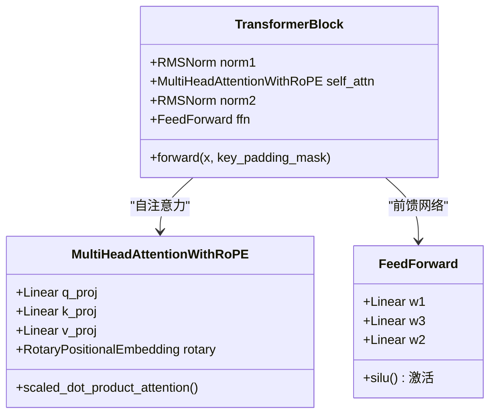
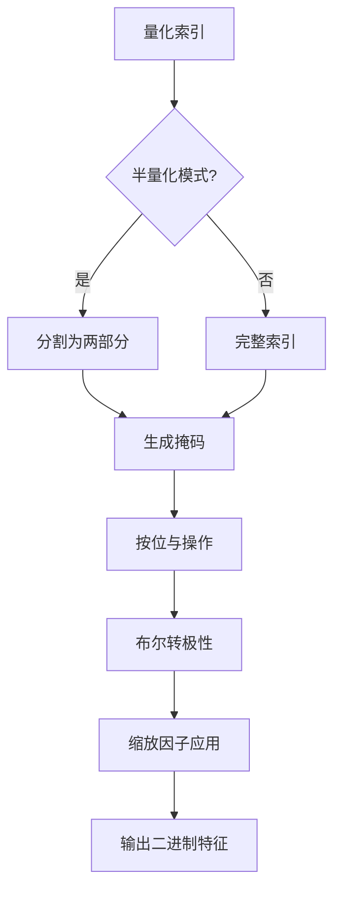
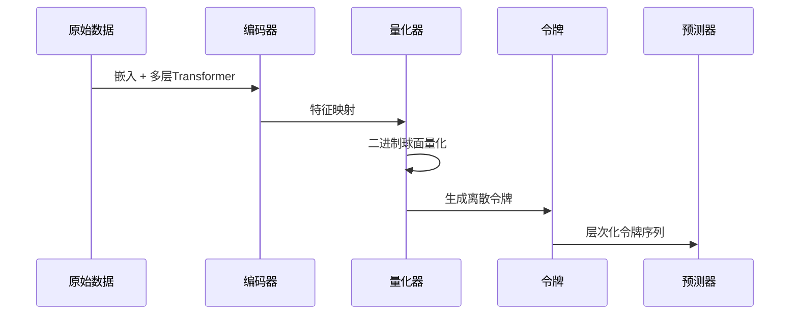
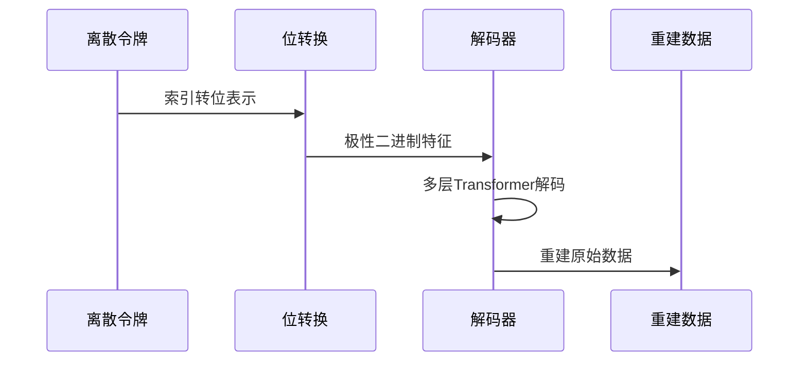
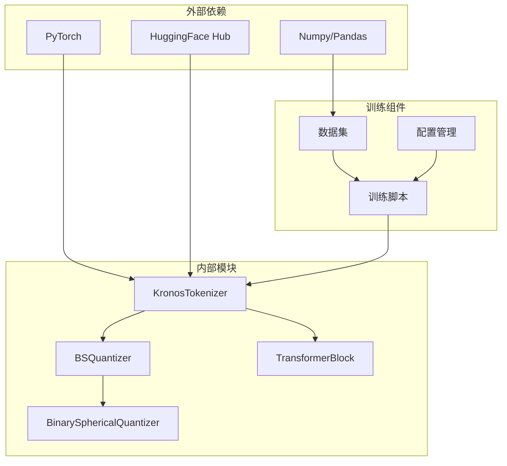
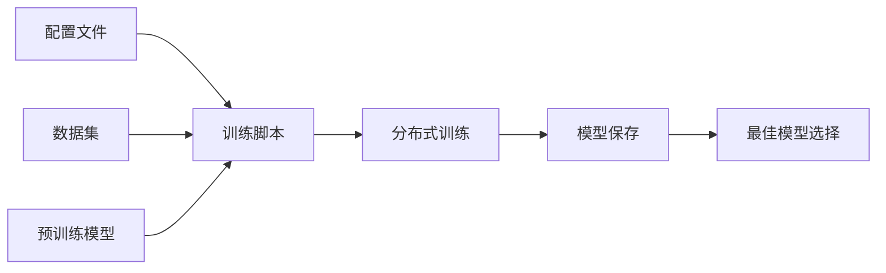

# 分词器架构

<cite>
**本文档引用的文件**
- [model/kronos.py](file://model/kronos.py)
- [model/module.py](file://model/module.py)
- [finetune/train_tokenizer.py](file://finetune/train_tokenizer.py)
- [finetune_csv/finetune_tokenizer.py](file://finetune_csv/finetune_tokenizer.py)
- [finetune/config.py](file://finetune/config.py)
- [finetune/dataset.py](file://finetune/dataset.py)
- [README.md](file://README.md)
</cite>

## 目录
1. [简介](#简介)
2. [项目结构](#项目结构)
3. [核心组件](#核心组件)
4. [架构概览](#架构概览)
5. [详细组件分析](#详细组件分析)
6. [依赖关系分析](#依赖关系分析)
7. [性能考虑](#性能考虑)
8. [故障排除指南](#故障排除指南)
9. [结论](#结论)

## 简介

KronosTokenizer是Kronos金融市场基础模型的核心组件，负责将连续的多维K线数据（OHLCV）量化为层次化的离散令牌。该系统采用创新的二进制球面量化（BSQuantizer）技术和编码器-解码器Transformer架构，实现了对金融时间序列数据的高效压缩和重建。

本文档深入解析KronosTokenizer的架构设计，重点阐述二进制球面量化的工作原理、层次化离散令牌生成机制，以及编码器-解码器Transformer的设计思路。

## 项目结构

Kronos项目采用模块化设计，主要包含以下关键目录：

```mermaid
graph TB
subgraph "核心模型"
A[model/kronos.py<br/>主模型定义"]
B[model/module.py<br/>基础组件库"]
end
subgraph "微调训练"
C[finetune/train_tokenizer.py<br/>分布式训练脚本]
D[finetune_csv/finetune_tokenizer.py<br/>CSV数据训练脚本]
E[finetune/config.py<br/>配置管理]
F[finetune/dataset.py<br/>数据集处理]
end
subgraph "示例应用"
G[examples/prediction_example.py<br/>预测示例]
H[webui/<br/>Web界面]
end
subgraph "测试验证"
I[tests/<br/>测试用例]
end
A --> B
C --> A
D --> A
E --> C
E --> D
F --> C
F --> D
```

**图表来源**
- [model/kronos.py:1-663](file://model/kronos.py#L1-L663)
- [model/module.py:1-571](file://model/module.py#L1-L571)

**章节来源**
- [README.md:1-338](file://README.md#L1-L338)

## 核心组件

### KronosTokenizer架构

KronosTokenizer是整个系统的核心，它结合了编码器-解码器Transformer架构和二进制球面量化技术：



**图表来源**
- [model/kronos.py:13-178](file://model/kronos.py#L13-L178)
- [model/module.py:225-254](file://model/module.py#L225-L254)
- [model/module.py:39-223](file://model/module.py#L39-L223)
- [model/module.py:465-483](file://model/module.py#L465-L483)

### 层次化离散令牌生成机制

系统采用s1_bits和s2_bits的层次化令牌生成策略：

- **s1_bits（高层令牌）**：提供粗粒度的时间序列表示，包含主要趋势信息
- **s2_bits（细层令牌）**：提供精细的局部波动信息，补充高层令牌的细节

这种设计实现了数据的渐进式重建：先使用s1_bits进行快速重建，再结合s2_bits进行精细化重建。

**章节来源**
- [model/kronos.py:53-56](file://model/kronos.py#L53-L56)
- [model/kronos.py:115-140](file://model/kronos.py#L115-L140)

## 架构概览

KronosTokenizer的整体架构采用端到端的流水线设计：



**图表来源**
- [model/kronos.py:74-113](file://model/kronos.py#L74-L113)
- [model/module.py:225-254](file://model/module.py#L225-L254)

## 详细组件分析

### 二进制球面量化（BSQuantizer）工作原理

BSQuantizer是KronosTokenizer的核心量化组件，基于球面量化理论实现高效的连续数据离散化：

#### 数学基础

二进制球面量化的核心思想是将连续特征映射到超球面上的离散点：

1. **特征归一化**：`z = normalize(z)`
2. **符号量化**：`z_hat = sign(z)`
3. **球面投影**：`z_q = z_hat × scale`

其中scale因子确保所有量化点位于单位球面上。

#### 熵损失函数

系统采用软熵损失来优化量化质量：

```mermaid
flowchart TD
A[输入特征 z] --> B[符号量化 z_hat = sign(z)]
B --> C[球面投影 z_q = z_hat × scale]
C --> D[计算索引 indices]
D --> E[软熵计算 H_soft]
E --> F[代码本熵 H_cb]
F --> G[总熵损失 L_entropy = γ₀×H_soft - γ×H_cb]
G --> H[提交损失 L_commit = β×||z_q - z||²]
H --> I[最终损失 L_total = L_commit + ζ×L_entropy]
```

**图表来源**
- [model/module.py:90-129](file://model/module.py#L90-L129)
- [model/module.py:131-155](file://model/module.py#L131-L155)

#### 半量化模式

系统支持半量化模式以提高效率：

- **half=False**：完整量化，使用全部s1_bits + s2_bits位
- **half=True**：仅量化前半部分，用于快速重建

**章节来源**
- [model/module.py:245-254](file://model/module.py#L245-L254)
- [model/kronos.py:96](file://model/kronos.py#L96)

### 编码器-解码器Transformer架构

#### 编码器设计

编码器负责从原始输入中提取高级特征表示：



**图表来源**
- [model/module.py:465-483](file://model/module.py#L465-L483)
- [model/module.py:315-353](file://model/module.py#L315-L353)
- [model/module.py:271-281](file://model/module.py#L271-L281)

#### 解码器设计

解码器负责将量化令牌重构为原始数据空间：

- **预量化解码器**：使用s1_bits进行快速重建
- **全量化解码器**：使用完整令牌进行精细重建

**章节来源**
- [model/kronos.py:94-113](file://model/kronos.py#L94-L113)

### 层次化离散令牌生成机制

#### 位转换逻辑

`indices_to_bits`方法实现了索引到二进制位的转换：



**图表来源**
- [model/kronos.py:115-140](file://model/kronos.py#L115-L140)

#### 令牌组合策略

系统通过位级组合实现令牌的层次化结构：

- **s1_bits权重**：`2^0, 2^1, ..., 2^(s1_bits-1)`
- **s2_bits权重**：`2^s1_bits, 2^(s1_bits+1), ..., 2^(s1_bits+s2_bits-1)`

**章节来源**
- [model/kronos.py:126-136](file://model/kronos.py#L126-L136)

### 数据流处理

#### 编码流程



**图表来源**
- [model/kronos.py:142-159](file://model/kronos.py#L142-L159)

#### 解码流程



**图表来源**
- [model/kronos.py:161-177](file://model/kronos.py#L161-L177)

**章节来源**
- [model/kronos.py:142-177](file://model/kronos.py#L142-L177)

## 依赖关系分析

### 组件耦合度



**图表来源**
- [model/kronos.py:1-10](file://model/kronos.py#L1-L10)
- [finetune/train_tokenizer.py:17-29](file://finetune/train_tokenizer.py#L17-L29)

### 训练流程依赖



**图表来源**
- [finetune/config.py:1-132](file://finetune/config.py#L1-L132)
- [finetune/train_tokenizer.py:218-282](file://finetune/train_tokenizer.py#L218-L282)

**章节来源**
- [finetune/train_tokenizer.py:74-215](file://finetune/train_tokenizer.py#L74-L215)
- [finetune_csv/finetune_tokenizer.py:151-278](file://finetune_csv/finetune_tokenizer.py#L151-L278)

## 性能考虑

### 量化压缩比计算

系统支持多种量化配置，压缩比取决于s1_bits和s2_bits的选择：

- **存储开销**：每个令牌占用 `(s1_bits + s2_bits)` 比特
- **压缩比**：相对于原始浮点数的压缩效果
- **重建精度**：通过熵损失和提交损失平衡

### 训练优化策略

#### 分布式训练

系统采用DDP（分布式数据并行）实现高效训练：
- **梯度累积**：模拟更大的批次大小
- **学习率调度**：OneCycleLR优化学习率
- **梯度裁剪**：防止梯度爆炸

#### 内存优化

- **混合精度训练**：减少内存占用
- **梯度检查点**：降低内存峰值
- **数据并行**：分布式数据加载

**章节来源**
- [finetune/train_tokenizer.py:98-111](file://finetune/train_tokenizer.py#L98-L111)
- [finetune_csv/finetune_tokenizer.py:159-172](file://finetune_csv/finetune_tokenizer.py#L159-L172)

## 故障排除指南

### 常见问题诊断

#### 量化错误

**症状**：量化损失异常或重建质量差
**解决方案**：
1. 检查输入数据的归一化
2. 调整熵损失权重参数
3. 验证代码本维度一致性

#### 训练不稳定

**症状**：训练损失震荡或发散
**解决方案**：
1. 减小学习率
2. 启用梯度裁剪
3. 检查批次大小设置

#### 内存不足

**症状**：GPU内存溢出
**解决方案**：
1. 减小批次大小
2. 使用梯度累积
3. 启用混合精度

**章节来源**
- [finetune/train_tokenizer.py:151](file://finetune/train_tokenizer.py#L151)
- [finetune_csv/finetune_tokenizer.py:213](file://finetune_csv/finetune_tokenizer.py#L213)

## 结论

KronosTokenizer通过创新的二进制球面量化技术和层次化离散令牌生成机制，成功实现了对金融时间序列数据的高效压缩和精确重建。该架构的主要优势包括：

1. **高效的量化压缩**：通过球面量化实现接近理论极限的压缩比
2. **层次化的表示学习**：s1_bits和s2_bits的组合提供了渐进式的特征表示
3. **强大的重建能力**：编码器-解码器架构确保了高质量的数据重建
4. **可扩展的训练框架**：支持大规模分布式训练和参数优化

该系统为金融市场的语言建模提供了坚实的基础，为后续的预测和分析任务奠定了重要的数据表示基础。