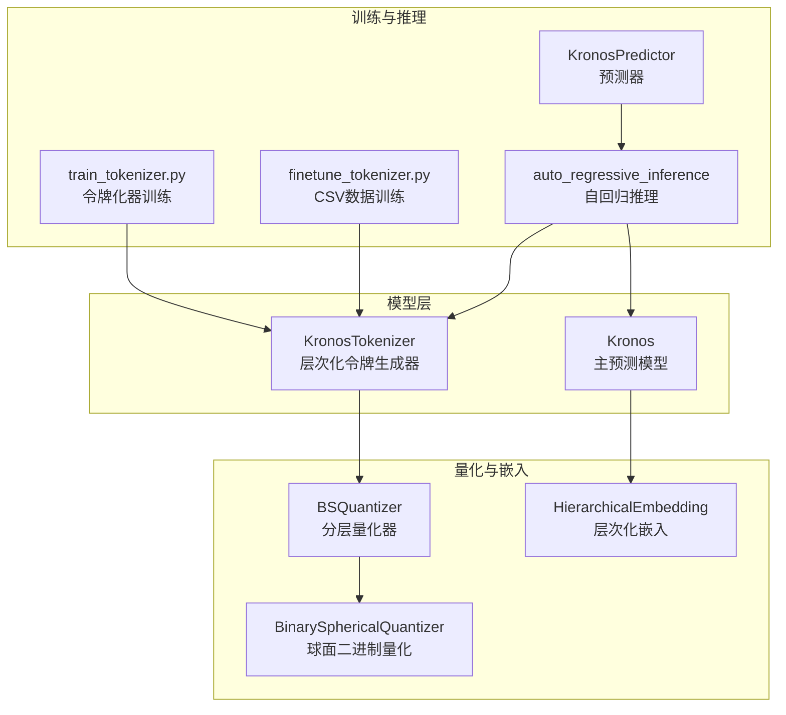
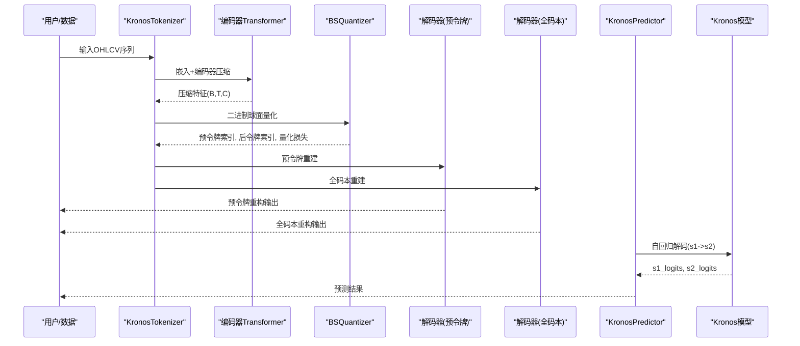
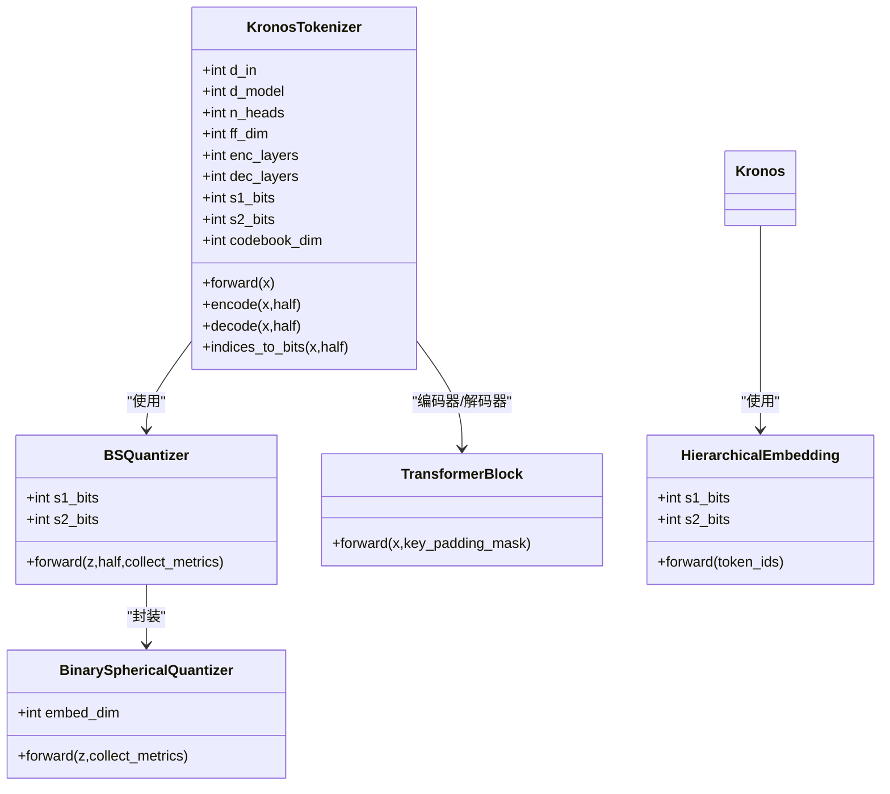
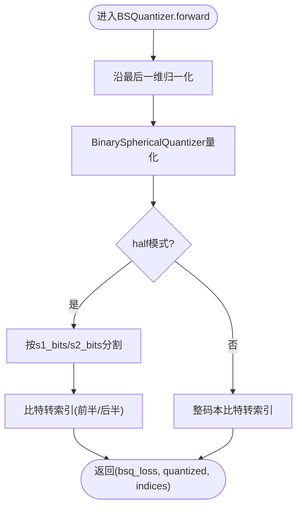
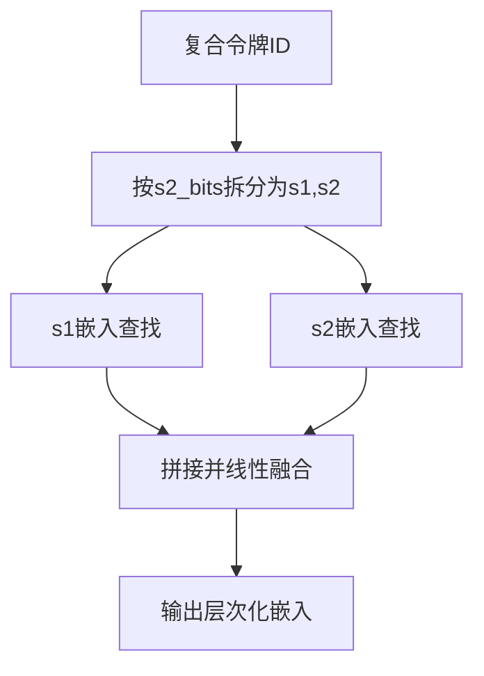
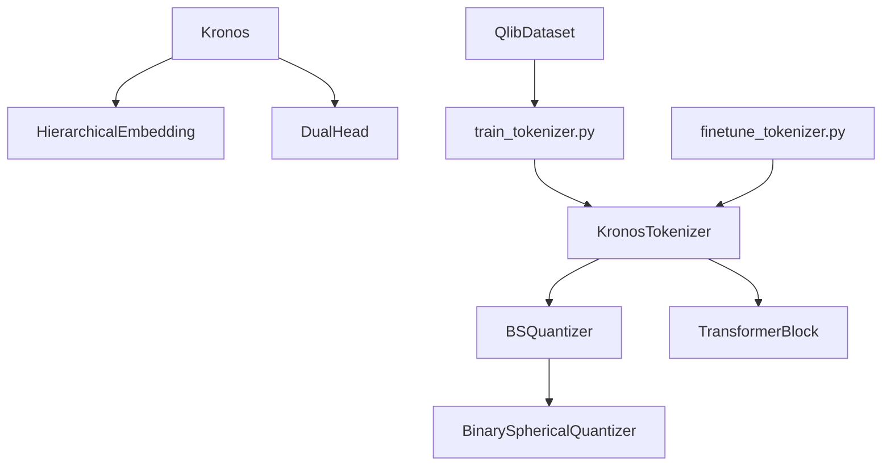

# 层次化令牌生成机制

<cite>
**本文引用的文件**
- [model/kronos.py](file://model/kronos.py)
- [model/module.py](file://model/module.py)
- [finetune/train_tokenizer.py](file://finetune/train_tokenizer.py)
- [finetune_csv/finetune_tokenizer.py](file://finetune_csv/finetune_tokenizer.py)
- [README.md](file://README.md)
- [examples/prediction_example.py](file://examples/prediction_example.py)
- [finetune/dataset.py](file://finetune/dataset.py)
</cite>

## 目录
1. [简介](#简介)
2. [项目结构](#项目结构)
3. [核心组件](#核心组件)
4. [架构概览](#架构概览)
5. [详细组件分析](#详细组件分析)
6. [依赖关系分析](#依赖关系分析)
7. [性能考量](#性能考量)
8. [故障排查指南](#故障排查指南)
9. [结论](#结论)
10. [附录](#附录)

## 简介
本文件系统性阐述Kronos项目中的层次化令牌生成机制，重点解析s1_bits与s2_bits的分层设计原理及其在预令牌（pre-token）与后令牌（post-token）之间的分工与协作。我们将从量化表示的分割、编码过程、令牌映射到整体架构流程进行深入剖析，并总结层次化设计在信息冗余控制、计算效率与预测精度方面的优势，同时给出令牌维度计算方法与性能影响分析。

## 项目结构
Kronos项目采用模块化设计，核心逻辑集中在model目录下的KronosTokenizer与Kronos模型，配合训练脚本完成令牌化器的微调与推理端的预测流程。



图表来源
- [model/kronos.py:13-178](file://model/kronos.py#L13-L178)
- [model/module.py:225-254](file://model/module.py#L225-L254)
- [finetune/train_tokenizer.py:74-215](file://finetune/train_tokenizer.py#L74-L215)
- [finetune_csv/finetune_tokenizer.py:151-278](file://finetune_csv/finetune_tokenizer.py#L151-L278)

章节来源
- [README.md:59-67](file://README.md#L59-L67)
- [model/kronos.py:13-178](file://model/kronos.py#L13-L178)
- [model/module.py:225-254](file://model/module.py#L225-L254)

## 核心组件
- 层次化令牌生成器（KronosTokenizer）
  - 使用编码器-解码器Transformer块与BSQuantizer进行压缩与重建，输出预令牌与全码本两路结果，分别用于不同阶段的重建与训练。
- 分层量化器（BSQuantizer）
  - 将输入特征映射到维度为s1_bits+s2_bits的码本空间，支持半量化的“前半部分”和“后半部分”分离处理。
- 层次化嵌入（HierarchicalEmbedding）
  - 将复合令牌ID按低s2_bits位与高s1_bits位拆分，分别映射到独立嵌入空间并通过融合投影得到统一表征。
- 主预测模型（Kronos）
  - 解码s1令牌，再以s1条件解码s2令牌，形成两级自回归生成流程。

章节来源
- [model/kronos.py:13-178](file://model/kronos.py#L13-L178)
- [model/module.py:225-254](file://model/module.py#L225-L254)
- [model/module.py:400-444](file://model/module.py#L400-L444)

## 架构概览
层次化令牌生成的整体流程如下：输入多维OHLCV序列经嵌入与编码器压缩至码本维度；随后通过BSQuantizer进行二进制球面量化，得到预令牌与后令牌索引；分别经对应的解码器路径重建输入；训练时同时优化重构损失与量化器损失；推理时通过Kronos模型的两级自回归解码生成s1与s2令牌序列。



图表来源
- [model/kronos.py:74-113](file://model/kronos.py#L74-L113)
- [model/kronos.py:389-469](file://model/kronos.py#L389-L469)
- [model/module.py:225-254](file://model/module.py#L225-L254)

## 详细组件分析

### 组件A：KronosTokenizer（层次化令牌生成器）
- 功能职责
  - 将连续多维输入映射到码本维度，执行二进制球面量化，输出预令牌与全码本两路重建结果，以及量化损失与索引。
- 关键实现要点
  - 编码器堆叠：对嵌入后的特征进行多层Transformer编码，得到压缩表示。
  - 码本映射：线性层将编码特征映射到s1_bits+s2_bits维度。
  - 分层量化：BSQuantizer支持half模式，将s1_bits与s2_bits分别提取并转换为索引。
  - 双路径解码：预令牌仅用s1_bits通道重建，全码本使用完整码本重建，分别经过对应解码器链路。
  - 指数映射：indices_to_bits将索引转换为双极(-1,1)比特向量并按维度开方缩放，便于后续解码。



图表来源
- [model/kronos.py:13-178](file://model/kronos.py#L13-L178)
- [model/module.py:225-254](file://model/module.py#L225-L254)
- [model/module.py:465-483](file://model/module.py#L465-L483)
- [model/module.py:400-444](file://model/module.py#L400-L444)

章节来源
- [model/kronos.py:74-177](file://model/kronos.py#L74-L177)
- [model/module.py:225-254](file://model/module.py#L225-L254)

### 组件B：BSQuantizer与BinarySphericalQuantizer（分层量化）
- 功能职责
  - 将码本维度的特征归一化后进行二进制球面量化，支持半量化的前半部分与后半部分分离处理，输出量化比特与索引。
- 关键实现要点
  - 归一化：对输入特征沿最后一维进行归一化，确保球面量化稳定性。
  - 半量化的分割：当half=True时，将s1_bits与s2_bits分别提取并转为索引；否则整码本转索引。
  - 比特到索引：通过位权展开将二进制比特转换为整数索引，支持批量操作。
  - 量化损失：结合提交损失与熵惩罚项，平衡重构误差与码本使用均匀性。



图表来源
- [model/module.py:225-254](file://model/module.py#L225-L254)
- [model/module.py:39-130](file://model/module.py#L39-L130)

章节来源
- [model/module.py:225-254](file://model/module.py#L225-L254)
- [model/module.py:39-130](file://model/module.py#L39-L130)

### 组件C：HierarchicalEmbedding（层次化嵌入）
- 功能职责
  - 将复合令牌ID按低s2_bits位与高s1_bits位拆分，分别映射到独立嵌入空间并通过线性融合得到统一表征。
- 关键实现要点
  - 拆分函数：通过位掩码与移位运算提取s1与s2子令牌。
  - 嵌入与融合：分别查表获得s1与s2嵌入，拼接后经线性层融合到d_model维度。



图表来源
- [model/module.py:400-444](file://model/module.py#L400-L444)

章节来源
- [model/module.py:400-444](file://model/module.py#L400-L444)

### 组件D：训练与推理流程（令牌化器与预测器）
- 训练流程
  - 训练脚本加载数据集，对批次进行梯度累积，计算预重建与全重建的MSE损失，叠加量化器损失，反向传播更新参数。
- 推理流程
  - 预测器通过KronosPredictor封装自动回归推理，先解码s1令牌，再以s1条件解码s2令牌，最终将s1与s2令牌组合为OHLCV序列。

```mermaid
sequenceDiagram
participant TR as "训练脚本"
participant DT as "数据集"
participant TK as "KronosTokenizer"
participant L as "损失函数"
participant OPT as "优化器"
TR->>DT : 加载批次数据
TR->>TK : 前向传播
TK-->>TR : (z_pre, z), bsq_loss, quantized, indices
TR->>L : 计算预重建+全重建MSE+bsq_loss
L-->>TR : 总损失
TR->>OPT : 反向传播与参数更新
```

图表来源
- [finetune/train_tokenizer.py:117-215](file://finetune/train_tokenizer.py#L117-L215)
- [finetune_csv/finetune_tokenizer.py:151-278](file://finetune_csv/finetune_tokenizer.py#L151-L278)
- [model/kronos.py:74-113](file://model/kronos.py#L74-L113)

章节来源
- [finetune/train_tokenizer.py:74-215](file://finetune/train_tokenizer.py#L74-L215)
- [finetune_csv/finetune_tokenizer.py:151-278](file://finetune_csv/finetune_tokenizer.py#L151-L278)
- [model/kronos.py:389-469](file://model/kronos.py#L389-L469)

## 依赖关系分析
- 组件耦合
  - KronosTokenizer依赖BSQuantizer与多个TransformerBlock，形成编码-量化-解码的闭环。
  - Kronos模型依赖HierarchicalEmbedding与DualHead，形成s1->s2的条件解码链路。
- 外部依赖
  - 训练脚本依赖PyTorch DataLoader与分布式训练工具，支持多GPU并行。
  - 数据集类提供滑窗采样与时间特征构造，支撑训练稳定性。



图表来源
- [model/kronos.py:13-178](file://model/kronos.py#L13-L178)
- [model/module.py:225-254](file://model/module.py#L225-L254)
- [finetune/train_tokenizer.py:32-71](file://finetune/train_tokenizer.py#L32-L71)
- [finetune/dataset.py:9-146](file://finetune/dataset.py#L9-L146)

章节来源
- [model/kronos.py:13-178](file://model/kronos.py#L13-L178)
- [model/module.py:225-254](file://model/module.py#L225-L254)
- [finetune/train_tokenizer.py:32-71](file://finetune/train_tokenizer.py#L32-L71)
- [finetune/dataset.py:9-146](file://finetune/dataset.py#L9-L146)

## 性能考量
- 信息冗余控制
  - 通过s1_bits与s2_bits的分层设计，将粗粒度与细粒度信息分离，降低单一码本的维度压力，提升码本利用率与稀疏性。
- 计算效率提升
  - 半量化的预重建路径仅使用s1_bits通道，减少解码器计算负担；全码本重建用于精细重构，兼顾精度与效率。
- 预测精度改善
  - 层次化嵌入与条件解码（s1->s2）使模型能够逐步细化预测，提高对复杂金融序列的建模能力。
- 维度开销与缩放
  - 指数映射中按维度开方缩放（q_scale）有助于稳定数值范围，避免过大的激活值导致梯度不稳定。

章节来源
- [model/kronos.py:115-140](file://model/kronos.py#L115-L140)
- [model/module.py:225-254](file://model/module.py#L225-L254)

## 故障排查指南
- 训练不收敛或震荡
  - 检查学习率与损失权重设置，确认梯度裁剪与优化器配置合理。
  - 关注量化器损失与重构损失的平衡，避免过度偏向某一项。
- 推理结果异常
  - 确认输入数据已按要求进行标准化与裁剪，检查时间戳构造是否正确。
  - 在自回归推理中，验证上下文窗口长度与最大上下文限制一致。
- 分布式训练问题
  - 确保分布式初始化与同步屏障正确设置，检查各进程的数据采样种子一致性。

章节来源
- [finetune/train_tokenizer.py:117-215](file://finetune/train_tokenizer.py#L117-L215)
- [finetune_csv/finetune_tokenizer.py:151-278](file://finetune_csv/finetune_tokenizer.py#L151-L278)
- [model/kronos.py:389-469](file://model/kronos.py#L389-L469)

## 结论
Kronos的层次化令牌生成机制通过s1_bits与s2_bits的分层设计，实现了信息冗余控制、计算效率提升与预测精度改善的协同优化。编码器-量化-解码器的闭环结构与半量化的双路径重建策略，使得模型能够在保持高效的同时捕获金融序列的复杂动态。层次化嵌入与条件解码进一步增强了模型对多维OHLCV序列的建模能力，为下游预测任务提供了稳健的离散表示基础。

## 附录

### 令牌维度计算方法
- 总维度
  - codebook_dim = s1_bits + s2_bits
- 预维度
  - 预令牌维度为s1_bits，用于快速重建与训练。
- 后维度
  - 后令牌维度为s2_bits，与预令牌共同构成完整码本。
- 嵌入维度
  - 层次化嵌入的d_model由模型配置决定，s1与s2嵌入经融合投影得到统一表征。

章节来源
- [model/kronos.py:53-56](file://model/kronos.py#L53-L56)
- [model/module.py:400-412](file://model/module.py#L400-L412)