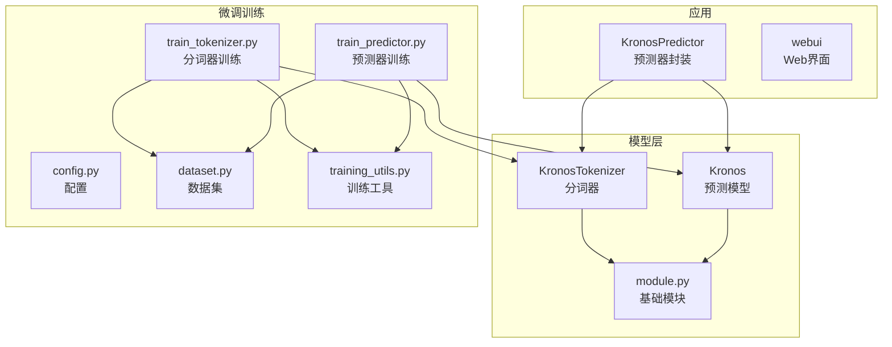
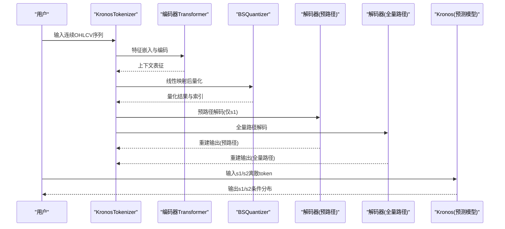
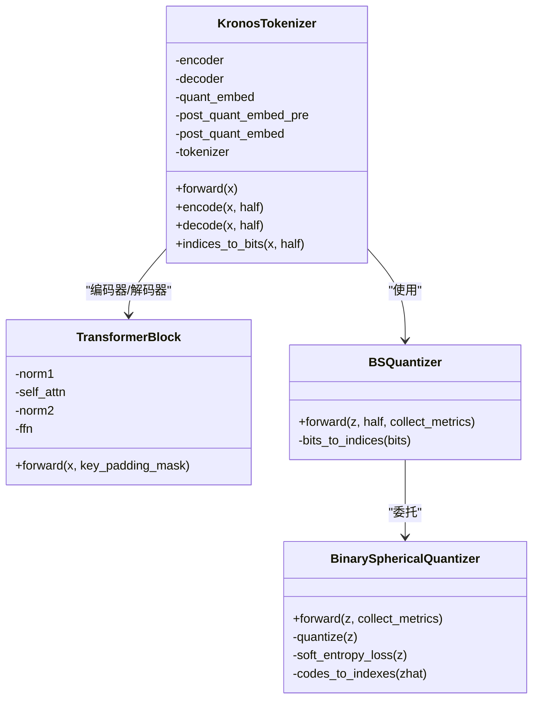
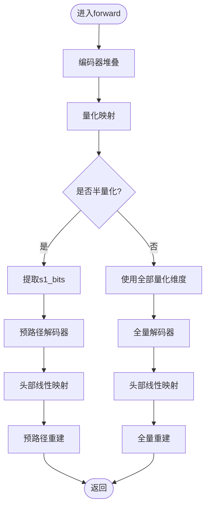
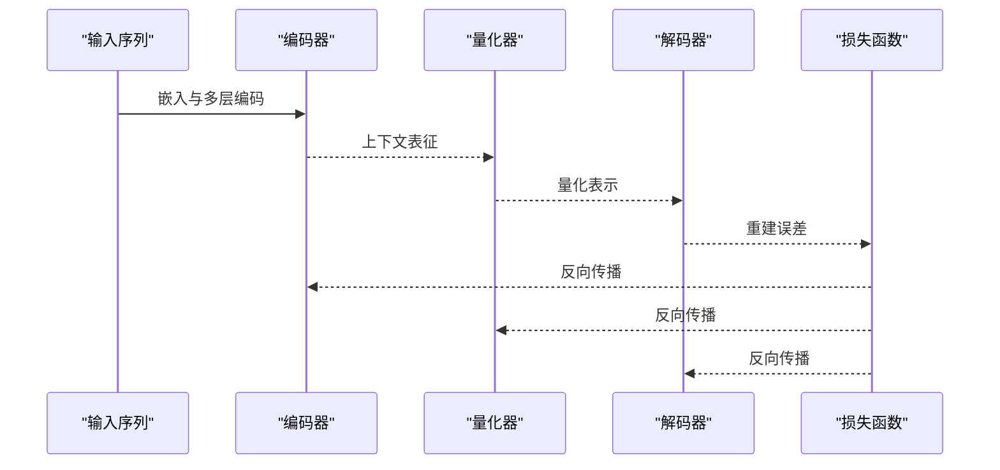
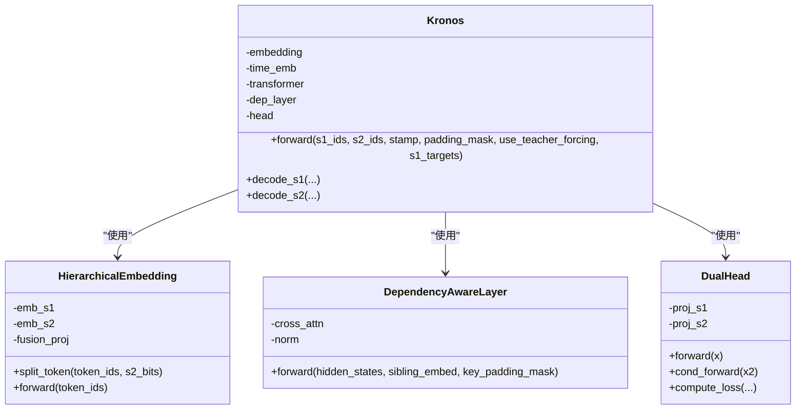
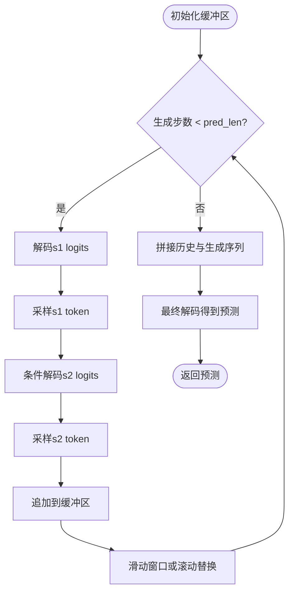
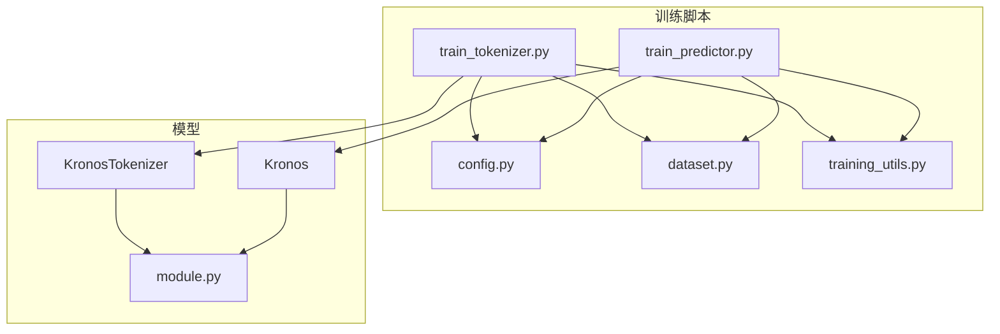

# 编码器-解码器Transformer架构

<cite>
**本文档引用的文件**
- [model/kronos.py](file://model/kronos.py)
- [model/module.py](file://model/module.py)
- [finetune/train_tokenizer.py](file://finetune/train_tokenizer.py)
- [finetune/train_predictor.py](file://finetune/train_predictor.py)
- [finetune/config.py](file://finetune/config.py)
- [finetune/dataset.py](file://finetune/dataset.py)
- [finetune/utils/training_utils.py](file://finetune/utils/training_utils.py)
- [README.md](file://README.md)
</cite>

## 目录
1. [简介](#简介)
2. [项目结构](#项目结构)
3. [核心组件](#核心组件)
4. [架构总览](#架构总览)
5. [详细组件分析](#详细组件分析)
6. [依赖关系分析](#依赖关系分析)
7. [性能考虑](#性能考虑)
8. [故障排除指南](#故障排除指南)
9. [结论](#结论)
10. [附录](#附录)

## 简介
本文件面向Kronos项目的编码器-解码器Transformer架构，提供从底层实现到高层应用的系统化技术文档。重点涵盖：
- 编码器通过多层Transformer块提取输入数据的特征表示，包括注意力机制、前馈网络与残差连接的设计
- 解码器的双重路径设计：s1_bits预路径与完整代码本路径的并行处理机制
- 编码器与解码器之间的信息传递：特征映射、注意力权重与梯度传播
- 在量化过程中的作用：特征压缩与重构的协同工作机制
- 架构参数配置、性能优化与训练策略

## 项目结构
Kronos采用模块化组织，核心代码位于model目录，微调训练脚本位于finetune目录，README提供使用说明与模型概览。

**图表来源**
- [model/kronos.py:13-663](file://model/kronos.py#L13-L663)
- [model/module.py:1-571](file://model/module.py#L1-L571)
- [finetune/train_tokenizer.py:1-282](file://finetune/train_tokenizer.py#L1-L282)
- [finetune/train_predictor.py:1-245](file://finetune/train_predictor.py#L1-L245)
- [finetune/config.py:1-132](file://finetune/config.py#L1-L132)
- [finetune/dataset.py:1-146](file://finetune/dataset.py#L1-L146)
- [finetune/utils/training_utils.py:1-119](file://finetune/utils/training_utils.py#L1-L119)

**章节来源**
- [README.md:59-100](file://README.md#L59-L100)
- [model/kronos.py:13-663](file://model/kronos.py#L13-L663)
- [model/module.py:1-571](file://model/module.py#L1-L571)

## 核心组件
- 分词器（KronosTokenizer）：结合编码器-解码器与二进制球面量化（BSQuantizer），将连续OHLCV数据量化为层次离散token，并进行重建与损失计算
- 预测模型（Kronos）：基于Transformer的自回归语言模型，支持s1/s2双子路径的条件解码与依赖感知层
- 基础模块（module.py）：包含注意力、前馈网络、量化器、嵌入与归一化等通用组件
- 训练脚本：分别针对分词器与预测器的分布式训练流程与日志记录

**章节来源**
- [model/kronos.py:13-178](file://model/kronos.py#L13-L178)
- [model/kronos.py:180-329](file://model/kronos.py#L180-L329)
- [model/module.py:225-223](file://model/module.py#L225-L223)

## 架构总览
Kronos采用“分词器 + 预测模型”的两阶段框架：
- 分词器阶段：输入连续特征经编码器Transformer提取表征，线性映射至量化维度，使用BSQuantizer进行二进制球面量化；随后分别通过s1预路径与全量路径进行解码重建
- 预测模型阶段：以s1/s2离散token作为输入，通过Transformer块提取上下文，再由DualHead输出s1/s2的条件概率分布

**图表来源**
- [model/kronos.py:74-113](file://model/kronos.py#L74-L113)
- [model/kronos.py:239-276](file://model/kronos.py#L239-L276)

## 详细组件分析

### 编码器-解码器分词器（KronosTokenizer）
- 编码器：多层TransformerBlock堆叠，每层包含RMSNorm、多头注意力（含RoPE旋转位置编码）与前馈网络，残差连接贯穿始终
- 量化器：BSQuantizer将编码器输出映射到量化维度，采用二进制球面量化，支持软熵正则与提交损失
- 解码器：两条并行路径
  - 预路径：仅使用s1_bits部分，用于快速重建与监督
  - 全量路径：使用完整代码本维度，提供更精细的重建
- 指数到比特转换：支持半量化模式，按位掩码提取并缩放为极性(-1,1)表示

**图表来源**
- [model/kronos.py:59-113](file://model/kronos.py#L59-L113)
- [model/module.py:39-223](file://model/module.py#L39-L223)

**章节来源**
- [model/kronos.py:74-178](file://model/kronos.py#L74-L178)
- [model/module.py:465-484](file://model/module.py#L465-L484)

### 解码器双重路径设计
- 预路径（s1_bits）：从量化结果中提取s1部分，经线性映射回隐藏维，再通过解码器层重建输入空间，用于监督与快速收敛
- 全量路径（完整代码本）：使用完整的量化表示进行解码，提供更丰富的语义信息
- 并行处理：两条路径共享相同的解码器层，但输入来自不同的量化分支

**图表来源**
- [model/kronos.py:89-113](file://model/kronos.py#L89-L113)

**章节来源**
- [model/kronos.py:89-113](file://model/kronos.py#L89-L113)

### 编码器-解码器信息传递与梯度传播
- 特征映射：编码器将输入特征映射到d_model维度，解码器通过线性层将量化表示还原到原空间
- 注意力权重：多头注意力通过RoPE旋转位置编码增强长程依赖，因果掩码确保自回归性质
- 残差连接：每层内部的残差连接保证梯度稳定传播
- 量化损失：BSQuantizer提供提交损失与熵正则，引导稀疏且均匀使用的码本

**图表来源**
- [model/module.py:315-354](file://model/module.py#L315-L354)
- [model/module.py:465-484](file://model/module.py#L465-L484)
- [model/module.py:225-254](file://model/module.py#L225-L254)

**章节来源**
- [model/module.py:315-354](file://model/module.py#L315-L354)
- [model/module.py:465-484](file://model/module.py#L465-L484)
- [model/module.py:225-254](file://model/module.py#L225-L254)

### 预测模型（Kronos）与依赖感知解码
- 层级嵌入：HierarchicalEmbedding将复合token拆分为s1/s2子token，分别嵌入后再融合
- 依赖感知层：MultiHeadCrossAttentionWithRoPE允许s2解码时关注s1上下文，实现条件建模
- 双头输出：DualHead分别输出s1与s2的分类logits，支持teacher-forcing与采样解码

**图表来源**
- [model/module.py:400-444](file://model/module.py#L400-L444)
- [model/module.py:446-463](file://model/module.py#L446-L463)
- [model/module.py:486-514](file://model/module.py#L486-L514)
- [model/kronos.py:198-329](file://model/kronos.py#L198-L329)

**章节来源**
- [model/module.py:400-444](file://model/module.py#L400-L444)
- [model/module.py:446-463](file://model/module.py#L446-L463)
- [model/module.py:486-514](file://model/module.py#L486-L514)
- [model/kronos.py:198-329](file://model/kronos.py#L198-L329)

### 自回归推理与采样
- 自回归窗口：维护固定长度的缓冲区，滚动更新生成序列
- 温度与Top-p采样：支持温度缩放与核采样，控制生成多样性
- 批量推理：支持多序列并行采样与平均

**图表来源**
- [model/kronos.py:389-469](file://model/kronos.py#L389-L469)

**章节来源**
- [model/kronos.py:389-469](file://model/kronos.py#L389-L469)

## 依赖关系分析
- 组件耦合
  - 分词器与预测模型共享基础模块（注意力、前馈、量化器、嵌入）
  - 训练脚本通过分布式数据加载与日志记录工具与模型解耦
- 外部依赖
  - PyTorch、einops、comet_ml（可选）、HuggingFace Hub模型加载
- 训练流程
  - 分词器训练：最小化重建误差与量化损失，使用AdamW与OneCycleLR
  - 预测器训练：以离散token为输入，最大化s1/s2交叉熵，支持teacher-forcing

**图表来源**
- [finetune/train_tokenizer.py:74-215](file://finetune/train_tokenizer.py#L74-L215)
- [finetune/train_predictor.py:60-179](file://finetune/train_predictor.py#L60-L179)
- [finetune/config.py:1-132](file://finetune/config.py#L1-L132)
- [finetune/dataset.py:1-146](file://finetune/dataset.py#L1-L146)
- [finetune/utils/training_utils.py:1-119](file://finetune/utils/training_utils.py#L1-L119)
- [model/kronos.py:13-663](file://model/kronos.py#L13-L663)
- [model/module.py:1-571](file://model/module.py#L1-L571)

**章节来源**
- [finetune/train_tokenizer.py:74-215](file://finetune/train_tokenizer.py#L74-L215)
- [finetune/train_predictor.py:60-179](file://finetune/train_predictor.py#L60-L179)
- [finetune/config.py:1-132](file://finetune/config.py#L1-L132)
- [finetune/dataset.py:1-146](file://finetune/dataset.py#L1-L146)
- [finetune/utils/training_utils.py:1-119](file://finetune/utils/training_utils.py#L1-L119)

## 性能考虑
- 计算效率
  - 使用RoPE旋转位置编码减少绝对位置嵌入开销
  - scaled_dot_product_attention在CUDA上高效实现
  - RMSNorm相比LayerNorm在某些场景下更稳定
- 内存优化
  - 半量化模式（half=True）降低量化维度，减少内存占用
  - 滑动窗口缓冲区限制上下文长度，避免OOM
- 训练稳定性
  - OneCycleLR动态调整学习率，提升收敛速度
  - 梯度裁剪防止爆炸梯度
  - 分布式训练与梯度累积扩大有效批次

**章节来源**
- [model/module.py:284-354](file://model/module.py#L284-L354)
- [model/module.py:257-269](file://model/module.py#L257-L269)
- [finetune/train_tokenizer.py:98-154](file://finetune/train_tokenizer.py#L98-L154)
- [finetune/train_predictor.py:71-116](file://finetune/train_predictor.py#L71-L116)

## 故障排除指南
- 数据形状不匹配
  - 确保输入序列的特征维度与配置一致，时间戳与特征对齐
- 分布式训练问题
  - 检查NCCL后端与设备设置，确保环境变量正确
- 量化异常
  - 若出现NaN或极值，检查clip阈值与归一化参数
- 推理长度限制
  - 对于Kronos-small/base，max_context通常为512，超出需截断或降采样

**章节来源**
- [finetune/dataset.py:108-130](file://finetune/dataset.py#L108-L130)
- [finetune/utils/training_utils.py:9-32](file://finetune/utils/training_utils.py#L9-L32)
- [model/kronos.py:482-560](file://model/kronos.py#L482-L560)

## 结论
Kronos通过“分词器 + 预测模型”的两阶段架构，实现了金融K线序列的高效离散化与建模。编码器-解码器结构与二进制球面量化相结合，在保持高保真重建的同时显著压缩了特征维度；预测模型的双路径解码与依赖感知层进一步提升了条件建模能力。配合完善的训练脚本与分布式工具链，该架构为金融市场的多任务建模提供了坚实基础。

## 附录
- 关键参数建议
  - s1_bits与s2_bits：根据数据复杂度与资源约束选择，半量化可优先尝试
  - n_layers与d_model：在资源允许下增大以提升表达能力
  - 学习率与调度：先用分词器高学习率快速收敛，再用预测器低学习率精细微调
- 训练策略
  - 分词器阶段：侧重重建与熵正则平衡
  - 预测器阶段：结合teacher-forcing与采样，逐步过渡到纯自回归