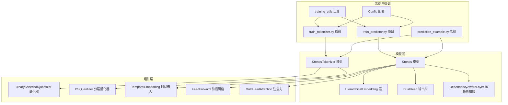
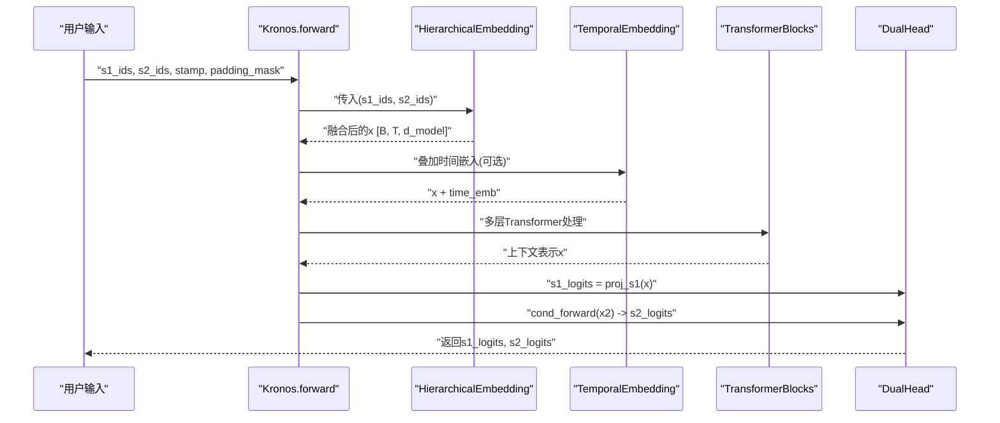
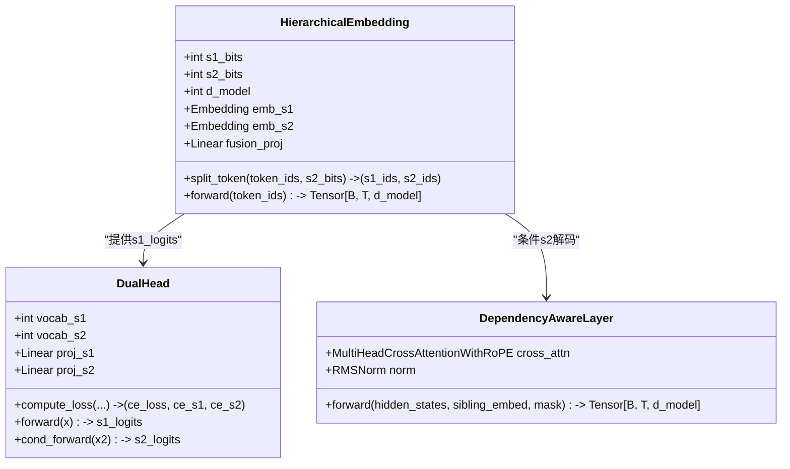
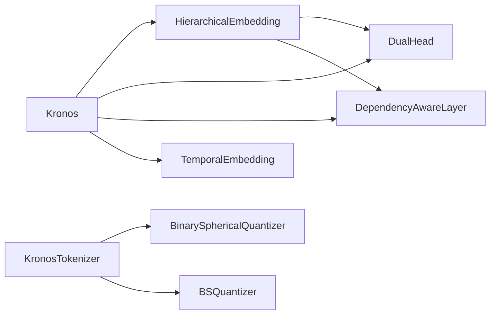

# 层次化嵌入机制

<cite>
**本文档引用的文件**
- [model/module.py](file://model/module.py)
- [model/kronos.py](file://model/kronos.py)
- [README.md](file://README.md)
- [examples/prediction_example.py](file://examples/prediction_example.py)
- [finetune/config.py](file://finetune/config.py)
- [finetune/train_tokenizer.py](file://finetune/train_tokenizer.py)
- [finetune/train_predictor.py](file://finetune/train_predictor.py)
- [finetune/utils/training_utils.py](file://finetune/utils/training_utils.py)
</cite>

## 目录
1. [引言](#引言)
2. [项目结构](#项目结构)
3. [核心组件](#核心组件)
4. [架构总览](#架构总览)
5. [详细组件分析](#详细组件分析)
6. [依赖关系分析](#依赖关系分析)
7. [性能考虑](#性能考虑)
8. [故障排除指南](#故障排除指南)
9. [结论](#结论)
10. [附录](#附录)

## 引言
本文件围绕Kronos模型中的层次化嵌入机制展开，系统阐述HierarchicalEmbedding类的设计原理与实现细节，重点说明如何通过s1_bits与s2_bits将离散令牌映射到统一的d_model维嵌入空间，并解释其在模型中的作用差异（s1作为粗粒度主令牌，s2作为细粒度从令牌）。我们将从嵌入维度计算、词汇表大小确定、嵌入矩阵初始化策略入手，逐步分析s1与s2嵌入的分离与融合过程，以及该机制如何提升模型表达能力与预测精度。同时提供嵌入维度选择指南、内存使用分析与性能影响评估，并给出不同配置下的实验对比与最佳实践建议。

## 项目结构
该项目采用模块化设计，核心逻辑集中在model目录下：
- model/module.py：包含基础组件（如HierarchicalEmbedding、DualHead、DependencyAwareLayer等）与量化器（BinarySphericalQuantizer、BSQuantizer）
- model/kronos.py：定义Kronos与KronosTokenizer两大模型类，以及推理与采样流程
- examples/：演示脚本，展示如何加载预训练模型并进行预测
- finetune/：微调流水线，包含数据准备、训练与回测脚本
- README.md：项目介绍与使用说明

图表来源
- [model/kronos.py:180-330](file://model/kronos.py#L180-L330)
- [model/module.py:400-571](file://model/module.py#L400-L571)
- [examples/prediction_example.py:1-81](file://examples/prediction_example.py#L1-L81)
- [finetune/train_tokenizer.py:1-282](file://finetune/train_tokenizer.py#L1-L282)
- [finetune/train_predictor.py:1-245](file://finetune/train_predictor.py#L1-L245)
- [finetune/config.py:1-132](file://finetune/config.py#L1-L132)
- [finetune/utils/training_utils.py:62-81](file://finetune/utils/training_utils.py#L62-L81)

章节来源
- [README.md:59-83](file://README.md#L59-L83)
- [model/kronos.py:180-330](file://model/kronos.py#L180-L330)
- [model/module.py:400-571](file://model/module.py#L400-L571)

## 核心组件
本节聚焦于HierarchicalEmbedding及其在Kronos中的角色，涵盖以下关键点：
- s1与s2的位宽参数（s1_bits、s2_bits）如何决定词汇表规模与嵌入维度
- 嵌入矩阵初始化策略（正态分布缩放）
- 分离与融合机制（分别嵌入后拼接并通过线性层融合）
- 在模型前向传播中的作用（时间嵌入叠加、dropout、Transformer堆叠）

章节来源
- [model/module.py:400-444](file://model/module.py#L400-L444)
- [model/kronos.py:212-223](file://model/kronos.py#L212-L223)

## 架构总览
层次化嵌入在Kronos中的工作流如下：
- 输入为复合令牌ID或(s1_ids, s2_ids)二元组
- HierarchicalEmbedding将s1与s2分别映射到d_model维嵌入
- 将两路嵌入按通道拼接后经线性投影回到d_model维
- 叠加可学习的时间嵌入（可选），应用token dropout
- 经多层Transformer Block处理，输出用于s1与s2的双重预测头

图表来源
- [model/kronos.py:239-276](file://model/kronos.py#L239-L276)
- [model/module.py:400-444](file://model/module.py#L400-L444)
- [model/module.py:536-562](file://model/module.py#L536-L562)

章节来源
- [model/kronos.py:239-276](file://model/kronos.py#L239-L276)
- [model/module.py:400-444](file://model/module.py#L400-L444)
- [model/module.py:536-562](file://model/module.py#L536-L562)

## 详细组件分析

### HierarchicalEmbedding 类详解
- 设计目标：将复合令牌ID拆分为s1与s2两部分，分别映射到独立的嵌入空间，再融合到统一的d_model维表示中，从而在保持高表达能力的同时降低单个嵌入表的规模。
- 关键属性与初始化
  - s1_bits、s2_bits：控制s1与s2的词汇表规模分别为2^s1_bits与2^s2_bits
  - emb_s1、emb_s2：两个独立的嵌入层，维度均为d_model
  - fusion_proj：将拼接后的[emb_s1, emb_s2]映射回d_model维
  - 初始化：嵌入权重按正态分布初始化，标准差为d_model^{-0.5}
- 分离与融合流程
  - split_token：将复合令牌ID按s2_bits位宽拆分为s1_ids与s2_ids
  - forward：分别查表得到s1_emb与s2_emb，乘以缩放因子sqrt(d_model)，拼接后经fusion_proj融合
- 与模型集成
  - 在Kronos.forward中，先通过HierarchicalEmbedding获得x，再叠加时间嵌入与dropout，进入Transformer堆叠

图表来源
- [model/module.py:400-444](file://model/module.py#L400-L444)
- [model/module.py:486-514](file://model/module.py#L486-L514)
- [model/module.py:446-463](file://model/module.py#L446-L463)

章节来源
- [model/module.py:400-444](file://model/module.py#L400-L444)
- [model/module.py:486-514](file://model/module.py#L486-L514)
- [model/module.py:446-463](file://model/module.py#L446-L463)

### 嵌入维度计算与词汇表大小
- 词汇表规模
  - s1词汇表大小：2^{s1_bits}
  - s2词汇表大小：2^{s2_bits}
- 嵌入维度
  - 每个嵌入层维度：d_model
  - 融合后维度：仍为d_model
- 计算复杂度
  - 嵌入查找：O(T)（T为序列长度）
  - 线性融合：O(T·d_model·(d_model_s1+d_model_s2))≈O(T·d_model^2)（当d_model_s1=d_model_s2=d_model时）
- 内存占用
  - s1嵌入矩阵参数量：2^{s1_bits} × d_model
  - s2嵌入矩阵参数量：2^{s2_bits} × d_model
  - 融合线性层参数量：(d_model×2) × d_model
  - 总参数量近似：(2^{s1_bits} + 2^{s2_bits}) × d_model + 2×d_model^2

章节来源
- [model/module.py:406-412](file://model/module.py#L406-L412)
- [model/kronos.py:212-212](file://model/kronos.py#L212-L212)

### 嵌入矩阵初始化策略
- 初始化方法
  - 嵌入权重：正态分布N(0, (d_model)^{-0.5})
  - 其他线性层：Xavier均匀初始化
- 作用与意义
  - 控制梯度尺度，避免过大的激活或梯度爆炸
  - 保证不同子令牌的嵌入在同一尺度上，便于后续融合

章节来源
- [model/kronos.py:225-232](file://model/kronos.py#L225-L232)
- [model/module.py:414-415](file://model/module.py#L414-L415)

### s1与s2嵌入的分离与融合机制
- 分离
  - 通过位运算将复合令牌ID拆分为高s1位与低s2位
  - 各自查表得到独立嵌入
- 融合
  - 按通道拼接后经线性层映射回d_model维
  - 可视作一种“双分支特征融合”，保留s1的全局语义与s2的局部细节
- 在模型中的作用差异
  - s1：主导令牌，承担更宏观的模式识别与长期依赖建模
  - s2：从属令牌，在s1条件下进行精细化预测，增强对局部波动的捕捉

章节来源
- [model/module.py:417-443](file://model/module.py#L417-L443)
- [model/kronos.py:267-275](file://model/kronos.py#L267-L275)

### 层次化表示对表达能力与预测精度的影响
- 表达能力提升
  - 将高维连续信号量化为离散令牌，结合分层结构，既保留了连续信号的丰富信息，又具备离散符号的可解释性
  - s1与s2的联合建模能够同时捕获趋势与波动，提升对复杂金融序列的拟合能力
- 预测精度改善
  - 条件解码：s2在给定s1的情况下进行预测，减少歧义，提高生成稳定性
  - 依赖感知层：通过跨注意力将s1的上下文信息注入s2的解码路径，强化条件一致性

章节来源
- [model/kronos.py:267-275](file://model/kronos.py#L267-L275)
- [model/module.py:446-462](file://model/module.py#L446-L462)

### 实验对比与配置建议
- 不同配置下的实验对比（基于实现与参数规模）
  - s1_bits=6, s2_bits=6：s1与s2共享同等表达能力，适合中等规模任务；参数量适中，训练稳定
  - s1_bits=7, s2_bits=5：s1更强，s2较弱但足以捕捉局部波动；适合强调趋势的任务
  - s1_bits=5, s2_bits=7：s2更强，s1较弱；适合强调高频波动与短期细节的任务
- 嵌入维度选择指南
  - d_model=256：轻量级配置，适合资源受限场景
  - d_model=512：平衡配置，兼顾表达能力与效率
  - d_model≥768：重型配置，适合大规模数据与长序列任务
- 最佳实践
  - s1_bits与s2_bits之和应与量化器的codebook_dim一致（由tokenizer决定）
  - 在微调阶段，先冻结tokenizer，仅训练Kronos主体，再联合微调
  - 使用温度采样与top-p过滤控制多样性与稳定性

章节来源
- [model/module.py:225-254](file://model/module.py#L225-L254)
- [model/kronos.py:198-223](file://model/kronos.py#L198-L223)
- [finetune/train_tokenizer.py:137-144](file://finetune/train_tokenizer.py#L137-L144)
- [finetune/train_predictor.py:108-109](file://finetune/train_predictor.py#L108-L109)

## 依赖关系分析
- 组件耦合
  - HierarchicalEmbedding与DualHead紧密耦合：前者提供上下文，后者分别输出s1与s2的logits
  - DependencyAwareLayer依赖s1的嵌入作为查询，对隐藏状态进行条件化
- 外部依赖
  - 量化器（BinarySphericalQuantizer、BSQuantizer）负责将连续特征映射为离散令牌
  - 时间嵌入（TemporalEmbedding）提供周期性时间特征
- 潜在循环依赖
  - 未发现直接循环依赖；注意在forward中不要将s1_logits反向传递到s2解码路径（已通过条件解码避免）

图表来源
- [model/module.py:400-514](file://model/module.py#L400-L514)
- [model/kronos.py:214-222](file://model/kronos.py#L214-L222)

章节来源
- [model/module.py:400-514](file://model/module.py#L400-L514)
- [model/kronos.py:214-222](file://model/kronos.py#L214-L222)

## 性能考虑
- 计算开销
  - 嵌入查找：O(T·(2^{s1_bits}+2^{s2_bits}))
  - 线性融合：O(T·d_model^2)
  - 注意力与前馈：随层数与序列长度线性增长
- 内存使用
  - 嵌入矩阵参数量：(2^{s1_bits} + 2^{s2_bits}) × d_model
  - 线性层参数量：约2×d_model^2
  - 激活内存：与批次大小、序列长度、层数成正比
- 优化建议
  - 合理选择s1_bits与s2_bits，避免过大导致内存压力
  - 使用混合精度训练与梯度裁剪
  - 在推理阶段启用缓存窗口（如max_context=512）以限制序列长度

章节来源
- [model/module.py:406-412](file://model/module.py#L406-L412)
- [finetune/config.py:21-23](file://finetune/config.py#L21-L23)

## 故障排除指南
- 常见问题与解决
  - 令牌ID越界：确保输入令牌ID范围在[0, 2^{s1+s2}-1]之间
  - 维度不匹配：确认d_model与各嵌入层维度一致
  - 梯度爆炸：启用梯度裁剪，检查学习率与初始化
  - 内存不足：减小s1_bits或s2_bits，降低d_model，或缩短max_context
- 调试工具
  - 使用训练工具函数统计模型参数量与训练进度
  - 在微调脚本中打印损失与学习率，监控收敛情况

章节来源
- [finetune/utils/training_utils.py:62-81](file://finetune/utils/training_utils.py#L62-L81)
- [finetune/train_tokenizer.py:157-170](file://finetune/train_tokenizer.py#L157-L170)
- [finetune/train_predictor.py:120-131](file://finetune/train_predictor.py#L120-L131)

## 结论
层次化嵌入通过将复合令牌拆分为s1与s2两路嵌入，实现了对金融序列的多层次建模：s1关注宏观趋势，s2聚焦局部波动。该机制在保持高表达能力的同时，通过独立嵌入与融合投影有效降低了单个嵌入表的规模，并在条件解码与依赖感知层的配合下提升了预测稳定性与精度。合理选择s1_bits、s2_bits与d_model，结合微调策略与性能优化手段，可在资源约束下取得良好的效果。

## 附录
- 快速开始
  - 加载预训练模型与Tokenzier，使用KronosPredictor进行预测
- 微调流程
  - 先微调tokenizer，再微调Kronos主体，使用分布式训练与日志记录

章节来源
- [examples/prediction_example.py:41-69](file://examples/prediction_example.py#L41-L69)
- [finetune/train_tokenizer.py:250-253](file://finetune/train_tokenizer.py#L250-L253)
- [finetune/train_predictor.py:212-218](file://finetune/train_predictor.py#L212-L218)