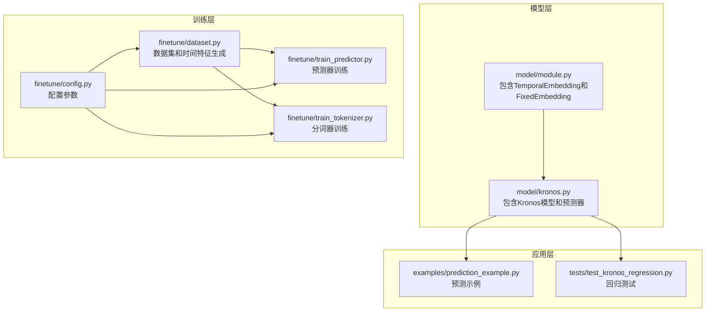
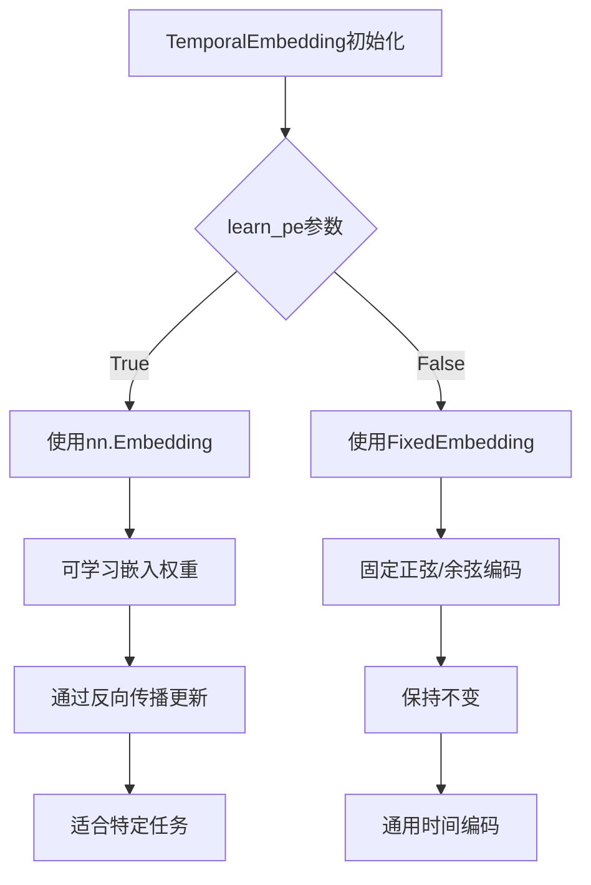
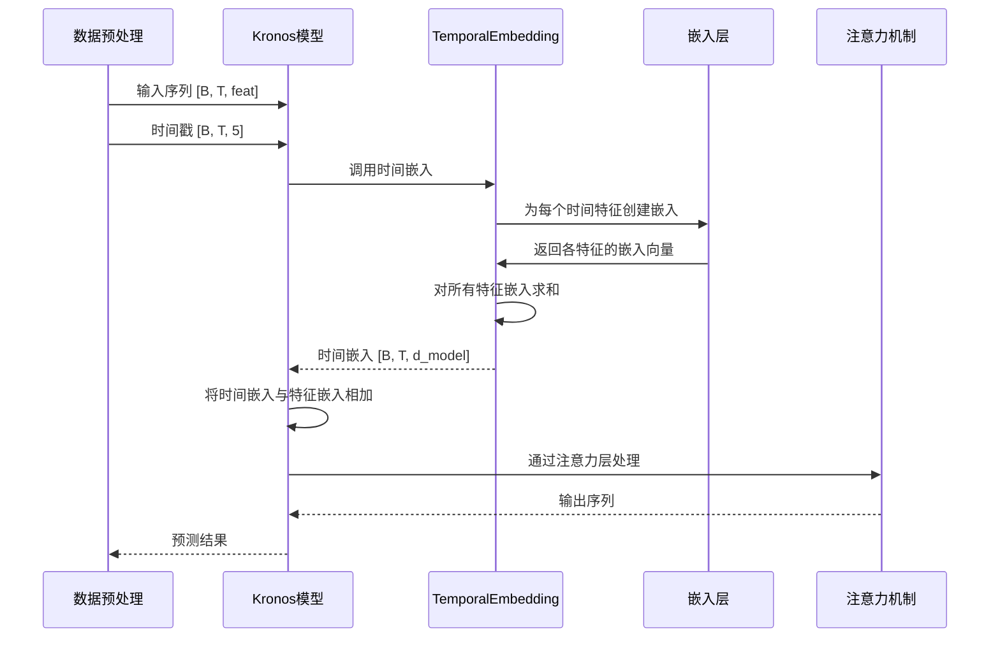
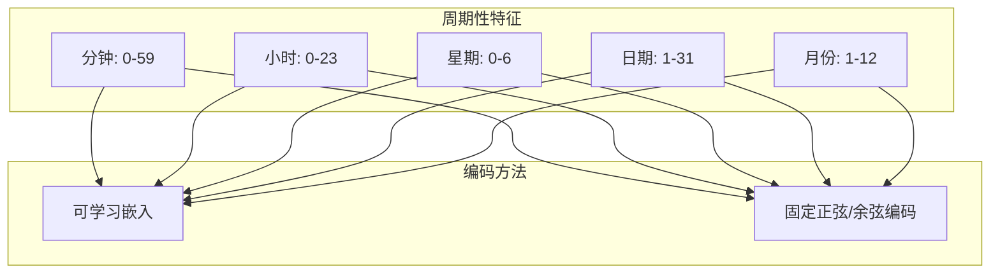
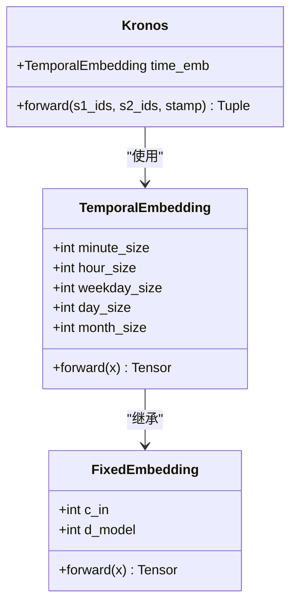
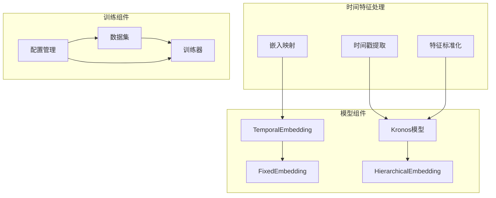
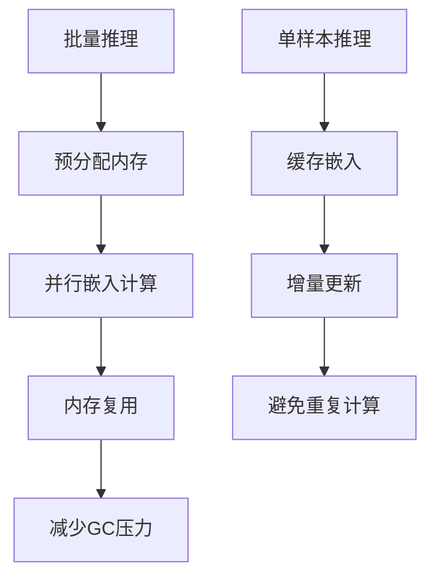

# 时间嵌入设计

<cite>
**本文档引用的文件**
- [model/module.py](file://model/module.py)
- [model/kronos.py](file://model/kronos.py)
- [finetune/dataset.py](file://finetune/dataset.py)
- [finetune/config.py](file://finetune/config.py)
- [examples/prediction_example.py](file://examples/prediction_example.py)
- [finetune/train_predictor.py](file://finetune/train_predictor.py)
- [finetune/train_tokenizer.py](file://finetune/train_tokenizer.py)
- [tests/test_kronos_regression.py](file://tests/test_kronos_regression.py)
</cite>

## 目录
1. [简介](#简介)
2. [项目结构](#项目结构)
3. [核心组件](#核心组件)
4. [架构概览](#架构概览)
5. [详细组件分析](#详细组件分析)
6. [依赖关系分析](#依赖关系分析)
7. [性能考虑](#性能考虑)
8. [故障排除指南](#故障排除指南)
9. [结论](#结论)

## 简介

本文档深入分析Kronos项目中的时间嵌入设计，重点解释TemporalEmbedding类如何处理多维时间特征。该设计实现了两种时间嵌入模式：可学习时间嵌入（learnable）和固定时间嵌入（fixed），并提供了完整的时序建模解决方案。

时间嵌入是Kronos模型中处理时间相关特征的关键组件，它能够将离散的时间特征（分钟、小时、星期几、日期、月份）转换为连续的向量表示，从而让神经网络能够理解和利用时间信息。

## 项目结构

Kronos项目采用模块化的架构设计，时间嵌入功能主要分布在以下文件中：



**图表来源**
- [model/module.py:536-570](file://model/module.py#L536-L570)
- [model/kronos.py:180-330](file://model/kronos.py#L180-L330)
- [finetune/dataset.py:9-146](file://finetune/dataset.py#L9-L146)

**章节来源**
- [model/module.py:1-571](file://model/module.py#L1-L571)
- [model/kronos.py:1-663](file://model/kronos.py#L1-L663)

## 核心组件

### TemporalEmbedding类

TemporalEmbedding是时间嵌入的核心实现，支持两种不同的嵌入策略：

#### 基本架构
- **输入维度**: 接收形状为[B, T, 5]的时间戳张量
- **输出维度**: 返回形状为[B, T, d_model]的时间嵌入
- **特征映射**: 将5个时间特征分别映射到d_model维度的向量空间

#### 时间特征映射表

| 特征类型 | 维度大小 | 数值范围 | 编码方式 |
|---------|---------|---------|---------|
| 分钟 | 60 | [0, 59] | 可学习嵌入或固定正弦/余弦编码 |
| 小时 | 24 | [0, 23] | 可学习嵌入或固定正弦/余弦编码 |
| 星期几 | 7 | [0, 6] | 可学习嵌入或固定正弦/余弦编码 |
| 日期 | 32 | [1, 31] | 可学习嵌入或固定正弦/余弦编码 |
| 月份 | 13 | [1, 12] | 可学习嵌入或固定正弦/余弦编码 |

#### 可学习模式 vs 固定模式



**图表来源**
- [model/module.py:536-562](file://model/module.py#L536-L562)

**章节来源**
- [model/module.py:536-562](file://model/module.py#L536-L562)

### FixedEmbedding类

FixedEmbedding实现了固定的正弦/余弦位置编码，具有以下特点：

#### 编码策略
- **数学基础**: 使用正弦和余弦函数生成位置编码
- **频率分布**: 不同维度使用不同的频率
- **相位偏移**: 偶数维度使用正弦，奇数维度使用余弦
- **可学习性**: 权重设置为不可训练状态

#### 数学公式
对于第k个维度的位置p：
- 偶数维度: `sin(p * div_term_k)`
- 奇数维度: `cos(p * div_term_k)`

其中 `div_term_k = exp(-k * log(10000.0) / d_model)`

**章节来源**
- [model/module.py:516-534](file://model/module.py#L516-L534)

## 架构概览

时间嵌入在整个Kronos系统中的集成架构如下：



**图表来源**
- [model/kronos.py:239-276](file://model/kronos.py#L239-L276)
- [model/module.py:536-562](file://model/module.py#L536-L562)

## 详细组件分析

### 时间特征处理流程

#### 数据预处理阶段
时间特征从原始时间戳中提取，经过标准化处理后输入模型：

```mermaid
flowchart LR
A[原始时间戳] --> B[提取时间特征]
B --> C[分钟: [0,59]]
B --> D[小时: [0,23]]
B --> E[星期: [0,6]]
B --> F[日期: [1,31]]
B --> G[月份: [1,12]]
C --> H[嵌入层映射]
D --> H
E --> H
F --> H
G --> H
H --> I[特征拼接]
I --> J[模型处理]
```

**图表来源**
- [finetune/dataset.py:59-66](file://finetune/dataset.py#L59-L66)
- [model/kronos.py:472-479](file://model/kronos.py#L472-L479)

#### 嵌入计算过程

TemporalEmbedding的前向传播过程：

1. **输入处理**: 将浮点时间戳转换为长整型索引
2. **特征分离**: 从[B, T, 5]张量中分离各个时间特征
3. **嵌入映射**: 每个特征通过对应的嵌入层映射到d_model维度
4. **特征融合**: 将所有特征的嵌入向量相加得到最终的时间嵌入

#### 周期性编码策略

时间嵌入采用了巧妙的周期性编码策略：



**图表来源**
- [model/module.py:536-562](file://model/module.py#L536-L562)

### 模式对比分析

#### 可学习时间嵌入（learn_pe = True）

| 特征 | 嵌入维度 | 训练方式 | 适用场景 |
|------|----------|----------|----------|
| 分钟 | d_model | 可学习 | 短期时间模式识别 |
| 小时 | d_model | 可学习 | 日内周期性模式 |
| 星期几 | d_model | 可学习 | 周期性模式 |
| 日期 | d_model | 可学习 | 月度模式 |
| 月份 | d_model | 可学习 | 年度模式 |

#### 固定时间嵌入（learn_pe = False）

| 特征 | 编码方式 | 优点 | 适用场景 |
|------|----------|------|----------|
| 分钟 | 正弦/余弦 | 周期性好 | 通用时间建模 |
| 小时 | 正弦/余弦 | 无参数 | 预训练模型 |
| 星期几 | 正弦/余弦 | 无过拟合风险 | 大规模数据 |
| 日期 | 正弦/余弦 | 稳定性好 | 长序列建模 |
| 月份 | 正弦/余弦 | 无训练开销 | 实时推理 |

**章节来源**
- [model/module.py:516-562](file://model/module.py#L516-L562)

### 序列对齐机制

时间嵌入与序列数据的对齐遵循严格的规则：



**图表来源**
- [model/module.py:516-562](file://model/module.py#L516-L562)
- [model/kronos.py:198-223](file://model/kronos.py#L198-L223)

## 依赖关系分析

### 组件间依赖关系



**图表来源**
- [finetune/dataset.py:59-66](file://finetune/dataset.py#L59-L66)
- [model/kronos.py:214-222](file://model/kronos.py#L214-L222)

### 关键依赖链

1. **数据预处理依赖**: 时间特征提取依赖于pandas时间序列功能
2. **模型依赖**: TemporalEmbedding依赖于PyTorch的Embedding层
3. **训练依赖**: 训练脚本依赖于分布式训练框架
4. **配置依赖**: 所有组件依赖于统一的配置管理系统

**章节来源**
- [finetune/dataset.py:1-146](file://finetune/dataset.py#L1-L146)
- [finetune/config.py:1-132](file://finetune/config.py#L1-L132)

## 性能考虑

### 计算复杂度分析

| 操作 | 时间复杂度 | 空间复杂度 |
|------|------------|------------|
| 单个特征嵌入 | O(B×T×d_model) | O(B×T×d_model) |
| 特征融合 | O(B×T×d_model) | O(B×T×d_model) |
| 总体计算 | O(B×T×d_model) | O(B×T×d_model) |

### 内存优化策略

1. **嵌入权重共享**: 相同特征的不同时间步共享嵌入权重
2. **动态内存分配**: 在推理阶段按需分配内存
3. **混合精度训练**: 支持半精度浮点数减少内存占用

### 推理优化



## 故障排除指南

### 常见问题及解决方案

#### 时间特征维度不匹配
**问题**: 输入时间戳维度与预期不符
**解决方案**: 检查时间戳提取逻辑，确保返回5维张量

#### 嵌入维度不一致
**问题**: d_model与嵌入维度不匹配
**解决方案**: 确保所有嵌入层使用相同的d_model参数

#### 训练不稳定
**问题**: 可学习嵌入导致训练不稳定
**解决方案**: 调整学习率，使用梯度裁剪，检查正则化

#### 内存溢出
**问题**: 大批量数据导致内存不足
**解决方案**: 减少批量大小，启用梯度累积，使用混合精度

**章节来源**
- [finetune/train_predictor.py:108-116](file://finetune/train_predictor.py#L108-L116)
- [finetune/train_tokenizer.py:150-154](file://finetune/train_tokenizer.py#L150-L154)

## 结论

Kronos项目的时间嵌入设计展现了现代时序建模的先进理念。通过实现可学习和固定两种时间嵌入模式，系统能够在不同场景下灵活选择最优的时间编码策略。

### 主要优势

1. **灵活性**: 支持多种时间编码策略，适应不同应用场景
2. **效率**: 采用高效的嵌入计算和内存管理策略
3. **可扩展性**: 模块化设计便于功能扩展和维护
4. **稳定性**: 固定编码提供稳定的基线性能

### 最佳实践建议

1. **特征工程**: 根据具体任务选择合适的时间特征组合
2. **嵌入维度**: 基于数据复杂度和计算资源选择合适的d_model
3. **训练策略**: 对于小数据集优先使用固定编码，大数据集可考虑可学习编码
4. **超参数调优**: 重点关注学习率、批次大小和序列长度等关键参数

该设计为时序预测任务提供了强大的时间信息建模能力，是构建高性能金融时间序列预测系统的重要基础设施。