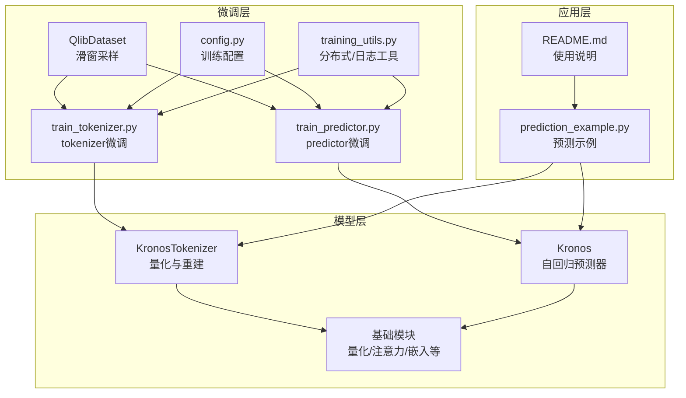
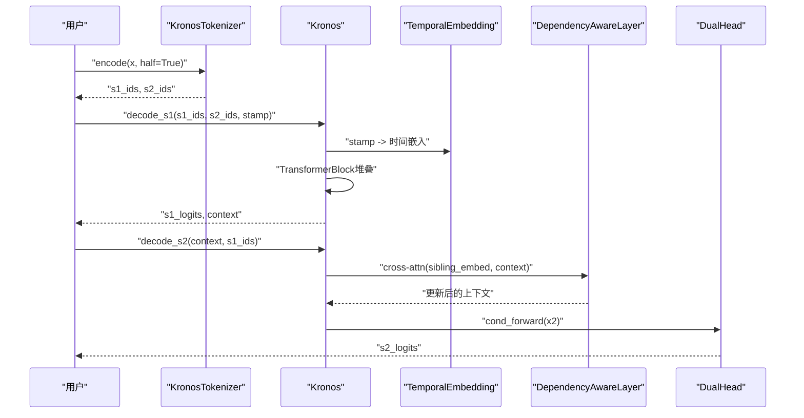
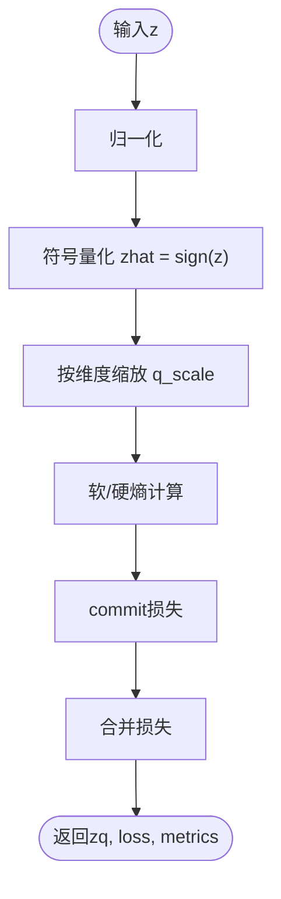
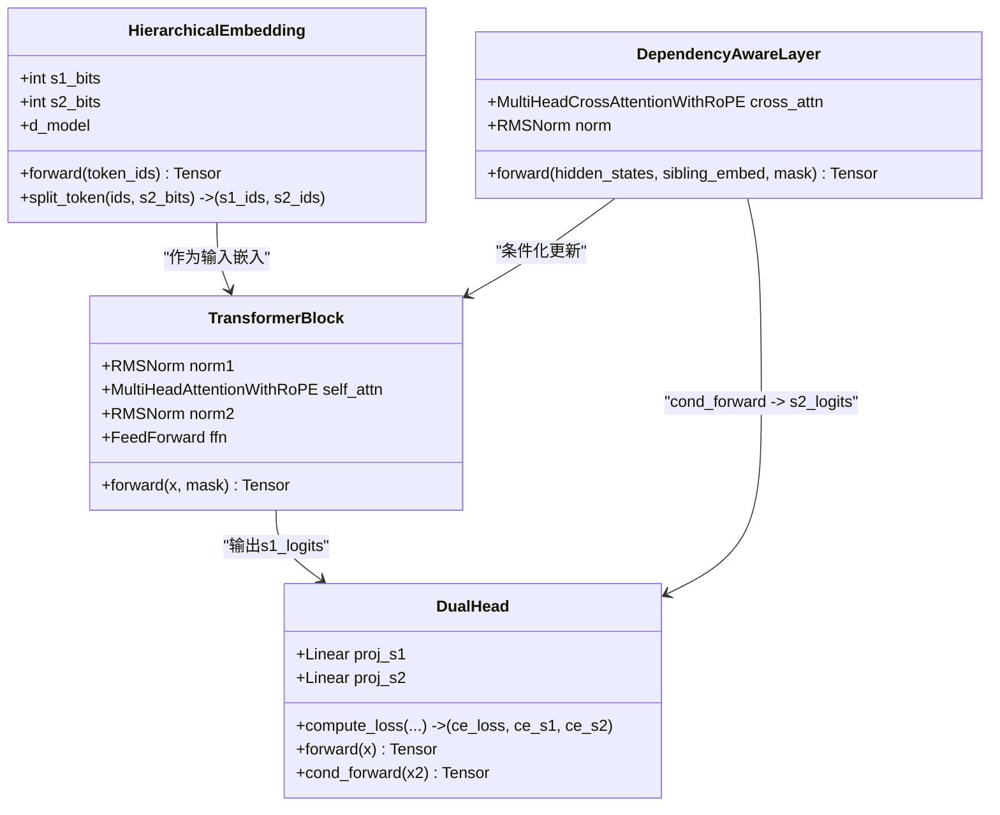
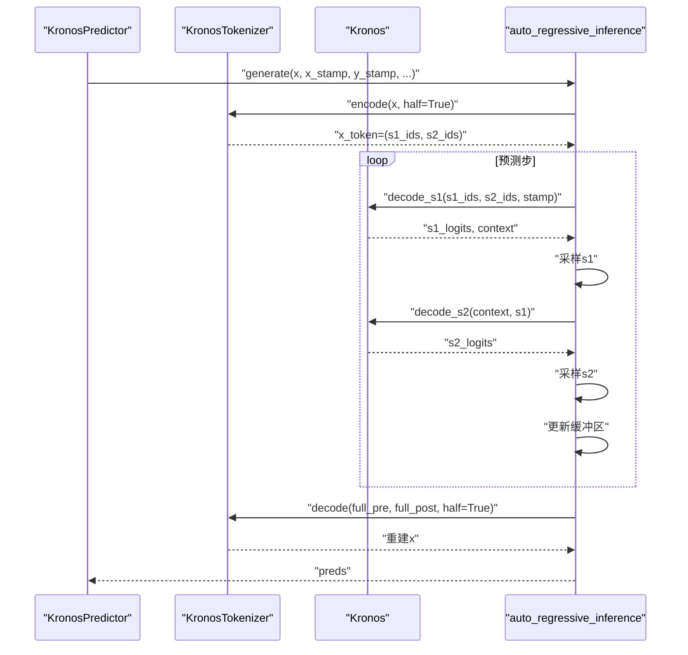
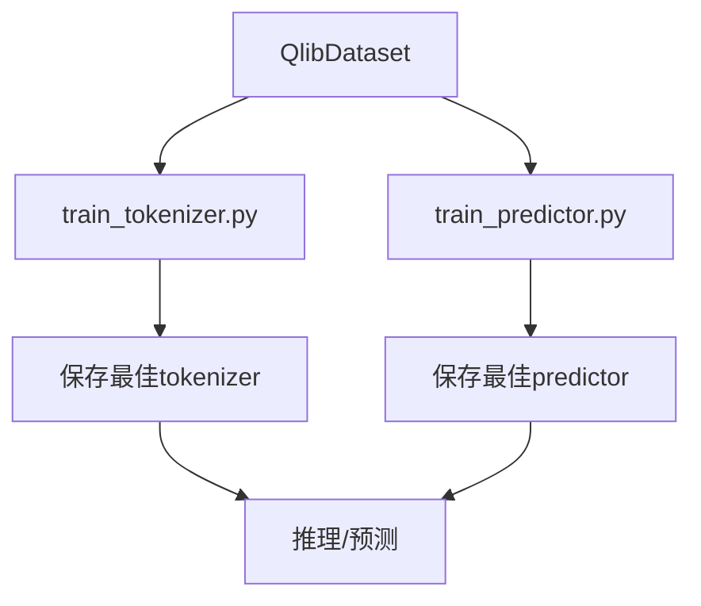
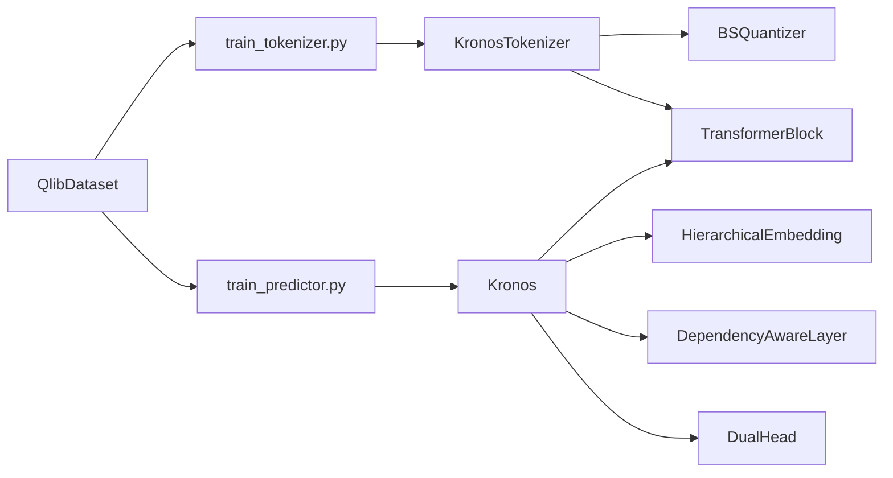

# 模型架构详解

<cite>
**本文引用的文件列表**
- [model/kronos.py](file://model/kronos.py)
- [model/module.py](file://model/module.py)
- [finetune/train_tokenizer.py](file://finetune/train_tokenizer.py)
- [finetune/train_predictor.py](file://finetune/train_predictor.py)
- [finetune/dataset.py](file://finetune/dataset.py)
- [finetune/config.py](file://finetune/config.py)
- [finetune/utils/training_utils.py](file://finetune/utils/training_utils.py)
- [examples/prediction_example.py](file://examples/prediction_example.py)
- [README.md](file://README.md)
</cite>

## 目录
1. [引言](#引言)
2. [项目结构](#项目结构)
3. [核心组件](#核心组件)
4. [架构总览](#架构总览)
5. [详细组件分析](#详细组件分析)
6. [依赖关系分析](#依赖关系分析)
7. [性能考量](#性能考量)
8. [故障排查指南](#故障排查指南)
9. [结论](#结论)
10. [附录](#附录)

## 引言
本文件面向Kronos模型的两阶段框架与自回归Transformer架构，系统性解析以下要点：
- 量化阶段：二进制球面量化（Binary Spherical Quantization, BSQuantizer）与层次化离散令牌生成
- 预训练阶段：自回归Transformer架构与依赖感知层
- 核心模块：KronosTokenizer与Kronos主模型的实现机制
- 多维金融数据（OHLCV）处理与时间特征编码
- 训练流程与推理管线

## 项目结构
仓库采用按功能分层的组织方式：
- model：核心模型定义（KronosTokenizer、Kronos、基础模块）
- finetune：微调训练脚本、数据集与配置
- examples：预测示例与可视化
- README：使用说明与模型介绍

**图示来源**
- [model/kronos.py:13-663](file://model/kronos.py#L13-L663)
- [model/module.py:1-571](file://model/module.py#L1-L571)
- [finetune/train_tokenizer.py:1-282](file://finetune/train_tokenizer.py#L1-L282)
- [finetune/train_predictor.py:1-245](file://finetune/train_predictor.py#L1-L245)
- [finetune/dataset.py:1-146](file://finetune/dataset.py#L1-L146)
- [finetune/config.py:1-132](file://finetune/config.py#L1-L132)
- [finetune/utils/training_utils.py:1-119](file://finetune/utils/training_utils.py#L1-L119)
- [examples/prediction_example.py:1-81](file://examples/prediction_example.py#L1-L81)
- [README.md:1-338](file://README.md#L1-L338)

**章节来源**
- [README.md:59-100](file://README.md#L59-L100)
- [model/kronos.py:13-663](file://model/kronos.py#L13-L663)
- [model/module.py:1-571](file://model/module.py#L1-L571)

## 核心组件
- KronosTokenizer：将连续OHLCV序列映射为二进制球面量化后的层次化离散令牌，并提供编码/解码能力
- BinarySphericalQuantizer/BSQuantizer：实现二进制球面量化与索引转换
- HierarchicalEmbedding：层次化嵌入（s1/s2位），融合为d_model
- DependencyAwareLayer：跨注意力依赖感知层，条件化s2生成
- TransformerBlock/RMSNorm/FeedForward/MultiHeadAttentionWithRoPE：标准Transformer子层
- DualHead：双头输出（s1/s2分类）
- TemporalEmbedding：时间特征编码（分钟/小时/星期/日/月）

**章节来源**
- [model/kronos.py:13-223](file://model/kronos.py#L13-L223)
- [model/module.py:39-571](file://model/module.py#L39-L571)

## 架构总览
Kronos采用“两阶段”设计：
1) 量化阶段（KronosTokenizer）
- 输入：OHLCV连续向量序列
- 编码器堆叠：若干TransformerBlock
- 线性投影至量化维度（s1_bits + s2_bits）
- 二进制球面量化：得到量化表示与离散索引
- 解码器堆叠：分别重建s1部分与全码本
- 输出：重建信号、BSQuantizer损失、量化索引

2) 预训练阶段（Kronos）
- 输入：s1_ids与s2_ids（离散令牌）
- 层次化嵌入：HierarchicalEmbedding
- 时间嵌入：TemporalEmbedding（可学习或固定）
- 多层TransformerBlock
- 依赖感知层：DependencyAwareLayer，以s1嵌入为查询，上下文为键值
- 双头输出：s1_logits与s2_logits（s2条件于s1）

**图示来源**
- [model/kronos.py:239-328](file://model/kronos.py#L239-L328)
- [model/module.py:400-463](file://model/module.py#L400-L463)

**章节来源**
- [model/kronos.py:74-177](file://model/kronos.py#L74-L177)
- [model/kronos.py:180-328](file://model/kronos.py#L180-L328)

## 详细组件分析

### 量化阶段：KronosTokenizer与二进制球面量化
- 结构要点
  - 编码器/解码器均为若干TransformerBlock
  - quant_embed/post_quant_embed用于从隐藏态到量化空间与回投影
  - BSQuantizer负责二进制球面量化与索引映射
  - 提供encode/decode接口，支持半量化的s1/s2分离

- 二进制球面量化（BSQuantizer）
  - 将连续向量归一化后量化为±1
  - 使用组大小group_size进行子码本熵近似
  - 支持软熵与硬熵两种熵惩罚计算
  - 返回量化结果、commit损失与熵相关指标

- 层次化离散令牌生成
  - s1_bits与s2_bits分别对应高层与细粒度令牌
  - 通过bit到index映射得到离散索引
  - 解码时将索引转为比特并缩放，再经线性层回投影

**图示来源**
- [model/module.py:82-129](file://model/module.py#L82-L129)

**章节来源**
- [model/kronos.py:40-113](file://model/kronos.py#L40-L113)
- [model/module.py:39-223](file://model/module.py#L39-L223)

### 预训练阶段：Kronos主模型
- 层次化嵌入（HierarchicalEmbedding）
  - 分别为s1与s2建立词表嵌入
  - 通过线性融合得到d_model维度表示

- 依赖感知层（DependencyAwareLayer）
  - 以sibling_embed（来自s1嵌入）为查询，上下文为键值进行交叉注意力
  - 通过RMSNorm稳定训练

- 注意力与前馈
  - MultiHeadAttentionWithRoPE：带旋转位置编码的自注意力
  - FeedForward：门控SiLU前馈网络
  - TransformerBlock：RMSNorm + 自注意力 + 前馈

- 规范化策略
  - RMSNorm用于注意力与前馈前的归一化
  - Dropout用于注意力、前馈与token嵌入

- 双头输出（DualHead）
  - s1_logits：直接由Transformer输出投影
  - s2_logits：在依赖感知层之后的cond_forward投影

**图示来源**
- [model/module.py:400-463](file://model/module.py#L400-L463)
- [model/module.py:465-484](file://model/module.py#L465-L484)
- [model/module.py:486-514](file://model/module.py#L486-L514)

**章节来源**
- [model/kronos.py:180-328](file://model/kronos.py#L180-L328)
- [model/module.py:400-514](file://model/module.py#L400-L514)

### 时间特征编码与推理管线
- 时间嵌入（TemporalEmbedding）
  - 对分钟、小时、星期、日、月分别嵌入并相加
  - 可选择固定正弦/余弦嵌入或可学习嵌入

- 推理与采样
  - auto_regressive_inference：自回归生成，维护s1/s2缓冲区
  - 支持温度、top-k、top-p采样
  - 支持批量样本平均（sample_count）

**图示来源**
- [model/kronos.py:389-469](file://model/kronos.py#L389-L469)
- [model/kronos.py:482-560](file://model/kronos.py#L482-L560)

**章节来源**
- [model/module.py:536-562](file://model/module.py#L536-L562)
- [model/kronos.py:389-560](file://model/kronos.py#L389-L560)

### 训练流程与数据准备
- 数据集（QlibDataset）
  - 滑动窗口构造样本，预计算所有可能起始索引
  - 实例级标准化与裁剪
  - 预生成时间特征（分钟/小时/星期/日/月）

- tokenizer微调（train_tokenizer.py）
  - 重建损失（z_pre与z）与BSQuantizer损失加权
  - OneCycleLR调度与梯度累积
  - 分布式训练与日志记录

- predictor微调（train_predictor.py）
  - 在线将OHLCV编码为离散令牌
  - 以s1/s2目标计算交叉熵损失
  - 分布式训练与验证

**图示来源**
- [finetune/dataset.py:9-131](file://finetune/dataset.py#L9-L131)
- [finetune/train_tokenizer.py:74-215](file://finetune/train_tokenizer.py#L74-L215)
- [finetune/train_predictor.py:60-179](file://finetune/train_predictor.py#L60-L179)

**章节来源**
- [finetune/dataset.py:9-131](file://finetune/dataset.py#L9-L131)
- [finetune/train_tokenizer.py:74-215](file://finetune/train_tokenizer.py#L74-L215)
- [finetune/train_predictor.py:60-179](file://finetune/train_predictor.py#L60-L179)

## 依赖关系分析
- 组件耦合
  - KronosTokenizer依赖BinarySphericalQuantizer与TransformerBlock
  - Kronos依赖HierarchicalEmbedding、DependencyAwareLayer、DualHead与基础注意力/前馈模块
  - 训练脚本依赖数据集与工具函数

- 外部依赖
  - PyTorch、einops、huggingface_hub、comet_ml（可选）
  - 分布式训练依赖torch.distributed与NCCL

**图示来源**
- [model/kronos.py:13-223](file://model/kronos.py#L13-L223)
- [model/module.py:39-571](file://model/module.py#L39-L571)
- [finetune/train_tokenizer.py:1-282](file://finetune/train_tokenizer.py#L1-L282)
- [finetune/train_predictor.py:1-245](file://finetune/train_predictor.py#L1-L245)

**章节来源**
- [model/kronos.py:13-223](file://model/kronos.py#L13-L223)
- [model/module.py:39-571](file://model/module.py#L39-L571)

## 性能考量
- 计算复杂度
  - Transformer自注意力：O(T^2·d)，其中T为序列长度，d为维度
  - 量化阶段：线性层与BSQuantizer的开销与维度成正比
- 内存优化
  - 滑动窗口与缓冲区管理减少重复计算
  - 分布式训练与梯度累积提升有效批大小
- 数值稳定性
  - RMSNorm与残差连接有助于深层网络稳定
  - 温度与top-k/top-p采样控制生成多样性

[本节为通用指导，无需特定文件引用]

## 故障排查指南
- 训练不稳定
  - 检查学习率调度与梯度裁剪设置
  - 确认tokenizer与predictor的权重初始化一致
- 分布式训练问题
  - 确保torchrun正确启动，环境变量齐全
  - 检查DDP封装与设备分配
- 数据不匹配
  - 确认OHLCV列名与时间戳格式
  - 检查max_context与历史长度限制

**章节来源**
- [finetune/train_tokenizer.py:98-215](file://finetune/train_tokenizer.py#L98-L215)
- [finetune/train_predictor.py:71-179](file://finetune/train_predictor.py#L71-L179)
- [finetune/utils/training_utils.py:9-32](file://finetune/utils/training_utils.py#L9-L32)

## 结论
Kronos通过“量化-预训练”的两阶段设计，将高维OHLCV序列转化为层次化离散令牌，并在自回归Transformer中学习金融市场的语言模式。其核心创新在于：
- 二进制球面量化与层次化令牌的组合，兼顾压缩与语义表达
- 依赖感知层与双头输出，使s2生成条件于s1，提升建模效率
- 完整的训练与推理流水线，支持分布式训练与批量预测

[本节为总结性内容，无需特定文件引用]

## 附录
- 示例脚本：examples/prediction_example.py展示了从加载模型到预测与可视化的完整流程
- 使用说明：README.md提供了安装、快速开始与微调流程的详细指引

**章节来源**
- [examples/prediction_example.py:1-81](file://examples/prediction_example.py#L1-L81)
- [README.md:85-215](file://README.md#L85-L215)