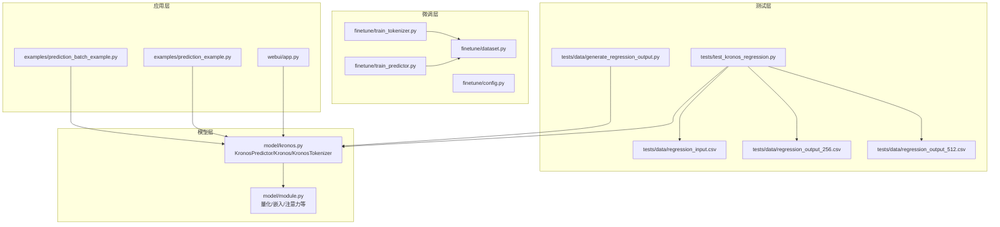
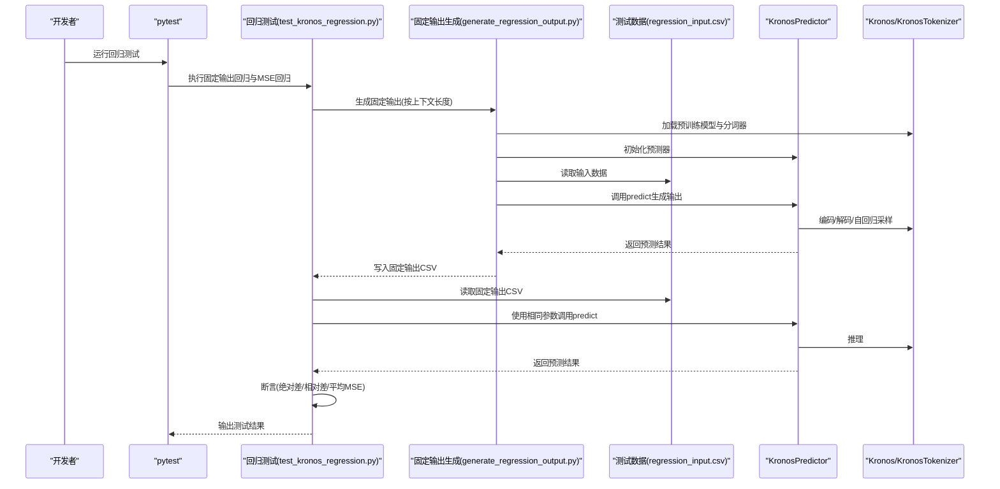
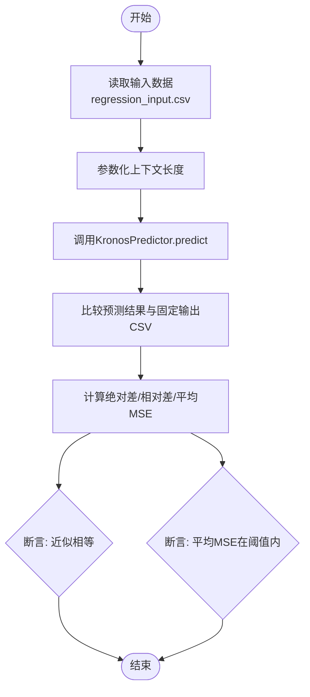
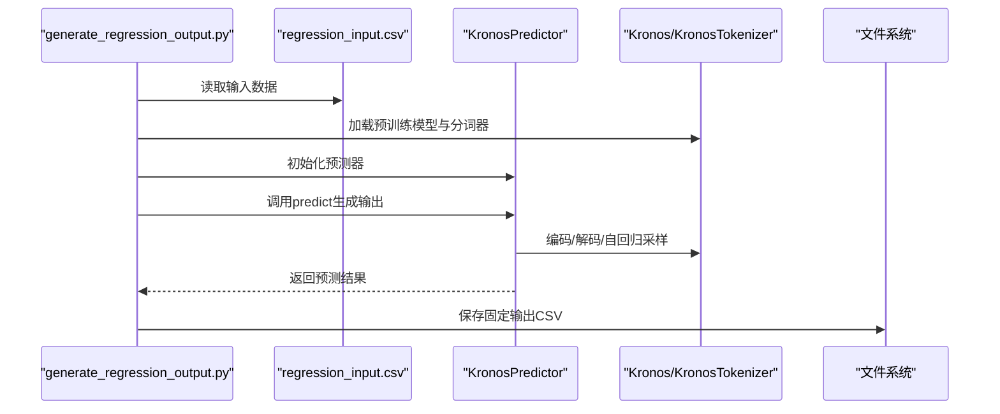
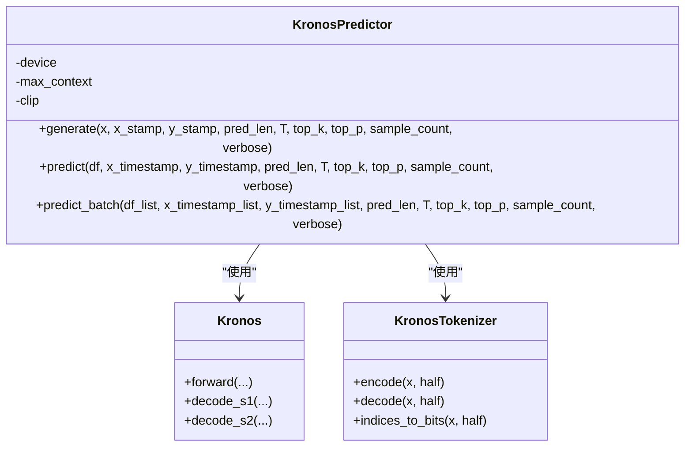
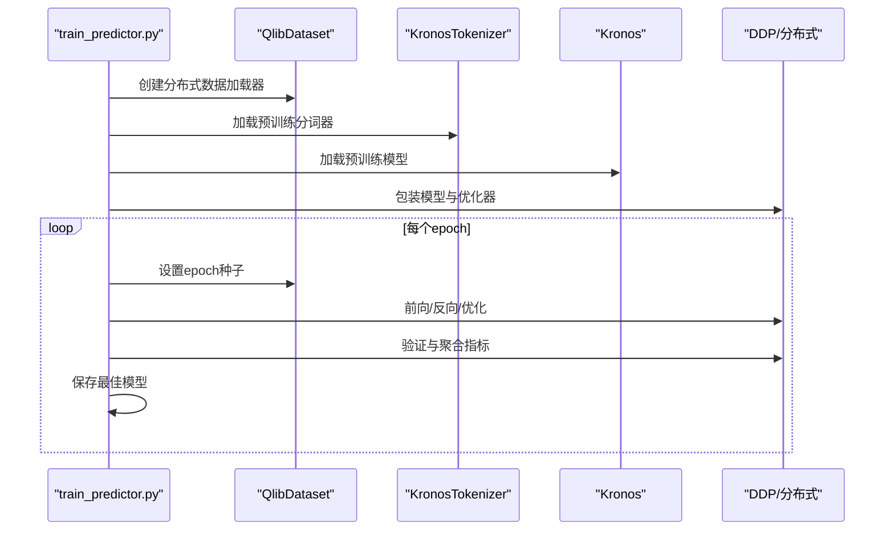
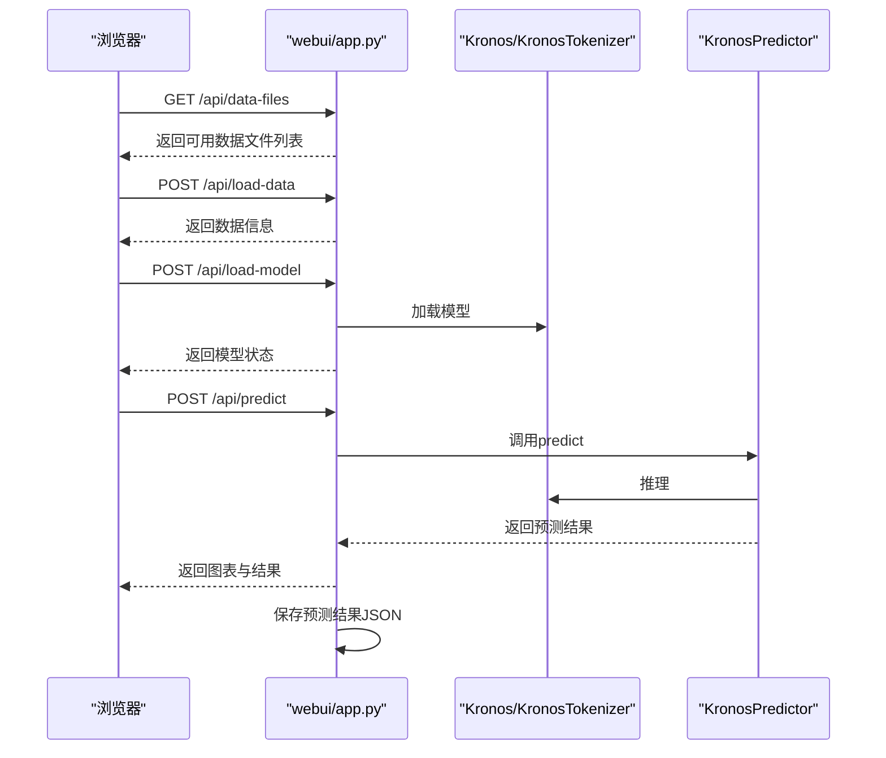
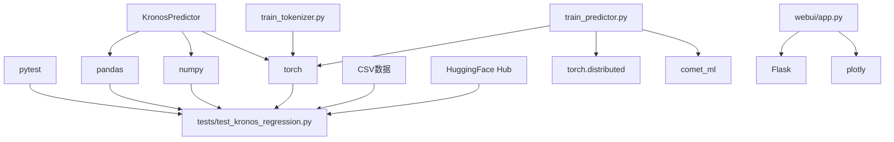

# 测试和验证

<cite>
**本文引用的文件**
- [tests/test_kronos_regression.py](file://tests/test_kronos_regression.py)
- [tests/data/generate_regression_output.py](file://tests/data/generate_regression_output.py)
- [tests/data/regression_input.csv](file://tests/data/regression_input.csv)
- [tests/data/regression_output_256.csv](file://tests/data/regression_output_256.csv)
- [tests/data/regression_output_512.csv](file://tests/data/regression_output_512.csv)
- [model/kronos.py](file://model/kronos.py)
- [model/module.py](file://model/module.py)
- [finetune/train_tokenizer.py](file://finetune/train_tokenizer.py)
- [finetune/train_predictor.py](file://finetune/train_predictor.py)
- [finetune/dataset.py](file://finetune/dataset.py)
- [finetune/config.py](file://finetune/config.py)
- [webui/app.py](file://webui/app.py)
- [examples/prediction_example.py](file://examples/prediction_example.py)
- [examples/prediction_batch_example.py](file://examples/prediction_batch_example.py)
- [README.md](file://README.md)
</cite>

## 目录
1. [引言](#引言)
2. [项目结构](#项目结构)
3. [核心组件](#核心组件)
4. [架构总览](#架构总览)
5. [详细组件分析](#详细组件分析)
6. [依赖分析](#依赖分析)
7. [性能考虑](#性能考虑)
8. [故障排查指南](#故障排查指南)
9. [结论](#结论)
10. [附录](#附录)

## 引言
本文件系统化梳理Kronos项目的测试与验证体系，目标是：
- 解释回归测试的设计原理与实现方式：测试数据生成、预期输出校验、随机采样均方误差（MSE）回归测试。
- 明确测试用例覆盖范围与验证标准，确保模型行为一致性与可复现性。
- 提供手动与自动化测试流程，涵盖单元测试、集成测试与端到端测试。
- 规定测试数据格式、生成规则与质量标准。
- 给出测试结果分析方法与问题诊断工具，辅助开发者快速定位与修复问题。

## 项目结构
Kronos仓库中与测试和验证直接相关的核心目录与文件如下：
- tests：回归测试与固定测试数据
  - test_kronos_regression.py：回归测试主入口，包含两组测试：固定输出回归测试与MSE回归测试
  - data：测试数据与固定输出生成脚本
    - generate_regression_output.py：基于预训练模型生成固定输出，用于回归测试
    - regression_input.csv：回归测试输入数据
    - regression_output_256.csv、regression_output_512.csv：不同上下文长度的固定输出
- model：预测器与模型实现
  - kronos.py：KronosPredictor、Kronos、KronosTokenizer等核心类
  - module.py：量化、嵌入、注意力等底层模块
- finetune：微调流水线（训练、验证、回测）
  - train_tokenizer.py、train_predictor.py：分布式训练脚本
  - dataset.py、config.py：数据集与配置
- webui：Web界面（端到端验证）
  - app.py：Flask服务，提供模型加载、预测、图表与结果保存
- examples：使用示例（端到端验证）
  - prediction_example.py、prediction_batch_example.py：单序列与批量预测示例
- README.md：项目说明与使用指南

图示来源
- [tests/test_kronos_regression.py:1-141](file://tests/test_kronos_regression.py#L1-L141)
- [tests/data/generate_regression_output.py:1-92](file://tests/data/generate_regression_output.py#L1-L92)
- [model/kronos.py:1-663](file://model/kronos.py#L1-L663)
- [model/module.py:1-571](file://model/module.py#L1-L571)
- [finetune/train_tokenizer.py:1-282](file://finetune/train_tokenizer.py#L1-L282)
- [finetune/train_predictor.py:1-245](file://finetune/train_predictor.py#L1-L245)
- [finetune/dataset.py:1-146](file://finetune/dataset.py#L1-L146)
- [finetune/config.py:1-132](file://finetune/config.py#L1-L132)
- [webui/app.py:1-709](file://webui/app.py#L1-L709)
- [examples/prediction_example.py:1-81](file://examples/prediction_example.py#L1-L81)
- [examples/prediction_batch_example.py:1-73](file://examples/prediction_batch_example.py#L1-L73)

章节来源
- [README.md:1-338](file://README.md#L1-L338)

## 核心组件
- 回归测试组件
  - 固定输出回归测试：以固定输入与预训练模型生成固定输出，断言数值精度
  - 随机采样MSE回归测试：在有效区间内随机采样多组样本，断言平均MSE与阈值
- 预测器组件
  - KronosPredictor：封装数据预处理、时间特征提取、归一化、推理与反归一化
  - 自回归推理函数：支持温度、Top-k/Top-p采样与并行采样
- 模型与量化组件
  - BinarySphericalQuantizer、BSQuantizer：二进制球面量化与分位量化
  - TransformerBlock、RMSNorm、MultiHeadAttentionWithRoPE等：模型基础模块
- 微调训练组件
  - 分布式数据加载、优化器、学习率调度、梯度裁剪与日志记录
- WebUI与示例
  - Web服务端点：模型加载、数据加载、预测、图表生成、结果保存
  - 示例脚本：单序列与批量预测演示

章节来源
- [tests/test_kronos_regression.py:1-141](file://tests/test_kronos_regression.py#L1-L141)
- [model/kronos.py:1-663](file://model/kronos.py#L1-L663)
- [model/module.py:1-571](file://model/module.py#L1-L571)
- [finetune/train_tokenizer.py:1-282](file://finetune/train_tokenizer.py#L1-L282)
- [finetune/train_predictor.py:1-245](file://finetune/train_predictor.py#L1-L245)
- [webui/app.py:1-709](file://webui/app.py#L1-L709)
- [examples/prediction_example.py:1-81](file://examples/prediction_example.py#L1-L81)
- [examples/prediction_batch_example.py:1-73](file://examples/prediction_batch_example.py#L1-L73)

## 架构总览
下图展示测试与验证在整体系统中的位置与交互：

图示来源
- [tests/test_kronos_regression.py:1-141](file://tests/test_kronos_regression.py#L1-L141)
- [tests/data/generate_regression_output.py:1-92](file://tests/data/generate_regression_output.py#L1-L92)
- [tests/data/regression_input.csv:1-2502](file://tests/data/regression_input.csv#L1-L2502)
- [tests/data/regression_output_256.csv:1-10](file://tests/data/regression_output_256.csv#L1-L10)
- [tests/data/regression_output_512.csv:1-10](file://tests/data/regression_output_512.csv#L1-L10)
- [model/kronos.py:482-560](file://model/kronos.py#L482-L560)

## 详细组件分析

### 回归测试设计与实现
- 固定输出回归测试
  - 输入：固定的历史窗口数据与预定义的未来时间戳
  - 预期：固定输出CSV（按上下文长度区分）
  - 断言：绝对差与相对差的最大值不超过阈值；最终断言所有元素满足近似相等
  - 关键参数：上下文长度列表、容忍度、特征列名
- 随机采样MSE回归测试
  - 在有效区间内随机采样多个样本，计算每个样本的MSE并取平均
  - 断言：平均MSE与期望MSE的差值不超过阈值
  - 关键参数：样本数量、上下文长度、预测长度、期望MSE与容忍度

图示来源
- [tests/test_kronos_regression.py:45-89](file://tests/test_kronos_regression.py#L45-L89)
- [tests/test_kronos_regression.py:90-141](file://tests/test_kronos_regression.py#L90-L141)

章节来源
- [tests/test_kronos_regression.py:1-141](file://tests/test_kronos_regression.py#L1-L141)

### 固定输出生成流程
- 依据输入数据与上下文长度，构造未来时间戳
- 加载预训练分词器与模型，初始化预测器
- 调用预测器生成输出，进行形状校验
- 将时间戳与预测值合并，保存为CSV

图示来源
- [tests/data/generate_regression_output.py:35-76](file://tests/data/generate_regression_output.py#L35-L76)
- [tests/data/regression_input.csv:1-2502](file://tests/data/regression_input.csv#L1-L2502)

章节来源
- [tests/data/generate_regression_output.py:1-92](file://tests/data/generate_regression_output.py#L1-L92)

### 预测器与模型推理
- 数据预处理
  - 时间戳转为分钟、小时、星期、日、月等特征
  - 归一化与裁剪，缺失volume/amount自动补零或按价格均值推导
- 自回归推理
  - 半量化编码与缓冲区滑动窗口
  - 温度与Top-k/Top-p采样，支持并行采样平均
- 反归一化
  - 基于历史均值与标准差恢复真实尺度

图示来源
- [model/kronos.py:482-662](file://model/kronos.py#L482-L662)

章节来源
- [model/kronos.py:1-663](file://model/kronos.py#L1-L663)

### 微调训练与验证
- 训练流程
  - 分布式数据加载与采样
  - 分词器与预测器分别训练，使用AdamW优化器与OneCycleLR调度
  - 梯度裁剪、日志记录与最佳模型保存
- 数据集
  - QlibDataset：预计算滑窗索引，按epoch重设随机种子保证可复现

图示来源
- [finetune/train_predictor.py:60-179](file://finetune/train_predictor.py#L60-L179)
- [finetune/dataset.py:77-130](file://finetune/dataset.py#L77-L130)

章节来源
- [finetune/train_tokenizer.py:74-215](file://finetune/train_tokenizer.py#L74-L215)
- [finetune/train_predictor.py:1-245](file://finetune/train_predictor.py#L1-L245)
- [finetune/dataset.py:1-146](file://finetune/dataset.py#L1-L146)
- [finetune/config.py:1-132](file://finetune/config.py#L1-L132)

### WebUI端到端验证
- 功能
  - 加载本地数据文件，自动检测时间频率与必要字段
  - 加载预训练模型，进行预测并生成可视化图表
  - 保存预测结果与对比分析到JSON文件
- 端点
  - /api/data-files、/api/load-data、/api/load-model、/api/predict、/api/model-status

图示来源
- [webui/app.py:404-624](file://webui/app.py#L404-L624)

章节来源
- [webui/app.py:1-709](file://webui/app.py#L1-L709)

### 示例脚本端到端验证
- prediction_example.py：单序列预测，绘制收盘价与成交量对比图
- prediction_batch_example.py：批量预测，演示多序列并行推理

章节来源
- [examples/prediction_example.py:1-81](file://examples/prediction_example.py#L1-L81)
- [examples/prediction_batch_example.py:1-73](file://examples/prediction_batch_example.py#L1-L73)

## 依赖分析
- 测试依赖
  - pytest、pandas、numpy、torch、tqdm
  - 测试数据依赖CSV文件与预训练模型权重
- 预测器依赖
  - PyTorch、pandas、numpy、tqdm
  - HuggingFace Hub模型加载
- 微调依赖
  - torch.distributed、torch.utils.data、comet_ml（可选）
  - Qlib数据准备与时间特征工程
- WebUI依赖
  - Flask、Flask-CORS、plotly、json、datetime

图示来源
- [tests/test_kronos_regression.py:1-10](file://tests/test_kronos_regression.py#L1-L10)
- [model/kronos.py:1-10](file://model/kronos.py#L1-L10)
- [finetune/train_tokenizer.py:1-15](file://finetune/train_tokenizer.py#L1-L15)
- [finetune/train_predictor.py:1-15](file://finetune/train_predictor.py#L1-L15)
- [webui/app.py:1-12](file://webui/app.py#L1-L12)

章节来源
- [tests/test_kronos_regression.py:1-10](file://tests/test_kronos_regression.py#L1-L10)
- [model/kronos.py:1-10](file://model/kronos.py#L1-L10)
- [finetune/train_tokenizer.py:1-15](file://finetune/train_tokenizer.py#L1-L15)
- [finetune/train_predictor.py:1-15](file://finetune/train_predictor.py#L1-L15)
- [webui/app.py:1-12](file://webui/app.py#L1-L12)

## 性能考虑
- 上下文长度与设备选择
  - 预训练模型最大上下文长度限制（如512），超出时自动截断
  - 设备优先级：CUDA > MPS > CPU
- 自回归采样
  - 支持温度与Top-k/Top-p采样，控制多样性与稳定性
  - 并行采样计数用于平均，提升稳定性但增加显存占用
- 分布式训练
  - 使用DDP与分布式采样，提升吞吐量
  - OneCycleLR调度与梯度裁剪，稳定收敛

章节来源
- [model/kronos.py:482-560](file://model/kronos.py#L482-L560)
- [finetune/train_tokenizer.py:98-111](file://finetune/train_tokenizer.py#L98-L111)
- [finetune/train_predictor.py:71-81](file://finetune/train_predictor.py#L71-L81)
- [README.md:99-100](file://README.md#L99-L100)

## 故障排查指南
- 回归测试失败
  - 检查输入数据长度是否满足上下文与预测长度之和
  - 核对特征列名与顺序，确保与测试脚本一致
  - 对比绝对差与相对差的最大值，确认是否超过阈值
- 预测器报错
  - 缺失必要列：open、high、low、close；若缺少volume/amount会自动补零
  - 时间戳类型不匹配：确保Series而非DatetimeIndex导致的属性访问错误
  - 归一化异常：检查NaN与无穷大值
- WebUI问题
  - 模型未加载：确认已调用加载模型端点
  - 文件格式不支持：仅支持.csv与.feather
  - 时间戳解析：确保存在timestamps或timestamp/date列
- 微调训练问题
  - 分布式启动：必须使用torchrun
  - 日志与最佳模型：关注Comet日志与最佳模型保存路径

章节来源
- [tests/test_kronos_regression.py:53-56](file://tests/test_kronos_regression.py#L53-L56)
- [model/kronos.py:519-559](file://model/kronos.py#L519-L559)
- [webui/app.py:78-124](file://webui/app.py#L78-L124)
- [webui/app.py:404-492](file://webui/app.py#L404-L492)
- [finetune/train_tokenizer.py:275-282](file://finetune/train_tokenizer.py#L275-L282)
- [finetune/train_predictor.py:238-245](file://finetune/train_predictor.py#L238-L245)

## 结论
Kronos的测试与验证体系通过“固定输出回归”和“随机采样MSE回归”双轨并行，既保证了模型行为的确定性与可复现性，又评估了在不同样本上的稳定性。结合WebUI与示例脚本，实现了从单元测试到端到端验证的完整闭环。建议在持续集成中定期运行回归测试，并在模型版本升级时同步更新固定输出，以维持长期稳定性。

## 附录

### 测试数据格式与生成规则
- 输入数据格式
  - 必需列：timestamps、open、high、low、close
  - 可选列：volume、amount
  - 时间戳列名支持：timestamps、timestamp、date
- 生成规则
  - 固定输出生成脚本根据上下文长度切片，生成对应长度的未来时间戳
  - 保存为CSV，列顺序与输入一致
- 质量标准
  - 回归测试：绝对差与相对差最大值不超过阈值
  - MSE回归测试：平均MSE与期望MSE的差值不超过阈值

章节来源
- [tests/data/generate_regression_output.py:11-21](file://tests/data/generate_regression_output.py#L11-L21)
- [tests/data/generate_regression_output.py:35-76](file://tests/data/generate_regression_output.py#L35-L76)
- [tests/test_kronos_regression.py:15-29](file://tests/test_kronos_regression.py#L15-L29)
- [tests/test_kronos_regression.py:90-141](file://tests/test_kronos_regression.py#L90-L141)

### 自动化测试流程
- 单元测试（回归测试）
  - 运行命令：pytest tests/test_kronos_regression.py
  - 依赖：预训练模型权重、测试数据CSV
- 固定输出生成
  - 运行命令：python tests/data/generate_regression_output.py
  - 作用：生成固定输出CSV供回归测试使用
- 端到端测试（WebUI）
  - 启动服务：python webui/app.py
  - 访问端点：/api/load-model、/api/load-data、/api/predict
- 端到端测试（示例脚本）
  - 运行命令：python examples/prediction_example.py、python examples/prediction_batch_example.py

章节来源
- [tests/test_kronos_regression.py:1-10](file://tests/test_kronos_regression.py#L1-L10)
- [tests/data/generate_regression_output.py:79-92](file://tests/data/generate_regression_output.py#L79-L92)
- [webui/app.py:700-709](file://webui/app.py#L700-L709)
- [examples/prediction_example.py:1-81](file://examples/prediction_example.py#L1-L81)
- [examples/prediction_batch_example.py:1-73](file://examples/prediction_batch_example.py#L1-L73)