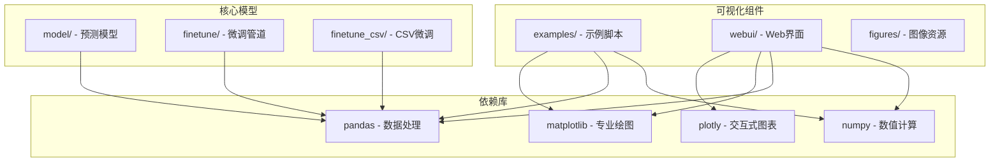
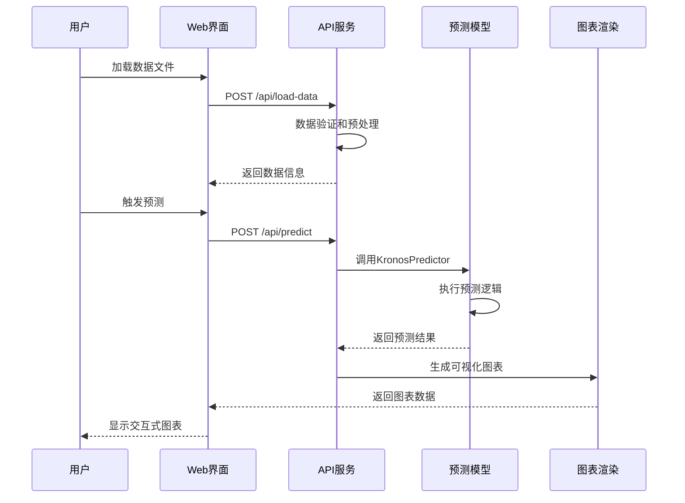
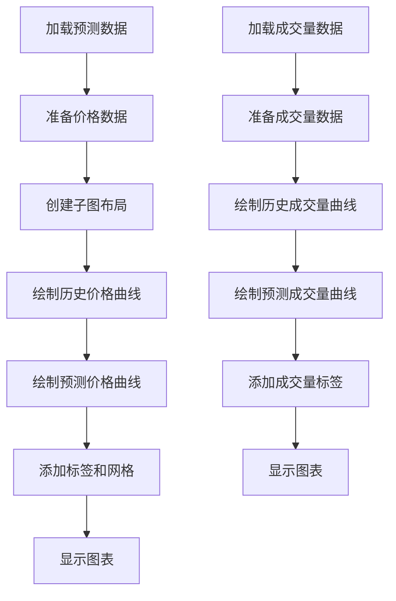
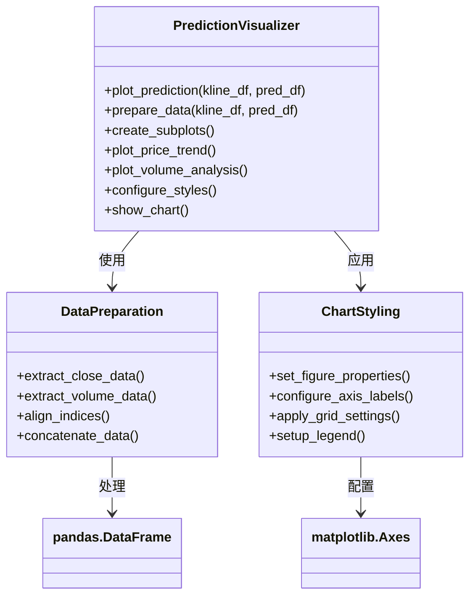
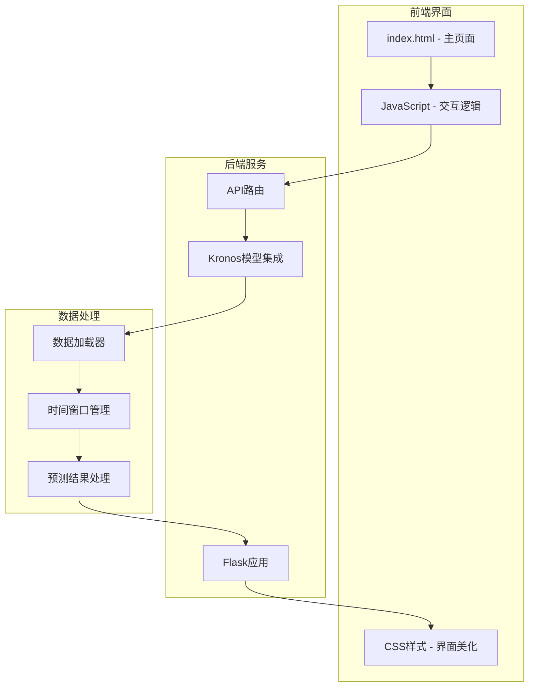
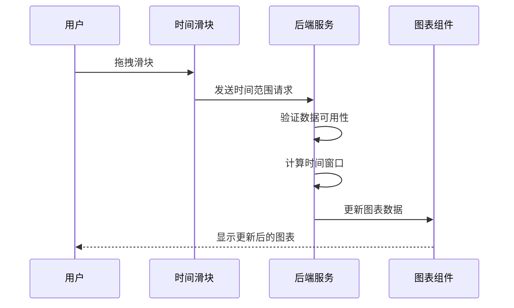
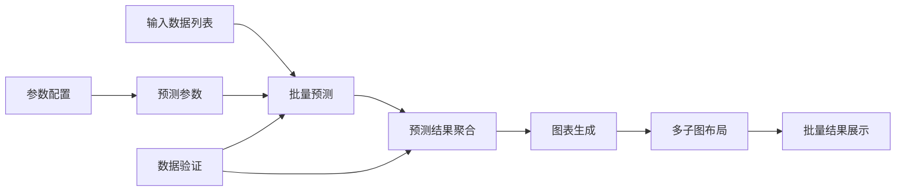
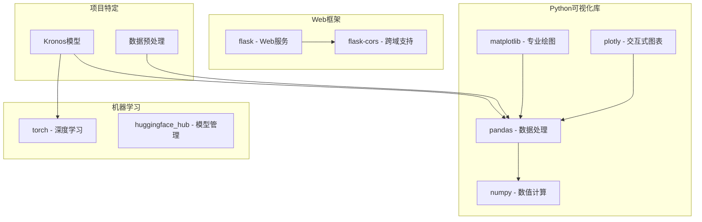
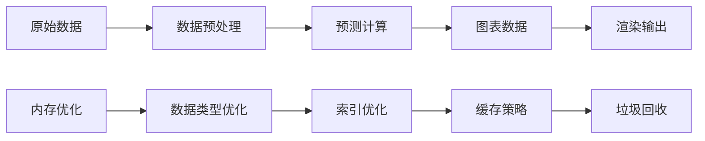

# 可视化教程

<cite>
**本文档中引用的文件**
- [README.md](file://README.md)
- [examples/prediction_example.py](file://examples/prediction_example.py)
- [examples/prediction_batch_example.py](file://examples/prediction_batch_example.py)
- [examples/prediction_wo_vol_example.py](file://examples/prediction_wo_vol_example.py)
- [webui/app.py](file://webui/app.py)
- [webui/run.py](file://webui/run.py)
- [webui/templates/index.html](file://webui/templates/index.html)
- [webui/requirements.txt](file://webui/requirements.txt)
- [requirements.txt](file://requirements.txt)
- [finetune_csv/README.md](file://finetune_csv/README.md)
- [finetune_csv/configs/config_ali09988_candle-5min.yaml](file://finetune_csv/configs/config_ali09988_candle-5min.yaml)
- [finetune/config.py](file://finetune/config.py)
</cite>

## 目录
1. [简介](#简介)
2. [项目结构](#项目结构)
3. [核心组件](#核心组件)
4. [架构概览](#架构概览)
5. [详细组件分析](#详细组件分析)
6. [依赖关系分析](#依赖关系分析)
7. [性能考虑](#性能考虑)
8. [故障排除指南](#故障排除指南)
9. [结论](#结论)
10. [附录](#附录)

## 简介

本教程专注于Kronos金融预测模型的结果可视化，提供了从基础matplotlib图表到高级Plotly交互式图表的完整解决方案。Kronos是一个专为金融K线数据设计的开源基础模型，能够处理来自全球45个交易所的多维金融序列数据。

本教程将详细介绍如何：
- 使用matplotlib创建专业的预测图表（价格走势对比图、成交量分析图）
- 实现交互式可视化（Plotly集成）
- 进行预测结果与真实数据的对比分析
- 应用图表定制技巧（颜色搭配、标签设置、网格配置）
- 实现Web图表展示和图表导出最佳实践

## 项目结构

Kronos项目采用模块化设计，主要包含以下可视化相关组件：

**图表来源**
- [examples/prediction_example.py:1-81](file://examples/prediction_example.py#L1-L81)
- [webui/app.py:1-709](file://webui/app.py#L1-L709)

**章节来源**
- [README.md:1-338](file://README.md#L1-L338)
- [requirements.txt:1-11](file://requirements.txt#L1-L11)

## 核心组件

### Matplotlib可视化组件

项目提供了三种不同复杂度的matplotlib可视化示例：

1. **基础价格走势对比图** - 展示收盘价预测与实际值的对比
2. **完整K线图表** - 包含价格走势和成交量分析
3. **简化版本** - 仅显示价格走势，不包含成交量

### Plotly交互式可视化

Web界面实现了完整的交互式图表功能，支持：
- Candlestick蜡烛图显示
- 动态时间窗口选择
- 实时预测结果展示
- 比较分析功能

**章节来源**
- [examples/prediction_example.py:8-39](file://examples/prediction_example.py#L8-L39)
- [examples/prediction_batch_example.py:8-39](file://examples/prediction_batch_example.py#L8-L39)
- [examples/prediction_wo_vol_example.py:8-27](file://examples/prediction_wo_vol_example.py#L8-L27)

## 架构概览

Kronos可视化系统采用分层架构设计，支持多种可视化需求：

**图表来源**
- [webui/app.py:404-625](file://webui/app.py#L404-L625)
- [webui/templates/index.html:636-800](file://webui/templates/index.html#L636-L800)

## 详细组件分析

### Matplotlib基础可视化组件

#### 基础价格走势对比图

该组件展示了最简单的预测结果可视化方式：

**图表来源**
- [examples/prediction_example.py:8-39](file://examples/prediction_example.py#L8-L39)

#### 完整K线图表组件

该组件提供了更丰富的可视化功能：

**图表来源**
- [examples/prediction_example.py:8-39](file://examples/prediction_example.py#L8-L39)

**章节来源**
- [examples/prediction_example.py:8-81](file://examples/prediction_example.py#L8-L81)
- [examples/prediction_batch_example.py:8-73](file://examples/prediction_batch_example.py#L8-L73)
- [examples/prediction_wo_vol_example.py:8-69](file://examples/prediction_wo_vol_example.py#L8-L69)

### Plotly交互式可视化组件

#### Web界面架构

Web界面实现了完整的交互式可视化解决方案：

**图表来源**
- [webui/app.py:1-709](file://webui/app.py#L1-L709)
- [webui/templates/index.html:1-800](file://webui/templates/index.html#L1-L800)

#### 时间窗口选择组件

Web界面提供了灵活的时间窗口选择功能：

**图表来源**
- [webui/templates/index.html:510-532](file://webui/templates/index.html#L510-L532)
- [webui/app.py:404-625](file://webui/app.py#L404-L625)

**章节来源**
- [webui/app.py:209-328](file://webui/app.py#L209-L328)
- [webui/templates/index.html:510-632](file://webui/templates/index.html#L510-L632)

### 批量预测可视化组件

#### 批量处理流程

批量预测场景下的可视化处理：

**图表来源**
- [examples/prediction_batch_example.py:67-73](file://examples/prediction_batch_example.py#L67-L73)

**章节来源**
- [examples/prediction_batch_example.py:8-73](file://examples/prediction_batch_example.py#L8-L73)

## 依赖关系分析

### 核心依赖库

Kronos可视化系统依赖于多个专业库：

**图表来源**
- [requirements.txt:1-11](file://requirements.txt#L1-L11)
- [webui/requirements.txt:1-8](file://webui/requirements.txt#L1-L8)

### 版本兼容性

| 组件 | 最低版本 | 推荐版本 | 兼容性 |
|------|----------|----------|--------|
| Python | 3.10+ | 3.10+ | ✅ 完全兼容 |
| matplotlib | 3.9.3 | 3.9.3 | ✅ 完全兼容 |
| plotly | 5.17.0 | 5.17.0 | ✅ 完全兼容 |
| pandas | 2.2.2 | 2.2.2 | ✅ 完全兼容 |
| torch | 2.1.0 | 2.1.0+ | ✅ 兼容 |
| flask | 2.3.3 | 2.3.3 | ✅ 完全兼容 |

**章节来源**
- [requirements.txt:1-11](file://requirements.txt#L1-L11)
- [webui/requirements.txt:1-8](file://webui/requirements.txt#L1-L8)

## 性能考虑

### 图表渲染优化

1. **内存管理**
   - 使用pandas的高效数据结构
   - 避免不必要的数据复制
   - 及时释放大型数据对象

2. **渲染性能**
   - 对于大量数据点，考虑降采样策略
   - 使用矢量图形而非位图
   - 合理设置图表尺寸

3. **Web界面优化**
   - 实现数据懒加载
   - 使用缓存机制
   - 优化网络传输

### 内存使用分析

## 故障排除指南

### 常见问题及解决方案

#### Matplotlib图表问题

1. **字体显示问题**
   - 症状：中文字符显示为方框
   - 解决方案：设置matplotlib的font.family为SimHei或Microsoft YaHei

2. **坐标轴标签重叠**
   - 症状：时间轴标签重叠
   - 解决方案：使用rotation参数旋转标签或调整figure大小

3. **颜色不显示**
   - 症状：图表颜色异常
   - 解决方案：检查matplotlib的颜色映射配置

#### Plotly交互问题

1. **图表不显示**
   - 症状：空白图表或JavaScript错误
   - 解决方案：检查Plotly CDN连接和浏览器控制台错误

2. **数据格式错误**
   - 症状：图表渲染失败
   - 解决方案：验证数据格式符合Plotly要求

3. **响应速度慢**
   - 症状：图表加载缓慢
   - 解决方案：减少数据点数量或启用数据分页

**章节来源**
- [webui/app.py:1-709](file://webui/app.py#L1-L709)
- [webui/run.py:1-90](file://webui/run.py#L1-L90)

## 结论

Kronos项目提供了完整的金融预测结果可视化解决方案，从基础的matplotlib图表到高级的Plotly交互式界面。通过合理利用这些工具和技术，用户可以：

1. **快速创建专业级图表** - 利用matplotlib的丰富功能
2. **实现交互式数据分析** - 通过Plotly增强用户体验
3. **构建可扩展的可视化系统** - 支持批量处理和Web部署
4. **优化性能和内存使用** - 适用于大规模金融数据

建议根据具体需求选择合适的可视化方案，并结合项目特点进行定制化开发。

## 附录

### 颜色搭配指南

| 组件 | 颜色 | 用途 | 建议 |
|------|------|------|------|
| 历史数据 | 蓝色系 | 表示已知历史数据 | 使用深蓝色(#1f77b4) |
| 预测数据 | 红色系 | 表示预测结果 | 使用深红色(#d62728) |
| 成交量 | 绿色系 | 表示交易量 | 使用浅绿色(#2ca02c) |
| 网格线 | 灰色系 | 提供参考线 | 使用浅灰色(#e6e6e6) |
| 标签文字 | 深灰色 | 文字说明 | 使用#333333 |

### 图表导出最佳实践

1. **高分辨率图片导出**
   - 设置dpi参数为300+
   - 使用矢量格式如SVG或PDF
   - 确保字体嵌入

2. **PDF报告生成**
   - 使用reportlab库
   - 统一图表样式和布局
   - 添加必要的统计信息

3. **Web图表分享**
   - 使用Plotly的image功能
   - 提供多种格式选项
   - 确保跨浏览器兼容性

### 批量处理建议

1. **数据分块处理**
   - 将大数据集分割为小块
   - 并行处理提高效率
   - 实现断点续传

2. **结果聚合**
   - 使用pandas的groupby功能
   - 实现统计汇总
   - 生成批量报告