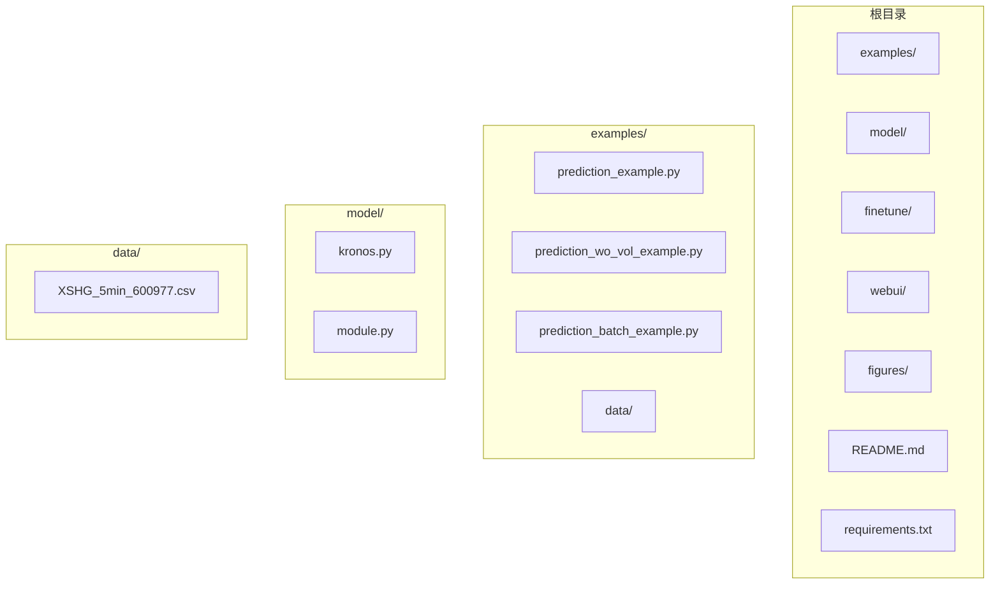
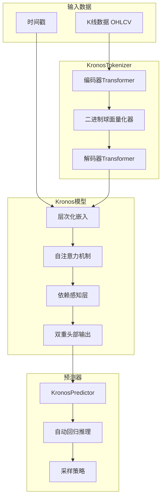
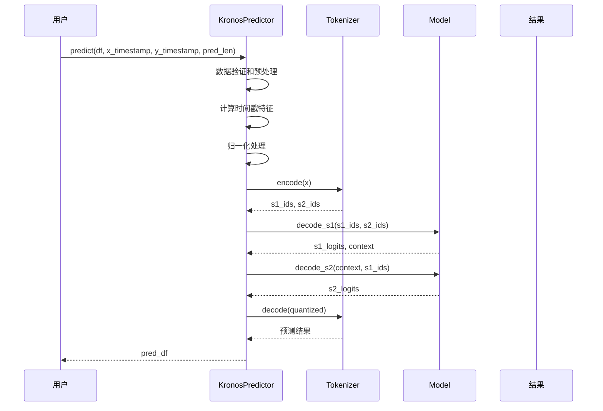
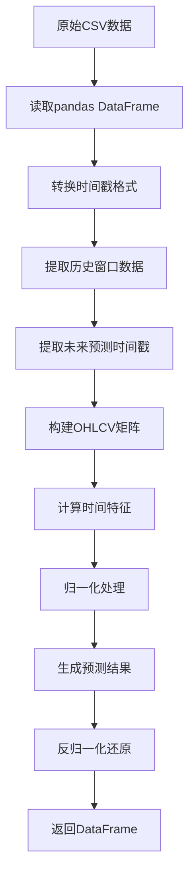
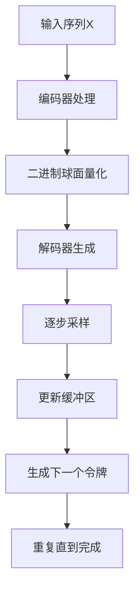
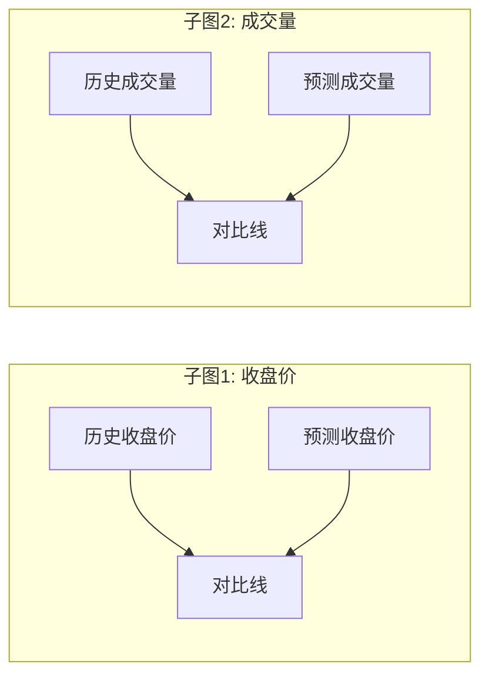
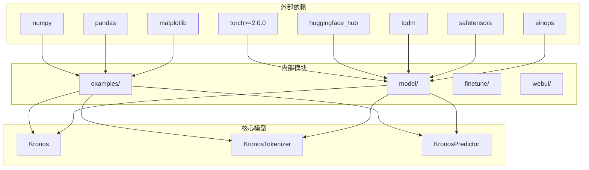
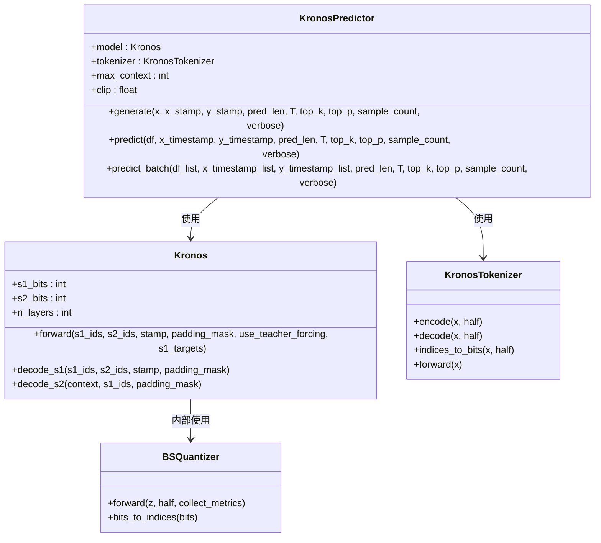

# 基础预测示例

<cite>
**本文档引用的文件**
- [prediction_example.py](file://examples/prediction_example.py)
- [XSHG_5min_600977.csv](file://examples/data/XSHG_5min_600977.csv)
- [kronos.py](file://model/kronos.py)
- [module.py](file://model/module.py)
- [README.md](file://README.md)
- [requirements.txt](file://requirements.txt)
- [prediction_wo_vol_example.py](file://examples/prediction_wo_vol_example.py)
- [prediction_batch_example.py](file://examples/prediction_batch_example.py)
</cite>

## 目录
1. [简介](#简介)
2. [项目结构](#项目结构)
3. [核心组件](#核心组件)
4. [架构概览](#架构概览)
5. [详细组件分析](#详细组件分析)
6. [依赖关系分析](#依赖关系分析)
7. [性能考虑](#性能考虑)
8. [故障排除指南](#故障排除指南)
9. [结论](#结论)
10. [附录](#附录)

## 简介

Kronos是一个专为金融K线数据设计的基础模型，能够预测单序列K线数据。本指南详细介绍了如何使用Kronos进行基础预测，包括模型加载、数据准备、预测执行和结果可视化。特别关注KronosPredictor的使用方法、参数配置选项以及在A股5分钟K线数据上的实际应用。

## 项目结构

该项目采用模块化设计，主要包含以下核心目录和文件：



**图表来源**
- [README.md:1-338](file://README.md#L1-L338)
- [requirements.txt:1-11](file://requirements.txt#L1-L11)

**章节来源**
- [README.md:1-338](file://README.md#L1-L338)
- [requirements.txt:1-11](file://requirements.txt#L1-L11)

## 核心组件

### 模型架构组件

Kronos系统由三个核心组件构成：

1. **KronosTokenizer**: 专门的K线数据分词器
2. **Kronos模型**: 自回归Transformer预测器
3. **KronosPredictor**: 预测器封装类

### 数据预处理组件

- **二进制球面量化器(BSQuantizer)**: 将连续K线数据量化为离散令牌
- **层次化嵌入(HierarchicalEmbedding)**: 处理s1和s2令牌的嵌入
- **时序嵌入(TemporalEmbedding)**: 处理时间特征

**章节来源**
- [kronos.py:13-663](file://model/kronos.py#L13-L663)
- [module.py:39-571](file://model/module.py#L39-L571)

## 架构概览

Kronos采用两阶段框架：首先通过专用分词器将K线数据转换为离散令牌，然后使用大型自回归Transformer模型进行预测。



**图表来源**
- [kronos.py:13-663](file://model/kronos.py#L13-L663)
- [module.py:39-571](file://model/module.py#L39-L571)

## 详细组件分析

### KronosPredictor详解

KronosPredictor是用户接口的核心类，提供了简化的预测API。

#### 主要参数配置

| 参数名 | 类型 | 默认值 | 作用 | 调优建议 |
|--------|------|--------|------|----------|
| `max_context` | int | 512 | 最大上下文长度 | A股小盘股建议400-512 |
| `clip` | float | 5 | 数值裁剪阈值 | 保持在5左右以避免异常值影响 |
| `device` | str | 自动检测 | 计算设备选择 | GPU优先，CPU作为后备 |
| `T` | float | 1.0 | 采样温度 | 0.7-1.3范围内的微调 |
| `top_k` | int | 0 | Top-k过滤阈值 | 通常设置为0禁用 |
| `top_p` | float | 0.9 | 核心采样概率阈值 | 0.8-0.95范围内调优 |
| `sample_count` | int | 1 | 并行采样数量 | 1用于确定性预测 |

#### 核心方法流程



**图表来源**
- [kronos.py:482-560](file://model/kronos.py#L482-L560)
- [kronos.py:389-470](file://model/kronos.py#L389-L470)

**章节来源**
- [kronos.py:482-560](file://model/kronos.py#L482-L560)

### 数据准备与处理

#### A股5分钟K线数据处理

对于A股5分钟K线数据，需要准备以下字段：

| 字段名 | 必需性 | 描述 | 处理方式 |
|--------|--------|------|----------|
| `timestamps` | 必需 | 时间戳 | 使用pandas.to_datetime转换 |
| `open` | 必需 | 开盘价 | 保持原始数值 |
| `high` | 必需 | 最高价 | 保持原始数值 |
| `low` | 必需 | 最低价 | 保持原始数值 |
| `close` | 必需 | 收盘价 | 保持原始数值 |
| `volume` | 可选 | 成交量 | 缺失时填充为0 |
| `amount` | 可选 | 成交额 | 缺失时根据成交量和均价计算 |

#### 数据预处理流程



**图表来源**
- [prediction_example.py:48-79](file://examples/prediction_example.py#L48-L79)
- [kronos.py:519-559](file://model/kronos.py#L519-L559)

**章节来源**
- [prediction_example.py:48-79](file://examples/prediction_example.py#L48-L79)
- [kronos.py:519-559](file://model/kronos.py#L519-L559)

### 预测执行与采样策略

#### 自动回归推理过程

Kronos使用自回归方式生成预测，每一步都基于历史上下文和当前预测。



**图表来源**
- [kronos.py:389-470](file://model/kronos.py#L389-L470)

#### 采样策略配置

| 采样策略 | 参数 | 适用场景 | 调优要点 |
|----------|------|----------|----------|
| 确定性采样 | T=0.0, top_k=0, top_p=1.0 | 需要可重现结果 | 设置T=0确保确定性 |
| 温度采样 | 0.7≤T≤1.3 | 控制创造性程度 | 0.7-1.0平衡稳定性和多样性 |
| 核心采样 | 0.8≤top_p≤0.95 | 提高质量稳定性 | 0.9常用，避免过度保守 |
| 混合策略 | T=1.0, top_k=0, top_p=0.9 | 平衡质量与效率 | 经典组合，适合大多数场景 |

**章节来源**
- [kronos.py:331-386](file://model/kronos.py#L331-L386)
- [kronos.py:389-470](file://model/kronos.py#L389-L470)

### 结果可视化

#### 收盘价与成交量对比图



**图表来源**
- [prediction_example.py:8-39](file://examples/prediction_example.py#L8-L39)

**章节来源**
- [prediction_example.py:8-39](file://examples/prediction_example.py#L8-L39)

## 依赖关系分析

### 核心依赖关系



**图表来源**
- [requirements.txt:1-11](file://requirements.txt#L1-L11)
- [README.md:87-93](file://README.md#L87-L93)

### 模块间交互



**图表来源**
- [kronos.py:482-663](file://model/kronos.py#L482-L663)
- [kronos.py:13-114](file://model/kronos.py#L13-L114)
- [module.py:225-254](file://model/module.py#L225-L254)

**章节来源**
- [kronos.py:482-663](file://model/kronos.py#L482-L663)
- [module.py:225-254](file://model/module.py#L225-L254)

## 性能考虑

### 计算资源优化

1. **GPU加速**: 当可用时自动使用CUDA设备
2. **批处理**: 支持多序列并行预测
3. **内存管理**: 合理设置max_context避免内存溢出
4. **采样策略**: 根据需求调整sample_count平衡速度和质量

### 参数调优建议

| 参数类型 | 调优方向 | 建议范围 | 影响说明 |
|----------|----------|----------|----------|
| `max_context` | 减少 | 256-512 | 提高速度，可能损失长期依赖 |
| `T` | 降低 | 0.7-1.0 | 提高稳定性，减少波动性 |
| `top_p` | 降低 | 0.8-0.95 | 提高质量，减少异常值 |
| `sample_count` | 保持 | 1 | 确定性预测，节省计算资源 |

## 故障排除指南

### 常见问题及解决方案

#### 1. 设备兼容性问题

**问题**: CUDA不可用或版本不兼容
**解决方案**: 
- 检查PyTorch CUDA支持状态
- 回退到CPU模式运行
- 更新PyTorch版本至2.0+

#### 2. 内存不足错误

**问题**: 预测过程中出现内存溢出
**解决方案**:
- 减少max_context参数值
- 降低sample_count
- 使用更小的模型变体

#### 3. 数据格式错误

**问题**: DataFrame列缺失或格式不正确
**解决方案**:
- 确保包含open、high、low、close列
- 检查时间戳格式转换
- 验证数值数据的完整性

#### 4. 预测结果异常

**问题**: 预测值超出合理范围
**解决方案**:
- 调整clip参数限制异常值
- 检查输入数据的归一化
- 调整采样温度参数

**章节来源**
- [kronos.py:519-559](file://model/kronos.py#L519-L559)
- [kronos.py:562-661](file://model/kronos.py#L562-L661)

## 结论

Kronos为金融K线数据预测提供了一个强大而灵活的解决方案。通过KronosPredictor的简化接口，用户可以轻松地进行单序列K线预测，包括A股5分钟K线数据的处理。关键在于正确配置参数、合理处理数据预处理，并根据具体应用场景调整采样策略。

主要优势：
- **专业性强**: 专门为金融K线数据设计
- **易于使用**: 简化的API接口
- **灵活性高**: 支持多种采样策略和参数配置
- **扩展性好**: 支持批量预测和自定义数据格式

## 附录

### 完整使用流程

```python
# 1. 加载模型和分词器
from model import Kronos, KronosTokenizer, KronosPredictor

tokenizer = KronosTokenizer.from_pretrained("NeoQuasar/Kronos-Tokenizer-base")
model = Kronos.from_pretrained("NeoQuasar/Kronos-small")

# 2. 实例化预测器
predictor = KronosPredictor(model, tokenizer, max_context=512)

# 3. 准备数据
df = pd.read_csv("./data/XSHG_5min_600977.csv")
df['timestamps'] = pd.to_datetime(df['timestamps'])

lookback = 400
pred_len = 120

x_df = df.loc[:lookback-1, ['open', 'high', 'low', 'close', 'volume', 'amount']]
x_timestamp = df.loc[:lookback-1, 'timestamps']
y_timestamp = df.loc[lookback:lookback+pred_len-1, 'timestamps']

# 4. 执行预测
pred_df = predictor.predict(
    df=x_df,
    x_timestamp=x_timestamp,
    y_timestamp=y_timestamp,
    pred_len=pred_len,
    T=1.0,
    top_p=0.9,
    sample_count=1,
    verbose=True
)

# 5. 可视化结果
# 使用提供的绘图函数
```

### 参数配置最佳实践

| 场景 | 推荐配置 | 说明 |
|------|----------|------|
| 实时交易 | T=0.7, top_p=0.9, sample_count=1 | 高稳定性，快速响应 |
| 研究分析 | T=1.0, top_p=0.9, sample_count=5 | 平衡质量与多样性 |
| 风险评估 | T=1.3, top_p=0.85, sample_count=10 | 探索极端情况 |
| 生产部署 | T=0.8, top_p=0.95, sample_count=1 | 稳定可靠，性能优先 |

**章节来源**
- [prediction_example.py:41-81](file://examples/prediction_example.py#L41-L81)
- [README.md:95-215](file://README.md#L95-L215)