# 多市场预测示例

<cite>
**本文档引用的文件**
- [examples/prediction_cn_markets_day.py](file://examples/prediction_cn_markets_day.py)
- [examples/prediction_wo_vol_example.py](file://examples/prediction_wo_vol_example.py)
- [examples/prediction_example.py](file://examples/prediction_example.py)
- [examples/prediction_batch_example.py](file://examples/prediction_batch_example.py)
- [examples/data/XSHG_5min_600977.csv](file://examples/data/XSHG_5min_600977.csv)
- [model/kronos.py](file://model/kronos.py)
- [model/module.py](file://model/module.py)
- [finetune/utils/training_utils.py](file://finetune/utils/training_utils.py)
- [finetune/config.py](file://finetune/config.py)
- [finetune_csv/README_CN.md](file://finetune_csv/README_CN.md)
- [finetune_csv/config_loader.py](file://finetune_csv/config_loader.py)
- [finetune_csv/configs/config_ali09988_candle-5min.yaml](file://finetune_csv/configs/config_ali09988_candle-5min.yaml)
- [README.md](file://README.md)
</cite>

## 目录
1. [简介](#简介)
2. [项目结构](#项目结构)
3. [核心组件](#核心组件)
4. [架构概览](#架构概览)
5. [详细组件分析](#详细组件分析)
6. [多市场预测示例](#多市场预测示例)
7. [数据格式适配](#数据格式适配)
8. [市场特有参数设置](#市场特有参数设置)
9. [跨市场比较与基准测试](#跨市场比较与基准测试)
10. [性能考虑](#性能考虑)
11. [故障排除指南](#故障排除指南)
12. [结论](#结论)

## 简介

Kronos是一个专为金融K线序列设计的基础模型，能够处理来自全球45个交易所的多市场数据。本文档详细介绍了多市场预测示例，包括A股日线数据处理、无成交量预测场景、不同市场数据格式适配以及跨市场比较分析。

## 项目结构

该项目采用模块化设计，主要包含以下核心目录：

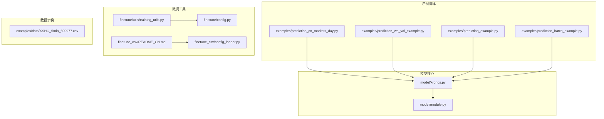

**图表来源**
- [examples/prediction_cn_markets_day.py:1-209](file://examples/prediction_cn_markets_day.py#L1-L209)
- [model/kronos.py:1-663](file://model/kronos.py#L1-L663)
- [model/module.py:1-571](file://model/module.py#L1-L571)

**章节来源**
- [README.md:1-338](file://README.md#L1-L338)

## 核心组件

### Kronos预测器 (KronosPredictor)

KronosPredictor是整个预测系统的核心组件，负责数据预处理、模型推理和结果后处理。

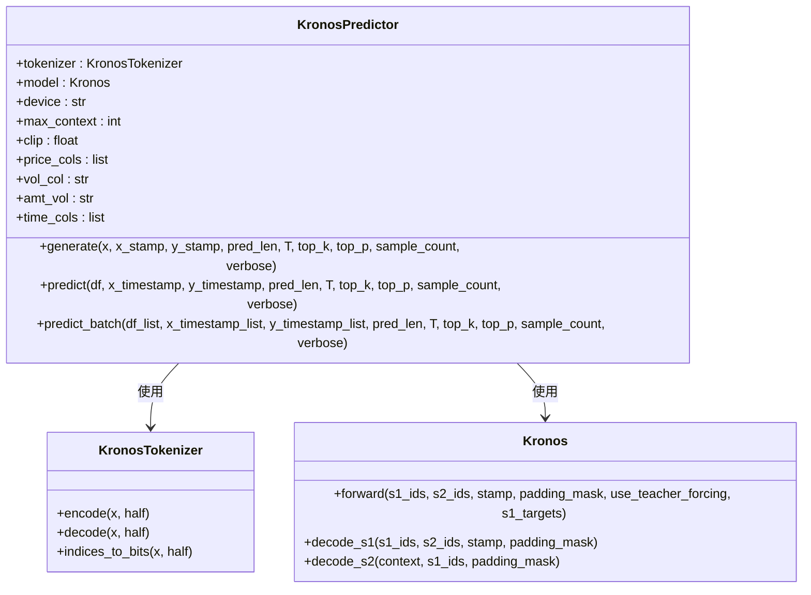

**图表来源**
- [model/kronos.py:482-662](file://model/kronos.py#L482-L662)

### 时间特征工程

Kronos模型内置了时间特征提取功能，能够从时间戳中提取分钟、小时、星期几、日期和月份等特征。

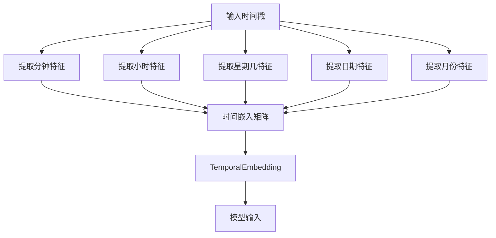

**图表来源**
- [model/kronos.py:472-479](file://model/kronos.py#L472-L479)
- [model/module.py:536-562](file://model/module.py#L536-L562)

**章节来源**
- [model/kronos.py:482-662](file://model/kronos.py#L482-L662)
- [model/module.py:536-562](file://model/module.py#L536-L562)

## 架构概览

Kronos采用两阶段框架：量化分词器 + 自回归Transformer。

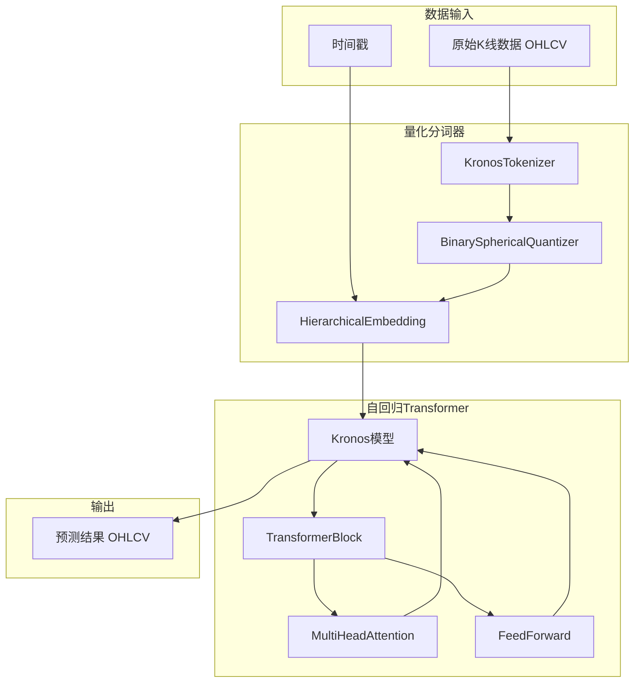

**图表来源**
- [model/kronos.py:13-114](file://model/kronos.py#L13-L114)
- [model/module.py:400-484](file://model/module.py#L400-L484)

## 详细组件分析

### 数据预处理管道

KronosPredictor实现了完整的数据预处理管道，包括缺失值处理、标准化和时间特征提取。

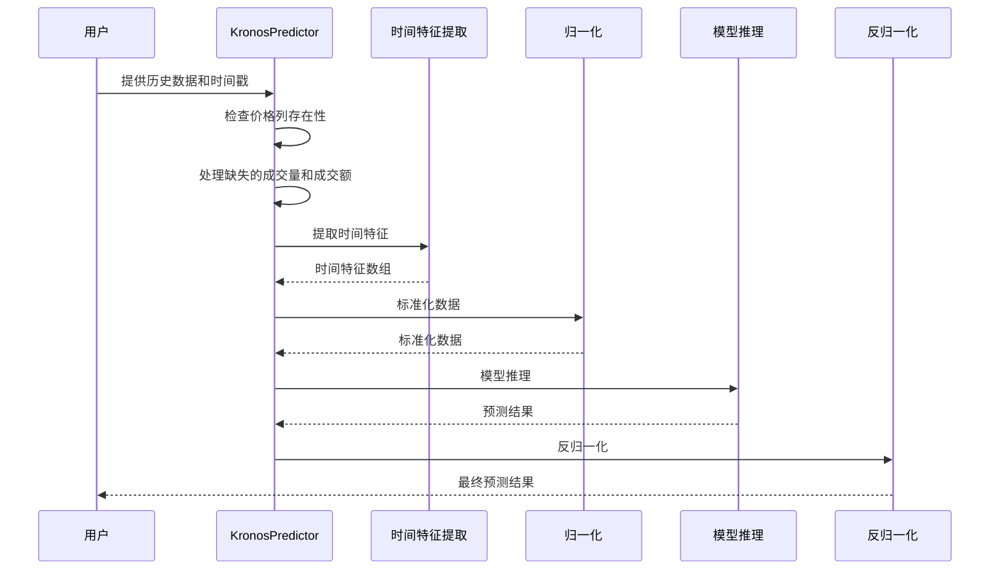

**图表来源**
- [model/kronos.py:519-559](file://model/kronos.py#L519-L559)

**章节来源**
- [model/kronos.py:519-559](file://model/kronos.py#L519-L559)

### 批量预测机制

Kronos支持批量预测，能够并行处理多个时间序列。

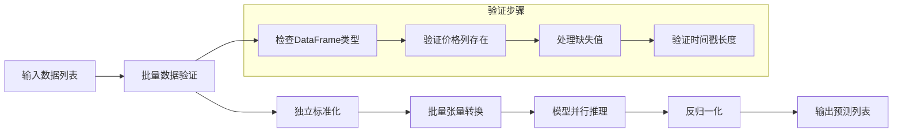

**图表来源**
- [model/kronos.py:562-661](file://model/kronos.py#L562-L661)

**章节来源**
- [model/kronos.py:562-661](file://model/kronos.py#L562-L661)

## 多市场预测示例

### A股日线数据预测

A股日线数据预测示例展示了如何处理中文市场数据，包括akshare数据获取、数据清洗和价格限制处理。

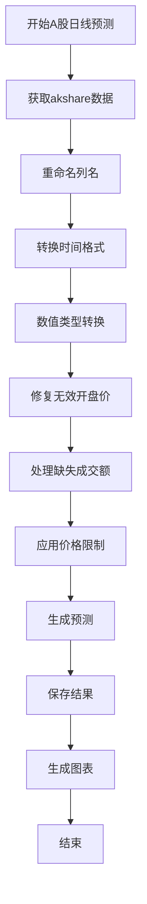

**图表来源**
- [examples/prediction_cn_markets_day.py:48-109](file://examples/prediction_cn_markets_day.py#L48-L109)
- [examples/prediction_cn_markets_day.py:159-209](file://examples/prediction_cn_markets_day.py#L159-L209)

**章节来源**
- [examples/prediction_cn_markets_day.py:1-209](file://examples/prediction_cn_markets_day.py#L1-L209)

### 无成交量预测场景

无成交量预测示例展示了如何处理缺少成交量和成交额数据的情况。

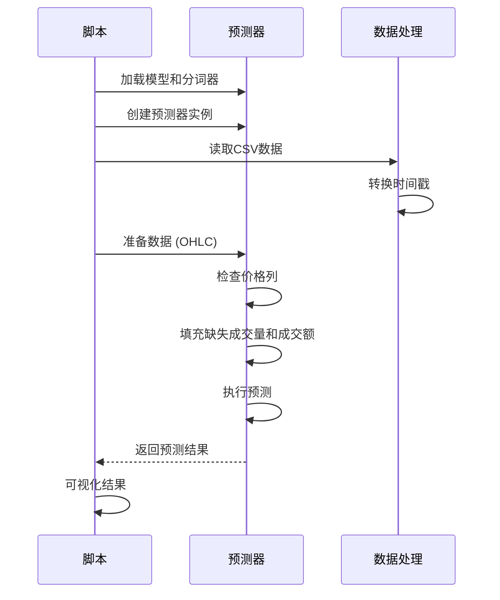

**图表来源**
- [examples/prediction_wo_vol_example.py:29-69](file://examples/prediction_wo_vol_example.py#L29-L69)

**章节来源**
- [examples/prediction_wo_vol_example.py:1-69](file://examples/prediction_wo_vol_example.py#L1-L69)

### 批量预测示例

批量预测示例演示了如何同时处理多个时间序列。

**章节来源**
- [examples/prediction_batch_example.py:1-73](file://examples/prediction_batch_example.py#L1-L73)

## 数据格式适配

### 标准CSV格式

Kronos支持标准的CSV数据格式，包含以下必需列：

| 列名 | 类型 | 描述 | 必需 |
|------|------|------|------|
| timestamps | datetime | 时间戳 | 是 |
| open | float | 开盘价 | 是 |
| high | float | 最高价 | 是 |
| low | float | 最低价 | 是 |
| close | float | 收盘价 | 是 |
| volume | float | 成交量 | 否 |
| amount | float | 成交额 | 否 |

### 不同市场数据格式

#### 美股数据格式
```python
# 美股数据示例格式
{
    'timestamp': '2024-01-01 09:30:00',
    'Open': 150.25,
    'High': 152.30,
    'Low': 149.80,
    'Close': 151.90,
    'Volume': 1000000
}
```

#### 港股数据格式
```python
# 港股数据示例格式
{
    'timestamp': '2024-01-01 09:30:00',
    'Open': 250.50,
    'High': 255.75,
    'Low': 248.25,
    'Close': 253.10,
    'Volume': 500000
}
```

#### 加密货币数据格式
```python
# 加密货币数据示例格式
{
    'timestamp': '2024-01-01 00:00:00',
    'open': 45000.0,
    'high': 46500.0,
    'low': 44200.0,
    'close': 45800.0,
    'volume': 2500.5
}
```

**章节来源**
- [finetune_csv/README_CN.md:8-28](file://finetune_csv/README_CN.md#L8-L28)

## 市场特有参数设置

### 交易日历和节假日处理

Kronos通过时间特征工程自动处理不同市场的交易日历差异：

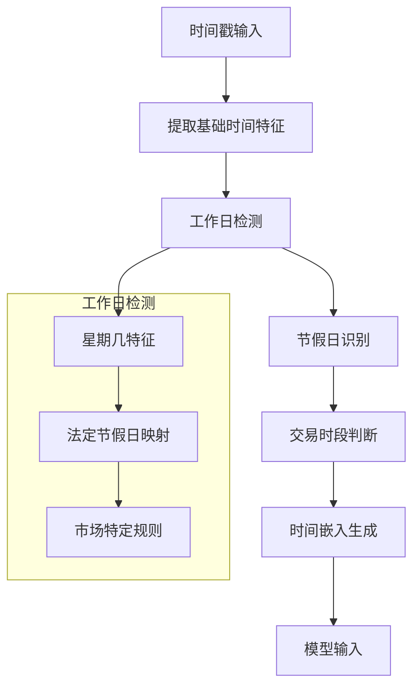

**图表来源**
- [model/module.py:536-562](file://model/module.py#L536-L562)

### 流动性考虑

Kronos通过以下机制处理不同市场的流动性差异：

1. **成交量缺失处理**：自动填充零值或基于价格计算估算
2. **时间窗口优化**：根据市场流动性调整lookback窗口大小
3. **采样策略**：使用top-k和top-p采样控制预测多样性

**章节来源**
- [model/kronos.py:528-532](file://model/kronos.py#L528-L532)

## 跨市场比较与基准测试

### 性能基准测试

Kronos提供了多种基准测试方法来评估不同市场的预测性能：

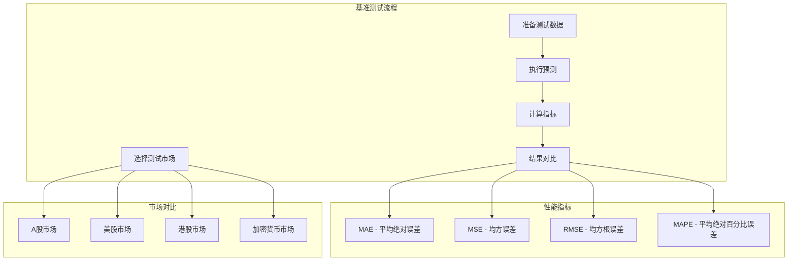

### 市场特性对比

| 市场类型 | 交易时间 | 交易日 | 波动性 | 流动性 | 数据频率 |
|----------|----------|--------|--------|--------|----------|
| A股 | 9:30-15:00 | 中国股市 | 中等 | 高 | 日线/分钟线 |
| 美股 | 9:30-16:00 | 美国股市 | 高 | 极高 | 日线/分钟线 |
| 港股 | 9:30-16:00 | 香港股市 | 中等偏高 | 高 | 日线/分钟线 |
| 加密货币 | 24/7 | 全天候 | 极高 | 极高 | 分钟线/秒线 |

**章节来源**
- [README.md:217-308](file://README.md#L217-L308)

## 性能考虑

### 计算资源优化

1. **批处理优化**：使用predict_batch方法并行处理多个序列
2. **内存管理**：合理设置max_context避免内存溢出
3. **设备选择**：优先使用GPU进行推理，自动检测CUDA可用性

### 推理速度优化

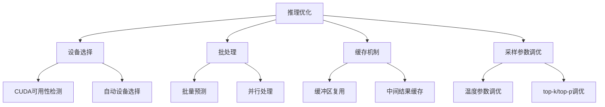

**图表来源**
- [model/kronos.py:482-507](file://model/kronos.py#L482-L507)

## 故障排除指南

### 常见问题及解决方案

1. **数据格式错误**
   - 确保CSV文件包含必需的列
   - 检查时间戳格式是否正确
   - 验证数值列是否为可转换的数字格式

2. **内存不足**
   - 减少max_context参数值
   - 使用较小的batch_size
   - 在CPU上运行而非GPU

3. **模型加载失败**
   - 检查Hugging Face模型名称
   - 确认网络连接正常
   - 验证本地缓存权限

4. **预测结果异常**
   - 检查输入数据的完整性
   - 调整采样参数(T, top_k, top_p)
   - 验证时间戳连续性

**章节来源**
- [model/kronos.py:524-535](file://model/kronos.py#L524-L535)

## 结论

Kronos多市场预测示例展示了该模型在不同金融市场的强大适应能力。通过灵活的数据预处理、时间特征工程和批量预测机制，Kronos能够有效处理A股、美股、港股和加密货币等不同市场的数据特点。

关键优势包括：
- **多市场兼容性**：统一的接口支持不同市场的数据格式
- **鲁棒性**：完善的错误处理和数据清洗机制
- **高性能**：批量预测和设备自动选择优化推理速度
- **可扩展性**：模块化的架构便于添加新的市场支持

建议在实际部署中：
1. 根据具体市场调整时间窗口和采样参数
2. 定期更新预训练模型以适应市场变化
3. 建立监控机制跟踪预测性能
4. 结合业务需求定制后处理逻辑