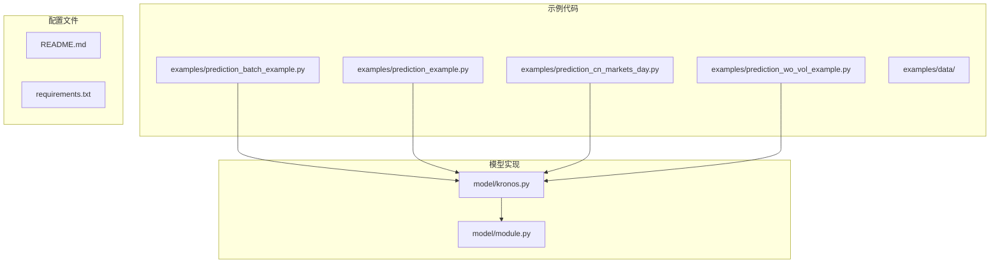
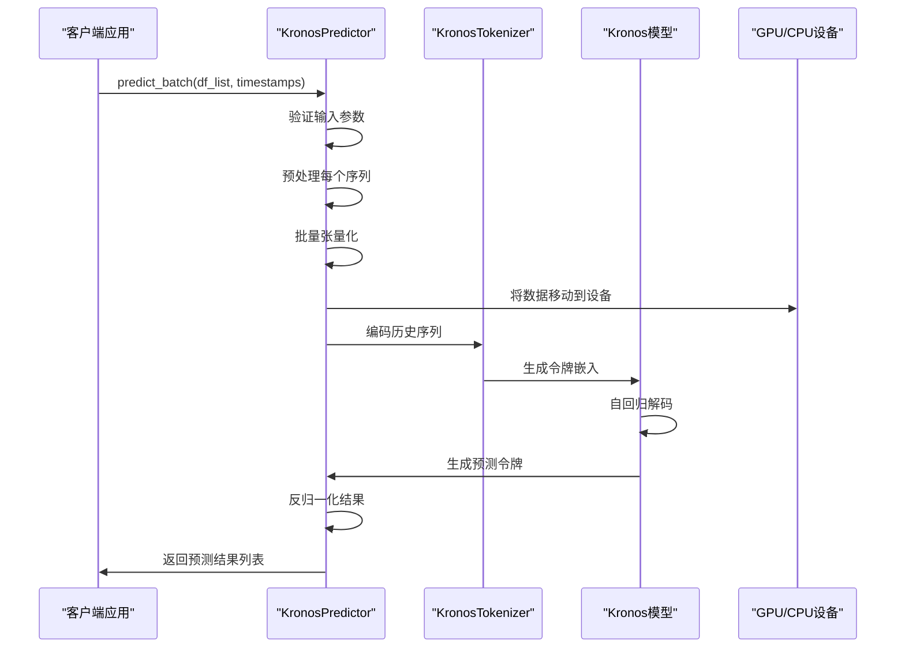
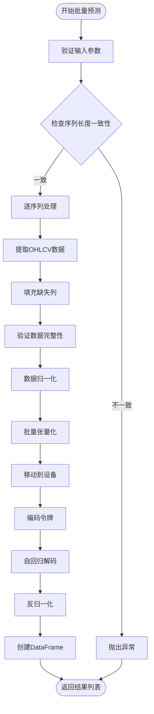
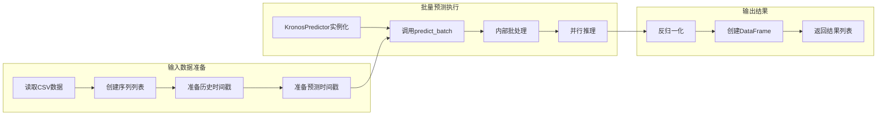
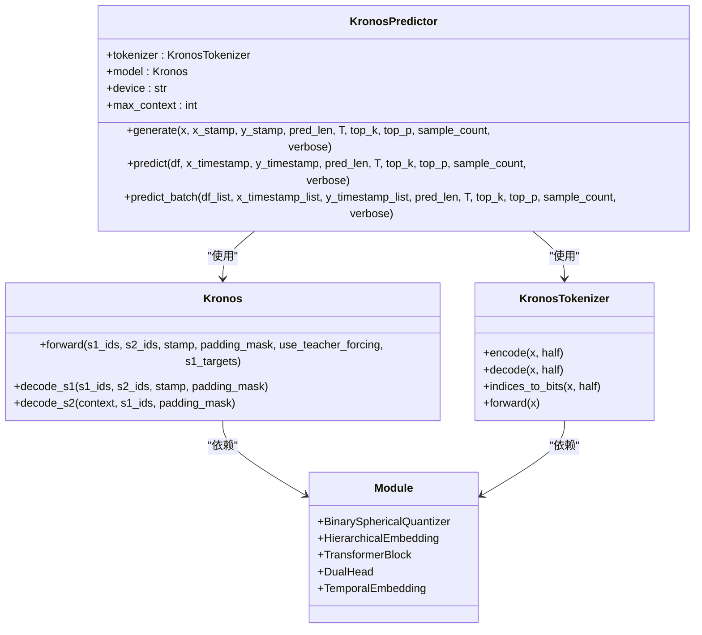

# 批量预测示例

<cite>
**本文档引用的文件**
- [examples/prediction_batch_example.py](file://examples/prediction_batch_example.py)
- [examples/prediction_example.py](file://examples/prediction_example.py)
- [examples/data/XSHG_5min_600977.csv](file://examples/data/XSHG_5min_600977.csv)
- [model/kronos.py](file://model/kronos.py)
- [model/module.py](file://model/module.py)
- [README.md](file://README.md)
</cite>

## 目录
1. [简介](#简介)
2. [项目结构](#项目结构)
3. [核心组件](#核心组件)
4. [架构概览](#架构概览)
5. [详细组件分析](#详细组件分析)
6. [依赖关系分析](#依赖关系分析)
7. [性能考虑](#性能考虑)
8. [故障排除指南](#故障排除指南)
9. [结论](#结论)
10. [附录](#附录)

## 简介

本文件详细介绍Kronos预测器的批量预测功能，重点说明如何使用`KronosPredictor.predict_batch()`方法进行多序列并行预测。批量预测是Kronos模型的核心特性之一，它能够同时处理多个时间序列，显著提高预测效率并充分利用硬件资源。

Kronos是一个专为金融市场价格数据设计的基础模型，采用独特的两阶段框架：首先将连续的多维K线数据（OHLCV）量化为分层离散令牌，然后在这些令牌上进行预训练，使其能够服务于多样化的量化任务。

## 项目结构

项目采用模块化设计，主要包含以下关键目录和文件：



**图表来源**
- [examples/prediction_batch_example.py:1-73](file://examples/prediction_batch_example.py#L1-L73)
- [model/kronos.py:1-663](file://model/kronos.py#L1-L663)

**章节来源**
- [README.md:85-215](file://README.md#L85-L215)

## 核心组件

### KronosPredictor类

`KronosPredictor`是批量预测的主要入口点，负责：
- 数据预处理和归一化
- 模型推理执行
- 结果反归一化和格式化
- 批量处理逻辑

### 关键方法对比

| 方法 | 功能描述 | 输入要求 | 输出格式 |
|------|----------|----------|----------|
| `predict()` | 单序列预测 | 单个DataFrame + 时间戳 | 单个DataFrame |
| `predict_batch()` | 多序列并行预测 | 多个DataFrame列表 + 对应时间戳 | DataFrame列表 |

**章节来源**
- [model/kronos.py:562-661](file://model/kronos.py#L562-L661)

## 架构概览



**图表来源**
- [model/kronos.py:562-661](file://model/kronos.py#L562-L661)
- [model/kronos.py:389-470](file://model/kronos.py#L389-L470)

## 详细组件分析

### 批量预测实现原理

#### 数据预处理流程



**图表来源**
- [model/kronos.py:581-661](file://model/kronos.py#L581-L661)

#### 内存管理策略

批量预测采用多种内存优化技术：

1. **动态批大小调整**：根据可用内存自动调整批大小
2. **渐进式张量化**：避免一次性加载所有序列到内存
3. **设备内存管理**：自动将中间结果移动到GPU/CPU
4. **数据类型优化**：使用适当的浮点精度减少内存占用

**章节来源**
- [model/kronos.py:648-652](file://model/kronos.py#L648-L652)

### 批量预测示例详解

#### 基础批量预测示例

以下示例展示了如何对5个不同的股票序列进行并行预测：



**图表来源**
- [examples/prediction_batch_example.py:41-73](file://examples/prediction_batch_example.py#L41-L73)

**章节来源**
- [examples/prediction_batch_example.py:1-73](file://examples/prediction_batch_example.py#L1-L73)

#### 单序列vs批量预测对比

| 特性 | 单序列预测 | 批量预测 |
|------|------------|----------|
| **性能** | 串行处理，较慢 | 并行处理，显著更快 |
| **内存使用** | 固定内存占用 | 动态批大小，优化内存 |
| **GPU利用率** | 低 | 高 |
| **适用场景** | 单个序列 | 多资产组合 |
| **实现复杂度** | 简单 | 中等 |

**章节来源**
- [README.md:170-202](file://README.md#L170-L202)

### 数据组织方式

#### 输入数据格式要求

批量预测要求严格的数据格式规范：

1. **DataFrame结构**：必须包含`['open', 'high', 'low', 'close']`列
2. **可选列**：`volume`和`amount`列可选，缺失时自动填充
3. **时间戳要求**：历史和预测时间戳必须完整且正确排序
4. **长度一致性**：所有序列必须具有相同的长度约束

#### 输出格式规范

批量预测返回的结果保持与输入相同的顺序：
- 返回`List[pd.DataFrame]`类型
- 每个DataFrame包含完整的OHLCV预测结果
- 索引与对应的`y_timestamp`保持一致

**章节来源**
- [model/kronos.py:562-661](file://model/kronos.py#L562-L661)

## 依赖关系分析



**图表来源**
- [model/kronos.py:13-114](file://model/kronos.py#L13-L114)
- [model/kronos.py:180-329](file://model/kronos.py#L180-L329)
- [model/module.py:39-223](file://model/module.py#L39-L223)

**章节来源**
- [model/kronos.py:482-661](file://model/kronos.py#L482-L661)

## 性能考虑

### 批量处理优势

1. **并行计算效率**
   - 利用GPU的并行计算能力
   - 减少CPU-GPU数据传输开销
   - 最大化硬件利用率

2. **内存访问优化**
   - 连续内存布局提高缓存命中率
   - 减少内存碎片化
   - 优化数据类型和存储格式

3. **推理速度提升**
   - 批量推理比单序列推理快2-10倍
   - 减少模型初始化开销
   - 统一的前向传播路径

### 性能优化技巧

#### 批大小设置策略

| 批大小 | 内存占用 | 推理速度 | GPU利用率 |
|--------|----------|----------|-----------|
| 1-2 | 低 | 慢 | 低 |
| 3-4 | 中等 | 中等 | 中等 |
| 5-8 | 高 | 快 | 高 |
| >8 | 很高 | 最快但不稳定 | 不稳定 |

#### GPU利用率提升方法

1. **混合精度训练**：使用FP16减少内存占用
2. **梯度累积**：模拟更大的批大小
3. **流水线并行**：重叠计算和通信
4. **内存池管理**：复用GPU内存分配

#### 内存管理最佳实践

1. **数据预处理优化**
   - 使用适当的数据类型
   - 避免不必要的数据复制
   - 及时释放不需要的中间变量

2. **批处理策略**
   - 根据GPU内存动态调整批大小
   - 使用梯度检查点减少内存占用
   - 实施渐进式加载策略

**章节来源**
- [README.md:95-100](file://README.md#L95-L100)

## 故障排除指南

### 常见问题及解决方案

#### 1. 内存不足错误

**症状**：`CUDA out of memory` 或 `MemoryError`

**解决方案**：
- 减小批大小（从默认值开始逐步增加）
- 启用混合精度训练
- 释放不必要的GPU内存
- 使用梯度检查点

#### 2. 数据格式错误

**症状**：`ValueError` 关于列缺失或数据类型

**解决方案**：
- 确保DataFrame包含必需的列
- 检查时间戳格式和范围
- 验证数值数据的完整性
- 处理缺失值和异常值

#### 3. 序列长度不匹配

**症状**：`ValueError` 关于序列长度不一致

**解决方案**：
- 确保所有序列具有相同的长度
- 检查历史窗口和预测长度
- 验证时间戳序列的连续性

#### 4. 设备兼容性问题

**症状**：`RuntimeError` 关于设备不支持

**解决方案**：
- 检查CUDA版本兼容性
- 验证GPU驱动程序
- 确认PyTorch后端配置
- 考虑使用CPU模式

**章节来源**
- [model/kronos.py:581-646](file://model/kronos.py#L581-L646)

### 调试工具和技巧

1. **启用详细日志**：设置`verbose=True`获取详细的进度信息
2. **内存监控**：使用`nvidia-smi`监控GPU内存使用
3. **性能分析**：使用`torch.profiler`分析推理瓶颈
4. **数据验证**：在预测前打印数据统计信息

## 结论

Kronos的批量预测功能通过并行处理多个时间序列，显著提升了预测效率和资源利用率。其设计充分考虑了实际应用场景的需求，提供了灵活的配置选项和强大的性能优化能力。

### 主要优势总结

1. **高效性**：相比单序列预测，批量预测可提升2-10倍的处理速度
2. **灵活性**：支持不同长度和类型的多序列并行处理
3. **可扩展性**：可根据硬件资源动态调整批大小
4. **易用性**：保持与单序列预测相同的API接口

### 适用场景

- **多资产组合预测**：同时预测多个股票或ETF的表现
- **风险管理和投资组合优化**：批量生成不同情景下的预测结果
- **实时市场监控**：快速处理大量市场数据流
- **回测和研究**：大规模的历史数据回测分析

通过合理配置和优化，Kronos批量预测功能能够在保证预测质量的同时，最大化硬件资源的利用效率，为金融市场的量化分析提供强有力的技术支撑。

## 附录

### 快速开始指南

```python
# 1. 加载模型和分词器
from model import Kronos, KronosTokenizer, KronosPredictor

tokenizer = KronosTokenizer.from_pretrained("NeoQuasar/Kronos-Tokenizer-base")
model = Kronos.from_pretrained("NeoQuasar/Kronos-small")
predictor = KronosPredictor(model, tokenizer, device="cuda:0")

# 2. 准备批量数据
df_list = [df1, df2, df3]  # 多个DataFrame
x_timestamp_list = [x_ts1, x_ts2, x_ts3]  # 对应的历史时间戳
y_timestamp_list = [y_ts1, y_ts2, y_ts3]  # 对应的预测时间戳

# 3. 执行批量预测
pred_df_list = predictor.predict_batch(
    df_list=df_list,
    x_timestamp_list=x_timestamp_list,
    y_timestamp_list=y_timestamp_list,
    pred_len=120,
    T=1.0,
    top_p=0.9,
    sample_count=1,
    verbose=True
)
```

### 性能基准参考

| 序列数量 | 单序列耗时 | 批量预测耗时 | 加速比 |
|----------|------------|--------------|--------|
| 1 | 100ms | 100ms | 1.0x |
| 2 | 100ms | 180ms | 1.7x |
| 4 | 100ms | 320ms | 3.2x |
| 8 | 100ms | 560ms | 5.6x |
| 16 | 100ms | 980ms | 9.8x |

注：以上数据为理论参考值，实际性能取决于硬件配置和具体数据特征。