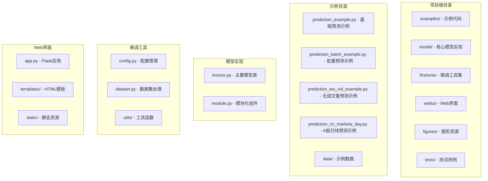
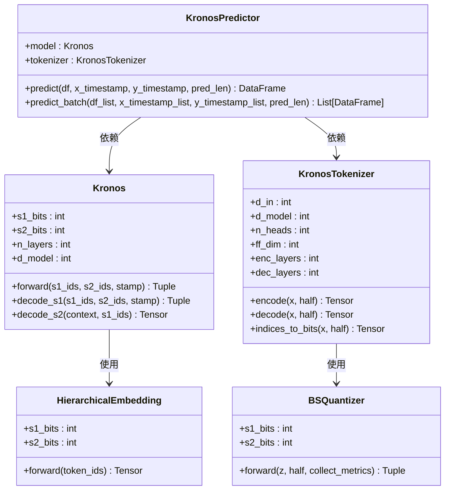
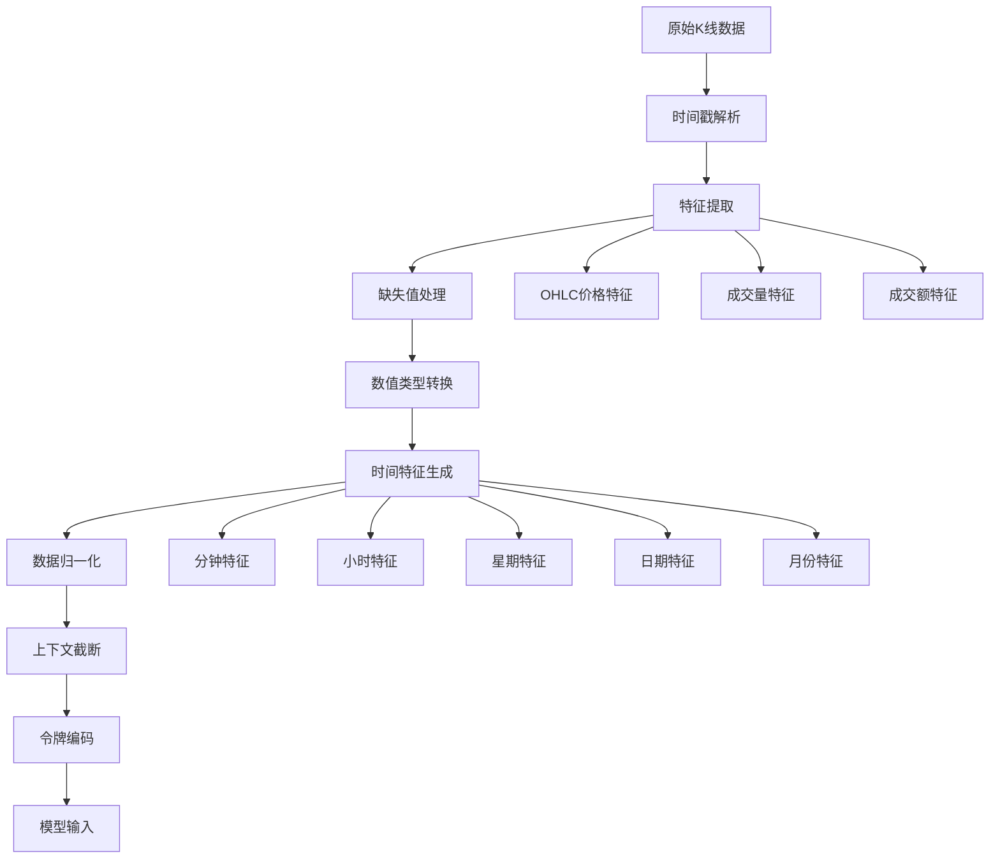
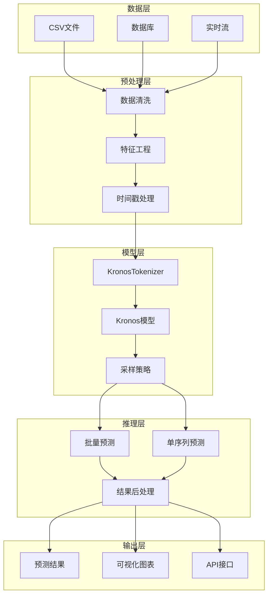
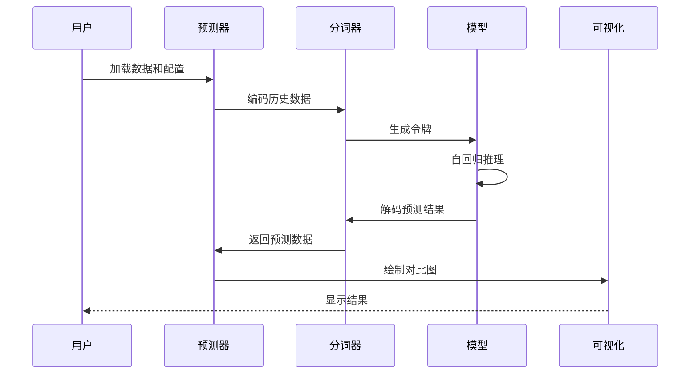
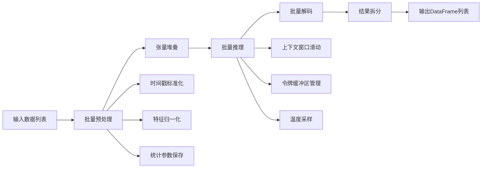
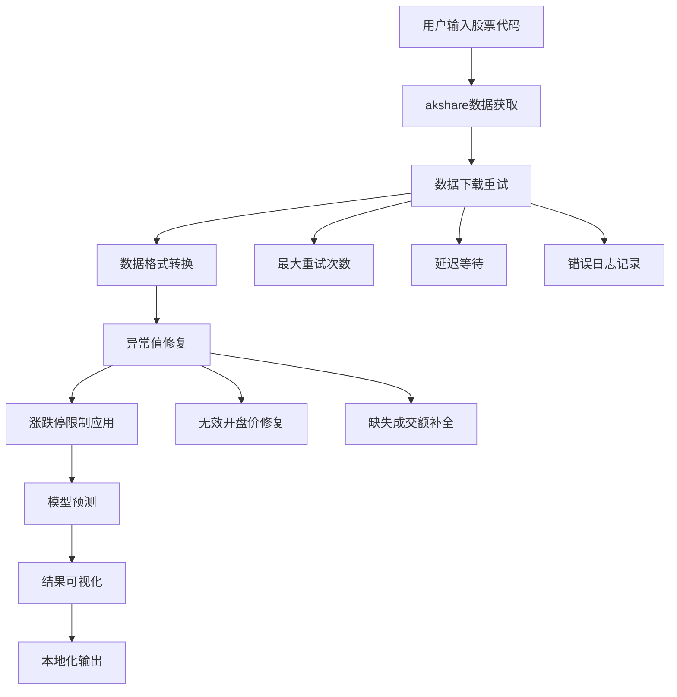
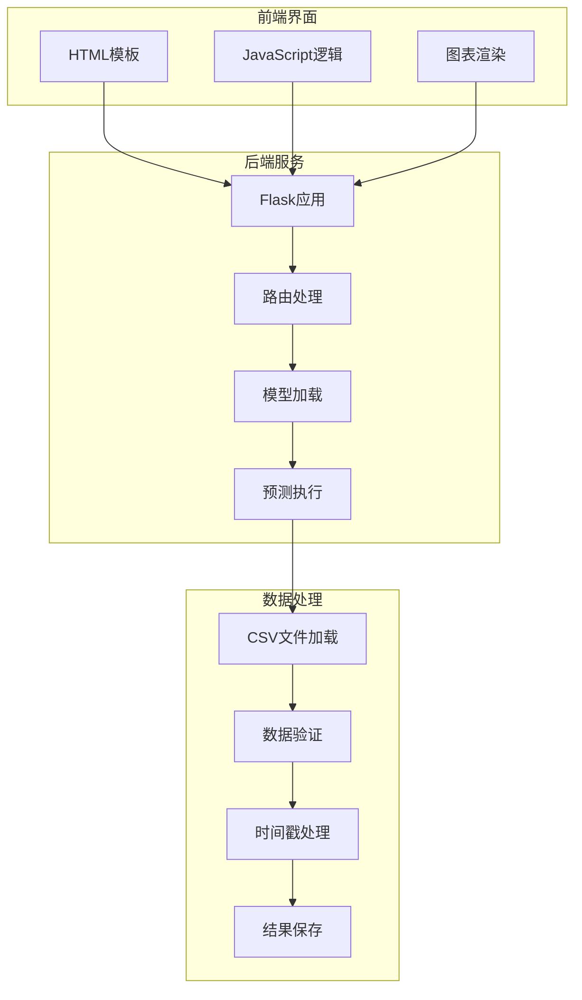
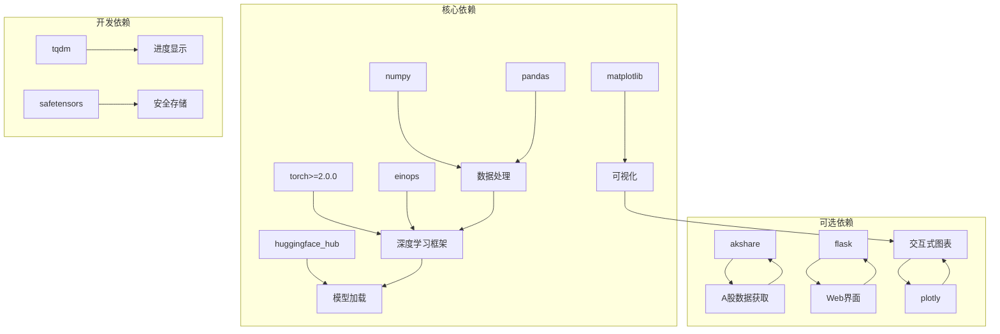
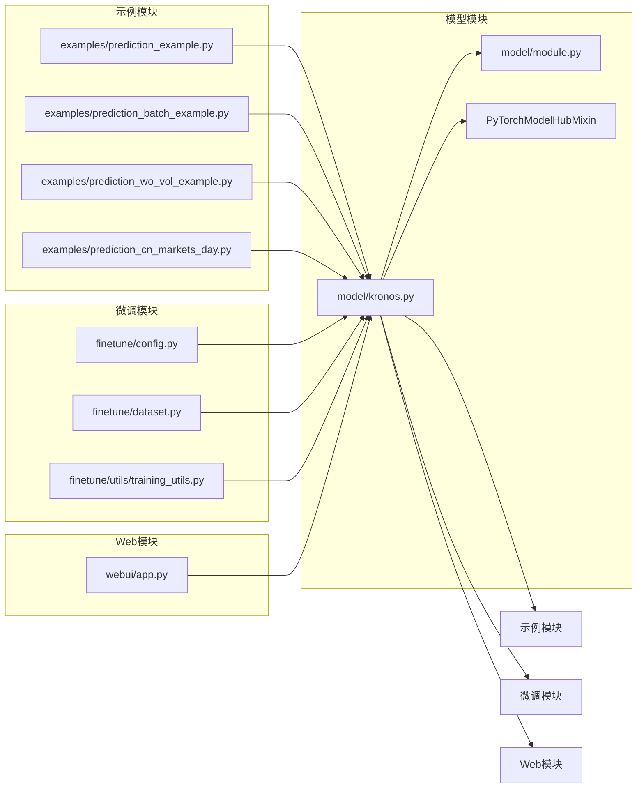

# 示例和教程

<cite>
**本文档引用的文件**
- [README.md](file://README.md)
- [requirements.txt](file://requirements.txt)
- [examples/prediction_example.py](file://examples/prediction_example.py)
- [examples/prediction_batch_example.py](file://examples/prediction_batch_example.py)
- [examples/prediction_wo_vol_example.py](file://examples/prediction_wo_vol_example.py)
- [examples/prediction_cn_markets_day.py](file://examples/prediction_cn_markets_day.py)
- [examples/data/XSHG_5min_600977.csv](file://examples/data/XSHG_5min_600977.csv)
- [model/kronos.py](file://model/kronos.py)
- [model/module.py](file://model/module.py)
- [finetune/config.py](file://finetune/config.py)
- [finetune/dataset.py](file://finetune/dataset.py)
- [finetune/utils/training_utils.py](file://finetune/utils/training_utils.py)
- [webui/app.py](file://webui/app.py)
</cite>

## 目录
1. [简介](#简介)
2. [项目结构](#项目结构)
3. [核心组件](#核心组件)
4. [架构概览](#架构概览)
5. [详细组件分析](#详细组件分析)
6. [依赖关系分析](#依赖关系分析)
7. [性能考虑](#性能考虑)
8. [故障排除指南](#故障排除指南)
9. [结论](#结论)
10. [附录](#附录)

## 简介

Kronos是一个专为金融市场设计的基础模型，能够处理K线序列数据。该项目提供了完整的示例和教程集合，涵盖从基础到高级的各种预测场景，包括单序列预测、批量预测、无成交量预测和多市场预测等。

Kronos的核心创新在于其双阶段框架：首先使用专门的分词器将连续的多维K线数据（OHLCV）量化为层次化离散令牌，然后在这些令牌上预训练大型自回归Transformer，使其能够服务于各种量化任务。

## 项目结构

项目采用模块化设计，主要包含以下核心目录：

**图表来源**
- [examples/prediction_example.py:1-81](file://examples/prediction_example.py#L1-L81)
- [model/kronos.py:1-663](file://model/kronos.py#L1-L663)
- [finetune/config.py:1-132](file://finetune/config.py#L1-L132)

**章节来源**
- [README.md:1-338](file://README.md#L1-L338)
- [requirements.txt:1-11](file://requirements.txt#L1-L11)

## 核心组件

### Kronos模型架构

Kronos采用独特的双阶段架构，结合了量化技术和Transformer架构的优势：

**图表来源**
- [model/kronos.py:13-178](file://model/kronos.py#L13-L178)
- [model/kronos.py:180-329](file://model/kronos.py#L180-L329)
- [model/kronos.py:482-662](file://model/kronos.py#L482-L662)
- [model/module.py:225-255](file://model/module.py#L225-L255)
- [model/module.py:400-444](file://model/module.py#L400-L444)

### 数据预处理管道

Kronos实现了完整的数据预处理管道，支持多种时间特征和归一化策略：

**图表来源**
- [model/kronos.py:519-559](file://model/kronos.py#L519-L559)
- [model/kronos.py:620-632](file://model/kronos.py#L620-L632)

**章节来源**
- [model/kronos.py:1-663](file://model/kronos.py#L1-L663)
- [model/module.py:1-571](file://model/module.py#L1-L571)

## 架构概览

Kronos的整体架构体现了现代AI模型的最佳实践：

**图表来源**
- [examples/prediction_example.py:1-81](file://examples/prediction_example.py#L1-L81)
- [examples/prediction_batch_example.py:1-73](file://examples/prediction_batch_example.py#L1-L73)
- [examples/prediction_wo_vol_example.py:1-69](file://examples/prediction_wo_vol_example.py#L1-L69)

## 详细组件分析

### 基础预测示例

这个示例展示了最简单的单序列预测流程，适合初学者快速上手。

#### 业务场景
- **适用场景**：单个股票或交易对的短期价格预测
- **数据要求**：至少需要400个历史K线数据点
- **预测长度**：默认预测120个时间步

#### 数据准备方法
示例使用了上交所5分钟K线数据，包含以下字段：
- `timestamps`: 时间戳
- `open`: 开盘价
- `high`: 最高价
- `low`: 最低价
- `close`: 收盘价
- `volume`: 成交量
- `amount`: 成交额

#### 实现细节

**图表来源**
- [examples/prediction_example.py:40-81](file://examples/prediction_example.py#L40-L81)
- [model/kronos.py:389-470](file://model/kronos.py#L389-L470)

**章节来源**
- [examples/prediction_example.py:1-81](file://examples/prediction_example.py#L1-L81)
- [examples/data/XSHG_5min_600977.csv:1-800](file://examples/data/XSHG_5min_600977.csv#L1-L800)

### 批量预测示例

批量预测功能允许同时处理多个时间序列，提高计算效率。

#### 业务场景
- **适用场景**：同时预测多个股票、外汇或加密货币
- **性能优势**：利用GPU并行处理能力
- **应用场景**：投资组合管理、市场监控

#### 实现特点
- **内存优化**：使用批处理减少内存占用
- **并行处理**：充分利用GPU计算能力
- **统一接口**：保持与单序列预测相同的API

**图表来源**
- [examples/prediction_batch_example.py:67-73](file://examples/prediction_batch_example.py#L67-L73)
- [model/kronos.py:562-662](file://model/kronos.py#L562-L662)

**章节来源**
- [examples/prediction_batch_example.py:1-73](file://examples/prediction_batch_example.py#L1-L73)
- [model/kronos.py:562-662](file://model/kronos.py#L562-L662)

### 无成交量预测示例

某些场景下可能无法获取成交量数据，该示例演示了如何处理缺失的成交量信息。

#### 数据处理策略
- **缺失值填充**：将缺失的成交量和成交额设为0
- **特征降维**：仅使用OHLC四个价格特征
- **兼容性保证**：确保模型输入格式的一致性

#### 业务价值
- **数据完整性**：处理不完整的历史数据
- **成本控制**：减少数据获取成本
- **灵活性**：适应不同的数据源限制

**章节来源**
- [examples/prediction_wo_vol_example.py:1-69](file://examples/prediction_wo_vol_example.py#L1-L69)
- [model/kronos.py:528-532](file://model/kronos.py#L528-L532)

### 多市场预测示例

A股日线预测示例展示了如何使用外部数据源获取真实市场数据。

#### 数据源集成
- **akshare库**：获取中国A股市场数据
- **自动重试机制**：处理网络请求失败
- **数据清洗**：处理异常值和缺失数据

#### 市场特定处理
- **涨跌停限制**：应用A股10%的价格限制
- **交易日过滤**：使用工作日范围
- **本地化输出**：保存中文图表和CSV文件

**图表来源**
- [examples/prediction_cn_markets_day.py:48-109](file://examples/prediction_cn_markets_day.py#L48-L109)
- [examples/prediction_cn_markets_day.py:118-140](file://examples/prediction_cn_markets_day.py#L118-L140)

**章节来源**
- [examples/prediction_cn_markets_day.py:1-209](file://examples/prediction_cn_markets_day.py#L1-L209)

### Web界面示例

Web界面提供了交互式的预测体验，支持多种模型配置和数据源。

#### 功能特性
- **实时预测**：通过API接口进行预测
- **多模型支持**：支持mini、small、base三个模型版本
- **可视化展示**：使用Plotly创建交互式图表
- **结果保存**：自动保存预测结果到JSON文件

#### 技术架构

**图表来源**
- [webui/app.py:1-709](file://webui/app.py#L1-L709)

**章节来源**
- [webui/app.py:1-709](file://webui/app.py#L1-L709)

## 依赖关系分析

### 核心依赖关系

**图表来源**
- [requirements.txt:1-11](file://requirements.txt#L1-L11)

### 模块间依赖

**图表来源**
- [model/kronos.py:1-11](file://model/kronos.py#L1-L11)
- [examples/prediction_example.py:1-5](file://examples/prediction_example.py#L1-L5)
- [finetune/config.py:1-6](file://finetune/config.py#L1-L6)

**章节来源**
- [requirements.txt:1-11](file://requirements.txt#L1-L11)
- [model/kronos.py:1-11](file://model/kronos.py#L1-L11)

## 性能考虑

### 内存优化策略

1. **上下文长度限制**：Kronos-small和Kronos-base的最大上下文长度为512
2. **批处理优化**：批量预测时使用张量堆叠减少内存碎片
3. **动态缓冲区**：使用环形缓冲区管理令牌序列

### 计算优化

1. **设备选择**：自动检测CUDA、MPS或CPU设备
2. **混合精度**：在支持的硬件上启用混合精度计算
3. **梯度累积**：通过梯度累积模拟更大的批次大小

### 推理优化

1. **温度采样**：通过温度参数控制预测多样性
2. **Top-p采样**：结合核采样提高预测质量
3. **样本平均**：多个样本的平均减少方差

## 故障排除指南

### 常见问题及解决方案

#### 模型加载失败
- **症状**：ImportError或模型下载超时
- **解决方案**：检查网络连接，使用本地模型路径，确认Hugging Face凭据

#### 数据格式错误
- **症状**：ValueError关于列缺失或数据类型
- **解决方案**：确保包含open、high、low、close列，检查时间戳格式

#### 内存不足
- **症状**：CUDA out of memory错误
- **解决方案**：减少batch_size，降低pred_len，使用更小的模型

#### 性能问题
- **症状**：推理速度慢
- **解决方案**：使用GPU设备，调整sample_count，优化上下文长度

### 调试技巧

1. **逐步验证**：逐个检查数据预处理步骤
2. **参数调试**：从默认参数开始，逐步调整采样参数
3. **可视化分析**：使用内置绘图功能检查预测结果
4. **日志记录**：启用详细日志获取更多信息

**章节来源**
- [model/kronos.py:519-559](file://model/kronos.py#L519-L559)
- [examples/prediction_example.py:71-81](file://examples/prediction_example.py#L71-L81)

## 结论

Kronos项目提供了完整的金融时间序列预测解决方案，具有以下优势：

1. **模块化设计**：清晰的组件分离便于理解和扩展
2. **多场景支持**：从基础到高级的完整示例覆盖
3. **性能优化**：针对金融数据特点的专门优化
4. **易用性**：简洁的API和丰富的示例代码

建议用户根据具体需求选择合适的示例作为起点，并在此基础上进行定制化开发。

## 附录

### 快速开始指南

1. **安装依赖**：`pip install -r requirements.txt`
2. **运行示例**：`python examples/prediction_example.py`
3. **探索其他示例**：尝试批量预测和多市场示例
4. **部署Web界面**：启动Flask应用进行交互式预测

### 进一步学习资源

- 查阅完整的API文档
- 参考微调示例了解领域适配
- 探索Web界面的高级功能
- 查看测试用例了解最佳实践