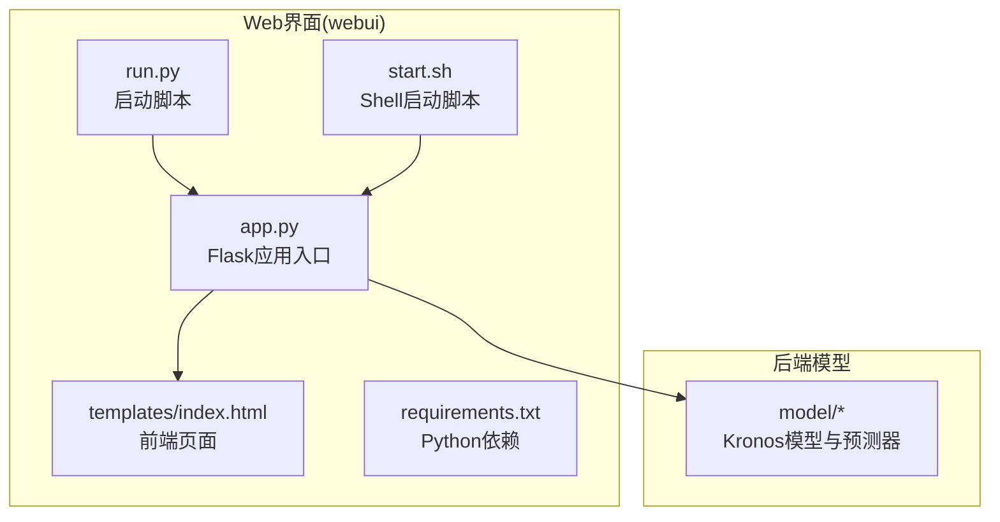
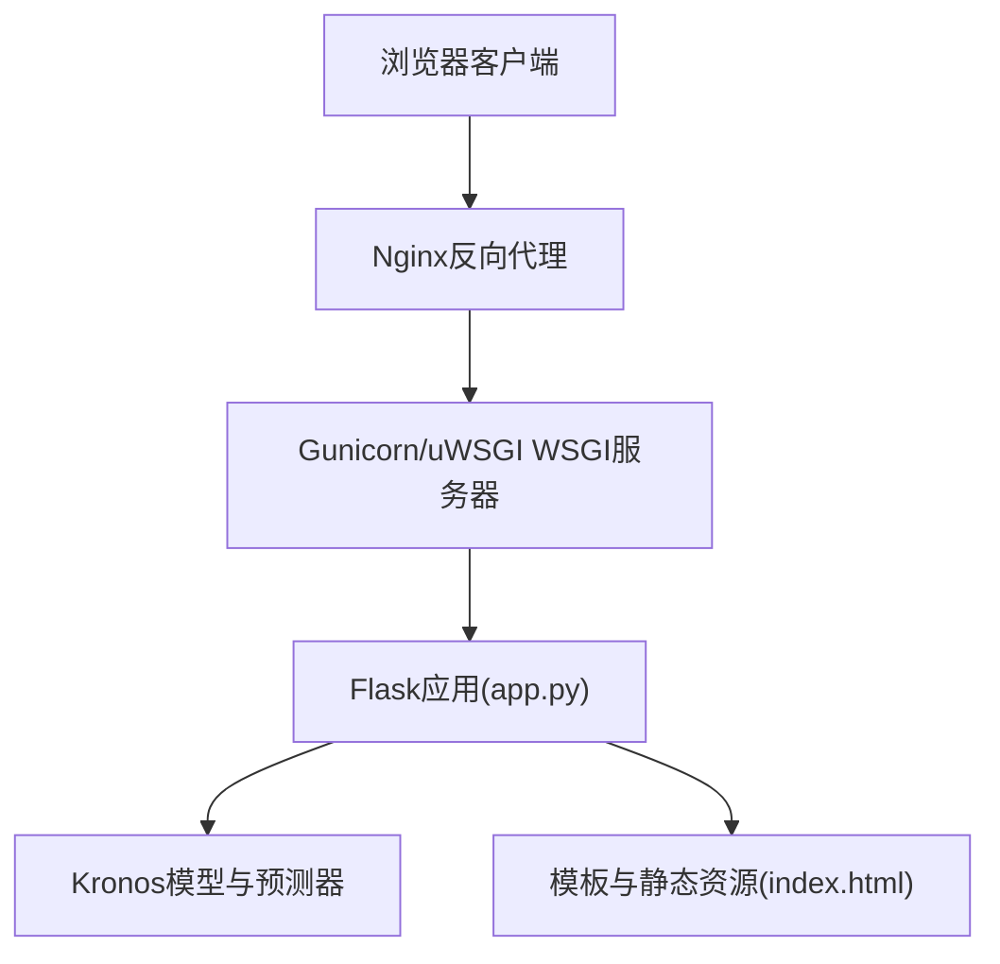
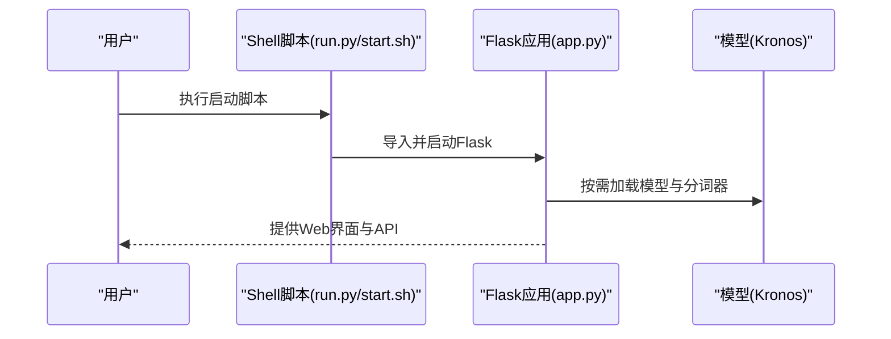
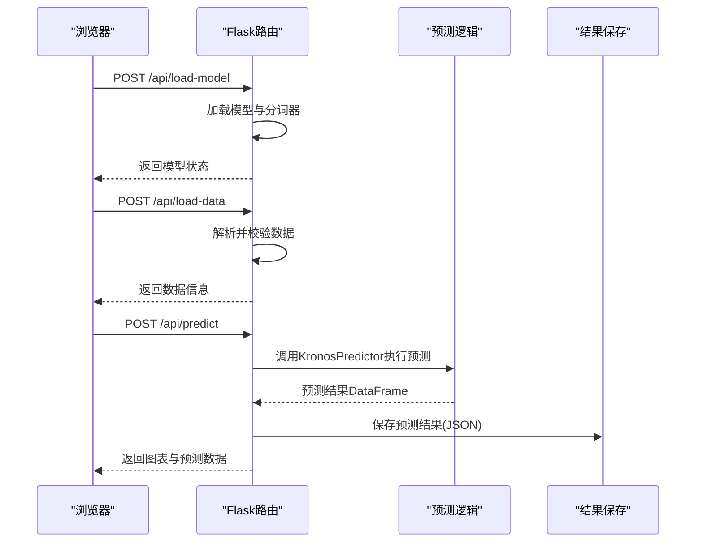
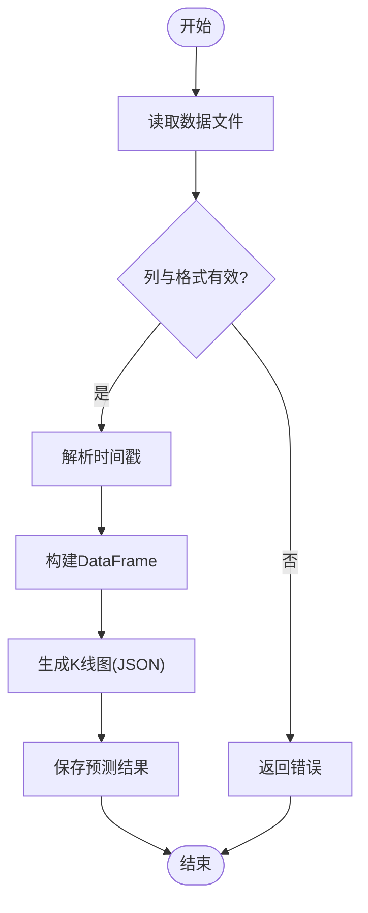
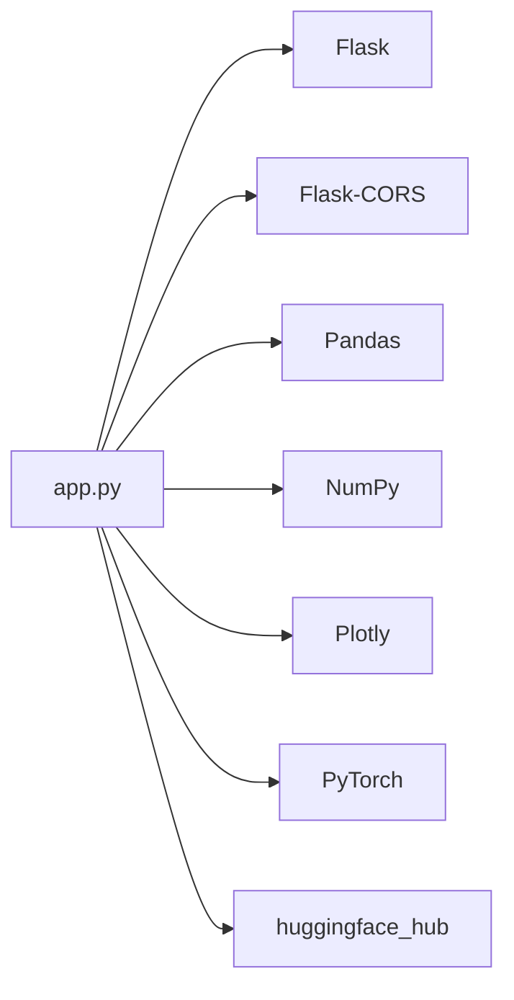

# Web界面部署

<cite>
**本文引用的文件**   
- [webui/app.py](file://webui/app.py)
- [webui/run.py](file://webui/run.py)
- [webui/start.sh](file://webui/start.sh)
- [webui/requirements.txt](file://webui/requirements.txt)
- [webui/templates/index.html](file://webui/templates/index.html)
- [webui/README.md](file://webui/README.md)
- [README.md](file://README.md)
</cite>

## 目录
1. [简介](#简介)
2. [项目结构](#项目结构)
3. [核心组件](#核心组件)
4. [架构总览](#架构总览)
5. [详细组件分析](#详细组件分析)
6. [依赖分析](#依赖分析)
7. [性能考虑](#性能考虑)
8. [故障排查指南](#故障排查指南)
9. [结论](#结论)
10. [附录](#附录)

## 简介
本指南面向Kronos Web界面（Flask）的生产级部署，覆盖以下主题：
- Flask应用的启动配置、端口与进程管理
- WSGI服务器（Gunicorn、uWSGI）配置与性能调优
- Nginx反向代理、静态资源与SSL配置
- Docker容器化与Kubernetes部署清单
- 负载均衡、会话管理与并发优化
- 健康检查、优雅停机与自动重启

## 项目结构
Web界面位于webui目录，核心入口为Flask应用，前端模板与静态资源由Flask托管。

图表来源
- [webui/app.py:1-709](file://webui/app.py#L1-L709)
- [webui/templates/index.html:1-1239](file://webui/templates/index.html#L1-L1239)
- [webui/requirements.txt:1-8](file://webui/requirements.txt#L1-L8)
- [webui/run.py:1-90](file://webui/run.py#L1-L90)
- [webui/start.sh:1-41](file://webui/start.sh#L1-L41)

章节来源
- [webui/app.py:1-709](file://webui/app.py#L1-L709)
- [webui/requirements.txt:1-8](file://webui/requirements.txt#L1-L8)
- [webui/run.py:1-90](file://webui/run.py#L1-L90)
- [webui/start.sh:1-41](file://webui/start.sh#L1-L41)

## 核心组件
- Flask应用：提供REST接口与模板渲染，监听0.0.0.0:7070，默认开发模式运行。
- 前端页面：index.html通过Axios调用后端API，展示预测结果与对比分析。
- 启动方式：支持直接运行app.py、run.py脚本或start.sh脚本。
- 依赖：Flask、Flask-CORS、Pandas、NumPy、Plotly、PyTorch、huggingface_hub等。

章节来源
- [webui/app.py:330-709](file://webui/app.py#L330-L709)
- [webui/templates/index.html:1-1239](file://webui/templates/index.html#L1-L1239)
- [webui/run.py:38-90](file://webui/run.py#L38-L90)
- [webui/start.sh:34-41](file://webui/start.sh#L34-L41)
- [webui/requirements.txt:1-8](file://webui/requirements.txt#L1-L8)

## 架构总览
Web界面采用“浏览器前端 + Flask后端 + Hugging Face模型”的三层架构。前端通过Axios访问后端API；后端负责数据加载、模型推理与图表生成；模型库在可用时启用真实预测，否则使用模拟数据演示。

图表来源
- [webui/app.py:330-709](file://webui/app.py#L330-L709)
- [webui/templates/index.html:636-800](file://webui/templates/index.html#L636-L800)

## 详细组件分析

### Flask应用启动与进程管理
- 默认监听地址与端口：0.0.0.0:7070
- 运行模式：开发模式（debug=True），生产环境建议关闭调试
- 进程管理：可使用systemd、supervisord或容器编排工具进行守护与自动重启
- 环境变量：可通过环境变量控制Flask应用与环境（如FLASK_APP、FLASK_ENV）

图表来源
- [webui/run.py:66-82](file://webui/run.py#L66-L82)
- [webui/start.sh:34-41](file://webui/start.sh#L34-L41)
- [webui/app.py:700-709](file://webui/app.py#L700-L709)

章节来源
- [webui/app.py:700-709](file://webui/app.py#L700-L709)
- [webui/run.py:66-82](file://webui/run.py#L66-L82)
- [webui/start.sh:34-41](file://webui/start.sh#L34-L41)

### API工作流（预测）

图表来源
- [webui/app.py:626-671](file://webui/app.py#L626-L671)
- [webui/app.py:341-403](file://webui/app.py#L341-L403)
- [webui/app.py:404-624](file://webui/app.py#L404-L624)

章节来源
- [webui/app.py:626-671](file://webui/app.py#L626-L671)
- [webui/app.py:341-403](file://webui/app.py#L341-L403)
- [webui/app.py:404-624](file://webui/app.py#L404-L624)

### 数据加载与图表生成
- 数据格式：CSV/Feather，要求列包含open、high、low、close；可选volume、amount、timestamps/timestamp/date
- 时间戳处理：自动识别并转换，确保时间连续性
- 图表生成：使用Plotly生成K线图，支持历史、预测与实际数据对比

图表来源
- [webui/app.py:78-124](file://webui/app.py#L78-L124)
- [webui/app.py:209-328](file://webui/app.py#L209-L328)

章节来源
- [webui/app.py:78-124](file://webui/app.py#L78-L124)
- [webui/app.py:209-328](file://webui/app.py#L209-L328)

### 前端交互与模型状态
- 前端通过Axios调用后端API，动态更新模型选择、设备选择、数据加载与预测按钮状态
- 模型状态查询与加载：/api/available-models、/api/model-status、/api/load-model

章节来源
- [webui/templates/index.html:667-751](file://webui/templates/index.html#L667-L751)
- [webui/app.py:665-698](file://webui/app.py#L665-L698)

## 依赖分析
- Python依赖集中在requirements.txt，包括Flask、Flask-CORS、Pandas、NumPy、Plotly、PyTorch、huggingface_hub
- 前端依赖通过CDN引入Plotly与Axios，无需额外打包

图表来源
- [webui/requirements.txt:1-8](file://webui/requirements.txt#L1-L8)
- [webui/app.py:1-25](file://webui/app.py#L1-L25)

章节来源
- [webui/requirements.txt:1-8](file://webui/requirements.txt#L1-L8)
- [webui/app.py:1-25](file://webui/app.py#L1-L25)

## 性能考虑
- 并发与进程
  - 开发：单进程单线程（debug=True）
  - 生产：使用Gunicorn多进程或多线程；或uWSGI异步模式
- 内存与GPU
  - 设备选择：CPU/CUDA/MPS；优先CUDA以获得最佳性能
  - 上下文长度：Kronos-small/base上下文长度为512，避免超限
- I/O与缓存
  - 静态资源：由Nginx提供，减少WSGI进程压力
  - 结果缓存：可考虑Redis缓存预测结果，降低重复计算
- 超时与重试
  - Nginx超时与后端超时需匹配，避免请求中断
  - 前端对长任务增加轮询或WebSocket推送

章节来源
- [webui/app.py:626-663](file://webui/app.py#L626-L663)
- [README.md:89-99](file://README.md#L89-L99)

## 故障排查指南
- 端口占用
  - 修改端口：在启动脚本或Flask.run中调整端口
- 缺失依赖
  - 安装依赖：pip install -r requirements.txt
- 模型加载失败
  - 检查网络连通性与模型ID；首次加载可能需要下载
- 数据格式错误
  - 确保列名与格式正确（open/high/low/close等）
- 日志查看
  - 启动日志包含模型状态与错误信息，便于定位问题

章节来源
- [webui/README.md:111-120](file://webui/README.md#L111-L120)
- [webui/run.py:84-86](file://webui/run.py#L84-L86)
- [webui/start.sh:22-32](file://webui/start.sh#L22-L32)

## 结论
本指南提供了从本地开发到生产部署的完整路径：明确Flask启动参数与进程管理、WSGI服务器配置与调优、Nginx反向代理与静态资源、容器化与Kubernetes部署、以及健康检查与自动重启策略。结合上述实践，可在不同规模环境中稳定运行Kronos Web界面。

## 附录

### Flask启动配置与端口
- 默认监听：0.0.0.0:7070
- 开发模式：debug=True
- 生产模式：关闭debug，使用WSGI服务器

章节来源
- [webui/app.py:700-709](file://webui/app.py#L700-L709)

### WSGI服务器配置与调优（通用建议）
- Gunicorn
  - 进程数：CPU核数×2+1
  - 线程数：每个worker线程数依据I/O密集度调整
  - 绑定：127.0.0.1:PORT 或 unix:/tmp/gunicorn.sock
  - 日志：accesslog、errorlog、access_log_format
- uWSGI
  - 进程与线程：gevent或asyncio模式
  - 吞吐量：listen-backlog、so-rcvbuf、so-sndbuf
  - 自动重启：max-requests、max-requests-delta

[本节为通用实践说明，不直接对应具体源码文件]

### Nginx反向代理、静态文件与SSL
- 反代：将HTTP请求转发至WSGI进程
- 静态文件：由Nginx直接提供，提升性能
- SSL：启用HTTPS，配置证书与密钥；开启HSTS与安全头

[本节为通用实践说明，不直接对应具体源码文件]

### Docker容器化部署（通用步骤）
- 基础镜像：python:3.x-alpine或python:3.x-slim
- 安装系统依赖：若需要
- 复制requirements.txt并安装Python依赖
- 复制应用代码与模板
- 暴露端口：7070
- 启动命令：gunicorn或python -m gunicorn
- 健康检查：curl /health 或 /api/model-status

[本节为通用实践说明，不直接对应具体源码文件]

### Kubernetes部署清单（通用要点）
- Deployment：副本数、资源限制、探针
- Service：ClusterIP/NodePort/LoadBalancer
- Ingress：TLS、路径转发、超时配置
- ConfigMap/Secret：环境变量与证书
- HPA：基于CPU/内存或自定义指标扩缩容

[本节为通用实践说明，不直接对应具体源码文件]

### 负载均衡、会话管理与并发优化
- 负载均衡：Nginx/HAProxy/云LB
- 会话：无状态设计；必要时使用Redis存储会话
- 并发：多进程+多线程组合；避免阻塞操作；使用异步I/O

[本节为通用实践说明，不直接对应具体源码文件]

### 健康检查、优雅停机与自动重启
- 健康检查：/api/model-status 或 /api/available-models
- 优雅停机：信号处理（SIGTERM/SIGINT），清理资源
- 自动重启：systemd/supervisord/容器重启策略

[本节为通用实践说明，不直接对应具体源码文件]