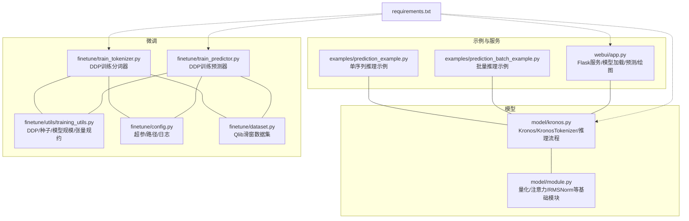
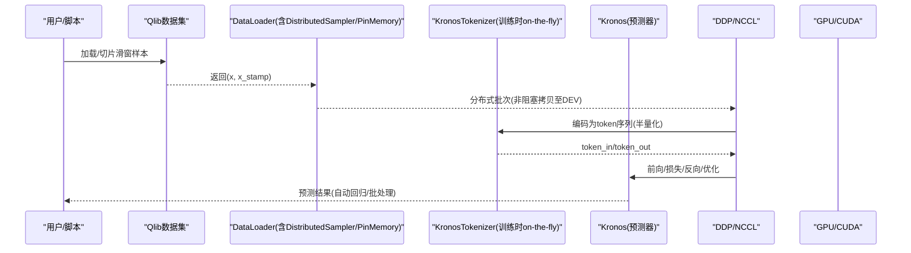
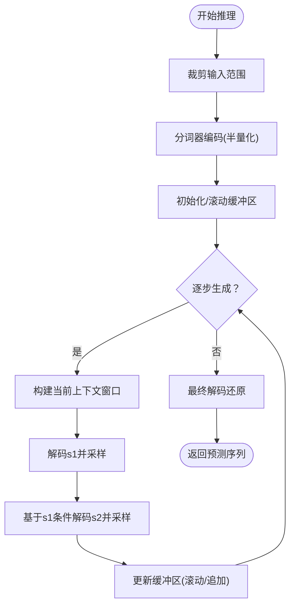
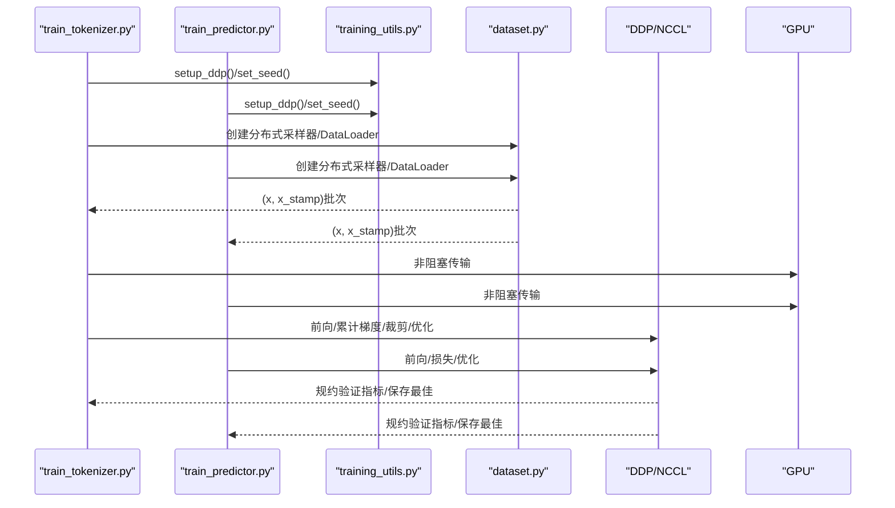
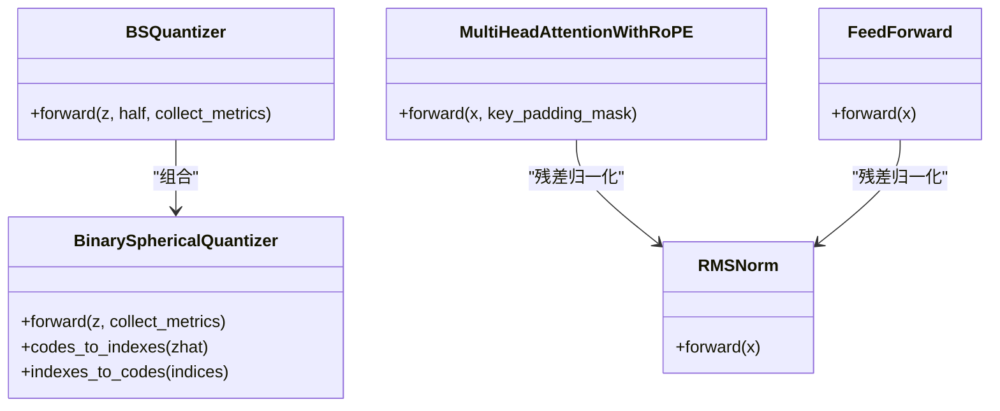
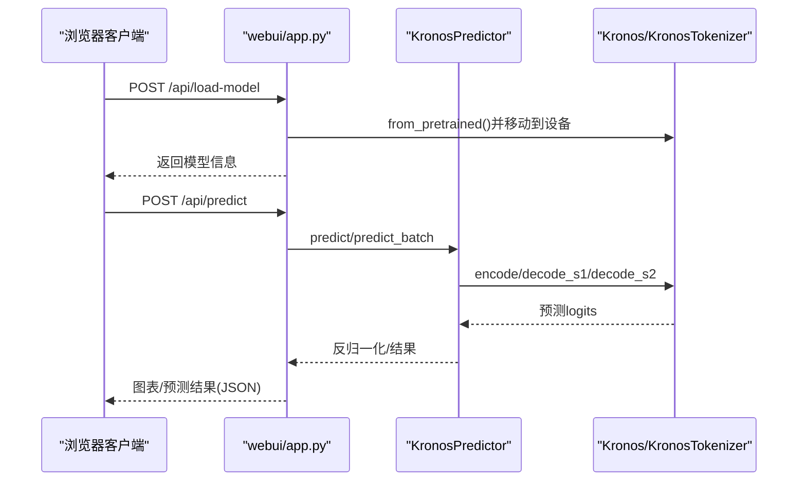
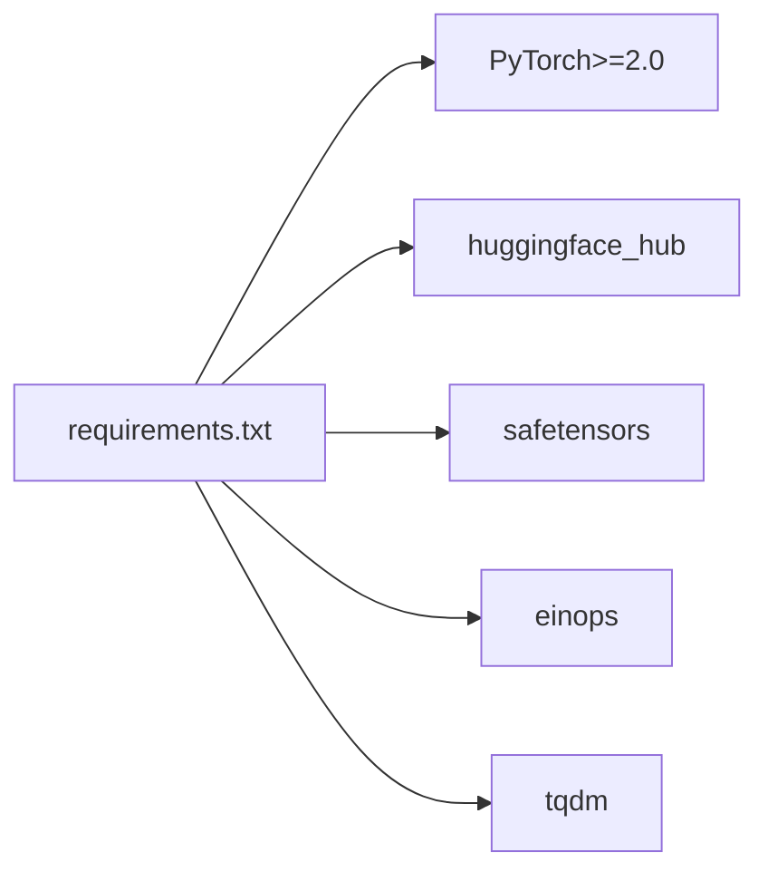

# 性能优化

<cite>
**本文引用的文件**
- [model/kronos.py](file://model/kronos.py)
- [model/module.py](file://model/module.py)
- [finetune/train_tokenizer.py](file://finetune/train_tokenizer.py)
- [finetune/train_predictor.py](file://finetune/train_predictor.py)
- [finetune/utils/training_utils.py](file://finetune/utils/training_utils.py)
- [finetune/config.py](file://finetune/config.py)
- [finetune/dataset.py](file://finetune/dataset.py)
- [webui/app.py](file://webui/app.py)
- [examples/prediction_example.py](file://examples/prediction_example.py)
- [examples/prediction_batch_example.py](file://examples/prediction_batch_example.py)
- [requirements.txt](file://requirements.txt)
</cite>

## 目录
1. [简介](#简介)
2. [项目结构](#项目结构)
3. [核心组件](#核心组件)
4. [架构总览](#架构总览)
5. [详细组件分析](#详细组件分析)
6. [依赖分析](#依赖分析)
7. [性能考虑](#性能考虑)
8. [故障排查指南](#故障排查指南)
9. [结论](#结论)
10. [附录](#附录)

## 简介
本指南聚焦于Kronos模型在训练与推理阶段的性能优化实践，结合仓库中已实现的分布式训练、数据加载、自动回归推理与WebUI服务等模块，系统性梳理可落地的优化策略与最佳实践。内容覆盖：
- 训练侧：分布式数据并行（DDP）、梯度累积、学习率调度、混合精度与梯度检查点（建议项）
- 推理侧：上下文窗口裁剪、采样策略、批处理并行、设备选择与内存管理
- 基础设施：CUDA后端、NCCL通信、PinMemory、非阻塞传输
- 可扩展优化：ONNX/TensorRT导出、模型量化、缓存与预计算、异步处理

## 项目结构
Kronos项目采用“模型-微调-示例-WebUI”的分层组织方式，便于在不同阶段进行性能优化与验证。

图表来源
- [model/kronos.py](file://model/kronos.py)
- [model/module.py](file://model/module.py)
- [finetune/train_tokenizer.py](file://finetune/train_tokenizer.py)
- [finetune/train_predictor.py](file://finetune/train_predictor.py)
- [finetune/utils/training_utils.py](file://finetune/utils/training_utils.py)
- [finetune/config.py](file://finetune/config.py)
- [finetune/dataset.py](file://finetune/dataset.py)
- [examples/prediction_example.py](file://examples/prediction_example.py)
- [examples/prediction_batch_example.py](file://examples/prediction_batch_example.py)
- [webui/app.py](file://webui/app.py)
- [requirements.txt](file://requirements.txt)

章节来源
- [model/kronos.py](file://model/kronos.py)
- [model/module.py](file://model/module.py)
- [finetune/train_tokenizer.py](file://finetune/train_tokenizer.py)
- [finetune/train_predictor.py](file://finetune/train_predictor.py)
- [finetune/utils/training_utils.py](file://finetune/utils/training_utils.py)
- [finetune/config.py](file://finetune/config.py)
- [finetune/dataset.py](file://finetune/dataset.py)
- [examples/prediction_example.py](file://examples/prediction_example.py)
- [examples/prediction_batch_example.py](file://examples/prediction_batch_example.py)
- [webui/app.py](file://webui/app.py)
- [requirements.txt](file://requirements.txt)

## 核心组件
- 模型与分词器
  - Kronos：层次化嵌入、Transformer块、RMSNorm、依赖感知交叉注意力、双头输出（s1/s2）。
  - KronosTokenizer：编码器-解码器结构，结合二进制球面量化（Binary Spherical Quantizer），支持半量化的s1/s2位组合。
- 训练与推理
  - 自动回归推理函数：按最大上下文窗口滑动，逐步采样生成，支持温度与Top-k/Top-p采样。
  - 预测器封装：设备选择（自动检测CUDA/MPS/CPU）、归一化/反归一化、批处理并行。
- 分布式训练
  - DDP初始化、进程组、NCCL后端、分布式采样、梯度累积、OneCycleLR、梯度裁剪。
- 数据与配置
  - Qlib滑窗数据集、时间特征工程、实例归一化、随机种子设置。
- WebUI
  - Flask服务、模型加载、预测执行、结果保存与可视化。

章节来源
- [model/kronos.py](file://model/kronos.py)
- [model/module.py](file://model/module.py)
- [finetune/train_tokenizer.py](file://finetune/train_tokenizer.py)
- [finetune/train_predictor.py](file://finetune/train_predictor.py)
- [finetune/dataset.py](file://finetune/dataset.py)
- [webui/app.py](file://webui/app.py)

## 架构总览
下图展示从数据到模型再到推理与服务的整体流程，以及分布式训练的关键节点。

图表来源
- [finetune/dataset.py](file://finetune/dataset.py)
- [finetune/train_tokenizer.py](file://finetune/train_tokenizer.py)
- [finetune/train_predictor.py](file://finetune/train_predictor.py)
- [model/kronos.py](file://model/kronos.py)

## 详细组件分析

### 组件A：自动回归推理与上下文窗口管理
- 关键点
  - 使用最大上下文长度裁剪历史窗口，避免线性增长的注意力复杂度。
  - 通过缓冲区滚动更新，维持固定窗口内的s1/s2 token索引。
  - 支持温度与Top-k/Top-p采样，提升多样性与稳定性。
- 性能要点
  - 固定缓冲区尺寸与连续切片，减少内存碎片与复制开销。
  - 非阻塞传输至设备，配合批内并行采样降低等待时间。

图表来源
- [model/kronos.py](file://model/kronos.py)

章节来源
- [model/kronos.py](file://model/kronos.py)

### 组件B：分布式训练流水线（分词器与预测器）
- 分词器训练
  - DDP初始化与NCCL后端；分布式采样；梯度累积；OneCycleLR；梯度裁剪；验证指标规约。
- 预测器训练
  - 同上；额外使用DDP包裹模型；在验证阶段进行全局损失规约；仅主进程保存最佳模型。
- 工具函数
  - 设置随机种子、模型规模统计、张量规约、时间格式化。

图表来源
- [finetune/train_tokenizer.py](file://finetune/train_tokenizer.py)
- [finetune/train_predictor.py](file://finetune/train_predictor.py)
- [finetune/utils/training_utils.py](file://finetune/utils/training_utils.py)
- [finetune/dataset.py](file://finetune/dataset.py)

章节来源
- [finetune/train_tokenizer.py](file://finetune/train_tokenizer.py)
- [finetune/train_predictor.py](file://finetune/train_predictor.py)
- [finetune/utils/training_utils.py](file://finetune/utils/training_utils.py)
- [finetune/dataset.py](file://finetune/dataset.py)

### 组件C：量化与注意力模块
- 二进制球面量化（BSQuantizer）
  - 将浮点表示投影到超球面，使用二进制码本近似，支持软熵正则与提交损失。
  - 半量化模式将s1/s2位分离，降低码本维度与存储压力。
- 注意力与位置编码
  - RoPE旋转位置编码，结合原生SDPA，支持因果掩码与dropout。
- 归一化与前馈
  - RMSNorm与SwiGLU风格前馈，兼顾效率与稳定性。

图表来源
- [model/module.py](file://model/module.py)

章节来源
- [model/module.py](file://model/module.py)

### 组件D：WebUI服务与批处理推理
- 服务端点
  - 加载模型、预测、图表生成、结果保存。
- 批处理推理
  - 多序列并行预测，要求历史长度与预测长度一致，内部自动平均采样。
- 设备选择
  - 自动检测CUDA/MPS/CPU，优先GPU。

图表来源
- [webui/app.py](file://webui/app.py)
- [model/kronos.py](file://model/kronos.py)

章节来源
- [webui/app.py](file://webui/app.py)
- [model/kronos.py](file://model/kronos.py)

## 依赖分析
- 运行时依赖
  - PyTorch≥2.0、einops、huggingface_hub、safetensors、tqdm等。
- 分布式与通信
  - torch.distributed + NCCL；Dataloader启用pin_memory与非阻塞传输。
- 数据与特征
  - Qlib数据预处理、滑窗构造、时间特征工程、实例归一化。

图表来源
- [requirements.txt](file://requirements.txt)

章节来源
- [requirements.txt](file://requirements.txt)

## 性能考虑

### 训练侧优化
- 分布式数据并行（DDP）
  - 使用NCCL后端，确保环境变量齐全；每进程绑定唯一GPU；分布式采样器保证数据均衡。
  - 在训练/验证循环中使用非阻塞传输至GPU，减少CPU-GPU同步等待。
- 学习率与优化
  - OneCycleLR用于快速收敛；梯度裁剪防止爆炸；AdamW权重衰减稳定训练。
- 梯度累积
  - 通过配置项实现有效批次扩大，缓解显存限制。
- 混合精度与梯度检查点（建议）
  - 建议在训练脚本中引入torch.cuda.amp GradScaler与torch.utils.checkpoint以进一步降低显存占用与加速训练。
- 日志与评估
  - 主进程记录指标，避免重复打印；验证阶段进行全局规约，确保跨进程一致性。

章节来源
- [finetune/train_tokenizer.py](file://finetune/train_tokenizer.py)
- [finetune/train_predictor.py](file://finetune/train_predictor.py)
- [finetune/utils/training_utils.py](file://finetune/utils/training_utils.py)

### 推理侧优化
- 上下文窗口与序列长度
  - 通过最大上下文长度控制注意力计算复杂度；自动回归按窗口滑动，避免一次性展开全序列。
- 采样策略
  - 温度与Top-k/Top-p采样平衡多样性与稳定性；批内并行采样提升吞吐。
- 批处理并行
  - WebUI与示例均支持多序列并行，要求输入长度一致；内部对预测结果做均值聚合。
- 设备与内存
  - 自动检测CUDA/MPS/CPU；必要时将模型与张量移至设备；避免不必要的数据复制。
- 缓存与预计算
  - 对于固定时间特征与分词器编码，可在推理前进行预计算并复用（需根据实际场景权衡内存）。
- 异步处理
  - WebUI中可将数据加载与模型推理解耦，使用队列或异步任务框架（如Celery）提升响应性。

章节来源
- [model/kronos.py](file://model/kronos.py)
- [examples/prediction_example.py](file://examples/prediction_example.py)
- [examples/prediction_batch_example.py](file://examples/prediction_batch_example.py)
- [webui/app.py](file://webui/app.py)

### 推理加速（可选扩展）
- ONNX导出
  - 将推理子图导出为ONNX，结合TensorRT或OpenVINO进行部署加速。
- TensorRT集成
  - 在支持的硬件上启用FP16/INT8校准，结合动态形状优化吞吐。
- 模型量化
  - 在不显著损失精度的前提下，采用INT8/动态量化进一步压缩模型体积与加速推理。
- 缓存与预计算
  - 对静态特征（如时间戳编码）进行缓存；对热点token索引进行预计算与复用。
- 异步处理
  - 将数据预处理与模型推理异步化，利用多线程/多进程提升整体吞吐。

[本节为通用指导，不直接分析具体文件]

### 基准测试与瓶颈分析
- 基准测试
  - 使用统一的数据集与批大小，记录端到端延迟与吞吐；对比不同上下文长度与采样参数的影响。
- 工具与指标
  - 利用PyTorch Profiler/NSight Systems/NVIDIA Nsight Compute定位瓶颈；关注数据加载、前向计算、反向传播与通信阶段。
- 参数调优建议
  - 批大小与梯度累积步数的权衡；上下文长度与序列长度的折中；采样温度与Top-p的敏感性扫描。

[本节为通用指导，不直接分析具体文件]

## 故障排查指南
- 分布式训练常见问题
  - 环境变量缺失导致DDP初始化失败；NCCL后端不可用或版本不匹配；进程间通信异常。
  - 解决：确认torchrun启动方式、CUDA可见设备、网络连通性；检查rank/world_size/local_rank打印。
- 数据加载与内存
  - DataLoader pin_memory与num_workers配置不当导致CPU瓶颈；非阻塞传输未生效。
  - 解决：合理设置num_workers与pin_memory；确保张量在进入GPU前完成非阻塞拷贝。
- 推理异常
  - 输入数据缺失列或存在NaN；时间戳类型不匹配；上下文长度不足。
  - 解决：严格校验输入列与类型；确保时间戳为Series；补齐或裁剪序列长度。
- WebUI服务
  - 模型加载失败或未找到可用模型；端口冲突或CORS问题。
  - 解决：检查模型ID与本地路径；确认端口可用与CORS配置。

章节来源
- [finetune/utils/training_utils.py](file://finetune/utils/training_utils.py)
- [finetune/dataset.py](file://finetune/dataset.py)
- [webui/app.py](file://webui/app.py)

## 结论
Kronos项目在训练与推理层面已具备良好的分布式与内存管理基础。为进一步提升性能，建议在现有基础上引入混合精度与梯度检查点、ONNX/TensorRT加速、模型量化与缓存预计算，并通过系统化的基准测试与工具链定位瓶颈，持续迭代优化。

[本节为总结性内容，不直接分析具体文件]

## 附录

### A. 训练与推理关键参数参考
- 训练
  - batch_size、accumulation_steps、OneCycleLR参数、梯度裁剪阈值、学习率与权重衰减。
- 推理
  - max_context、T（温度）、top_k/top_p、sample_count、设备选择。

章节来源
- [finetune/config.py](file://finetune/config.py)
- [finetune/train_tokenizer.py](file://finetune/train_tokenizer.py)
- [finetune/train_predictor.py](file://finetune/train_predictor.py)
- [model/kronos.py](file://model/kronos.py)